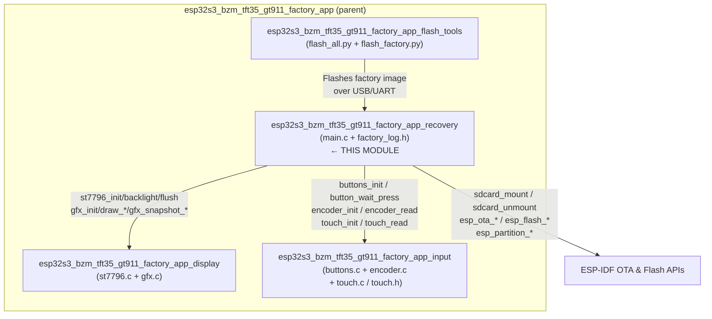
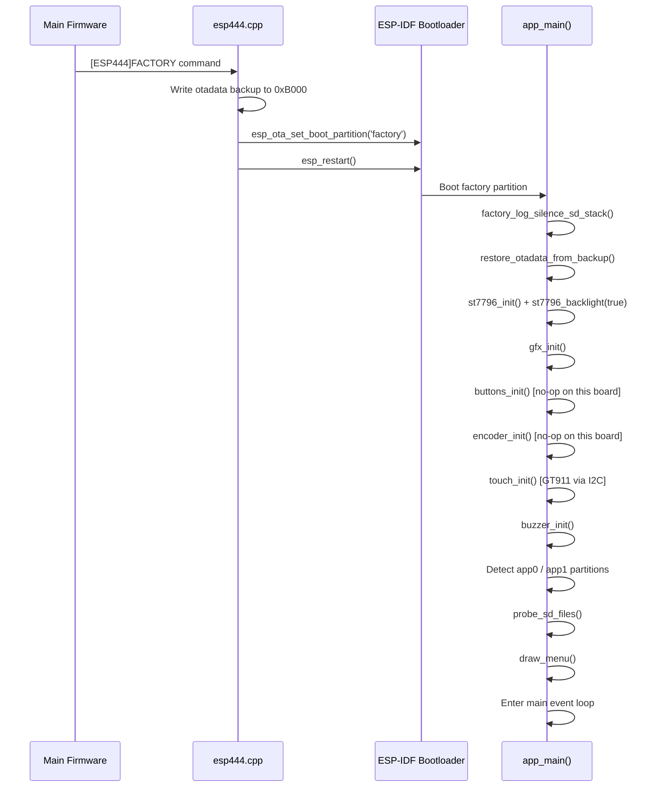
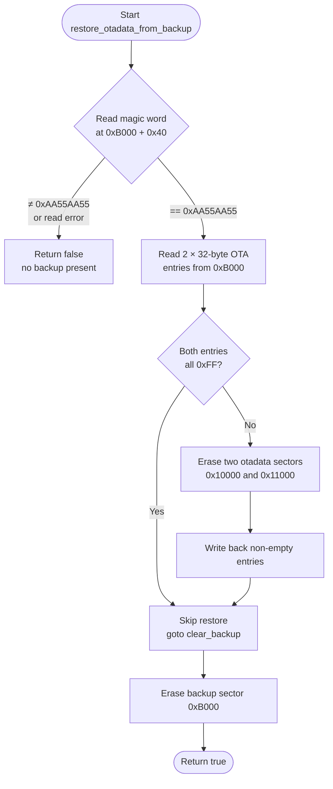
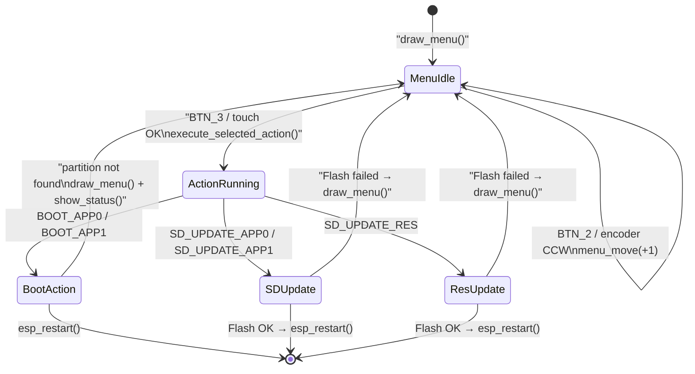
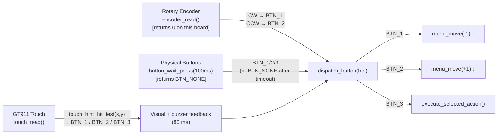
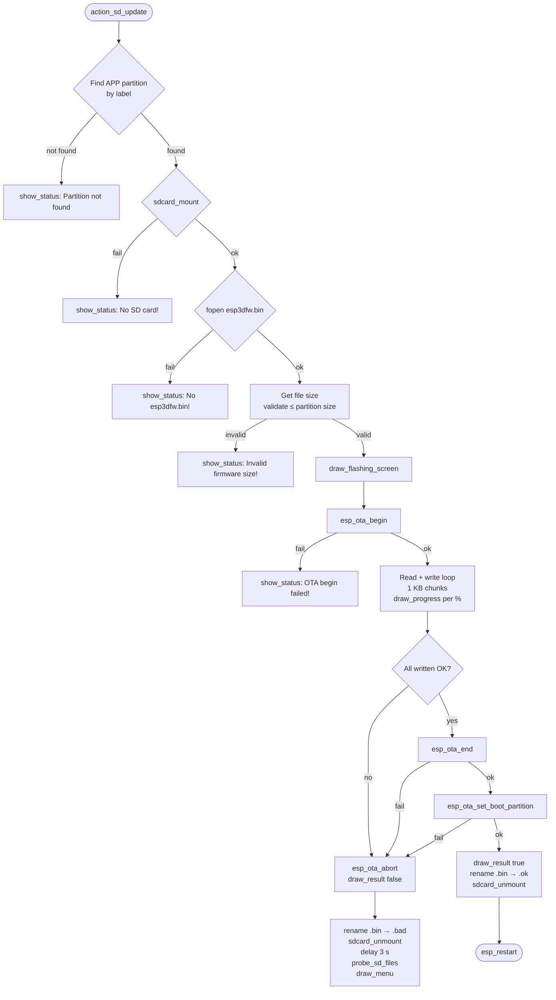
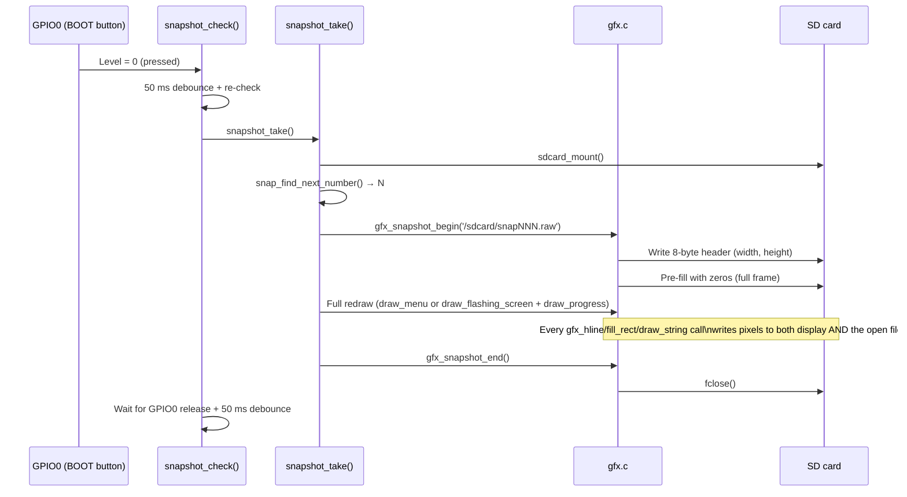
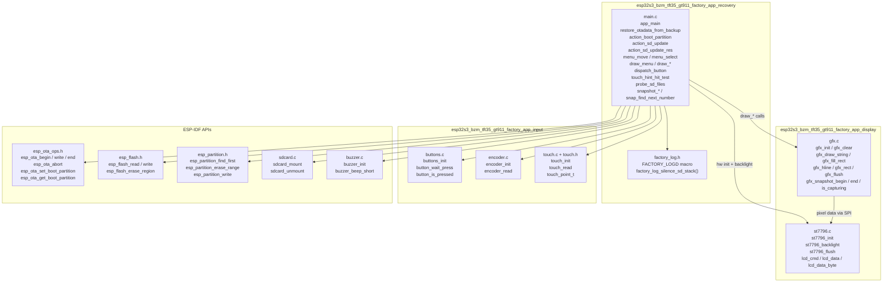
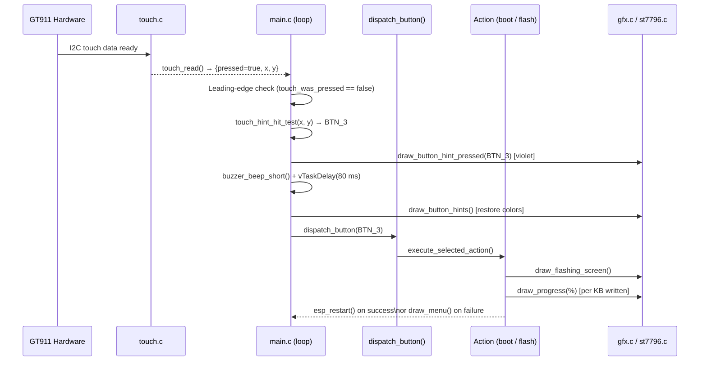

# esp32s3_bzm_tft35_gt911_factory_app_recovery

Recovery partition application for the **ESP32-S3 BZM TFT35 GT911** board — a 320×480 portrait-format panel with a GT911 capacitive touchscreen. This module contains the core recovery logic (`main.c`) and the compile-time debug-logging gate (`factory_log.h`). It is one of four child modules of [`esp32s3_bzm_tft35_gt911_factory_app`](esp32s3_bzm_tft35_gt911_factory_app.md).

The recovery app presents a touch-navigable menu that lets an operator:
- Boot directly into **app0** or **app1**
- Flash a new firmware image (`esp3dfw.bin`) from SD card to **app0** or **app1**
- Flash new UI resources (`ui_resources.bin`) from SD card to the **ui_resources** partition

Because this board has no physical buttons or encoder, navigation is done exclusively through three large **virtual touch zones** rendered in the bottom bar of the screen (↑ / ↓ / ✓).

---

## Table of Contents

1. [Module Architecture](#1-module-architecture)
2. [Hardware Context](#2-hardware-context)
3. [Entry Point & Startup Sequence](#3-entry-point--startup-sequence)
4. [OTA Backup & Restore Mechanism](#4-ota-backup--restore-mechanism)
5. [Menu System](#5-menu-system)
6. [UI Layout & Rendering](#6-ui-layout--rendering)
7. [Input Handling](#7-input-handling)
8. [SD Card Update Flow](#8-sd-card-update-flow)
9. [Snapshot Feature (Debug)](#9-snapshot-feature-debug)
10. [Logging System](#10-logging-system)
11. [Key Constants & Configuration](#11-key-constants--configuration)
12. [Component Dependency Map](#12-component-dependency-map)

---

## 1. Module Architecture

This recovery module is the application-level orchestrator. It depends on three peer sibling modules plus shared ESP-IDF APIs:



### Child Module Responsibilities

| Module | Files | Responsibility |
|---|---|---|
| **recovery** (this module) | `main.c`, `factory_log.h` | App entry point, menu logic, OTA backup/restore, SD flash, touch virtual buttons |
| **display** | `st7796.c`, `gfx.c` | ST7796 SPI init, pixel rendering, snapshot capture |
| **input** | `buttons.c`, `encoder.c`, `touch.c`, `touch.h` | Physical buttons (no-ops), quadrature encoder (no-ops), GT911 capacitive touch |
| **flash_tools** | `flash_all.py`, `flash_factory.py` | PC-side scripts to flash the factory partition over USB |

> See [esp32s3_bzm_tft35_gt911_factory_app_display.md](esp32s3_bzm_tft35_gt911_factory_app_display.md) and [esp32s3_bzm_tft35_gt911_factory_app_input.md](esp32s3_bzm_tft35_gt911_factory_app_input.md) for sibling module details.

---

## 2. Hardware Context

| Feature | Detail |
|---|---|
| SoC | ESP32-S3 |
| Display | 3.5″ TFT, 320×480 px, portrait |
| Display controller | ST7796 via SPI |
| Touch controller | GT911 capacitive multi-touch (I2C) |
| Physical buttons | **None** — all `BUTTON_n_PIN = GPIO_NUM_NC` |
| Rotary encoder | **None** — `ENCODER_A/B_PIN = GPIO_NUM_NC` |
| Buzzer | Present in init; pin may be NC |
| SD card | SPI-attached microSD via `sdcard.c` |
| Screen coordinates | Origin top-left; rotation via `SCREEN_ROTATION` MADCTL byte |

**Key implication:** The board's entire user interaction path runs through the GT911 touch layer. `buttons_init()` and `encoder_init()` are called for cross-board code compatibility but both silently skip GPIO setup when pins are `GPIO_NUM_NC`.

**Layout scaling:** The factory app layout is scaled **×4/3** relative to the 240×320 reference board (pibot_pendant_v1_0 / esp32_2432s028r). For example:
- Font size: 8×16 → 11×21 px
- Button circle radius: 20 → 27 px
- Menu item height: 30 → 40 px

---

## 3. Entry Point & Startup Sequence

The recovery app is stored in the **factory** OTA partition and is booted by the main firmware via the `[ESP444]FACTORY` command (`esp444.cpp`). Unlike other boards, this board has **no custom bootloader hook** (no physical button to hold at power-on). The `ENABLE_CUSTOM_BOOT_LOADER` flag is not set in its `CMakeLists.txt`.



### `app_main()` Step-by-Step

1. **Silence SD log chatter** — calls `factory_log_silence_sd_stack()` before any SD mount operations.
2. **Restore otadata** — calls `restore_otadata_from_backup()` to reinstate the original boot partition metadata. This ensures a power-cycle from inside the recovery app returns to the correct OTA slot, not the factory partition.
3. **Display init** — `st7796_init()` configures the SPI bus, sends the MADCTL / pixel-format / gamma init sequence to the ST7796 controller, then `st7796_backlight(true)` enables the backlight. Aborts on failure (200 ms delay before `abort()` to flush UART).
4. **GFX init** — `gfx_init()` (lightweight; snapshot file state is on-demand).
5. **Peripheral init** — buttons, encoder, touch, buzzer — all safe no-ops if pins are `GPIO_NUM_NC`.
6. **Partition discovery** — `esp_partition_find_first()` checks for `app1`; sets `has_app1`.
7. **Menu build** — Constructs `menu_items[]` array: always `Boot app0`, `SD→app0`, `SD→resources`; adds `app1` variants when present.
8. **SD probe** — `probe_sd_files()` mounts/unmounts SD to check for `esp3dfw.bin` and `ui_resources.bin`.
9. **Draw menu** — `draw_menu()` renders the full screen.
10. **Main loop** — polls encoder, buttons (via `button_wait_press(100 ms)`), and touch; dispatches to `dispatch_button()`.

---

## 4. OTA Backup & Restore Mechanism

### Background

When the main firmware executes `[ESP444]FACTORY`, it:
1. Writes the two active OTA data entries (each 32 bytes) into a **backup sector at flash offset `0xB000`**.
2. Writes a magic word `0xAA55AA55` at `backup_offset + 0x40`.
3. Calls `esp_ota_set_boot_partition("factory")` and reboots.

The recovery app restores this backup **at startup**, before any user interaction, so that:
- A **power cycle** during or after recovery boots back into the original OTA partition.
- Explicitly booting app0/app1 from the recovery menu calls `esp_ota_set_boot_partition()` again before rebooting — this is a separate, intentional operation.

### Flash Layout Constraints

```
0x0000  Bootloader
  ...
0xB000  ← OTADATA_BACKUP_OFFSET (must sit in this gap, 4 KB-aligned)
  ...
0xC000  Partition table (CONFIG_PARTITION_TABLE_OFFSET)
0xD000  NVS partition (first app partition)
  ...
0x10000 OTA data (OTADATA_OFFSET) — two consecutive 4 KB sectors
```

> **Warning:** `esp_flash_erase_region(NULL, OTADATA_BACKUP_OFFSET, ...)` targets an address below the first partition. ESP-IDF aborts this by default (`CONFIG_SPI_FLASH_DANGEROUS_WRITE_ABORTS`). The factory `sdkconfig` **must** set `CONFIG_SPI_FLASH_DANGEROUS_WRITE_ALLOWED=y`. This is intentional — the factory app is a privileged recovery tool that manages flash directly.

> **Porting note:** When adapting to another board, recalculate `OTADATA_BACKUP_OFFSET` for its partition layout and update **both** this file and the main firmware's `esp444.cpp` with the same value.

### `restore_otadata_from_backup()` Flow



---

## 5. Menu System

### Data Structure

```c
typedef struct {
    const char *label;      // Display string
    menu_action_t action;   // One of MENU_ACTION_*
    uint16_t color;         // Foreground text color when not selected
} menu_item_t;
```

`menu_action_t` values:

| Constant | Triggered action |
|---|---|
| `MENU_ACTION_BOOT_APP0` | `action_boot_partition("app0")` |
| `MENU_ACTION_BOOT_APP1` | `action_boot_partition("app1")` |
| `MENU_ACTION_SD_UPDATE_APP0` | `action_sd_update("app0")` |
| `MENU_ACTION_SD_UPDATE_APP1` | `action_sd_update("app1")` |
| `MENU_ACTION_SD_UPDATE_RES` | `action_sd_update_res()` |

### State & Navigation



### Navigation Functions

| Function | Behaviour |
|---|---|
| `menu_move(direction)` | Adjusts `menu_selected` with wrap-around; clears any status message; redraws old and new items |
| `menu_select(index)` | Sets `menu_selected`; clears status if set; redraws old and new items only (partial update) |
| `execute_selected_action()` | Dispatches to the appropriate action function via `switch` on `menu_items[menu_selected].action` |
| `dispatch_button(btn)` | Maps BTN_1→up, BTN_2→down, BTN_3→execute; unified entry point for physical and touch events |

---

## 6. UI Layout & Rendering

### Screen Region Map (320×480)

```
┌────────────────────────────────┐  y=0
│        Double border (2 px)    │
│   "Recovery <version>"         │  y=13
│────────────────────────────────│  y=40  (separator)
│   "Active: <ota_label>"        │  y=53
│   "SD: FW RES"  (indicators)   │  y=81
│────────────────────────────────│  y=104 (separator)
│                                │
│   Menu item 0  (highlighted)   │  y=111
│   Menu item 1                  │  y=151
│   Menu item 2                  │  y=191
│   Menu item 3                  │  y=231
│   Menu item 4                  │  y=271
│                                │
│────────────────────────────────│  STATUS_Y - 7
│   Status / "Power off..."      │  STATUS_Y
│────────────────────────────────│  BTN_HINT_BASE_Y
│  [↑ BTN_1]  [↓ BTN_2]  [✓ BTN_3]│  circle cy = BTN_HINT_CY
└────────────────────────────────┘  y=480
```

`STATUS_Y = SCREEN_HEIGHT - 33 - BTN_HINT_H`

`BTN_HINT_H = 2×27 + 9 = 63 px`

### Rendering Functions

| Function | Draws |
|---|---|
| `draw_header()` | Clears screen, double border, title string, separator at y=40 |
| `draw_menu()` | Full screen: header + active OTA label + SD indicators + all menu items + footer + button hints |
| `draw_menu_item(index)` | Single item: fills background, optional highlight box, label text |
| `draw_sd_indicators()` | "SD: FW RES" with per-token colors (FW=green, RES=cyan) |
| `draw_footer_zone()` | Active status message, or grey "Power off to cancel" when no status is set |
| `draw_button_hints()` | Grey separator line + three circle-with-icon virtual buttons |
| `draw_button_hint_at(cx, cy, btn, color)` | Double-outline circle + directional arrow or checkmark icon |
| `draw_button_hint_pressed(btn)` | Redraws that button hint in violet for transient press feedback |
| `draw_flashing_screen()` | Header + "Flashing…" title + "Do NOT power off!" warning |
| `draw_progress(percent)` | Outlined progress bar filled in green + percentage text |
| `draw_result(success, msg)` | "Success! Rebooting…" (green) or "FAILED! Power cycle." (red) |
| `show_status(msg, color)` | Updates `last_status_msg` / `last_status_color` and redraws footer |
| `clear_status()` | Clears `last_status_msg` and redraws footer |

### Icon Drawing

Icons are drawn with raw `gfx_hline()` calls — no font or image resources are used, making the factory app fully self-contained with no dependency on the `ui_resources` partition:

| Button | Icon | Construction |
|---|---|---|
| BTN_1 (↑) | Up arrow | 7-row widening triangle head + 10-row 7 px-wide stem |
| BTN_2 (↓) | Down arrow | 10-row stem + 7-row narrowing triangle head |
| BTN_3 (✓) | Checkmark | Short left arm to vertex + long right arm, 4 px thick |

The circle outline uses the integer midpoint (Bresenham) algorithm via `draw_circle()`. Each button draws a double outline (radius `r` and `r-1`) for visual weight.

### Colors

| Symbol | RGB565 value | Usage |
|---|---|---|
| `MENU_HIGHLIGHT` | `RGB(0, 80, 160)` | Selected item background box |
| `MENU_HIGHLIGHT_TXT` | `RGB(80, 160, 255)` | Selected item text |
| `BTN_NAV_COLOR` | `RGB(100, 160, 255)` | Up/Down button circle outlines |
| `BTN_OK_COLOR` | `RGB(100, 220, 100)` | Confirm button circle outline |
| `BTN_PRESSED_COLOR` | `RGB(180, 80, 220)` | Transient press feedback (violet) |

---

## 7. Input Handling

### Input Source Convergence

All three input sources converge on `dispatch_button()`:



### Touch Zone Layout

`touch_hint_hit_test(x, y)` maps the full-width hint bar into three equal tap zones. The tap area is deliberately wider than the drawn circles for easier touch on the small panel:

```
┌──────────────┬──────────────┬──────────────┐
│   x < 107    │  107 ≤ x < 213│   x ≥ 213   │
│    BTN_1     │    BTN_2     │    BTN_3     │
│      ↑       │      ↓       │      ✓       │
└──────────────┴──────────────┴──────────────┘
    y ≥ BTN_HINT_BASE_Y  (entire hint-bar height)
```

Any touch with `y < BTN_HINT_BASE_Y` returns `BTN_NONE`.

### Leading-Edge Detection

Touch press-and-hold is prevented by tracking `touch_was_pressed` across loop iterations. Only the **transition from not-pressed to pressed** dispatches an action, preventing repeated triggers while a finger rests on the screen.

### Physical Button and Encoder Behaviour on This Board

`buttons_init()` detects that all `BUTTON_n_PIN = GPIO_NUM_NC` (pin mask == 0) and skips GPIO config entirely. `button_wait_press(100 ms)` therefore always returns `BTN_NONE` after the timeout, acting only as a 100 ms poll delay that keeps the encoder check responsive.

`encoder_init()` similarly detects invalid pins (`!GPIO_IS_VALID_GPIO`) and leaves `s_initialized = false`; `encoder_read()` returns 0 unconditionally. The loop's encoder branch has zero hardware overhead on this board.

---

## 8. SD Card Update Flow

### File Conventions

| SD path | Purpose | Renamed after flash |
|---|---|---|
| `/sdcard/esp3dfw.bin` | Firmware image to flash | → `esp3dfw.ok` (success) or `esp3dfw.bad` (failure) |
| `/sdcard/esp3dfw.ok` | Marker of last successful firmware flash | — |
| `/sdcard/ui_resources.bin` | UI resources image to flash | → `ui_resources.ok` or `ui_resources.bad` |

### `action_sd_update(target_label)` — Firmware Flash

Uses the ESP-IDF OTA API (`esp_ota_begin` / `esp_ota_write` / `esp_ota_end`). Calls `esp_ota_abort` if any step fails.



### `action_sd_update_res()` — Resources Flash

Uses `esp_partition_erase_range()` + `esp_partition_write()` directly instead of the OTA API, because the `ui_resources` partition is a **data** partition, not an app partition. The same file-size validation, 1 KB chunk loop, progress bar, and rename-on-success/failure pattern applies.

**Build variant check:** The first 16 bytes of `ui_resources.bin` are read before flashing. If the first 4 bytes are `"ESP3"`, bytes 4–15 contain the build variant string (written by `generate_resources.py`). This is logged via `FACTORY_LOGD` to enable early detection of mismatched resource archives — a wrong variant will flash without error but may render incorrectly in the main firmware.

### Progress Reporting

`draw_progress(percent)` is only called when the integer percentage changes (`percent != last_percent`), minimising SPI bus traffic during the write loop. The function always redraws the progress bar outline to support full-screen redraws triggered by the optional snapshot feature.

---

## 9. Snapshot Feature (Debug)

Controlled at compile time by `ENABLE_SNAPSHOT` in `Factory/CMakeLists.txt`. When enabled, GPIO0 (the BOOT button on the ESP32-S3 module) acts as a snapshot trigger.

### Mechanism



### File Format

Raw binary, no compression:

| Offset | Size | Content |
|---|---|---|
| 0 | 4 bytes | Screen width (little-endian uint32) |
| 4 | 4 bytes | Screen height (little-endian uint32) |
| 8 | `width × height × 2` bytes | RGB565 pixels, row-major order |

Files are named `snap000.raw`, `snap001.raw`, … `snap_find_next_number()` scans for the first missing index at the start of the first snapshot to avoid overwriting earlier captures.

### Context-Aware Redraw

| `s_snap_in_flash` state | What gets redrawn |
|---|---|
| `false` (menu is visible) | `draw_menu()` + active status message (if any) |
| `true` (SD flash in progress) | `draw_flashing_screen()` + `draw_progress(s_flash_last_percent)` |

`snapshot_check()` is non-blocking when GPIO0 is high, so it can be called freely in the main loop and inside the flash write loop without impacting throughput when the button is not pressed.

---

## 10. Logging System

### `factory_log.h` — Compile-Time Gate

Two-level log gate, independent of the sdkconfig log level:

| `FACTORY_LOG_LEVEL` | `FACTORY_LOGD(tag, ...)` expands to |
|---|---|
| `0` (production, default) | `do {} while (0)` — zero runtime overhead |
| `≠ 0` (debug) | `ESP_LOGI(tag, ...)` |

`FACTORY_LOG_LEVEL` is injected by `-DFACTORY_LOG_LEVEL=1` in `Factory/CMakeLists.txt` when the `ENABLE_FACTORY_DEBUG_LOG` option is `ON`.

`ESP_LOGW` / `ESP_LOGE` calls throughout `main.c` are **always** active and never gated, ensuring unexpected errors are always visible regardless of build mode.

### `factory_log_silence_sd_stack()`

Called first in `app_main()`, before any SD operation. Silences the following ESP-IDF log tags at runtime via `esp_log_level_set(..., ESP_LOG_NONE)`:

`sdmmc`, `vfs_fat_sdmmc`, `sdmmc_periph`, `sdmmc_req`, `sdmmc_common`, `fatfs`, `sdspi`, `sd_diskio`

**Why this is needed in debug builds:** Setting `FACTORY_LOG_LEVEL=1` raises the sdkconfig compile-time log ceiling to `INFO` for all tags. Without this runtime suppression, every SD mount/unmount floods the UART with internal SD-stack messages that obscure the recovery app's own logic.

**Complementary mechanism:** ESP-IDF internal logs emitted *before* `app_main()` (SPI flash scan, partition table, startup banner) cannot be silenced at runtime. These are handled separately in production builds by `sdkconfig.prod_log`, applied via `cmake/targets.cmake`.

---

## 11. Key Constants & Configuration

### Flash Layout Constants

| Constant | Value | Description |
|---|---|---|
| `OTADATA_OFFSET` | `0x10000` | Base address of the two 4 KB OTA data sectors |
| `OTADATA_SECTOR_SIZE` | `0x1000` | Size of one OTA data sector (4 KB) |
| `OTADATA_ENTRY_SIZE` | `32` | Size of one OTA data entry in bytes |
| `OTADATA_BACKUP_OFFSET` | `0xB000` | Sector used as backup (must match `esp444.cpp`) |
| `BACKUP_MAGIC_OFFSET` | `0x40` | Byte offset of the magic word within the backup sector |
| `BACKUP_MAGIC` | `0xAA55AA55` | Sentinel value confirming a valid backup exists |

> **Critical:** `OTADATA_BACKUP_OFFSET` must be kept **in sync** with the main firmware's `esp444.cpp`. Both files must use identical values.

### UI Layout Constants

| Constant | Value | Description |
|---|---|---|
| `MENU_START_Y` | `111` | Y coordinate of the first menu item's top edge |
| `MENU_ITEM_H` | `40` | Height of each menu item slot in pixels |
| `MENU_PAD_X` | `20` | Left/right padding for menu items |
| `FONT_WIDTH` | `11` | Pixels per character column (8×16 font scaled ×4/3) |
| `FONT_HEIGHT` | `21` | Pixels per character row |
| `BTN_CIRCLE_R` | `27` | Virtual button circle radius in pixels |
| `BTN_HINT_H` | `63` | Total height of the virtual button bar (2×27+9) |
| `BTN_HINT_BASE_Y` | `SCREEN_HEIGHT - 63` | Top Y of the virtual button bar |
| `BTN_HINT_CX1` | `SCREEN_WIDTH/2 - 100` | X centre of BTN_1 circle |
| `BTN_HINT_CX2` | `SCREEN_WIDTH/2` | X centre of BTN_2 circle |
| `BTN_HINT_CX3` | `SCREEN_WIDTH/2 + 100` | X centre of BTN_3 circle |
| `STATUS_Y` | `SCREEN_HEIGHT - 33 - BTN_HINT_H` | Y of the status / footer text |

### SD File Path Constants

| Constant | Value |
|---|---|
| `FW_FILENAME` | `/sdcard/esp3dfw.bin` |
| `FW_OK_FILENAME` | `/sdcard/esp3dfw.ok` |
| `FW_BAD_FILENAME` | `/sdcard/esp3dfw.bad` |
| `RES_FILENAME` | `/sdcard/ui_resources.bin` |
| `RES_OK_FILENAME` | `/sdcard/ui_resources.ok` |
| `RES_BAD_FILENAME` | `/sdcard/ui_resources.bad` |

---

## 12. Component Dependency Map



### Data Flow: Touch Event → Recovery Action



---

## Related Documentation

| Document | Description |
|---|---|
| [esp32s3_bzm_tft35_gt911_factory_app.md](esp32s3_bzm_tft35_gt911_factory_app.md) | Parent module — full factory app overview |
| [esp32s3_bzm_tft35_gt911_factory_app_display.md](esp32s3_bzm_tft35_gt911_factory_app_display.md) | ST7796 driver + GFX rendering layer |
| [esp32s3_bzm_tft35_gt911_factory_app_input.md](esp32s3_bzm_tft35_gt911_factory_app_input.md) | GT911 touch, buttons, encoder drivers |
| [esp32s3_bzm_tft35_gt911_factory_app_flash_tools.md](esp32s3_bzm_tft35_gt911_factory_app_flash_tools.md) | PC-side flash scripts |
| [esp32s3_bzm_tft35_gt911_bsp.md](esp32s3_bzm_tft35_gt911_bsp.md) | Board Support Package (main firmware context) |
| [factory_bootloader.md](factory_bootloader.md) | Custom bootloader hooks (other boards — not applicable here) |
