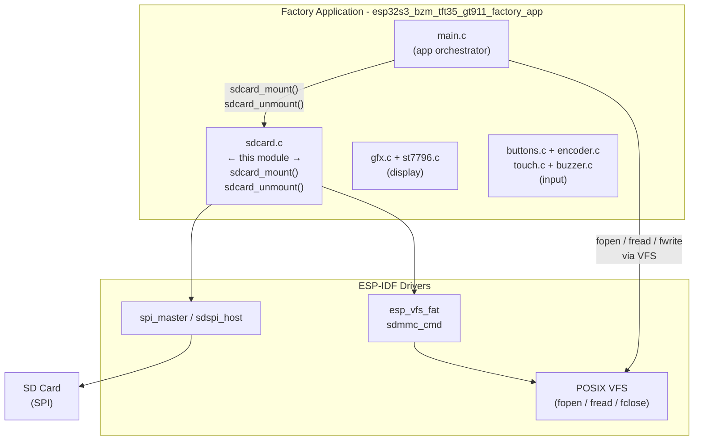
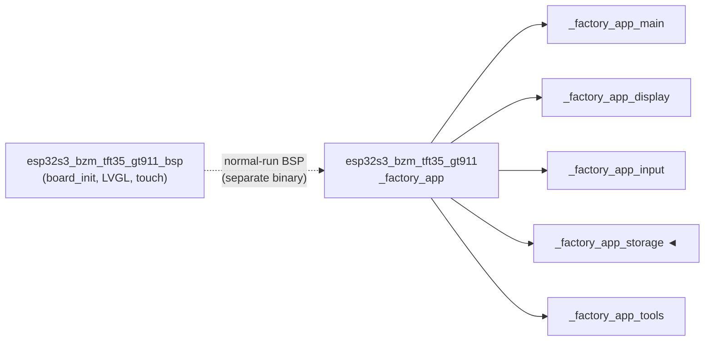
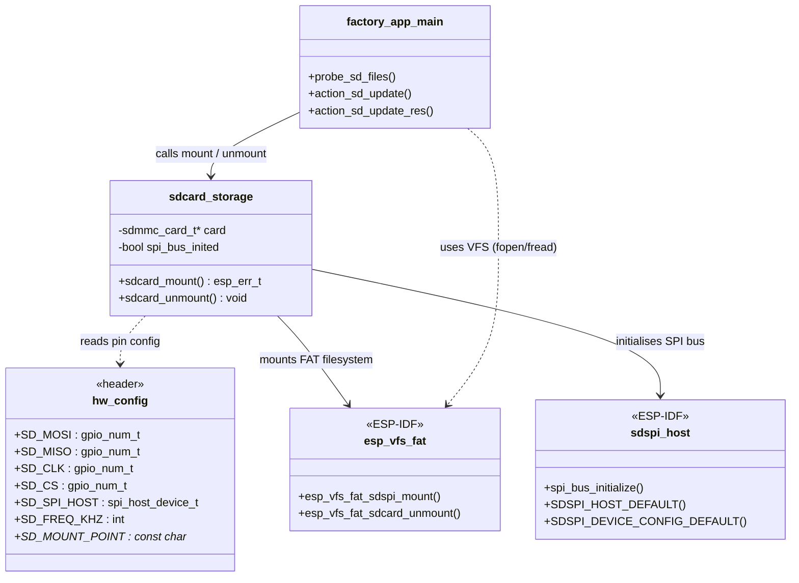
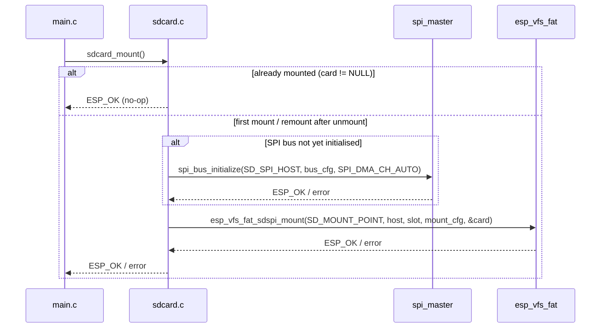
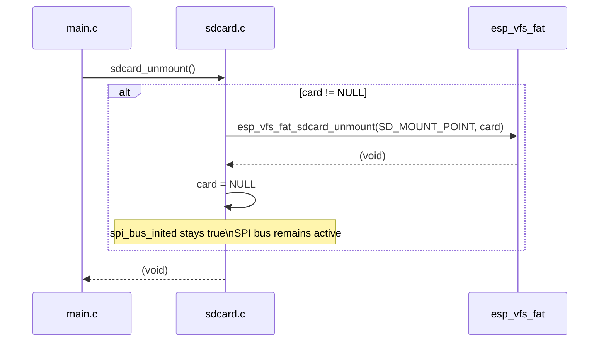
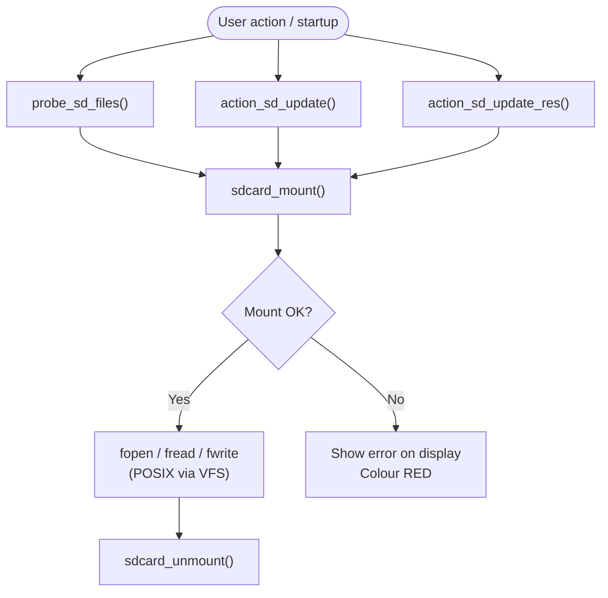
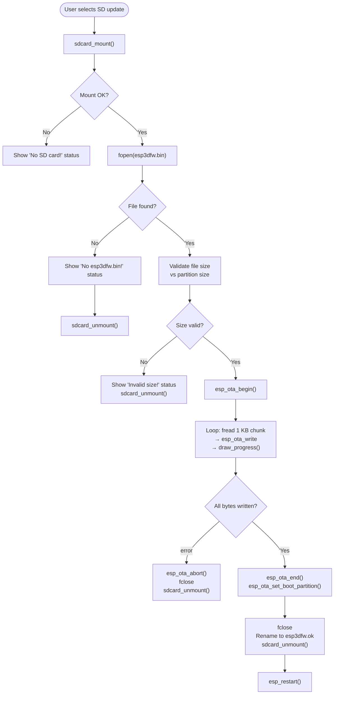

# esp32s3_bzm_tft35_gt911_factory_app_storage

SD card storage driver for the ESP32-S3 BZM TFT3.5" GT911 factory/recovery application. This module provides the sole external storage access point used by the factory app to mount the SD card over SPI, read firmware and UI-resource binary files from it, and cleanly unmount after each operation.

---

## Overview

The storage module is a single-file subsystem (`sdcard.c`) that wraps the ESP-IDF `sdspi_host` + `esp_vfs_fat` stack into two simple operations: **mount** and **unmount**. It is intentionally minimal — all business logic (file probing, OTA writes, partition flashing) lives in the factory app main module. This module owns only the SPI bus lifecycle and the FAT-VFS mount point.

### Key characteristics

| Property | Value |
|---|---|
| Interface | SPI (`sdspi_host`) |
| Filesystem | FAT via `esp_vfs_fat` |
| Mount point | Defined by `SD_MOUNT_POINT` in `hw_config.h` |
| Max open files | 4 |
| Auto-format on failure | Disabled |
| Disk-status check | Enabled |
| SPI bus teardown on unmount | **No** — bus is kept alive to avoid interfering with the TFT display |

---

## Architecture

The storage module sits inside the factory application layer, one level below the main orchestration logic and one level above the ESP-IDF SPI / FAT drivers.



### Module position within the board hierarchy



---

## Component Relationships



---

## API Reference

### `sdcard_mount`

```c
esp_err_t sdcard_mount(void);
```

Mounts the SD card at `SD_MOUNT_POINT` using SPI.

**Behaviour:**

1. Returns `ESP_OK` immediately if already mounted — idempotent guard via `card != NULL`.
2. Initialises the SPI bus (`spi_bus_initialize`) once — guarded by `spi_bus_inited`; subsequent calls skip this step.
3. Configures the SDSPI device with `SD_CS` and `SD_SPI_HOST`.
4. Mounts via `esp_vfs_fat_sdspi_mount` with the following policy:
   - `format_if_mount_failed = false` — never destructively formats the card
   - `max_files = 4`
   - `disk_status_check_enable = true`
5. Prints card info to `stdout` when `FACTORY_LOG_LEVEL` is non-zero.

**Returns:** `ESP_OK` on success, or the first `esp_err_t` failure from either the SPI bus init or the FAT mount.

**Error handling:** Errors are logged with `ESP_LOGE` (always visible). Callers check the return value and display status messages to the user via the display module.

---

### `sdcard_unmount`

```c
void sdcard_unmount(void);
```

Unmounts the SD card and releases the FAT layer, but **deliberately retains the SPI bus**.

**Behaviour:**

1. No-op if `card == NULL`.
2. Calls `esp_vfs_fat_sdcard_unmount(SD_MOUNT_POINT, card)` and resets `card = NULL`.
3. Does **not** call `spi_bus_free` — this is intentional to avoid conflicting with the ST7796 TFT display driver that shares or depends on the same SPI peripheral state. The bus remains available for re-use on the next `sdcard_mount` call.

---

## Static State

| Variable | Type | Purpose |
|---|---|---|
| `card` | `sdmmc_card_t *` | Handle returned by `esp_vfs_fat_sdspi_mount`; `NULL` when unmounted |
| `spi_bus_inited` | `bool` | Prevents double-initialisation of the SPI bus across repeated mount/unmount cycles |

Both variables are file-static, making the entire module a singleton — appropriate for this single-task factory application.

---

## Data Flow

### Mount sequence



### Unmount sequence



---

## Usage Patterns in the Factory App

The SD card is never held mounted permanently. Every consumer in `main.c` follows the same **mount → use → unmount** pattern:



### Caller summary

| Caller in `main.c` | When invoked | Purpose |
|---|---|---|
| `probe_sd_files()` | On startup and after any failed flash operation | Detects presence of `esp3dfw.bin` / `ui_resources.bin` to enable or grey-out menu items |
| `action_sd_update()` | User selects "SD → app0" or "SD → app1" | Reads `esp3dfw.bin` and writes it to the target OTA partition in 1 KB chunks via `esp_ota_write`; calls `sdcard_unmount` after success or failure |
| `action_sd_update_res()` | User selects "SD → resources" | Reads `ui_resources.bin` and writes it directly to the `ui_resources` data partition via `esp_partition_write`; validates the 16-byte build header before flashing |

---

## Flash Operation Process Flow

This diagram shows how the storage module participates in the complete firmware-update flow:



---

## Logging

Logging in this module follows the factory-app convention:

| Macro | Visibility | Used for |
|---|---|---|
| `FACTORY_LOGD(TAG, ...)` | Only when `FACTORY_LOG_LEVEL != 0` | Verbose progress: mount started, mounted path, unmounted |
| `ESP_LOGE(TAG, ...)` | Always | Fatal errors: SPI bus init failure, mount failure |
| `ESP_LOGW(TAG, ...)` | Always | Non-fatal warnings: mount failed (card absent) |

### SD stack silencing

At application startup, `factory_log_silence_sd_stack()` (from `factory_log.h`) sets all ESP-IDF SD subsystem log tags to `ESP_LOG_NONE`:

```
sdmmc, vfs_fat_sdmmc, sdmmc_periph, sdmmc_req,
sdmmc_common, fatfs, sdspi, sd_diskio
```

This prevents the ESP-IDF SD stack's verbose init output from cluttering the factory app console. Errors from `sdcard.c` itself are still emitted because they use `ESP_LOGE` / `ESP_LOGW` directly — those are not suppressed by the per-tag filter applied to the SDK drivers.

---

## Design Decisions

### SPI bus retained after unmount

The SPI bus initialised for the SD card is never freed, even after `sdcard_unmount`. This is documented directly in the source:

> *"Keep SPI bus initialized — freeing it can interfere with TFT SPI. The bus will be reused on next mount."*

The ST7796 display driver (`st7796.c`) in the same factory app also uses SPI. Calling `spi_bus_free` between SD accesses risks disrupting the display peripheral. Retaining the bus is the correct tradeoff in this constrained, single-task factory context where there is no external resource arbitration layer.

### No auto-format

`format_if_mount_failed = false` ensures the factory app never accidentally destroys SD card contents. This is critical: the SD card is typically a technician's card that may carry multiple firmware binaries for different boards.

### On-demand mount / unmount

The SD card is mounted only for the duration of each operation and immediately unmounted afterwards. This keeps the FAT layer inactive during display-intensive rendering and avoids leaving the card in an inconsistent state if the board loses power mid-operation.

### Idempotent mount guard

The `card != NULL` check at the start of `sdcard_mount` makes the function safe to call multiple times without double-initialising the FAT layer. This matters because `probe_sd_files` is called both at startup and after certain failure recovery paths — callers do not need to track mount state themselves.

---

## Hardware Configuration

All pin assignments and bus parameters are centralised in `hw_config.h`. The storage module reads the following constants:

| Constant | Role |
|---|---|
| `SD_MOSI` | SPI data output to SD card |
| `SD_MISO` | SPI data input from SD card |
| `SD_CLK` | SPI clock |
| `SD_CS` | SD card chip select (active low) |
| `SD_SPI_HOST` | ESP-IDF SPI host identifier (e.g. `SPI2_HOST`) |
| `SD_FREQ_KHZ` | Maximum SPI clock frequency for SD access |
| `SD_MOUNT_POINT` | VFS mount path (e.g. `"/sdcard"`) |

The SPI bus is configured with `max_transfer_sz = 4096` bytes and `SPI_DMA_CH_AUTO` for automatic DMA channel selection.

---

## Related Modules

| Module | Relationship |
|---|---|
| [esp32s3_bzm_tft35_gt911_factory_app_main](esp32s3_bzm_tft35_gt911_factory_app_main.md) | Direct consumer — calls `sdcard_mount` / `sdcard_unmount` and performs all POSIX file I/O via the VFS |
| [esp32s3_bzm_tft35_gt911_factory_app_display](esp32s3_bzm_tft35_gt911_factory_app_display.md) | Shares the SPI peripheral (ST7796); the intentional SPI bus retention design exists because of this co-dependency |
| [esp32s3_bzm_tft35_gt911_factory_app_input](esp32s3_bzm_tft35_gt911_factory_app_input.md) | No direct dependency; input events trigger SD operations indirectly via `main.c` |
| [esp32s3_bzm_tft35_gt911_factory_app_tools](esp32s3_bzm_tft35_gt911_factory_app_tools.md) | Host-side flash scripts used to initially program the SD-based binaries; no runtime dependency on this module |
| [esp32s3_bzm_tft35_gt911_bsp](esp32s3_bzm_tft35_gt911_bsp.md) | Board-support package for the normal-run firmware; not active during factory app execution |

For the analogous storage module on boards sharing the same factory app pattern, see:
- [pibot_pendant_v1_0_factory_app_storage](pibot_pendant_v1_0_factory_app_storage.md)
- [esp32s3_8048s070c_factory_app_storage](esp32s3_8048s070c_factory_app_storage.md)

For the broader factory app context (partition layout, bootloader interaction, OTA workflow), see [`factory_app_technical_doc.md`](https://github.com/luc-github/Pibot-cnc-pendant-firmware/blob/main/docs/Factory/factory_app_technical_doc.md).
