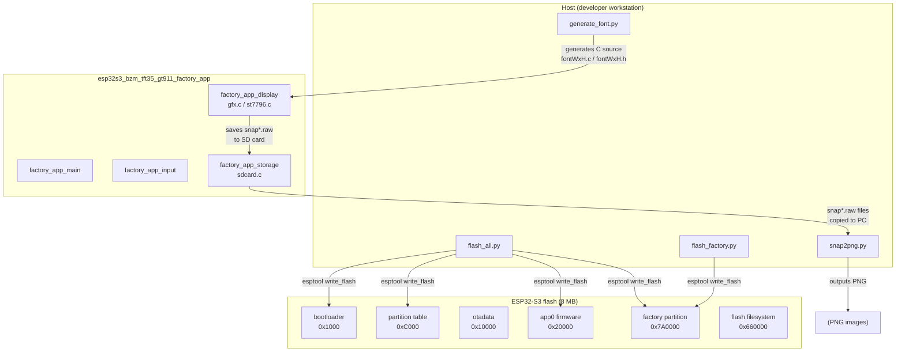
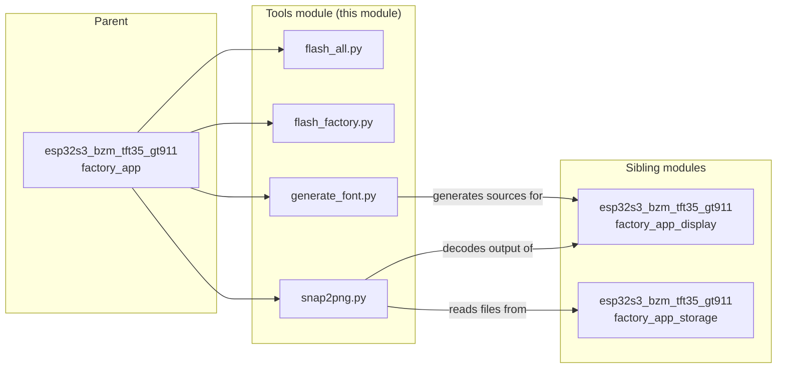
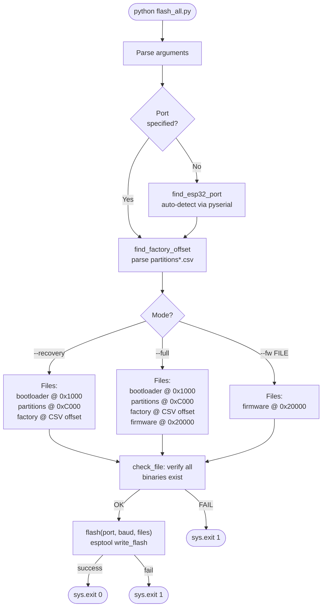
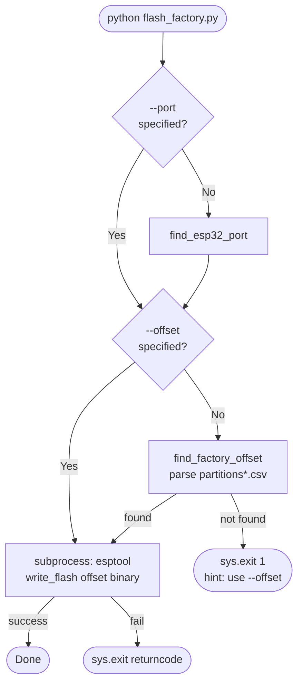
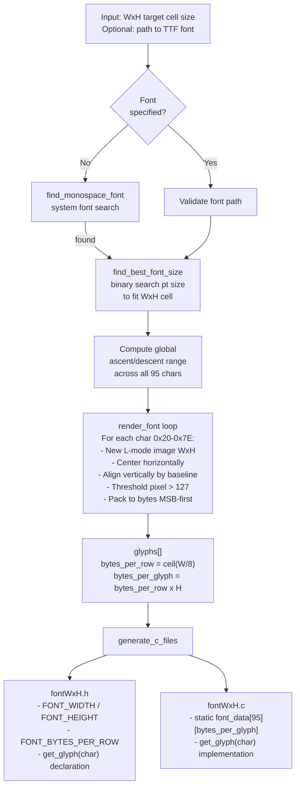
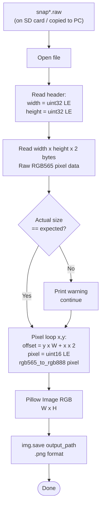
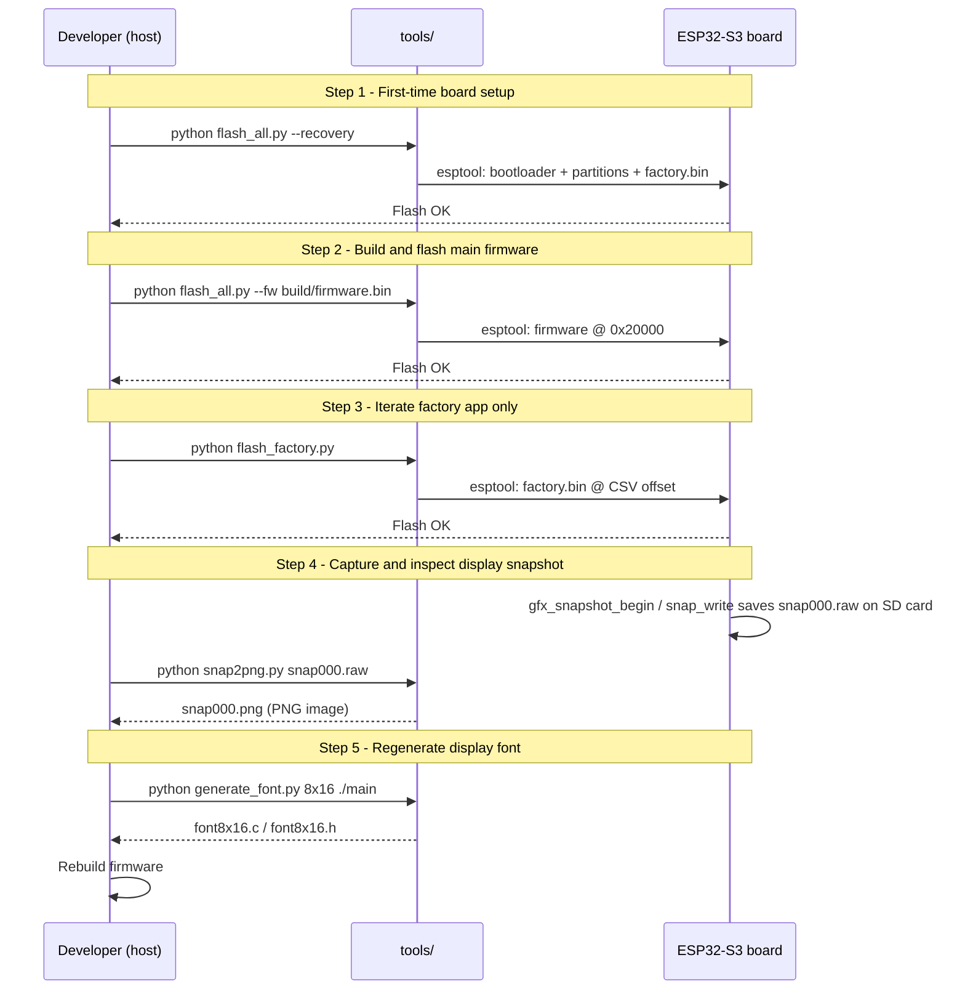
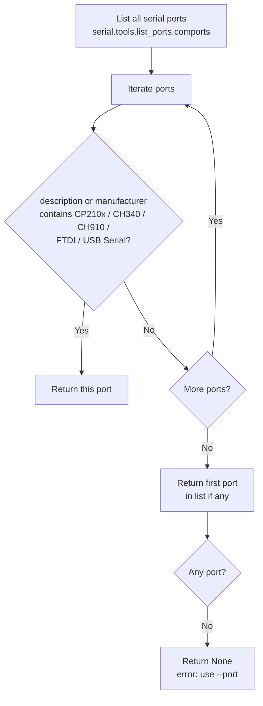

# esp32s3_bzm_tft35_gt911_factory_app_tools

Host-side Python utilities for the **ESP32-S3 BZM TFT 3.5″ GT911** factory application. These four scripts cover the complete factory workflow: flashing firmware to the device, generating bitmap fonts for the factory display, and converting on-device screen snapshots back to standard images on a PC.

All scripts run on a developer workstation (Linux, macOS, or Windows) and require **Python 3** with the packages listed in each section below.

---

## Overview

| Script | Purpose | Key dependency |
|---|---|---|
| `flash_all.py` | Multi-mode flash controller (recovery / full / firmware-only) | `esptool`, `pyserial` |
| `flash_factory.py` | Flash the factory partition only | `esptool`, `pyserial` |
| `generate_font/generate_font.py` | Generate bitmap font C sources from a TTF file | `Pillow` |
| `raw2png/snap2png.py` | Convert on-device RGB565 snapshot files to PNG | `Pillow` |

These scripts are board-specific adaptations of the common factory tooling pattern shared by all boards in this repository. For the corresponding tools on other boards, see [`pibot_pendant_v1_0_factory_app_tools.md`](pibot_pendant_v1_0_factory_app_tools.md) and [`esp32s3_8048s070c_factory_app_tools.md`](esp32s3_8048s070c_factory_app_tools.md).

---

## Module location

```
boards/esp32s3_bzm_tft35_gt911/Factory/tools/
├── flash_all.py
├── flash_factory.py
├── generate_font/
│   └── generate_font.py
└── raw2png/
    └── snap2png.py
```

---

## Architecture

### Position in the factory ecosystem



### Component relationships



---

## Flash map reference

All flash offsets are fixed and must match the partition table CSV shipped with the board. The scripts parse the CSV automatically to determine the factory partition offset.

```
0x00001000  bootloader.bin          (44 KB reserved)
0x0000C000  partitions.bin          (partition table)
0x00010000  otadata                 (OTA state, 8 KB)
0x00020000  app0  ← main firmware
0x00660000  flashfs / LittleFS
0x007A0000  factory  ← recovery app  (default, CSV-derived)
```

> The factory offset is **not hard-coded** in the scripts. `find_factory_offset()` walks any `partitions*.csv` file reachable from the working directory and extracts the offset from the `factory` row. The constant `0x7A0000` is a fall-back for 8 MB layouts only.

---

## Scripts

### `flash_all.py` — multi-mode flash controller

Wraps `esptool` to support three mutually exclusive flash modes from a single entry point.

#### Flash modes



#### Key functions

| Function | Signature | Description |
|---|---|---|
| `main` | `() → None` | Argument parsing and top-level orchestration |
| `find_esp32_port` | `() → str\|None` | Iterates `serial.tools.list_ports`; matches CP210x, CH340, FTDI keyword patterns |
| `find_factory_offset` | `() → str` | Parses `partitions*.csv` for `factory` sub-type; returns hex offset string or `"0x7A0000"` |
| `check_file` | `(path, name) → bool` | Verifies a binary exists, prints its size |
| `flash` | `(port, baud, files) → bool` | Assembles and runs the `esptool` subprocess |

#### Usage

```bash
# First-time board setup — flashes bootloader + partition table + factory app
python flash_all.py --recovery

# Full production flash — all partitions plus the main firmware
python flash_all.py --full --fw-file build/firmware.bin

# Development iteration — firmware only (fastest)
python flash_all.py --fw build/firmware.bin

# Explicit port
python flash_all.py --recovery --port /dev/ttyUSB0
python flash_all.py --recovery --port COM3
```

#### Arguments

| Argument | Default | Description |
|---|---|---|
| `--port / -p` | auto-detect | Serial port |
| `--baud` | `460800` | Flash baud rate |
| `--recovery` | — | Mode: bootloader + partitions + factory |
| `--full` | — | Mode: everything (requires `--fw-file`) |
| `--fw FILE` | — | Mode: firmware only at `APP0_OFFSET` |
| `--fw-file FILE` | — | Firmware binary path (used with `--full`) |

---

### `flash_factory.py` — factory partition flash

Focused single-purpose script: flashes one binary to the factory partition. Useful when iterating on the factory application without disturbing the main firmware or bootloader.

#### Data flow



#### Key functions

| Function | Signature | Description |
|---|---|---|
| `main` | `() → None` | Full script entry point |
| `find_factory_offset` | `() → str\|None` | Searches `PARTITION_CSV_PATTERNS` for `factory` row; returns `None` on failure (unlike `flash_all.py` which returns a default) |
| `find_esp32_port` | `() → str\|None` | Same USB-UART keyword detection as `flash_all.py` |

#### Usage

```bash
# Auto-detect everything
python flash_factory.py

# Specify port
python flash_factory.py --port /dev/ttyUSB0

# Custom binary and offset
python flash_factory.py --bin custom_factory.bin --offset 0x7A0000

# Full explicit invocation
python flash_factory.py --port COM4 --baud 921600 --bin installer/factory.bin --offset 0x7A0000
```

#### Arguments

| Argument | Default | Description |
|---|---|---|
| `--port / -p` | auto-detect | Serial port |
| `--bin / -b` | `installer/factory.bin` | Factory binary path |
| `--baud` | `460800` | Flash baud rate |
| `--offset / -o` | CSV-derived | Flash address override |

---

### `generate_font/generate_font.py` — bitmap font generator

Converts a TrueType font into a pair of C source files (`fontWxH.c` + `fontWxH.h`) that can be compiled directly into the factory firmware. The factory display subsystem (see [`esp32s3_bzm_tft35_gt911_factory_app_display.md`](esp32s3_bzm_tft35_gt911_factory_app_display.md)) uses these C arrays through `gfx_draw_char` / `gfx_draw_string`.

#### Character set

| Parameter | Value |
|---|---|
| First character | `0x20` (space) |
| Last character | `0x7E` (`~`) |
| Total characters | 95 printable ASCII |
| Pixel format | 1 bit per pixel, MSB = leftmost |

#### Rendering pipeline



#### Output file structure

**Header (`fontWxH.h`)**

```c
#pragma once
#include <stdint.h>

#define FONT_WIDTH          8
#define FONT_HEIGHT        16
#define FONT_BYTES_PER_ROW  1

const uint8_t *font8x16_get_glyph(char c);
```

**Source (`fontWxH.c`)**

```c
static const uint8_t font_data[][16] = {
    { 0x00, ... },  /* 0x20 ' ' */
    { 0x00, ... },  /* 0x21 '!' */
    /* ... 95 entries total ... */
};

const uint8_t *font8x16_get_glyph(char c) {
    if (c < 0x20 || c > 0x7E) return font_data[0];
    return font_data[c - 0x20];
}
```

#### Key functions

| Function | Signature | Description |
|---|---|---|
| `main` | `() → None` | CLI parsing, validation, orchestration |
| `find_monospace_font` | `() → str\|None` | Searches known system font paths (Linux / macOS / Windows) |
| `find_best_font_size` | `(font_path, w, h) → int` | Iterates point sizes 6–(h+10), returns largest that fits the `M` glyph within the target cell |
| `render_font` | `(font_path, w, h) → list[list[int]]` | Renders all 95 characters; returns list of byte arrays |
| `generate_c_files` | `(glyphs, w, h, output_dir) → None` | Writes `.h` and `.c` files to `output_dir` |

#### Usage

```bash
# Minimum: 8x16 font, output to current directory, auto-detect system font
python generate_font.py 8x16

# Specify output directory
python generate_font.py 8x16 ./main

# Use a specific TTF (recommended for CP437/DOS aesthetic)
python generate_font.py 8x16 ./main --font "Perfect DOS VGA 437.ttf"

# Smaller font for compact UI areas
python generate_font.py 6x12 ./main

# Larger font
python generate_font.py 10x20 ./main --font /path/to/CustomMono.ttf
```

#### Cell size constraints

| Dimension | Min | Max |
|---|---|---|
| Width | 4 px | 32 px |
| Height | 6 px | 64 px |

#### Flash memory estimate

For the common `8x16` cell:
- `bytes_per_row` = ⌈8/8⌉ = 1
- `bytes_per_glyph` = 1 × 16 = 16 bytes
- Total for 95 characters = **1 520 bytes** (~1.5 KB)

---

### `raw2png/snap2png.py` — RGB565 snapshot converter

Decodes snapshot files saved by the factory application's `gfx_snapshot_begin` / `gfx_snapshot_end` / `snap_write` subsystem (see [`esp32s3_bzm_tft35_gt911_factory_app_display.md`](esp32s3_bzm_tft35_gt911_factory_app_display.md)) and converts them to standard PNG images on the host.

#### File format

```
Offset  Size   Content
------  ----   -----------------------------------------------
0       4 B    Image width  (uint32_t, little-endian)
4       4 B    Image height (uint32_t, little-endian)
8       W×H×2  Raw RGB565 pixels, row-major, no padding
```

#### RGB565 → RGB888 conversion

Each 16-bit word is split as:

```
Bit 15..11  → Red   (5 bits) → scale to 8 bits: (r << 3) | (r >> 2)
Bit 10..5   → Green (6 bits) → scale to 8 bits: (g << 2) | (g >> 4)
Bit 4..0    → Blue  (5 bits) → scale to 8 bits: (b << 3) | (b >> 2)
```

#### Conversion pipeline



#### Key functions

| Function | Signature | Description |
|---|---|---|
| `main` | `() → None` | CLI argument parsing; iterates input files |
| `convert_raw_to_png` | `(raw_path, output_path=None) → None` | Reads header, decodes pixels, saves PNG |
| `rgb565_to_rgb888` | `(pixel: int) → tuple[int,int,int]` | Converts one 16-bit RGB565 value to 8-bit R/G/B tuple |

#### Usage

```bash
# Single file (output name derived automatically: snap000.raw → snap000.png)
python snap2png.py snap000.raw

# Wildcard batch conversion
python snap2png.py snap*.raw

# Custom output filename (single file only)
python snap2png.py snap000.raw -o screenshot.png
```

---

## Dependency matrix

| Script | Python stdlib | Third-party |
|---|---|---|
| `flash_all.py` | `argparse`, `glob`, `os`, `sys`, `subprocess` | `pyserial` (`serial.tools.list_ports`), `esptool` (subprocess) |
| `flash_factory.py` | `argparse`, `csv`, `glob`, `os`, `sys`, `subprocess` | `pyserial`, `esptool` |
| `generate_font.py` | `sys`, `os`, `pathlib` | `Pillow` (`PIL.Image`, `PIL.ImageDraw`, `PIL.ImageFont`) |
| `snap2png.py` | `argparse`, `struct`, `sys`, `pathlib` | `Pillow` (`PIL.Image`) |

Install all at once:

```bash
pip install esptool pyserial Pillow
```

---

## Typical factory workflow



---

## Port auto-detection logic

Both flash scripts use the same detection heuristic:



---

## Related modules

| Module | Relationship |
|---|---|
| [`esp32s3_bzm_tft35_gt911_factory_app.md`](esp32s3_bzm_tft35_gt911_factory_app.md) | Parent factory application |
| [`esp32s3_bzm_tft35_gt911_factory_app_display.md`](esp32s3_bzm_tft35_gt911_factory_app_display.md) | Consumes font C sources; produces `.raw` snapshot files |
| [`esp32s3_bzm_tft35_gt911_factory_app_storage.md`](esp32s3_bzm_tft35_gt911_factory_app_storage.md) | SD card mount/unmount used by snapshot capture |
| [`esp32s3_bzm_tft35_gt911_bsp.md`](esp32s3_bzm_tft35_gt911_bsp.md) | BSP board support package for the production firmware |
| [`esp32s3_bzm_tft35_gt911_build_scripts.md`](esp32s3_bzm_tft35_gt911_build_scripts.md) | Build variant scripts (separate from flash tools) |
| [`pibot_pendant_v1_0_factory_app_tools.md`](pibot_pendant_v1_0_factory_app_tools.md) | Equivalent tools for the PiBot Pendant v1.0 board |
| [`esp32s3_8048s070c_factory_app_tools.md`](esp32s3_8048s070c_factory_app_tools.md) | Equivalent tools for the 800×480 7″ board |
