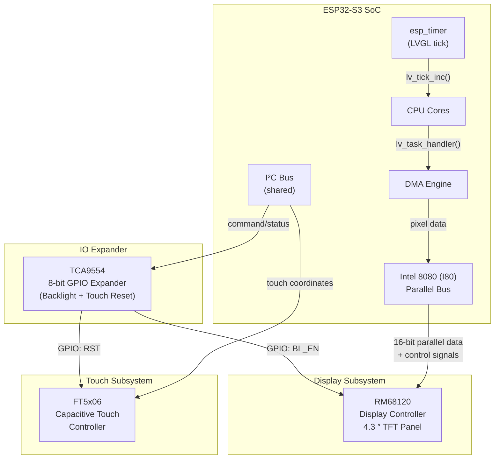
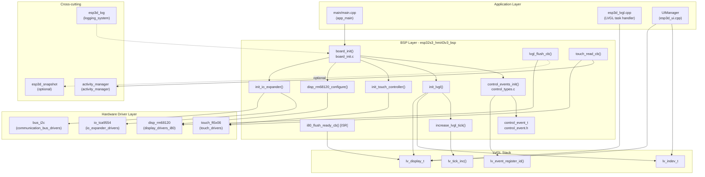
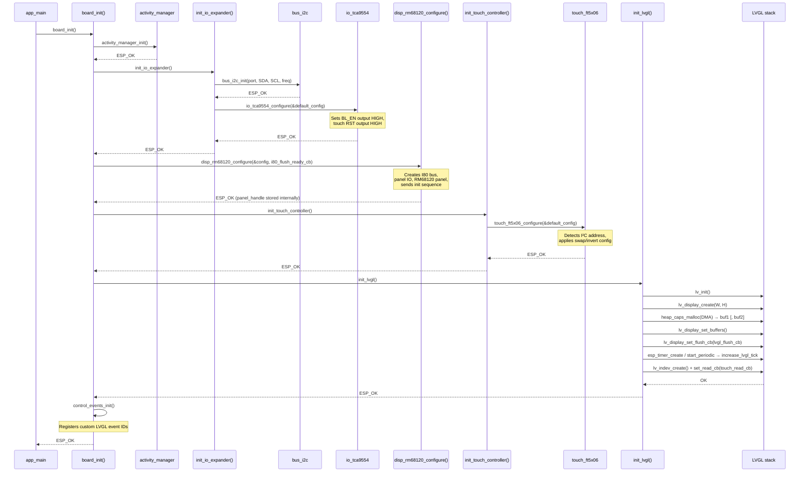
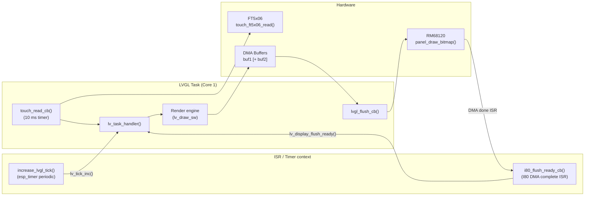
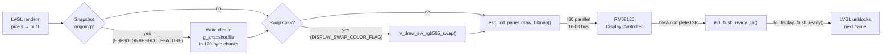
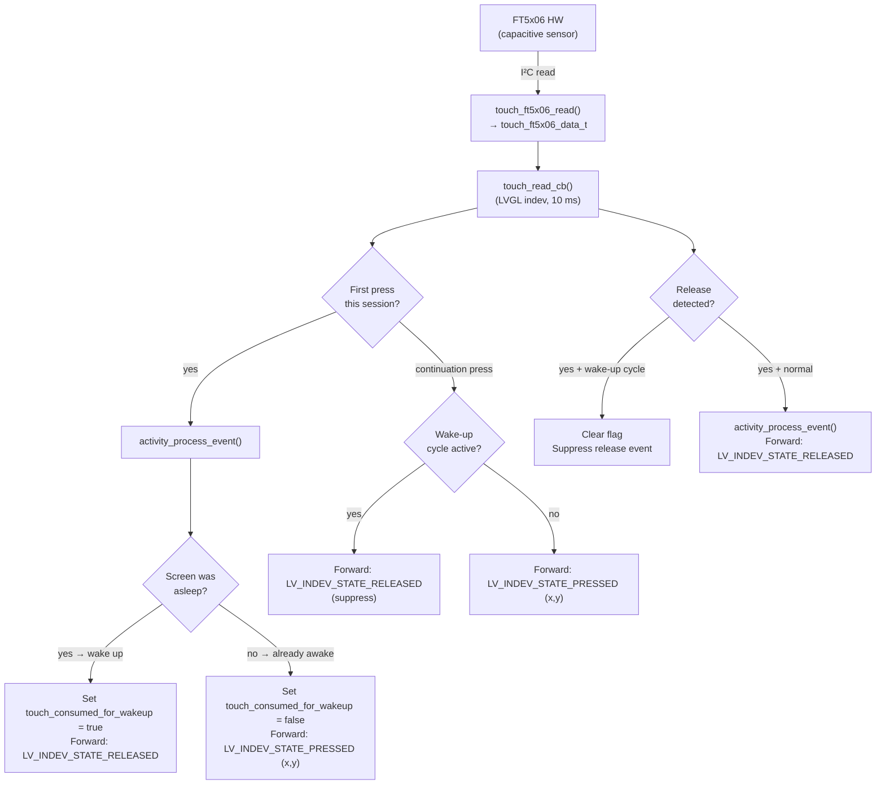
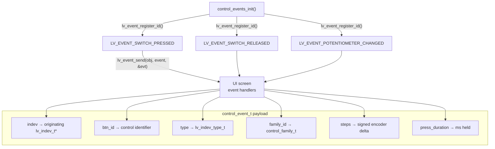
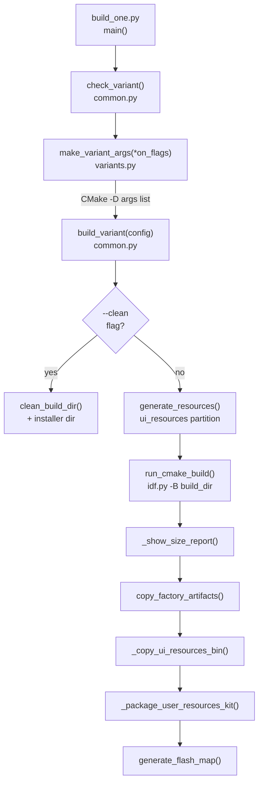
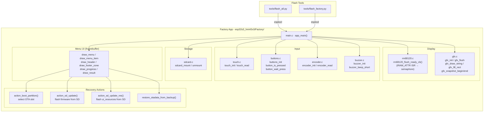
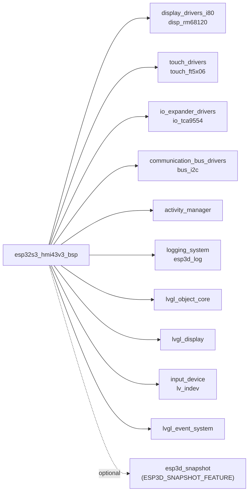

# ESP32-S3 HMI43V3 Board Support Package (BSP)

The `esp32s3_hmi43v3_bsp` module is the Board Support Package for the **ESP32-S3 HMI43V3** — a 4.3-inch capacitive-touch display board built around an ESP32-S3 SoC. It initialises every hardware subsystem (display, touch, IO expander, LVGL) and exposes a uniform BSP interface consumed by the main firmware. Because all hardware access is encapsulated here, the rest of the application firmware is board-agnostic.

---

## Table of Contents

1. [Module Overview](#1-module-overview)
2. [Hardware Topology](#2-hardware-topology)
3. [Software Architecture](#3-software-architecture)
4. [Initialization Sequence](#4-initialization-sequence)
5. [Component Reference](#5-component-reference)
   - 5.1 [board\_init.c](#51-board_initc)
   - 5.2 [control\_event.h](#52-control_eventh)
   - 5.3 [control\_types.c](#53-control_typesc)
6. [LVGL Integration](#6-lvgl-integration)
7. [Display Pipeline](#7-display-pipeline)
8. [Touch Pipeline](#8-touch-pipeline)
9. [Control Event System](#9-control-event-system)
10. [Snapshot Feature](#10-snapshot-feature)
11. [Build System](#11-build-system)
12. [Factory Application](#12-factory-application)
13. [Dependencies](#13-dependencies)
14. [Configuration Constants (Quick Reference)](#14-configuration-constants-quick-reference)

---

## 1. Module Overview

| Property | Value |
|---|---|
| **Board identifier** | `esp32s3_hmi43v3` |
| **SoC** | ESP32-S3 |
| **Display controller** | RM68120 (4.3 ″, Intel 8080 / I80 parallel bus) |
| **Touch controller** | FT5x06 capacitive (I²C) |
| **IO expander** | TCA9554 (I²C, shared bus with touch) |
| **Shared I²C bus** | Backlight enable + touch reset routed through TCA9554 |
| **Color format** | RGB 565 |
| **LVGL render mode** | Partial, single or double DMA buffer |
| **Touch indev polling** | 10 ms |
| **LVGL tick period** | `LVGL_TICK_PERIOD_MS` (from `tasks_def.h`) |

### Module tree location

```
esp32s3_hmi43v3_bsp           ← this BSP (current module)
boards/esp32s3_hmi43v3/
  components/bsp/
    board_init.c              ← hardware initialisation & LVGL wiring
    control_event.h           ← control_event_t struct
    control_types.c           ← custom LVGL event registration
  build_scripts/              → esp32s3_hmi43v3_build
  Factory/                    → esp32s3_hmi43v3_factory_app
```

---

## 2. Hardware Topology



> **Key constraint**: the TCA9554 IO expander **must be initialised before** both the RM68120 display and the FT5x06 touch controller, because backlight enable and touch reset signals are routed through it.

---

## 3. Software Architecture



---

## 4. Initialization Sequence

`board_init()` enforces a strict ordering. Each step is a prerequisite for the next:



---

## 5. Component Reference

### 5.1 `board_init.c`

Primary file: `boards/esp32s3_hmi43v3/components/bsp/board_init.c`

#### Public API

| Symbol | Signature | Description |
|---|---|---|
| `board_init` | `esp_err_t board_init(void)` | Top-level board initialisation. Returns `ESP_OK` on success; any sub-step failure is propagated immediately (fail-fast). |
| `board_get_name` | `const char *board_get_name(void)` | Returns `BOARD_NAME_STR` (compile-time constant from `board_config.h`). |
| `board_get_version` | `const char *board_get_version(void)` | Returns `BOARD_VERSION_STR`. |
| `get_lvgl_display` | `lv_display_t *get_lvgl_display(void)` | Accessor for the LVGL display handle (used by `ESP3DXUi`). Returns `NULL` when `ESP3D_DISPLAY_FEATURE` is disabled. |
| `get_lvgl_lock` | `_lock_t *get_lvgl_lock(void)` | Accessor for the LVGL API mutex (used by `ESP3DXUi`). Returns `NULL` when display is disabled. |
| `get_touch_indev` | `lv_indev_t *get_touch_indev(void)` | Accessor for the touch input device handle (guarded by `ESP3D_TOUCH_FEATURE`). |

#### Private / static functions

| Symbol | Description |
|---|---|
| `i80_flush_ready_cb` | Registered as the DMA-complete ISR callback with the RM68120 driver. Calls `lv_display_flush_ready()` to unblock LVGL rendering. Executes in ISR context. |
| `lvgl_flush_cb` | LVGL flush callback. Optionally writes pixels to the snapshot file (`ESP3D_SNAPSHOT_FEATURE`), optionally byte-swaps the RGB565 buffer (`DISPLAY_SWAP_COLOR_FLAG`), then calls `esp_lcd_panel_draw_bitmap()`. |
| `touch_read_cb` | LVGL input device read callback (10 ms period). Reads `touch_ft5x06_data_t`, implements wake-up suppression (first touch wakes screen but is not forwarded to LVGL), and calls `activity_process_event()`. |
| `increase_lvgl_tick` | `esp_timer` periodic callback. Calls `lv_tick_inc(LVGL_TICK_PERIOD_MS)` to advance the LVGL internal clock. |
| `init_io_expander` | Initialises the shared I²C bus via `bus_i2c_init()` then configures the TCA9554. Must be the first display-related call. |
| `init_touch_controller` | Initialises the FT5x06 over the shared I²C bus (already brought up by `init_io_expander`). |
| `init_lvgl` | Allocates DMA pixel buffers, creates the LVGL display and touch indev, starts the periodic tick timer. |

#### Key file-scope state variables

| Variable | Type | Purpose |
|---|---|---|
| `lvgl_api_lock` | `_lock_t` | Mutual exclusion for all `lv_*` API calls originating outside the LVGL task |
| `lvgl_display` | `lv_display_t *` | LVGL display object wrapping the RM68120 panel |
| `lvgl_buf1` / `lvgl_buf2` | `lv_color16_t *` | DMA-capable pixel buffers (allocated from `MALLOC_CAP_DMA`) |
| `lvgl_tick_timer` | `esp_timer_handle_t` | Periodic high-resolution timer driving `lv_tick_inc()` |
| `touch_indev` | `lv_indev_t *` | LVGL pointer input device backed by the FT5x06 |

---

### 5.2 `control_event.h`

File: `boards/esp32s3_hmi43v3/components/bsp/control_event.h`

Defines the unified event payload carried by every control input (touch, encoder, switch, potentiometer) when dispatched as an LVGL custom event.

```c
typedef struct {
    lv_indev_t        *indev;           // originating LVGL input device
    uint32_t           btn_id;          // button / control identifier
    lv_indev_type_t    type;            // LVGL indev type (pointer, encoder, …)
    control_family_t   family_id;       // logical grouping (switch, encoder, …)
    int32_t            steps;           // signed encoder step count
    uint32_t           press_duration;  // hold duration in milliseconds
} control_event_t;
```

This struct is passed as `event_data` in `lv_event_send()` calls throughout the UI layer. UI screens retrieve it with:

```c
control_event_t *evt = (control_event_t *)lv_event_get_param(e);
```

See [`pibot_pendant_v1_0_bsp.md`](pibot_pendant_v1_0_bsp.md) for the full control family design — the pendant BSP uses the same `control_event_t` pattern with additional physical input types (encoder, potentiometer, switches).

---

### 5.3 `control_types.c`

File: `boards/esp32s3_hmi43v3/components/bsp/control_types.c`

Registers three custom LVGL event IDs after `lv_init()` has run:

| Global variable | Registered event |
|---|---|
| `LV_EVENT_SWITCH_PRESSED` | A physical switch was pressed |
| `LV_EVENT_SWITCH_RELEASED` | A physical switch was released |
| `LV_EVENT_POTENTIOMETER_CHANGED` | Potentiometer value changed |

```c
void control_events_init(void);   // called by board_init() after init_lvgl()
```

All three variables are initialised to `LV_EVENT_ALL` at compile time and are assigned unique IDs by `lv_event_register_id()` at runtime.

> **LVGL threading rule**: `control_events_init()` must be called from the LVGL task (Core 1) strictly after `lv_init()` and before any UI screen subscribes to these events.

---

## 6. LVGL Integration



**Double-buffer mode** (`DISPLAY_USE_DOUBLE_BUFFER_FLAG`): when enabled, a second DMA buffer is allocated so LVGL can prepare the next frame while the previous one is being transferred over the I80 bus, eliminating the flush stall.

**Color byte-swap** (`DISPLAY_SWAP_COLOR_FLAG`): some RM68120 panel variants expect RGB565 bytes in swapped order. When the flag is set, `lv_draw_sw_rgb565_swap()` is called inside `lvgl_flush_cb()` before `esp_lcd_panel_draw_bitmap()`. This is applied in software and has a small CPU cost proportional to the dirty rectangle size.

**Tick accuracy**: `increase_lvgl_tick` fires via `esp_timer` (hardware timer, not FreeRTOS tick), giving sub-millisecond accuracy for LVGL animation timings regardless of FreeRTOS tick rate.

---

## 7. Display Pipeline



The RM68120 driver (`display_drivers_i80` → `disp_rm68120`) handles:
- I80 bus creation with `esp_lcd_new_i80_bus()`
- Panel IO handle with `esp_lcd_new_panel_io_i80()`
- Panel initialisation sequence: SLEEP OUT → MADCTL → COLMOD → DISPLAY ON
- The internal `disp_rm68120_notify_flush_ready` ISR that invokes the BSP-supplied `i80_flush_ready_cb`

See [`display_drivers_i80.md`](display_drivers_i80.md) for the full driver reference.

---

## 8. Touch Pipeline



**Wake-up suppression** is implemented with two static booleans:
- `last_pressed_state` — tracks the previous touch state to detect edges
- `touch_consumed_for_wakeup` — when `true`, suppresses both the press and the matching release from reaching LVGL

This ensures no accidental UI tap fires on screen wake-up.

The FT5x06 driver configuration (`touch_ft5x06_config_t`) supports:
- Up to 3 candidate I²C addresses (auto-detected at init)
- Coordinate swap (`swap_xy`) and inversion (`invert_x`, `invert_y`) for rotated panel mounts
- Optional hardware reset (`rst_pin`) and interrupt (`int_pin`) GPIO pins
- Configurable coordinate range (`x_max`, `y_max`; 0 = read from device)

See [`touch_drivers.md`](touch_drivers.md) for the full driver API.

---

## 9. Control Event System

The HMI43V3 BSP registers three custom LVGL events for physical controls. The event payload (`control_event_t`) carries all information needed by UI screens without them needing to know the originating hardware.



**Registration timing**: IDs are assigned at runtime by `lv_event_register_id()` in `control_events_init()`, which is called by `board_init()` after `init_lvgl()` completes. The three global variables (`LV_EVENT_SWITCH_PRESSED`, `LV_EVENT_SWITCH_RELEASED`, `LV_EVENT_POTENTIOMETER_CHANGED`) hold the assigned numeric codes and are safe to use from any task after `board_init()` returns.

---

## 10. Snapshot Feature

When `ESP3D_SNAPSHOT_FEATURE` is defined, `lvgl_flush_cb()` captures every rendered tile into an open file handle before the pixels are sent to the display. The snapshot accumulates multiple flush calls until the full logical frame has been captured.

**Capture flow** (inside `lvgl_flush_cb`, guarded by `ESP3D_SNAPSHOT_FEATURE`):

1. Check `g_snapshot.ongoing` (non-atomic read — safe because only the LVGL task writes it here).
2. Take `g_snapshot.mutex` (non-blocking `xSemaphoreTake(... , 0)`) — skip the tile if the mutex is busy rather than block the render pipeline.
3. Write pixels in `CHUNK_SIZE = 120` byte chunks via `fwrite()` to avoid large stack usage.
4. Accumulate `g_snapshot.captured_pixels`; when `>= g_snapshot.expected_pixels`, clear `g_snapshot.ongoing`.
5. On any `fwrite` error: set `g_snapshot.error = true`, clear `ongoing`, and stop.

This integrates with the higher-level snapshot API documented in ``lvgl_system.md``.

---

## 11. Build System

Module: `esp32s3_hmi43v3_build`
Path: `boards/esp32s3_hmi43v3/build_scripts/`



**`make_variant_args()`** (`variants.py`): starts from `DEFAULT_OFF_CMAKE_ARGS` (all features off) and enables only the flags passed in, producing a deterministic CMake argument list. This controls which features are compiled (WiFi, BT, WebUI, transport selection, etc.).

**Build pipeline steps**:
1. Generate the `ui_resources` binary partition (icons, fonts, theme palettes) before any compilation.
2. Run `idf.py` via CMake in the board-specific build directory.
3. Print a size report to catch memory regressions early.
4. Copy factory app artifacts into the installer directory.
5. Copy the `ui_resources.bin` into the installer.
6. Package the `ui_resources_kit/` for end-user SD-card updates (non-fatal if it fails).
7. Write the flash address map.

See [`docs/guides/board_build_guidelines.md`](https://github.com/luc-github/Pibot-cnc-pendant-firmware/blob/main/docs/guides/board_build_guidelines.md) for the full cross-board build workflow and [`docs/ui_resources/development.md`](https://github.com/luc-github/Pibot-cnc-pendant-firmware/blob/main/docs/ui_resources/development.md) for the `ui_resources` partition format.

---

## 12. Factory Application

Module: `esp32s3_hmi43v3_factory_app`
Path: `boards/esp32s3_hmi43v3/Factory/`

The factory application is a standalone ESP-IDF project used for production flashing and board validation. It does **not** use LVGL — it drives the RM68120 directly with a minimal framebuffer stack to keep the binary small and fully independent of the main firmware.



**Key difference from the main BSP**: the factory `rm68120_flush_ready_cb` is `IRAM_ATTR` and posts to a FreeRTOS semaphore from ISR context (`xSemaphoreGiveFromISR` + `portYIELD_FROM_ISR`). This synchronous semaphore-wait pattern is appropriate for the single-purpose factory app but is incompatible with the LVGL async pipeline used in the main firmware.

See [`docs/Factory/`](https://github.com/luc-github/Pibot-cnc-pendant-firmware/blob/main/docs/Factory/) for factory app architecture details shared across all boards.

---

## 13. Dependencies



| Dependency | Role in this BSP |
|---|---|
| [`display_drivers_i80`](display_drivers_i80.md) | RM68120 panel driver over I80 bus; provides `disp_rm68120_configure()`, `disp_rm68120_get_panel_handle()`, and the internal flush-ready ISR hook |
| [`touch_drivers`](touch_drivers.md) | FT5x06 capacitive touch; provides `touch_ft5x06_configure()` and `touch_ft5x06_read()` |
| [`io_expander_drivers`](io_expanders.md) | TCA9554 8-bit IO expander; provides `io_tca9554_configure()` for backlight enable and touch reset GPIO |
| [`communication_bus_drivers`](bus_drivers.md) | Shared I²C bus helper; `bus_i2c_init()` is idempotent and safe to call once for the shared bus |
| [`activity_manager`](esp3d_activity_manager.md) | Screen-idle / wake-up logic; called in `board_init()` (init) and `touch_read_cb()` (event) |
| [`logging_system`](esp3d_log.md) | `esp3d_log` / `esp3d_log_e` macros throughout init and callbacks |
| LVGL core | `lv_display_t`, `lv_indev_t`, `lv_event_register_id()`, `lv_tick_inc()` — see ``lvgl_object_core``, ``lvgl_display``, [`input_device`](physical_input.md) |
| ``lvgl_system`` | Snapshot feature integration (`g_snapshot`, `esp3d_snapshot.h`) |

**Sibling BSPs using the same I80 interface** (for cross-reference):
- [`esp32s3_zx3d50ce02s_usrc_4832_bsp.md`](esp32s3_zx3d50ce02s_usrc_4832_bsp.md) — ST7796 over I80, same `i80_flush_ready_cb` pattern
- [`esp32s3_bzm_tft35_gt911_bsp.md`](esp32s3_bzm_tft35_gt911_bsp.md) — ST7796 over SPI with GT911 touch

**Boards using RGB parallel bus** (different display architecture):
- [`esp32s3_8048s043c`](bsp.md), [`esp32s3_8048s050c`](bsp.md), [`esp32s3_8048s070c`](bsp.md) — use `disp_on_vsync_event` instead of `i80_flush_ready_cb`

---

## 14. Configuration Constants (Quick Reference)

All board-specific constants are defined in `board_config.h` and `tasks_def.h`. The table below lists every symbol referenced in `board_init.c`:

| Constant | Used in | Meaning |
|---|---|---|
| `BOARD_NAME_STR` | `board_init`, `board_get_name` | Human-readable board name string |
| `BOARD_VERSION_STR` | `board_init`, `board_get_version` | Hardware revision string |
| `DISPLAY_WIDTH_PX` | `init_lvgl` | Logical display width in pixels |
| `DISPLAY_HEIGHT_PX` | `init_lvgl` | Logical display height in pixels |
| `DISP_BUF_SIZE_BYTES` | `init_lvgl` | Byte size of each DMA draw buffer |
| `DISPLAY_USE_DOUBLE_BUFFER_FLAG` | `init_lvgl` | `1` = allocate `buf2` for double-buffered rendering |
| `DISPLAY_SWAP_COLOR_FLAG` | `lvgl_flush_cb` | `1` = swap RGB565 byte order before panel write |
| `LVGL_TICK_PERIOD_MS` | `init_lvgl`, `increase_lvgl_tick` | LVGL tick increment period in milliseconds |
| `TOUCH_I2C_PORT_IDX` | `init_io_expander` | ESP-IDF I²C port number for the shared bus |
| `TOUCH_I2C_SDA_PIN` | `init_io_expander` | GPIO number for I²C SDA |
| `TOUCH_I2C_SCL_PIN` | `init_io_expander` | GPIO number for I²C SCL |
| `TOUCH_I2C_FREQ_HZ` | `init_io_expander` | I²C clock frequency in Hz |

### Compile-time feature flags

| Flag | Effect when defined |
|---|---|
| `ESP3D_DISPLAY_FEATURE` | Enables IO expander + display + touch + LVGL initialisation in `board_init()` |
| `ESP3D_TOUCH_FEATURE` | Enables `init_touch_controller()` and `lv_indev_t` registration in `init_lvgl()` |
| `ESP3D_SNAPSHOT_FEATURE` | Enables pixel-capture path inside `lvgl_flush_cb()` |

---

*For the general display driver architecture (SPI vs I80 vs RGB-parallel), see [`docs/architecture/display_drivers.md`](https://github.com/luc-github/Pibot-cnc-pendant-firmware/blob/main/docs/architecture/display_drivers.md). For memory constraints relevant to DMA buffer sizing, see [`docs/guides/esp32_memory_constraints.md`](https://github.com/luc-github/Pibot-cnc-pendant-firmware/blob/main/docs/guides/esp32_memory_constraints.md).*
