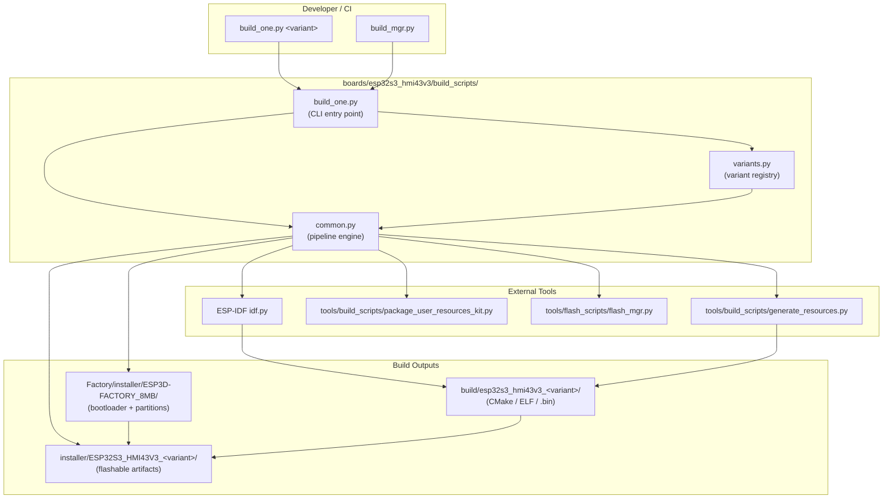
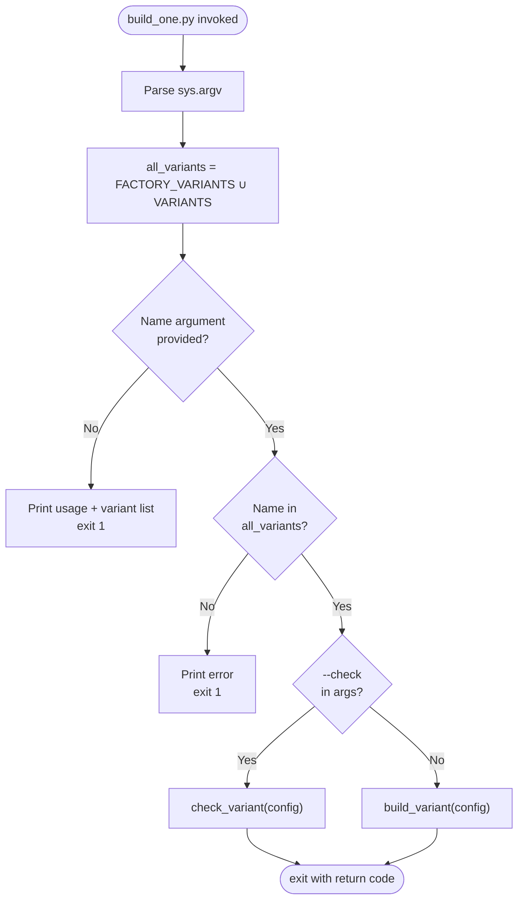
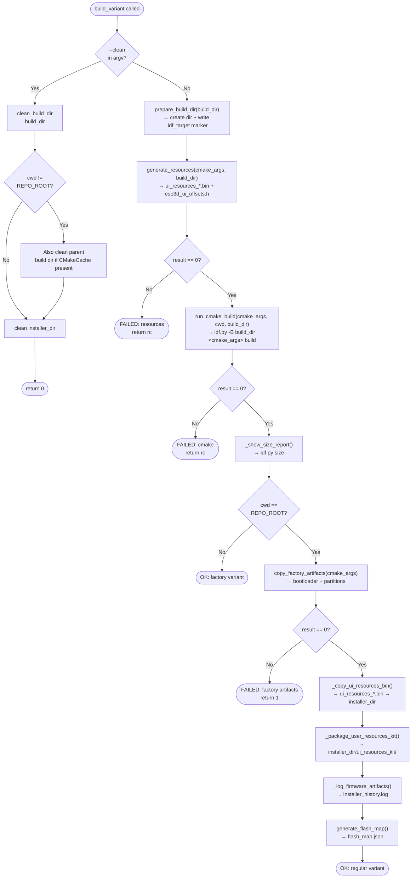
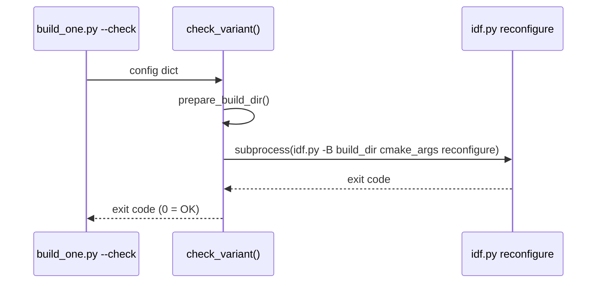
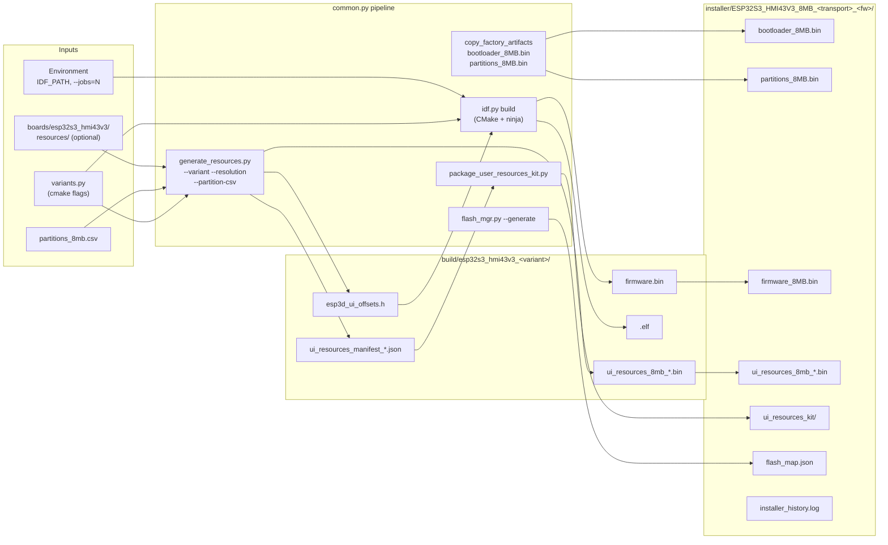
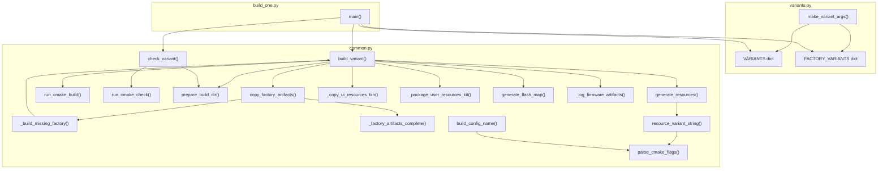
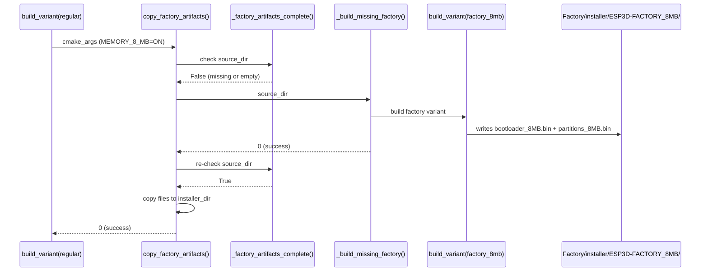
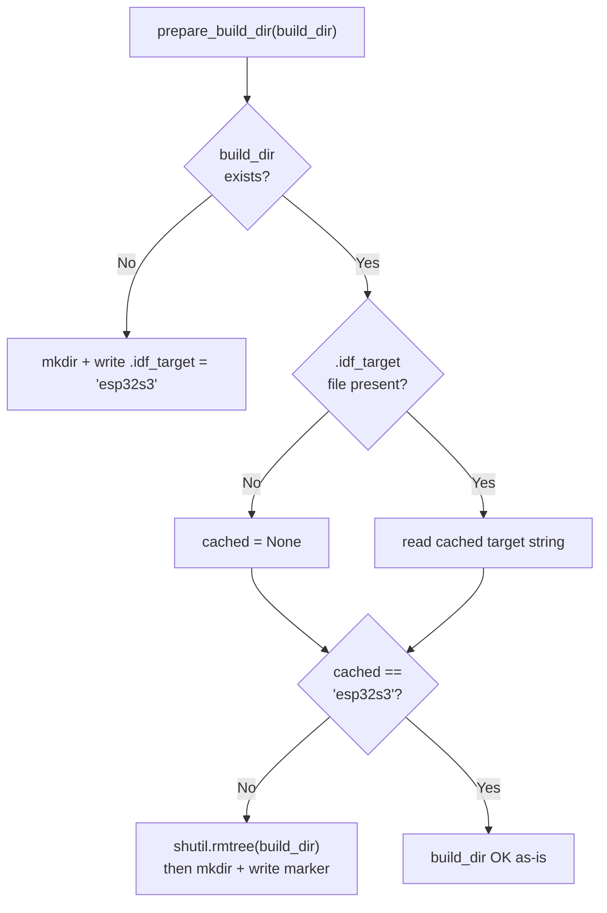
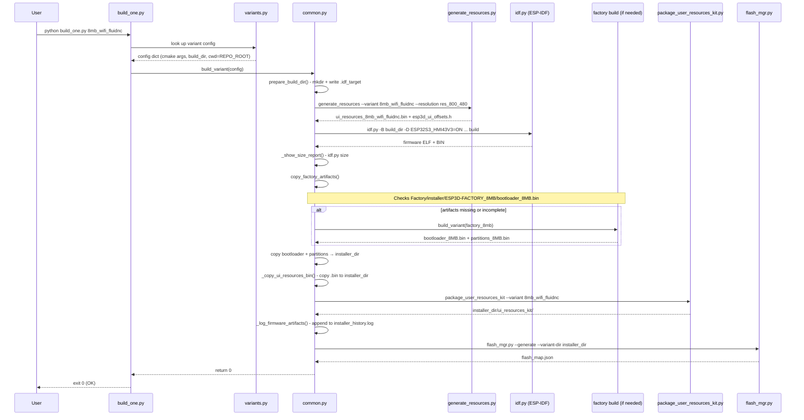

# ESP32-S3 HMI43V3 Build Scripts

The `esp32s3_hmi43v3_build_scripts` module provides the board-specific Python build orchestration for the **ESP32-S3 HMI43V3** panel — a 4.3-inch, 800×480 display board using the RM68120 controller over an Intel 8080 (i80) parallel interface. These scripts define every supported firmware variant, drive the ESP-IDF toolchain, regenerate the UI resources partition, assemble the factory artifacts, and produce a ready-to-flash installer directory — all from a single command.

---

## Module Overview

The module lives at `boards/esp32s3_hmi43v3/build_scripts/` and consists of exactly three files. This structure is the **same pattern** used by every board in the project (see [esp32s3_bzm_tft35_gt911_build_scripts.md](esp32s3_bzm_tft35_gt911_build_scripts.md), [pibot_pendant_v1_0_build_scripts.md](pibot_pendant_v1_0_build_scripts.md), etc.).

| File | Role |
|---|---|
| `build_one.py` | CLI entry point — parses arguments, resolves the variant, delegates to `common.py` |
| `common.py` | Build orchestration engine — all pipeline logic, path helpers, IDF invocation |
| `variants.py` | Variant registry — CMake flag matrices for every supported firmware configuration |

### Board Identity

| Property | Value |
|---|---|
| MCU | ESP32-S3 |
| Flash | 8 MB |
| Display | 4.3″ 800×480 RM68120 via Intel 8080 (i80) |
| Touch | Capacitive (I²C) |
| `IDF_TARGET` | `esp32s3` |
| Resolution token | `res_800_480` |
| Partition CSV | `partitions_8mb.csv` |

The BSP layer that initialises this hardware at runtime is documented in [esp32s3_hmi43v3_bsp.md](esp32s3_hmi43v3_bsp.md). The factory recovery application is documented in [esp32s3_hmi43v3_factory_app.md](esp32s3_hmi43v3_factory_app.md).

---

## Architecture



---

## File Descriptions

### `build_one.py` — CLI Entry Point

Provides a direct, single-variant build command. It is the human-facing interface; automated multi-variant builds use `build_mgr.py` (see [tools_build_scripts.md](tools_build_scripts.md)).

**Function: `main()`**

```
Usage: python build_one.py <variant_name> [--clean] [--check]
```

| Flag | Effect |
|---|---|
| _(none)_ | Full build: resources + firmware + postbuild steps |
| `--clean` | Wipe the build and installer directories, then exit |
| `--check` | CMake configure-only (`idf.py reconfigure`) — no compilation |

**Resolution logic:**



---

### `variants.py` — Variant Registry

Defines all supported firmware configurations as Python dictionaries. Each entry is a **variant config** consumed by `build_variant()`.

#### `make_variant_args(*on_flags)`

The central helper for constructing clean, reproducible CMake argument lists. It works by the **all-OFF-then-ON** principle:

1. `ROOT_CMAKE_OPTIONS` enumerates every known CMake option for the entire project (boards, memory sizes, transports, firmware targets, services).
2. `DEFAULT_OFF_CMAKE_ARGS` expands each into `-D <OPTION>=OFF`, resetting all options to a known baseline.
3. `make_variant_args(*on_flags)` copies `DEFAULT_OFF_CMAKE_ARGS` and appends each requested flag as `-D <FLAG>` (which must carry its own `=ON` suffix).

```python
# Example internal expansion for 8mb_wifi_fluidnc:
make_variant_args(
    "ESP32S3_HMI43V3=ON",
    "MEMORY_8_MB=ON",
    "TARGET_FW_FLUIDNC=ON",
    "SERIAL_SERVICE=ON",
    "WIFI_SERVICE=ON",
    "TFT_UI_SERVICE=ON",
    "TFT_TOUCH_SERVICE=ON",
    "MDNS_SERVICE=ON",
    "SOCKET_CLIENT_SERVICE=ON",
    "UPDATE_SERVICE=ON",
    "LUA_INTERPRETER_SERVICE=ON",
)
# Result: [..., -D ESP32S3_HMI43V3=OFF, ..., -D ESP32S3_HMI43V3=ON, ...]
#   All 60+ options forced OFF first, then only the 11 above set ON.
```

This guarantees that no stale CMakeCache value from a previous build can bleed into a new configuration.

#### Variant Config Schema

Every entry in `VARIANTS` and `FACTORY_VARIANTS` is a dict with four keys:

| Key | Type | Description |
|---|---|---|
| `name` | `str` | Human-readable identifier, also used as build-dir suffix |
| `cmake` | `list[str]` | Full cmake argument list produced by `make_variant_args()` |
| `cwd` | `str` | Working directory for `idf.py` — `REPO_ROOT` for regular variants, `FACTORY_DIR` for factory |
| `build_dir` | `str` | Absolute path to the dedicated CMake build directory |

#### Defined Variants

##### Firmware Variants (`VARIANTS`)

| Variant Name | Memory | Transport | CNC Firmware | Extra Services |
|---|---|---|---|---|
| `8mb_wifi_fluidnc` | 8 MB | Serial + WiFi | FluidNC | mDNS, Socket Client, Lua |
| `8mb_serial_fluidnc` | 8 MB | Serial | FluidNC | — |
| `8mb_serial_grbl` | 8 MB | Serial | GRBL | — |
| `8mb_wifi_grblhal` | 8 MB | Serial + WiFi | grblHAL | mDNS, Socket Client |

All firmware variants share: `ESP32S3_HMI43V3=ON`, `TFT_UI_SERVICE=ON`, `TFT_TOUCH_SERVICE=ON`, `UPDATE_SERVICE=ON`.

##### Factory Variant (`FACTORY_VARIANTS`)

| Variant Name | Purpose | `cwd` |
|---|---|---|
| `factory_8mb` | Recovery/test app flashed to factory partition | `boards/esp32s3_hmi43v3/Factory/` |

The factory build produces `bootloader_8MB.bin` and partition table binaries that are **mandatory prerequisites** for all regular firmware variants (see [esp32s3_hmi43v3_factory_app.md](esp32s3_hmi43v3_factory_app.md)).

#### Variant Naming Convention

```
{memory_mb}mb_{transport}_{firmware}

Examples:
  8mb_wifi_fluidnc
  8mb_serial_grbl
  8mb_wifi_grblhal
```

The same convention drives `build_config_name()` in `common.py` to derive the installer output directory name (`ESP32S3_HMI43V3_8MB_wifi_fluidnc`, etc.) and `resource_variant_string()` to select the correct UI partition configuration.

---

### `common.py` — Build Orchestration Engine

Contains all pipeline logic. It is imported by both `build_one.py` and the project-wide `build_mgr.py`.

#### Path Constants

| Constant | Value | Purpose |
|---|---|---|
| `SCRIPT_DIR` | `boards/esp32s3_hmi43v3/build_scripts/` | Location of these scripts |
| `BOARD_ROOT` | `boards/esp32s3_hmi43v3/` | Root of this board's tree |
| `REPO_ROOT` | Repository root | `cwd` for regular firmware variants |
| `IDF_PATH` | `$IDF_PATH` env or Windows default | ESP-IDF installation |
| `IDF_PY` | `$IDF_PATH/tools/idf.py` | ESP-IDF build entry point |
| `GENERATE_RESOURCES` | `tools/build_scripts/generate_resources.py` | UI partition generator |
| `PACKAGE_USER_KIT` | `tools/build_scripts/package_user_resources_kit.py` | Kit packager |
| `RESOLUTION` | `"res_800_480"` | Board display resolution token |
| `EXPECTED_IDF_TARGET` | `"esp32s3"` | Enforced IDF target for this board |

#### `build_variant(config)` — Full Build Pipeline

The primary public function. Executes the complete sequence to produce a flashable installer directory:



#### `check_variant(config)` — Configuration Validation

Runs `idf.py reconfigure` (CMake configure step only, no compilation). Used for rapid CMake flag validation without a full compile.



#### Helper Functions Reference

| Function | Returns | Purpose |
|---|---|---|
| `parse_cmake_flags(cmake_args)` | `dict` | Extracts `-D KEY=VALUE` pairs from a cmake args list |
| `build_config_name(cmake_args)` | `str` | Derives `ESP32S3_HMI43V3_8MB_wifi_fluidnc`-style installer dir name |
| `resource_variant_string(cmake_args)` | `str or None` | Derives `8mb_wifi_fluidnc`-style string for `generate_resources.py --variant` |
| `installer_dir_for(config)` | `str or None` | Returns the absolute installer output dir for a config |
| `prepare_build_dir(build_dir)` | — | Creates the build dir and writes `.idf_target`; clears it if target changed |
| `_ensure_clean_build_dir(build_dir)` | — | Clears build_dir if `.idf_target` mismatches `EXPECTED_IDF_TARGET` |
| `clean_build_dir(build_dir)` | — | `shutil.rmtree` wrapper with logging |
| `ensure_idf_py()` | — | Verifies `IDF_PY` exists; exits 1 with instructions if not |
| `run_cmake_build(cmake_args, cwd, build_dir)` | `int` | Invokes `idf.py -B build_dir … build` with correct env |
| `run_cmake_check(cmake_args, cwd, build_dir)` | `int` | Invokes `idf.py -B build_dir … reconfigure` |
| `generate_resources(cmake_args, build_dir)` | `int` | Calls `generate_resources.py` to produce the UI partition binary |
| `copy_factory_artifacts(cmake_args)` | `int` | Copies bootloader/partition binaries from factory installer dir; auto-builds factory if missing |
| `_factory_artifacts_complete(source_dir)` | `bool` | Returns True only when a `bootloader_*.bin` is present in the factory installer dir |
| `_build_missing_factory(source_dir)` | `int` | Finds and rebuilds the factory variant matching the given installer dir |
| `_copy_ui_resources_bin(build_dir, installer_dir)` | — | Copies `ui_resources_*.bin` from build_dir to installer_dir |
| `_package_user_resources_kit(cmake_args, build_dir, installer_dir)` | `int` | Runs `package_user_resources_kit.py` to assemble the standalone customization kit |
| `_log_firmware_artifacts(variant_name, build_dir, installer_dir, cmake_args)` | — | Appends a timestamped FIRMWARE section to `installer_history.log` |
| `_show_size_report(build_dir, cwd)` | — | Runs `idf.py size` after a successful build |
| `generate_flash_map(config)` | — | Calls `flash_mgr.py --generate` to produce `flash_map.json` |
| `_get_jobs_env_value()` | `str or None` | Reads `--jobs=N` from argv for `CMAKE_BUILD_PARALLEL_LEVEL` |

---

## Data Flow



---

## Component Interaction



---

## Factory Artifact Dependency

Regular firmware variants require bootloader and partition binaries produced by the factory variant. `common.py` enforces this dependency automatically:



`_factory_artifacts_complete()` validates the presence of a `bootloader_*.bin` file (not just directory existence) because CMake creates the target directory during configure but populates it only after a successful factory build.

---

## IDF Target Guard

To prevent corrupted builds when switching between different `IDF_TARGET` values, `prepare_build_dir()` writes an `.idf_target` marker file and validates it on every invocation:



---

## Build Outputs Layout

After a complete regular variant build, the following directory structure is produced:

```
build/
└── esp32s3_hmi43v3_8mb_wifi_fluidnc/        # CMake build artifacts
    ├── .idf_target                            # Target marker ('esp32s3')
    ├── esp3d_ui_offsets.h                     # Generated UI offset header
    ├── ui_resources_8mb_wifi_fluidnc.bin      # UI resources partition binary
    ├── ui_resources_manifest_8mb_wifi_fluidnc.json
    ├── firmware.elf
    └── ...

installer/
└── ESP32S3_HMI43V3_8MB_wifi_fluidnc/         # Flashable artifacts
    ├── bootloader_8MB.bin                     # From factory build
    ├── partitions_8MB.bin                     # From factory build
    ├── firmware_8MB.bin                       # Main application binary
    ├── ui_resources_8mb_wifi_fluidnc.bin      # UI partition binary
    ├── flash_map.json                         # Flash addresses + offsets
    ├── installer_history.log                  # Timestamped build provenance
    └── ui_resources_kit/                      # Standalone customization kit
        ├── build_ui_resources_from_manifest.py
        ├── ui_resources_manifest_*.json
        └── ...

boards/esp32s3_hmi43v3/Factory/installer/
└── ESP3D-FACTORY_8MB/                         # Factory variant outputs
    ├── bootloader_8MB.bin
    └── partitions_8MB.bin
```

---

## CMake Flag Categories

`ROOT_CMAKE_OPTIONS` in `variants.py` enumerates every project-level option. The categories relevant to this board are:

| Category | Options Used for This Board |
|---|---|
| **Board selection** | `ESP32S3_HMI43V3` |
| **Flash memory** | `MEMORY_8_MB` |
| **PSRAM** | _(not used in current variants)_ |
| **CNC firmware target** | `TARGET_FW_FLUIDNC`, `TARGET_FW_GRBLHAL`, `TARGET_FW_GRBL` |
| **Communication** | `SERIAL_SERVICE`, `WIFI_SERVICE`, `SOCKET_CLIENT_SERVICE` |
| **Display / Touch** | `TFT_UI_SERVICE`, `TFT_TOUCH_SERVICE` |
| **Discovery** | `MDNS_SERVICE` |
| **Scripting** | `LUA_INTERPRETER_SERVICE` |
| **OTA** | `UPDATE_SERVICE` |

All other options in `ROOT_CMAKE_OPTIONS` are forced to `OFF` by `make_variant_args()` to prevent any residual CMakeCache state from affecting the output.

For the full list of options and their interactions (sanity checks, mutual exclusions), see [board_build_guidelines.md](https://github.com/luc-github/Pibot-cnc-pendant-firmware/blob/main/docs/guides/board_build_guidelines.md).

---

## Parallel Build Support

`idf.py` has no native `-j` / `--jobs` option. Parallelism is conveyed through the `CMAKE_BUILD_PARALLEL_LEVEL` environment variable, which the underlying `cmake --build` step honours regardless of generator (Ninja or Make):

```python
# _get_jobs_env_value() reads --jobs=N injected by build_mgr.py,
# then sets env["CMAKE_BUILD_PARALLEL_LEVEL"] = N before subprocess.run().
```

`build_mgr.py` (see [tools_build_scripts.md](tools_build_scripts.md)) injects `--jobs=N` when invoking per-board build scripts in parallel.

---

## UI Resources Integration

Before any firmware compilation, `generate_resources()` calls `generate_resources.py` with the exact variant flags, ensuring that:

1. The `ui_resources` partition binary matches the flash layout defined by `partitions_8mb.csv`.
2. The generated `esp3d_ui_offsets.h` header is present in the build directory before the C++ compiler reads it.
3. Board-specific UI overrides (icons, fonts, theme colours) in `boards/esp32s3_hmi43v3/resources/` are applied when the directory exists.

The `resource_variant_string()` function bridges the CMake flag domain into the naming convention consumed by `generate_resources.py`:

```
cmake flags                    →    resource variant string
MEMORY_8_MB=ON                 →    "8"  → "8mb"
WIFI_SERVICE=ON                →    "wifi"
TARGET_FW_FLUIDNC=ON           →    "fluidnc"
──────────────────────────────      ──────────────────────────
combined                       →    "8mb_wifi_fluidnc"
```

For full details on the UI resources system, partition binary format, and the `ui_resources_kit/`, see [development.md](https://github.com/luc-github/Pibot-cnc-pendant-firmware/blob/main/docs/ui_resources/development.md).

---

## Full Regular Variant Build: Sequence Diagram



---

## Quick Usage Reference

```bash
# Activate ESP-IDF environment first
. $IDF_PATH/export.sh          # Linux / macOS
# or: %IDF_PATH%\export.bat   (Windows)

cd boards/esp32s3_hmi43v3/build_scripts/

# List all available variants
python build_one.py

# Build specific firmware variants
python build_one.py 8mb_wifi_fluidnc
python build_one.py 8mb_serial_fluidnc
python build_one.py 8mb_serial_grbl
python build_one.py 8mb_wifi_grblhal

# Build the factory recovery app
python build_one.py factory_8mb

# Validate CMake configuration without compiling
python build_one.py 8mb_wifi_fluidnc --check

# Full clean then rebuild
python build_one.py 8mb_wifi_fluidnc --clean
python build_one.py 8mb_wifi_fluidnc

# Development build (skips -DPROD_BUILD=ON)
python build_one.py 8mb_wifi_fluidnc --dev

# Build all variants via build manager (parallel)
python tools/build_scripts/build_mgr.py --board esp32s3_hmi43v3 --jobs=4
```

---

## Related Modules

| Module | Relationship |
|---|---|
| [esp32s3_hmi43v3_bsp.md](esp32s3_hmi43v3_bsp.md) | Runtime BSP: `board_init()`, LVGL setup, i80 flush callback — built by the firmware variants defined here |
| [esp32s3_hmi43v3_factory_app.md](esp32s3_hmi43v3_factory_app.md) | Factory recovery app built by `factory_8mb`; provides bootloader and partition binaries required by all regular variants |
| [tools_build_scripts.md](tools_build_scripts.md) | Shared build tools: `build_mgr.py` (multi-board orchestrator), `generate_resources.py` (UI partition generator), `package_user_resources_kit.py` (kit assembler), `flash_mgr.py` (flash map generator) |
| [development.md](https://github.com/luc-github/Pibot-cnc-pendant-firmware/blob/main/docs/ui_resources/development.md) | UI resources partition: binary format, `esp3d_ui_offsets.h` API, resource variant naming, board-specific overrides |
| [board_build_guidelines.md](https://github.com/luc-github/Pibot-cnc-pendant-firmware/blob/main/docs/guides/board_build_guidelines.md) | Board-level build conventions, CMake option interactions, and sanity checks shared across all BSPs |
| [esp32s3_bzm_tft35_gt911_build_scripts.md](esp32s3_bzm_tft35_gt911_build_scripts.md) | Sibling board build scripts — same three-file pattern, different display (SPI ST7796 + GT911 touch) |
| [pibot_pendant_v1_0_build_scripts.md](pibot_pendant_v1_0_build_scripts.md) | Sibling board build scripts — same three-file pattern, pendant hardware with ILI9341 |
| [esp32s3_8048s070c_build_scripts.md](esp32s3_8048s070c_build_scripts.md) | Sibling board build scripts — RGB panel (ST7262), larger 7″ display |
