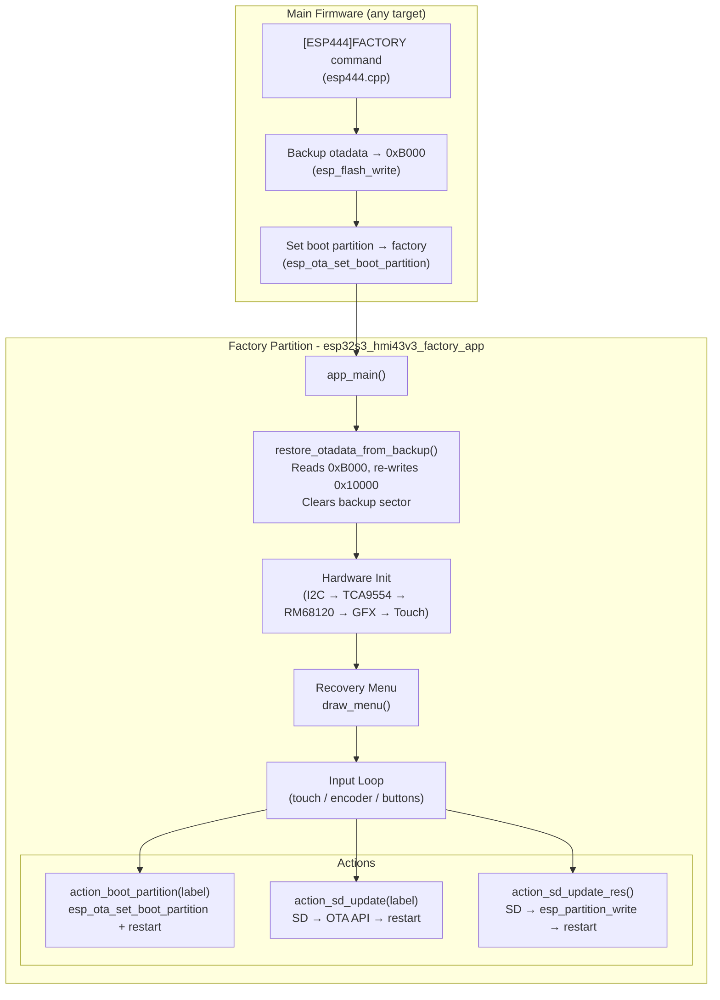
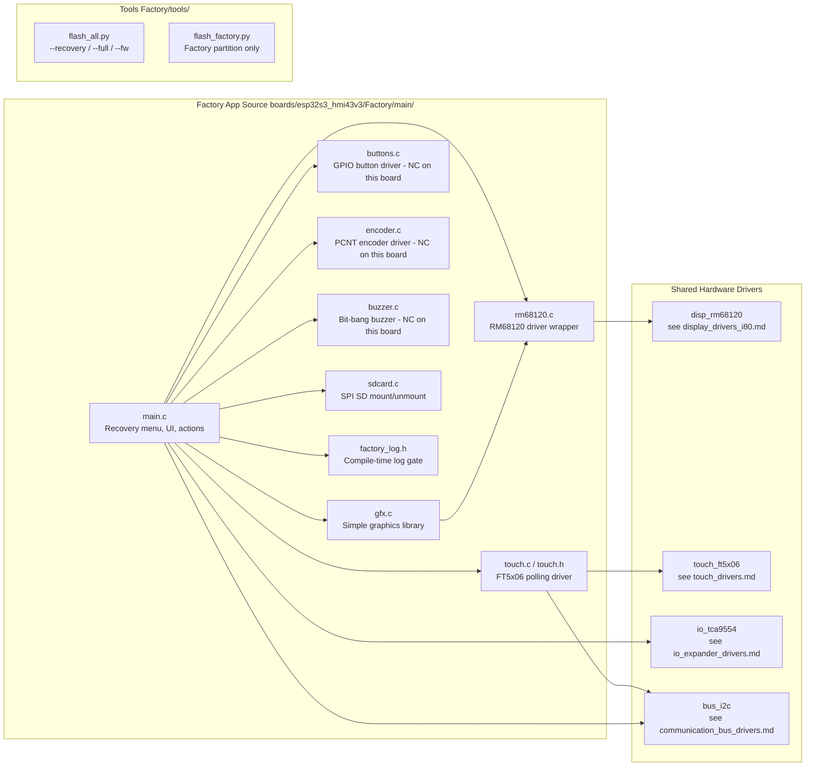
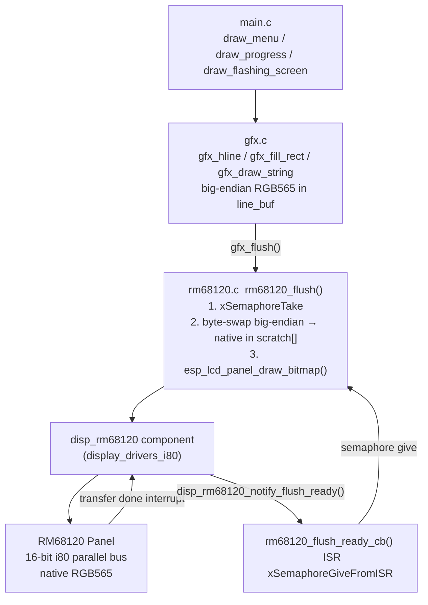
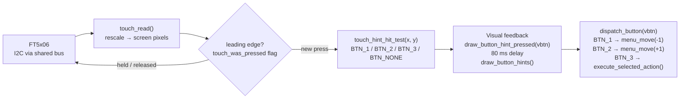
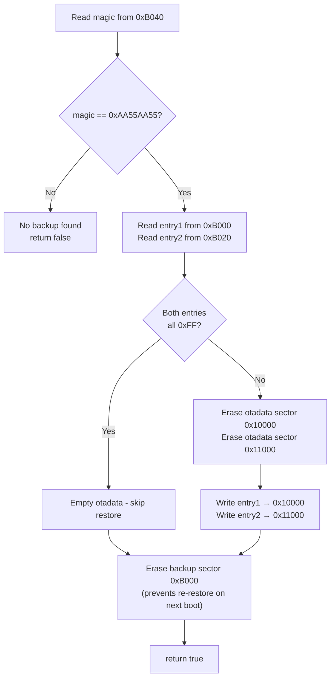
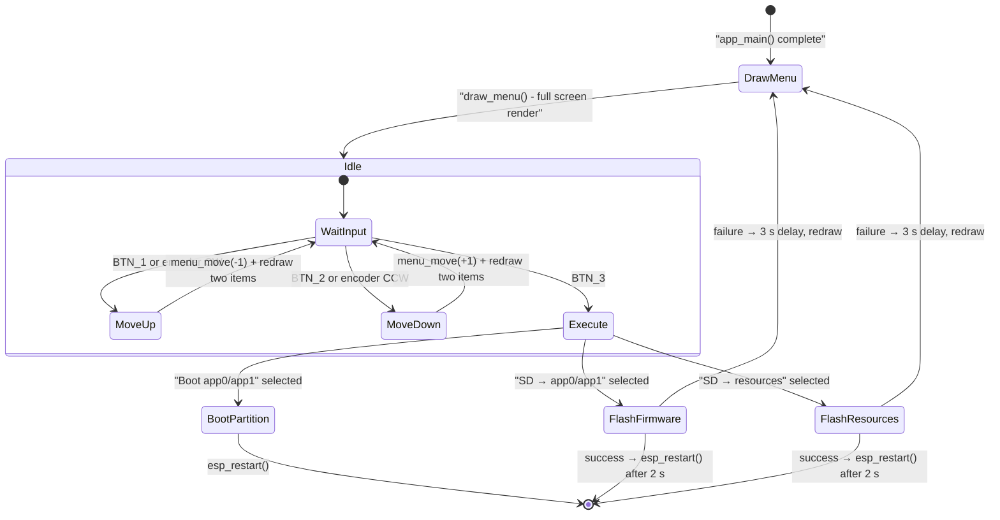
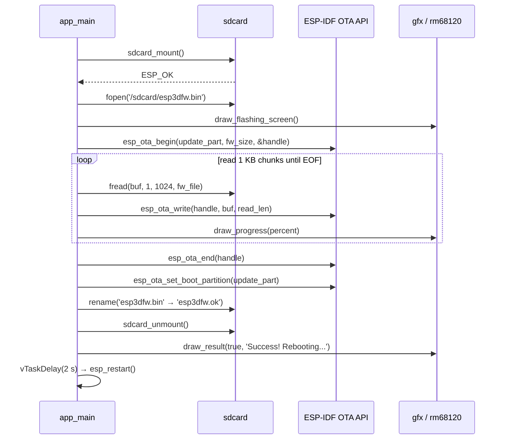
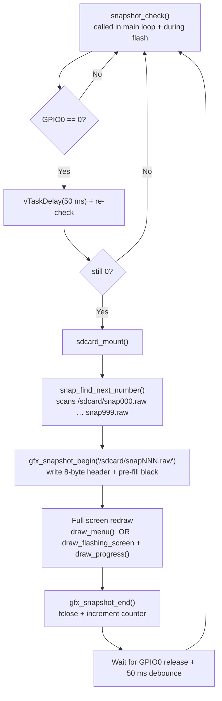
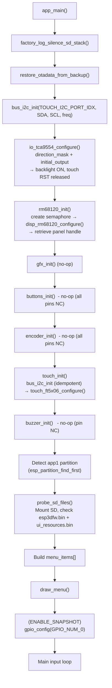

# esp32s3_hmi43v3_factory_app — Factory / Recovery Application

## Introduction

The `esp32s3_hmi43v3_factory_app` is a self-contained recovery firmware for the
ESP32-S3 HMI 4.3" v3 board. It occupies the `factory` OTA partition and runs
when the main pendant firmware triggers a recovery boot via the
`[ESP444]FACTORY` software command. The application provides a touch-navigable
menu that can boot any OTA slot, flash new firmware from an SD card, and update
the UI resource partition — all without requiring a PC connection.

This board has **no physical buttons, no rotary encoder, and no buzzer**. Every
navigation action is performed through three virtual on-screen icons rendered in
a fixed hint bar at the bottom of the display and driven by the FT5x06
capacitive touch controller. The hardware driver code for buttons, encoder, and
buzzer is preserved unchanged from sister boards (see
[pibot_pendant_v1_0_factory_app.md](pibot_pendant_v1_0_factory_app.md)) and
gracefully no-ops when all pins are `GPIO_NUM_NC`.

---

## Module Overview

| Property | Value |
|---|---|
| Target MCU | ESP32-S3 |
| Display controller | RM68120, 16-bit i80 (8080 parallel) bus |
| Physical panel orientation | 480 × 272 landscape |
| Logical canvas (rotated 90° in enclosure) | 272 × 480 portrait |
| Touch controller | FT5x06 (I2C) |
| IO expander | TCA9554 (I2C) — backlight enable, touch reset |
| Physical buttons | **None** (all `GPIO_NUM_NC`) |
| Rotary encoder | **None** (all `GPIO_NUM_NC`) |
| Buzzer | **None** (`GPIO_NUM_NC`) |
| SD card interface | SPI (`SD_SPI_HOST`) |
| Recovery entry | Software trigger only (main firmware `[ESP444]FACTORY` command) |
| Custom bootloader hook | **None** — `ENABLE_CUSTOM_BOOT_LOADER` is off |
| OTA backup author | Main firmware (`esp444.cpp`) |
| Snapshot debug feature | Optional (`ENABLE_SNAPSHOT`), GPIO0 trigger |

---

## Architecture



---

## Component Reference



### `main.c` — Recovery Application Core

The entry point and orchestrator. Responsibilities:

- Call `restore_otadata_from_backup()` before any other operation.
- Initialize peripherals in the correct order: I2C bus → TCA9554 → RM68120 → GFX → buttons → encoder → touch → buzzer.
- Probe the SD card for `esp3dfw.bin` / `ui_resources.bin` and build the menu accordingly.
- Run the input loop: encoder clicks, physical buttons (no-ops), and touch events all funnel through `dispatch_button()`.
- Execute the selected menu action on BTN_3 (virtual OK button).

Key types and functions:

| Symbol | Description |
|---|---|
| `menu_item_t` | `{ label, action, color }` — one menu entry |
| `restore_otadata_from_backup()` | Reads backup at `0xB000`, re-writes `0x10000`, clears backup sector |
| `boot_partition(label)` | Calls `esp_ota_set_boot_partition` then `esp_restart` |
| `probe_sd_files()` | Mounts SD, checks for `esp3dfw.bin` and `ui_resources.bin`, unmounts |
| `draw_menu()` | Full screen redraw: header, active-partition info, SD indicators, all items, footer, hint bar |
| `draw_menu_item(index)` | Redraws a single item; draws highlight box when selected |
| `menu_move(direction)` | Wraps selection index and redraws the two affected items |
| `dispatch_button(btn)` | Routes BTN_1→up, BTN_2→down, BTN_3→execute |
| `touch_hint_hit_test(x, y)` | Assigns a touch point to BTN_1/2/3 using icon-centre midpoints (not screen thirds) |
| `draw_button_hints()` | Draws the three circular icons in the bottom hint bar |
| `draw_button_hint_pressed(btn)` | Briefly recolours one icon for touch-press visual feedback |
| `show_status(msg, color)` | Writes a message into the footer zone |
| `clear_status()` | Restores the "Power off to cancel" default footer |
| `draw_progress(percent)` | Renders a progress bar and percentage label during flash |
| `action_boot_partition(label)` | Boots named partition; shows error if not found |
| `action_sd_update(label)` | Flashes `esp3dfw.bin` to named OTA partition |
| `action_sd_update_res()` | Flashes `ui_resources.bin` to the `ui_resources` data partition |
| `snapshot_take()` | Debug: captures full-screen redraw to SD as a `.raw` file |
| `snapshot_check()` | Polls GPIO0 and calls `snapshot_take()` on press |

---

### `gfx.c` — Graphics Library

A minimal software-rendered drawing layer that operates one **horizontal scan
line** at a time using a static `line_buf[SCREEN_WIDTH]` array. No heap
allocation; all operations write into `line_buf` and flush via `gfx_flush()`.

**Pixel encoding**: Every pixel is stored as **big-endian RGB565** (SPI
convention: `swapped = (color >> 8) | (color << 8)`). The `rm68120.c` wrapper
byte-swaps back to native endian before sending to the display controller. This
convention is shared by every board's `gfx.c`; the per-board display wrapper is
responsible for undoing the swap.

| Function | Description |
|---|---|
| `gfx_init()` | No-op; reserves extensibility |
| `gfx_clear(color)` | Fills screen line-by-line |
| `gfx_hline(x, y, w, color)` | Horizontal line; clips to screen bounds |
| `gfx_vline(x, y, h, color)` | Vertical line; one `gfx_flush()` call per pixel |
| `gfx_rect(x, y, w, h, color)` | Four-sided outline via four line calls |
| `gfx_fill_rect(x, y, w, h, color)` | Filled rectangle, row-by-row |
| `gfx_draw_char(x, y, c, fg, bg)` | 12×24 bitmap glyph from the embedded `font12x24` table |
| `gfx_draw_string(x, y, str, fg, bg)` | Calls `gfx_draw_char` per character; stops at screen edge |
| `gfx_flush(x0,y0,x1,y1,data,count)` | **Internal**: calls `rm68120_flush` and optionally `snap_write` |
| `gfx_snapshot_begin(filepath)` | Opens `.raw` file, writes 8-byte header, pre-fills black |
| `gfx_snapshot_end()` | Closes the `.raw` file |
| `gfx_snapshot_is_capturing()` | Returns `true` while a snapshot file is open |
| `snap_write(...)` | Byte-swaps big-endian pixels back to native, seeks to pixel offset, writes |

---

### `rm68120.c` — RM68120 Display Driver Wrapper

Wraps the shared `disp_rm68120` component (see
[display_drivers_i80.md](display_drivers_i80.md)) with the synchronisation
logic the factory app's synchronous drawing model requires.

The RM68120 i80 bus uses **asynchronous transfers**: `esp_lcd_panel_draw_bitmap()`
queues the transfer and returns immediately; the ISR callback fires when it
completes. The factory app must not overwrite the shared `scratch[]` buffer
until the previous transfer finishes.

**Synchronisation** uses a pre-given binary semaphore:

```
Init:             xSemaphoreGive(s_flush_done_sem)      ← pre-given; first flush proceeds immediately
rm68120_flush():
  1.              xSemaphoreTake(s_flush_done_sem)       ← block until previous done
  2.              byte-swap pixels into scratch[]
  3.              esp_lcd_panel_draw_bitmap(...)          ← queue new transfer
rm68120_flush_ready_cb() [ISR, IRAM_ATTR]:
                  xSemaphoreGiveFromISR(s_flush_done_sem) ← unblock next flush
```

This is the factory app's equivalent of the BSP's LVGL-oriented
`i80_flush_ready_cb()` → `lv_display_flush_ready()` pattern (see
[esp32s3_hmi43v3_bsp.md](esp32s3_hmi43v3_bsp.md)).

The ISR callback chain:

```
ESP-LCD i80 transfer done
  → disp_rm68120_notify_flush_ready()   (internal, registered with esp-lcd)
    → rm68120_flush_ready_cb()          (factory app, passed as user_ctx)
      → xSemaphoreGiveFromISR()
```

**Byte-swap**: `gfx.c` produces big-endian RGB565; the i80 panel needs native
endian. `rm68120_flush()` un-swaps into a static `scratch[SCREEN_WIDTH]` buffer
(no heap allocation) before calling `esp_lcd_panel_draw_bitmap()`. Pixel count
is clamped to `SCREEN_WIDTH` as a safety guard.

| Symbol | Description |
|---|---|
| `rm68120_init()` | Creates semaphore (pre-given), calls `disp_rm68120_configure()`, retrieves panel handle |
| `rm68120_flush_ready_cb()` (IRAM_ATTR) | ISR: gives `s_flush_done_sem` with `portYIELD_FROM_ISR` |
| `rm68120_flush(x0,y0,x1,y1,data,len)` | Takes semaphore, byte-swaps into `scratch[]`, calls `esp_lcd_panel_draw_bitmap()` |

---

### `touch.c` / `touch.h` — FT5x06 Touch Driver

Thin wrapper over the shared `touch_ft5x06` component (see
[touch_drivers.md](touch_drivers.md)).

**Notable quirks for this board**:

- The FT5x06 auto-detected x/y maximum values are **unreliable on this hardware**.
  Hard-coded `TOUCH_X_MAX` and `TOUCH_Y_MAX` from `hw_config.h` are used instead.
- The I2C bus is already up when `touch_init()` runs (the TCA9554 initialisation
  in `app_main()` brings it up first). `bus_i2c_init()` inside `touch_init()` is
  idempotent and returns `ESP_OK` without reinitialising.
- The touch reset pin is routed through the TCA9554 IO expander. The TCA9554
  `initial_output` mask releases reset before `touch_init()` is called, so the
  FT5x06 is already out of reset when the driver configures it.

```c
typedef struct {
    bool     pressed;
    int16_t  x;   /* screen pixel column  (0 … SCREEN_WIDTH-1)  */
    int16_t  y;   /* screen pixel row     (0 … SCREEN_HEIGHT-1) */
} touch_point_t;
```

Coordinate mapping applied in `touch_read()`:

```
x_screen = data.x * SCREEN_WIDTH  / touch_ft5x06_get_x_max()
y_screen = data.y * SCREEN_HEIGHT / touch_ft5x06_get_y_max()
```

---

### `buttons.c` — Button Driver

Implements `buttons_init()`, `button_is_pressed()`, and `button_wait_press()`.
On this board every button pin is `GPIO_NUM_NC`; `buttons_init()` computes a
zero pin-mask and returns without touching GPIO hardware.
`button_wait_press(100 ms)` is called each main loop iteration and always
returns `BTN_NONE`, so `dispatch_button` no-ops. Code is preserved unchanged
from sister boards for portability.

The `pin_bit()` helper converts a `gpio_num_t` at runtime using
`GPIO_IS_VALID_GPIO()` to avoid undefined behaviour from a negative shift on
`GPIO_NUM_NC` (which equals `-1`).

---

### `buzzer.c` — Buzzer Driver

Bit-bang square-wave buzzer (2 700 Hz, 40 ms). Same technique as the
pibot_pendant_v1_0 custom bootloader's `beep_short()` (see
[pibot_pendant_v1_0_bootloader.md](pibot_pendant_v1_0_bootloader.md)). On
this board `BUZZER_PIN` is `GPIO_NUM_NC`; both `buzzer_init()` and
`buzzer_beep_short()` guard on `GPIO_IS_VALID_GPIO(BUZZER_PIN)` and return
immediately.

---

### `encoder.c` — Rotary Encoder Driver

PCNT-based quadrature decoder (100-detent, `PULSES_PER_DETENT = 4`, glitch
filter 1 000 ns). On this board `ENCODER_A_PIN` and `ENCODER_B_PIN` are
`GPIO_NUM_NC`; `encoder_init()` detects this and returns `ESP_OK` without
touching the PCNT peripheral. `encoder_read()` checks `s_initialized` and
always returns `0`. In the main loop: CW → `menu_move(-1)` (up), CCW →
`menu_move(+1)` (down).

---

### `sdcard.c` — SD Card Driver

SPI-mode SD via ESP-IDF's `esp_vfs_fat_sdspi_mount()`.

| Design decision | Detail |
|---|---|
| Idempotent mount | `card != NULL` guard avoids double-mounting |
| SPI bus lifecycle | Initialised once (`spi_bus_inited` guard); **never freed** on unmount — freeing can interfere with TFT SPI; reused on re-mount |
| Mount point | `/sdcard` |
| Max open files | 4 |
| Format on failure | `false` — the factory app never formats a card |

---

### `factory_log.h` — Log Gate

Compile-time log level gate independent of `sdkconfig`:

```c
#if FACTORY_LOG_LEVEL
#define FACTORY_LOGD(tag, fmt, ...) ESP_LOGI(tag, fmt, ##__VA_ARGS__)
#else
#define FACTORY_LOGD(tag, fmt, ...) do {} while (0)
#endif
```

`FACTORY_LOG_LEVEL` is set by `ENABLE_FACTORY_DEBUG_LOG` in
`Factory/CMakeLists.txt`. Warnings and errors (`ESP_LOGW` / `ESP_LOGE`) are
always active regardless of this gate.

`factory_log_silence_sd_stack()` mutes eight ESP-IDF SD/FAT driver log tags at
runtime (`sdmmc`, `vfs_fat_sdmmc`, `sdmmc_periph`, `sdmmc_req`, `sdmmc_common`,
`fatfs`, `sdspi`, `sd_diskio`). This is necessary in debug builds where the
sdkconfig log ceiling is raised to `INFO` — without it the SD stack floods UART
with internal chatter that is not useful for debugging the factory app.

---

## Display System



### Pixel Endian Convention

```
gfx.c layer     big-endian     (color >> 8) | (color << 8)
rm68120.c        un-swap        (v >> 8) | (v << 8)  into scratch[]
Panel            native RGB565  transmitted on i80 bus
```

### Physical vs. Logical Resolution

The RM68120 panel is physically 480 × 272 (landscape). The pendant enclosure
mounts it rotated 90°, so the factory app's logical canvas is **272 wide ×
480 tall** (portrait). All layout constants (`SCREEN_WIDTH`, `SCREEN_HEIGHT`,
`MENU_START_Y`, etc.) in `hw_config.h` reflect the **logical** portrait
dimensions. The RM68120 driver is configured with
`DISP_RM68120_ORIENTATION_LANDSCAPE`, which handles the physical rotation.

---

## Input System

This board is **touch-only**. The three virtual navigation icons rendered in the
bottom hint bar act as BTN_1 (▲ up), BTN_2 (▼ down), and BTN_3 (✔ confirm).



### Touch Hit-Testing

Three icon centres are at fixed horizontal positions:

```
BTN_HINT_CX1 = SCREEN_WIDTH/2 - 100    ▲  Up
BTN_HINT_CX2 = SCREEN_WIDTH/2          ▼  Down
BTN_HINT_CX3 = SCREEN_WIDTH/2 + 100    ✔  OK / Select
```

Hit regions use **midpoints between icon centres**, not screen-width thirds.
On a 272 px wide canvas the icons span roughly the central 200 px; a
thirds-split would assign incorrect zones to BTN_1 and BTN_3.

```
x < (CX1+CX2)/2   →  BTN_1
x < (CX2+CX3)/2   →  BTN_2
x ≥ (CX2+CX3)/2   →  BTN_3
```

A `touch_was_pressed` flag prevents repeated triggering on a held touch;
`dispatch_button` fires only on the **leading edge** of each press.

---

## Recovery Entry and OTA Backup / Restore

### Entry Path Comparison

| Boards with physical buttons | esp32s3_hmi43v3 |
|---|---|
| Custom bootloader (`hooks.c`) backs up and erases otadata at boot time when the button is held | No custom bootloader |
| Recovery partition boots when otadata is erased | Recovery triggered by main firmware `[ESP444]FACTORY` command |
| Backup written by bootloader (`esp_rom_spiflash_write`) | Backup written by main firmware (`esp444.cpp`, `esp_flash_write`) |

See [pibot_pendant_v1_0_bootloader.md](pibot_pendant_v1_0_bootloader.md) for
the bootloader-side backup details.

### Backup Sector Layout (flash offset `0xB000`, 4 KB sector)

```
Offset  Size  Content
0x00    32    entry1 — first OTA data record
0x20    32    entry2 — second OTA data record
0x40     4    magic  — 0xAA55AA55 (confirms valid backup)
0x44    …    0xFF padding
```

The backup sector sits between the bootloader end and the partition table
(`0xC000`), which is partition-free space on all supported flash layouts.

### `restore_otadata_from_backup()` Flow



> **sdkconfig requirement**: The factory sdkconfig must set
> `CONFIG_SPI_FLASH_DANGEROUS_WRITE_ALLOWED=y`. `esp_flash_erase_region(NULL,
> 0xB000, …)` targets an address below the first partition; ESP-IDF aborts by
> default for such addresses. This is intentional — the factory app is a
> privileged recovery tool that manages flash directly.

---

## Recovery Menu



### Menu Items

Items are built dynamically at startup based on detected partitions and SD
content:

| Label | Action enum | Color | Condition |
|---|---|---|---|
| Boot app0 | `MENU_ACTION_BOOT_APP0` | White | Always |
| Boot app1 | `MENU_ACTION_BOOT_APP1` | White | Only if `app1` partition exists |
| SD → app0 | `MENU_ACTION_SD_UPDATE_APP0` | Green | Always (SD probed at run time) |
| SD → app1 | `MENU_ACTION_SD_UPDATE_APP1` | Green | Only if `app1` partition exists |
| SD → resources | `MENU_ACTION_SD_UPDATE_RES` | Cyan | Always |

The selected item is highlighted with a dark-blue box (`MENU_HIGHLIGHT`) and
bright-blue text (`MENU_HIGHLIGHT_TXT`). All other items use their assigned
`color`.

### Screen Layout (272 × 480 portrait logical canvas)

```
┌──────────────────────────────────────────┐  y=0
│  Recovery vX.Y.Z              (header)   │  y=13
├──────────────────────────────────────────┤  y=40
│  Active: app0 (default)  SD: FW RES      │  y=45–68
├──────────────────────────────────────────┤  y=88
│  ┌──────────────────────────────────┐    │  MENU_START_Y=94
│  │  Boot app0    ← selected, blue  │    │  MENU_ITEM_H=34
│  ├──────────────────────────────────┤    │
│  │  SD → app0                      │    │
│  ├──────────────────────────────────┤    │
│  │  SD → resources                 │    │
│  └──────────────────────────────────┘    │
├──────────────────────────────────────────┤  STATUS_Y
│  Power off to cancel  (or status msg)    │  footer zone
├──────────────────────────────────────────┤  BTN_HINT_BASE_Y
│   (▲ BTN_1)  (▼ BTN_2)  (✔ BTN_3)      │  hint bar (BTN_HINT_H px)
└──────────────────────────────────────────┘  SCREEN_HEIGHT=480
     CX1=36      CX2=136     CX3=236        (SCREEN_WIDTH=272)
```

---

## Flash Operations

### Firmware Flash — `action_sd_update(label)`



On failure, the OTA handle is aborted via `esp_ota_abort()`, the file is renamed
to `esp3dfw.bad`, and the menu is redrawn after a 3 s delay.

### Resources Flash — `action_sd_update_res()`

Uses `esp_partition_erase_range()` + `esp_partition_write()` instead of the OTA
API (the `ui_resources` partition has type `DATA`, not `APP`).

| Step | Detail |
|---|---|
| Locate partition | `esp_partition_find_first(TYPE_DATA, ANY, "ui_resources")` |
| Variant check | First 16 bytes read and logged: `ESP3` magic + 12-char variant string |
| Erase | `esp_partition_erase_range(res_part, 0, res_part->size)` |
| Write | `esp_partition_write(res_part, offset, buf, len)` in 1 KB chunks |
| Rename on success | `ui_resources.bin` → `ui_resources.ok` |
| Rename on failure | `ui_resources.bin` → `ui_resources.bad` |

---

## Snapshot System (Debug, `ENABLE_SNAPSHOT`)

When compiled in, GPIO0 (the onboard BOOT button) serves as a snapshot trigger.
`snapshot_check()` is polled at the top of each main-loop iteration and during
flash progress updates.



### Raw File Format

```
Offset   Size      Content
0        4 bytes   uint32_t width  (little-endian) = SCREEN_WIDTH
4        4 bytes   uint32_t height (little-endian) = SCREEN_HEIGHT
8        W×H×2     Native RGB565 pixels, row-major
```

Total size for 272 × 480: `8 + 272 × 480 × 2 = 261,128 bytes`.

`snap_write()` converts from big-endian (SPI convention used by `gfx.c`) back
to native endian before writing, so the file contains true RGB565 decodable
without further processing.

See [docs/Factory/Snapshot system.md](https://github.com/luc-github/Pibot-cnc-pendant-firmware/blob/main/docs/Factory/Snapshot%20system.md) for the
full snapshot pipeline reference.

---

## Initialisation Sequence



> **Ordering constraint**: TCA9554 must be initialised before `rm68120_init()`
> (backlight enable is in the expander's `initial_output` register) and before
> `touch_init()` (touch reset is also routed through the expander). The shared
> I2C bus must therefore be up before both.

---

## Flash Tools

### `flash_all.py`

Multi-mode flash tool using `esptool` via Python subprocess.

| Mode | Files Flashed | Use Case |
|---|---|---|
| `--recovery` | bootloader + partitions + factory | First-time board provisioning |
| `--full --fw <bin>` | bootloader + partitions + factory + firmware | Complete factory setup |
| `--fw <bin>` | firmware only (app0 at `0x20000`) | Development iterations |

All modes:
- Auto-detect serial port from `CP210x`, `CH340`, `CH910`, `FTDI`, or `USB Serial` descriptors; fallback to first available port.
- Auto-detect factory partition offset from `partitions*.csv` (falls back to `0x7A0000`).
- Files come from the `installer/` subdirectory by default.
- Fixed offsets: bootloader `0x1000`, partition table `0xC000`, app0 `0x20000`.

### `flash_factory.py`

Single-purpose tool for flashing only the factory partition, useful when
iterating on the recovery app without re-flashing the bootloader or firmware.

- Auto-detects factory offset from partition CSV (same CSV-search logic as `flash_all.py`).
- `--offset` overrides auto-detection.
- Defaults to `installer/factory.bin`.
- `--port`, `--baud`, `--bin` override auto-detection defaults.

---

## Key Differences vs. Other Factory Apps

| Feature | **esp32s3_hmi43v3** | pibot_pendant_v1_0 | esp32_3248s035r |
|---|---|---|---|
| Display bus | 16-bit i80 parallel (RM68120) | SPI (ILI9341) | SPI (ST7796) |
| Display driver file | `rm68120.c` | `ili9341.c` | `st7796.c` |
| Flush synchronisation | Binary semaphore — async i80 | Synchronous SPI | Synchronous SPI |
| Touch controller | FT5x06 (I2C, capacitive) | XPT2046 (SPI, resistive) | XPT2046 (SPI, resistive) |
| Touch x/y max | **Fixed** (auto-detect gives bogus values) | Read from chip | Calibrated |
| IO expander | TCA9554 — backlight + touch RST | None | None |
| Physical buttons | **None** (all `GPIO_NUM_NC`) | 3 × GPIO | 3 × GPIO |
| Rotary encoder | **None** (all `GPIO_NUM_NC`) | PCNT encoder | PCNT encoder |
| Buzzer | **None** (`GPIO_NUM_NC`) | Bit-bang GPIO | Bit-bang GPIO |
| Custom bootloader | **No** | Yes — backs up + erases otadata | Yes |
| Recovery entry | Software `[ESP444]FACTORY` only | Hold button at boot | Hold button at boot |
| OTA backup author | Main firmware (`esp444.cpp`) | Custom bootloader (`hooks.c`) | Custom bootloader (`hooks.c`) |

---

## Related Documentation

| Document | Relevance |
|---|---|
| [esp32s3_hmi43v3_bsp.md](esp32s3_hmi43v3_bsp.md) | BSP `board_init.c` — same RM68120 + FT5x06 + TCA9554 stack used by the main firmware |
| [esp32s3_hmi43v3_build.md](esp32s3_hmi43v3_build_scripts.md) | Variant build scripts for this board |
| [pibot_pendant_v1_0_factory_app.md](pibot_pendant_v1_0_factory_app.md) | Sister implementation with physical buttons, encoder, buzzer, and custom bootloader |
| [pibot_pendant_v1_0_bootloader.md](pibot_pendant_v1_0_bootloader.md) | Custom bootloader hook that performs the otadata backup this board skips |
| [display_drivers_i80.md](display_drivers_i80.md) | Shared `disp_rm68120` component wrapped by `rm68120.c` |
| [touch_drivers.md](touch_drivers.md) | Shared `touch_ft5x06` component wrapped by `touch.c` |
| [io_expander_drivers.md](io_expanders.md) | `io_tca9554` component used for backlight enable and touch reset |
| [docs/Factory/factory_app_technical_doc.md](https://github.com/luc-github/Pibot-cnc-pendant-firmware/blob/main/docs/Factory/factory_app_technical_doc.md) | General factory app design; patterns shared across all boards |
| [docs/Factory/Snapshot system.md](https://github.com/luc-github/Pibot-cnc-pendant-firmware/blob/main/docs/Factory/Snapshot%20system.md) | Snapshot capture pipeline reference |
| [docs/architecture/display_drivers.md](https://github.com/luc-github/Pibot-cnc-pendant-firmware/blob/main/docs/architecture/display_drivers.md) | SPI vs. RGB/i80 parallel driver architecture; rotation and orientation math |
