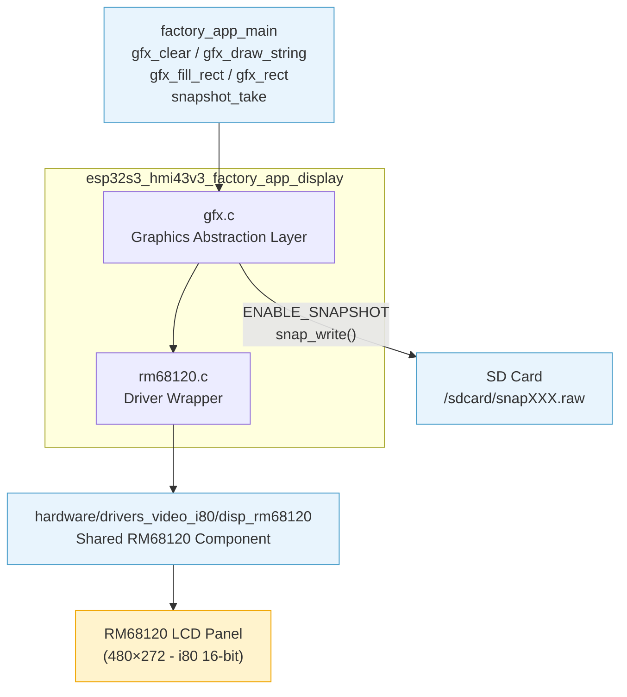
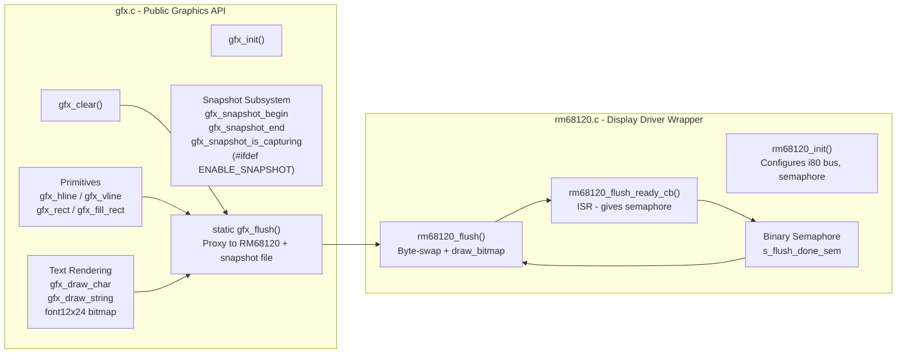
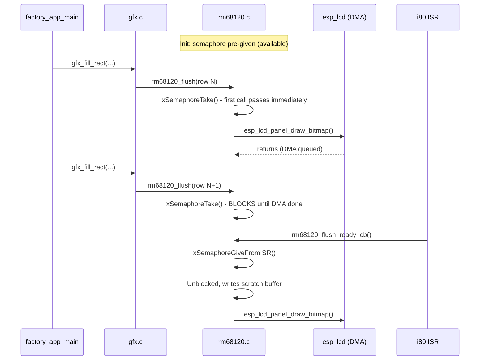
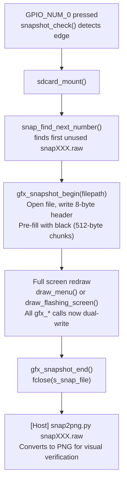
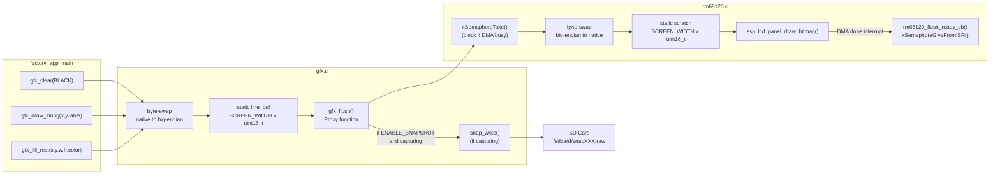
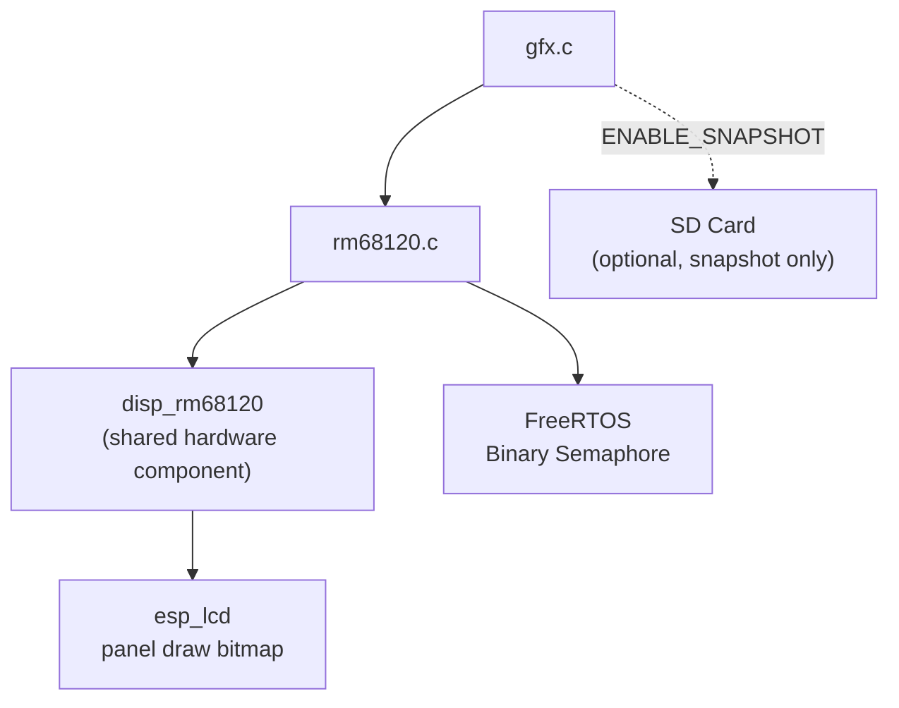
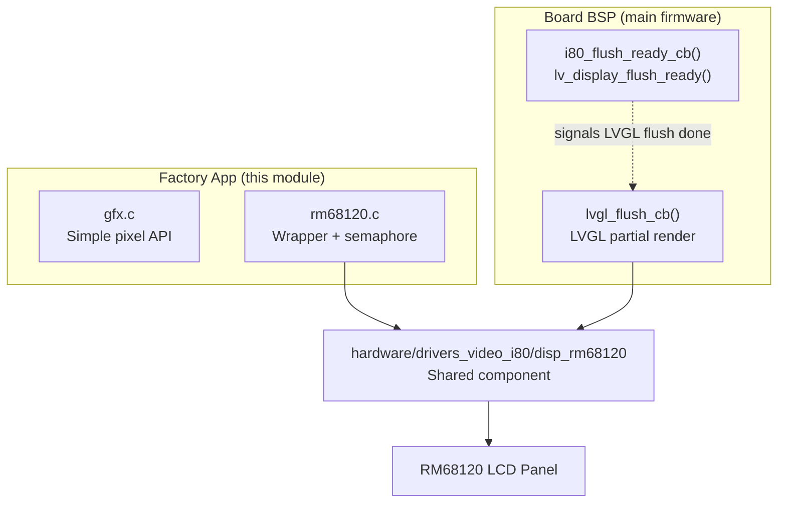

# esp32s3_hmi43v3_factory_app_display

Display subsystem of the factory test application for the **ESP32-S3 HMI43V3** board. It provides a lightweight, framebuffer-free graphics API (`gfx.c`) and a board-specific thin wrapper over the shared RM68120 i80-parallel LCD driver (`rm68120.c`).

This module is one of five subsystems that compose [esp32s3_hmi43v3_factory_app](esp32s3_hmi43v3_factory_app.md):

| Sibling module | Role |
|---|---|
| [esp32s3_hmi43v3_factory_app_main](esp32s3_hmi43v3_factory_app_main.md) | Menu logic, OTA actions, callers of every `gfx_*` function |
| [esp32s3_hmi43v3_factory_app_input](esp32s3_hmi43v3_factory_app_input.md) | Buttons, encoder, touch, buzzer |
| [esp32s3_hmi43v3_factory_app_storage](esp32s3_hmi43v3_factory_app_storage.md) | SD card mount/unmount (snapshot files land here) |
| [esp32s3_hmi43v3_factory_app_tools](esp32s3_hmi43v3_factory_app_tools.md) | Host-side tools including `snap2png.py` for snapshot conversion |

---

## Architecture

### Module Position in the Factory App



### Internal Component Architecture



---

## Hardware Interface — i80 (Intel 8080) Parallel Bus

The HMI43V3 board drives its LCD through an **Intel 8080 (i80) 16-bit parallel bus**, which is architecturally distinct from the SPI displays used on other boards (e.g. ILI9341 on the pibot pendant) and from the RGB-parallel panels used on the 8048s/8048_touch family.

| Property | Value |
|---|---|
| Controller | Raydium RM68120 |
| Bus type | Intel 8080 (i80) — 16-bit wide |
| Transfer mode | Asynchronous / DMA-queued |
| Pixel format | RGB565 (16 bpp) |
| Orientation | Landscape (`DISP_RM68120_ORIENTATION_LANDSCAPE`) |
| Resolution | `SCREEN_WIDTH` × `SCREEN_HEIGHT` (from `hw_config.h`) |
| Clock | `TFT_PCLK_FREQ_HZ` (from `hw_config.h`) |
| CS pin | `TFT_CS_PIN` |
| DC pin | `TFT_DC_PIN` |
| WR pin | `TFT_WR_PIN` |
| RST pin | `TFT_RST_PIN` |
| Data pins | `TFT_DATA_PIN_0` … `TFT_DATA_PIN_15` (16 lines) |

### Why Asynchronous Transfers Require a Semaphore

Unlike SPI (which blocks until the transfer completes), i80 DMA transfers are **fire-and-forget** — the CPU returns immediately and a completion interrupt fires later. If a second flush is issued before the first completes, the DMA may still be reading the scratch buffer when it gets overwritten.

The driver solves this with a **binary semaphore** (`s_flush_done_sem`):



### Byte-Order Convention

All boards share the same `gfx.c` structure, and by convention `gfx.c` always writes **big-endian RGB565** (network/SPI order). The RM68120 i80 bus expects **native (little-endian) RGB565**. `rm68120_flush()` performs the per-pixel byte swap into a local scratch buffer before calling `esp_lcd_panel_draw_bitmap()`:

```c
// Inside rm68120_flush():
uint16_t v = data[i];
scratch[i] = (uint16_t)((v >> 8) | (v << 8));  // big-endian → native
```

This keeps `gfx.c` portable across board families while isolating the hardware-specific correction to the driver wrapper.

---

## Component Reference

### `gfx.c` — Graphics Abstraction Layer

`gfx.c` owns the static line buffer (`line_buf[SCREEN_WIDTH]`) and provides the entire public drawing surface. It has no heap allocations; all rendering is line-by-line.

#### Public API

| Function | Signature | Description |
|---|---|---|
| `gfx_init` | `void gfx_init(void)` | No-op placeholder. Snapshot is on-demand; display init is done by `rm68120_init()`. |
| `gfx_clear` | `void gfx_clear(uint16_t color)` | Fills the entire screen with `color`. Sends one row at a time via `line_buf`. |
| `gfx_draw_char` | `void gfx_draw_char(int x, int y, char c, uint16_t fg, uint16_t bg)` | Renders a single character using the embedded 12×24-pixel `font12x24` bitmap. Characters outside `0x20–0x7E` are replaced with `'?'`. |
| `gfx_draw_string` | `void gfx_draw_string(int x, int y, const char *str, uint16_t fg, uint16_t bg)` | Renders a null-terminated string left-to-right. Stops at the screen right edge. |
| `gfx_hline` | `void gfx_hline(int x, int y, int w, uint16_t color)` | Horizontal line. Clips to screen bounds. |
| `gfx_vline` | `void gfx_vline(int x, int y, int h, uint16_t color)` | Vertical line. Clips to screen bounds. Sends one pixel per flush call. |
| `gfx_rect` | `void gfx_rect(int x, int y, int w, int h, uint16_t color)` | Hollow rectangle (four lines). |
| `gfx_fill_rect` | `void gfx_fill_rect(int x, int y, int w, int h, uint16_t color)` | Solid filled rectangle. Clips to screen bounds. Sends one row at a time via `line_buf`. |
| `gfx_snapshot_begin` | `bool gfx_snapshot_begin(const char *filepath)` | Opens a raw file and writes the 8-byte header. Returns `false` if a capture is already active or the file cannot be created. Only compiled when `ENABLE_SNAPSHOT` is defined. |
| `gfx_snapshot_end` | `bool gfx_snapshot_end(void)` | Closes the snapshot file. Returns `false` if no capture was active. |
| `gfx_snapshot_is_capturing` | `bool gfx_snapshot_is_capturing(void)` | Returns `true` while a snapshot file is open. |

#### Internal Functions

| Function | Description |
|---|---|
| `static gfx_flush()` | Thin proxy: calls `rm68120_flush()`, then conditionally calls `snap_write()` when `ENABLE_SNAPSHOT` is defined and a capture is active. |
| `static snap_write()` | Seeks to the correct offset in the snapshot file for the bounding rectangle and writes pixels. Performs the reverse byte swap (big-endian → native) for the file. |

#### Color Encoding Flow

All public API functions accept colors as **native RGB565** (host endian). `gfx.c` applies the big-endian swap before writing to `line_buf` or the character bitmap buffer, immediately before calling `gfx_flush()`.

```
Native RGB565 (caller)
    → (color >> 8) | (color << 8)   in gfx.c
    → big-endian in line_buf / char_buf
    → passed to rm68120_flush()
    → (v >> 8) | (v << 8)           in rm68120.c
    → native RGB565 sent to panel DMA
```

---

### `rm68120.c` — Display Driver Wrapper

A thin wrapper over the shared `hardware/drivers_video_i80/disp_rm68120` component (see [display_i80_drivers](display_i80_drivers.md)). It does not re-implement the panel protocol; it only provides the initialization glue, the semaphore, and the scratch-buffer byte swap.

#### Functions

| Function | Signature | Description |
|---|---|---|
| `rm68120_init` | `esp_err_t rm68120_init(void)` | Creates the flush semaphore (pre-given), configures the i80 bus with `disp_rm68120_configure()`, and stores the panel handle. |
| `rm68120_flush` | `void rm68120_flush(uint16_t x0, uint16_t y0, uint16_t x1, uint16_t y1, const uint16_t *data, size_t len)` | Takes the semaphore (blocks if previous DMA in flight), swaps bytes into a static `scratch[SCREEN_WIDTH]` buffer, calls `esp_lcd_panel_draw_bitmap()`. `len` is a **pixel count**, not byte count. |
| `static rm68120_flush_ready_cb` | `void IRAM_ATTR rm68120_flush_ready_cb(void)` | ISR-context callback invoked by the i80 bus driver when a transfer completes. Gives the semaphore and yields if a higher-priority task was unblocked. |

#### Initialization Configuration

```c
disp_rm68120_config_t {
    .bus_config.bus_width          = 16,             // 16-bit data bus
    .bus_config.max_transfer_bytes = SCREEN_WIDTH*2, // one row at a time
    .io_config.pclk_hz             = TFT_PCLK_FREQ_HZ,
    .io_config.trans_queue_depth   = 10,
    .panel_config.bits_per_pixel   = 16,
    .orientation = DISP_RM68120_ORIENTATION_LANDSCAPE,
}
```

The callback `rm68120_flush_ready_cb` is passed as `user_ctx` to `disp_rm68120_configure()`, which registers it on the i80 panel IO `on_color_trans_done` event via the shared driver's `disp_rm68120_notify_flush_ready()`.

---

## Snapshot System

The snapshot feature captures a full-screen raw image to SD card during a factory test. It is **opt-in at compile time** via `ENABLE_SNAPSHOT`.

### Capture Flow



### Raw File Format

```
Offset  Size    Content
------  ------  ------------------------------------------
0       4       uint32_t width  (little-endian)
4       4       uint32_t height (little-endian)
8       W×H×2   Raw RGB565 pixels, native endian, row-major
```

Total file size: `8 + SCREEN_WIDTH × SCREEN_HEIGHT × 2` bytes.

### snap_write() Pixel Mapping

For each flush call intercepted during capture, `snap_write()` computes the target offset in the file for each row of the bounding rectangle:

```
offset = SNAP_HEADER_SIZE + (row * SCREEN_WIDTH + x0) * 2
```

Since `gfx.c` stores pixels big-endian in the draw buffers, `snap_write()` performs the swap back to native before `fwrite()`:

```c
uint16_t native = (sw >> 8) | (sw << 8);
fwrite(&native, sizeof(uint16_t), 1, s_snap_file);
```

### BSP vs Factory App Snapshot Comparison

The main firmware BSP (`board_init.c`) implements its own snapshot mechanism inside `lvgl_flush_cb()`. The two systems are independent:

| Property | Factory App Snapshot | BSP / LVGL Snapshot |
|---|---|---|
| Location | `gfx.c` — `ENABLE_SNAPSHOT` | `board_init.c` — `ESP3D_SNAPSHOT_FEATURE` |
| Hook point | Static `gfx_flush()` proxy | `lvgl_flush_cb()` before `draw_bitmap` |
| Trigger | `GPIO_NUM_0` press | UI layer / `esp3d_snapshot_*` API |
| Sync | None needed (single-task) | Mutex (`g_snapshot.mutex`) |
| File format | `width(4) + height(4) + raw RGB565` | Raw pixel stream (no header) |

---

## Data Flow Diagram



---

## Dependencies

### Compile-time Dependencies

| Dependency | Path | Purpose |
|---|---|---|
| `gfx.h` | `Factory/main/gfx.h` | Public GFX API header |
| `rm68120.h` | `Factory/main/rm68120.h` | RM68120 wrapper API header |
| `font12x24.h` | `Factory/main/font12x24.h` | Embedded 12×24-pixel bitmap font |
| `hw_config.h` | `Factory/main/hw_config.h` | Pin definitions, `SCREEN_WIDTH`, `SCREEN_HEIGHT`, `TFT_PCLK_FREQ_HZ` |
| `disp_rm68120.h` | `hardware/drivers_video_i80/disp_rm68120/` | Shared i80 driver component (see [display_i80_drivers](display_i80_drivers.md)) |
| `factory_log.h` | `Factory/main/factory_log.h` | `FACTORY_LOGD` macro (silences SD stack noise) |
| FreeRTOS | ESP-IDF | `SemaphoreHandle_t`, `xSemaphoreTake`, `xSemaphoreGiveFromISR` |
| `esp_lcd` | ESP-IDF | `esp_lcd_panel_handle_t`, `esp_lcd_panel_draw_bitmap` |

### Runtime Dependency Graph



---

## Relationship to the BSP

The BSP ([esp32s3_hmi43v3_bsp](esp32s3_hmi43v3_bsp.md)) and the factory app display share the same underlying `disp_rm68120` hardware component. They are **never active at the same time** — the factory app runs independently of the main firmware. Their `i80_flush_ready_cb` / `rm68120_flush_ready_cb` patterns follow the same semaphore discipline for the same underlying reason (async DMA ordering).



---

## Comparison with Other Board Display Modules

The factory app display subsystem exists in a parallel structure on every supported board. This board is one of two in the family that use an i80 parallel bus:

| Board | Module | Controller | Bus type | Driver file |
|---|---|---|---|---|
| **esp32s3_hmi43v3** | **esp32s3_hmi43v3_factory_app_display** | **RM68120** | **i80 16-bit** | **`rm68120.c`** |
| esp32s3_zx3d50ce02s_usrc_4832 | esp32s3_zx3d50ce02s_usrc_4832_factory_app (display) | ST7796 | i80 | `st7796_i80.c` |
| pibot_pendant_v1_0 | [pibot_pendant_v1_0_factory_app_display](pibot_pendant_v1_0_factory_app_display.md) | ILI9341 | SPI | `ili9341.c` |
| esp32s3_bzm_tft35_gt911 | [esp32s3_bzm_tft35_gt911_factory_app_display](esp32s3_bzm_tft35_gt911_factory_app_display.md) | ST7796 | SPI | `st7796.c` |
| esp32s3_8048s043c / 8048s050c | esp32s3_8048s043c_factory_app (display) | ST7262 | RGB parallel | `st7262.c` |
| esp32s3_8048s070c | [esp32s3_8048s070c_factory_app_display](esp32s3_8048s070c_factory_app_display.md) | ST7262 | RGB parallel | — |

All boards share the same `gfx.c` API surface and the same `snap_write()` / snapshot file format. Only the display driver file and the bus interface differ.

---

## Key Design Decisions

1. **No framebuffer**: Rendering is immediate and line-by-line via `line_buf[SCREEN_WIDTH]`. This minimises RAM use on an ESP32-S3 where DRAM is constrained, at the cost of no retained scene state.

2. **Big-endian convention in gfx.c**: By always writing big-endian in `gfx.c`, the file is portable across SPI and i80 boards. Each driver wrapper is responsible for the byte swap appropriate to its bus.

3. **Semaphore pre-given at init**: The first `rm68120_flush()` call is guaranteed to proceed without blocking. Subsequent calls wait for the in-flight DMA rather than adding a second frame of latency.

4. **`IRAM_ATTR` on the ISR callback**: `rm68120_flush_ready_cb()` runs from the i80 bus ISR and must reside in IRAM to avoid cache-miss stalls during flash reads.

5. **`snap_write()` seeks rather than appending**: The snapshot file is pre-filled with black at `gfx_snapshot_begin()` so partial captures (e.g. if the app crashes mid-draw) produce a valid file with black regions rather than a truncated one.

---

## Related Documentation

- [esp32s3_hmi43v3_factory_app](esp32s3_hmi43v3_factory_app.md) — Parent factory application
- [esp32s3_hmi43v3_factory_app_main](esp32s3_hmi43v3_factory_app_main.md) — Menu logic and all callers of `gfx_*`
- [esp32s3_hmi43v3_bsp](esp32s3_hmi43v3_bsp.md) — Board Support Package (LVGL + same RM68120 driver)
- [display_i80_drivers](display_i80_drivers.md) — Shared RM68120 and ST7796-i80 hardware components
- [esp32s3_hmi43v3_factory_app_storage](esp32s3_hmi43v3_factory_app_storage.md) — SD card (snapshot file destination)
- [esp32s3_hmi43v3_factory_app_tools](esp32s3_hmi43v3_factory_app_tools.md) — `snap2png.py` host tool for snapshot conversion
- `docs/architecture/display_drivers.md` — Display driver architecture overview (SPI vs RGB-parallel vs i80)
- `docs/Factory/` — Factory app overview and flashing procedures
