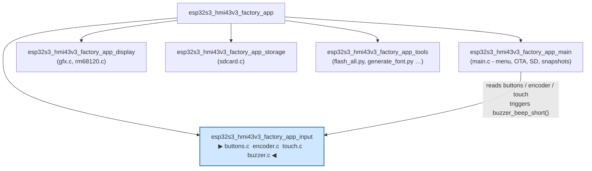
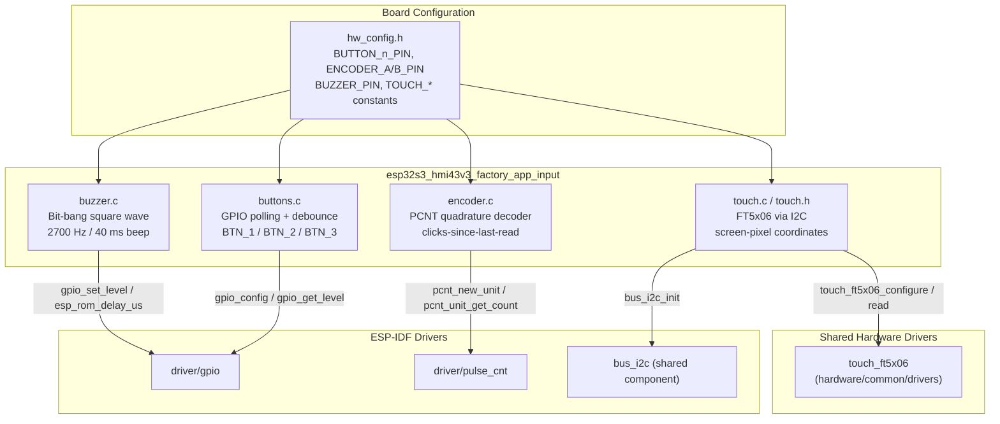
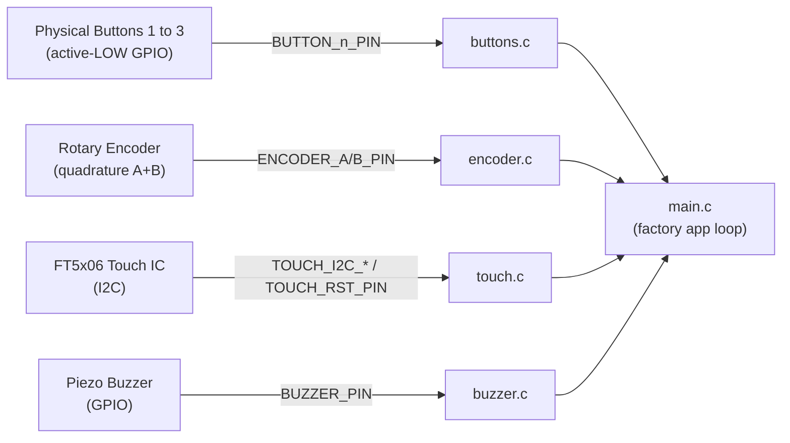
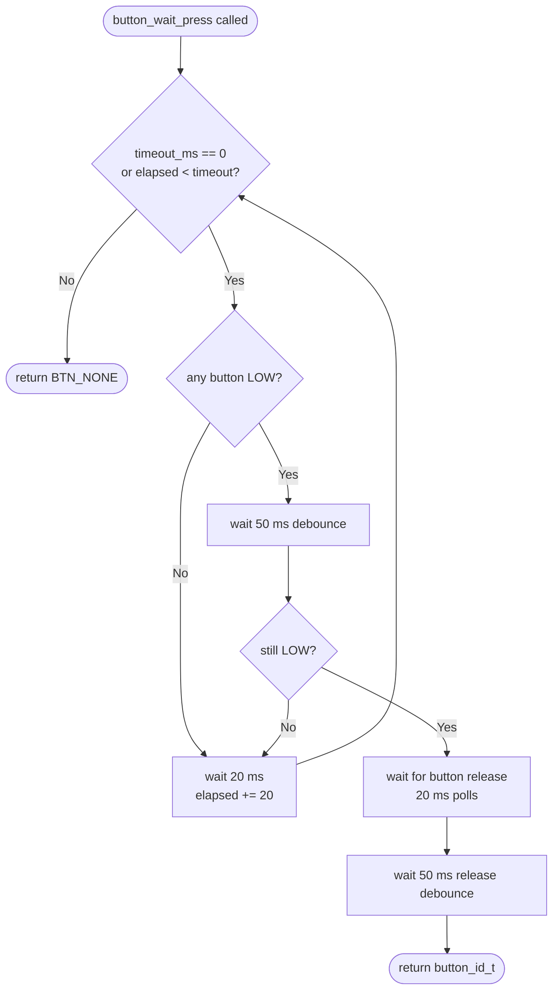
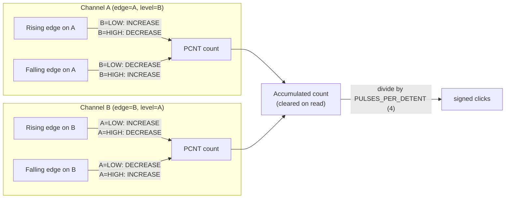
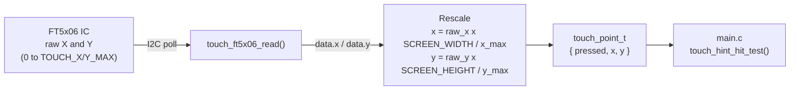
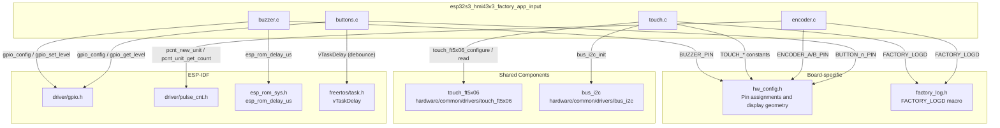
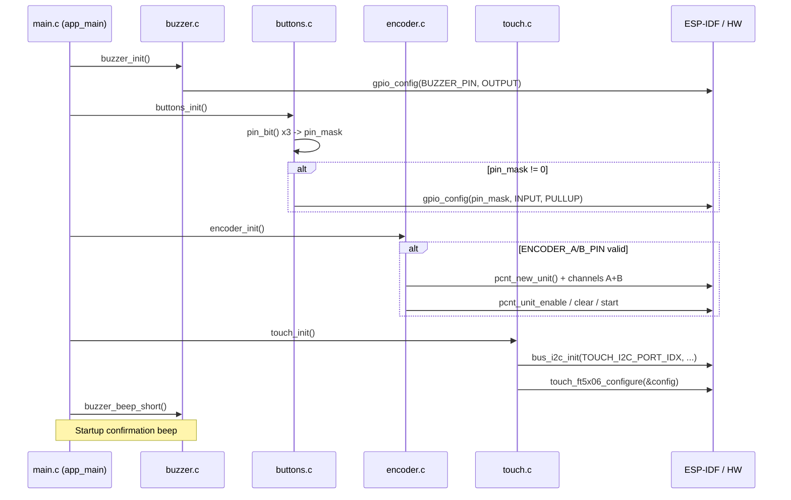
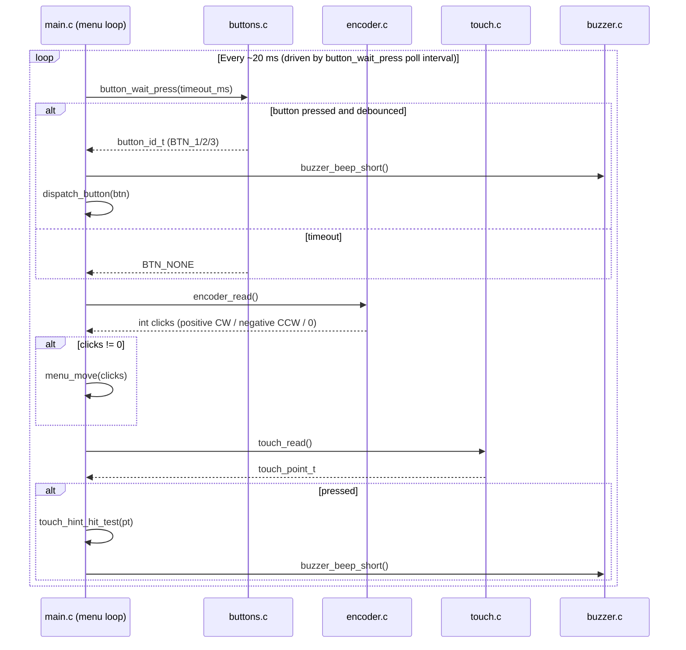
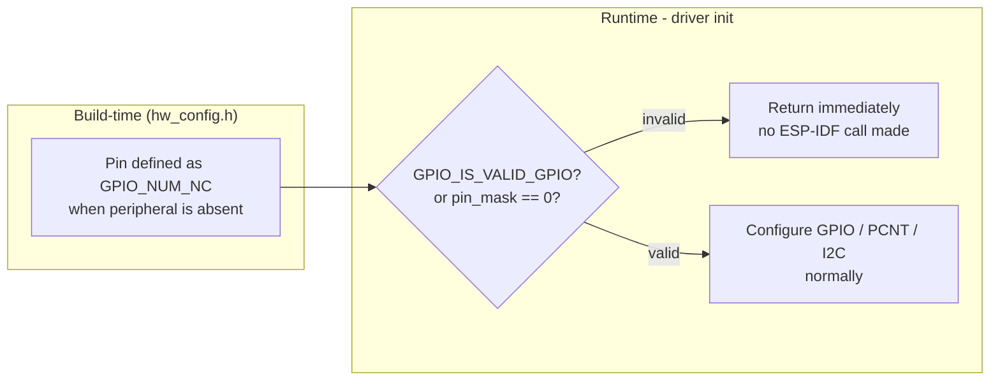

# esp32s3_hmi43v3_factory_app_input

## Introduction

The `esp32s3_hmi43v3_factory_app_input` module provides the complete human-input layer for the **ESP32-S3 HMI 4.3" V3** factory application. It aggregates four independent hardware input drivers — physical buttons, a quadrature rotary encoder, a capacitive touchscreen, and a feedback buzzer — into a cohesive polling-based subsystem consumed by the factory app's main loop.

This module is a sub-module of [`esp32s3_hmi43v3_factory_app`](esp32s3_hmi43v3_factory_app.md), which is the standalone diagnostic and provisioning firmware flashed alongside the main pendant firmware. It is architecturally identical to the `_factory_app_input` modules found in sibling boards (e.g., [`esp32s3_8048s070c_factory_app_input`](esp32s3_8048s070c_factory_app_input.md), [`pibot_pendant_v1_0_factory_app_input`](pibot_pendant_v1_0_factory_app_input.md)) — each board carries its own copy, wired to board-specific `hw_config.h` constants.

---

## Module Position in the Factory App



The input module has **no internal dependencies on other factory-app sub-modules**. It is consumed unidirectionally by `main.c` in the [`esp32s3_hmi43v3_factory_app_main`](esp32s3_hmi43v3_factory_app_main.md) sub-module.

---

## Source Files

| File | Role |
|---|---|
| `boards/esp32s3_hmi43v3/Factory/main/buttons.c` | Physical button driver (up to 3 buttons, GPIO, debounce) |
| `boards/esp32s3_hmi43v3/Factory/main/encoder.c` | Quadrature rotary encoder driver (ESP-IDF PCNT) |
| `boards/esp32s3_hmi43v3/Factory/main/touch.c` | Capacitive touch driver (FT5x06, I2C, coordinate scaling) |
| `boards/esp32s3_hmi43v3/Factory/main/touch.h` | Public API and `touch_point_t` type |
| `boards/esp32s3_hmi43v3/Factory/main/buzzer.c` | Bit-banged square-wave buzzer (tactile feedback only) |

---

## Architecture

### Component Architecture



### Hardware-to-Driver Mapping



---

## Component Details

### buttons.c — Physical Button Driver

Provides debounced polling for up to three physical push-buttons (BTN_1, BTN_2, BTN_3). All buttons are configured as **active-LOW** GPIO inputs with internal pull-ups.

#### Key design decisions

| Decision | Detail |
|---|---|
| **Polled, not interrupt-driven** | Simplifies factory app: no queues, no ISRs |
| **`GPIO_NUM_NC` guard via `pin_bit()`** | Boards without a given button define its pin as `GPIO_NUM_NC`; the computed bitmask drops to zero and `gpio_config()` is skipped entirely |
| **50 ms debounce** | Press confirmed after 50 ms re-check; release also waits 50 ms before returning |
| **`button_wait_press()` blocks** | Intentional — factory menu is sequential, not concurrent |

#### Functions

| Function | Signature | Description |
|---|---|---|
| `buttons_init` | `void buttons_init(void)` | Configures GPIO for all valid button pins as pull-up inputs. No-op if all pins are `GPIO_NUM_NC`. |
| `button_is_pressed` | `bool button_is_pressed(button_id_t btn)` | Returns `true` if the button's GPIO reads LOW. Guards against invalid `btn` IDs and `GPIO_NUM_NC` pins. |
| `button_wait_press` | `button_id_t button_wait_press(uint32_t timeout_ms)` | Blocks until a button is pressed and released, or the timeout expires. Pass `0` for infinite wait. Returns `BTN_NONE` on timeout. |
| `pin_bit` *(static)* | `uint64_t pin_bit(gpio_num_t pin)` | Returns `(1ULL << pin)` for valid GPIO numbers, `0ULL` for `GPIO_NUM_NC`, avoiding compile-time negative-shift warnings. |

#### Button wait-press flow



---

### encoder.c — Rotary Encoder Driver

Implements a **hardware quadrature decoder** using the ESP32-S3's PCNT (Pulse Counter) peripheral. The counter accumulates raw edge counts; `encoder_read()` converts them to **signed detent clicks** and clears the counter.

#### Key design decisions

| Decision | Detail |
|---|---|
| **PCNT, not GPIO-IRQ** | Counts quadrature edges in hardware; zero CPU load during rotation |
| **4 pulses per detent** | Typical for 100-detent encoders; adjust `PULSES_PER_DETENT` if steps feel wrong |
| **±1000 count limits** | Prevents counter wrap-around between polling intervals |
| **1000 ns glitch filter** | Matches the main firmware's BSP setting; suppresses contact bounce |
| **Internal pull-ups** | No external pull-up resistors on this board |
| **Polled, no callbacks** | `encoder_read()` called from the main loop; sub-detent remainder pulses are discarded |
| **`GPIO_NUM_NC` guard** | If either encoder pin is invalid, `s_initialized` stays `false` and `encoder_read()` always returns 0 |

#### Functions

| Function | Signature | Description |
|---|---|---|
| `encoder_init` | `esp_err_t encoder_init(void)` | Creates PCNT unit with two quadrature channels (A-edge-on-B, B-edge-on-A). Returns `ESP_OK` without configuring PCNT if encoder pins are `GPIO_NUM_NC`. |
| `encoder_read` | `int encoder_read(void)` | Returns signed click count since last call (positive = clockwise, negative = counter-clockwise). Clears counter on each non-zero read. Returns 0 if not initialized. |

#### PCNT quadrature decode matrix



---

### touch.c / touch.h — Capacitive Touch Driver

A thin wrapper over the shared [`touch_ft5x06`](touch_drivers.md) hardware driver component. It handles I2C bus initialisation (idempotent — safe even if `main.c` already started the bus for the TCA9554 I/O expander), configures the FT5x06 touch controller with board-specific geometry, and rescales raw touch coordinates to screen-pixel space.

#### Key design decisions

| Decision | Detail |
|---|---|
| **Fixed `x_max` / `y_max`** | The FT5x06 auto-detect returns bogus values on this board; `TOUCH_X_MAX` / `TOUCH_Y_MAX` from `hw_config.h` are used instead |
| **Coordinate rescaling** | `raw_x * SCREEN_WIDTH / x_max` — same formula used by all other boards' touch wrappers |
| **Idempotent `bus_i2c_init`** | Returns `ESP_OK` if the I2C port is already installed; no double-init crash |
| **Polling-only** | No interrupt pin processing; `touch_read()` is called from the main loop |
| **`[[maybe_unused]]` TAG** | Log tag suppressed in release builds where `FACTORY_LOGD` compiles to nothing |

#### Data types

```c
typedef struct {
    bool    pressed;   // true if the screen is currently being touched
    int16_t x;         // screen X coordinate in pixels, -1 if not pressed
    int16_t y;         // screen Y coordinate in pixels, -1 if not pressed
} touch_point_t;
```

#### Functions

| Function | Signature | Description |
|---|---|---|
| `touch_init` | `void touch_init(void)` | Initialises I2C bus (idempotent) and configures FT5x06 with board-specific geometry. Sets internal `s_initialized` flag on success. |
| `touch_read` | `touch_point_t touch_read(void)` | Polls FT5x06 and returns coordinates scaled to screen pixels. Returns `{false, -1, -1}` when not pressed or not initialised. |

#### Touch coordinate pipeline



---

### buzzer.c — Feedback Buzzer Driver

A minimal **bit-bang square-wave** generator that produces a short tactile feedback beep. No PWM hardware or LEDC timer is used — the GPIO is toggled in a tight loop using `esp_rom_delay_us()`.

#### Key design decisions

| Decision | Detail |
|---|---|
| **Bit-bang, not LEDC** | Factory app is not performance-sensitive; avoids LEDC timer conflicts with the main firmware |
| **2700 Hz / 40 ms** | Audible, short, and distinct — same frequency/duration as the bootloader's `beep_short()` in `hooks.c` |
| **`GPIO_NUM_NC` guard** | Boards without a buzzer define `BUZZER_PIN` as `GPIO_NUM_NC`; both init and beep functions return immediately |
| **`pin_bit()` helper** | Same pattern as `buttons.c` — avoids compile-time negative-shift warnings on invalid pin values |

#### Functions

| Function | Signature | Description |
|---|---|---|
| `buzzer_init` | `void buzzer_init(void)` | Configures `BUZZER_PIN` as a GPIO output, initialised LOW. No-op if pin is `GPIO_NUM_NC`. |
| `buzzer_beep_short` | `void buzzer_beep_short(void)` | Emits a 2700 Hz square wave for 40 ms (108 cycles). Blocks caller for approximately 40 ms. No-op if pin is `GPIO_NUM_NC`. |
| `pin_bit` *(static)* | `uint64_t pin_bit(gpio_num_t pin)` | Safe GPIO bitmask helper — identical to the one in `buttons.c`. |

#### Beep timing breakdown

```
BEEP_FREQ_HZ    = 2700
BEEP_DURATION   = 40 ms
cycles          = 2700 x 40 / 1000  = 108 square-wave cycles
half_period_us  = 1 000 000 / (2 x 2700)  = 185 us (approx)

Per cycle:   GPIO HIGH  ->  delay 185 us  ->  GPIO LOW  ->  delay 185 us
Total time:  108 x 370 us  =  40 ms  (blocks the calling task)
```

---

## Dependency Graph



---

## Initialisation Sequence

All four drivers are initialised once from `app_main()` in [`esp32s3_hmi43v3_factory_app_main`](esp32s3_hmi43v3_factory_app_main.md) before the menu loop starts:



---

## Runtime Polling Loop

Inside the factory app menu loop, `main.c` polls all input drivers and dispatches actions:



---

## `GPIO_NUM_NC` Guard Pattern

All four drivers share a **defensive initialisation pattern** that makes the module safe on boards that lack certain peripherals. This is a cross-board convention across the entire factory app codebase:



This ensures the same factory binary can be compiled for any board variant by changing only `hw_config.h`, without scattering `#ifdef` guards through driver code.

---

## Configuration Constants (hw_config.h)

The following constants from `hw_config.h` govern all runtime behaviour of this module. They are **not defined in the input module itself**:

| Constant | Used by | Purpose |
|---|---|---|
| `BUTTON_1_PIN`, `BUTTON_2_PIN`, `BUTTON_3_PIN` | buttons.c | GPIO numbers for physical push-buttons |
| `ENCODER_A_PIN`, `ENCODER_B_PIN` | encoder.c | GPIO numbers for quadrature encoder channels |
| `BUZZER_PIN` | buzzer.c | GPIO number for buzzer output |
| `TOUCH_I2C_ADDR_LIST` | touch.c | FT5x06 I2C device address(es) |
| `TOUCH_I2C_PORT_IDX` | touch.c | ESP-IDF I2C port number |
| `TOUCH_I2C_SDA_PIN`, `TOUCH_I2C_SCL_PIN` | touch.c | I2C bus GPIO pins |
| `TOUCH_I2C_FREQ_HZ` | touch.c | I2C clock frequency |
| `TOUCH_RST_PIN`, `TOUCH_IRQ_PIN` | touch.c | FT5x06 reset and interrupt pins |
| `TOUCH_SWAP_XY_FLAG`, `TOUCH_MIRROR_X_FLAG`, `TOUCH_MIRROR_Y_FLAG` | touch.c | Orientation correction flags |
| `TOUCH_X_MAX`, `TOUCH_Y_MAX` | touch.c | Fixed touch resolution (overrides FT5x06 auto-detect) |
| `SCREEN_WIDTH`, `SCREEN_HEIGHT` | touch.c | Display resolution for coordinate rescaling |

---

## Relation to Other Board Input Modules

Every board in the BSP that carries a factory app has its own `_factory_app_input` module. They share the same API surface (`buttons_init`, `button_is_pressed`, `button_wait_press`, `encoder_init`, `encoder_read`, `touch_init`, `touch_read`, `buzzer_init`, `buzzer_beep_short`) and differ only in the touch IC selected and `hw_config.h` pin assignments.

| Board input module | Touch IC | Display interface | Notes |
|---|---|---|---|
| [`pibot_pendant_v1_0_factory_app_input`](pibot_pendant_v1_0_factory_app_input.md) | Resistive (custom) | SPI (ILI9341) | Different touch wrapper |
| [`esp32s3_8048s070c_factory_app_input`](esp32s3_8048s070c_factory_app_input.md) | GT911 (I2C) | RGB parallel | 7" panel |
| [`esp32s3_bzm_tft35_gt911_factory_app_input`](esp32s3_bzm_tft35_gt911_factory_app_input.md) | GT911 (I2C) | SPI (ST7796) | 3.5" panel |
| **esp32s3_hmi43v3_factory_app_input** *(this module)* | **FT5x06 (I2C)** | **I80 (RM68120)** | **Fixed x/y max; shared I2C bus** |

For shared hardware driver details see [`touch_drivers`](touch_drivers.md), [`physical_input`](physical_input.md), and [`buzzer`](buzzer.md) in the Hardware Peripheral Drivers documentation.
