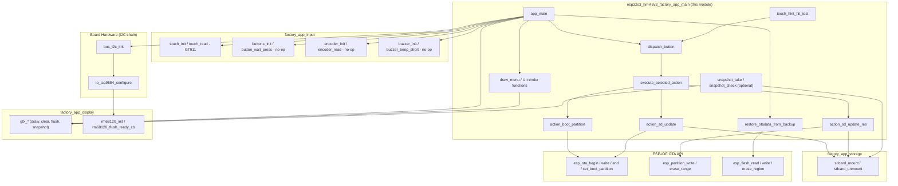
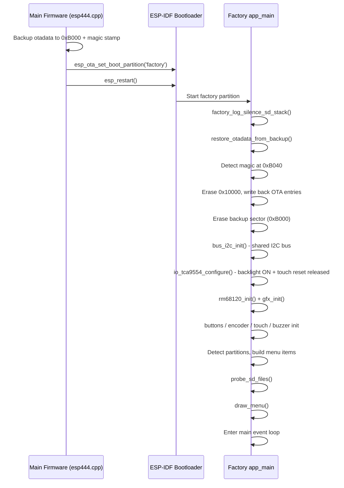
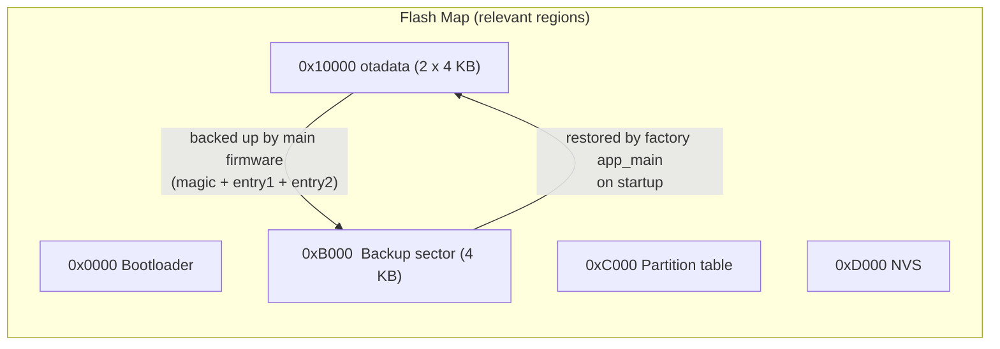
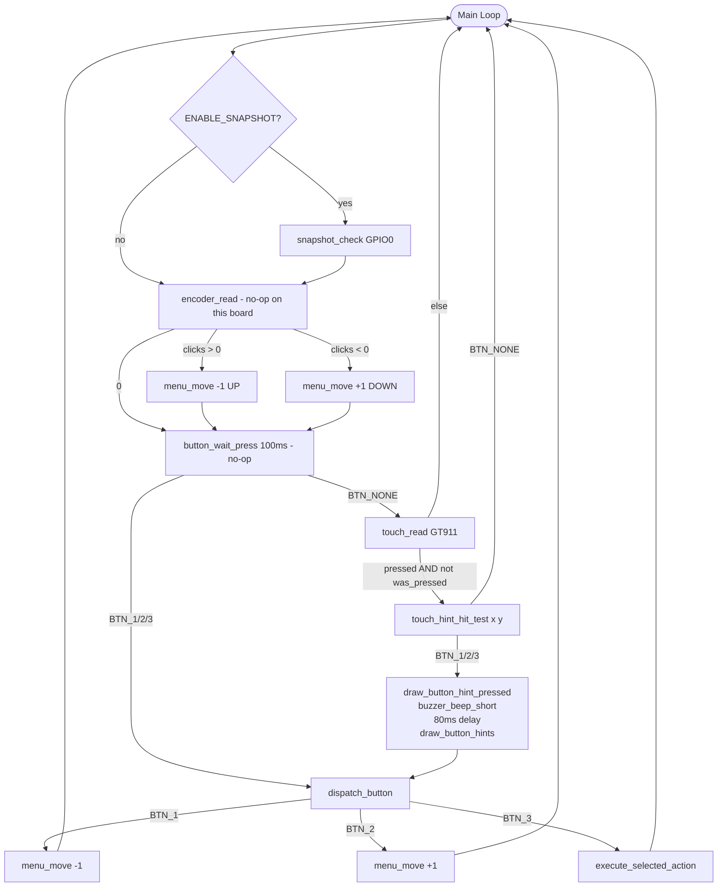
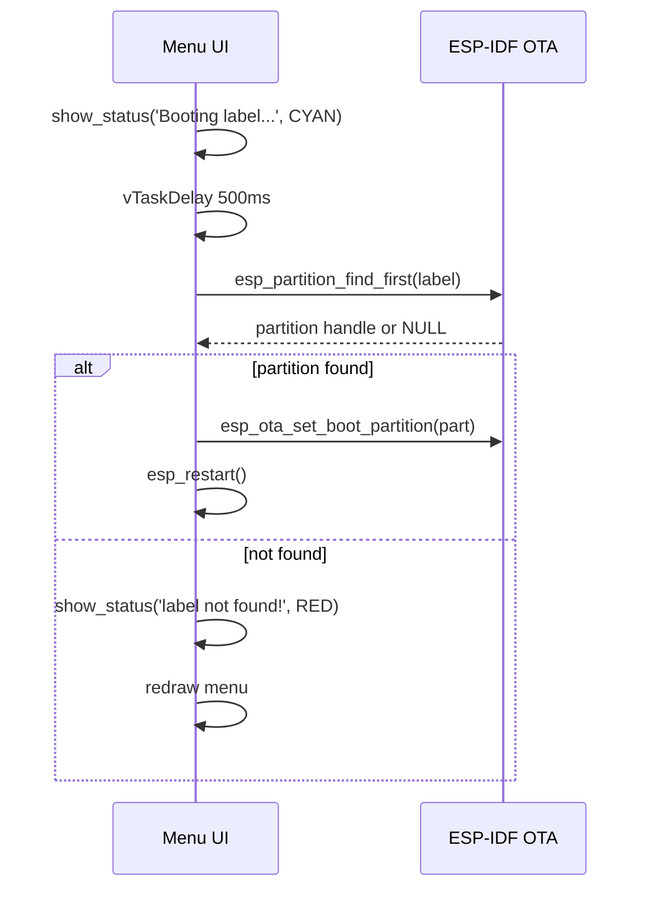
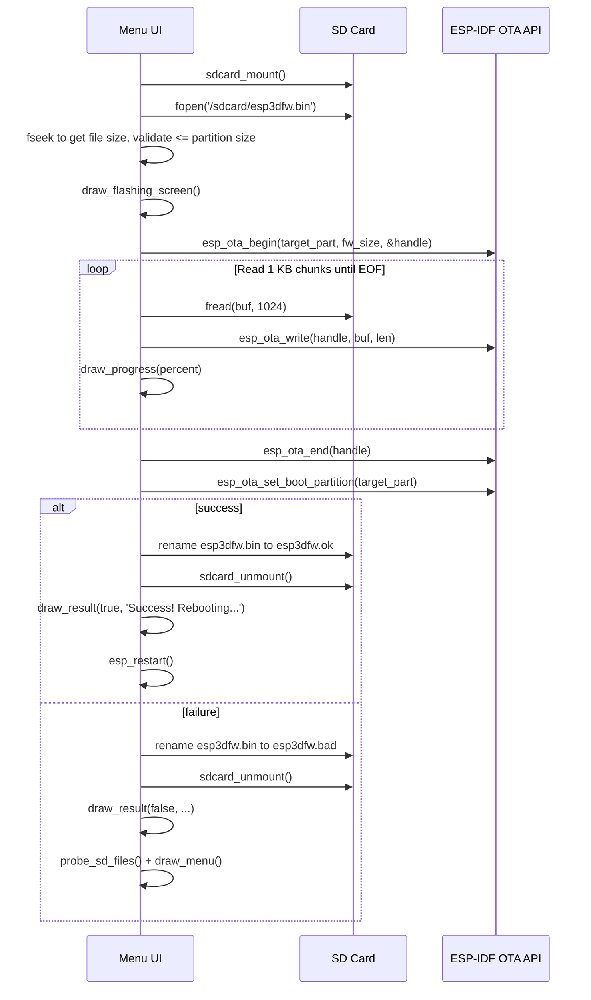
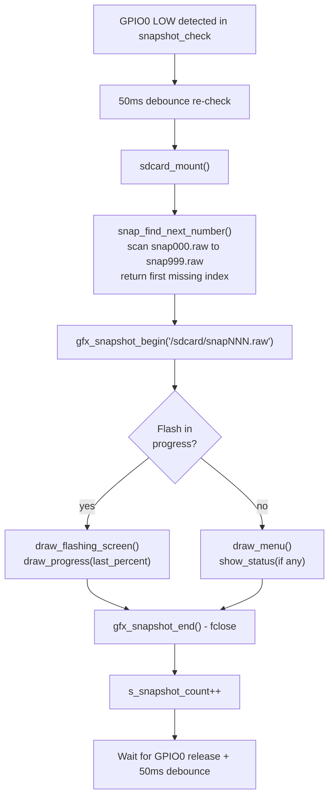

# esp32s3_hmi43v3_factory_app_main

## Overview

The `esp32s3_hmi43v3_factory_app_main` module is the **application logic core** of the factory/recovery firmware for the **ESP32S3-HMI43V3** board. It runs from the dedicated `factory` flash partition and provides a touch-navigable recovery menu that allows developers and field operators to:

- Boot a specific OTA application partition (`app0` or `app1`)
- Flash a new firmware image from an SD card (`esp3dfw.bin` → `app0` or `app1`)
- Flash a UI resources image from an SD card (`ui_resources.bin` → `ui_resources` partition)
- Restore the OTA metadata backup written by the main firmware before entering recovery

**Board-specific characteristics:**

- **No physical buttons, encoder, or buzzer** — all are `GPIO_NUM_NC` on this board. Navigation is exclusively through the **GT911 capacitive touchscreen** via three virtual button icons rendered at the bottom of the display.
- **RM68120 display** driven over the **Intel 8080 (i80) parallel bus**, unlike most other boards in the BSP family which use SPI.
- **TCA9554 IO expander** (I²C) controls the LCD backlight enable bit and the GT911 touch reset bit — it must be initialized **before** the display driver and the touch controller.
- **Software-only factory entry**: the partition is entered only via the `[ESP444]FACTORY` software command from the main firmware. There is no custom bootloader hook (`ENABLE_CUSTOM_BOOT_LOADER = OFF`) because there is no physical BOOT button to hold at reset.
- **Logical canvas**: the glass is physically 480 × 272 (landscape), but the pendant enclosure mounts it rotated 90°, so the `gfx` logical canvas is **272 × 480 portrait** — the same topology as `esp32_3248s035r` and `esp32s3_bzm_tft35_gt911`. Layout constants are scaled ×0.85 from the 320 × 480 portrait reference.

> See [`esp32s3_hmi43v3_bsp`](esp32s3_hmi43v3_bsp.md) for the board-level BSP used by the main firmware. See [`display_i80_drivers`](display_i80_drivers.md) for the RM68120 panel driver.

---

## Module Structure

This module is a child of [`esp32s3_hmi43v3_factory_app`](esp32s3_hmi43v3_factory_app.md) and contains two source files:

| File | Purpose |
|------|---------|
| `boards/esp32s3_hmi43v3/Factory/main/main.c` | Application entry point, menu logic, OTA operations, UI rendering |
| `boards/esp32s3_hmi43v3/Factory/main/factory_log.h` | Compile-time debug log gate and SD stack silencer |

### Sibling Modules (same parent)

| Module | Responsibility |
|--------|----------------|
| [`esp32s3_hmi43v3_factory_app_display`](esp32s3_hmi43v3_factory_app_display.md) | Framebuffer GFX API (`gfx.c`) + RM68120 flush-ready callback (`rm68120.c`) |
| [`esp32s3_hmi43v3_factory_app_input`](esp32s3_hmi43v3_factory_app_input.md) | Buttons (no-op), encoder (no-op), GT911 touch, buzzer (no-op) |
| [`esp32s3_hmi43v3_factory_app_storage`](esp32s3_hmi43v3_factory_app_storage.md) | SD card mount/unmount |
| [`esp32s3_hmi43v3_factory_app_tools`](esp32s3_hmi43v3_factory_app_tools.md) | Host-side flash scripts, font generator, snapshot converter |

---

## Architecture

### High-Level Component Relationships



---

## Boot and Entry Flow

The factory partition is activated by the main firmware's `ESP444` command (`esp444.cpp`). Before switching the boot partition, the main firmware:

1. Reads the current OTA data sectors from flash offset `0x10000`
2. Writes them to a backup sector at `0xB000`
3. Stamps the backup with magic `0xAA55AA55` at backup offset `0x40`
4. Sets the boot partition to `factory` and reboots

On the very next `app_main` call, `restore_otadata_from_backup()` detects and restores this backup **before any other initialization**, ensuring that a power-cut during recovery returns to the correct OTA partition on the next boot.



> **I2C init ordering is critical on this board**: the TCA9554 IO expander controls the LCD backlight enable bit and the GT911 touch reset bit. Initializing it before `rm68120_init()` ensures the backlight is on when the first frame is drawn, and the touch IC has been released from reset before `touch_init()`.

---

## OTA Backup / Restore Architecture



### Constraints

| Constraint | Value | Reason |
|------------|-------|--------|
| `OTADATA_BACKUP_OFFSET` | `0xB000` | After bootloader end, before partition table (`0xC000`), 4 KB-aligned |
| `OTADATA_OFFSET` | `0x10000` | Fixed ESP-IDF otadata location |
| `OTADATA_ENTRY_SIZE` | `32 bytes` | One ESP-IDF OTA state record |
| `BACKUP_MAGIC` | `0xAA55AA55` at `+0x40` | Presence check before restore |
| `CONFIG_SPI_FLASH_DANGEROUS_WRITE_ALLOWED` | Must be `y` | `esp_flash_erase_region` targets address below first partition |

> **Porting note**: When adapting this factory app to a board with a different flash layout, recalculate `OTADATA_BACKUP_OFFSET` and update **both** this file and the main firmware's `esp444.cpp` with the same value.

---

## Menu System

### Data Model

```c
typedef struct {
    const char *label;     /* Display label */
    menu_action_t action;  /* Action dispatched by execute_selected_action */
    uint16_t color;        /* Text color when item is not selected */
} menu_item_t;
```

Menu items are built dynamically at startup based on detected partitions:

| Label | Action | Shown when |
|-------|--------|-----------|
| `Boot app0` | `MENU_ACTION_BOOT_APP0` | Always |
| `Boot app1` | `MENU_ACTION_BOOT_APP1` | `app1` partition detected |
| `SD -> app0` | `MENU_ACTION_SD_UPDATE_APP0` | Always |
| `SD -> app1` | `MENU_ACTION_SD_UPDATE_APP1` | `app1` partition detected |
| `SD -> resources` | `MENU_ACTION_SD_UPDATE_RES` | Always |

### Screen Layout (272 x 480 portrait logical canvas)

Layout constants are scaled x0.85 from the 320 x 480 portrait reference (`esp32_3248s035r` / `esp32s3_bzm_tft35_gt911`). Border and outline thickness literals (1-2 px insets) are left unscaled.

```
+------------------------------+  <- Y=0
|   Recovery vX.Y.Z  (title)  |  Y=13   CYAN
| ---------------------------  |  Y=40   separator
|   Active: <partition>        |  Y=45   YELLOW
|   SD: FW  RES                |  Y=68   SD indicators
| ---------------------------  |  Y=88   separator
|                              |
|  [ Boot app0              ]  |  Y=94   (MENU_START_Y)
|  [ Boot app1              ]  |  Y=128  each item H=34
|  [ SD -> app0             ]  |  Y=162
|  [ SD -> app1             ]  |  Y=196
|  [ SD -> resources        ]  |  Y=230
|                              |
| ---------------------------  |  STATUS_Y-7  separator
|   <status / "Power off">    |  STATUS_Y  footer zone
| ---------------------------  |  BTN_HINT_BASE_Y  separator
|   (UP)    (DOWN)    (OK)    |  BTN_HINT_CY  virtual buttons
+------------------------------+  <- Y=479
```

### Virtual Button Touch Zones

Physical buttons are unpopulated (`GPIO_NUM_NC`). Three virtual buttons are drawn as double-circle icons (radius 30 px) with centered arrow/checkmark icons at the bottom of the screen.

Touch hit zones use **midpoints between the icon centers** as column boundaries — not screen-width thirds. This is necessary because on a 272 px wide canvas the three icons (at `W/2-100`, `W/2`, `W/2+100` = x=36, x=136, x=236) are clustered in the middle. Using screen-width thirds would mis-map BTN_1 and BTN_3 to the wrong columns:

```
Screen width: 272 px
|  x < 86   |  86 <= x < 186  |  x >= 186  |
|  BTN_1 UP |   BTN_2 DOWN    |  BTN_3 OK  |
|  CX1=36   |    CX2=136      |  CX3=236   |
|   BLUE    |     BLUE        |   GREEN    |
```

`touch_hint_hit_test(x, y)` returns `BTN_NONE` for any `y < BTN_HINT_BASE_Y`, so taps on menu items are never misinterpreted as button presses.

---

## Input Event Processing



> **Loop timing**: `button_wait_press(100)` blocks for up to 100 ms. On this board, physical buttons return `BTN_NONE` immediately, so the loop runs at approximately 100 ms cadence — responsive for touch polling. The touch handler uses leading-edge detection (`pressed && !touch_was_pressed`) to fire exactly once per tap.

---

## Action Flows

### Boot Partition Action



### SD Firmware Flash Action (`action_sd_update`)



### SD Resources Flash Action (`action_sd_update_res`)

Follows the same SD mount → open → validate → erase → write → rename pattern, but targets the `ui_resources` DATA partition using `esp_partition_erase_range()` + `esp_partition_write()` directly (no OTA handle needed).

One additional step: a **16-byte build header** is read from the start of `ui_resources.bin` and logged before flashing. The header format is `"ESP3"` (4 bytes) + 12-char variant string. This allows early detection of variant mismatches (wrong firmware type or display resolution). Old binaries without the header emit a warning and continue.

---

## Display Rendering Functions

All drawing calls route through the GFX API defined in [`esp32s3_hmi43v3_factory_app_display`](esp32s3_hmi43v3_factory_app_display.md).

### Layout Constants

| Constant | Value | Description |
|----------|-------|-------------|
| `SCREEN_WIDTH` | 272 | Logical portrait width (pixels) |
| `SCREEN_HEIGHT` | 480 | Logical portrait height (pixels) |
| `FONT_WIDTH` | 12 | Pixels per character column |
| `FONT_HEIGHT` | 24 | Pixels per character row |
| `MENU_START_Y` | 94 | Y coordinate of first menu item |
| `MENU_ITEM_H` | 34 | Height of each menu item row |
| `MENU_PAD_X` | 20 | Horizontal padding for menu items |
| `BTN_CIRCLE_R` | 30 | Virtual button circle radius |
| `BTN_HINT_H` | 69 | Total height of button hint bar |
| `BTN_HINT_BASE_Y` | `SCREEN_HEIGHT - BTN_HINT_H` | Top edge of button hint bar |
| `BTN_HINT_CX1/2/3` | `W/2-100`, `W/2`, `W/2+100` | Button icon center X positions |
| `STATUS_Y` | `SCREEN_HEIGHT - 28 - BTN_HINT_H` | Footer message Y coordinate |

### UI Function Reference

| Function | Description |
|----------|-------------|
| `draw_header()` | Clears screen, double border, version title (CYAN), horizontal separator |
| `draw_menu()` | Full menu repaint: header + active partition (YELLOW) + SD indicators + all items + footer + button hints |
| `draw_menu_item(index)` | Redraws one menu item with or without dark-blue selection highlight and bright-blue text |
| `draw_sd_indicators()` | Shows `FW` (green) and/or `RES` (cyan) badges if files detected on SD |
| `draw_footer_zone()` | Renders active status message, or `"Power off to cancel"` (dark gray) if none |
| `draw_flashing_screen()` | Full-screen flash-in-progress overlay: title (YELLOW) + `"Do NOT power off!"` (RED) |
| `draw_progress(percent)` | Outlined white progress bar filled green + percentage text below |
| `draw_result(success, msg)` | Green success string or red `"FAILED! Power cycle."` result line |
| `draw_button_hints()` | Horizontal separator + three double-circle icons with up/down/check icons |
| `draw_button_hint_pressed(btn)` | Redraws one button in violet for touch-press visual feedback |
| `draw_circle(cx, cy, r, color)` | Midpoint circle algorithm, outline only |
| `draw_up_arrow(cx, cy, color)` | Upward arrow centered at (cx, cy), scaled for r=30 |
| `draw_down_arrow(cx, cy, color)` | Downward arrow centered at (cx, cy), scaled for r=30 |
| `draw_check_mark(cx, cy, color)` | Checkmark, 4 px thick strokes, scaled for r=30 |

### Color Palette

| Constant | RGB | Used for |
|----------|-----|---------|
| `MENU_HIGHLIGHT` | Dark blue (0, 80, 160) | Selection highlight box background |
| `MENU_HIGHLIGHT_TXT` | Bright blue (80, 160, 255) | Selected item text |
| `BTN_NAV_COLOR` | Blue (100, 160, 255) | Up/Down button icons at rest |
| `BTN_OK_COLOR` | Green (100, 220, 100) | OK/Select button icon at rest |
| `BTN_PRESSED_COLOR` | Violet (180, 80, 220) | Any button during press feedback |

---

## Snapshot System (Optional)

When compiled with `ENABLE_SNAPSHOT`, pressing **GPIO0** (BOOT button on evaluation breakout boards) triggers a full screen capture saved to the SD card as a raw pixel file. Used during development and QA to capture factory UI states without a USB connection.



Raw files can be converted to PNG using `snap2png.py` in [`esp32s3_hmi43v3_factory_app_tools`](esp32s3_hmi43v3_factory_app_tools.md).

---

## Logging Gate (`factory_log.h`)

### `FACTORY_LOGD` Macro

Controlled by `FACTORY_LOG_LEVEL` (set via `ENABLE_FACTORY_DEBUG_LOG` in `CMakeLists.txt`), independent of the sdkconfig log ceiling:

| `FACTORY_LOG_LEVEL` | `FACTORY_LOGD` behavior |
|---------------------|------------------------|
| `0` (default / production) | Expands to no-op; only `ESP_LOGW` / `ESP_LOGE` remain active |
| `1` (debug build) | Expands to `ESP_LOGI`; all log levels active |

ESP-IDF internal logs (startup banner, spi_flash, sdmmc, ...) are silenced in production by a separate `sdkconfig.prod_log` overlay applied at build time — these fire before `app_main()` and cannot be gated at runtime.

### `factory_log_silence_sd_stack()`

Called first in `app_main()`. Dynamically mutes the SD/FAT driver log tags at runtime using `esp_log_level_set(..., ESP_LOG_NONE)` for: `sdmmc`, `vfs_fat_sdmmc`, `sdmmc_periph`, `sdmmc_req`, `sdmmc_common`, `fatfs`, `sdspi`, `sd_diskio`. This prevents the SD stack from becoming verbose in debug builds where `FACTORY_LOG_LEVEL=1` raises the sdkconfig ceiling to INFO for everything.

---

## Key Differences vs. Reference Board (`pibot_pendant_v1_0`)

| Aspect | `pibot_pendant_v1_0` | `esp32s3_hmi43v3` (this module) |
|--------|---------------------|----------------------------------|
| Display bus | SPI (ILI9341) | Intel 8080 parallel (RM68120) |
| IO expander | None | TCA9554 (backlight + touch reset) |
| I2C init | In `touch_init()` only | Explicit `bus_i2c_init()` before display |
| Physical buttons | Yes (populated) | No (`GPIO_NUM_NC`) |
| Custom bootloader | Yes | No |
| Factory entry | BOOT button hold or ESP444 | ESP444 software command only |
| Canvas size | 240 x 320 portrait | 272 x 480 portrait (rotated 90 degrees) |
| Layout scale | Reference (x1.0) | x0.85 horizontal from 320 px reference |
| Touch hit zones | Column thirds | Icon-center midpoints |
| Snapshot GPIO | GPIO0 | GPIO0 (same) |

For boards with the same factory logic pattern, also see [`esp32s3_bzm_tft35_gt911_factory_app_main`](esp32s3_bzm_tft35_gt911_factory_app_main.md) and [`esp32s3_8048s070c_factory_app_main`](esp32s3_8048s070c_factory_app_main.md).
