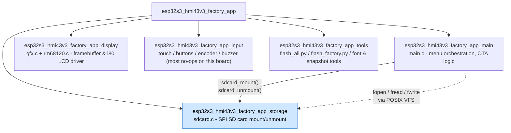
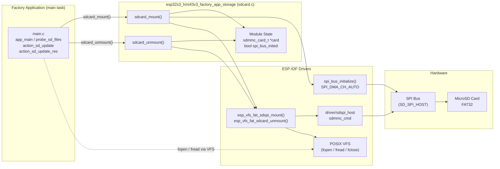
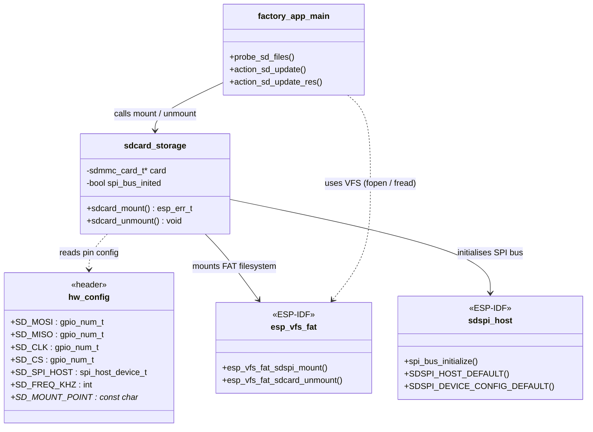
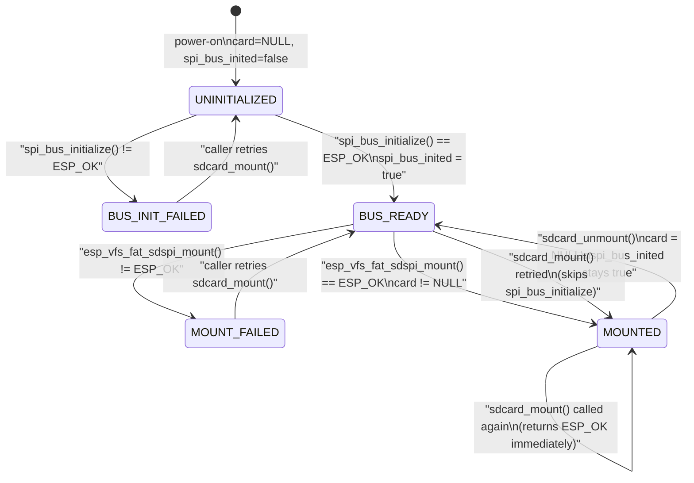
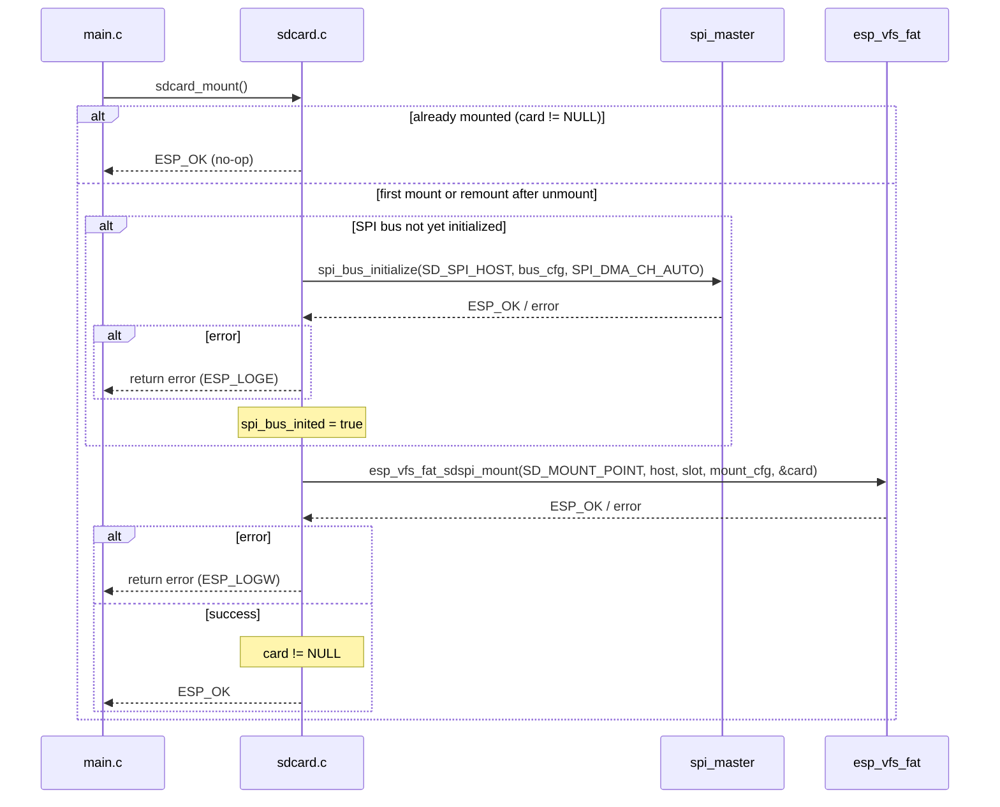
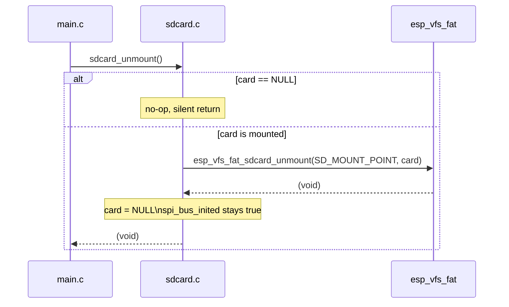
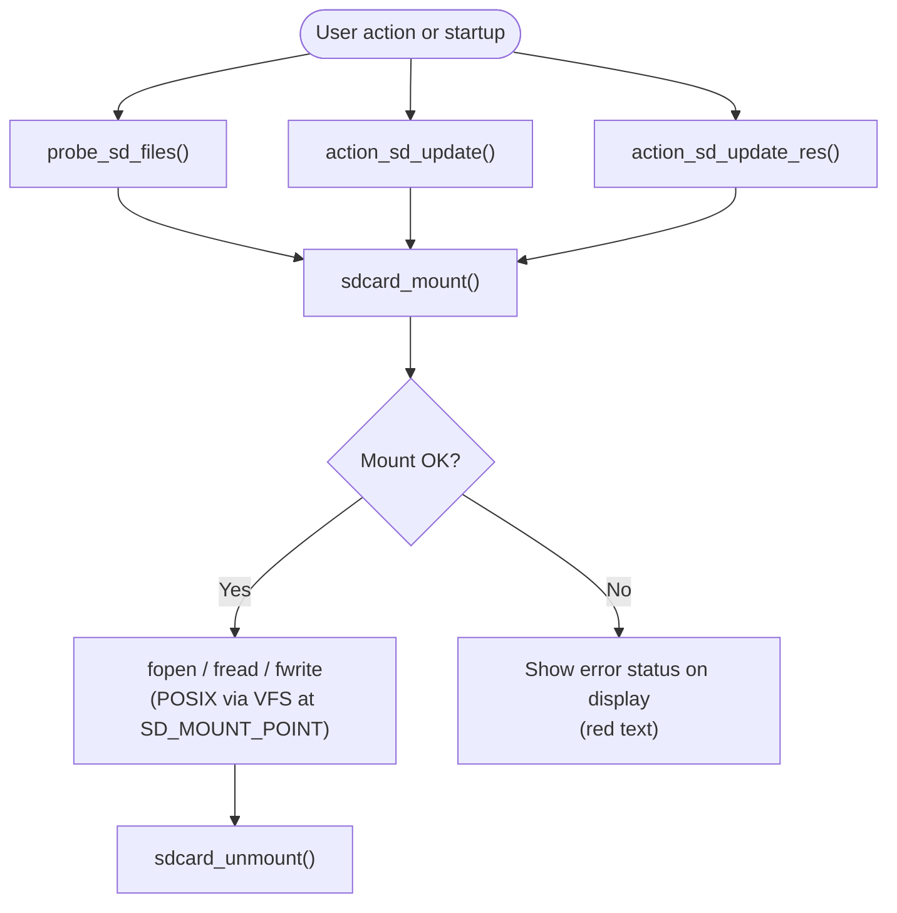
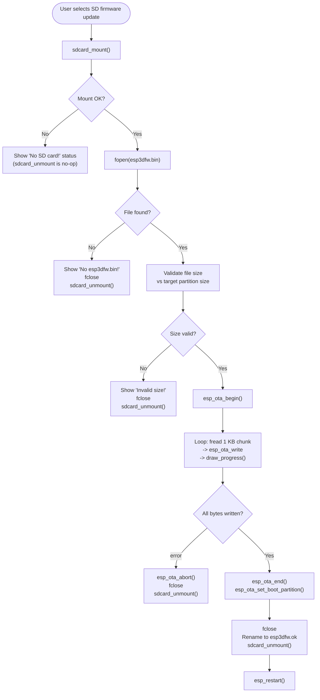

# esp32s3_hmi43v3_factory_app_storage

SD card storage driver for the ESP32-S3 HMI43V3 factory/recovery application. This module provides the sole external storage access point: it mounts the SD card over SPI, exposes it as a POSIX VFS path, and cleanly unmounts it after each operation. All business logic (file probing, OTA writes, partition flashing) lives in the [factory app main module](esp32s3_hmi43v3_factory_app_main.md); this module owns only the SPI bus lifecycle and the FAT-VFS mount point.

---

## Overview

The storage module is a single-file subsystem (`sdcard.c`) that wraps the ESP-IDF `sdspi_host` + `esp_vfs_fat` stack into two simple operations: **mount** and **unmount**.

### Key Characteristics

| Property | Value |
|----------|-------|
| Interface | SPI (`sdspi_host`) |
| Filesystem | FAT via `esp_vfs_fat` |
| Mount point | Defined by `SD_MOUNT_POINT` in `hw_config.h` |
| Max open files | 4 |
| Auto-format on failure | **Disabled** — factory app must never reformat a user card |
| Disk-status check | Enabled |
| SPI bus teardown on unmount | **No** — bus is kept alive between operations (see [Design Decisions](#design-decisions)) |
| RTOS tasks | None — all operations run synchronously in the main factory task |

---

## Module Position in the Factory App

This storage sub-module is one of five sub-modules that together make up [esp32s3_hmi43v3_factory_app](esp32s3_hmi43v3_factory_app.md):



> Only `main.c` calls into this module. The display and input sub-modules have no storage dependency.

---

## Architecture



---

## Component Relationships



---

## Hardware Configuration

All GPIO assignments and timing constants are defined in `hw_config.h` (board-specific header, not part of this sub-module). This module references only the following macros:

| Constant | Role |
|----------|------|
| `SD_MOSI` | SPI data output to SD card |
| `SD_MISO` | SPI data input from SD card |
| `SD_CLK` | SPI clock |
| `SD_CS` | SD card chip select (active low) |
| `SD_SPI_HOST` | ESP-IDF SPI host identifier (e.g. `SPI2_HOST`) |
| `SD_FREQ_KHZ` | Maximum SPI clock frequency for SD access in kHz |
| `SD_MOUNT_POINT` | VFS mount path (e.g. `"/sdcard"`) |

The SPI bus is configured with `max_transfer_sz = 4096` bytes and `SPI_DMA_CH_AUTO` for automatic DMA channel selection.

> **Board context:** On the HMI43V3, the RM68120 display uses a **16-bit i80 parallel bus** — not SPI. The SD card is therefore the only SPI device on the `SD_SPI_HOST` peripheral. See [esp32s3_hmi43v3_bsp](esp32s3_hmi43v3_bsp.md) for physical pin assignments.

### VFS FAT Mount Parameters

| Parameter | Value | Rationale |
|-----------|-------|-----------|
| `format_if_mount_failed` | `false` | Must never silently reformat a technician's card |
| `max_files` | `4` | Sufficient for factory workflow (firmware + resources + spare handle) |
| `allocation_unit_size` | `0` | Use filesystem default cluster size |
| `disk_status_check_enable` | `true` | Enables hardware-level card presence verification |

---

## API Reference

### `sdcard_mount`

```c
esp_err_t sdcard_mount(void);
```

Mounts the SD card as a FAT VFS at `SD_MOUNT_POINT`.

**Behaviour:**

1. **Idempotent guard** — if `card != NULL` the function returns `ESP_OK` immediately without re-initializing anything.
2. Initializes the SPI bus on the first call using `spi_bus_initialize()` with `SPI_DMA_CH_AUTO`. On subsequent calls (after an unmount) the initialization step is skipped because `spi_bus_inited` remains `true`.
3. Configures the SDSPI device with the board's CS pin and frequency from `hw_config.h`.
4. Calls `esp_vfs_fat_sdspi_mount()` to register the card in the VFS at `SD_MOUNT_POINT`.
5. When `FACTORY_LOG_LEVEL` is non-zero, prints card geometry via `sdmmc_card_print_info()`.

**Return values:**

| Value | Meaning |
|-------|---------|
| `ESP_OK` | Card mounted successfully (or was already mounted) |
| `ESP_ERR_*` (from `spi_bus_initialize`) | SPI bus initialization failed — logged with `ESP_LOGE` |
| `ESP_ERR_*` (from `esp_vfs_fat_sdspi_mount`) | FAT mount failed (e.g. card absent) — logged with `ESP_LOGW` |

**Caller responsibility:** The return value must always be checked before performing any file I/O at `SD_MOUNT_POINT`.

---

### `sdcard_unmount`

```c
void sdcard_unmount(void);
```

Unmounts the FAT VFS and clears the internal card handle.

**Behaviour:**

1. If `card == NULL` (not mounted), the function is a no-op and returns silently.
2. Calls `esp_vfs_fat_sdcard_unmount()` and sets `card = NULL`.
3. **Does not free the SPI bus.** `spi_bus_inited` stays `true` so the already-initialized bus can be reused on the next `sdcard_mount()` call without re-initialization overhead.

---

## Static State

| Variable | Type | Purpose |
|----------|------|---------|
| `card` | `sdmmc_card_t *` | Handle returned by `esp_vfs_fat_sdspi_mount`; `NULL` when unmounted |
| `spi_bus_inited` | `bool` | Prevents double-initialization of the SPI bus across repeated mount/unmount cycles |

Both variables are file-static, making the module a singleton — appropriate for this single-task factory application.

---

## State Model



| State | `card` | `spi_bus_inited` |
|-------|--------|-----------------|
| `UNINITIALIZED` | `NULL` | `false` |
| `BUS_READY` | `NULL` | `true` |
| `MOUNTED` | valid pointer | `true` |

---

## Data Flow

### Mount Sequence



### Unmount Sequence



---

## Usage Patterns in the Factory App

The SD card is never held mounted permanently. Every consumer in `main.c` follows the same **mount → use → unmount** pattern:



### Caller Summary

| Caller in `main.c` | When invoked | SD card purpose |
|--------------------|--------------|-----------------|
| `probe_sd_files()` | At startup and after certain failure recovery paths | Detects presence of `esp3dfw.bin` / `ui_resources.bin` to enable or grey-out menu items; unmounts immediately after scanning |
| `action_sd_update()` | User touches Confirm (✓) on "SD → app0" or "SD → app1" | Reads `esp3dfw.bin` in 1 KB chunks via `fread`, writes to OTA partition via `esp_ota_write`; renames to `.ok` / `.bad` on completion |
| `action_sd_update_res()` | User touches Confirm (✓) on "SD → resources" | Reads `ui_resources.bin`, validates 16-byte build header, writes directly to the `ui_resources` data partition via `esp_partition_write` |

---

## Flash Operation Process Flow

This diagram shows how the storage module participates in the complete firmware-update flow from a user menu selection through to reboot:



---

## Logging

| Macro | Visibility | Used for |
|-------|-----------|---------|
| `FACTORY_LOGD(TAG, ...)` | Only when `FACTORY_LOG_LEVEL != 0` | Verbose progress: mount started, mounted path, already-mounted guard, unmounted |
| `ESP_LOGE(TAG, ...)` | Always | Fatal errors: SPI bus initialization failure |
| `ESP_LOGW(TAG, ...)` | Always | Non-fatal warnings: FAT mount failure (card absent or unreadable) |
| `sdmmc_card_print_info(stdout, card)` | Only when `FACTORY_LOG_LEVEL != 0` | Prints card geometry (capacity, speed class, bus width) on successful mount |

### SD Stack Silencing

At application startup, `factory_log_silence_sd_stack()` (from `factory_log.h`) sets all ESP-IDF SD subsystem log tags to `ESP_LOG_NONE`:

```
sdmmc, vfs_fat_sdmmc, sdmmc_periph, sdmmc_req,
sdmmc_common, fatfs, sdspi, sd_diskio
```

This prevents the ESP-IDF SD stack's verbose initialization output from cluttering the factory app console. Errors from `sdcard.c` itself are still always visible because they use `ESP_LOGE` / `ESP_LOGW` directly — those bypass the per-tag filter applied to the SDK drivers.

---

## Design Decisions

### SPI Bus Retained After Unmount

The SPI bus is initialized once on the first `sdcard_mount()` call and is **never freed**, even after `sdcard_unmount()`. The inline comment in the source reads:

> *"Keep SPI bus initialized — freeing it can interfere with TFT SPI. The bus will be reused on next mount."*

**Board-specific note:** On the HMI43V3, the RM68120 display uses an **i80 parallel bus** (not SPI), so there is no TFT device contending for `SD_SPI_HOST`. The inline comment is carried over from the common factory-app template shared across all boards in the BSP collection (on boards such as `esp32s3_bzm_tft35_gt911`, the ST7796 display does share the SPI peripheral — see [esp32s3_bzm_tft35_gt911_factory_app_storage](esp32s3_bzm_tft35_gt911_factory_app_storage.md)). On this board, retaining the bus is still the correct approach because:

1. It avoids the overhead of `spi_bus_initialize()` on every mount/unmount cycle (called multiple times during a single factory session).
2. It maintains a consistent, predictable code pattern across all boards without board-specific `#ifdef` branches in this shared template file.

### No Auto-Format

`format_if_mount_failed = false` ensures the factory app never accidentally destroys SD card contents. The card is typically a technician's card that may carry firmware binaries for multiple board variants.

### On-Demand Mount / Unmount

The SD card is mounted only for the duration of each individual operation and immediately unmounted afterwards. This:

- Keeps the FAT layer inactive during display-intensive rendering (factory menu redraws are driven by i80 DMA, unrelated to SD).
- Avoids leaving the card in an inconsistent state if the board loses power mid-operation.
- Allows the VFS path to cleanly reflect card presence: callers that receive a mount error know the card is absent rather than discovering it mid-read.

### Idempotent Mount Guard

The `card != NULL` check at the start of `sdcard_mount()` makes the function safe to call multiple times without double-initializing the FAT layer. `probe_sd_files()` is called at startup and after certain failure recovery paths — callers do not need to track mount state themselves.

---

## Related Modules

| Module | Relationship |
|--------|-------------|
| [esp32s3_hmi43v3_factory_app_main](esp32s3_hmi43v3_factory_app_main.md) | Sole caller — invokes `sdcard_mount()` / `sdcard_unmount()` and performs all POSIX file I/O via the VFS (`probe_sd_files`, `action_sd_update`, `action_sd_update_res`) |
| [esp32s3_hmi43v3_factory_app_display](esp32s3_hmi43v3_factory_app_display.md) | Uses i80 parallel bus (not SPI); no runtime dependency on this module's SPI bus |
| [esp32s3_hmi43v3_factory_app_input](esp32s3_hmi43v3_factory_app_input.md) | No direct dependency; touch events in `main.c` trigger SD operations indirectly |
| [esp32s3_hmi43v3_factory_app_tools](esp32s3_hmi43v3_factory_app_tools.md) | Host-side flash scripts used to initially program the SD-resident binaries; no runtime dependency |
| [esp32s3_hmi43v3_bsp](esp32s3_hmi43v3_bsp.md) | Provides `hw_config.h` with the `SD_*` pin and frequency macros consumed here |
| [esp32s3_hmi43v3_factory_app](esp32s3_hmi43v3_factory_app.md) | Parent module — full factory app context including partition layout, bootloader interaction, i80 display design, and OTA workflow |
| [pibot_pendant_v1_0_factory_app_storage](pibot_pendant_v1_0_factory_app_storage.md) | Analogous module on the PiBot pendant (same SPI-FAT pattern; that board has physical buzzer/encoder/buttons) |
| [esp32s3_bzm_tft35_gt911_factory_app_storage](esp32s3_bzm_tft35_gt911_factory_app_storage.md) | Closest sibling — same implementation template; display shares the SPI bus, which is why the retained-bus comment references TFT SPI |
| [esp32s3_8048s070c_factory_app_storage](esp32s3_8048s070c_factory_app_storage.md) | Analogous module on the 7" RGB display board |
