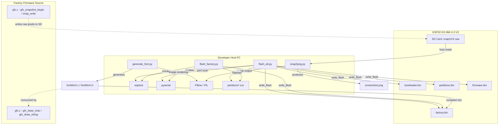
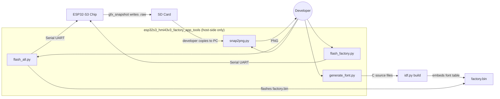
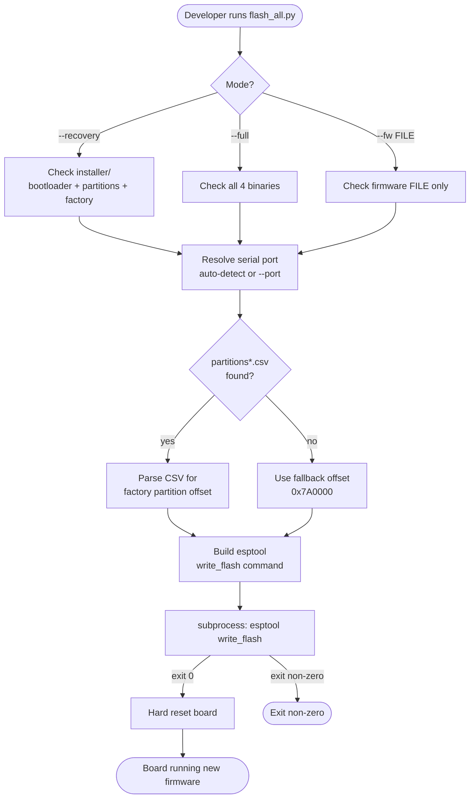
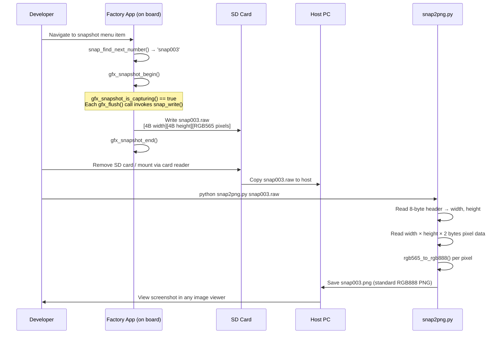

# esp32s3_hmi43v3_factory_app_tools

Host-side Python developer tools for the **ESP32-S3 HMI 4.3" V3** factory application. This module provides four scripts that cover the complete factory workflow: initial board provisioning, firmware updates, display font generation, and screenshot debugging. All scripts run on the developer's PC — none are compiled into firmware.

---

## Table of Contents

1. [Module Context](#1-module-context)
2. [Tools Overview](#2-tools-overview)
3. [Architecture & Component Relationships](#3-architecture--component-relationships)
4. [Tool Reference](#4-tool-reference)
   - [flash_all.py — Full Flash Orchestration](#41-flash_allpy--full-flash-orchestration)
   - [flash_factory.py — Factory Partition Flash](#42-flash_factorypy--factory-partition-flash)
   - [generate_font.py — Bitmap Font Generator](#43-generate_fontpy--bitmap-font-generator)
   - [snap2png.py — Snapshot Converter](#44-snap2pngpy--snapshot-converter)
5. [Data & Process Flows](#5-data--process-flows)
   - [Flash Workflow](#51-flash-workflow)
   - [Font Generation Pipeline](#52-font-generation-pipeline)
   - [Snapshot Debug Workflow](#53-snapshot-debug-workflow)
6. [Prerequisites & Installation](#6-prerequisites--installation)
7. [Usage Examples](#7-usage-examples)
8. [Cross-Board Pattern](#8-cross-board-pattern)

---

## 1. Module Context

This module sits at the leaf level of the `esp32s3_hmi43v3` board hierarchy, inside the factory application sub-tree:

```
Board_Support_Packages
└── esp32s3_hmi43v3
    ├── esp32s3_hmi43v3_bsp              ← LVGL BSP, RM68120 i80 display, GT911 touch
    ├── esp32s3_hmi43v3_build_scripts    ← build_one.py, variants, common
    └── esp32s3_hmi43v3_factory_app
        ├── esp32s3_hmi43v3_factory_app_main     ← app_main, menu, OTA restore
        ├── esp32s3_hmi43v3_factory_app_display  ← gfx.c, rm68120.c (raw renderer)
        ├── esp32s3_hmi43v3_factory_app_input    ← buttons, encoder, touch, buzzer
        ├── esp32s3_hmi43v3_factory_app_storage  ← sdcard mount/unmount
        └── esp32s3_hmi43v3_factory_app_tools    ← THIS MODULE (host-side tools)
```

**Key relationships with sibling modules:**

| Sibling | Relationship to This Module |
|---|---|
| [esp32s3_hmi43v3_factory_app_display](esp32s3_hmi43v3_factory_app_display.md) | `snap2png.py` converts the raw files that `gfx_snapshot_begin`, `gfx_snapshot_end`, and `snap_write` produce on the board |
| [esp32s3_hmi43v3_factory_app_main](esp32s3_hmi43v3_factory_app_main.md) | `flash_all.py` provisions the complete firmware stack that `app_main` requires; `snap_find_next_number` names the raw files that `snap2png.py` consumes |
| [esp32s3_hmi43v3_factory_app_storage](esp32s3_hmi43v3_factory_app_storage.md) | Snapshots are written to the SD card managed by `sdcard_mount/unmount`; flash scripts reference the partition CSV that lives alongside the firmware |
| [esp32s3_hmi43v3_bsp](esp32s3_hmi43v3_bsp.md) | `generate_font.py` produces C font tables consumed by `gfx_draw_char/string` in the factory firmware built against this BSP |

---

## 2. Tools Overview

| Script | Location | Purpose | Key Dependency |
|---|---|---|---|
| `flash_all.py` | `Factory/tools/` | Complete board provisioning — recovery, full, or firmware-only flash | `esptool`, `pyserial` |
| `flash_factory.py` | `Factory/tools/` | Single-purpose factory partition flash with auto-detected offset | `esptool`, `pyserial` |
| `generate_font.py` | `Factory/tools/generate_font/` | Renders a TTF or system font into C bitmap arrays for the factory app | `Pillow` |
| `snap2png.py` | `Factory/tools/raw2png/` | Converts RGB565 raw snapshot files captured on the board to PNG | `Pillow` |

All scripts are standalone executables (`#!/usr/bin/env python3`) and accept `--help`.

---

## 3. Architecture & Component Relationships

### 3.1 Module Dependency Graph



### 3.2 Flash Address Map

The factory partition offset is **not hard-coded** in the scripts — it is discovered by parsing `partitions*.csv`. The constant `0x7A0000` is used only as a last-resort fallback.

```
ESP32-S3 Flash (8 MB layout)
────────────────────────────────────────────────────
0x0000_0000   Reserved
0x0000_1000   Bootloader          ← bootloader.bin
0x0000_C000   Partition Table     ← partitions.bin
0x0001_0000   OTA Data (otadata)
0x0002_0000   OTA app0 slot       ← firmware.bin
0x0066_0000   Flash FS (LittleFS / FAT)
0x007A_0000+  Factory Recovery    ← factory.bin  (auto-detected)
────────────────────────────────────────────────────
```

### 3.3 Component Interaction Overview



---

## 4. Tool Reference

### 4.1 `flash_all.py` — Full Flash Orchestration

**Path:** `boards/esp32s3_hmi43v3/Factory/tools/flash_all.py`

The primary provisioning script. It handles three mutually exclusive flash modes selected via a required argument group. All binary files are validated before any flash operation begins to prevent partial writes.

#### Modes

| Flag | Binaries Written | Use Case |
|---|---|---|
| `--recovery` | bootloader + partitions + factory | First-time board setup or recovery from corrupted OTA state |
| `--full --fw FILE` | bootloader + partitions + factory + firmware | Full clean install with factory image and production firmware |
| `--fw FILE` | firmware only → `app0` at `0x20000` | Rapid firmware-only re-flash during development iteration |

#### Key Functions

| Function | Description |
|---|---|
| `main()` | Argument parsing, mode dispatch, pre-flight file checks, port resolution, exit-code propagation |
| `flash(port, baud, files)` | Builds the `esptool write_flash` command from a list of `(offset, path)` tuples; runs via `subprocess.run(check=True)` |
| `find_factory_offset()` | Parses `partitions*.csv` globs to locate the factory entry; returns `"0x7A0000"` if no CSV is found |
| `find_esp32_port()` | Scans `serial.tools.list_ports` for CP210x / CH340 / FTDI adapters; falls back to the first available port |
| `check_file(path, name)` | Validates file existence and prints size; called for all binaries before any flash starts |

#### Fixed Flash Addresses

```python
BOOTLOADER_OFFSET = "0x1000"   # Custom bootloader (44 KB reserved)
PARTITIONS_OFFSET = "0xC000"   # Compiled partition table
APP0_OFFSET       = "0x20000"  # OTA app0 slot (firmware)
# Factory offset is read dynamically from partitions*.csv
```

#### Installer Directory Layout

```
Factory/tools/installer/
├── bootloader.bin     # Pre-built custom bootloader binary
├── partitions.bin     # Compiled partition table binary
└── factory.bin        # Factory recovery application binary
```

#### CLI Reference

```
flash_all.py [--port PORT] [--baud BAUD]
             { --recovery | --full | --fw FILE }
             [--fw-file FILE]

  --port, -p      Serial port (auto-detected if omitted)
  --baud          Baud rate (default: 460800)
  --recovery      Flash bootloader + partitions + factory
  --full          Flash all four binaries (requires --fw-file or --fw)
  --fw FILE       Flash firmware binary only (to app0)
  --fw-file FILE  Firmware path for use alongside --full
```

---

### 4.2 `flash_factory.py` — Factory Partition Flash

**Path:** `boards/esp32s3_hmi43v3/Factory/tools/flash_factory.py`

A focused script for re-flashing only the factory recovery partition. Useful when the bootloader and main firmware are already installed and only the recovery image needs to be updated.

#### Key Functions

| Function | Description |
|---|---|
| `main()` | Argument parsing, binary existence check, offset resolution, esptool invocation |
| `find_factory_offset()` | Same CSV-parsing logic as `flash_all.py`; probes the `PARTITION_CSV_PATTERNS` glob list |
| `find_esp32_port()` | Identical auto-detection to `flash_all.py` |

#### Comparison with `flash_all.py`

| Aspect | `flash_all.py` | `flash_factory.py` |
|---|---|---|
| Scope | Multi-binary, multi-mode | Single binary (factory only) |
| Mode selection | Mandatory mode flag | Always flashes factory |
| Offset override | Not supported | `--offset` flag available |
| Binary path override | Not supported | `--bin` flag available |

#### CLI Reference

```
flash_factory.py [--port PORT] [--baud BAUD] [--bin FILE] [--offset OFFSET]

  --port, -p      Serial port (auto-detected if omitted)
  --baud          Baud rate (default: 460800)
  --bin, -b       Factory binary path (default: installer/factory.bin)
  --offset, -o    Flash offset (auto-detected from CSV if omitted)
```

---

### 4.3 `generate_font.py` — Bitmap Font Generator

**Path:** `boards/esp32s3_hmi43v3/Factory/tools/generate_font/generate_font.py`

Renders a monospace TrueType font at a target pixel cell size into two C source files. The output is compiled directly into the factory firmware, providing character bitmaps consumed by `gfx_draw_char()` and `gfx_draw_string()` in [esp32s3_hmi43v3_factory_app_display](esp32s3_hmi43v3_factory_app_display.md).

#### Character Coverage

- ASCII printable range: `0x20` (space) through `0x7E` (tilde) — 95 characters
- 1 bit per pixel, **MSB = leftmost pixel**
- Row-major order: `bytes_per_row = (width + 7) / 8`
- Total flash usage: `95 × bytes_per_row × height` bytes

#### Key Functions

| Function | Description |
|---|---|
| `main()` | Parses `WxH [output_dir] [--font path]` CLI; validates size bounds (width 4–32, height 6–64); orchestrates pipeline |
| `find_monospace_font()` | Probes known system font paths on Linux, macOS, and Windows |
| `find_best_font_size(font_path, w, h)` | Iterates point sizes upward and returns the largest that fits the target cell without clipping |
| `render_font(font_path, w, h)` | Renders all 95 glyphs to Pillow images; aligns baselines globally across the full character set; thresholds pixels at 127; packs bits MSB-first into byte arrays |
| `generate_c_files(glyphs, w, h, output_dir)` | Writes `fontWxH.h` (constants + `get_glyph` declaration) and `fontWxH.c` (static 2D array + accessor implementation) |

#### Generated API

```c
/* fontWxH.h --------------------------------------------------------- */
#pragma once
#include <stdint.h>

#define FONT_WIDTH          W           /* cell width in pixels            */
#define FONT_HEIGHT         H           /* cell height in pixels           */
#define FONT_BYTES_PER_ROW  ((W+7)/8)   /* bytes per pixel row             */

/**
 * Get glyph data for an ASCII character.
 * @param c  ASCII character in [0x20, 0x7E]
 * @return   Pointer to FONT_BYTES_PER_ROW * FONT_HEIGHT bytes (read-only).
 *           For c outside the range, returns the space glyph (index 0).
 */
const uint8_t *fontWxH_get_glyph(char c);
```

#### Recommended Font

For a CP437/DOS aesthetic matching the factory app visual style, use **Perfect DOS VGA 437** (free, zero-width license):
- Download: https://www.dafont.com/perfect-dos-vga-437.font
- Best at multiples of 8: `8x16`, `16x32`, `24x48`

#### CLI Reference

```
generate_font.py <WxH> [output_dir] [--font path/to/font.ttf]

  WxH          Cell size (e.g. 8x16); width 4–32, height 6–64
  output_dir   Destination for .c/.h output (default: current directory)
  --font       Path to TrueType font file (system font auto-detected if omitted)
```

---

### 4.4 `snap2png.py` — Snapshot Converter

**Path:** `boards/esp32s3_hmi43v3/Factory/tools/raw2png/snap2png.py`

Converts raw RGB565 binary snapshot files produced by the board's factory app into standard PNG files for visual debugging.

#### Raw File Format

```
Offset   Size      Type       Description
─────────────────────────────────────────────────────────────
0        4 bytes   uint32_t   Image width  (little-endian)
4        4 bytes   uint32_t   Image height (little-endian)
8        W×H×2     uint16_t[] Pixel data, RGB565, row-major, little-endian
```

Snapshot files are written to the SD card by `gfx_snapshot_begin()`, `gfx_snapshot_is_capturing()`, and `snap_write()` in [esp32s3_hmi43v3_factory_app_display](esp32s3_hmi43v3_factory_app_display.md). File naming (`snap000.raw`, `snap001.raw`, …) is managed by `snap_find_next_number()` in [esp32s3_hmi43v3_factory_app_main](esp32s3_hmi43v3_factory_app_main.md).

#### RGB565 → RGB888 Conversion

```python
r = (pixel >> 11) & 0x1F        # extract 5-bit red
g = (pixel >>  5) & 0x3F        # extract 6-bit green
b =  pixel        & 0x1F        # extract 5-bit blue

r = (r << 3) | (r >> 2)         # scale 5-bit → 8-bit
g = (g << 2) | (g >> 4)         # scale 6-bit → 8-bit
b = (b << 3) | (b >> 2)         # scale 5-bit → 8-bit
```

#### Key Functions

| Function | Description |
|---|---|
| `main()` | Argument parsing; enforces single-file constraint when `-o` is used; iterates over the file list |
| `convert_raw_to_png(raw_path, output_path)` | Reads 8-byte header, allocates a `PIL.Image`, calls `rgb565_to_rgb888` per pixel, saves PNG |
| `rgb565_to_rgb888(pixel)` | Bit-shift channel extraction and 5/6→8-bit scaling |

#### CLI Reference

```
snap2png.py FILE [FILE ...] [-o OUTPUT]

  FILE        One or more .raw snapshot files (glob-friendly)
  -o OUTPUT   Output PNG filename (only valid with a single input file)
```

---

## 5. Data & Process Flows

### 5.1 Flash Workflow



### 5.2 Font Generation Pipeline

```mermaid
flowchart LR
    DEV([Developer]) -->|python generate_font.py 8x16 ./main| PARSE["Parse WxH + args"]

    PARSE --> FONT_Q{--font\nprovided?}
    FONT_Q -->|yes| LOAD_TTF[Load specified TTF]
    FONT_Q -->|no| SCAN[find_monospace_font\nSystem path scan]

    LOAD_TTF --> SIZE[find_best_font_size\nIterate pt sizes until cell overflows]
    SCAN --> SIZE

    SIZE --> RENDER["render_font\nPillow: render 95 glyphs\nGlobal baseline alignment\nThreshold at 127\nBit-pack MSB-first"]

    RENDER --> GEN_C[generate_c_files]
    GEN_C --> H["font8x16.h\nconstants + get_glyph decl"]
    GEN_C --> C[font8x16.c\nstatic 2D uint8_t array\nget_glyph accessor]

    H --> BUILD[idf.py build factory firmware]
    C --> BUILD

    BUILD --> BIN[factory.bin]
    BIN --> FLASH[flash_all.py --recovery]
    FLASH --> BOARD([Board: gfx_draw_char\ncalls fontWxH_get_glyph])
```



### 5.3 Snapshot Debug Workflow



---

## 6. Prerequisites & Installation

All tools require **Python 3.7+**. Install the required packages:

```bash
pip install esptool pyserial Pillow
```

| Package | Minimum Version | Used By |
|---|---|---|
| `esptool` | ≥ 4.x | `flash_all.py`, `flash_factory.py` |
| `pyserial` | ≥ 3.x | `flash_all.py`, `flash_factory.py` (port auto-detection) |
| `Pillow` | ≥ 9.x | `generate_font.py`, `snap2png.py` |

> **ESP-IDF virtual environment:** Both flash scripts invoke esptool as `sys.executable -m esptool`, so they work inside the ESP-IDF Python venv without a separate installation when `idf.py` is already configured.

---

## 7. Usage Examples

### First-time board provisioning

```bash
cd boards/esp32s3_hmi43v3/Factory/tools

# Auto-detect port — flash bootloader + partition table + factory recovery
python flash_all.py --recovery

# Specify port explicitly (Linux / Windows)
python flash_all.py --recovery --port /dev/ttyUSB0
python flash_all.py --recovery --port COM3
```

### Full production flash

```bash
# Flash all four binaries in one operation
python flash_all.py --full --fw ../../../../build/firmware.bin --port COM5
```

### Development iteration — firmware only

```bash
# Re-flash only the application after idf.py build (fastest path)
python flash_all.py --fw ../../../../build/firmware.bin
```

### Refresh only the factory recovery partition

```bash
# Update factory.bin without touching the bootloader or OTA firmware
python flash_factory.py --bin installer/factory.bin --port /dev/ttyACM0

# Manual offset override (bypasses CSV parsing)
python flash_factory.py --offset 0x7A0000
```

### Generate a bitmap font for the factory app display

```bash
cd boards/esp32s3_hmi43v3/Factory/tools/generate_font

# Auto-detect a system monospace font, write C files to ../main/
python generate_font.py 8x16 ../main

# Use Perfect DOS VGA 437 for a CP437 DOS look
python generate_font.py 8x16 ../main --font "Perfect DOS VGA 437.ttf"

# Generate a larger cell for higher-resolution panels
python generate_font.py 12x24 ../main --font /path/to/MyMono.ttf
```

> The generated `font8x16.c` and `font8x16.h` must be added to the factory app's `CMakeLists.txt` source list before rebuilding.

### Convert board screenshots to PNG

```bash
cd boards/esp32s3_hmi43v3/Factory/tools/raw2png

# Single file (produces snap000.png in the same directory)
python snap2png.py snap000.raw

# Batch convert all snapshots copied from the SD card
python snap2png.py snap*.raw

# Save to a custom filename
python snap2png.py snap001.raw -o before_update.png
```

---

## 8. Cross-Board Pattern

The four-script tools layout is a **standardized pattern** replicated across all factory-capable boards in this repository. The scripts are functionally identical across boards; only the partition table CSV (which determines the auto-detected factory offset) and the linked display driver differ.

| Board | Tools Module |
|---|---|
| `pibot_pendant_v1_0` | [pibot_pendant_v1_0_factory_app_tools](pibot_pendant_v1_0_factory_app_tools.md) |
| `esp32s3_8048s070c` | [esp32s3_8048s070c_factory_app_tools](esp32s3_8048s070c_factory_app_tools.md) |
| `esp32s3_bzm_tft35_gt911` | [esp32s3_bzm_tft35_gt911_factory_app_tools](esp32s3_bzm_tft35_gt911_factory_app_tools.md) |
| `esp32s3_zx3d50ce02s_usrc_4832` | [esp32s3_zx3d50ce02s_usrc_4832_factory_app](esp32s3_zx3d50ce02s_usrc_4832_factory_app.md) |

**Board-specific differences are limited to:**
- The display driver the factory app links (RM68120 i80 for this board vs. ST7796 SPI, ST7262 RGB, or ILI9341 SPI on others)
- The partition table CSV, which determines the auto-detected factory partition offset
- The BSP board support layer used at firmware runtime

---

*See also:*
- [esp32s3_hmi43v3_factory_app_display](esp32s3_hmi43v3_factory_app_display.md) — raw display renderer and snapshot capture (board-side counterpart to `snap2png.py`)
- [esp32s3_hmi43v3_factory_app_main](esp32s3_hmi43v3_factory_app_main.md) — factory app main loop, menu system, OTA restore
- [esp32s3_hmi43v3_factory_app_input](esp32s3_hmi43v3_factory_app_input.md) — buttons, encoder, touch, buzzer drivers
- [esp32s3_hmi43v3_factory_app_storage](esp32s3_hmi43v3_factory_app_storage.md) — SD card mount/unmount (snapshot storage)
- [esp32s3_hmi43v3_bsp](esp32s3_hmi43v3_bsp.md) — board support: RM68120 i80 driver, LVGL integration
