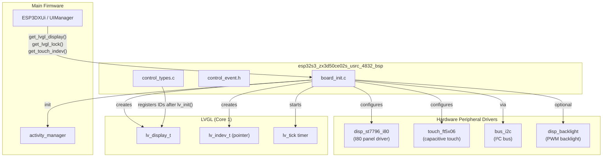
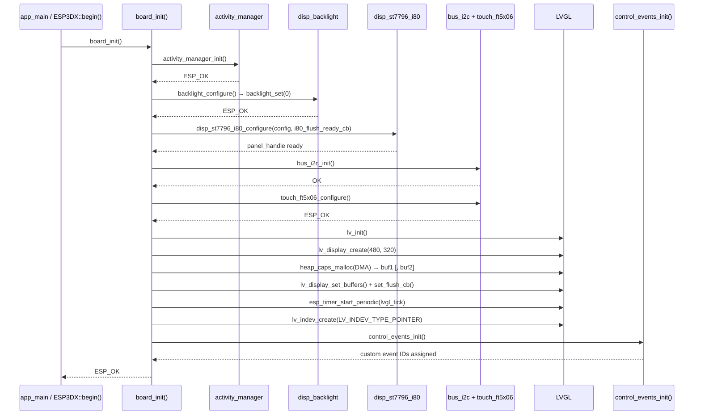
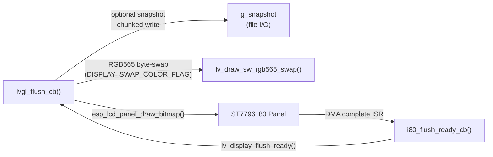
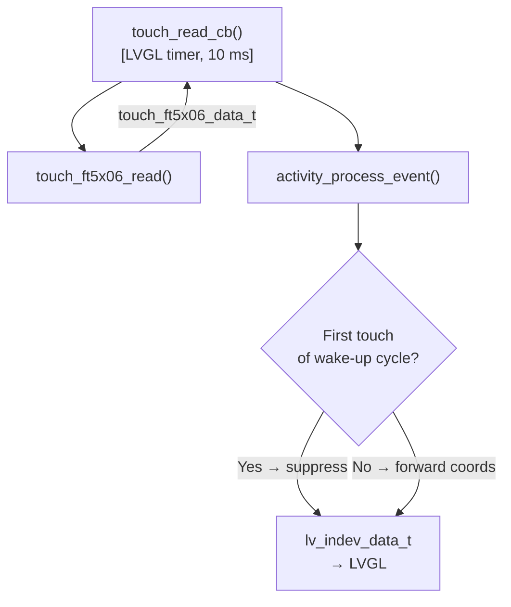
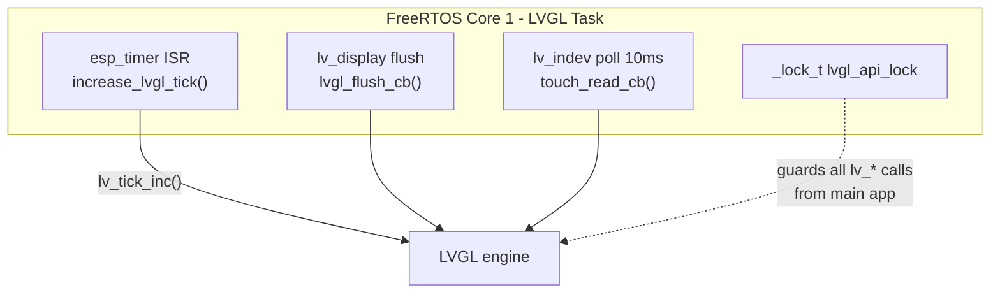
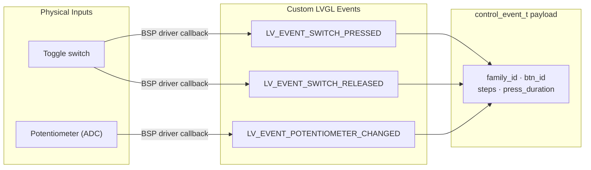
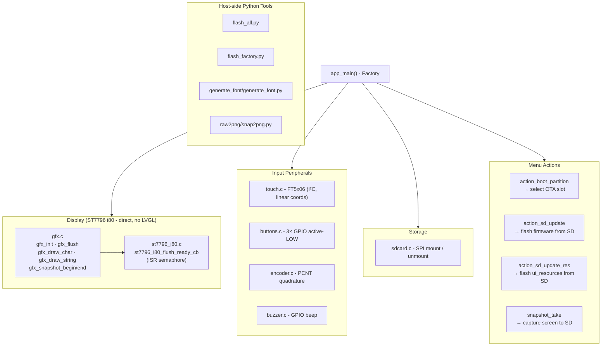
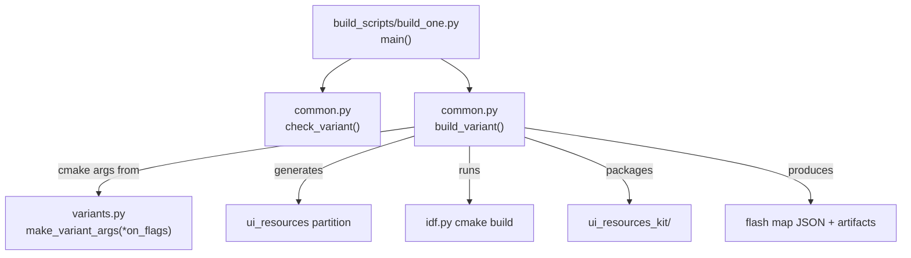

# ESP32S3 ZX3D50CE02S USRC 4832 — Board Support Package

The `esp32s3_zx3d50ce02s_usrc_4832_bsp` module is the Board Support Package (BSP) for the **ZX3D50CE02S USRC 4832** display board, a compact ESP32-S3 panel featuring a 480×320 TFT driven over the Intel 8080 (i80) parallel interface with a capacitive FT5x06 touch controller. It belongs to the broader [Board Support Packages](Board_Support_Packages.md) collection and follows the same layered design as all other BSPs in this project.

---

## Table of Contents

1. [Hardware Overview](#1-hardware-overview)
2. [Module Architecture](#2-module-architecture)
3. [Component Reference](#3-component-reference)
   - 3.1 [board_init.c — BSP Core](#31-board_initc--bsp-core)
   - 3.2 [control_event.h — Control Event Type](#32-control_eventh--control-event-type)
   - 3.3 [control_types.c — LVGL Event Registration](#33-control_typesc--lvgl-event-registration)
4. [Initialization Sequence](#4-initialization-sequence)
5. [Display Subsystem](#5-display-subsystem)
6. [Touch Subsystem](#6-touch-subsystem)
7. [LVGL Integration](#7-lvgl-integration)
8. [Control Event System](#8-control-event-system)
9. [Factory Application](#9-factory-application)
10. [Build System & Variants](#10-build-system--variants)
11. [Dependencies](#11-dependencies)
12. [Related Modules](#12-related-modules)

---

## 1. Hardware Overview

| Property | Value |
|---|---|
| SoC | ESP32-S3 |
| Display controller | ST7796 |
| Display bus | Intel 8080 (i80) 16-bit parallel |
| Display resolution | 480 × 320 px (RGB565) |
| Touch controller | FT5x06 (capacitive multi-touch) |
| Touch bus | I²C |
| Physical buttons | Up to 3 (GPIO, active-LOW) |
| Rotary encoder | Optional (PCNT quadrature decoder) |
| Buzzer | Optional (GPIO) |
| Storage | microSD (SPI) |

> **Note:** The encoder and buzzer pins are guarded — if `ENCODER_A_PIN`, `ENCODER_B_PIN`, or `BUZZER_PIN` are defined as `GPIO_NUM_NC`, initialisation is silently skipped. This makes the BSP portable across sub-variants of this panel family without code changes.

---

## 2. Module Architecture



The BSP is the sole owner of all hardware handles (panel, touch, LVGL display, tick timer). The main application retrieves them through three accessor functions exposed by `board_init.h`:

| Accessor | Returns |
|---|---|
| `get_lvgl_display()` | `lv_display_t *` |
| `get_lvgl_lock()` | `_lock_t *` — mutual exclusion guard for all LVGL API calls |
| `get_touch_indev()` | `lv_indev_t *` (guarded by `ESP3D_TOUCH_FEATURE`) |

---

## 3. Component Reference

### 3.1 `board_init.c` — BSP Core

**Path:** `boards/esp32s3_zx3d50ce02s_usrc_4832/components/bsp/board_init.c`

The single source of truth for hardware bring-up. All internal functions are `static`; only `board_init()`, `board_get_name()`, `board_get_version()`, and the three accessors are exported.

#### Public API

| Symbol | Signature | Description |
|---|---|---|
| `board_init` | `esp_err_t board_init(void)` | Master entry point. Calls every sub-initialiser in order. Returns `ESP_OK` on success; first failure aborts and propagates the error code. |
| `board_get_name` | `const char *board_get_name(void)` | Returns `BOARD_NAME_STR` from `board_config.h`. |
| `board_get_version` | `const char *board_get_version(void)` | Returns `BOARD_VERSION_STR` from `board_config.h`. |
| `get_lvgl_display` | `lv_display_t *get_lvgl_display(void)` | Returns the LVGL display handle (NULL when `ESP3D_DISPLAY_FEATURE` disabled). |
| `get_lvgl_lock` | `_lock_t *get_lvgl_lock(void)` | Returns the LVGL API mutex pointer. |
| `get_touch_indev` | `lv_indev_t *get_touch_indev(void)` | Returns the touch input device handle. |

#### Static internal functions

| Symbol | Purpose |
|---|---|
| `i80_flush_ready_cb` | ISR-context callback registered with `disp_st7796_i80_configure()`. Called when the I80 DMA transfer completes; signals LVGL via `lv_display_flush_ready()`. |
| `lvgl_flush_cb` | LVGL flush callback. Optionally captures pixel data to the snapshot file (`ESP3D_SNAPSHOT_FEATURE`), byte-swaps RGB565 data if `DISPLAY_SWAP_COLOR_FLAG` is set, then calls `esp_lcd_panel_draw_bitmap()`. |
| `touch_read_cb` | LVGL input-device poll callback (10 ms period). Reads `touch_ft5x06_data_t`, routes wake-up events through `activity_manager`, and suppresses the first touch of a new wake-up cycle to prevent accidental UI activation. |
| `increase_lvgl_tick` | Periodic `esp_timer` callback; calls `lv_tick_inc(LVGL_TICK_PERIOD_MS)` to advance the LVGL time base. |
| `init_touch_controller` | Initialises the I²C bus via `bus_i2c_init()`, then configures the FT5x06 via `touch_ft5x06_configure()`. |
| `init_lvgl` | Full LVGL setup: `lv_init()`, display creation, DMA buffer allocation (single or double, per `DISPLAY_USE_DOUBLE_BUFFER_FLAG`), flush callback, tick timer, and touch input device registration. |

---

### 3.2 `control_event.h` — Control Event Type

**Path:** `boards/esp32s3_zx3d50ce02s_usrc_4832/components/bsp/control_event.h`

Defines the payload carried by all custom LVGL control events dispatched from physical input devices to UI screens.

```c
typedef struct {
    lv_indev_t       *indev;          // Source input device handle
    uint32_t          btn_id;         // Button / switch identifier
    lv_indev_type_t   type;           // LV_INDEV_TYPE_BUTTON / ENCODER / …
    control_family_t  family_id;      // Device family (switch, encoder, potentiometer…)
    int32_t           steps;          // Encoder delta (positive = CW)
    uint32_t          press_duration; // Duration button was held (milliseconds)
} control_event_t;
```

This structure is used system-wide wherever physical input state must be forwarded to LVGL screens. See [UI_Framework_&_Screens](UI_Framework_and_Screens.md) for how screens consume these events.

---

### 3.3 `control_types.c` — LVGL Event Registration

**Path:** `boards/esp32s3_zx3d50ce02s_usrc_4832/components/bsp/control_types.c`

Registers board-specific custom events with LVGL and exposes them as global `lv_event_code_t` constants.

| Global variable | Description |
|---|---|
| `LV_EVENT_SWITCH_PRESSED` | Fired when a physical switch/button transitions to the pressed state. |
| `LV_EVENT_SWITCH_RELEASED` | Fired when a physical switch/button is released. |
| `LV_EVENT_POTENTIOMETER_CHANGED` | Fired when an analog potentiometer value changes. |

**`control_events_init(void)`** must be called **after** `lv_init()` (it is invoked at the end of `board_init()`). It calls `lv_event_register_id()` once per event and stores the returned dynamic ID.

> **Important:** All three IDs are initialised to `LV_EVENT_ALL` at startup. Reading them before `control_events_init()` runs produces incorrect results.

---

## 4. Initialization Sequence



Failure at any step returns the error immediately — subsequent steps are not attempted, preventing partial hardware state.

---

## 5. Display Subsystem



### Key configuration constants (from `board_config.h`)

| Constant | Role |
|---|---|
| `DISPLAY_WIDTH_PX` / `DISPLAY_HEIGHT_PX` | Logical resolution passed to `lv_display_create` |
| `DISP_BUF_SIZE_BYTES` | DMA buffer allocation size per buffer |
| `DISPLAY_USE_DOUBLE_BUFFER_FLAG` | `1` → allocate `buf2` for double-buffering |
| `DISPLAY_SWAP_COLOR_FLAG` | `1` → apply in-place RGB565 byte-swap before sending to panel |
| `LVGL_TICK_PERIOD_MS` | Tick timer period (milliseconds) |

### Snapshot support

When `ESP3D_SNAPSHOT_FEATURE` is compiled in, `lvgl_flush_cb` intercepts each flush and streams pixel data to an open file (`g_snapshot.file`) in 120-byte chunks. The snapshot is marked complete when `captured_pixels >= expected_pixels`. Write errors set `g_snapshot.error = true` and abort the capture.

> The 120-byte chunk limit is deliberately small to stay within safe stack and heap budgets on the ESP32-S3. See [`docs/guides/esp32_memory_constraints.md`](https://github.com/luc-github/Pibot-cnc-pendant-firmware/blob/main/docs/guides/esp32_memory_constraints.md) for fragmentation guidance.

---

## 6. Touch Subsystem



### Wake-up suppression logic

The touch callback maintains two `static bool` flags:

| Flag | Purpose |
|---|---|
| `last_pressed_state` | Tracks whether a finger was down on the previous poll |
| `touch_consumed_for_wakeup` | Set when the first press of a new wake-up cycle is consumed by `activity_process_event()` |

A touch event that wakes the display is **not** forwarded to LVGL — only a subsequent continuous hold or a new press after release is dispatched. This prevents accidental UI activation when the user simply wakes the screen.

### Factory app touch

The factory application uses its own lightweight `touch_init()` / `touch_read()` pair (`Factory/main/touch.c`) that maps raw FT5x06 coordinates linearly to screen dimensions without the wake-up logic:

```c
pt.x = raw_x * SCREEN_WIDTH  / touch_ft5x06_get_x_max();
pt.y = raw_y * SCREEN_HEIGHT / touch_ft5x06_get_y_max();
```

---

## 7. LVGL Integration



### Buffer strategy

| Mode | Condition | Description |
|---|---|---|
| **Single buffer** | `DISPLAY_USE_DOUBLE_BUFFER_FLAG = 0` | One DMA buffer; LVGL waits for flush completion before rendering the next frame |
| **Double buffer** | `DISPLAY_USE_DOUBLE_BUFFER_FLAG = 1` | Two DMA buffers; LVGL can render into `buf2` while `buf1` is transferring |

Both buffers are allocated from `MALLOC_CAP_DMA` heap. Allocation failure returns `ESP_ERR_NO_MEM` immediately and aborts `board_init`.

### LVGL thread safety

All code external to the LVGL task that calls `lv_*` APIs must acquire `lvgl_api_lock` first. The main UI task (`tft_ui_task`) holds this lock around each `lv_timer_handler()` call. See [UI_Framework_&_Screens](UI_Framework_and_Screens.md) for the task architecture.

> ⚠️ **LVGL runs exclusively on Core 1.** Never call `lv_*` functions from Core 0 tasks without first acquiring the lock.

---

## 8. Control Event System

The BSP registers three custom LVGL events for physical peripherals that have no native LVGL input type:



`control_event_t.family_id` (type `control_family_t`) allows UI screens to route events to the correct handler without inspecting the raw `indev` pointer. The CNC screens — jog, status, probe — subscribe to these events to react to physical controls without polling. See [UI_Framework_&_Screens](UI_Framework_and_Screens.md).

> **Potentiometer note:** `LV_EVENT_POTENTIOMETER_CHANGED` is registered by this BSP regardless of whether the hardware is populated. The actual ADC read and event dispatch depends on optional board-specific driver hooks.

---

## 9. Factory Application

The companion factory application lives in `boards/esp32s3_zx3d50ce02s_usrc_4832/Factory/` and is a **standalone ESP-IDF project** — it is not linked against the main firmware. It provides first-boot hardware validation and firmware update facilities.



### Factory display ISR design

The factory display flush path uses a binary semaphore instead of the LVGL callback chain. `st7796_i80_flush_ready_cb` is `IRAM_ATTR` and yields to a higher-priority task if one was unblocked:

```c
static void IRAM_ATTR st7796_i80_flush_ready_cb(void)
{
    BaseType_t xHigherPriorityTaskWoken = pdFALSE;
    xSemaphoreGiveFromISR(s_flush_done_sem, &xHigherPriorityTaskWoken);
    portYIELD_FROM_ISR(xHigherPriorityTaskWoken);
}
```

This is simpler than the LVGL path because the factory app has no LVGL task scheduler to coordinate with.

### Input hardware notes

| Peripheral | Init guard |
|---|---|
| Buttons | `pin_mask == 0` → skip GPIO config (no pins defined as `GPIO_NUM_NC`) |
| Encoder | `!GPIO_IS_VALID_GPIO(ENCODER_A_PIN \|\| ENCODER_B_PIN)` → skip PCNT setup |
| Buzzer | `!GPIO_IS_VALID_GPIO(BUZZER_PIN)` → skip GPIO config |

Encoder uses the ESP-IDF PCNT (Pulse Counter) driver in quadrature mode with a 1000 ns glitch filter, matching the main firmware configuration.

---

## 10. Build System & Variants



### Build scripts

| File | Key function | Description |
|---|---|---|
| `build_scripts/build_one.py` | `main()` | CLI entry point; parses `--clean` flag and dispatches to `build_variant()` |
| `build_scripts/common.py` | `build_variant()` | Orchestrates the full pipeline: clean → resource generation → cmake → size report → artifact packaging |
| `build_scripts/common.py` | `check_variant()` | Validates the requested variant name against known variants |
| `build_scripts/variants.py` | `make_variant_args()` | Starts from `DEFAULT_OFF_CMAKE_ARGS` (all features off) and enables only the flags passed as arguments |

### Variant pattern

```python
# variants.py — shared pattern across all boards
def make_variant_args(*on_flags):
    args = DEFAULT_OFF_CMAKE_ARGS.copy()   # baseline: all features disabled
    for flag in on_flags:
        args.extend(["-D", flag])           # selectively enable per-variant
    return args
```

Each named variant corresponds to a specific combination of `CMAKE_OPTION` flags (transport type, UI features, CNC firmware target). Build outputs land in a per-variant `build/<variant_name>/` subdirectory. See [esp32s3_zx3d50ce02s_usrc_4832_build_scripts](esp32s3_zx3d50ce02s_usrc_4832_build_scripts.md) for the full variant list.

---

## 11. Dependencies

```mermaid
graph TD
    BSP["esp32s3_zx3d50ce02s_usrc_4832_bsp"]

    BSP --> ST7796_I80["hardware/drivers_video_i80/disp_st7796_i80\npanel init · draw_bitmap · notify_flush_ready"]
    BSP --> FT5X06["hardware/common/drivers/touch_ft5x06\ntouch_ft5x06_configure · touch_ft5x06_read"]
    BSP --> I2C["hardware/common/drivers/bus_i2c\nbus_i2c_init"]
    BSP --> BL["hardware/common/drivers/disp_backlight\nbacklight_configure · backlight_set"]
    BSP --> ACT_MGR["components/esp3d_activity_manager\nactivity_manager_init · activity_process_event"]
    BSP --> SNAP_H["main/display/esp3d_snapshot.h\ng_snapshot (extern, optional)"]
    BSP --> LOG["components/esp3d_log\nesp3d_log · esp3d_log_e"]
    BSP --> LVGL["LVGL library\nlv_init · lv_display_create · lv_indev_*"]
    BSP --> ESP_IDF["ESP-IDF\nesp_timer · esp_lcd · driver/gpio · heap_caps"]
```



### Peripheral driver dependency detail

| Driver | Used by | Purpose |
|---|---|---|
| `disp_st7796_i80` | `board_init`, `init_lvgl` | I80 panel configuration and `esp_lcd_panel_handle_t` retrieval |
| `touch_ft5x06` | `init_touch_controller`, `touch_read_cb` | Capacitive touch read over I²C |
| `bus_i2c` | `init_touch_controller` | Shared I²C bus initialisation |
| `disp_backlight` | `board_init` | PWM-controlled backlight (gated by `ESP3D_BRIGHTNESS_CONTROL_FEATURE`) |
| `activity_manager` | `board_init`, `touch_read_cb` | Screen timeout and wake-up event processing |

See [Hardware_Peripheral_Drivers](Hardware_Peripheral_Drivers.md) for complete driver API documentation.

---

## 12. Related Modules

| Module | Relationship |
|---|---|
| [Board_Support_Packages](Board_Support_Packages.md) | Parent collection; defines the common BSP pattern shared by all boards |
| [Hardware_Peripheral_Drivers](Hardware_Peripheral_Drivers.md) | Provides all low-level hardware drivers consumed by this BSP |
| [UI_Framework_&_Screens](UI_Framework_and_Screens.md) | Consumes `get_lvgl_display()`, `get_lvgl_lock()`, `get_touch_indev()` and the custom LVGL events |
| [Core_Platform_&_Infrastructure](Core_Platform_and_Infrastructure.md) | `esp3d_log`, `ESP3DX::begin()` which calls `board_init()`, activity manager component |
| [esp32s3_hmi43v3_bsp](esp32s3_hmi43v3_bsp.md) | Closest architectural sibling — also uses ST7796 over i80 with the same `i80_flush_ready_cb` ISR pattern |
| [esp32s3_zx3d50ce02s_usrc_4832_factory_app](esp32s3_zx3d50ce02s_usrc_4832_factory_app.md) | Companion standalone factory application for this board |
| [esp32s3_zx3d50ce02s_usrc_4832_build_scripts](esp32s3_zx3d50ce02s_usrc_4832_build_scripts.md) | Build automation for all firmware variants of this board |
