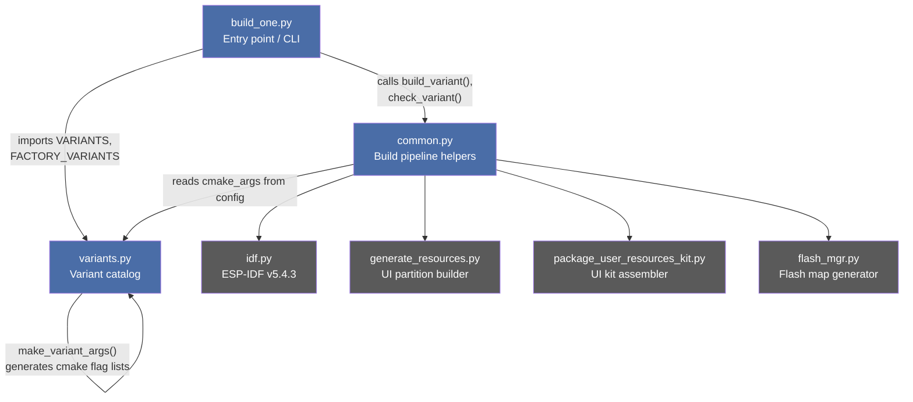
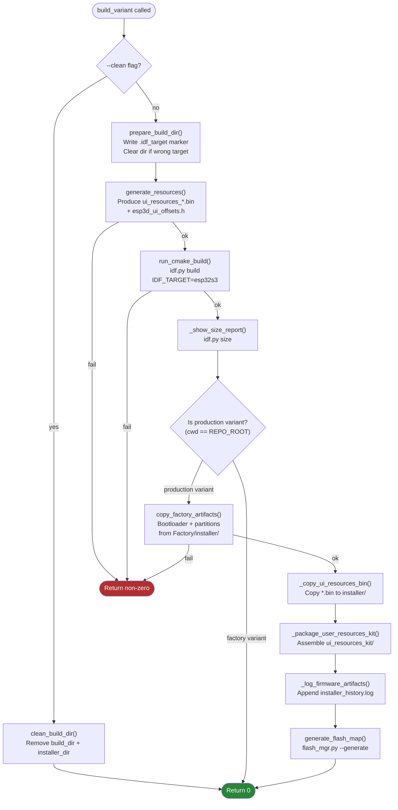
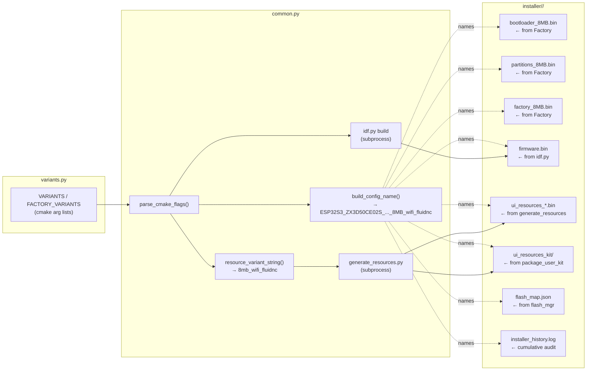
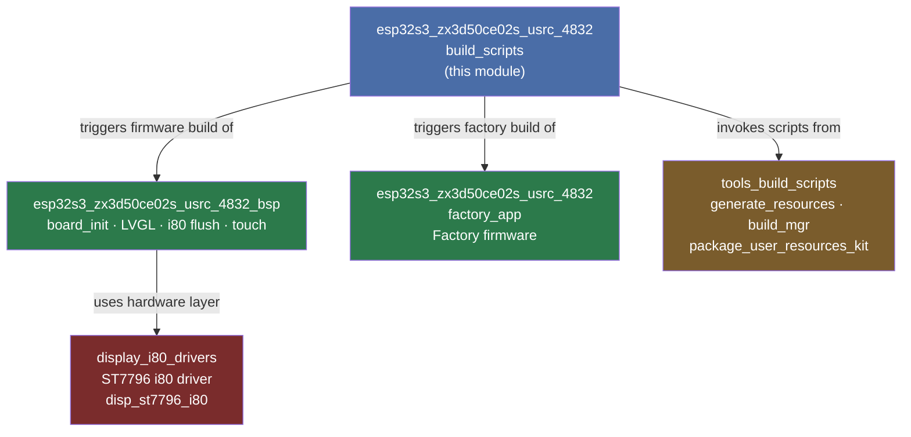

# ESP32-S3 ZX3D50CE02S USRC 4832 — Build Scripts

## Introduction

The `esp32s3_zx3d50ce02s_usrc_4832_build_scripts` module provides the Python-based build automation layer for the **ESP32-S3 ZX3D50CE02S USRC 4832** board — a 480×320 display panel driven through the Intel 8080 (i80) parallel bus with an ST7796 controller. Located under `boards/esp32s3_zx3d50ce02s_usrc_4832/build_scripts/`, the three scripts wrap ESP-IDF's `idf.py` to automate the complete multi-step firmware variant pipeline: CMake configuration, UI-resource partition generation, factory-artifact injection, installer packaging, and flash-map creation.

The three-file layout mirrors every other board's build scripts in the repository (e.g. `esp32s3_hmi43v3`, `pibot_pendant_v1_0`, `esp32s3_8048s070c`). Shared global tooling lives in [`tools_build_scripts`](tools_build_scripts.md). The companion runtime modules for this board are documented in [`esp32s3_zx3d50ce02s_usrc_4832_bsp`](esp32s3_zx3d50ce02s_usrc_4832_bsp.md) and [`esp32s3_zx3d50ce02s_usrc_4832_factory_app`](esp32s3_zx3d50ce02s_usrc_4832_factory_app.md).

---

## Module Architecture



### File Responsibilities

| File | Role | Key symbols |
|---|---|---|
| `build_one.py` | CLI entry point — resolves a variant name, delegates to helpers | `main()` |
| `common.py` | Stateless helpers implementing the complete build pipeline | `build_variant()`, `check_variant()` |
| `variants.py` | Declarative catalog of all valid firmware configurations for this board | `VARIANTS`, `FACTORY_VARIANTS`, `make_variant_args()` |

---

## Component Reference

### `variants.py` — Variant Catalog

#### `make_variant_args(*on_flags)`

Generates a deterministic, reproducible list of CMake `-D` arguments for a single variant. The function starts from `DEFAULT_OFF_CMAKE_ARGS` — every recognized CMake option set to `OFF`, derived from the exhaustive `ROOT_CMAKE_OPTIONS` list — then appends `-D <flag>` for each explicitly requested entry in `on_flags`.

This **all-OFF-then-selective-ON** approach prevents stale cache values from bleeding between variants that share a build directory, and makes each variant's configuration fully self-describing.

```python
# Conceptual output of make_variant_args for the wifi/FluidNC variant:
# ["-D", "ESP32_PIBOT_CNC_PENDANT_V1=OFF", "-D", "DLC32_MAX_LCD=OFF", ...,
#  "-D", "ESP32S3_ZX3D50CE02S_USRC_4832=ON", "-D", "MEMORY_8_MB=ON",
#  "-D", "TARGET_FW_FLUIDNC=ON", "-D", "WIFI_SERVICE=ON", ...]
```

`ROOT_CMAKE_OPTIONS` covers every toggle known to the firmware build system: board selection, flash memory size, PSRAM size, firmware target, transport services, and feature flags. Any option not explicitly set ON is forced OFF.

#### `VARIANTS` — Production Firmware Catalog

| Key | Flash | Transport | Firmware | Notable extra flags |
|---|---|---|---|---|
| `8mb_wifi_fluidnc` | 8 MB | WiFi (Socket Client) | FluidNC | `MDNS_SERVICE`, `LUA_INTERPRETER_SERVICE` |
| `8mb_serial_fluidnc` | 8 MB | Serial | FluidNC | _(minimal feature set)_ |
| `8mb_serial_grbl` | 8 MB | Serial | GRBL | _(minimal feature set)_ |
| `8mb_wifi_grblhal` | 8 MB | WiFi (Socket Client) | GrblHAL | `MDNS_SERVICE` |

All production variants enable `SERIAL_SERVICE`, `TFT_UI_SERVICE`, `TFT_TOUCH_SERVICE`, and `UPDATE_SERVICE`.

> **WiFi variants** use `SOCKET_CLIENT_SERVICE=ON` (TCP socket to the CNC controller) with no WebUI stack — consistent with the WiFi-as-CNC-transport model. The `cmake/sanity_check.cmake` enforces mutual exclusivity between `SOCKET_CLIENT_SERVICE` and WebUI services (`SSDP_SERVICE`, `WEBUI_SERVER`, `WS_SERVER_SERVICE`).

#### `FACTORY_VARIANTS` — Factory Firmware Catalog

| Key | Flash | Working directory |
|---|---|---|
| `factory_8mb` | 8 MB | `boards/esp32s3_zx3d50ce02s_usrc_4832/Factory/` |

The factory variant uses a dedicated working directory (`Factory/`) and build base (`Factory/build/`). Its output is collected under `Factory/installer/ESP3D-FACTORY_8MB/` and injected into production installer directories by `copy_factory_artifacts()` during each production build.

---

### `build_one.py` — CLI Entry Point

#### `main()`

Provides a minimal command-line interface for triggering a single named variant build. It merges `FACTORY_VARIANTS` and `VARIANTS` into one lookup dict, resolves the requested name, then delegates entirely to `build_variant()` or `check_variant()` from `common.py`.

**Usage:**
```bash
python build_one.py <variant_name> [--clean] [--check]

# Examples
python build_one.py 8mb_wifi_fluidnc
python build_one.py 8mb_serial_grbl --clean
python build_one.py 8mb_wifi_grblhal --check

# List all available variants
python build_one.py
```

**Supported modes:**

| Flag | Behavior |
|---|---|
| _(none)_ | Full pipeline — configure, generate resources, compile, package |
| `--clean` | Wipe build dir and installer dir, then exit (no rebuild) |
| `--check` | CMake `reconfigure` only — validates all flags without compiling |

The process exit code is the return value of the delegated function (0 = success).

---

### `common.py` — Build Pipeline Helpers

#### `check_variant(config)`

Runs `idf.py reconfigure` (CMake configure pass only) to validate that a variant's CMake flags are coherent and that all ESP-IDF sanity checks pass — without producing any binaries. Returns 0 on success.

#### `build_variant(config)`

Orchestrates the complete build pipeline for a single variant. Returns 0 on success, non-zero on any failure.



---

#### Pipeline Step Details

##### `prepare_build_dir(build_dir)` / `_ensure_clean_build_dir(build_dir)`

Writes an `.idf_target` marker file (`esp32s3`) into the build directory. On every call it checks the cached target against `EXPECTED_IDF_TARGET = "esp32s3"`; if the directory was previously used for a different target, it is automatically wiped before the marker is refreshed. This prevents subtle CMake cache corruption when the same `build/` path is shared across board targets in the monorepo.

##### `generate_resources(cmake_args, build_dir)`

Calls `tools/build_scripts/generate_resources.py` with:
- `--variant` set to the resource variant string (e.g. `8mb_wifi_fluidnc`) derived by `resource_variant_string()`
- `--resolution res_480_320` — fixed board constant matching `RESOLUTION_SCREEN` in the board's CMake configuration
- `--partition-csv partitions_8mb.csv`
- `--out <build_dir>`
- `--board-resources boards/esp32s3_zx3d50ce02s_usrc_4832/resources/` (added only when that directory exists)

This step runs **before** the firmware compile so that `esp3d_ui_offsets.h` is present for the C++ compiler. See [display_i80_drivers](display_i80_drivers.md) for the underlying display hardware and [factory_update_actions_sd_flash](factory_update_actions_sd_flash.md) for the SD-card resource update workflow.

##### `run_cmake_build(cmake_args, cwd, build_dir)`

Invokes:
```
python idf.py -B <build_dir> <cmake_args> -D PROD_BUILD=ON build
```
with `IDF_TARGET=esp32s3` injected into the environment. `PROD_BUILD=ON` is added unless `--dev` is passed on the command line. Parallel degree is controlled via `CMAKE_BUILD_PARALLEL_LEVEL` when `--jobs=N` is forwarded from `build_mgr.py` (idf.py has no native `-j` flag).

##### `copy_factory_artifacts(cmake_args)`

For 8 MB production variants, copies the factory-built binaries (bootloader, partition table, factory app) from `Factory/installer/ESP3D-FACTORY_8MB/` to the variant's installer directory.

**Completeness check**: an empty installer directory (which CMake's `file(MAKE_DIRECTORY)` can create during its configure phase) is treated the same as a missing one — only a directory containing at least one `bootloader_*.bin` is considered complete. If the artifacts are absent or incomplete, `_build_missing_factory()` triggers an automatic in-process rebuild of the factory variant before continuing.

> `size_report.txt` is explicitly excluded from the copy: the factory app's size report must not overwrite the production variant's own report, which `build_mgr.py` writes separately.

##### `_copy_ui_resources_bin(build_dir, installer_dir)`

Copies every `ui_resources_*.bin` produced by `generate_resources()` from the build directory into the installer directory, making it available alongside the firmware for flashing.

##### `_package_user_resources_kit(cmake_args, build_dir, installer_dir)`

Invokes `tools/build_scripts/package_user_resources_kit.py` to assemble a standalone `ui_resources_kit/` directory inside the installer. This self-contained kit lets end users customize icons, fonts, and theme colors without the full repository.

##### `generate_flash_map(config)`

Calls `tools/flash_scripts/flash_mgr.py --generate` for the installer directory, optionally supplying `flash_params.json` from the board root. The resulting flash-layout JSON is consumed by the flashing tooling.

---

#### Supporting Helpers

| Function | Purpose |
|---|---|
| `build_config_name(cmake_args)` | Derives the installer subdirectory name (e.g. `ESP32S3_ZX3D50CE02S_USRC_4832_8MB_wifi_fluidnc`) from CMake flags |
| `resource_variant_string(cmake_args)` | Derives the `--variant` string for `generate_resources.py` (e.g. `8mb_wifi_fluidnc`) |
| `installer_dir_for(config)` | Returns the absolute installer output path for a config dict |
| `parse_cmake_flags(cmake_args)` | Parses `-D KEY=VAL` pairs from a cmake args list into a `{KEY: VAL}` dict |
| `clean_build_dir(build_dir)` | Recursively removes a build directory, printing what was removed |
| `ensure_idf_py()` | Aborts with a clear message if `idf.py` is not found at `IDF_PATH` |
| `_show_size_report(build_dir, cwd)` | Runs `idf.py size` for human-readable ELF section sizes after a successful build |
| `_log_firmware_artifacts(...)` | Appends a timestamped `FACTORY` / `FIRMWARE` entry to `installer_history.log` |
| `_build_missing_factory(source_dir)` | Automatically rebuilds the factory variant whose output feeds `source_dir` |
| `_factory_artifacts_complete(source_dir)` | Returns `True` only when `source_dir` contains at least one `bootloader_*.bin` |

---

## Variant Naming Convention

All identifiers — the variant key in `VARIANTS`, the installer subdirectory name, the resource variant string, and the build directory name — follow the same structured pattern:

```
8mb_wifi_fluidnc
│   │    └── CNC firmware:  fluidnc | grblhal | grbl
│   └──────── Transport:    wifi | serial | bt_serial | bt_ble | bt
└──────────── Flash size:   8mb
```

`build_config_name()` and `resource_variant_string()` both derive their output from the same CMake flags, keeping all four identifiers in sync automatically.

---

## Data Flow: Flags → Installer Artifacts



---

## Directory Layout

```
boards/esp32s3_zx3d50ce02s_usrc_4832/
├── build_scripts/
│   ├── build_one.py              ← CLI entry point
│   ├── common.py                 ← Build pipeline helpers
│   └── variants.py               ← Variant catalog
├── Factory/
│   ├── build/
│   │   └── factory_8mb/          ← Factory build artifacts (idf.py output)
│   └── installer/
│       └── ESP3D-FACTORY_8MB/    ← bootloader_8MB.bin, partitions_8MB.bin,
│                                    factory_8MB.bin  (consumed by production builds)
└── resources/                    ← (optional) Board-specific UI icon/font overrides

build/                            ← Repo-root build tree (gitignored)
└── esp32s3_zx3d50ce02s_usrc_4832_8mb_wifi_fluidnc/
    ├── .idf_target               ← "esp32s3" target marker
    ├── ui_resources_*.bin
    └── ui_resources_manifest_*.json

installer/                        ← Repo-root installer packages (gitignored)
└── ESP32S3_ZX3D50CE02S_USRC_4832_8MB_wifi_fluidnc/
    ├── bootloader_8MB.bin
    ├── partitions_8MB.bin
    ├── factory_8MB.bin
    ├── firmware.bin
    ├── ui_resources_*.bin
    ├── ui_resources_kit/
    ├── flash_map.json
    └── installer_history.log
```

---

## Usage Guide

### Prerequisites

- ESP-IDF v5.4.3 installed; `IDF_PATH` environment variable pointing to it (default `C:\Users\luc\esp\v5.4.3\esp-idf`).
- Python 3.x available as `python` or `python3`.
- The factory variant must have been built at least once before building any production variant, or `build_variant()` will trigger it automatically.

### Build a single variant

```bash
cd boards/esp32s3_zx3d50ce02s_usrc_4832/build_scripts

# Full build
python build_one.py 8mb_wifi_fluidnc

# Wipe build and installer dirs, then exit (no rebuild)
python build_one.py 8mb_wifi_fluidnc --clean

# CMake configure check only — no binary output
python build_one.py 8mb_wifi_fluidnc --check

# List all available variants
python build_one.py
```

### Build all variants via the global manager

```bash
# From repo root
python tools/build_scripts/build_mgr.py --board esp32s3_zx3d50ce02s_usrc_4832
```

### Parallel compilation

Pass `--jobs=N` (forwarded by `build_mgr.py`) to control `CMAKE_BUILD_PARALLEL_LEVEL`:

```bash
python build_one.py 8mb_wifi_fluidnc --jobs=8
```

### Development builds (skip PROD_BUILD)

```bash
python build_one.py 8mb_serial_fluidnc --dev
```

---

## Relationship to Other Modules



- **[`esp32s3_zx3d50ce02s_usrc_4832_bsp`](esp32s3_zx3d50ce02s_usrc_4832_bsp.md)**: The Board Support Package compiled by production variants. Provides `board_init()`, LVGL integration, i80 flush-ready callback (`i80_flush_ready_cb`), and touch controller initialization (`init_touch_controller`).

- **[`esp32s3_zx3d50ce02s_usrc_4832_factory_app`](esp32s3_zx3d50ce02s_usrc_4832_factory_app.md)**: The factory firmware compiled by `FACTORY_VARIANTS`. Its installer output (`ESP3D-FACTORY_8MB/`) is consumed by `copy_factory_artifacts()` during every production build.

- **[`tools_build_scripts`](tools_build_scripts.md)** *(sibling module)*: Hosts `generate_resources.py`, `package_user_resources_kit.py`, `build_mgr.py`, and the flash tooling that `common.py` invokes as subprocesses. Other board build scripts (e.g. [`esp32s3_hmi43v3_build_scripts`](esp32s3_hmi43v3_build_scripts.md), [`esp32s3_8048s070c_build_scripts`](esp32s3_8048s070c_build_scripts.md)) follow the same pattern.

- **[`display_i80_drivers`](display_i80_drivers.md)**: Provides the `disp_st7796_i80` hardware driver — the key differentiator of this board vs. SPI-bus panels (e.g. [`esp32_3248s035r`](esp32_3248s035r_build_scripts.md), which uses SPI ST7796) or RGB parallel panels (e.g. [`esp32s3_8048s043c`](esp32s3_8048s043c_build_scripts.md), which uses ST7262).

---

## Key Design Decisions

### All-OFF flag baseline

`make_variant_args()` forces every known CMake option to `OFF` before enabling the requested subset. Each variant dict is therefore fully self-describing: adding or removing a global option never silently changes an existing variant's behavior, and the resulting `cmake_args` list is the single source of truth for what gets compiled into the binary.

### Automatic factory rebuild

`copy_factory_artifacts()` tests artifact completeness before copying. An empty installer directory (which CMake's `file(MAKE_DIRECTORY)` can create during its configure phase) is treated as absent — a directory without a `bootloader_*.bin` is considered incomplete. If the factory build is missing or partial, it is rebuilt in-process before the production build continues, making fresh-checkout and post-clean builds fully self-healing without manual steps.

### IDF_TARGET isolation via `.idf_target` marker

The `.idf_target` file in each build directory guards against running a build for the wrong `IDF_TARGET`. If the cached value differs from `esp32s3`, the directory is wiped automatically. This is important in a monorepo that hosts boards targeting `esp32`, `esp32s3`, and `esp32c3` — a mismatch would otherwise produce a silently incorrect binary.

### UI resources generated before firmware compile

`generate_resources()` runs before `run_cmake_build()`. This ensures `esp3d_ui_offsets.h` (containing flash partition offsets for the UI resource data) exists before the C++ compiler processes any source file that includes it, avoiding header-not-found errors on clean builds.

### `size_report.txt` exclusion during factory artifact copy

When `copy_factory_artifacts()` copies from the factory installer directory, it explicitly skips `size_report.txt`. The factory app's size report must not overwrite the production variant's own report, which `build_mgr.py` writes separately after the main build completes.

### Isolated build directory per variant

Each variant gets its own build directory (e.g. `build/esp32s3_zx3d50ce02s_usrc_4832_8mb_wifi_fluidnc/`). This allows all variants to coexist and be rebuilt independently without CMake cache conflicts, at the cost of additional disk space compared to a shared build directory.
