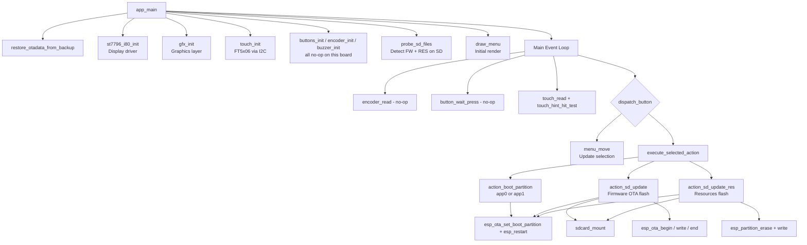
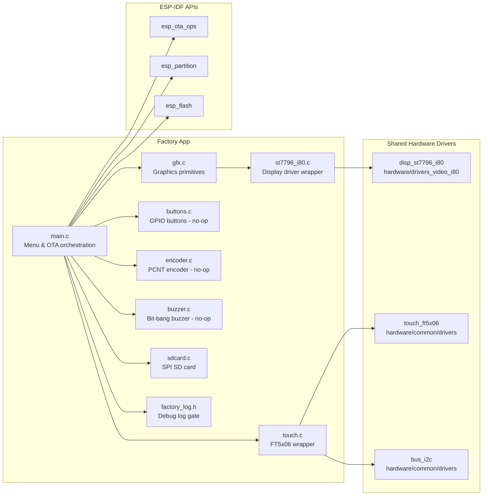
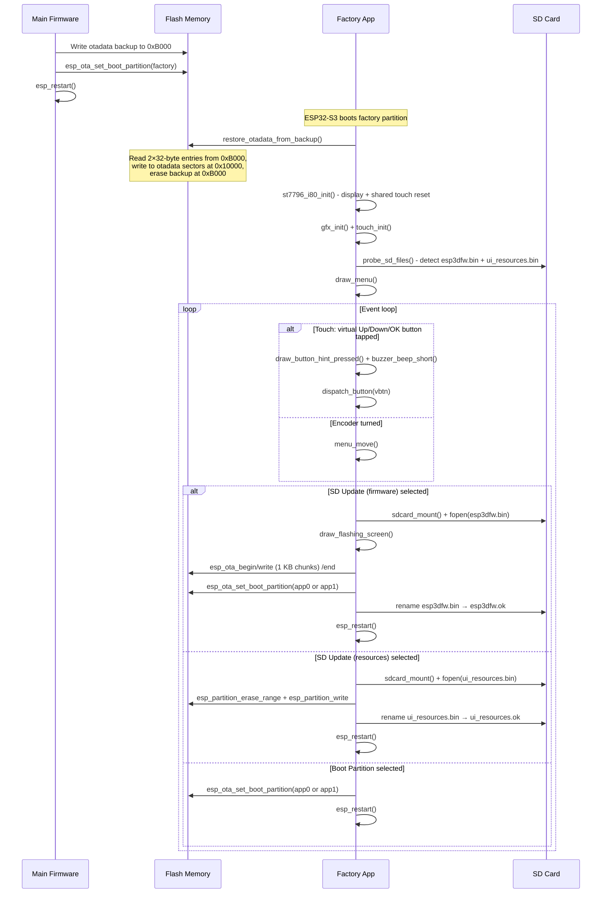

# esp32s3_zx3d50ce02s_usrc_4832_factory_app

## Introduction

The `esp32s3_zx3d50ce02s_usrc_4832_factory_app` is the **factory/recovery firmware** for the **ESP32-S3 ZX3D50CE02S-USRC-4832** board — a 480×320 display module driven over the 8080/i80 parallel bus (ST7796 panel) with an FT5x06 capacitive touch controller on I2C.

This application runs from the **factory partition** (a dedicated, protected OTA slot) and provides a minimal, self-contained recovery environment. Unlike most other boards in the Board Support Package collection, **this board has no physical buttons, no rotary encoder, and no buzzer** (all these pins are `GPIO_NUM_NC`). Navigation is entirely touch-based through three virtual on-screen buttons drawn at the bottom of the screen. All drivers silently no-op when their pins are `GPIO_NUM_NC`, so the code structure stays identical to physically-equipped boards.

### Purpose

| Goal | Mechanism |
|------|-----------|
| **OTA restore on startup** | Reads backup at flash offset `0xB000`, writes back to `otadata` at `0x10000`, then erases the backup so it only runs once |
| **Firmware update** | Flashes `esp3dfw.bin` from SD card to `app0` or `app1` using `esp_ota_begin/write/end` |
| **Resources update** | Flashes `ui_resources.bin` from SD card directly to the `ui_resources` data partition |
| **Boot selection** | Calls `esp_ota_set_boot_partition()` and `esp_restart()` to select `app0` or `app1` |

### Board-Specific Notes

- **Entry**: Exclusively via the software `[ESP444]FACTORY` command sent from the main firmware — no physical reset-hold button exists.
- **No custom bootloader**: `ENABLE_CUSTOM_BOOT_LOADER` is disabled. The main firmware's `esp444.cpp` handles the `otadata` backup and partition switch itself.
- **Shared reset line**: `TFT_RST_PIN` physically resets both the ST7796 panel and the FT5x06 touch controller. `touch_init()` **must** run after `st7796_i80_init()` — not before.
- **i80 async transfers**: Unlike SPI or RGB-parallel boards, the ST7796 i80 driver uses a DMA-style transfer queue. A binary semaphore synchronizes the GFX layer with the panel's flush-complete ISR callback.

---

## Architecture Overview

The factory app is a **bare-metal ESP-IDF application** — no LVGL, no OS abstraction beyond FreeRTOS primitives. A custom lightweight graphics library (`gfx`) backed directly by the ST7796 i80 panel driver renders a touch-navigable menu. An OTA helper manages firmware and resource flashing from the SD card.



### Component Interaction Diagram



---

## Sub-Modules

### 1. Main Application Logic
**→ [`esp32s3_zx3d50ce02s_usrc_4832_factory_app_main.md`](esp32s3_zx3d50ce02s_usrc_4832_factory_app_main.md)**

Orchestrates the entire recovery session:
- `app_main()` — init sequence, partition detection, menu build, event loop
- `restore_otadata_from_backup()` — restores OTA state from flash backup on startup
- `action_boot_partition()` / `action_sd_update()` / `action_sd_update_res()` — menu action handlers with progress display
- Full menu rendering: `draw_menu`, `draw_menu_item`, `draw_header`, `draw_footer_zone`, pixel-art virtual button icons
- Touch hit-test for the virtual button bar: `touch_hint_hit_test()`
- Optional snapshot subsystem (`snapshot_take`, `snapshot_check`) gated by `ENABLE_SNAPSHOT`
- `factory_log.h` — compile-time `FACTORY_LOGD` gate and SD stack silencer (`factory_log_silence_sd_stack`)

### 2. Display
**→ [`esp32s3_zx3d50ce02s_usrc_4832_factory_app_esp32s3_zx3d50ce02s_usrc_4832_factory_app_display.md`](esp32s3_zx3d50ce02s_usrc_4832_factory_app_display.md)**

All graphics primitives and the ST7796 i80 hardware interface:
- `gfx.c` — framebuffer-less line-buffer renderer: clear, fill, horizontal/vertical lines, rectangles, 8×16 bitmap text, optional `.raw` snapshot capture to SD card
- `st7796_i80.c` — thin wrapper over the shared `disp_st7796_i80` component; binary semaphore for async transfer sync; per-row byte-swap (GFX big-endian → panel native order) into a static `scratch[]` buffer

### 3. Input
**→ [`esp32s3_zx3d50ce02s_usrc_4832_factory_app_esp32s3_zx3d50ce02s_usrc_4832_factory_app_input.md`](esp32s3_zx3d50ce02s_usrc_4832_factory_app_input.md)**

All physical and virtual input sources — all gracefully no-op on this board:
- `buttons.c` — GPIO polling with 50 ms debounce; skips `gpio_config()` if all pins are `GPIO_NUM_NC`
- `encoder.c` — PCNT-based quadrature decoder (4 pulses/detent, ±1000 limit, 1000 ns glitch filter); skips PCNT init when encoder pins are `GPIO_NUM_NC`
- `touch.c` / `touch.h` — FT5x06 I2C polling wrapper; fixed `TOUCH_X_MAX`/`TOUCH_Y_MAX`; coordinates rescaled to screen pixels; no independent reset (shared `TFT_RST_PIN`)
- `buzzer.c` — bit-bang square-wave at 2700 Hz / 40 ms using `esp_rom_delay_us`; skips `gpio_config()` when buzzer pin is `GPIO_NUM_NC`

### 4. Storage
**→ [`esp32s3_zx3d50ce02s_usrc_4832_factory_app_esp32s3_zx3d50ce02s_usrc_4832_factory_app_storage.md`](esp32s3_zx3d50ce02s_usrc_4832_factory_app_storage.md)**

SPI SD card access for firmware and resource files:
- `sdcard.c` — mounts SD via `esp_vfs_fat_sdspi_mount()` at `/sdcard`; retains SPI bus across unmount cycles; idempotent mount (returns `ESP_OK` if already mounted)

### 5. Development Tools
**→ [`esp32s3_zx3d50ce02s_usrc_4832_factory_app_esp32s3_zx3d50ce02s_usrc_4832_factory_app_tools.md`](esp32s3_zx3d50ce02s_usrc_4832_factory_app_tools.md)**

Python utilities for manufacturing and development:
- `flash_all.py` — full-board flashing (`--recovery` / `--full` / `--fw` modes); auto-detects port and factory offset from CSV
- `flash_factory.py` — single-partition factory flash with CSV auto-detection
- `generate_font/generate_font.py` — bitmap font C-source generator (Pillow-based, TTF → `font8x16.c/.h`)
- `raw2png/snap2png.py` — converts `.raw` RGB565 snapshot files to PNG for visual inspection

---

## Startup & OTA Flow



---

## Screen Layout

The factory app uses the embedded 8×16 bitmap font on a 480×320 canvas divided into fixed zones:

```
┌──────────────────────────────────────────────────────┐  y=0
│             Recovery v<VERSION>  (CYAN)              │  y=13
│  ──────────────────────────────────────────────────  │  y=40
│  Active: app0 (default)           (YELLOW)           │  y=45
│  SD: FW RES                       (indicators)       │  y=68
│  ──────────────────────────────────────────────────  │  y=88
│                                                      │
│  ┌──────────────────────────────────────────────┐   │  y=94
│  │  Boot app0                   (WHITE)         │   │
│  │► SD -> app0     ◄ selected   (BLUE BOX)      │   │  +34 px each
│  │  SD -> app1                  (GREEN)         │   │
│  │  SD -> resources             (CYAN)          │   │
│  └──────────────────────────────────────────────┘   │
│                                                      │
│  ──────────────────────────────────────────────────  │  STATUS_Y-7
│         Power off to cancel                          │  STATUS_Y
│  ──────────────────────────────────────────────────  │  BTN_HINT_BASE_Y
│      ○↑ (BLUE)    ○↓ (BLUE)    ○✓ (GREEN)           │  y = BTN_HINT_CY
└──────────────────────────────────────────────────────┘  y=320
```

Virtual button hit zones are split at the midpoints between the three icon centers (`BTN_HINT_CX1` = center−100, `BTN_HINT_CX2` = center, `BTN_HINT_CX3` = center+100), not by equal screen-width thirds.

---

## Flash Memory Map (This Board)

```
Offset     Size      Contents
─────────  ────────  ─────────────────────────────────────────────────────
0x00000    48 KB     Bootloader (standard ESP-IDF, no custom hooks)
0x0B000     4 KB     otadata BACKUP  ← written by main fw, restored+erased here
0x0C000     4 KB     Partition table
0x10000     8 KB     otadata (2 × 4 KB sectors, one per OTA slot)
0x20000    ~6.5 MB   app0  (main firmware, primary OTA slot)
  ...
0x7A0000   ~384 KB   factory  (this recovery application)
  ...                ui_resources  (data partition, size board-specific)
```

> **Critical**: `OTADATA_BACKUP_OFFSET` (`0xB000`) must match the value in the main firmware's `esp444.cpp`. Direct flash access below the partition table (`0x0C000`) requires `CONFIG_SPI_FLASH_DANGEROUS_WRITE_ALLOWED=y` in the factory `sdkconfig` — intentional for this privileged recovery tool.

---

## Build Configuration

| CMake Option | Default | Effect |
|---|---|---|
| `ENABLE_FACTORY_DEBUG_LOG` | OFF | ON maps `FACTORY_LOGD` to `ESP_LOGI`; OFF applies `sdkconfig.prod_log` to suppress ESP-IDF internal logs that fire before `app_main()` |
| `ENABLE_SNAPSHOT` | OFF | ON enables GPIO0-triggered raw RGB565 screen capture to SD (development / QA only) |
| `ENABLE_CUSTOM_BOOT_LOADER` | OFF | **Stays OFF** — no physical boot button on this board |

---

## Key Design Decisions

| Decision | Rationale |
|----------|-----------|
| No LVGL | Keeps the factory partition small and self-contained; avoids the full LVGL init chain |
| Custom `gfx` layer | Line-buffer renderer with no per-frame heap allocation; same pattern as all other factory apps in the BSP |
| Touch-only navigation | `BUTTON_n_PIN`, `ENCODER_A/B_PIN`, `BUZZER_PIN` are all `GPIO_NUM_NC`; three virtual buttons drawn in the bottom bar replace physical controls |
| Software-only factory entry | No custom bootloader hook (`ENABLE_CUSTOM_BOOT_LOADER=OFF`); main firmware's `esp444.cpp` handles backup + partition switch |
| SPI bus retained across unmounts | `sdcard_unmount()` does not free the SPI bus to avoid interfering with other SPI peripherals; reused transparently on next mount |
| Fixed touch max coordinates | `TOUCH_X_MAX`/`TOUCH_Y_MAX` are fixed constants rather than auto-detected; the FT5x06 auto-detect returns bogus values on sister board `esp32s3_hmi43v3` |
| Semaphore for i80 async sync | Binary semaphore starts pre-given; first flush proceeds immediately; each subsequent flush waits for the prior DMA callback before overwriting the static `scratch[]` buffer |

---

## Related Documentation

| Document | Relationship |
|----------|-------------|
| [`esp32s3_zx3d50ce02s_usrc_4832_bsp.md`](esp32s3_zx3d50ce02s_usrc_4832_bsp.md) | Main firmware BSP for this board (LVGL, `board_init`, control events) |
| [`esp32s3_zx3d50ce02s_usrc_4832_build_scripts.md`](esp32s3_zx3d50ce02s_usrc_4832_build_scripts.md) | Variant build automation scripts |
| [`display_i80_drivers.md`](display_i80_drivers.md) | Shared `disp_st7796_i80` hardware component consumed by `st7796_i80.c` |
| [`touch_drivers.md`](touch_drivers.md) | Shared `touch_ft5x06` hardware component consumed by `touch.c` |
| [`pibot_pendant_v1_0_factory_app.md`](pibot_pendant_v1_0_factory_app.md) | Reference design this factory app derives from (ILI9341 SPI, physical buttons/encoder/buzzer) |
| [`esp32s3_hmi43v3_factory_app.md`](esp32s3_hmi43v3_factory_app.md) | Sister board: same i80 bus topology, different panel (RM68120) and independent reset (TCA9554 IO expander) |
| [`esp32s3_bzm_tft35_gt911_factory_app.md`](esp32s3_bzm_tft35_gt911_factory_app.md) | Similar layout: ST7796 panel, GT911 touch |


## Documents lies (deep dive)

- [esp32s3_zx3d50ce02s_usrc_4832_factory_app_flash_tools](esp32s3_zx3d50ce02s_usrc_4832_factory_app_flash_tools.md)
- [esp32s3_zx3d50ce02s_usrc_4832_factory_app_recovery](esp32s3_zx3d50ce02s_usrc_4832_factory_app_recovery.md)


## Documents de conception (depot)

- [factory_app_technical_doc.md](https://github.com/luc-github/Pibot-cnc-pendant-firmware/blob/main/docs/Factory/factory_app_technical_doc.md)
