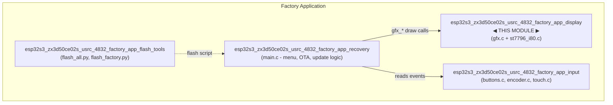
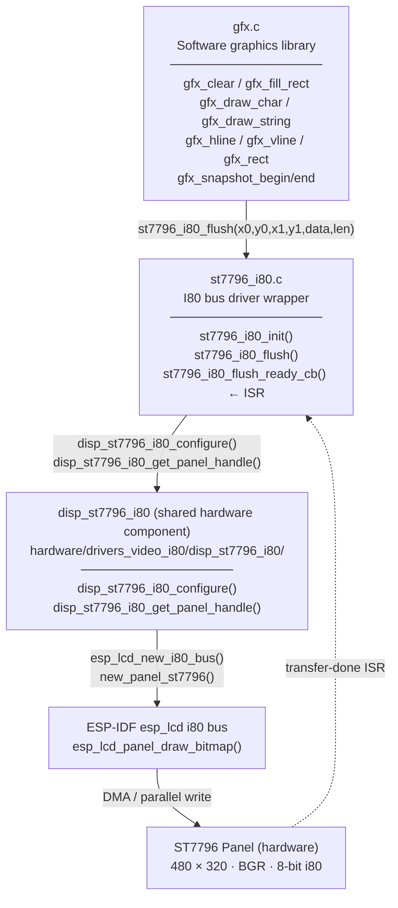
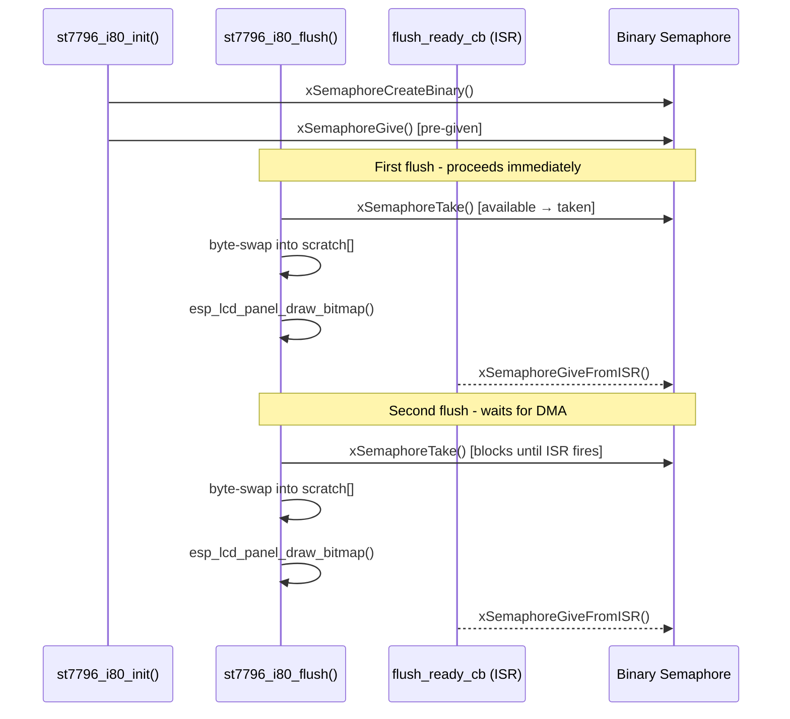
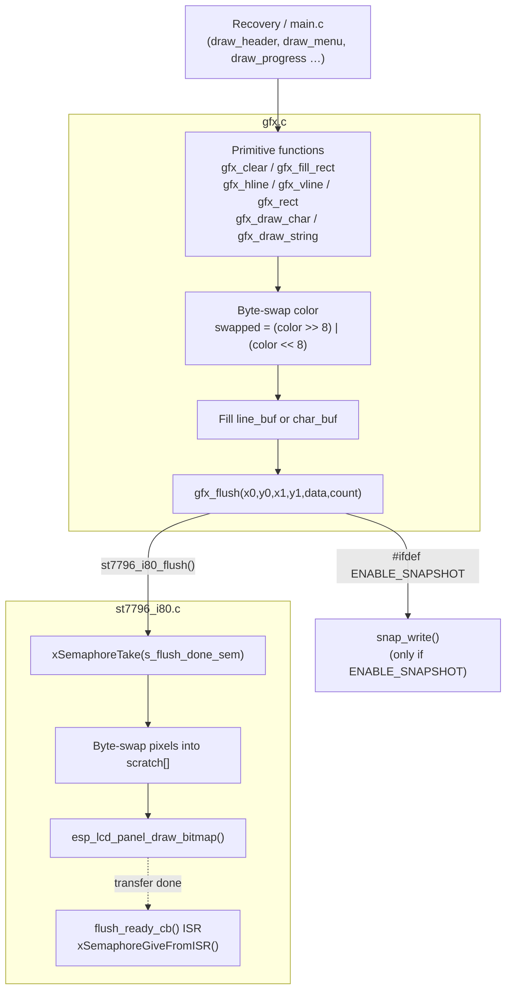
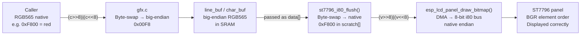
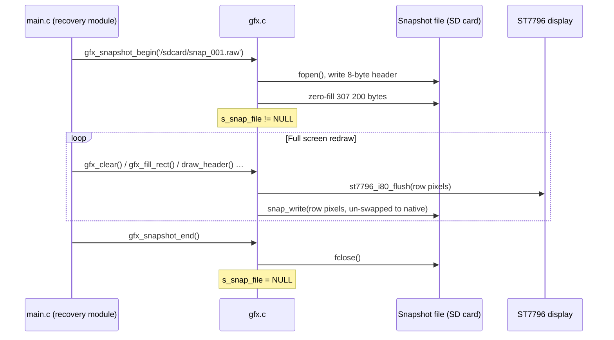
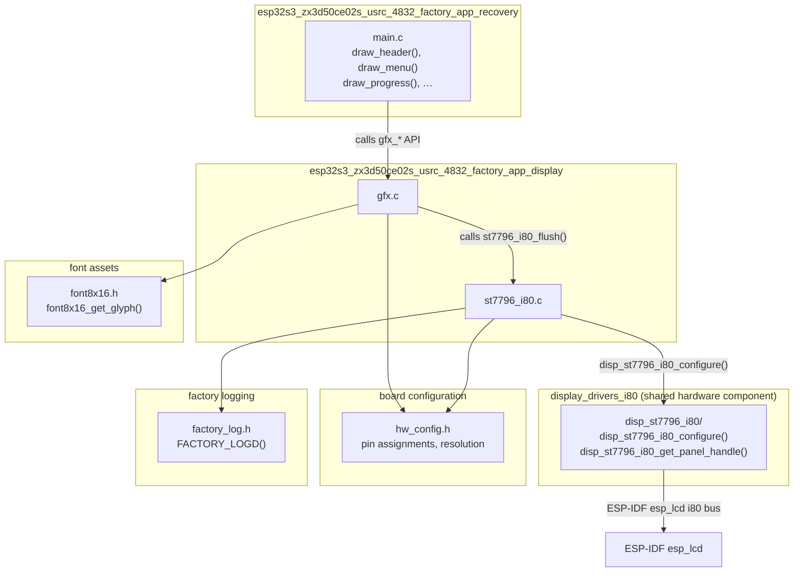
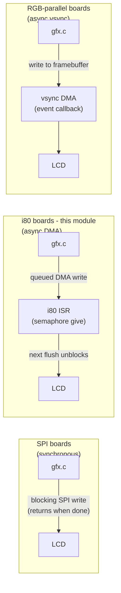

# esp32s3_zx3d50ce02s_usrc_4832_factory_app_display

Display subsystem for the ESP32-S3 ZX3D50CE02S USRC 4832 factory application. This module owns the complete rendering stack used during factory-test and firmware-recovery: an ST7796 controller driven over an 8-bit Intel 8080 (i80) parallel bus, fronted by a lightweight software graphics library. It is one of four sibling modules that together form the full factory application for this board — see [`esp32s3_zx3d50ce02s_usrc_4832_factory_app_recovery`](esp32s3_zx3d50ce02s_usrc_4832_factory_app_recovery.md) for the recovery/menu logic that calls into this layer.

---

## Table of Contents

1. [Module Overview](#1-module-overview)
2. [Architecture](#2-architecture)
3. [Component: ST7796 I80 Driver (`st7796_i80.c`)](#3-component-st7796-i80-driver-st7796_i80c)
4. [Component: GFX Graphics Library (`gfx.c`)](#4-component-gfx-graphics-library-gfxc)
5. [Data Flow](#5-data-flow)
6. [Snapshot Subsystem](#6-snapshot-subsystem)
7. [Configuration Reference](#7-configuration-reference)
8. [Inter-Module Dependencies](#8-inter-module-dependencies)
9. [Comparison with Peer Display Modules](#9-comparison-with-peer-display-modules)

---

## 1. Module Overview

| Property | Value |
|---|---|
| **Board** | ESP32-S3 · ZX3D50CE02S USRC 4832 |
| **Display controller** | ST7796 |
| **Bus interface** | 8-bit Intel 8080 (i80) parallel |
| **Resolution** | 480 × 320 px (landscape) |
| **Color format** | RGB565, BGR element order |
| **Wire endianness** | Big-endian (byte-swapped before transfer) |
| **Source files** | `boards/esp32s3_zx3d50ce02s_usrc_4832/Factory/main/st7796_i80.c` |
| | `boards/esp32s3_zx3d50ce02s_usrc_4832/Factory/main/gfx.c` |
| **Shared HW driver** | `hardware/drivers_video_i80/disp_st7796_i80/` |

### Design philosophy

The factory application does not use LVGL. Instead it uses a minimal, self-contained graphics stack with zero dynamic allocation and a tiny RAM footprint:

- A **static line buffer** (`line_buf[SCREEN_WIDTH]`) in `gfx.c` is reused for every row write.
- A **static scratch buffer** (`scratch[SCREEN_WIDTH]`) inside `st7796_i80_flush()` holds the byte-swapped row before DMA hand-off.
- A **binary semaphore** serialises back-to-back async transfers so neither buffer is overwritten while a DMA transaction is in flight.

---

## 2. Architecture

### 2.1 Module position in the factory application



### 2.2 Internal component stack



---

## 3. Component: ST7796 I80 Driver (`st7796_i80.c`)

### 3.1 Responsibilities

| Concern | Solution |
|---|---|
| Bus initialisation | Wraps `disp_st7796_i80_configure()` with board-specific pin and timing constants from `hw_config.h` |
| Async transfer sync | Binary semaphore — given at init, taken at every flush entry, given back from ISR |
| Byte order | `gfx.c` produces big-endian RGB565; this driver un-swaps to native endian before the DMA hand-off |
| Panel handle | Obtained once after `disp_st7796_i80_configure()` and cached in `s_panel` |

### 3.2 State variables

```c
static esp_lcd_panel_handle_t s_panel = NULL;
static SemaphoreHandle_t      s_flush_done_sem = NULL;
```

`s_panel` is valid after a successful `st7796_i80_init()`. `s_flush_done_sem` is a binary semaphore initialised to the *given* state so the very first flush never blocks.

### 3.3 Public API

#### `st7796_i80_init()`

```c
esp_err_t st7796_i80_init(void);
```

Performs one-time setup:

1. Creates the binary semaphore and pre-gives it.
2. Fills a `disp_st7796_i80_config_t` with the board's hardware constants:
   - **8-bit data bus** — pins `TFT_DATA_PIN_0 … TFT_DATA_PIN_7`; upper 8 `data_gpio_nums` slots padded with `-1`.
   - **Control pins** — `TFT_DC_PIN`, `TFT_WR_PIN`, `TFT_CS_PIN`, `TFT_RST_PIN`.
   - **Clock** — `TFT_PCLK_FREQ_HZ`; `trans_queue_depth = 10`.
   - **Panel** — BGR element order, 16 bpp, active-low reset, landscape orientation.
   - `max_transfer_bytes = SCREEN_WIDTH * 2` (one row at a time).
3. Calls `disp_st7796_i80_configure()` passing `st7796_i80_flush_ready_cb` as the completion ISR.
4. Retrieves the panel handle via `disp_st7796_i80_get_panel_handle()`.

Returns `ESP_OK` on success; `ESP_ERR_NO_MEM` if semaphore creation fails; `ESP_FAIL` if the panel handle is null.

#### `st7796_i80_flush()`

```c
void st7796_i80_flush(uint16_t x0, uint16_t y0,
                       uint16_t x1, uint16_t y1,
                       const uint16_t *data, size_t len);
```

Transfers one rectangular region (always one row in practice) to the panel:

1. **Takes** `s_flush_done_sem` — blocks until the previous DMA completes.
2. **Byte-swaps** up to `SCREEN_WIDTH` pixels from `data` into the static `scratch[]` buffer:
   `scratch[i] = (v >> 8) | (v << 8)` — converts big-endian RGB565 to native endian.
3. Calls `esp_lcd_panel_draw_bitmap()` with `scratch` as the source.

`len` is a **pixel count**, not a byte count. Clamped to `SCREEN_WIDTH` as a safety guard.

### 3.4 ISR callback

```c
static void IRAM_ATTR st7796_i80_flush_ready_cb(void);
```

Fired by the i80 bus driver when a DMA transfer completes. Calls `xSemaphoreGiveFromISR()` and issues `portYIELD_FROM_ISR()` if a higher-priority task was woken. Placed in IRAM (`IRAM_ATTR`) to satisfy ESP-IDF ISR placement requirements.

### 3.5 Semaphore lifecycle



---

## 4. Component: GFX Graphics Library (`gfx.c`)

### 4.1 Responsibilities

`gfx.c` is the sole drawing surface exposed to the rest of the factory application. It owns the shared row buffer, performs all clipping, handles byte-swapping at the colour-fill level, and optionally mirrors every write into a snapshot file on the SD card.

### 4.2 Internal state

```c
static uint16_t line_buf[SCREEN_WIDTH];   /* reused across every draw call */
```

All colour values stored in `line_buf` and in the per-call `char_buf` are pre-swapped to big-endian before being passed to `gfx_flush()`.

### 4.3 Internal flush wrapper

```c
static void gfx_flush(int x0, int y0, int x1, int y1,
                       const uint16_t *data, int count);
```

This is the **only path** through which pixels reach the hardware:

- Always calls `st7796_i80_flush()`.
- When `ENABLE_SNAPSHOT` is defined, also calls `snap_write()`.

### 4.4 Public API

All colour parameters are **native RGB565** values (callers do not byte-swap). The library handles endianness internally.

#### `gfx_init()`

```c
void gfx_init(void);
```

Currently a no-op. Snapshot state is managed on demand. Provided for API symmetry with peer board implementations.

#### `gfx_clear()`

```c
void gfx_clear(uint16_t color);
```

Fills the entire display with `color`. Byte-swaps the colour once, fills `line_buf` with that value, then sends the same row `SCREEN_HEIGHT` times.

#### `gfx_draw_char()`

```c
void gfx_draw_char(int x, int y, char c, uint16_t fg, uint16_t bg);
```

Renders a single character from the built-in 8 × 16 bitmap font (`font8x16`):

1. Clamps `c` to the printable range `[0x20, 0x7E]`; substitutes `'?'` otherwise.
2. Looks up the glyph via `font8x16_get_glyph(c)`.
3. Expands each bit into a `FONT_WIDTH × FONT_HEIGHT` local pixel buffer using pre-swapped `fg_swap`/`bg_swap` values.
4. Clips `x1`/`y1` to screen bounds and flushes the entire glyph in a single call.

#### `gfx_draw_string()`

```c
void gfx_draw_string(int x, int y, const char *str, uint16_t fg, uint16_t bg);
```

Calls `gfx_draw_char()` for each character, advancing `x` by `FONT_WIDTH`. Stops when `x + FONT_WIDTH > SCREEN_WIDTH`.

#### `gfx_hline()`

```c
void gfx_hline(int x, int y, int w, uint16_t color);
```

Draws a horizontal line. Clips to screen bounds, fills `line_buf[0..w-1]` with the swapped colour, flushes as a single row span.

#### `gfx_vline()`

```c
void gfx_vline(int x, int y, int h, uint16_t color);
```

Draws a vertical line. Each pixel is a separate single-pixel `gfx_flush()` call (one row per iteration).

#### `gfx_rect()`

```c
void gfx_rect(int x, int y, int w, int h, uint16_t color);
```

Draws a hollow rectangle using four line calls:

```c
gfx_hline(x,     y,     w, color);   // top
gfx_hline(x,     y+h-1, w, color);   // bottom
gfx_vline(x,     y,     h, color);   // left
gfx_vline(x+w-1, y,     h, color);   // right
```

#### `gfx_fill_rect()`

```c
void gfx_fill_rect(int x, int y, int w, int h, uint16_t color);
```

Fills a solid rectangle. After clipping, fills `line_buf[0..w-1]` once and flushes it `h` times (one call per row).

### 4.5 Draw call flow



---

## 5. Data Flow

### 5.1 Pixel colour through the stack

Each layer adds or removes a byte-swap. The net effect is that the ST7796 always receives native-endian RGB565 with BGR element order.



> **Why the double swap?** `gfx.c` follows the big-endian convention shared by every other board's `gfx.c` in this project (originally written for SPI panels). The i80 driver reverses the swap before the DMA hand-off. This keeps the graphics layer uniform across all boards while adapting at the transport layer.

### 5.2 Static buffer memory layout

```
SRAM: line_buf[SCREEN_WIDTH]       480 × uint16_t = 960 bytes  (static in gfx.c)
SRAM: scratch[SCREEN_WIDTH]        480 × uint16_t = 960 bytes  (static local in st7796_i80_flush)

Total static RAM for render buffers: 1 920 bytes
No dynamic allocation anywhere in the render path.
```

---

## 6. Snapshot Subsystem

When compiled with `-DENABLE_SNAPSHOT`, every pixel flushed to the display is also written to a raw binary file. This is used during factory testing to capture screen state without a physical camera.

### 6.1 File format

```
Offset       Size      Type          Description
──────       ────      ──────────    ──────────────────────────────────────────
0            4 bytes   uint32_t LE   Width in pixels  (= SCREEN_WIDTH)
4            4 bytes   uint32_t LE   Height in pixels (= SCREEN_HEIGHT)
8            W×H×2     uint16_t[]    Raw RGB565, native endian, row-major,
                                     top-left origin
```

Total file size: `8 + 480 × 320 × 2 = 307 208 bytes` (≈ 300 KB).

### 6.2 Public snapshot API

```c
bool gfx_snapshot_begin(const char *filepath);  // open file, write header, zero-fill pixel area
bool gfx_snapshot_end(void);                    // flush and close file
bool gfx_snapshot_is_capturing(void);           // true while file is open
```

`gfx_snapshot_begin()` pre-fills the entire pixel area with zeros so any un-drawn region appears as black rather than uninitialised data.

### 6.3 Internal `snap_write()`

```c
static void snap_write(int x0, int y0, int x1, int y1,
                        const uint16_t *data_swapped, int count);
```

Called from `gfx_flush()` for each row when a capture is active. Seeks to the correct file offset per row and un-swaps the incoming big-endian pixels back to native before writing:

```
file_offset = SNAP_HEADER_SIZE + (row × SCREEN_WIDTH + x0) × sizeof(uint16_t)
```

### 6.4 Snapshot capture sequence



---

## 7. Configuration Reference

All hardware-pin constants and display geometry are defined in `hw_config.h` (board-specific, not part of this module). The symbols consumed by this module are:

| Symbol | Used in | Meaning |
|---|---|---|
| `SCREEN_WIDTH` | `gfx.c`, `st7796_i80.c` | Horizontal resolution (480) |
| `SCREEN_HEIGHT` | `gfx.c` | Vertical resolution (320) |
| `TFT_DC_PIN` | `st7796_i80_init()` | Data/Command select GPIO |
| `TFT_WR_PIN` | `st7796_i80_init()` | Write-strobe GPIO |
| `TFT_CS_PIN` | `st7796_i80_init()` | Chip-select GPIO |
| `TFT_RST_PIN` | `st7796_i80_init()` | Reset GPIO |
| `TFT_DATA_PIN_0..7` | `st7796_i80_init()` | 8-bit parallel data bus GPIOs |
| `TFT_PCLK_FREQ_HZ` | `st7796_i80_init()` | i80 pixel-clock frequency |
| `FONT_WIDTH` | `gfx.c` | Glyph width in pixels (8) |
| `FONT_HEIGHT` | `gfx.c` | Glyph height in pixels (16) |
| `FONT_BYTES_PER_ROW` | `gfx.c` | Bytes per glyph row (1 for an 8-wide font) |
| `ENABLE_SNAPSHOT` | `gfx.c` (optional) | Compile-time flag to enable SD snapshot capture |

---

## 8. Inter-Module Dependencies

### 8.1 Dependency diagram



### 8.2 Runtime interface summary

| Caller | Function | Purpose |
|---|---|---|
| `main.c` (recovery module) | `gfx_init()` | One-time setup at boot |
| `main.c` | `gfx_clear()` | Blank screen between states |
| `main.c` | `gfx_fill_rect()` | Background regions, progress bars |
| `main.c` | `gfx_draw_string()` | Labels, status text |
| `main.c` | `gfx_rect()` | Menu item borders |
| `main.c` | `gfx_hline()` / `gfx_vline()` | Dividers, indicators |
| `main.c` | `gfx_snapshot_begin()` / `gfx_snapshot_end()` / `gfx_snapshot_is_capturing()` | Factory snapshot capture |
| `gfx.c` | `st7796_i80_init()` | Called once during board init |
| `gfx.c` | `st7796_i80_flush()` | Per-row pixel transfer |

---

## 9. Comparison with Peer Display Modules

The factory-application display layer follows the same two-file pattern (`gfx.c` + a panel driver wrapper) across all boards in this project. This board's implementation is distinguished by its **8-bit i80 parallel bus** and **async semaphore design**, which it shares in pattern with the HMI43v3 board (16-bit i80 RM68120 panel).

| Module | Controller | Bus | Byte-swap in driver | Async semaphore | Notes |
|---|---|---|---|---|---|
| **This module** (zx3d50ce02s) | ST7796 | 8-bit i80 | ✅ | ✅ binary semaphore | 8 data pins + 8 padding `-1`s; CS pin used; BGR order |
| [`esp32s3_hmi43v3_factory_app`](esp32s3_hmi43v3_factory_app.md) | RM68120 | 16-bit i80 | ✅ | ✅ (same ISR pattern) | 16-bit bus; no CS pin; RGB order |
| [`esp32s3_bzm_tft35_gt911_factory_app_display`](esp32s3_bzm_tft35_gt911_factory_app_display.md) | ST7796 | SPI | N/A | N/A | SPI transfers are synchronous |
| `esp32_3248s035r` / `esp32_3248s035c` | ST7796 | SPI | N/A | N/A | Same controller, SPI path |
| `esp32s3_8048s043c` / `esp32s3_8048s050c` | ST7262 | RGB parallel | N/A | ✅ vsync event | RGB panels use vsync callback, not transfer-done ISR |
| `esp32s3_4827s043c` | ILI9485 | RGB parallel | N/A | ✅ vsync event | Same vsync pattern as ST7262 boards |

### Bus-type comparison



For the shared hardware driver that backs this module, see the [`display_drivers_i80`](display_drivers_i80.md) module documentation.

---

*This module is part of the `esp32s3_zx3d50ce02s_usrc_4832_factory_app` group. For related subsystems, see:*
- *[`esp32s3_zx3d50ce02s_usrc_4832_factory_app_input`](esp32s3_zx3d50ce02s_usrc_4832_factory_app_input.md) — button, encoder, and touch input*
- *[`esp32s3_zx3d50ce02s_usrc_4832_factory_app_recovery`](esp32s3_zx3d50ce02s_usrc_4832_factory_app_recovery.md) — OTA recovery logic and menu system*
- *[`esp32s3_zx3d50ce02s_usrc_4832_factory_app_flash_tools`](esp32s3_zx3d50ce02s_usrc_4832_factory_app_flash_tools.md) — factory flash scripts*
- *[`display_drivers_i80`](display_drivers_i80.md) — shared ST7796 i80 and RM68120 hardware drivers*
