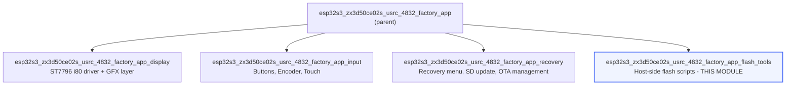
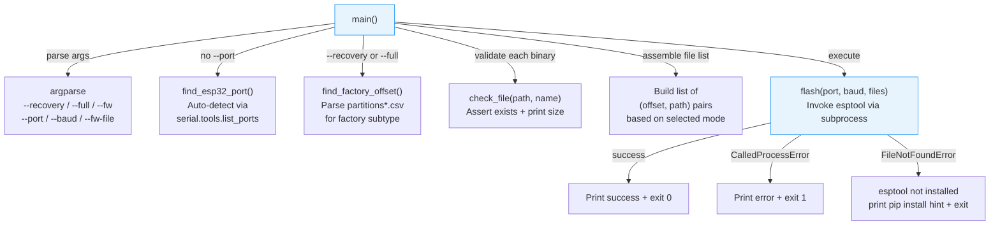
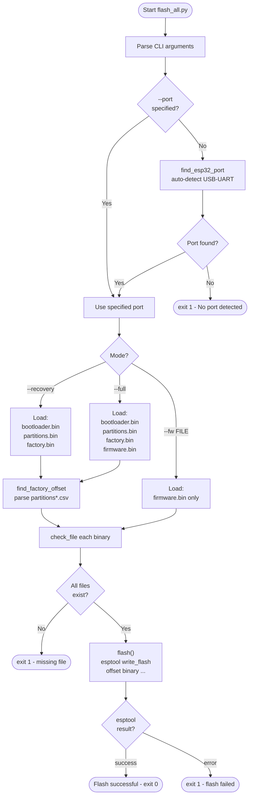
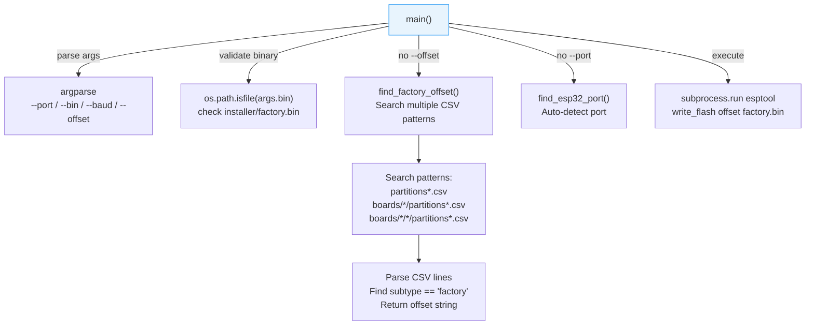
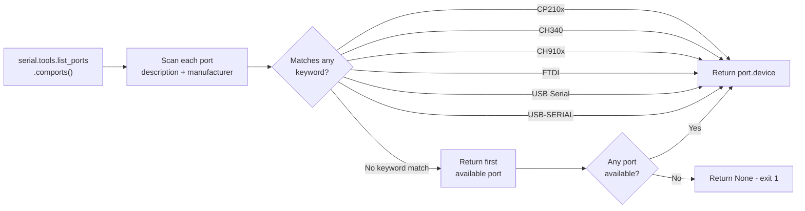
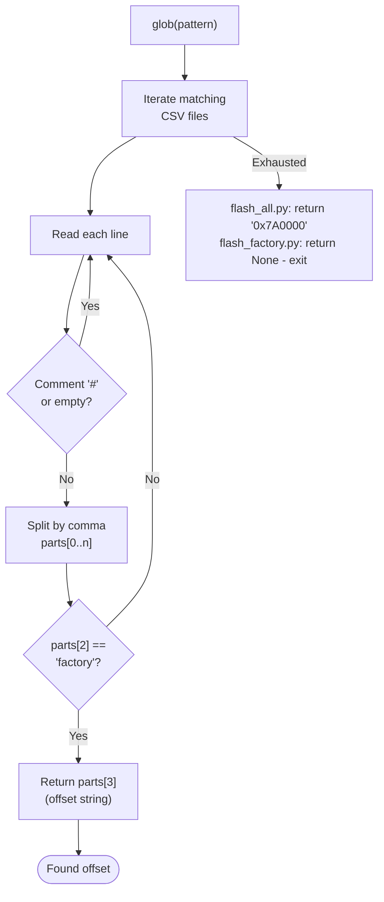
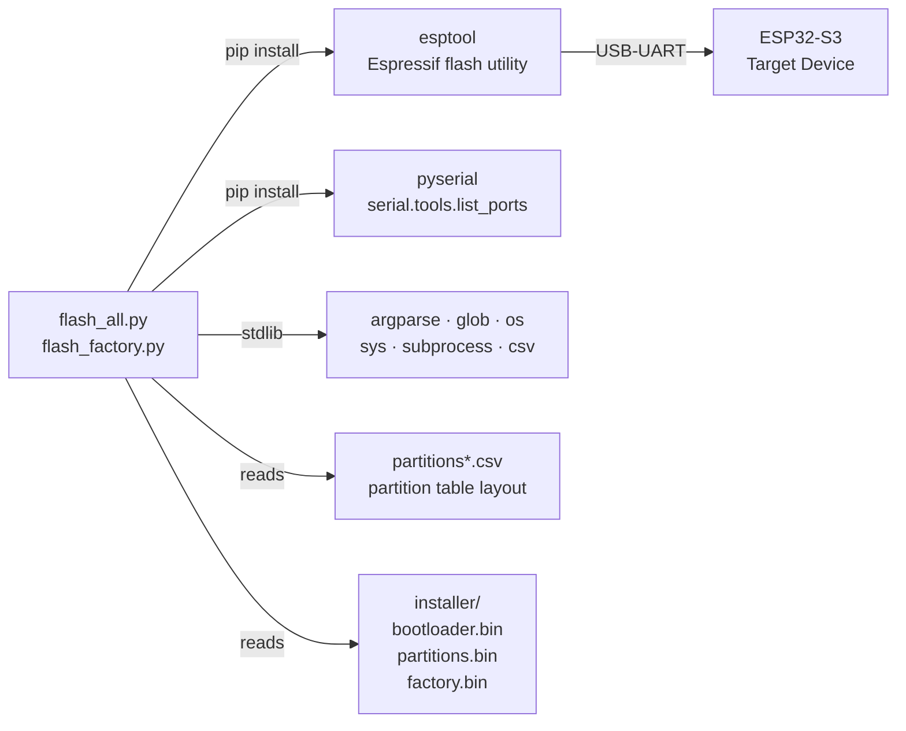
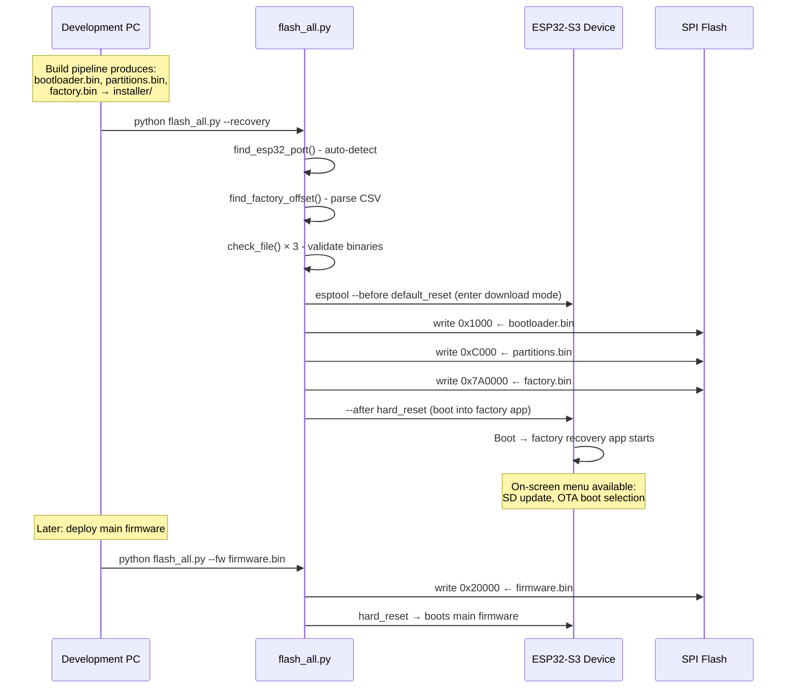

# esp32s3_zx3d50ce02s_usrc_4832_factory_app_flash_tools

## Introduction

This module provides the **host-side Python flash tools** for the ESP32-S3 ZX3D50CE02S USRC 4832 board's factory provisioning and recovery workflow. It contains two scripts that run on a development or production PC and communicate with the target device over USB-UART to write firmware images directly to ESP32-S3 flash memory using `esptool`.

The tools support three distinct deployment scenarios:

| Scenario | Script | Description |
|----------|--------|-------------|
| **First-time provisioning** | `flash_all.py --recovery` | Writes bootloader + partition table + factory recovery app |
| **Complete flash** | `flash_all.py --full` | Writes all partitions + main firmware in one operation |
| **Firmware update (dev)** | `flash_all.py --fw` | Writes only the main firmware binary to `app0` |
| **Factory re-flash** | `flash_factory.py` | Restores the factory recovery partition only |

These tools are the **production entry point** — they are the first programs run on a new board or whenever recovery is needed. They work in conjunction with the factory recovery app documented in [esp32s3_zx3d50ce02s_usrc_4832_factory_app_recovery.md](esp32s3_zx3d50ce02s_usrc_4832_factory_app_recovery.md), which provides the on-device SD-card update workflow that these scripts initially install.

---

## Module Position in the Factory App Hierarchy

This module is a leaf child of the full factory app module family for this board.



The flash tools are the **deployment mechanism** for everything the other sibling modules produce. The compiled binaries from the display, input, and recovery sub-modules are bundled into `factory.bin` and written to the device by these scripts.

---

## File Structure

```
boards/esp32s3_zx3d50ce02s_usrc_4832/Factory/tools/
├── flash_all.py        # Multi-mode flash: recovery / full / firmware-only
├── flash_factory.py    # Single-purpose: re-flash factory partition only
└── installer/          # Pre-built binaries (populated by build pipeline)
    ├── bootloader.bin
    ├── partitions.bin
    └── factory.bin
```

> **`installer/` directory**: This directory is not committed to the repository. It is populated by the build pipeline (see [esp32s3_zx3d50ce02s_usrc_4832_build.md](esp32s3_zx3d50ce02s_usrc_4832_build_scripts.md)) before the flash tools are invoked.

---

## Flash Memory Map

The scripts write to fixed addresses that must align with the partition table built into `partitions.bin`. The layout targets 8 MB flash:


### Address Constants (`flash_all.py`)

| Constant | Value | Target |
|----------|-------|--------|
| `BOOTLOADER_OFFSET` | `0x1000` | Secondary bootloader |
| `PARTITIONS_OFFSET` | `0xC000` | Partition table (44 KB above bootloader) |
| `APP0_OFFSET` | `0x20000` | Main application (`app0` OTA slot) |
| Factory offset | Auto-detected from CSV | Factory recovery partition (default `0x7A0000` for 8 MB) |

The factory partition offset is **not hardcoded** — both scripts parse the project's `partitions*.csv` file at runtime to locate the correct address, making the tools robust to layout changes across board variants.

---

## Script Architecture

### `flash_all.py` — Multi-Mode Flash Tool

#### Function Decomposition



#### Operation Mode Decision Flow



#### `flash()` — esptool Invocation

The `flash()` function constructs and runs the following effective command:

```sh
python -m esptool \
    --chip esp32 \
    --port <port> \
    --baud 460800 \
    --before default_reset \
    --after hard_reset \
    write_flash \
    <offset1> <binary1> [<offset2> <binary2> ...]
```

> **⚠️ Chip argument note**: `flash_all.py` passes `--chip esp32`. For an ESP32-S3 target, `--chip esp32s3` is the strictly correct value. Modern `esptool` versions auto-detect the chip regardless of this flag, but passing `esp32s3` explicitly is preferred for strict correctness. `flash_factory.py` omits `--chip` entirely and relies on esptool auto-detection.

---

### `flash_factory.py` — Factory Partition Re-Flash Tool

A simpler, single-purpose script for restoring only the factory recovery partition. Useful when the recovery app is corrupted or needs updating without re-provisioning the entire device.

#### Function Decomposition



#### Key Differences from `flash_all.py`

| Feature | `flash_all.py` | `flash_factory.py` |
|---------|----------------|-------------------|
| **Modes** | `--recovery` / `--full` / `--fw` | Single mode (factory only) |
| **Chip flag** | `--chip esp32` (hardcoded) | None (esptool auto-detects) |
| **Reset sequence** | `--before default_reset --after hard_reset` | Not specified (esptool defaults) |
| **Manual offset** | Not supported | `--offset` override supported |
| **CSV search depth** | 2-level glob | 3-level glob (wider search) |
| **Multiple files** | Supports N offset+binary pairs | Single file only |
| **Fallback offset** | Returns `0x7A0000` | Returns `None` → exits with error |

---

## Port Auto-Detection

Both scripts share the same `find_esp32_port()` logic for discovering the device's serial port:



The keyword list covers the most common USB-to-UART bridge chips found on ESP32 development boards. Matching is case-insensitive and applied against the concatenation of `port.description` and `port.manufacturer`.

---

## Factory Offset Discovery

Both scripts parse CSV partition tables at runtime to determine the factory partition's flash address. The CSV format follows ESP-IDF's standard partition table schema:

```csv
# Name,   Type, SubType,  Offset,   Size,    Flags
factory,   app,  factory, 0x7A0000, 0x60000,
```

The parser skips comment lines (`#`) and blank lines, splits on commas, and matches on `SubType == "factory"` (case-insensitive). If no CSV is found, `flash_all.py` falls back to `0x7A0000` (the default for the 8 MB flash layout). `flash_factory.py` has no fallback and exits with an error, requiring `--offset` to be supplied manually in that case.



---

## External Dependencies



**Install runtime requirements:**

```sh
pip install esptool pyserial
```

Both packages must be available in the Python environment used to run the scripts. `esptool` is invoked as a Python module (`python -m esptool`) rather than as a bare shell command, ensuring the version from the active virtual environment is always used.

---

## Usage Reference

### `flash_all.py`

```sh
# First-time board provisioning (recovery mode)
python flash_all.py --recovery

# Provisioning with an explicit port
python flash_all.py --recovery --port COM3           # Windows
python flash_all.py --recovery --port /dev/ttyUSB0   # Linux/macOS

# Full flash: recovery partitions + main firmware in one pass
python flash_all.py --full --fw path/to/firmware.bin
python flash_all.py --full --fw-file path/to/firmware.bin   # alternate flag

# Development: update main firmware only (leaves factory app intact)
python flash_all.py --fw path/to/firmware.bin

# Custom baud rate
python flash_all.py --recovery --port /dev/ttyUSB0 --baud 115200
```

### `flash_factory.py`

```sh
# Auto-detect port and offset from CSV
python flash_factory.py

# Specify port only
python flash_factory.py --port COM3

# Custom binary path
python flash_factory.py --port /dev/ttyUSB0 --bin my_factory.bin

# Manual offset override (skip CSV parsing)
python flash_factory.py --offset 0x7A0000

# Custom baud rate
python flash_factory.py --port COM3 --baud 115200
```

### Argument Reference

**`flash_all.py`**

| Argument | Default | Description |
|----------|---------|-------------|
| `--recovery` | — | Mode: flash bootloader + partitions + factory |
| `--full` | — | Mode: flash everything including firmware |
| `--fw FILE` / `--firmware FILE` | — | Mode: flash firmware to `app0` only |
| `--fw-file FILE` | — | Firmware binary path (companion to `--full`) |
| `--port` / `-p` | auto-detect | Serial port |
| `--baud` | `460800` | Baud rate |

**`flash_factory.py`**

| Argument | Default | Description |
|----------|---------|-------------|
| `--port` / `-p` | auto-detect | Serial port |
| `--bin` / `-b` | `installer/factory.bin` | Factory binary path |
| `--baud` | `460800` | Baud rate |
| `--offset` / `-o` | auto-detect from CSV | Flash offset for factory partition |

---

## Complete Provisioning Workflow

The following sequence diagram shows how the flash tools fit into the end-to-end provisioning sequence for a new board:



---

## Cross-Board Pattern

This module follows an identical pattern used across all boards in the project. The same two-script structure (`flash_all.py` + `flash_factory.py`) appears in:

- [`factory_tools.md`](factory_tools.md) — covers `esp32_2432s028r`, `esp32_3248s035c/r`, `esp32s3_4827s043c`, `esp32s3_8048s043c/050c/070c`, `esp32s3_8048_touch_lcd_7`
- [`pibot_pendant_v1_0_factory_app.md`](pibot_pendant_v1_0_factory_app.md) — PiBot Pendant V1.0 variant
- [`esp32s3_bzm_tft35_gt911_factory_app_flash_tools.md`](esp32s3_bzm_tft35_gt911_factory_app_flash_tools.md) — BZM TFT35 GT911 variant

Board-specific differences are limited to the partition layout (CSV) and the resulting factory partition offset — the script logic is otherwise identical across all boards. Any fixes or enhancements to the flash tool pattern should be applied consistently across all boards.

---

## See Also

| Document | Relationship |
|----------|-------------|
| [`esp32s3_zx3d50ce02s_usrc_4832_factory_app.md`](esp32s3_zx3d50ce02s_usrc_4832_factory_app.md) | Parent module — full factory app overview |
| [`esp32s3_zx3d50ce02s_usrc_4832_factory_app_recovery.md`](esp32s3_zx3d50ce02s_usrc_4832_factory_app_recovery.md) | The factory app binary that these scripts install |
| [`esp32s3_zx3d50ce02s_usrc_4832_factory_app_display.md`](esp32s3_zx3d50ce02s_usrc_4832_factory_app_display.md) | ST7796 i80 display driver used inside the factory app |
| [`esp32s3_zx3d50ce02s_usrc_4832_factory_app_input.md`](esp32s3_zx3d50ce02s_usrc_4832_factory_app_input.md) | Button, encoder, and touch input used inside the factory app |
| [`esp32s3_zx3d50ce02s_usrc_4832_bsp.md`](esp32s3_zx3d50ce02s_usrc_4832_bsp.md) | Board support package — hardware pin definitions and LVGL integration |
| [`factory_tools.md`](factory_tools.md) | Same flash tool pattern applied across all other boards in the project |
