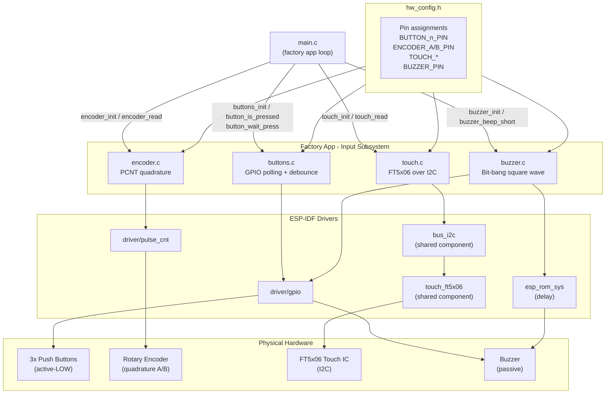
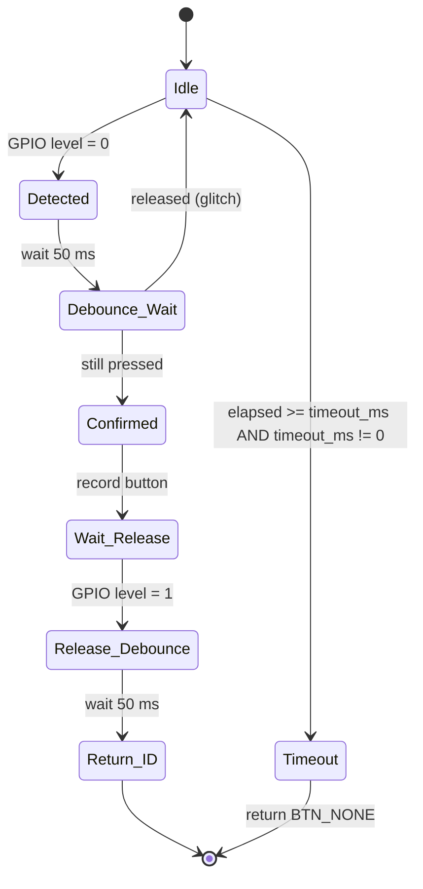
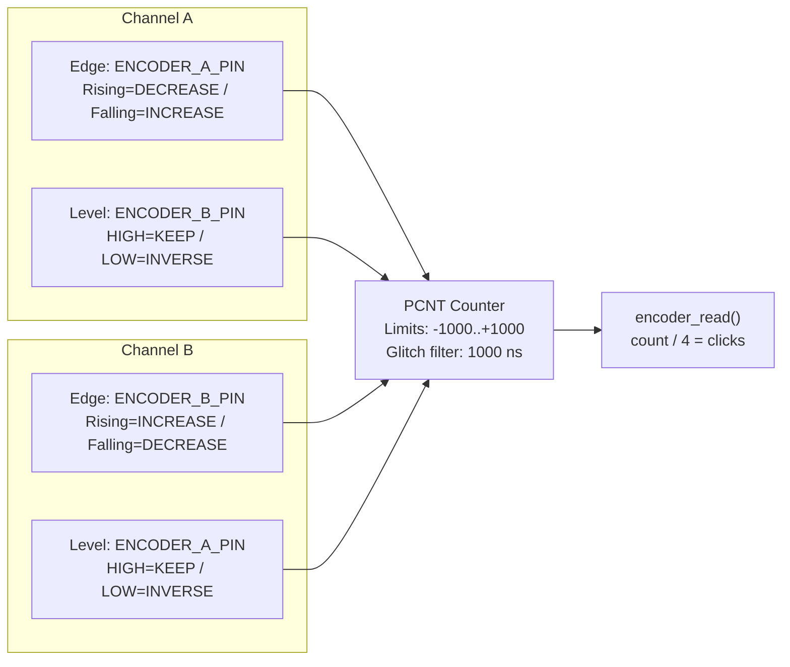
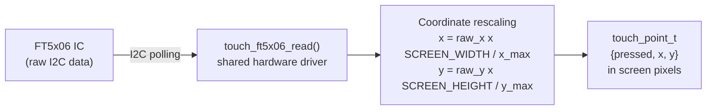
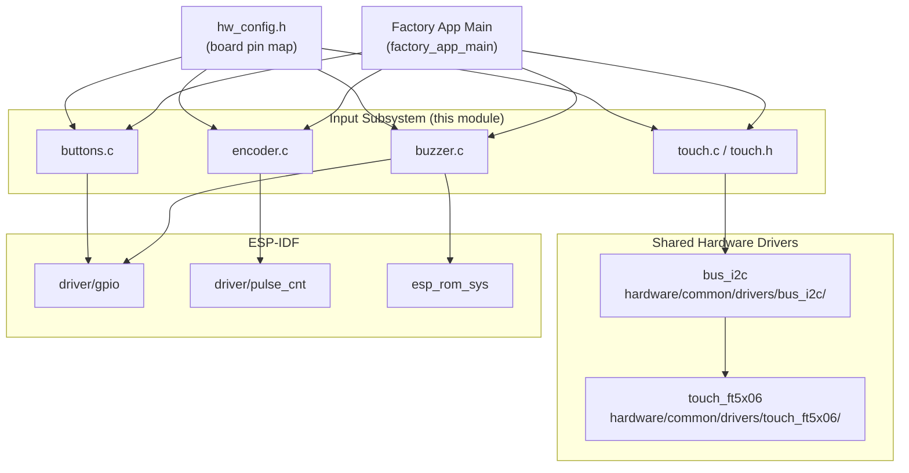
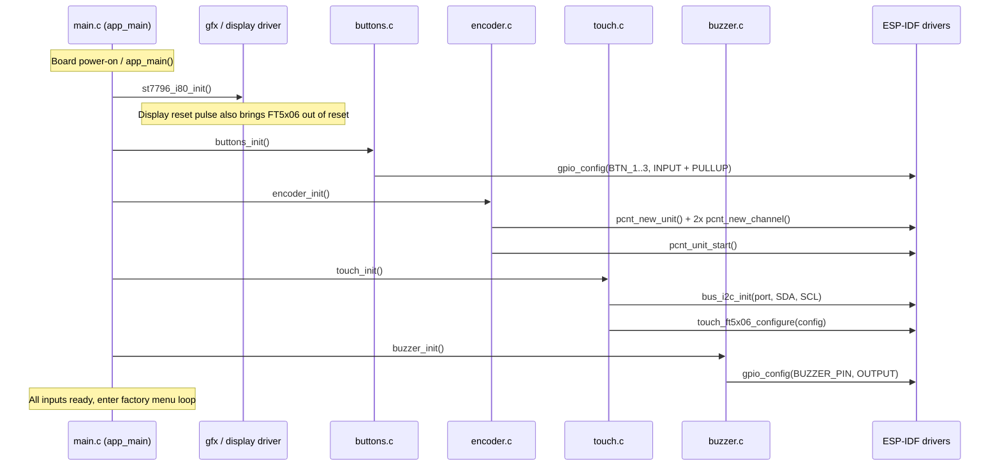
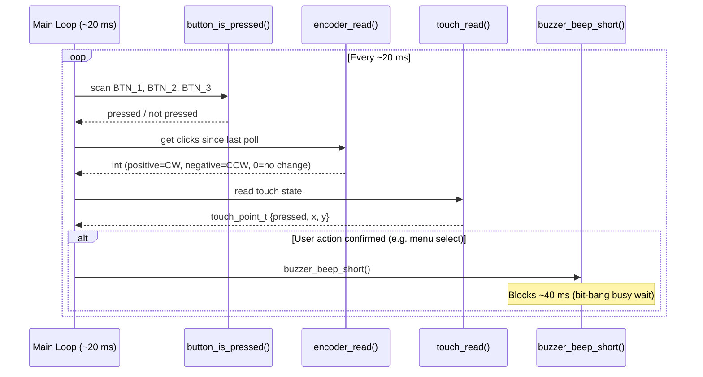
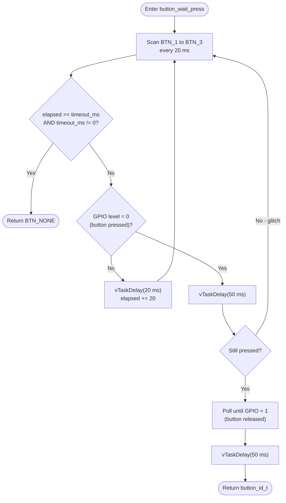
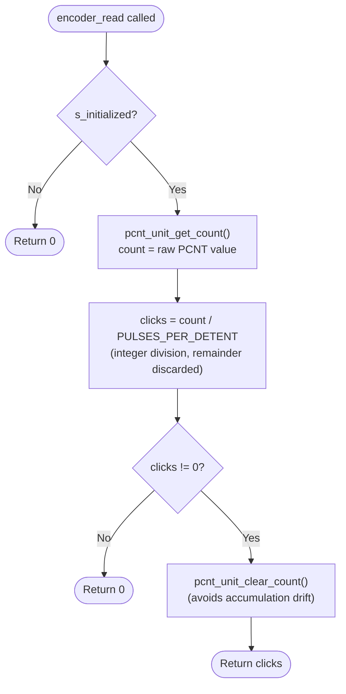
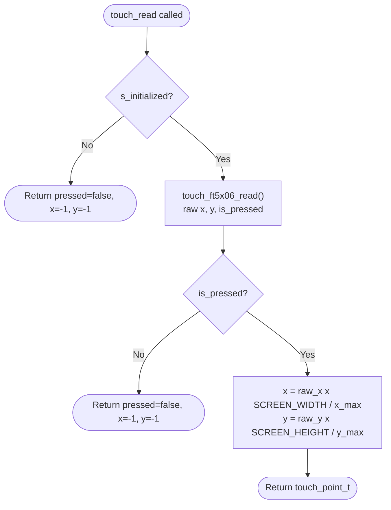

# esp32s3\_zx3d50ce02s\_usrc\_4832 Factory App — Input Subsystem

The **input subsystem** of the `esp32s3_zx3d50ce02s_usrc_4832` factory application bundles all human-interface device drivers used during manufacturing testing and field recovery: three physical GPIO buttons, a quadrature rotary encoder, an FT5x06 capacitive touch controller, and a bit-banged buzzer for auditory feedback. Every driver is deliberately minimal—no RTOS queues, no interrupts, no dynamic allocation—so the factory app stays deterministic and easy to audit.

---

## Table of Contents

1. [Module Context](#1-module-context)
2. [Architecture Overview](#2-architecture-overview)
3. [Component Reference](#3-component-reference)
   - 3.1 [Buttons (`buttons.c`)](#31-buttons-buttonsc)
   - 3.2 [Rotary Encoder (`encoder.c`)](#32-rotary-encoder-encoderc)
   - 3.3 [Touch Screen (`touch.c` / `touch.h`)](#33-touch-screen-touchc--touchh)
   - 3.4 [Buzzer (`buzzer.c`)](#34-buzzer-buzzerc)
4. [Hardware Configuration](#4-hardware-configuration)
5. [Data Flow and Interaction Diagrams](#5-data-flow-and-interaction-diagrams)
6. [Process Flows](#6-process-flows)
7. [Design Constraints and Invariants](#7-design-constraints-and-invariants)
8. [Cross-Board Pattern](#8-cross-board-pattern)
9. [Related Modules](#9-related-modules)

---

## 1. Module Context

This module is a child of [`esp32s3_zx3d50ce02s_usrc_4832_factory_app`](esp32s3_zx3d50ce02s_usrc_4832_factory_app.md), the standalone factory/recovery application flashed to the ESP32-S3 ZX3D50CE02S-USRC-4832 board before the main pendant firmware.

```
esp32s3_zx3d50ce02s_usrc_4832_factory_app
├── esp32s3_zx3d50ce02s_usrc_4832_factory_app_main     ← orchestration
├── esp32s3_zx3d50ce02s_usrc_4832_factory_app_display  ← gfx + ST7796 I80
├── esp32s3_zx3d50ce02s_usrc_4832_factory_app_input    ◄ THIS MODULE
├── esp32s3_zx3d50ce02s_usrc_4832_factory_app_storage  ← SD card
└── esp32s3_zx3d50ce02s_usrc_4832_factory_app_tools    ← flash helpers
```

The main application loop (see [`esp32s3_zx3d50ce02s_usrc_4832_factory_app_main`](esp32s3_zx3d50ce02s_usrc_4832_factory_app_main.md)) polls every input source; this module provides the four polling APIs it calls.

---

## 2. Architecture Overview



All drivers share the same two-phase lifecycle: **init** once at startup, then **poll** from the main loop. No callbacks, no ISRs, no queues.

---

## 3. Component Reference

### 3.1 Buttons (`buttons.c`)

**Purpose:** Provides blocking and non-blocking access to three physical push buttons with integrated 50 ms software debounce.

#### Types

| Identifier | Description |
|---|---|
| `button_id_t` | Enum: `BTN_1`, `BTN_2`, `BTN_3`, `BTN_NONE` (defined in `buttons.h`) |

#### Functions

---

##### `pin_bit` *(local helper)*

```c
static uint64_t pin_bit(gpio_num_t pin)
```

Internal helper. Returns `1ULL << pin` when `pin` is a valid GPIO, otherwise `0`. Avoids a compile-time negative-shift warning that would arise if `GPIO_NUM_NC` (negative) were shifted directly in a bit-mask expression.

---

##### `buttons_init`

```c
void buttons_init(void)
```

Configures all three button GPIOs as inputs with internal pull-ups enabled. Button pins are taken from `hw_config.h` (`BUTTON_1_PIN`, `BUTTON_2_PIN`, `BUTTON_3_PIN`).

**Guard:** If all three pins resolve to `GPIO_NUM_NC` (no physical buttons on this board variant), the function builds a zero mask and returns immediately without touching the GPIO driver.

**GPIO config applied:**

| Field | Value |
|---|---|
| Mode | `GPIO_MODE_INPUT` |
| Pull-up | `GPIO_PULLUP_ENABLE` |
| Pull-down | `GPIO_PULLDOWN_DISABLE` |
| Interrupt | `GPIO_INTR_DISABLE` |

---

##### `button_is_pressed`

```c
bool button_is_pressed(button_id_t btn)
```

Returns `true` if the specified button is currently held down (active-LOW logic — a `0` level means pressed). Returns `false` immediately for an out-of-range button ID or an invalid pin (`GPIO_NUM_NC`).

---

##### `button_wait_press`

```c
button_id_t button_wait_press(uint32_t timeout_ms)
```

Blocking poll. Scans all buttons in a 20 ms loop until a press is detected or `timeout_ms` milliseconds have elapsed. Passing `0` for `timeout_ms` waits indefinitely.

**Debounce sequence:**
1. Detect falling edge (GPIO level → 0).
2. Wait 50 ms (`DEBOUNCE_MS`).
3. Confirm still pressed.
4. Wait for release (level → 1).
5. Wait another 50 ms post-release de-bounce.
6. Return the `button_id_t`.

Returns `BTN_NONE` on timeout.

---

#### Button State Machine



---

### 3.2 Rotary Encoder (`encoder.c`)

**Purpose:** Decodes a quadrature rotary encoder using the ESP32-S3's hardware Pulse Counter (PCNT) peripheral. Returns the number of detent clicks since the last call; no queue or interrupt is used.

#### Constants

| Macro | Value | Description |
|---|---|---|
| `PULSES_PER_DETENT` | `4` | Raw PCNT edges per physical detent. Adjust if rotation feels too sensitive or sluggish. |

#### Functions

---

##### `encoder_init`

```c
esp_err_t encoder_init(void)
```

Configures two PCNT channels for full quadrature decoding (`ENCODER_A_PIN`, `ENCODER_B_PIN` from `hw_config.h`).

**Guard:** Returns `ESP_OK` immediately if either pin is `GPIO_NUM_NC`. `encoder_read()` will safely return `0` in that case.

**Configuration applied:**

| Setting | Value |
|---|---|
| PCNT high limit | `+1000` |
| PCNT low limit | `-1000` |
| Glitch filter | `max_glitch_ns = 1000` (matches main firmware) |
| Pull-ups | Internal pull-ups on both A and B pins |
| Channel A edge | ENCODER_A_PIN: `DECREASE` on rising, `INCREASE` on falling |
| Channel A level | ENCODER_B_PIN: HIGH → KEEP, LOW → INVERSE |
| Channel B edge | ENCODER_B_PIN: `INCREASE` on rising, `DECREASE` on falling |
| Channel B level | ENCODER_A_PIN: HIGH → KEEP, LOW → INVERSE |

---

##### `encoder_read`

```c
int encoder_read(void)
```

Reads the accumulated PCNT count, converts it to detent clicks (`count / PULSES_PER_DETENT`), clears the counter, and returns the click count. Returns `0` if the encoder is not initialized or if no full detent has been completed since the last call.

**Note:** The counter is cleared after every read. Remainder pulses (less than one full detent) are discarded. This avoids accumulation drift at the cost of sub-detent precision, which is acceptable for factory menu navigation.

Return value: positive = clockwise, negative = counter-clockwise (sign depends on physical wiring; swap `PCNT_CHANNEL_EDGE_ACTION_INCREASE` / `DECREASE` if reversed).

---

#### PCNT Channel Wiring



---

### 3.3 Touch Screen (`touch.c` / `touch.h`)

**Purpose:** Thin wrapper over the shared `touch_ft5x06` hardware driver component. Initializes the FT5x06 capacitive touch IC over I2C and returns touch coordinates already rescaled to screen pixels.

#### Types

```c
/* touch.h */
typedef struct {
    bool    pressed;   /* true if a finger is detected */
    int16_t x;         /* screen X pixel [0 .. SCREEN_WIDTH-1], or -1 if not pressed */
    int16_t y;         /* screen Y pixel [0 .. SCREEN_HEIGHT-1], or -1 if not pressed */
} touch_point_t;
```

#### Functions

---

##### `touch_init`

```c
void touch_init(void)
```

Initialises the I2C bus (`bus_i2c_init`) and configures the FT5x06 controller (`touch_ft5x06_configure`) using compile-time constants from `hw_config.h`.

**Key design decisions (documented in the file header):**

- **Fixed `x_max` / `y_max`:** Auto-detection is intentionally disabled. The FT5x06 on another board (esp32s3_hmi43v3) was found to report bogus auto-detected values; fixed values from `hw_config.h` are used proactively to avoid repeating that bug.
- **No independent touch reset:** `TOUCH_RST_PIN` is `GPIO_NUM_NC`. The touch IC shares the display's physical reset line (`TFT_RST_PIN`). The display driver (`st7796_i80_init()`, called before `touch_init()` in `main.c`) already pulses reset, which brings the FT5x06 out of reset as a side effect. `touch_init()` must therefore be called **after** display initialisation.
- On any initialisation error, `s_initialized` remains `false` and subsequent `touch_read()` calls return a safe "not pressed" value without crashing.

**FT5x06 configuration fields applied:**

| Field | Source in `hw_config.h` |
|---|---|
| `i2c_addr` | `TOUCH_I2C_ADDR_LIST` |
| `i2c_port` | `TOUCH_I2C_PORT_IDX` |
| `i2c_clk_speed` | `TOUCH_I2C_FREQ_HZ` |
| `rst_pin` | `TOUCH_RST_PIN` (`GPIO_NUM_NC`) |
| `int_pin` | `TOUCH_IRQ_PIN` |
| `swap_xy` | `TOUCH_SWAP_XY_FLAG` |
| `invert_x` | `TOUCH_MIRROR_X_FLAG` |
| `invert_y` | `TOUCH_MIRROR_Y_FLAG` |
| `x_max` | `TOUCH_X_MAX` (fixed, not auto-detected) |
| `y_max` | `TOUCH_Y_MAX` (fixed, not auto-detected) |

---

##### `touch_read`

```c
touch_point_t touch_read(void)
```

Calls `touch_ft5x06_read()` and maps raw controller coordinates to screen pixels:

```
pt.x = raw_x * SCREEN_WIDTH  / touch_ft5x06_get_x_max()
pt.y = raw_y * SCREEN_HEIGHT / touch_ft5x06_get_y_max()
```

Returns `{ .pressed = false, .x = -1, .y = -1 }` if the driver is not initialized or no finger is detected.

---

#### Touch Coordinate Pipeline



---

### 3.4 Buzzer (`buzzer.c`)

**Purpose:** Provides a short auditory confirmation beep (40 ms at ~2700 Hz) using software bit-banging on a GPIO. No PWM or LEDC peripheral is required.

#### Constants

| Macro | Value | Description |
|---|---|---|
| `BEEP_FREQ_HZ` | `2700` | Square-wave toggle frequency in Hz |
| `BEEP_DURATION_MS` | `40` | Total beep duration in milliseconds |

#### Functions

---

##### `pin_bit` *(local helper)*

```c
static uint64_t pin_bit(gpio_num_t pin)
```

Same guard helper as in `buttons.c`. Returns a valid GPIO bit mask or `0` for `GPIO_NUM_NC`. Prevents a compile-time negative-shift warning when constructing `gpio_config.pin_bit_mask`.

---

##### `buzzer_init`

```c
void buzzer_init(void)
```

Configures `BUZZER_PIN` as a push-pull output and drives it LOW. If `BUZZER_PIN` is `GPIO_NUM_NC` (no buzzer on this board variant), returns immediately.

---

##### `buzzer_beep_short`

```c
void buzzer_beep_short(void)
```

Produces a single short beep by toggling the GPIO at the target frequency using busy-wait delays (`esp_rom_delay_us`).

**Timing calculation:**

```
half_period_us = 1 000 000 / (2 x 2700) = ~185 us
cycles         = (2700 x 40) / 1000     = 108 full square-wave cycles
```

The function blocks the calling task for approximately 40 ms. This is intentional in the factory context — the main loop is not time-critical and auditory feedback must be synchronous with user actions (button confirm, menu selection). This function must **not** be called from ISR context.

---

## 4. Hardware Configuration

All pin assignments and tuning constants for this board are centralised in `hw_config.h` (board-specific). The table below summarises the logical constants consumed by this module.

| Constant | Driver | Description |
|---|---|---|
| `BUTTON_1_PIN` | buttons.c | GPIO for physical button 1 |
| `BUTTON_2_PIN` | buttons.c | GPIO for physical button 2 |
| `BUTTON_3_PIN` | buttons.c | GPIO for physical button 3 |
| `ENCODER_A_PIN` | encoder.c | PCNT quadrature channel A GPIO |
| `ENCODER_B_PIN` | encoder.c | PCNT quadrature channel B GPIO |
| `TOUCH_I2C_PORT_IDX` | touch.c | I2C peripheral port number |
| `TOUCH_I2C_SDA_PIN` | touch.c | I2C SDA GPIO |
| `TOUCH_I2C_SCL_PIN` | touch.c | I2C SCL GPIO |
| `TOUCH_I2C_FREQ_HZ` | touch.c | I2C clock speed |
| `TOUCH_I2C_ADDR_LIST` | touch.c | FT5x06 I2C address(es) |
| `TOUCH_IRQ_PIN` | touch.c | Touch interrupt GPIO (optional, polled not used) |
| `TOUCH_RST_PIN` | touch.c | `GPIO_NUM_NC` — shared with `TFT_RST_PIN` |
| `TOUCH_SWAP_XY_FLAG` | touch.c | Axis swap flag |
| `TOUCH_MIRROR_X_FLAG` | touch.c | X-axis mirror flag |
| `TOUCH_MIRROR_Y_FLAG` | touch.c | Y-axis mirror flag |
| `TOUCH_X_MAX` | touch.c | Fixed raw X full-scale (not auto-detected) |
| `TOUCH_Y_MAX` | touch.c | Fixed raw Y full-scale (not auto-detected) |
| `SCREEN_WIDTH` | touch.c | Target display pixel width |
| `SCREEN_HEIGHT` | touch.c | Target display pixel height |
| `BUZZER_PIN` | buzzer.c | GPIO driving the passive buzzer |

Any pin defined as `GPIO_NUM_NC` causes the corresponding driver to silently skip initialisation. This makes the same source files compilable and functional across board variants that may omit certain peripherals.

---

## 5. Data Flow and Interaction Diagrams

### 5.1 Module Dependency Graph



### 5.2 Initialisation Sequence

The display driver must run before `touch_init()` because the FT5x06 shares the TFT reset line.



### 5.3 Runtime Poll Cycle



---

## 6. Process Flows

### 6.1 Button Detection and Debounce (`button_wait_press`)



### 6.2 Encoder Read and Click Conversion



### 6.3 Touch Read and Coordinate Scaling



---

## 7. Design Constraints and Invariants

| Constraint | Detail |
|---|---|
| **No dynamic allocation** | All state is held in `static` variables (`s_pcnt_unit`, `s_initialized`). No `malloc` anywhere in this module. |
| **No ISRs or queues** | Buttons and touch are purely polled by the caller. The encoder uses hardware PCNT counting (hardware accumulates the count); the result is polled, not pushed via callback. |
| **Blocking beep** | `buzzer_beep_short()` uses `esp_rom_delay_us` busy-wait and blocks the caller for ~40 ms. Must **not** be called from ISR context. Acceptable in factory menu context where the loop is not time-critical. |
| **GPIO_NUM_NC guard in every driver** | Every init function checks pin validity at runtime. Invalid pins produce a zero bit-mask or an early `return`. The build remains valid for board variants that omit any peripheral. |
| **Touch reset shared with display** | `TOUCH_RST_PIN = GPIO_NUM_NC`. The FT5x06 must be initialized **after** the display driver has issued its reset pulse. Violating this ordering leaves the touch IC in reset and `touch_ft5x06_configure` will fail. |
| **Fixed touch scale** | Auto-detection of `x_max`/`y_max` is disabled. If the IC reports a range different from what `hw_config.h` specifies, the coordinate mapping will be wrong. Update `hw_config.h` manually if the IC changes. |
| **PCNT counter cleared on every poll** | Sub-detent pulses are discarded on each `encoder_read()` call. At polling intervals at or below 100 ms and 4 pulses per detent this is undetectable by the user. |
| **Braces on all conditionals** | Per project rules: `FACTORY_LOGD` macros can compile to empty statements; every `if`/`else`/`for`/`while` uses `{}` to remain correct when macro bodies disappear. |

---

## 8. Cross-Board Pattern

This input subsystem is an instance of a pattern repeated across every board that has a factory application. Sibling implementations follow the same public API and file structure, varying only the hardware details:

| Board | Touch IC | Display bus | Notable difference vs. this board |
|---|---|---|---|
| `esp32s3_zx3d50ce02s_usrc_4832` (this) | FT5x06 (I2C) | Intel 8080 (ST7796) | RST shared with TFT; fixed x/y max |
| [`esp32s3_hmi43v3`](esp32s3_hmi43v3_factory_app_input.md) | FT5x06 (I2C) | Intel 8080 (RM68120) | Separate RST pin |
| [`esp32s3_bzm_tft35_gt911`](esp32s3_bzm_tft35_gt911_factory_app_input.md) | GT911 (I2C) | SPI (ST7796) | Different touch driver |
| [`esp32s3_8048s070c`](esp32s3_8048s070c_factory_app_input.md) | None | RGB parallel | No touch in factory app |
| [`pibot_pendant_v1_0`](pibot_pendant_v1_0_factory_app_input.md) | XPT2046 (SPI) | SPI (ILI9341) | Resistive touch with calibration |

The public API (`buttons_init`, `button_is_pressed`, `button_wait_press`, `encoder_init`, `encoder_read`, `touch_init`, `touch_read`, `touch_point_t`, `buzzer_init`, `buzzer_beep_short`) is identical across all boards, allowing `main.c` to compile unchanged for every target.

---

## 9. Related Modules

| Module | Relationship |
|---|---|
| [`esp32s3_zx3d50ce02s_usrc_4832_factory_app`](esp32s3_zx3d50ce02s_usrc_4832_factory_app.md) | Parent: complete factory application for this board |
| [`esp32s3_zx3d50ce02s_usrc_4832_factory_app_main`](esp32s3_zx3d50ce02s_usrc_4832_factory_app_main.md) | Direct caller: polls all four input APIs from the factory menu loop |
| [`esp32s3_zx3d50ce02s_usrc_4832_factory_app_esp32s3_zx3d50ce02s_usrc_4832_factory_app_display`](esp32s3_zx3d50ce02s_usrc_4832_factory_app_display.md) | Sibling display module: must be initialised first — its reset pulse wakes the FT5x06 touch IC |
| [`touch_drivers`](touch_drivers.md) | Shared `touch_ft5x06` driver component used by `touch.c` |
| [`bus_drivers`](bus_drivers.md) | Shared `bus_i2c` component used to initialise the I2C bus for the FT5x06 |
| [`physical_input`](physical_input.md) | Shared `phy_encoder` and `phy_buttons` driver components used by the main-firmware BSP layer |
| [`esp32s3_zx3d50ce02s_usrc_4832_bsp`](esp32s3_zx3d50ce02s_usrc_4832_bsp.md) | BSP for the main firmware on this board; uses the same `touch_ft5x06` driver and PCNT encoder pattern |
| [`buzzer`](buzzer.md) | Main-firmware buzzer module (`esp3d_buzzer.h`); the factory app uses this simpler standalone bit-bang implementation instead |
