# esp32s3\_zx3d50ce02s\_usrc\_4832\_factory\_app\_main

Factory recovery application entry point and orchestration logic for the **ESP32S3-ZX3D50CE02S-USRC-4832** board (480×320, ST7796 via Intel 8080). This module implements the complete recovery menu: hardware bring-up, OTA backup restore, touch-navigated menu, SD-card firmware flashing, UI resources flashing, and optional screen snapshot capture.

---

## Table of Contents

1. [Module Role and Scope](#1-module-role-and-scope)
2. [Board Context](#2-board-context)
3. [Architecture Overview](#3-architecture-overview)
4. [Module Decomposition](#4-module-decomposition)
5. [Hardware Initialization Sequence](#5-hardware-initialization-sequence)
6. [OTA Backup Restore Mechanism](#6-ota-backup-restore-mechanism)
7. [Menu System](#7-menu-system)
8. [Flash Operations](#8-flash-operations)
9. [Display Layout](#9-display-layout)
10. [Virtual Button and Touch System](#10-virtual-button-and-touch-system)
11. [Snapshot System](#11-snapshot-system)
12. [Logging System](#12-logging-system)
13. [Key Constants and Configuration](#13-key-constants-and-configuration)
14. [Data Flow](#14-data-flow)
15. [Related Modules](#15-related-modules)

---

## 1. Module Role and Scope

This module is the **top-level orchestrator** of the factory recovery application for the ZX3D50CE02S-USRC-4832 board. It runs from the ESP32-S3's `factory` OTA partition and is entered exclusively via the software `[ESP444]FACTORY` command issued by the main pendant firmware — **not** through a physical button held at boot (the board has no physical buttons).

**What this module owns:**

| Responsibility | Function |
|---|---|
| Application entry point | `app_main()` |
| Hardware init orchestration | Ordered init of display → backlight → gfx → buttons → encoder → touch → buzzer |
| OTA backup restore | `restore_otadata_from_backup()` |
| Menu rendering and navigation | `draw_menu()`, `menu_move()`, `menu_select()` |
| Partition boot switching | `boot_partition()`, `action_boot_partition()` |
| Firmware OTA flash from SD | `action_sd_update()` |
| UI resources flash from SD | `action_sd_update_res()` |
| Input dispatch (touch + physical) | `dispatch_button()`, `touch_hint_hit_test()` |
| Progress and result rendering | `draw_progress()`, `draw_result()` |
| Screen snapshot (optional) | `snapshot_take()`, `snapshot_check()` |

**What this module does NOT own** (delegated to sibling modules):

- Raw display driver and pixel-level drawing primitives → see [esp32s3\_zx3d50ce02s\_usrc\_4832\_factory\_app\_display.md](esp32s3_zx3d50ce02s_usrc_4832_factory_app_display.md)
- Button, encoder, touch, buzzer drivers → see [esp32s3\_zx3d50ce02s\_usrc\_4832\_factory\_app\_input.md](esp32s3_zx3d50ce02s_usrc_4832_factory_app_input.md)
- SD card mount/unmount → see [esp32s3\_zx3d50ce02s\_usrc\_4832\_factory\_app\_storage.md](esp32s3_zx3d50ce02s_usrc_4832_factory_app_storage.md)
- Flash and factory deployment tooling → see [esp32s3\_zx3d50ce02s\_usrc\_4832\_factory\_app\_tools.md](esp32s3_zx3d50ce02s_usrc_4832_factory_app_tools.md)

---

## 2. Board Context

| Property | Value |
|---|---|
| SoC | ESP32-S3 |
| Board ID | ESP32S3-ZX3D50CE02S-USRC-4832 |
| Display | 480×320, ST7796 controller via Intel 8080 (I80) parallel bus |
| Display driver | `st7796_i80` (see [esp32s3\_zx3d50ce02s\_usrc\_4832\_factory\_app\_display.md](esp32s3_zx3d50ce02s_usrc_4832_factory_app_display.md)) |
| Touch controller | Capacitive (shares RESET GPIO with display) |
| Physical buttons | **None** — all `GPIO_NUM_NC` |
| Physical encoder | **None** — `GPIO_NUM_NC` |
| Buzzer | **None** — `GPIO_NUM_NC` |
| IO expander | **None** (unlike esp32s3\_hmi43v3 which uses TCA9554) |
| Backlight | Plain active-high GPIO (`TFT_LED`) |
| Custom bootloader | **None** — no physical trigger mechanism exists |
| Factory entry path | Software only: main firmware `[ESP444]FACTORY` command |

The absence of physical inputs is the primary design difference from boards like `pibot_pendant_v1_0` or `esp32s3_hmi43v3`. All user interaction occurs through the **virtual button hints** rendered at the bottom of the touchscreen.

---

## 3. Architecture Overview

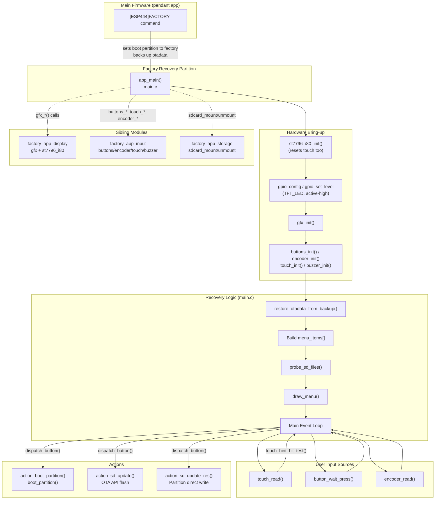

---

## 4. Module Decomposition

The `esp32s3_zx3d50ce02s_usrc_4832_factory_app_main` module consists of exactly two source files:

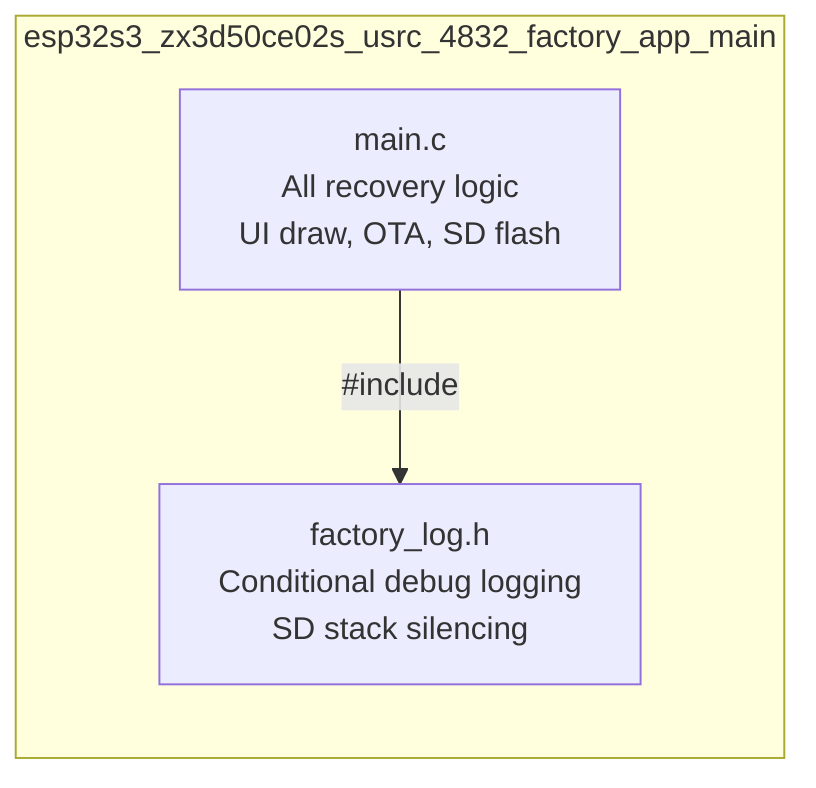

### `main.c` — Functional Groups

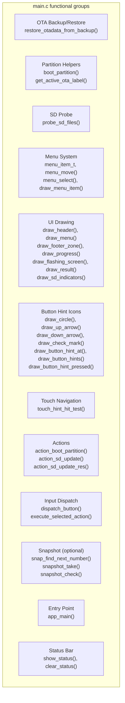

### `factory_log.h` — Compile-time Log Gate

| Symbol | Behaviour |
|---|---|
| `FACTORY_LOGD(tag, fmt, ...)` | Expands to `ESP_LOGI` if `FACTORY_LOG_LEVEL != 0`, otherwise to `do {} while (0)` |
| `FACTORY_LOG_LEVEL` | Set by `ENABLE_FACTORY_DEBUG_LOG` in `Factory/CMakeLists.txt`; default `0` (silent) |
| `factory_log_silence_sd_stack()` | Calls `esp_log_level_set()` on 8 SD/FAT driver tags to suppress runtime chatter |

`ESP_LOGW` and `ESP_LOGE` always remain active regardless of `FACTORY_LOG_LEVEL`.

---

## 5. Hardware Initialization Sequence

The init order in `app_main()` is **strictly constrained** by shared hardware lines:

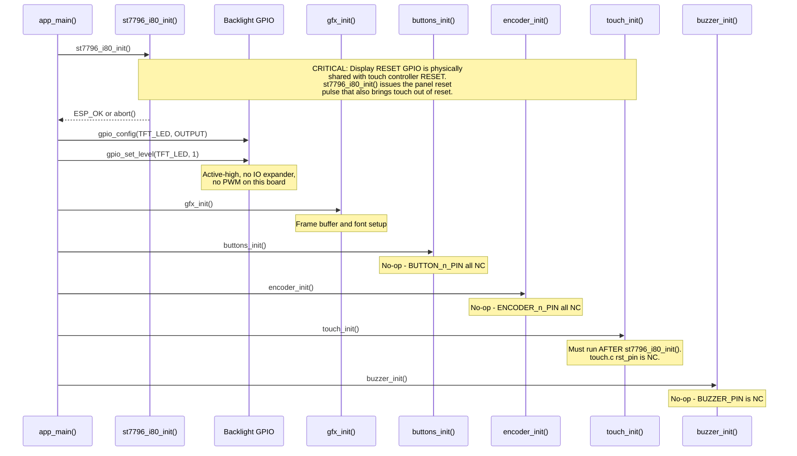

> **Critical constraint:** On this board, `touch_init()` must always be called after `st7796_i80_init()`. The display and touch controller share the same `TFT_RST_PIN` GPIO. If `touch_init()` tried to toggle reset independently before the display init, it could corrupt the panel's state. This is unlike boards with an IO expander (e.g., `esp32s3_hmi43v3` using TCA9554) where the lines can be controlled independently.

---

## 6. OTA Backup Restore Mechanism

### Purpose

The main pendant firmware writes a backup of the ESP32's OTA metadata (`otadata` partition) to a reserved flash sector **before** switching the boot partition to `factory`. This ensures that if the device powers off during recovery, a subsequent boot still targets the correct main firmware partition (`app0`) rather than looping back to factory indefinitely.

### Flash Layout

```
Flash address space
┌────────────────────┬──────────┐
│ 0x0000  Bootloader │          │
├────────────────────┤          │
│ 0x8000  ... (gap)  │          │
├────────────────────┤          │
│ 0xB000  BACKUP     │ ← OTADATA_BACKUP_OFFSET (4 KB sector)
│         sector     │   Written by main firmware (esp444.cpp)
│  +0x00  entry1[32] │   Magic at +0x40 = 0xAA55AA55
│  +0x20  entry2[32] │
│  +0x40  MAGIC[4]   │
├────────────────────┤          │
│ 0xC000  Partition  │          │
│         table      │          │
├────────────────────┤          │
│ 0xD000  NVS part.  │          │
├────────────────────┤          │
│ 0x10000 otadata    │ ← OTADATA_OFFSET (2×4 KB)
│  entry1[32]        │   Restored to here from backup
│  entry2[32]        │
├────────────────────┤          │
│ ...     app0       │          │
│ ...     app1       │          │
│ ...     factory    │ ← We are here
│ ...     ui_res     │          │
└────────────────────┘
```

### Restore Flow

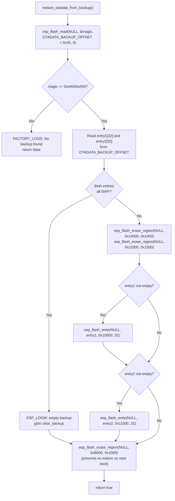

### Important Constraints

| Constraint | Detail |
|---|---|
| `OTADATA_BACKUP_OFFSET` alignment | Must be 4 KB-aligned |
| `OTADATA_BACKUP_OFFSET` range | After bootloader end, before partition table at `0xC000` |
| No partition overlap | First partition (NVS) starts at `0xD000` |
| `CONFIG_SPI_FLASH_DANGEROUS_WRITE_ALLOWED=y` | Required in factory `sdkconfig` — addresses below the first partition are written directly. The factory app is a privileged recovery tool; this is intentional. |
| Must match main firmware | `OTADATA_BACKUP_OFFSET` and `BACKUP_MAGIC` values **must be identical** in both `main.c` and the main firmware's `esp444.cpp`. |

---

## 7. Menu System

### Menu Items

Menu items are built dynamically at startup based on detected partitions and the static `menu_item_t` struct:

```c
typedef struct {
    const char *label;      // Display label
    menu_action_t action;   // Action enum
    uint16_t color;         // Text color when not selected
} menu_item_t;
```

| Condition | Items Added |
|---|---|
| Always | `"Boot app0"` (MENU_ACTION_BOOT_APP0) |
| `has_app1 == true` | `"Boot app1"` (MENU_ACTION_BOOT_APP1) |
| Always | `"SD -> app0"` (MENU_ACTION_SD_UPDATE_APP0) |
| `has_app1 == true` | `"SD -> app1"` (MENU_ACTION_SD_UPDATE_APP1) |
| Always | `"SD -> resources"` (MENU_ACTION_SD_UPDATE_RES) |

`has_app1` is detected with `esp_partition_find_first(APP, ANY, "app1")` at startup. On this board variant, only `app0` is shipped by default.

### Menu State

```
Static state:
  menu_items[]      — array of up to MENU_MAX_ITEMS (8) items
  menu_count        — actual item count (3 without app1, 5 with app1)
  menu_selected     — index of currently highlighted item
  last_status_msg   — footer status text (or "" for default message)
  last_status_color — footer text color
  sd_has_fw         — true if /sdcard/esp3dfw.bin exists
  sd_has_res        — true if /sdcard/ui_resources.bin exists
  has_app1          — true if app1 partition found
```

### Navigation Logic

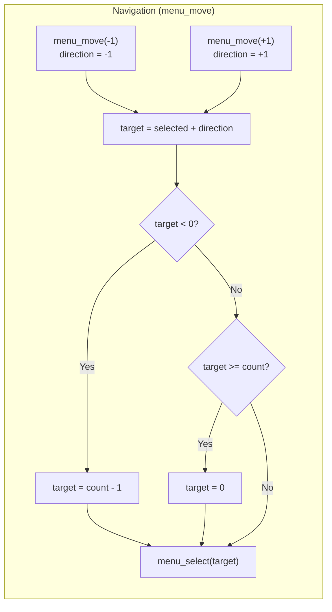

`menu_select()` additionally calls `clear_status()` if a status message is showing, then redraws only the two affected menu items (old and new selection) rather than the full screen.

---

## 8. Flash Operations

### 8.1 Firmware Flash (`action_sd_update`)

Flashes `esp3dfw.bin` from the SD card to a target OTA partition using the ESP-IDF OTA API.

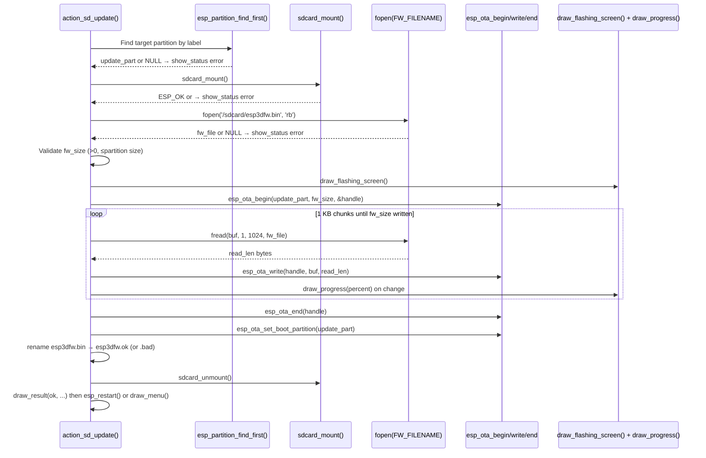

**Error handling:** If any step fails, `esp_ota_abort()` is called, the file is renamed to `.bad`, and the recovery menu is redrawn. Heap size is logged before and after SD mount to aid diagnosing allocation failures on constrained builds.

### 8.2 Resources Flash (`action_sd_update_res`)

Flashes `ui_resources.bin` from the SD card to the `ui_resources` partition using direct partition write (not OTA API, since it is a data partition).

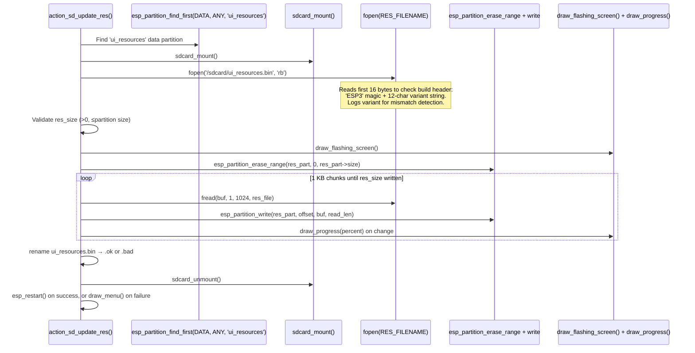

**Build header check:** The first 16 bytes of `ui_resources.bin` contain `"ESP3"` + a 12-character variant string (generated by `generate_resources.py`). This is logged for early detection of board/transport mismatches — the flash is not blocked by a mismatch, only a warning is logged.

### File Naming Convention

| Stage | Firmware filename | Resources filename |
|---|---|---|
| Before flash | `esp3dfw.bin` | `ui_resources.bin` |
| After success | `esp3dfw.ok` | `ui_resources.ok` |
| After failure | `esp3dfw.bad` | `ui_resources.bad` |

This prevents re-flashing a broken binary on subsequent entries if the rename succeeds before the reboot.

---

## 9. Display Layout

The recovery UI uses **font8×16** (not font12×24) because the 480 px canvas is narrower than boards that use the wider font (e.g., `esp32s3_hmi43v3` at 800 px). The 320 px height provides more vertical room than some other boards (e.g., `esp32s3_4827s043c` at 272 px), leaving extra margin with the same layout constants.

```
┌──────────────────────────────────────────────────┐ y=0
│          Recovery v1.x.x   (COLOR_CYAN)          │ y=13
│──────────────────────────────────────── y=40 ────│
│        Active: app0 (default)  (YELLOW)           │ y=45
│ SD:  FW  RES  (right-aligned, GREEN/CYAN)         │ y=68
│──────────────────────────────────────── y=88 ────│
│ ┌────────────────────────────────────┐            │ y=94  MENU_START_Y
│ │  Boot app0   ← highlight box      │ item 0     │       MENU_ITEM_H=34
│ └────────────────────────────────────┘            │
│   Boot app1                                       │ item 1
│   SD -> app0                                      │ item 2
│   SD -> app1                                      │ item 3
│   SD -> resources                                 │ item 4
│                                                   │
│─────────────────────────────── STATUS_Y-7 ───────│
│    Power off to cancel  (or status message)       │ STATUS_Y
│─────────────────────────────── BTN_HINT_BASE_Y ──│
│     ↑              ↓              ✓               │ BTN_HINT_CY
│  (BTN_1/blue)  (BTN_2/blue)  (BTN_3/green)       │
└──────────────────────────────────────────────────┘ y=319
 x=0                                            x=479
```

### Layout Constants

| Constant | Value | Description |
|---|---|---|
| `MENU_START_Y` | 94 | Y of first menu item |
| `MENU_ITEM_H` | 34 | Height per menu item (including gap) |
| `MENU_PAD_X` | 20 | Left/right padding for menu items |
| `FONT_WIDTH` | 8 | Pixel width of one character |
| `FONT_HEIGHT` | 16 | Pixel height of one character |
| `BTN_CIRCLE_R` | 22 | Radius of virtual button circles |
| `BTN_HINT_H` | 53 | Total height of button hint bar (2×22+9) |
| `STATUS_Y` | `SCREEN_HEIGHT - 28 - BTN_HINT_H` | Y of status/footer line |
| `BTN_HINT_BASE_Y` | `SCREEN_HEIGHT - BTN_HINT_H` | Y of hint bar top separator |
| `BTN_HINT_CY` | `BTN_HINT_BASE_Y + 5 + BTN_CIRCLE_R` | Centre Y of all hint circles |
| `BTN_HINT_CX1` | `SCREEN_WIDTH/2 - 100` = 140 | Centre X: up button |
| `BTN_HINT_CX2` | `SCREEN_WIDTH/2` = 240 | Centre X: down button |
| `BTN_HINT_CX3` | `SCREEN_WIDTH/2 + 100` = 340 | Centre X: OK button |

### Color Palette

| Constant | RGB values | Usage |
|---|---|---|
| `MENU_HIGHLIGHT` | `GFX_RGB565(0,80,160)` | Selection box fill |
| `MENU_HIGHLIGHT_TXT` | `GFX_RGB565(80,160,255)` | Selected item text |
| `BTN_NAV_COLOR` | `GFX_RGB565(100,160,255)` | Up/down button icons |
| `BTN_OK_COLOR` | `GFX_RGB565(100,220,100)` | OK/select button icon |
| `BTN_PRESSED_COLOR` | `GFX_RGB565(180,80,220)` | Touch press feedback flash |

---

## 10. Virtual Button and Touch System

Because the board has no physical buttons, the only real input is the capacitive touchscreen. The recovery app renders three **virtual button hints** at the bottom of the screen and maps touch coordinates to them.

### Virtual Button Mapping

| Virtual Button | Icon | Action | Circle Centre X |
|---|---|---|---|
| `BTN_1` | ↑ Up arrow | `menu_move(-1)` | 140 (`SCREEN_WIDTH/2 - 100`) |
| `BTN_2` | ↓ Down arrow | `menu_move(+1)` | 240 (`SCREEN_WIDTH/2`) |
| `BTN_3` | ✓ Check mark | `execute_selected_action()` | 340 (`SCREEN_WIDTH/2 + 100`) |

### Touch Hit Test

The hit test uses **column midpoints between button centres**, not screen thirds, because the icons are clustered around screen centre. Using screen thirds would map BTN_1 and BTN_3 to the wrong columns.

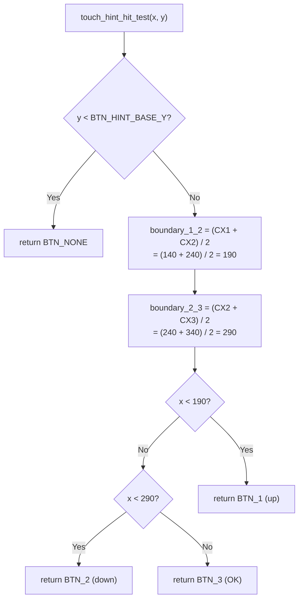

### Touch Event Processing (main loop)

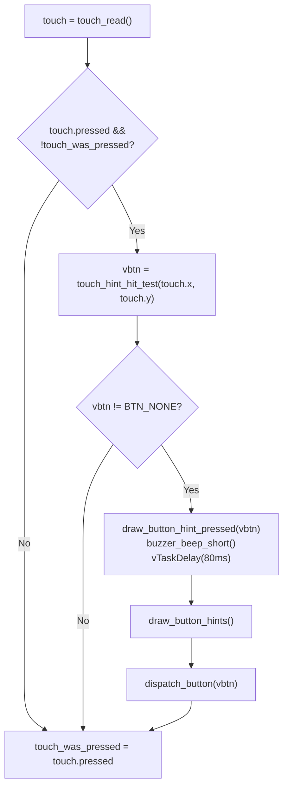

The `touch_was_pressed` edge-detection (`pressed && !was_pressed`) prevents repeated triggers from a held finger. The violet flash (`BTN_PRESSED_COLOR`) and 80 ms delay provide haptic-equivalent visual feedback before the action executes.

### Icon Drawing Primitives

All icon primitives are built from `gfx_hline()` spans only (no diagonal line support required):

| Function | Icon | Geometry |
|---|---|---|
| `draw_circle(cx,cy,r,color)` | Circle outline | Midpoint algorithm, 8-way symmetry |
| `draw_up_arrow(cx,cy,color)` | ↑ Arrow | 7-row head + 10-row stem; fits inside r=22 |
| `draw_down_arrow(cx,cy,color)` | ↓ Arrow | 10-row stem + 7-row head; fits inside r=22 |
| `draw_check_mark(cx,cy,color)` | ✓ Checkmark | 4 px thick, two arms with junction row |

Each button circle is drawn twice (radii `r` and `r-1`) for a bolder outline without a fill.

---

## 11. Snapshot System

The snapshot system is **conditionally compiled** via `#ifdef ENABLE_SNAPSHOT`. When enabled, pressing GPIO0 (the ESP32-S3 BOOT button on the devkit footprint) captures the current screen state to a `.raw` file on the SD card. This is primarily a development and documentation aid.

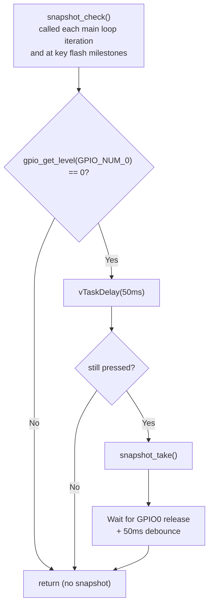

### Snapshot Capture Sequence

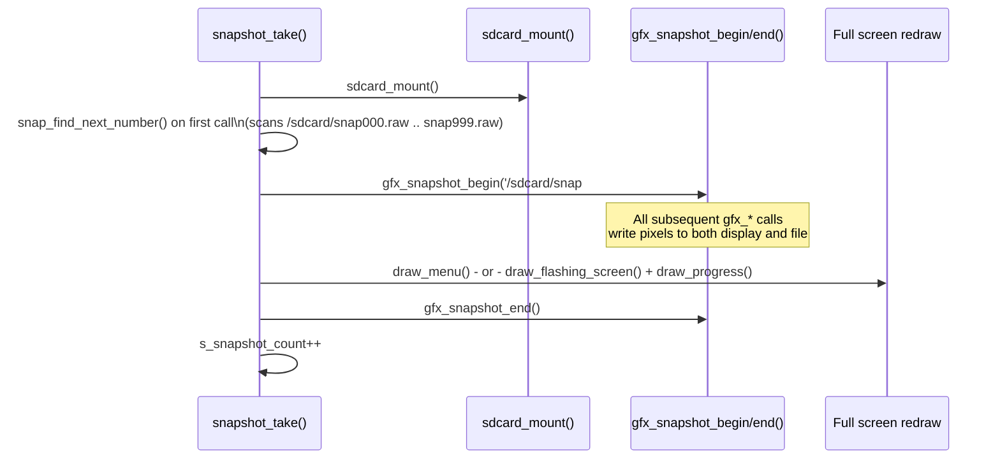

### Snapshot State Variables

| Variable | Purpose |
|---|---|
| `s_snap_in_flash` | `true` during OTA/resource flash; snapshot redraws the flash progress screen instead of the menu |
| `s_flash_last_percent` | Last progress percentage; passed to `draw_progress()` when redrawing during a flash snapshot |
| `s_snapshot_count` | Monotonically incremented after each capture; initialized on first snapshot by scanning existing files |

`snapshot_check()` is also called at these strategic flash checkpoints: after `draw_flashing_screen()`, at each progress percentage update, and after `draw_result()`.

---

## 12. Logging System

### `factory_log.h` Design

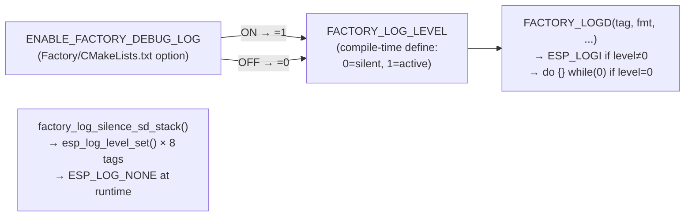

### SD Stack Tags Silenced at Runtime

`factory_log_silence_sd_stack()` (first call in `app_main`) sets these tags to `ESP_LOG_NONE`:

```
"sdmmc"         "vfs_fat_sdmmc"   "sdmmc_periph"   "sdmmc_req"
"sdmmc_common"  "fatfs"           "sdspi"          "sd_diskio"
```

These are silenced because:
- **Production builds (level 0):** `sdkconfig.prod_log` already suppresses them, but runtime silencing ensures correctness if the sdkconfig baseline is ever changed.
- **Debug builds (level 1):** `sdkconfig` ceiling is raised to `INFO` for everything, which makes the SD stack verbose and obscures the factory app's own logic.

ESP-IDF internal startup logs emitted before `app_main()` are handled separately via `sdkconfig.prod_log`, not this runtime mechanism.

---

## 13. Key Constants and Configuration

### Flash Layout Constants

| Constant | Value | Notes |
|---|---|---|
| `OTADATA_OFFSET` | `0x10000` | Standard ESP32-S3 otadata address |
| `OTADATA_SECTOR_SIZE` | `0x1000` | 4 KB |
| `OTADATA_ENTRY_SIZE` | `32` | Bytes per OTA entry |
| `OTADATA_BACKUP_OFFSET` | `0xB000` | **Must match `esp444.cpp` in main firmware** |
| `BACKUP_MAGIC_OFFSET` | `0x40` | Byte offset within backup sector for magic word |
| `BACKUP_MAGIC` | `0xAA55AA55` | Sentinel; **must match main firmware** |

### SD File Paths

| Constant | Path | Description |
|---|---|---|
| `FW_FILENAME` | `/sdcard/esp3dfw.bin` | Main firmware binary |
| `FW_OK_FILENAME` | `/sdcard/esp3dfw.ok` | Rename target on success |
| `FW_BAD_FILENAME` | `/sdcard/esp3dfw.bad` | Rename target on failure |
| `RES_FILENAME` | `/sdcard/ui_resources.bin` | UI resources binary |
| `RES_OK_FILENAME` | `/sdcard/ui_resources.ok` | Rename target on success |
| `RES_BAD_FILENAME` | `/sdcard/ui_resources.bad` | Rename target on failure |

### Flash Buffer

```c
uint8_t buf[1024];   // 1 KB static read buffer — shared by both flash operations
```

A 1 KB static buffer avoids heap fragmentation during recovery. Both `action_sd_update()` and `action_sd_update_res()` reuse this pattern with separate local declarations.

### Menu Limits

| Constant | Value | Description |
|---|---|---|
| `MENU_MAX_ITEMS` | 8 | Maximum total menu entries (array size) |
| Typical count (no app1) | 3 | Boot app0, SD→app0, SD→resources |
| Typical count (with app1) | 5 | + Boot app1, SD→app1 |

---

## 14. Data Flow

### Main Event Loop

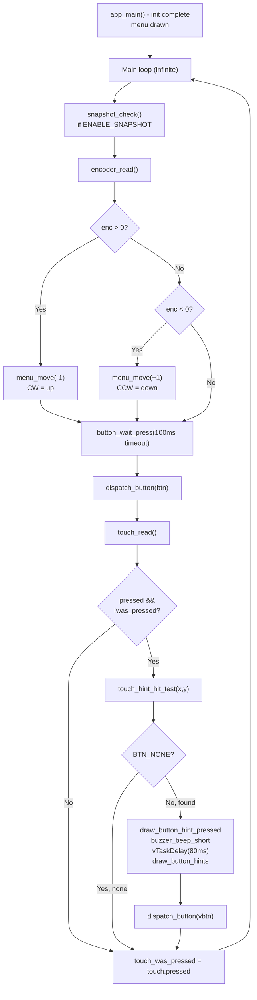

### Action Execution Path

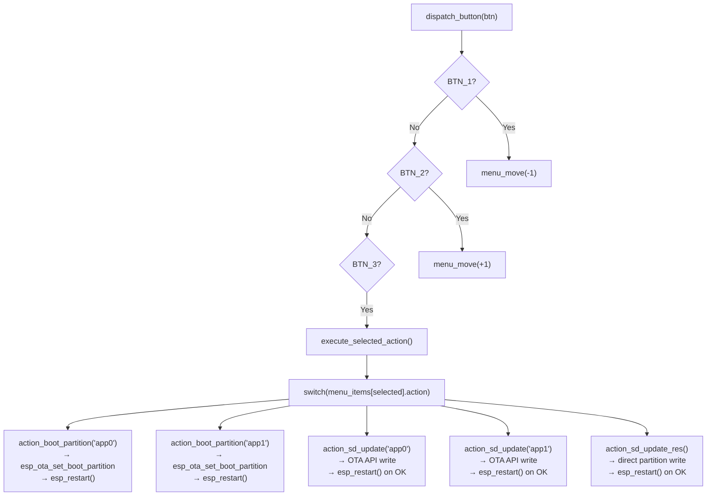

---

## 15. Related Modules

This module orchestrates the recovery application by calling into all sibling modules of `esp32s3_zx3d50ce02s_usrc_4832_factory_app`. Documentation for each subsystem:

| Module | Documentation | Responsibility |
|---|---|---|
| `esp32s3_zx3d50ce02s_usrc_4832_factory_app_display` | [esp32s3\_zx3d50ce02s\_usrc\_4832\_factory\_app\_display.md](esp32s3_zx3d50ce02s_usrc_4832_factory_app_display.md) | GFX abstraction layer (`gfx_*`) and ST7796 I80 driver (`st7796_i80_init`, `st7796_i80_flush_ready_cb`) |
| `esp32s3_zx3d50ce02s_usrc_4832_factory_app_input` | [esp32s3\_zx3d50ce02s\_usrc\_4832\_factory\_app\_input.md](esp32s3_zx3d50ce02s_usrc_4832_factory_app_input.md) | Physical input drivers: buttons, encoder, touch (`touch_read`, `touch_point_t`), buzzer — all are no-ops on this board |
| `esp32s3_zx3d50ce02s_usrc_4832_factory_app_storage` | [esp32s3\_zx3d50ce02s\_usrc\_4832\_factory\_app\_storage.md](esp32s3_zx3d50ce02s_usrc_4832_factory_app_storage.md) | SD card mount/unmount (`sdcard_mount`, `sdcard_unmount`) |
| `esp32s3_zx3d50ce02s_usrc_4832_factory_app_tools` | [esp32s3\_zx3d50ce02s\_usrc\_4832\_factory\_app\_tools.md](esp32s3_zx3d50ce02s_usrc_4832_factory_app_tools.md) | Host-side tooling: `flash_all.py`, `flash_factory.py`, font generator, raw-to-PNG converter |
| `esp32s3_zx3d50ce02s_usrc_4832_bsp` | [esp32s3\_zx3d50ce02s\_usrc\_4832\_bsp.md](esp32s3_zx3d50ce02s_usrc_4832_bsp.md) | Board support package for the main pendant firmware (LVGL integration, `board_init`, I80 vsync callback) — separate from the factory app |

For analogous factory apps on other boards:

- **PiBot Pendant v1.0** (has physical buttons, encoder, buzzer, ILI9341 SPI display): [pibot\_pendant\_v1\_0\_factory\_app\_main.md](pibot_pendant_v1_0_factory_app_main.md)
- **esp32s3\_hmi43v3** (I80 display like this board, but uses TCA9554 IO expander for independent display/touch reset, and RM68120 controller): [esp32s3\_hmi43v3\_factory\_app\_main.md](esp32s3_hmi43v3_factory_app_main.md)

For project-level reference documentation:

- `docs/Factory/` — factory app and bootloader documentation
- `docs/guides/esp32_memory_constraints.md` — heap and fragmentation reference
- `docs/guides/board_build_guidelines.md` — per-board build configuration
- `docs/ui_resources/development.md` — `ui_resources` partition binary format and update mechanisms
