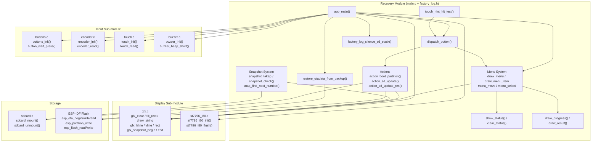
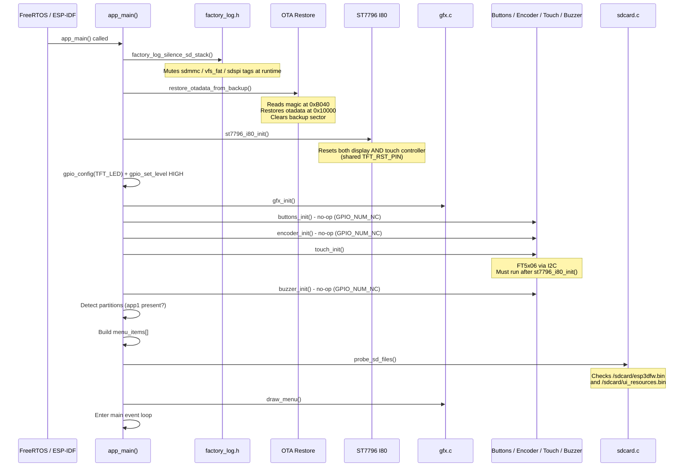
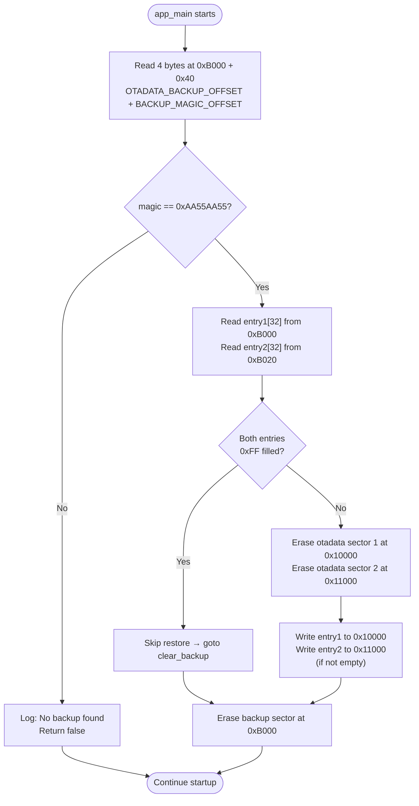
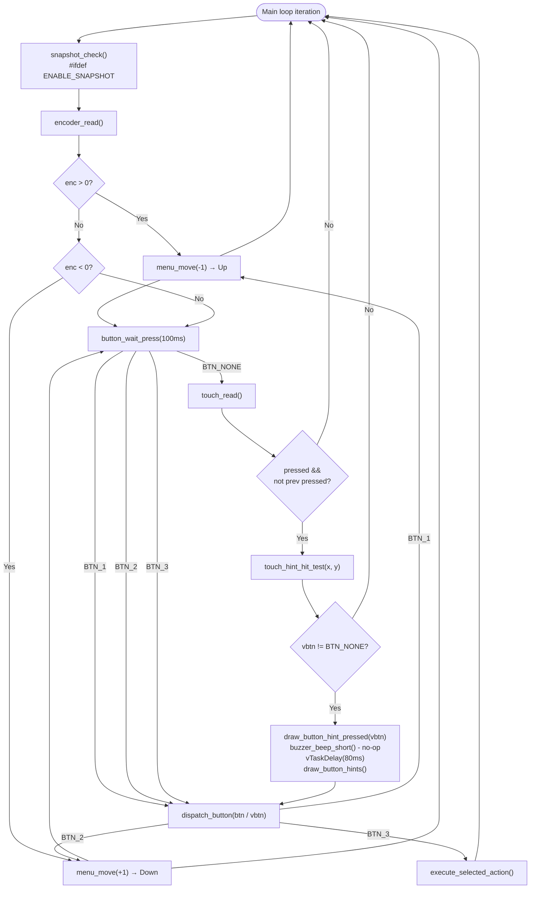
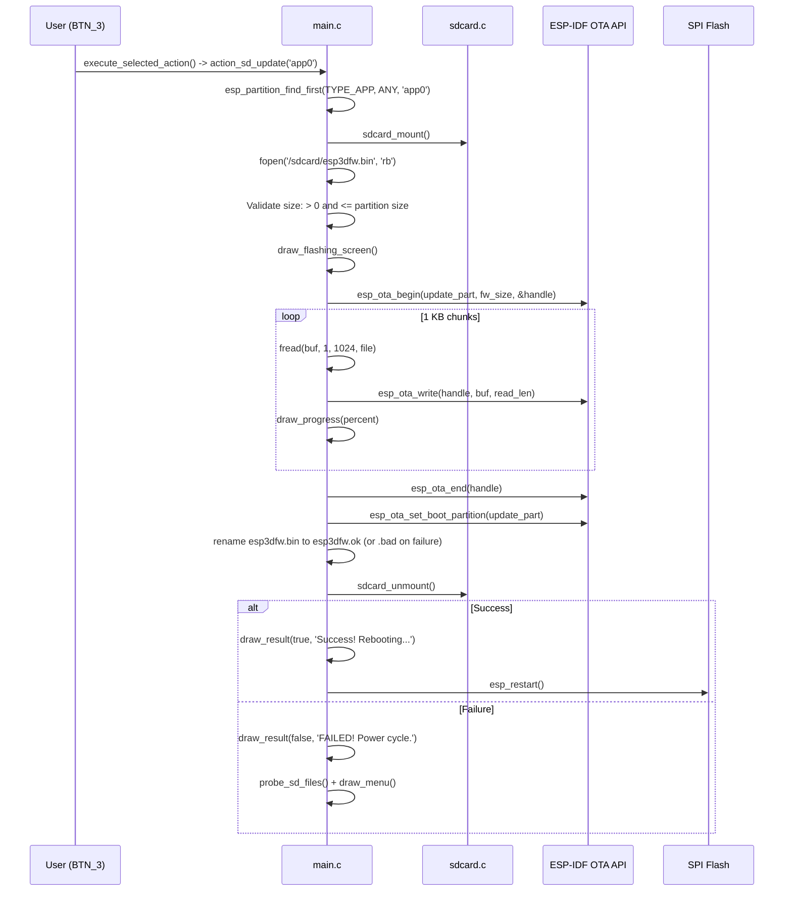
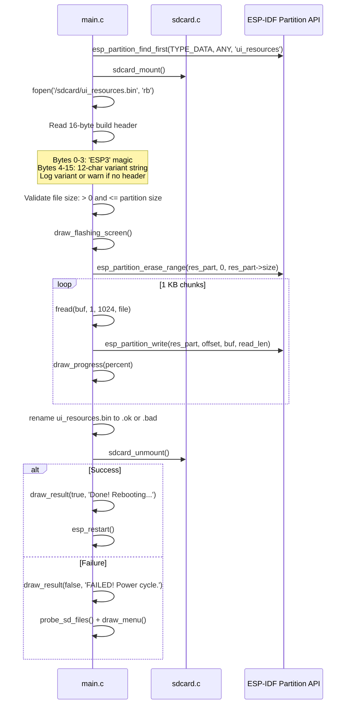
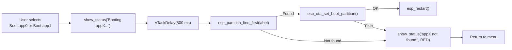
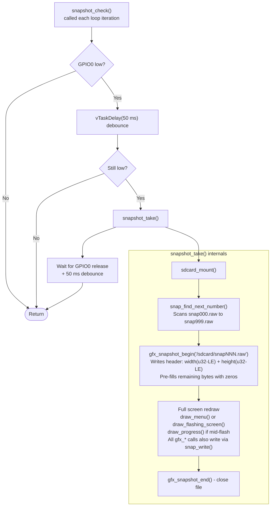
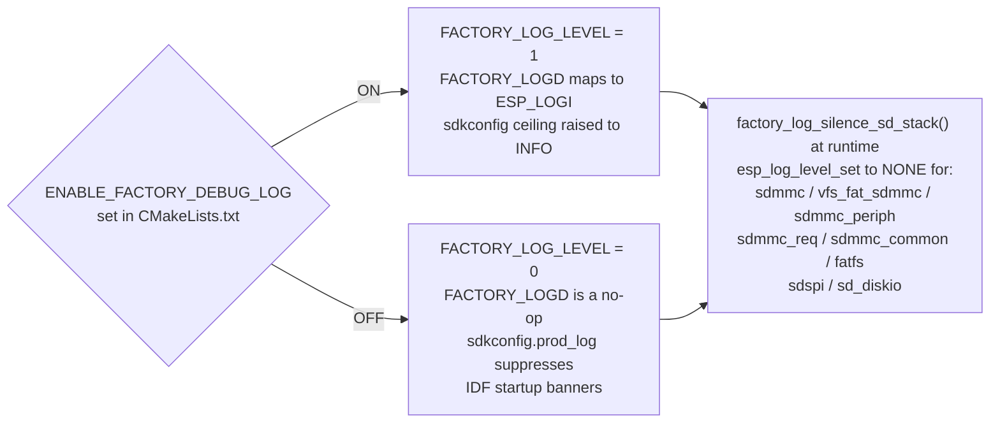
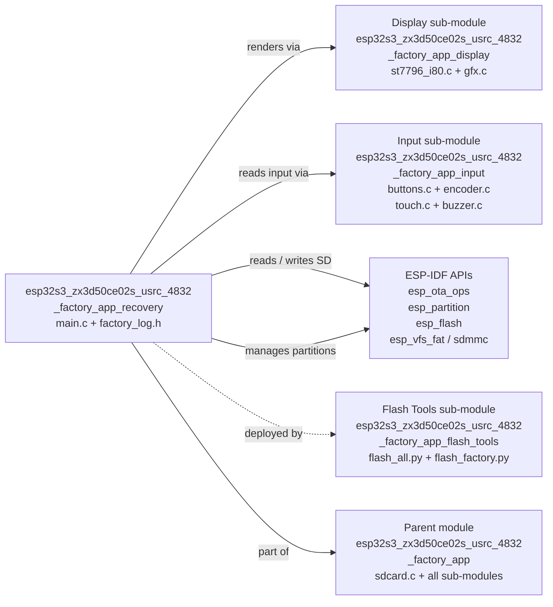

# ESP32S3-ZX3D50CE02S-USRC-4832 Factory Recovery Module

## Overview

The `esp32s3_zx3d50ce02s_usrc_4832_factory_app_recovery` module is the **recovery application logic** embedded in the factory partition of the ESP32S3-ZX3D50CE02S-USRC-4832 board. It provides a minimal, touch-navigable menu that runs independently of the main firmware, allowing field recovery of the device through SD-card-based firmware and resource updates, and manual selection of boot partitions.

This module is the recovery sub-module of the parent [esp32s3_zx3d50ce02s_usrc_4832_factory_app](esp32s3_zx3d50ce02s_usrc_4832_factory_app.md). It is implemented in two files:

| File | Purpose |
|---|---|
| `boards/esp32s3_zx3d50ce02s_usrc_4832/Factory/main/main.c` | Recovery application: menu, OTA restore, SD flash, UI rendering |
| `boards/esp32s3_zx3d50ce02s_usrc_4832/Factory/main/factory_log.h` | Compile-time debug log gating and SD stack silencer |

---

## Board-Specific Constraints

This board has **no physical buttons, no encoder, and no buzzer** — all corresponding GPIO pins are `GPIO_NUM_NC`. Navigation is exclusively **touch-based** using three virtual on-screen buttons rendered at the bottom of the display.

| Hardware | Present | Detail |
|---|---|---|
| Display | ✅ | ST7796, 480×320, Intel 8080 (I80) parallel bus |
| Touch | ✅ | FT5x06, I2C |
| Physical buttons | ❌ | All `GPIO_NUM_NC` |
| Rotary encoder | ❌ | All `GPIO_NUM_NC` |
| Buzzer | ❌ | `GPIO_NUM_NC` |
| SD card | ✅ | SPI bus, FAT filesystem, mounted at `/sdcard` |
| Snapshot (GPIO0) | Optional | `ENABLE_SNAPSHOT` compile flag |

> **Shared reset line**: `TFT_RST_PIN` resets both the ST7796 display panel and the FT5x06 touch controller simultaneously. `st7796_i80_init()` must always run **before** `touch_init()`. See the [Display sub-module](esp32s3_zx3d50ce02s_usrc_4832_factory_app_display.md) for driver details.

The button/encoder/buzzer driver code is **identical to other boards** (e.g., `pibot_pendant_v1_0`) and simply no-ops when the GPIO is `GPIO_NUM_NC`, so the same firmware source builds cleanly for all variants.

---

## Module Architecture



---

## Startup Sequence

`app_main()` runs a strict initialization sequence. The order is critical due to the shared reset line between display and touch.



---

## OTA Data Backup & Restore

This is the first critical operation performed at startup. The main firmware (`esp444.cpp`) backs up the OTA partition table entries to a reserved flash region before switching to the factory partition. The recovery app restores this backup on startup so that power-cycling from recovery always returns the device to the correct firmware slot.



**Flash layout constants** — must match `esp444.cpp` in the main firmware exactly:

| Constant | Value | Description |
|---|---|---|
| `OTADATA_OFFSET` | `0x10000` | Live OTA data region start |
| `OTADATA_SECTOR_SIZE` | `0x1000` | 4 KB per OTA entry sector |
| `OTADATA_ENTRY_SIZE` | `32` | Bytes per OTA entry |
| `OTADATA_BACKUP_OFFSET` | `0xB000` | Backup region (pre-partition space, below `0xC000`) |
| `BACKUP_MAGIC_OFFSET` | `0x40` | Byte offset of magic word within backup sector |
| `BACKUP_MAGIC` | `0xAA55AA55` | Presence sentinel value |

> ⚠️ **`CONFIG_SPI_FLASH_DANGEROUS_WRITE_ALLOWED=y` is required** in the factory sdkconfig. Erasing `0xB000` (below the first partition at `0xD000`) is aborted by default. The factory app is a privileged recovery tool that manages flash directly, making this opt-in intentional.

---

## Recovery Menu System

The menu is a simple indexed list with selection highlight, rendered directly via the GFX layer — no LVGL, no FreeRTOS scheduler dependency beyond `vTaskDelay`. All menu state is stored in module-level globals.

### Menu Data Model

```c
typedef struct {
    const char   *label;    // Display text
    menu_action_t action;   // Action identifier (enum)
    uint16_t      color;    // Text color when not selected
} menu_item_t;

static menu_item_t menu_items[MENU_MAX_ITEMS];  // Max 8 items
static int menu_count    = 0;
static int menu_selected = 0;
```

### Dynamically Built Menu Items

| Menu Item Label | Condition | Action Enum |
|---|---|---|
| `Boot app0` | Always | `MENU_ACTION_BOOT_APP0` |
| `Boot app1` | Only if `app1` partition found | `MENU_ACTION_BOOT_APP1` |
| `SD -> app0` | Always | `MENU_ACTION_SD_UPDATE_APP0` |
| `SD -> app1` | Only if `app1` partition found | `MENU_ACTION_SD_UPDATE_APP1` |
| `SD -> resources` | Always | `MENU_ACTION_SD_UPDATE_RES` |

> This board ships with only `app0`. `app1` items appear only if the partition table includes it.

### Screen Layout

```
┌──────────────────────────────────────────────────────────────┐  y=0
│              Recovery vX.Y.Z                                  │
│                                                               │  y=40
├───────────────────────────────────────────────────────────────┤
│              Active: app0                                     │  y=45
│ SD: FW RES                                                    │  y=68
├───────────────────────────────────────────────────────────────┤  y=88
│ ▌ Boot app0           (selected - highlight box)             │  y=94
│   Boot app1                                                   │  y=128
│   SD -> app0                                                  │  y=162
│   SD -> app1                                                  │  y=196
│   SD -> resources                                             │  y=230
├───────────────────────────────────────────────────────────────┤  STATUS_Y-7
│              Power off to cancel                              │  STATUS_Y
├───────────────────────────────────────────────────────────────┤  BTN_HINT_BASE_Y
│           (▲)          (▼)          (✓)                      │
└──────────────────────────────────────────────────────────────┘  y=320
```

**Layout constants** (480×320 canvas, 8×16 font):

| Constant | Value | Description |
|---|---|---|
| `SCREEN_WIDTH` | 480 | From `hw_config.h` |
| `SCREEN_HEIGHT` | 320 | From `hw_config.h` |
| `MENU_START_Y` | 94 | Y-coordinate of first menu item |
| `MENU_ITEM_H` | 34 | Pixels per menu item row |
| `MENU_PAD_X` | 20 | Left/right padding |
| `FONT_WIDTH` | 8 | Glyph width in pixels |
| `FONT_HEIGHT` | 16 | Glyph height in pixels |
| `BTN_CIRCLE_R` | 22 | Virtual button circle radius |
| `BTN_HINT_H` | `2*R+9` | Total height of the button hint bar |
| `STATUS_Y` | `SCREEN_HEIGHT - 28 - BTN_HINT_H` | Footer / status text Y |
| `MENU_HIGHLIGHT` | `RGB565(0,80,160)` | Dark blue selection box fill |
| `MENU_HIGHLIGHT_TXT` | `RGB565(80,160,255)` | Bright blue selected label |

---

## Input Handling & Event Loop

The main loop polls three input sources concurrently: encoder, physical buttons, and touchscreen. All three converge on `dispatch_button()` with a `button_id_t`, keeping action logic unified regardless of input source.



### Virtual Button Touch Hit-Testing

The three virtual buttons (up / down / ok) are horizontally centered on the screen. The hit-test divides the screen using **midpoints between the icon centers**, not screen-width thirds, to correctly account for the non-uniform icon spacing.

```
Screen width: 480 px

  BTN_HINT_CX1 = 240 - 100 = 140   (▲ up)
  BTN_HINT_CX2 = 240             = 240   (▼ down)
  BTN_HINT_CX3 = 240 + 100 = 340   (✓ ok)

  boundary_1_2 = (140 + 240) / 2 = 190
  boundary_2_3 = (240 + 340) / 2 = 290

  Touch zones (y >= BTN_HINT_BASE_Y only):
    x < 190         -> BTN_1 (up)
    190 <= x < 290  -> BTN_2 (down)
    x >= 290        -> BTN_3 (ok)
```

---

## SD Card Firmware Flash Flow

`action_sd_update(target_label)` flashes `/sdcard/esp3dfw.bin` into the named OTA application partition using the ESP-IDF OTA API.



**SD file naming conventions:**

| File | Role |
|---|---|
| `/sdcard/esp3dfw.bin` | Input — firmware binary to flash |
| `/sdcard/esp3dfw.ok` | Output — renamed from `.bin` on success |
| `/sdcard/esp3dfw.bad` | Output — renamed from `.bin` on failure |
| `/sdcard/ui_resources.bin` | Input — UI resources binary to flash |
| `/sdcard/ui_resources.ok` | Output — renamed from `.bin` on success |
| `/sdcard/ui_resources.bad` | Output — renamed from `.bin` on failure |

---

## SD Card Resource Flash Flow

`action_sd_update_res()` flashes `/sdcard/ui_resources.bin` into the `ui_resources` data partition using direct partition erase + write (not the OTA API, since this is a data partition).



> **Build header**: `ui_resources.bin` files generated by `generate_resources.py` carry a 16-byte prefix: bytes 0–3 are `"ESP3"`, bytes 4–15 are a 12-character null-padded variant string identifying firmware type and transport. This enables early detection of wrong-variant binaries. Legacy binaries without the header are accepted with a log warning.

---

## Boot Partition Selection Flow

`action_boot_partition(label)` uses `esp_ota_set_boot_partition()` to redirect the next boot, then immediately restarts.



---

## SD Probe & Status Indicators

Before rendering the initial menu, `probe_sd_files()` mounts the SD card, checks for both firmware and resource binaries, then unmounts. Two global flags store the result:

```c
static bool sd_has_fw  = false;   // /sdcard/esp3dfw.bin exists
static bool sd_has_res = false;   // /sdcard/ui_resources.bin exists
```

`draw_sd_indicators()` renders a one-line status at y=68 — `FW` in green when firmware is present, `RES` in cyan when resources are present — giving the user immediate visual confirmation before selecting an update action.

---

## Snapshot System (Optional)

When compiled with `ENABLE_SNAPSHOT`, pressing the physical BOOT button (GPIO0) saves a raw screenshot to the SD card. This is a development and diagnostics aid — it works during both the menu display and mid-flash progress screens.



**Raw file format**: 4-byte LE width + 4-byte LE height + `width × height × 2` bytes of RGB565 pixel data in row-major order (no compression; 480×320 = 300 KB per file).

---

## Debug Logging System

`factory_log.h` provides a two-level logging system with independent compile-time and runtime controls.



> `ESP_LOGW` and `ESP_LOGE` are **always active** regardless of `FACTORY_LOG_LEVEL`. Only routine info/progress logs (`FACTORY_LOGD`) are gated. The SD stack silencer is always called because debug builds raise the sdkconfig ceiling globally — making IDF-internal SD chatter visible again — while the factory app only cares about its own logic.

---

## Component Relationships



See also:
- [Display sub-module](esp32s3_zx3d50ce02s_usrc_4832_factory_app_display.md) — ST7796 I80 driver and GFX drawing primitives
- [Input sub-module](esp32s3_zx3d50ce02s_usrc_4832_factory_app_input.md) — buttons, encoder, touch, and buzzer drivers
- [Flash Tools](esp32s3_zx3d50ce02s_usrc_4832_factory_app_flash_tools.md) — Python scripts to flash the factory partition onto the device

---

## Key Functions Reference

| Function | File | Description |
|---|---|---|
| `app_main()` | `main.c` | Recovery entry point; full hardware init + event loop |
| `restore_otadata_from_backup()` | `main.c` | Restores OTA table from flash backup; first call in `app_main` |
| `boot_partition(label)` | `main.c` | Sets OTA boot target by label and triggers `esp_restart()` |
| `action_boot_partition(label)` | `main.c` | UI wrapper: shows status message, calls `boot_partition()` |
| `action_sd_update(label)` | `main.c` | Full SD → OTA flash flow for application partitions |
| `action_sd_update_res()` | `main.c` | Full SD → direct-write flash flow for `ui_resources` data partition |
| `probe_sd_files()` | `main.c` | Mounts SD, checks for `esp3dfw.bin` / `ui_resources.bin`, unmounts |
| `draw_menu()` | `main.c` | Full screen redraw: header + partition info + items + footer + button bar |
| `draw_menu_item(index)` | `main.c` | Renders one menu row with optional selection highlight box |
| `draw_header()` | `main.c` | Clears screen, draws double border, title string, separator |
| `draw_footer_zone()` | `main.c` | Renders status message or default "Power off to cancel" text |
| `draw_sd_indicators()` | `main.c` | Renders `FW` (green) / `RES` (cyan) labels based on SD probe state |
| `draw_button_hints()` | `main.c` | Renders 3 virtual button circles with icons and separator line |
| `draw_button_hint_at(cx,cy,btn,color)` | `main.c` | Draws one button circle + icon at given center coordinates |
| `draw_button_hint_pressed(btn)` | `main.c` | Briefly recolors one virtual button for press feedback |
| `draw_progress(percent)` | `main.c` | Updates the progress bar during flash operations |
| `draw_result(ok, msg)` | `main.c` | Shows success or failure result after a flash operation |
| `draw_flashing_screen()` | `main.c` | Shows "Flashing... Do NOT power off!" full-screen warning |
| `menu_move(direction)` | `main.c` | Moves selection by ±1 with wrap-around; clears status |
| `menu_select(index)` | `main.c` | Sets selection index, clears status, redraws affected rows |
| `dispatch_button(btn)` | `main.c` | Maps BTN_1→up, BTN_2→down, BTN_3→execute; single dispatch point |
| `execute_selected_action()` | `main.c` | Invokes the action of the currently highlighted menu item |
| `touch_hint_hit_test(x, y)` | `main.c` | Maps touch coordinates to virtual BTN_1/2/3 or BTN_NONE |
| `show_status(msg, color)` | `main.c` | Stores and renders a status message in the footer zone |
| `clear_status()` | `main.c` | Clears status message; footer reverts to "Power off to cancel" |
| `snapshot_take()` | `main.c` | Saves a raw RGB565 screenshot to SD (`#ifdef ENABLE_SNAPSHOT`) |
| `snapshot_check()` | `main.c` | Non-blocking GPIO0 poll; triggers `snapshot_take()` on press |
| `snap_find_next_number()` | `main.c` | Scans SD for next available `snapNNN.raw` filename |
| `factory_log_silence_sd_stack()` | `factory_log.h` | Silences ESP-IDF SD/FAT log tags at runtime via `esp_log_level_set` |

---

## Entry Point Trigger

Unlike boards with a physical boot-hold button (e.g., `pibot_pendant_v1_0` with its custom bootloader hook), this board has **no custom bootloader**. Entry to the recovery partition is triggered exclusively by the **main firmware's `[ESP444]FACTORY` command** (`esp444.cpp`), which:

1. Backs up the current OTA partition table entries to flash at `0xB000`
2. Calls `esp_ota_set_boot_partition()` targeting the factory partition
3. Restarts the device

On the next boot, the ESP-IDF bootloader loads the factory app, and `app_main()` restores the OTA table backup before rendering the recovery menu. Power-cycling from recovery therefore returns the device to its original firmware slot without any further user action.
