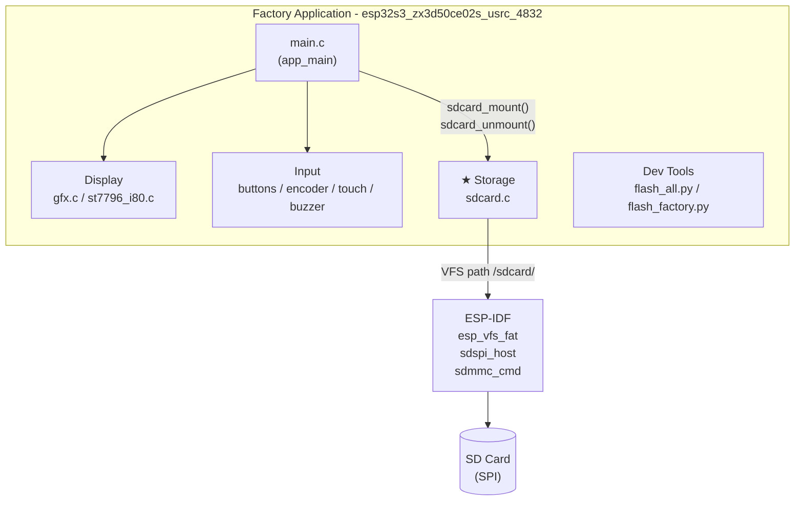
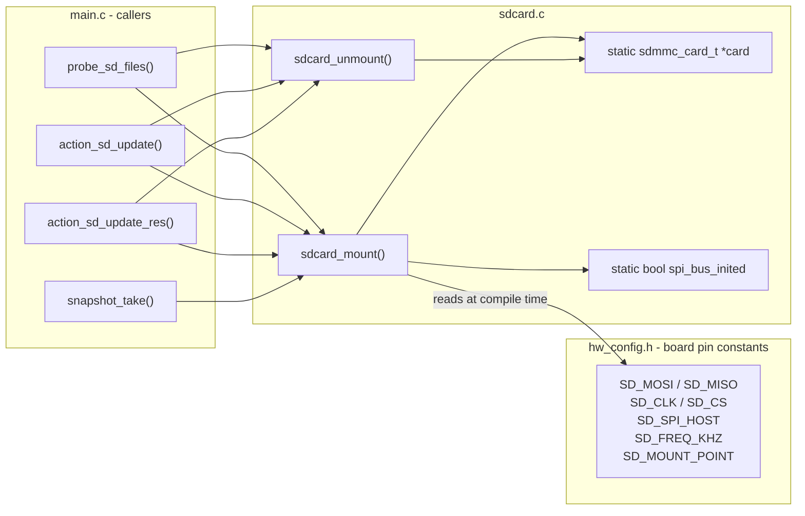
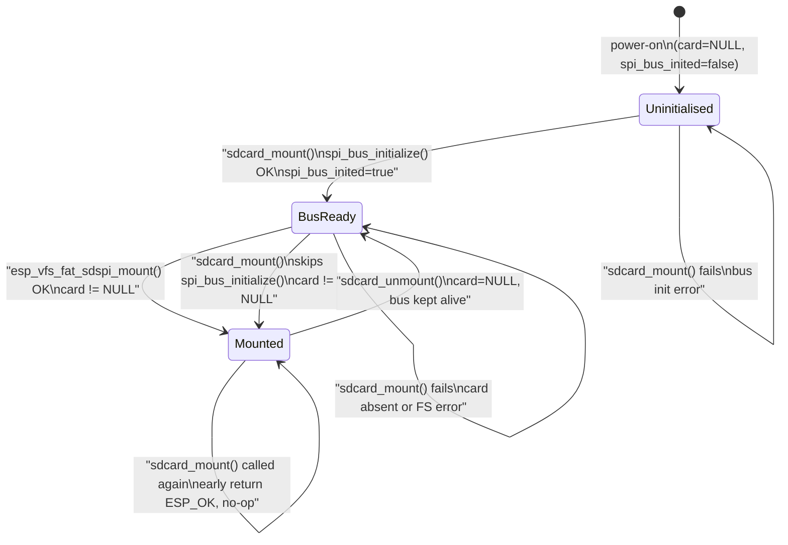
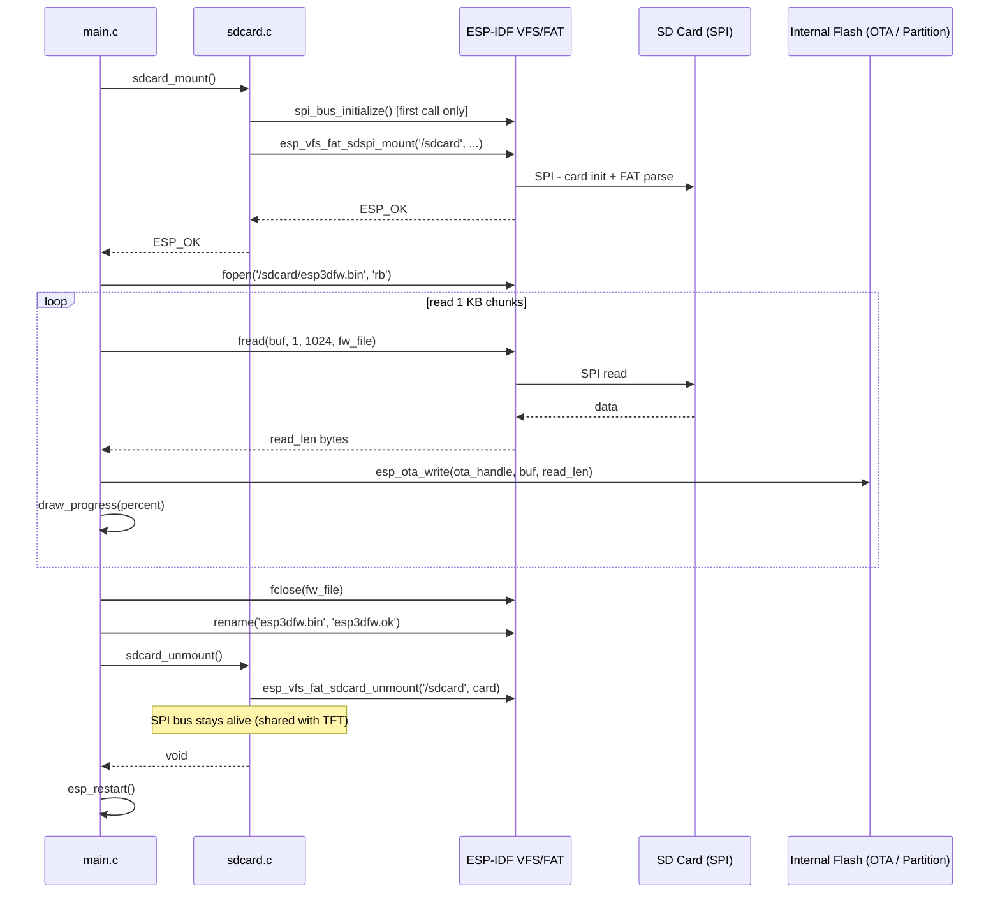
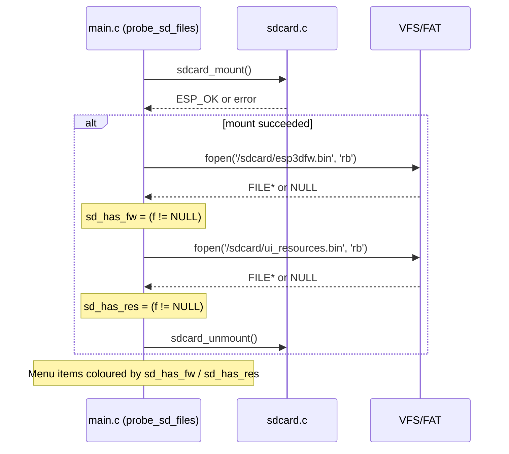
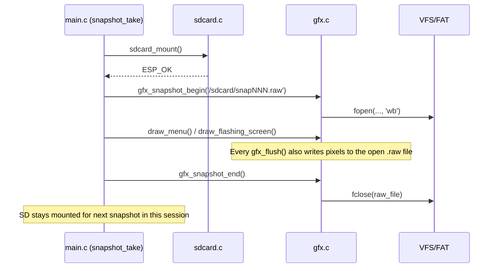

# esp32s3_zx3d50ce02s_usrc_4832 — Factory App: Storage Module

## Overview

The **Storage** sub-module of the `esp32s3_zx3d50ce02s_usrc_4832` factory application provides SD card access to the recovery firmware. It is implemented in a single source file:

```
boards/esp32s3_zx3d50ce02s_usrc_4832/Factory/main/sdcard.c
```

Its two public functions — `sdcard_mount` and `sdcard_unmount` — are the sole gateway between the factory application and the FAT filesystem mounted on the SD card. Every operation that reads from or writes to the SD card (firmware flash, UI resource flash, screen snapshots, file probing) goes through this module.

> **Parent context:** See [esp32s3_zx3d50ce02s_usrc_4832_factory_app](esp32s3_zx3d50ce02s_usrc_4832_factory_app.md) for the complete factory application, and [esp32s3_zx3d50ce02s_usrc_4832_bsp](esp32s3_zx3d50ce02s_usrc_4832_bsp.md) for board hardware configuration.

---

## Module Placement in the Factory Application



---

## Architecture

### Component Relationships



### Dependencies on ESP-IDF

| ESP-IDF Component | Role |
|---|---|
| `driver/spi_common.h` | `spi_bus_initialize()` — initialises the shared SPI bus |
| `driver/sdspi_host.h` | `sdspi_device_config_t`, SD-over-SPI host adapter |
| `esp_vfs_fat.h` | `esp_vfs_fat_sdspi_mount()` / `esp_vfs_fat_sdcard_unmount()` — FAT VFS integration |
| `sdmmc_cmd.h` | `sdmmc_card_t`, `sdmmc_card_print_info()` |
| `esp_log.h` | `ESP_LOGE` / `ESP_LOGW` for always-on error-level logging |
| `factory_log.h` | `FACTORY_LOGD` — debug logging guarded by `FACTORY_LOG_LEVEL` |

---

## Public API

### `sdcard_mount()`

```c
esp_err_t sdcard_mount(void);
```

Initialises the SPI bus (first call only) and mounts the SD card as a FAT VFS at the path defined by `SD_MOUNT_POINT` (typically `/sdcard`).

**Idempotent:** if the internal `card` pointer is non-NULL the function returns `ESP_OK` immediately without re-mounting.

**Returns:**
- `ESP_OK` — card is mounted; the VFS path is accessible via standard POSIX calls (`fopen`, `fread`, `fwrite`, `fclose`, `rename`, `remove`).
- Any `esp_err_t` error code — SPI bus init failed, or the card was not present / could not be mounted.

**Behaviour on first call:**
1. Builds an `spi_bus_config_t` from `hw_config.h` pin constants and calls `spi_bus_initialize()`.
2. Configures `sdspi_device_config_t` with `SD_CS` and `SD_SPI_HOST`.
3. Sets `sdmmc_host_t.max_freq_khz = SD_FREQ_KHZ`.
4. Calls `esp_vfs_fat_sdspi_mount()` with `format_if_mount_failed = false`.
5. Stores the resulting `sdmmc_card_t *` handle.
6. Optionally prints card info to `stdout` when `FACTORY_LOG_LEVEL` is set.

**Side effects:**
- Sets the module-level `spi_bus_inited = true` flag.
- Populates the static `card` pointer.

---

### `sdcard_unmount()`

```c
void sdcard_unmount(void);
```

Unmounts the FAT VFS and clears the `sdmmc_card_t` handle.

**Note:** The SPI bus itself is **intentionally kept initialised** across unmount/re-mount cycles. The SPI peripheral is shared with, or lives next to, the TFT display driver (`st7796_i80`); de-initialising the bus could interfere with it. The bus is reused transparently on the next `sdcard_mount()` call.

---

## State Machine



---

## Data Flow

### Firmware / Resource Flash via SD Card



### File Probing at Startup



### Screen Snapshot to SD Card (optional `ENABLE_SNAPSHOT`)



---

## Hardware Configuration

All pin assignments and bus parameters are board-specific constants resolved from `hw_config.h` at compile time. No raw GPIO numbers appear in `sdcard.c` itself.

| Constant | Role |
|---|---|
| `SD_MOSI` | GPIO — SPI MOSI to SD card |
| `SD_MISO` | GPIO — SPI MISO from SD card |
| `SD_CLK` | GPIO — SPI clock |
| `SD_CS` | GPIO — SD card chip-select |
| `SD_SPI_HOST` | SPI peripheral index (`SPI2_HOST` or `SPI3_HOST`) |
| `SD_FREQ_KHZ` | Maximum SPI clock frequency in kHz |
| `SD_MOUNT_POINT` | VFS mount path string, typically `"/sdcard"` |

> This board drives the ST7796 display panel over an **Intel 8080 (i80)** parallel interface — not SPI. The SD card is the only device on the SPI bus. The `spi_bus_inited` guard ensures the bus is initialised exactly once.

---

## Shared SPI Bus Design Note

`sdcard_unmount()` deliberately omits any call to `spi_bus_free()`:

```c
void sdcard_unmount(void)
{
    if (card) {
        esp_vfs_fat_sdcard_unmount(SD_MOUNT_POINT, card);
        card = NULL;
    }
    /* Keep SPI bus initialized - freeing it can interfere with TFT SPI.
     * The bus will be reused on next mount. */
    FACTORY_LOGD(TAG, "SD card unmounted");
}
```

Rationale:
- `spi_bus_free()` is destructive on a live peripheral that may be in use by another driver.
- The bus is cheap to keep alive without an active card handle.
- On re-mount, `spi_bus_inited = true` is detected and `spi_bus_initialize()` is skipped, reusing the existing bus registration at no cost.

---

## Mount Configuration Detail

```c
esp_vfs_fat_sdmmc_mount_config_t mount_config = {
    .format_if_mount_failed   = false,  // Never auto-format: protects the user's firmware binary
    .max_files                = 4,      // Small ceiling: only a few files opened at a time
    .allocation_unit_size     = 0,      // Use FAT default cluster size
    .disk_status_check_enable = true,   // Detect card removal between successive mounts
};
```

`format_if_mount_failed = false` is a hard safety requirement: the factory app must never reformat an SD card that holds the user's firmware or UI resource images.

---

## Usage Patterns in the Factory Application

All callers follow a strict **mount → operate → unmount** pattern. Each caller is responsible for calling `sdcard_unmount()` before returning to the main menu.

### Pattern 1 — Transient probe (startup and post-failure)

```c
static void probe_sd_files(void)
{
    sd_has_fw  = false;
    sd_has_res = false;
    if (sdcard_mount() != ESP_OK) { return; }
    FILE *f;
    f = fopen(FW_FILENAME,  "rb"); if (f) { sd_has_fw  = true; fclose(f); }
    f = fopen(RES_FILENAME, "rb"); if (f) { sd_has_res = true; fclose(f); }
    sdcard_unmount();
    // result drives menu item highlighting
}
```

### Pattern 2 — Flash operation (user-initiated menu action)

```c
// action_sd_update() / action_sd_update_res()
if (sdcard_mount() != ESP_OK) {
    show_status("No SD card!", COLOR_RED);
    return;
}
// ... open file, validate size, flash 1 KB chunks, draw progress bar ...
fclose(fw_file);
sdcard_unmount();
if (ok) { esp_restart(); } else { probe_sd_files(); draw_menu(); }
```

### Pattern 3 — Screen snapshot (optional `ENABLE_SNAPSHOT`)

```c
// snapshot_take() — triggered by BOOT button (GPIO0)
if (sdcard_mount() != ESP_OK) { return; }
// gfx_snapshot_begin() opens "/sdcard/snapNNN.raw"
// draw_menu() / draw_flashing_screen() writes pixels to both display and file
// gfx_snapshot_end() closes the raw file
// SD intentionally stays mounted for the next snapshot in the same session
```

> **Note:** `snapshot_take()` is the only caller that does **not** immediately unmount after each operation. The card is left mounted to avoid SPI re-negotiation overhead between consecutive snapshots within the same boot session.

---

## SD Card File Inventory

| Filename | Description |
|---|---|
| `esp3dfw.bin` | Main firmware binary to flash via OTA |
| `esp3dfw.ok` | Renamed from `esp3dfw.bin` after a successful flash |
| `esp3dfw.bad` | Renamed from `esp3dfw.bin` after a failed flash |
| `ui_resources.bin` | UI resources partition image (icons, fonts, theme palettes) |
| `ui_resources.ok` | Renamed from `ui_resources.bin` after a successful flash |
| `ui_resources.bad` | Renamed from `ui_resources.bin` after a failed flash |
| `snapNNN.raw` | Raw screen captures (480×320, RGB565), numbered sequentially |

The rename-on-success / rename-on-failure strategy lets the operator distinguish a successful update (`*.ok`) from a corrupted transfer (`*.bad`) on the next inspection of the card.

---

## Error Handling

| Error condition | Detection point | Behaviour |
|---|---|---|
| SPI bus init failure | `sdcard_mount()` — `spi_bus_initialize()` returns error | `ESP_LOGE`, return error code; caller shows red status on display |
| Card not present / mount failure | `sdcard_mount()` — `esp_vfs_fat_sdspi_mount()` returns error | `ESP_LOGW`, return error code; callers gate all file I/O on return value |
| Already mounted (`card != NULL`) | `sdcard_mount()` — early guard | Silent `ESP_OK` return — fully idempotent |
| File not found after successful mount | Caller — `fopen()` returns `NULL` | `sdcard_unmount()` then red status message on display |
| File size invalid or exceeds partition | Caller — range check before write begins | `sdcard_unmount()` then red status message; write never starts |
| Read error mid-flash | Caller — `fread()` returns 0 | `ok = false`; OTA aborted; binary renamed to `*.bad`; `esp_restart()` skipped |

---

## Relationship to Other Board Storage Modules

All boards in this repository share the same two-function `sdcard_mount` / `sdcard_unmount` interface. The only variation between boards is the hardware pin assignments resolved from each board's `hw_config.h`. Functionally equivalent storage modules exist for:

| Board | Documentation |
|---|---|
| pibot_pendant_v1_0 | [pibot_pendant_v1_0_factory_app_storage](pibot_pendant_v1_0_factory_app_storage.md) |
| esp32s3_8048s070c | [esp32s3_8048s070c_factory_app_storage](esp32s3_8048s070c_factory_app_storage.md) |
| esp32s3_bzm_tft35_gt911 | [esp32s3_bzm_tft35_gt911_factory_app_storage](esp32s3_bzm_tft35_gt911_factory_app_storage.md) |
| esp32s3_hmi43v3 | [esp32s3_hmi43v3_factory_app_storage](esp32s3_hmi43v3_factory_app_storage.md) |

For the production firmware's SD card subsystem (as opposed to this factory-time module), see the [Storage & Configuration](Storage_and_Configuration.md) section and `main/modules/filesystem/esp3d_sd.h`.
