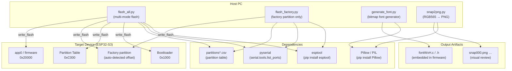
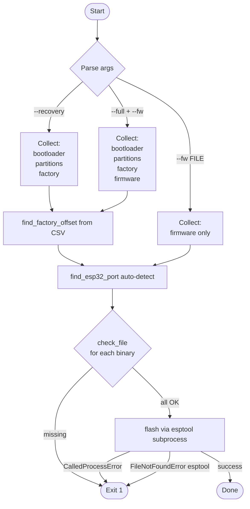
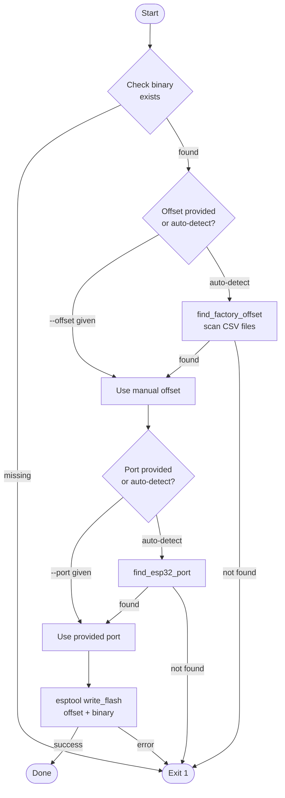
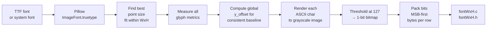
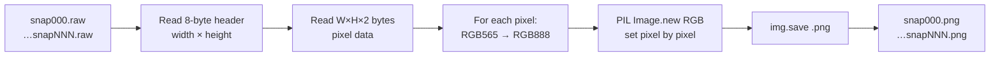
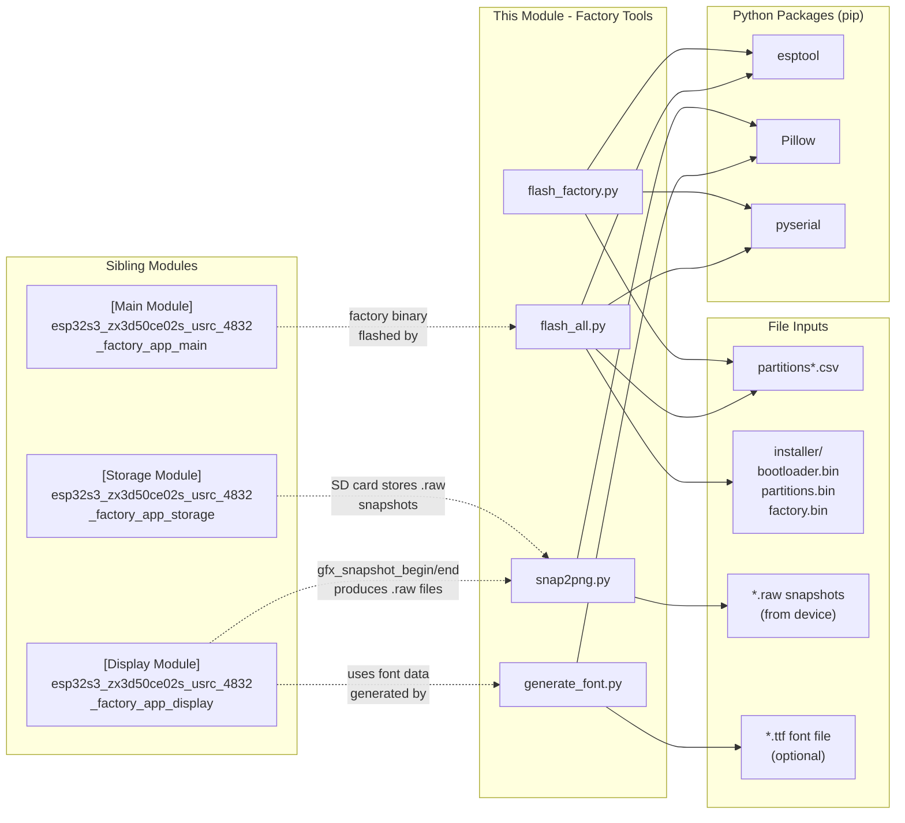
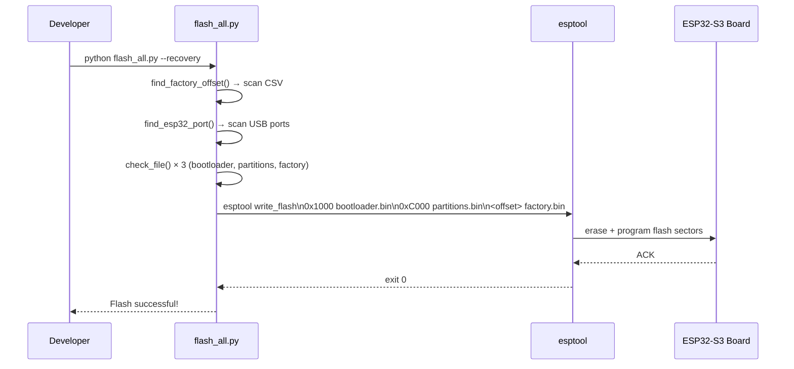
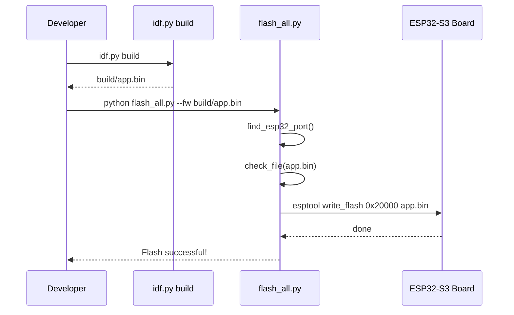
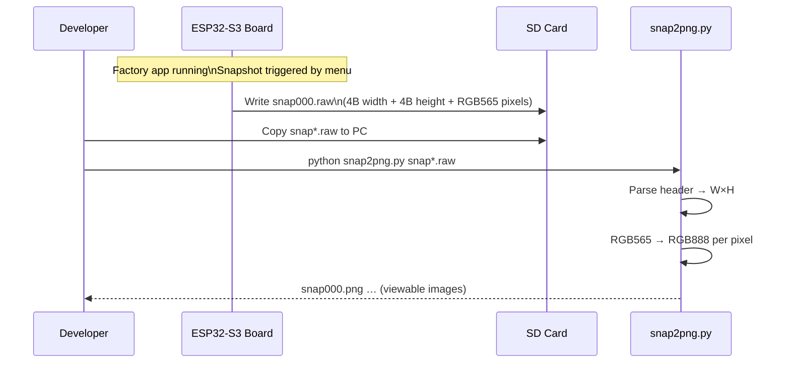
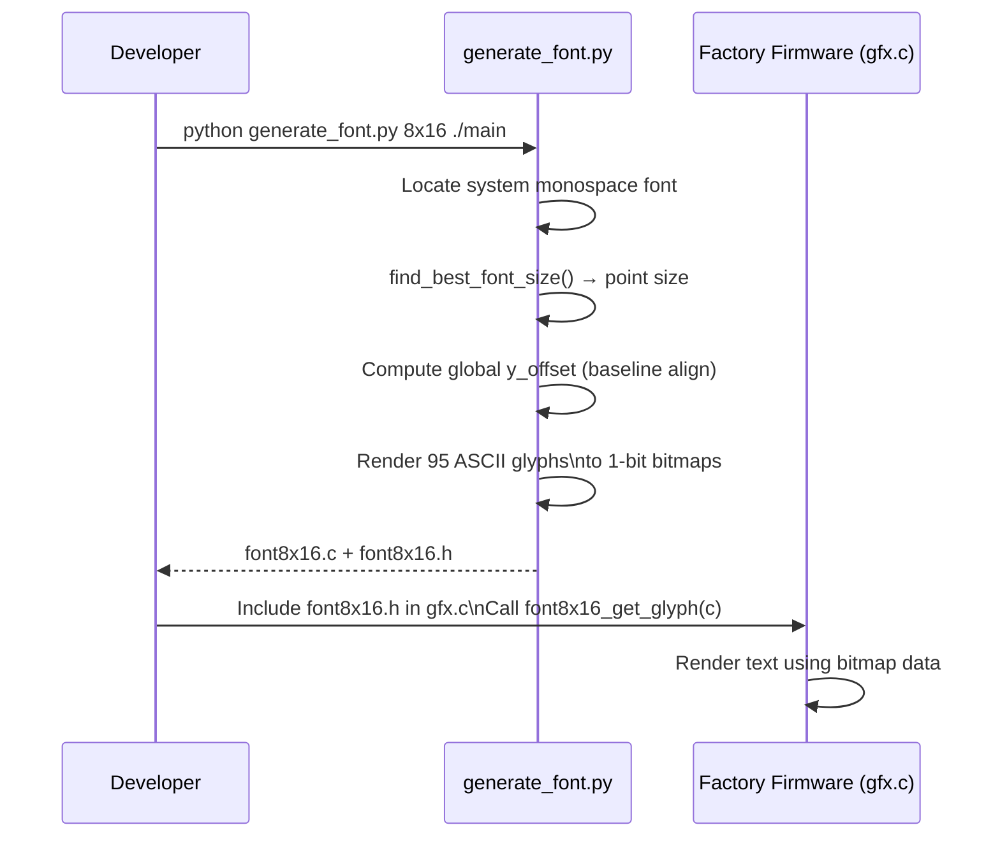

# ESP32-S3 ZX3D50CE02S USRC 4832 — Factory App Tools

## Introduction

This module provides the **host-side Python tooling** bundled with the Factory application for the ESP32-S3 ZX3D50CE02S USRC 4832 board. All scripts run on a development PC (not on the device) and cover the full production and development workflow: flashing firmware, generating embedded bitmap fonts, and converting on-device display snapshots to viewable PNG images.

The four tools live under:

```
boards/esp32s3_zx3d50ce02s_usrc_4832/Factory/tools/
├── flash_all.py               # Multi-mode flash orchestrator
├── flash_factory.py           # Single-partition factory flash
├── generate_font/
│   └── generate_font.py       # Bitmap font C-source generator
└── raw2png/
    └── snap2png.py            # RGB565 snapshot → PNG converter
```

They complement the factory firmware described in [esp32s3_zx3d50ce02s_usrc_4832_factory_app](esp32s3_zx3d50ce02s_usrc_4832_factory_app.md) and are structurally identical to the tools shipped with every other board in the repository (e.g. `pibot_pendant_v1_0`, `esp32s3_8048s070c`, `esp32s3_hmi43v3`).

---

## Architecture Overview



---

## Component Details

### 1. `flash_all.py` — Multi-Mode Flash Orchestrator

The primary flashing entry point. It covers three mutually exclusive modes, supporting everything from first-time production setup to day-to-day firmware iteration.

#### Modes

| Flag | Writes to device |
|------|-----------------|
| `--recovery` | bootloader + partition table + factory app |
| `--full --fw <bin>` | bootloader + partition table + factory app + firmware |
| `--fw <bin>` | firmware only → `app0` at `0x20000` |

#### Flash Address Map

```
0x00000  ┌─────────────────────┐
0x01000  │   Bootloader        │  ← BOOTLOADER_OFFSET
         │                     │
0x0C000  ├─────────────────────┤
         │   Partition Table   │  ← PARTITIONS_OFFSET
0x20000  ├─────────────────────┤
         │   app0 (firmware)   │  ← APP0_OFFSET
         │                     │
         │       …             │
  auto   ├─────────────────────┤
         │   Factory App       │  ← from partitions*.csv
         └─────────────────────┘
```

The factory partition offset is **not hardcoded**: `find_factory_offset()` scans `partitions*.csv` files relative to the working directory and extracts the `factory` subtype row, falling back to `0x7A0000` (8 MB layout default) if no CSV is found.

#### Port Auto-Detection

`find_esp32_port()` queries all available COM/serial ports via `serial.tools.list_ports` and matches against known ESP32 USB-UART chipset keywords (`CP210x`, `CH340`, `CH910x`, `FTDI`). The first matching port is selected; if none match, the lexicographically first available port is used as a last resort.

#### Execution Flow



#### Usage Examples

```bash
# First-time production setup
python flash_all.py --recovery

# Specify port explicitly
python flash_all.py --recovery --port COM3

# Complete flash (production + firmware)
python flash_all.py --full --fw build/pibot_pendant.bin

# Development iteration: firmware only
python flash_all.py --fw build/pibot_pendant.bin
```

---

### 2. `flash_factory.py` — Factory Partition Flash

A focused script for updating **only** the factory recovery partition on an already-configured device. Useful when the production firmware has been updated and needs a fresh factory image without disturbing the rest of the flash.

Shares the same `find_factory_offset()` and `find_esp32_port()` logic as `flash_all.py`, and calls `esptool` directly via `subprocess`.

#### Execution Flow



#### Usage Examples

```bash
# Auto-detect everything
python flash_factory.py

# Specify port
python flash_factory.py --port /dev/ttyUSB0

# Custom binary and manual offset
python flash_factory.py --bin my_factory.bin --offset 0x7A0000

# Custom baud rate
python flash_factory.py --port COM3 --baud 115200
```

---

### 3. `generate_font/generate_font.py` — Bitmap Font Generator

Generates a **1-bit-per-pixel bitmap font** as ready-to-compile C source files (`.c` + `.h`) for embedding in the factory firmware. This is the font used by the factory app's raw display layer (see [esp32s3_zx3d50ce02s_usrc_4832_factory_app_display](esp32s3_zx3d50ce02s_usrc_4832_factory_app_display.md)).

#### Font Format

- **Coverage**: ASCII printable range `0x20` (space) through `0x7E` (tilde) — 95 characters
- **Encoding**: 1 bit per pixel, MSB = leftmost pixel, packed into `(width + 7) / 8` bytes per row
- **Storage**: `bytes_per_row × height × 95` bytes total in flash

```
Glyph layout for 8×16 font:
  byte 0: row 0, pixels 7-0
  byte 1: row 1, pixels 7-0
  …
  byte 15: row 15, pixels 7-0

Access: font8x16_get_glyph('A')  → const uint8_t* (16 bytes)
```

#### Rendering Pipeline



#### Vertical Alignment Algorithm

Rather than aligning each glyph independently (which causes visual inconsistency), the generator:
1. Scans all characters to find the global `max_top` (highest ascender) and `max_bottom` (lowest descender).
2. Computes a single `y_offset` that vertically centers the entire glyph set within the target cell height.
3. Uses this same offset for all 95 characters, ensuring consistent baseline across the rendered font.

#### Font Search Priority

1. `--font path/to/font.ttf` (explicit)
2. System monospace fonts searched in order:
   - Linux: DejaVu Sans Mono, Liberation Mono
   - macOS: Menlo, Monaco, Courier New
   - Windows: Consolas, Courier New, Lucida Console

#### Generated API

```c
/* fontWxH.h */
#define FONT_WIDTH           W
#define FONT_HEIGHT          H
#define FONT_BYTES_PER_ROW   ((W + 7) / 8)

const uint8_t *fontWxH_get_glyph(char c);
/* Returns FONT_BYTES_PER_ROW * FONT_HEIGHT bytes.
   Characters outside 0x20-0x7E return the space glyph. */
```

#### Usage Examples

```bash
# 8×16 font, output to current directory
python generate_font.py 8x16 .

# 8×16 with DOS-style CP437 font
python generate_font.py 8x16 ./main --font "Perfect DOS VGA 437.ttf"

# 6×12 compact font
python generate_font.py 6x12 ./main

# 10×20 larger font with custom TTF
python generate_font.py 10x20 ./main --font /path/to/MyFont.ttf
```

#### Flash Usage Reference

| Size | Bytes/Glyph | Total (95 chars) |
|------|-------------|------------------|
| 6×12 | 12 | 1,140 bytes |
| 8×16 | 16 | 1,520 bytes |
| 10×20 | 30 | 2,850 bytes |
| 12×24 | 36 | 3,420 bytes |

---

### 4. `raw2png/snap2png.py` — RGB565 Snapshot Converter

Converts raw display snapshots captured by the factory app (see `gfx_snapshot_begin` / `gfx_snapshot_end` in [esp32s3_zx3d50ce02s_usrc_4832_factory_app_display](esp32s3_zx3d50ce02s_usrc_4832_factory_app_display.md)) into standard PNG images for visual inspection and debugging.

#### Raw File Format

```
Offset  Size  Description
──────  ────  ─────────────────────────────────────
0x00    4     Width  (uint32_t, little-endian)
0x04    4     Height (uint32_t, little-endian)
0x08    W×H×2 Raw RGB565 pixels, row-major order
```

#### RGB565 → RGB888 Conversion

```
RGB565 bit layout:  RRRRR GGGGGG BBBBB

R8 = (R5 << 3) | (R5 >> 2)   — scale 0-31 → 0-255
G8 = (G6 << 2) | (G6 >> 4)   — scale 0-63 → 0-255
B8 = (B5 << 3) | (B5 >> 2)   — scale 0-31 → 0-255
```

The bit-expansion replicates the most significant bits into the vacated low bits, giving accurate brightness scaling across the full 8-bit range.

#### Conversion Flow



#### Usage Examples

```bash
# Convert single file (output: snap000.png)
python snap2png.py snap000.raw

# Convert all raw files in directory
python snap2png.py snap*.raw

# Convert single file with custom output name
python snap2png.py snap000.raw -o screenshot.png

# Process specific range
python snap2png.py snap00?.raw
```

---

## Module Dependencies



---

## Workflow Integration

### Production / First-Time Flash



### Firmware Development Cycle



### Snapshot Debug Workflow



### Font Generation Workflow



---

## Cross-Board Applicability

This tools module is **board-agnostic** in practice. Identical scripts (same functions, same logic) are present in every board's Factory tools directory:

| Board | Tools Module |
|-------|-------------|
| pibot_pendant_v1_0 | `pibot_pendant_v1_0_factory_app_tools` |
| esp32s3_8048s070c | `esp32s3_8048s070c_factory_app_tools` |
| esp32s3_bzm_tft35_gt911 | `esp32s3_bzm_tft35_gt911_factory_app_tools` |
| esp32s3_hmi43v3 | `esp32s3_hmi43v3_factory_app_tools` |
| esp32s3_zx3d50ce02s_usrc_4832 | **this module** |

The only board-specific element is the **factory partition offset**, which is always derived at runtime from the board's `partitions*.csv` — no hardcoding required.

---

## Prerequisites

Install all required Python packages before running any tool:

```bash
pip install esptool pillow pyserial
```

| Package | Used By | Purpose |
|---------|---------|---------|
| `esptool` | `flash_all.py`, `flash_factory.py` | ESP32 flash programming |
| `Pillow` | `generate_font.py`, `snap2png.py` | Image/font rendering |
| `pyserial` | `flash_all.py`, `flash_factory.py` | Serial port enumeration |

---

## Related Documentation

- [Factory App (parent module)](esp32s3_zx3d50ce02s_usrc_4832_factory_app.md) — overall factory application structure
- [Display Subsystem](esp32s3_zx3d50ce02s_usrc_4832_factory_app_display.md) — `gfx.c` snapshot capture and font rendering (consumer of `generate_font.py` output and producer of `.raw` files)
- [Storage Subsystem](esp32s3_zx3d50ce02s_usrc_4832_factory_app_storage.md) — SD card mount/unmount used to retrieve `.raw` snapshots
- [Main Application](esp32s3_zx3d50ce02s_usrc_4832_factory_app_main.md) — menu, SD update actions, and snapshot orchestration
- [Build & Development Tools](Build_and_Development_Tools.md) — host-side resource generation tools (`generate_resources.py`, `png_to_lvgl_c.py`, etc.) for the main firmware
