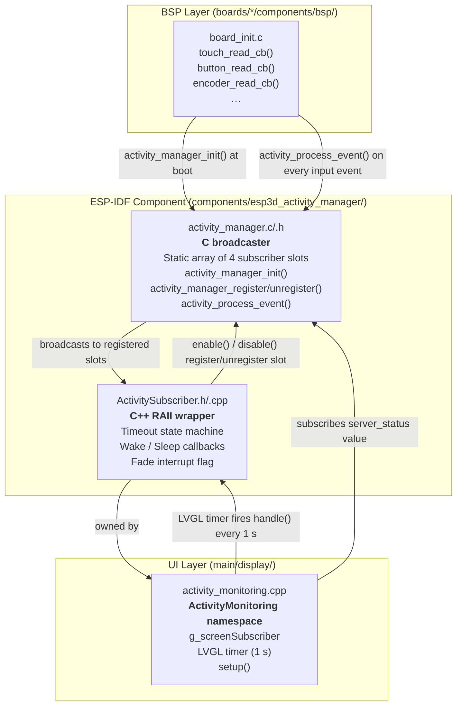
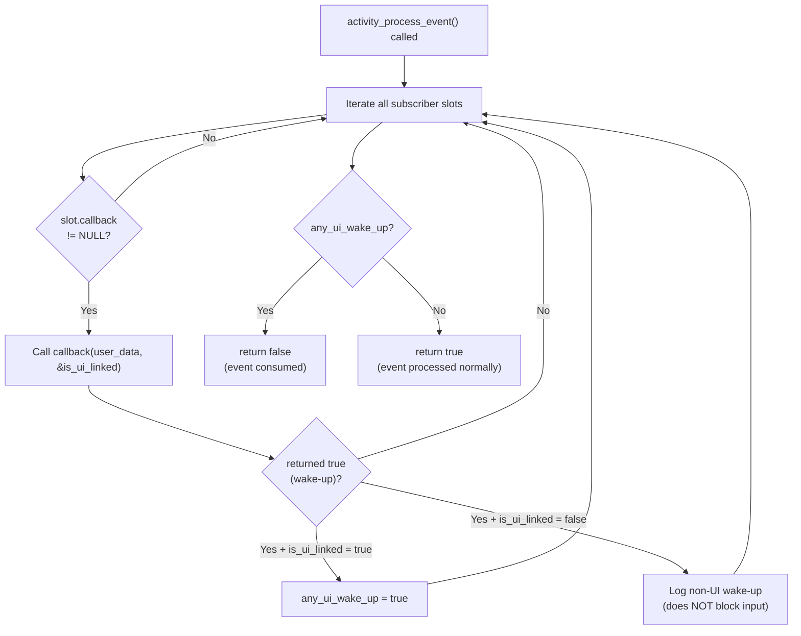
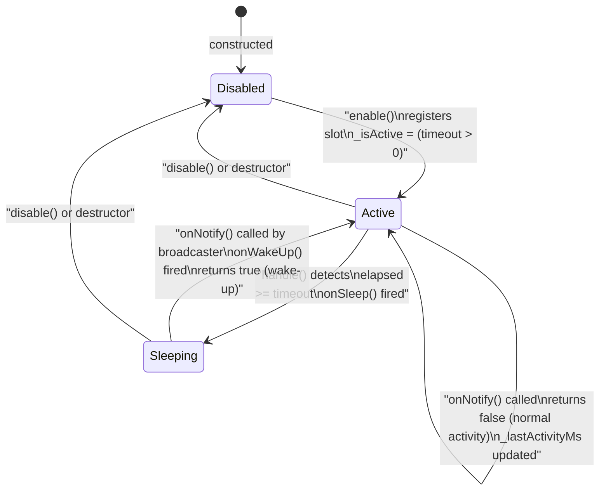
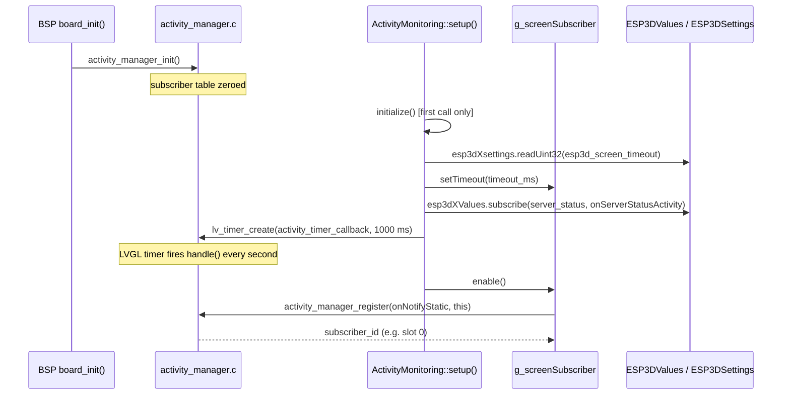
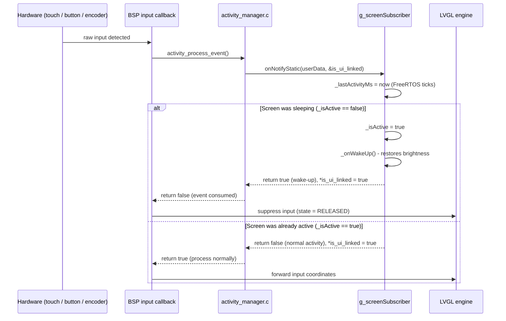
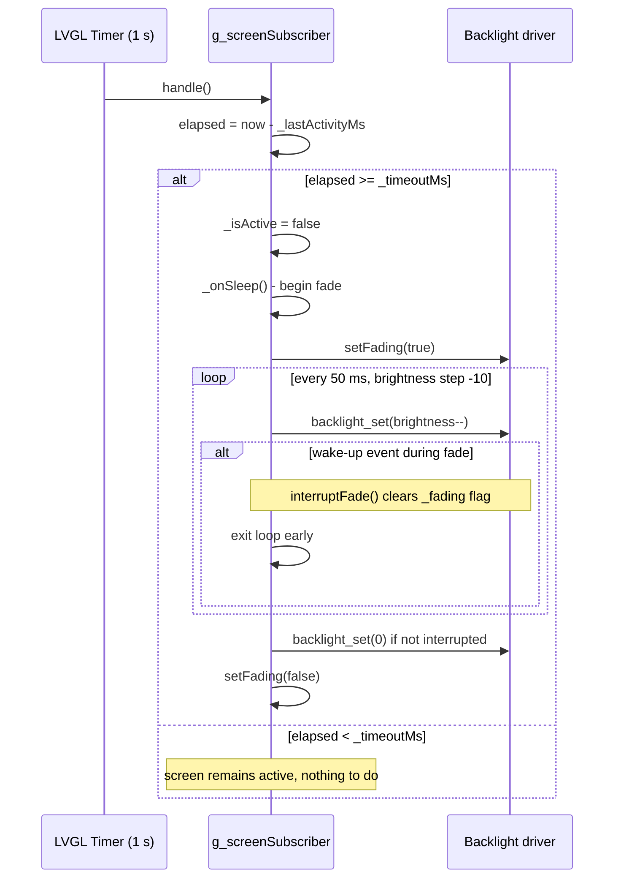
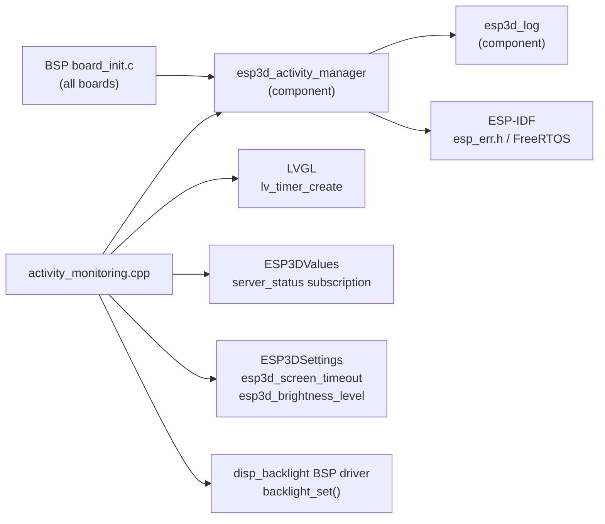

# ESP3D Activity Manager

## Overview

The `esp3d_activity_manager` module provides a **centralized user-activity detection and notification system** for the pendant firmware. Its primary responsibilities are:

- **Detecting user input** (touch, buttons, encoder, potentiometer) across every board's BSP input callbacks.
- **Broadcasting activity events** to all interested subscribers through a lightweight, zero-heap broadcaster.
- **Managing inactivity timeouts** per subscriber, triggering sleep and wake-up callbacks with an associated screen-dimming fade animation.
- **Controlling input consumption**: when the screen wakes up from sleep, the first touch event is swallowed so it does not accidentally activate a UI element.

The module is a required ESP-IDF component, initialized by every supported board's BSP `board_init()`, and consumed from the UI layer through the `ActivityMonitoring` namespace.

---

## Architecture

The module is split into three layers, each with a clearly bounded role:



### Component files

| File | Language | Role |
|---|---|---|
| `components/esp3d_activity_manager/activity_manager.h` | C | Public C API, types, constants |
| `components/esp3d_activity_manager/activity_manager.c` | C | Broadcaster implementation |
| `components/esp3d_activity_manager/ActivitySubscriber.h` | C++ | RAII wrapper declaration |
| `components/esp3d_activity_manager/ActivitySubscriber.cpp` | C++ | RAII wrapper implementation |
| `main/display/activity_monitoring.h` | C++ | `ActivityMonitoring` public API |
| `main/display/activity_monitoring.cpp` | C++ | Screen subscriber + LVGL timer |

---

## C Layer: `activity_manager`

### Types and Constants

```c
// Maximum number of simultaneous subscribers (compile-time, default 4)
#ifndef ACTIVITY_MANAGER_MAX_SUBSCRIBERS
#define ACTIVITY_MANAGER_MAX_SUBSCRIBERS 4
#endif

// Subscriber handle type
typedef uint8_t activity_subscriber_id_t;
#define ACTIVITY_SUBSCRIBER_ID_INVALID 0xFF

// Callback signature:
// - user_data:    context pointer provided at registration
// - is_ui_linked: output — set true if this subscriber is tied to the UI
// - returns true  on wake-up (first activity after sleep) → event consumed
// - returns false for normal activity                     → event processed
typedef bool (*activity_callback_t)(void *user_data, bool *is_ui_linked);
```

The internal subscriber table is a **static array** in DRAM — no heap allocation, no fragmentation risk:

```c
typedef struct {
    activity_callback_t callback;
    void *user_data;
} subscriber_entry_t;

static subscriber_entry_t subscribers[ACTIVITY_MANAGER_MAX_SUBSCRIBERS];
```

### Public API

| Function | Description |
|---|---|
| `activity_manager_init()` | Zero-fills the subscriber table. Called once by BSP `board_init()`. |
| `activity_manager_register(callback, user_data)` | Finds the first empty slot and stores the callback. Returns the slot index (ID) or `ACTIVITY_SUBSCRIBER_ID_INVALID`. |
| `activity_manager_unregister(id)` | Clears the slot. Returns `ESP_ERR_INVALID_ARG` or `ESP_ERR_NOT_FOUND` on misuse. |
| `activity_process_event()` | Calls every non-null callback. Returns **`true`** if the event should be forwarded to LVGL, **`false`** if a UI-linked subscriber just woke up and the event must be consumed. |
| `activity_manager_get_subscriber_count()` | Returns the number of active (non-null) slots. |

### Event Processing Logic



---

## C++ Layer: `ActivitySubscriber`

`ActivitySubscriber` is a **move-only RAII object** that wraps a subscriber slot with:

- A configurable inactivity **timeout** (`uint64_t`, milliseconds, measured via FreeRTOS ticks).
- A **wake-up callback** (`std::function<void()>`) invoked the first time activity is detected after the subscriber has slept.
- A **sleep callback** invoked once the timeout elapses with no intervening activity.
- A **`linkedToUI`** flag controlling whether a wake-up causes the triggering input event to be consumed by LVGL or not.
- A **shared `_fading` flag** (static, volatile) that allows the sleep fade loop to be interrupted cleanly by a concurrent wake-up.

### State Machine



### Key Methods

| Method | Description |
|---|---|
| `enable()` | Registers with the activity manager; starts the inactivity clock. Idempotent guard — returns `false` if already registered. |
| `disable()` | Unregisters the slot. Called automatically by the destructor. |
| `handle()` | Called from the LVGL timer every 1 s. Checks `elapsed >= _timeoutMs`; if true, transitions to sleeping and fires `_onSleep`. |
| `onNotify(is_ui_linked*)` | Internal callback invoked via static trampoline. Updates `_lastActivityMs`. Returns `true` on wake-up transition, `false` on normal activity. Sets `*is_ui_linked` from `_linkedToUI`. |
| `setTimeout(ms)` | Updates the timeout and resets the activity clock. Safe to call while enabled. |
| `getElapsedTime()` | Returns milliseconds since last detected activity. |
| `isActive()` | `true` while the subscriber is awake and the timeout has not elapsed. |
| `isFading()` / `setFading()` / `interruptFade()` | Static helpers for coordinating the backlight fade animation between sleep and wake callbacks. |

### `linkedToUI` flag

This flag differentiates two classes of subscribers:

| `linkedToUI` | Behaviour on wake-up |
|---|---|
| `true` (e.g., screen backlight) | `activity_process_event()` returns `false` → BSP **suppresses the input** so the first touch does not fire a UI action. |
| `false` (e.g., MPG encoder) | `activity_process_event()` returns `true` → BSP **processes the input normally** — physical controls always respond immediately, even when waking the screen. |

---

## UI Layer: `ActivityMonitoring` namespace

Defined in `main/display/activity_monitoring.h/.cpp`, this namespace owns the concrete screen subscriber and ties it to the LVGL event loop.

### Global screen subscriber

```cpp
ActivitySubscriber g_screenSubscriber(
    0,              // timeout disabled initially; set by initialize() from NVS
    wakeUpCallback, // restores saved brightness; emits ESP3D_WAKEUP_SOUND
    sleepCallback,  // gradual fade: current brightness → 0 in 50 ms steps,
                    //               interruptible by concurrent wake-up
    true            // linkedToUI: consume first touch on wake-up
);
```

The **sleep callback** performs a blocking fade inside a `vTaskDelay` loop. On each iteration it checks `ActivitySubscriber::isFading()` — if a concurrent wake-up clears the flag via `interruptFade()`, the loop exits early and leaves the backlight at its current level. The **wake-up callback** then restores it to the NVS-saved brightness (`esp3d_brightness_level`).

### Initialization sequence



`ActivityMonitoring::setup()` is **idempotent**: safe to call from multiple screens. The internal `system_initialized` flag ensures `initialize()` runs only once. A subsequent call just calls `enable()` if the subscriber is not yet registered.

Called from: `main/display/cnc/screens/main_screen.cpp` (`create()` function).

### Server status as an activity source

In addition to direct hardware input, any change to the `server_status` observable value (see [values](values.md)) triggers an activity event:

```cpp
static bool onServerStatusActivity(ESP3DValuesIndex idx,
                                    const char *value,
                                    ESP3DValuesCbAction action)
{
    if (idx == ESP3DValuesIndex::server_status) {
        activity_process_event();   // keeps screen awake on connection events
    }
    return true;   // remain subscribed
}
```

This prevents the screen from going dark during CNC connection-state changes (connecting, connected, disconnecting).

### Timeout configuration

The timeout value is read from NVS at initialization:

```
ESP3DSettingIndex::esp3d_screen_timeout  →  uint32_t (seconds)  →  converted to ms
```

It can be updated at runtime from the Screen Timeout settings screen (`main/display/screens/screen_timeout_screen.cpp`):

```cpp
ActivityMonitoring::g_screenSubscriber.setTimeout(timeout_ms);
```

A `setTimeout()` call while the subscriber is enabled resets the inactivity clock and marks `_isActive = true`, preventing an immediate spurious sleep trigger.

---

## Data Flow: Input Event to Screen Wake-Up



---

## Data Flow: Inactivity Timeout → Screen Sleep



---

## BSP Integration Pattern

Every supported board's `board_init()` follows the same pattern:

```c
// 1. Initialize at board startup (before LVGL starts)
ret = activity_manager_init();

// 2a. In touch / button callbacks — on press start:
//     Check if the event should reach LVGL or be consumed for wake-up.
if (activity_process_event()) {
    // Event processed normally — forward coordinates to LVGL
    data->state   = LV_INDEV_STATE_PRESSED;
    data->point.x = x;
    data->point.y = y;
} else {
    // Event consumed for screen wake-up — do not forward to LVGL
    data->state = LV_INDEV_STATE_RELEASED;
    touch_consumed_for_wakeup = true;
}

// 2b. On release — always signal activity (sustains screen while gesture runs)
if (!touch_consumed_for_wakeup) {
    activity_process_event();
}
```

The `touch_consumed_for_wakeup` local flag ensures the **entire press-drag-release sequence** is suppressed on wake-up, not just the initial touch-down.

---

## Memory and Constraints

| Property | Value |
|---|---|
| Max subscribers | 4 (compile-time `ACTIVITY_MANAGER_MAX_SUBSCRIBERS`) |
| DRAM footprint | `4 × sizeof(subscriber_entry_t)` ≈ 32 bytes |
| Heap allocations | **None** — static array only |
| FreeRTOS dependency | `xTaskGetTickCount()` for ms timestamps via `pdTICKS_TO_MS()` |
| Thread safety | All calls originate from the LVGL task (Core 1). No cross-core synchronization needed for the current subscriber set. |
| `_fading` flag | `volatile bool` — visible across any potential task boundary between sleep fade and wake callbacks. |

> ⚠️ **LVGL threading rule**: `ActivitySubscriber::handle()` and all `ActivityMonitoring` calls run on Core 1 (LVGL task). Calling `activity_process_event()` from a Core 0 task would require a mutex around the subscriber table.

---

## Dependencies



- **[esp3d_log](esp3d_log.md)**: `esp3d_log()` / `esp3d_log_e()` macros used throughout.
- **[values](values.md)**: Observable value system; `server_status` subscription keeps the screen alive on connection events.
- **ESP3DSettings**: NVS-backed settings; `esp3d_screen_timeout` and `esp3d_brightness_level` are read at initialization and on each wake-up respectively.
- **[bsp_board_initialization](bsp_board_initialization.md)**: Every board's `board_init()` calls `activity_manager_init()` as the first step and gates all subsequent input callbacks on `activity_process_event()`.
- **BSP display backlight driver**: `disp_backlight.h` / `backlight_set()` — hardware brightness control, guarded by the `ESP3D_BRIGHTNESS_CONTROL_FEATURE` compile flag.
- **LVGL**: `lv_timer_create()` drives the 1-second periodic `handle()` call.

---

## Build Configuration

The component is declared as a dependency in each board's BSP `CMakeLists.txt`:

```cmake
# boards/<board>/components/bsp/CMakeLists.txt
idf_component_register(
    ...
    REQUIRES "esp3d_activity_manager"
)
```

The component itself only requires `esp3d_log`:

```cmake
# components/esp3d_activity_manager/CMakeLists.txt
idf_component_register(
    SRCS "activity_manager.c" "ActivitySubscriber.cpp"
    INCLUDE_DIRS .
    REQUIRES "esp3d_log"
)
```

The `ESP3D_BRIGHTNESS_CONTROL_FEATURE` CMake option gates all backlight fade logic in `activity_monitoring.cpp`. When disabled, the LVGL timer is still created (for extensibility) but `g_screenSubscriber` is not instantiated and no backlight calls are made.

---

## Adding a New Subscriber

To add a second subscriber (e.g., an MPG wake-up indicator):

```cpp
// 1. Construct with linkedToUI = false — physical input is never blocked
ActivitySubscriber mpgSubscriber(
    30000,                          // 30-second inactivity timeout
    []() { /* wake indication */ },
    []() { /* sleep indication */ },
    false                           // linkedToUI = false: never consumes input
);

// 2. Enable during setup (before LVGL starts processing events)
mpgSubscriber.enable();

// 3. handle() must be called periodically.
//    Either reuse the existing LVGL timer in activity_monitoring.cpp,
//    or create a dedicated lv_timer_create() call for this subscriber.
```

The subscriber table supports up to `ACTIVITY_MANAGER_MAX_SUBSCRIBERS` (default 4) concurrent slots. Increase this constant if more subscribers are needed — the DRAM cost is 8 bytes per additional slot.

---

## Related Documentation

- [bsp_board_initialization](bsp_board_initialization.md) — every board's `board_init()` integrates this module.
- [bsp_board_initialization_inputs](bsp_board_initialization_inputs.md) — BSP input callback patterns where `activity_process_event()` is gated.
- [bsp_board_initialization_display](bsp_board_initialization_display.md) — display and backlight initialization that the sleep/wake callbacks control.
- [values](values.md) — observable value system; `server_status` triggers activity events.
- [esp3d_log](esp3d_log.md) — logging macros used throughout this module.
