# esp3d_core

The `esp3d_core` module is the foundational layer of the ESP3D-X firmware. It owns the firmware's bootstrap lifecycle, all persistent settings, the inter-module message bus, the `[ESP...]` command dispatcher, the hardware abstraction layer, LVGL display utilities (including screen snapshot), a system-wide diagnostic message history, and a suite of memory-safe string helpers. Every other module depends on services defined here.

---

## Table of Contents

1. [Architecture Overview](#architecture-overview)
2. [Components](#components)
   - [ESP3DX — Bootstrap](#esp3dx--bootstrap)
   - [ESP3DSettings — NVS Persistent Settings](#esp3dsettings--nvs-persistent-settings)
   - [ESP3DJsonSettings — INI / JSON Config Parser](#esp3djsonsettings--ini--json-config-parser)
   - [ESP3DClient & ESP3DMessage — Message Bus](#esp3dclient--esp3dmessage--message-bus)
   - [ESP3DCommands — Command Dispatcher](#esp3dcommands--command-dispatcher)
   - [esp3d_hal / Esp3dTimout — Hardware Abstraction](#esp3d_hal--esp3dtimout--hardware-abstraction)
   - [LVGL Utilities — Snapshot & Timer Control](#lvgl-utilities--snapshot--timer-control)
   - [System Message History](#system-message-history)
   - [esp3d_string — String Utilities](#esp3d_string--string-utilities)
3. [Component Dependency Graph](#component-dependency-graph)
4. [Initialization Sequence](#initialization-sequence)
5. [Message Bus Data Flow](#message-bus-data-flow)
6. [Settings System Flow](#settings-system-flow)
7. [Snapshot Capture Flow](#snapshot-capture-flow)
8. [Memory & Thread-Safety Constraints](#memory--thread-safety-constraints)
9. [Key Types Reference](#key-types-reference)
10. [Related Documentation](#related-documentation)

---

## Architecture Overview

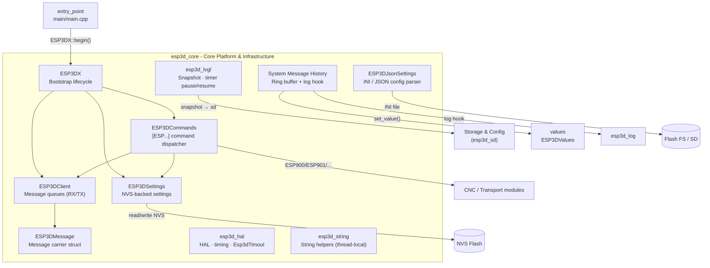

---

## Components

### ESP3DX — Bootstrap

**File:** `main/core/includes/esp3d_x.h`

`ESP3DX` is the single top-level lifecycle owner of the entire firmware. It is instantiated once (`main/main.cpp → app_main`) and exposes only two methods:

| Method | Description |
|--------|-------------|
| `begin()` | Initialises all subsystems in dependency order (settings, values, transports, UI, …) |
| `end()` | Shuts down subsystems in reverse order |

The class is marked `final` — it is not meant to be subclassed. It acts as a composition root: nothing about the internal startup order leaks to other modules.

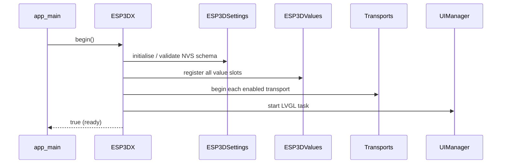

> See [entry_point.md](entry_point.md) for `app_main` context.

---

### ESP3DSettings — NVS Persistent Settings

**Files:** `main/core/includes/esp3d_settings.h`

`ESP3DSettings` stores all firmware configuration in ESP-IDF's Non-Volatile Storage (NVS). It is the **single source of truth** for all persistent state — no other module writes to NVS directly.

#### Design principles

- **Type-safe access** — separate read/write methods per type (`byte`, `uint32`, `string`, `IP`).
- **Thread-safe writes** — a `pthread_mutex_t` serialises NVS write+commit sequences and `reset()`. Reads are lock-free because NVS itself is internally thread-safe and returns either the committed old or new value, never a torn read.
- **Schema versioning** — `checkSchemaVersion()` detects stale NVS layouts after a firmware upgrade and triggers a reset to defaults.
- **Validation** — every public write is gated by a validation method before touching NVS.

#### Setting index

Settings are enumerated in `ESP3DSettingIndex` (generated from `.inc` X-macro files). This keeps the header short while allowing board-specific target settings to extend the enum without modifying shared code.

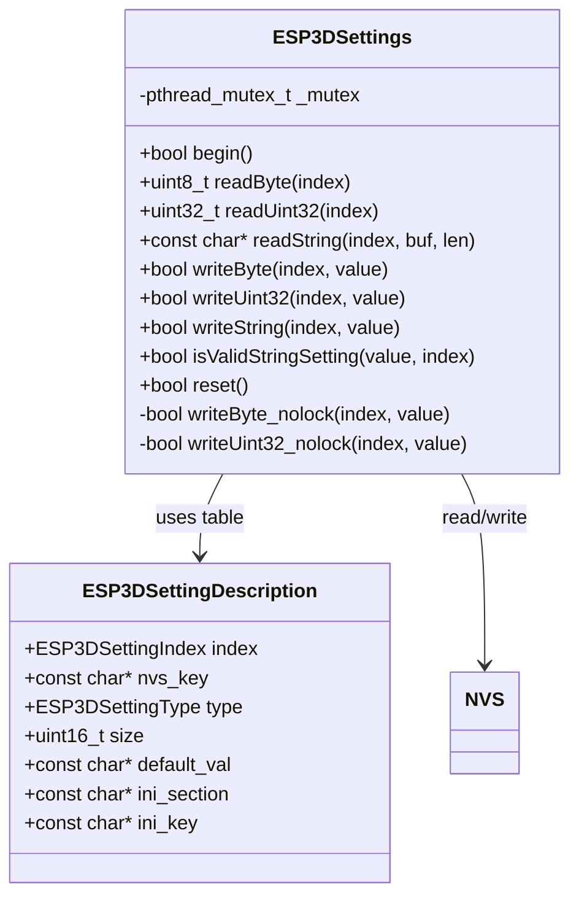

#### Setting types

| `ESP3DSettingType` | Storage | Notes |
|--------------------|---------|-------|
| `byte_t`           | 1 byte  | Enums, flags |
| `integer_t`        | 4 bytes | Port numbers, baud rates |
| `string_t`         | variable| SSIDs, hostnames, passwords |
| `ip_t`             | 4 bytes | IP stored as `uint32_t` |
| `float_t`          | ≤15 chars | Stored as ASCII string |
| `mask` / `bitsfield` | variable | Feature flags |

#### Global instance

```cpp
extern ESP3DSettings esp3dXsettings;
```

---

### ESP3DJsonSettings — INI / JSON Config Parser

**File:** `main/core/includes/esp3d_json_settings.h`

`ESP3DJsonSettings` reads and writes section/key values from INI-style configuration files (stored on flash or SD). It is used by the **update service** to apply settings from a user-supplied config file without a full flash.

| Method | Description |
|--------|-------------|
| `readString(section, key)` | Returns the string value for `[section] key =` |
| `writeString(section, key, value)` | Persists a value to the file |

A `pthread_mutex_t` protects the internal parse state (`_value`, `_valueIndex`) across the full duration of both `readString` and `writeString` — the mutex must be held while iterating the file because two tasks could otherwise corrupt the shared parser state.

`ESP3DParseError` communicates structured failure reasons back to callers instead of a plain boolean.

```cpp
extern ESP3DJsonSettings esp3dXJsonSettings;
```

> Related: [Storage & Configuration module](Storage_and_Configuration.md) (update service uses this to apply INI patches from SD).

---

### ESP3DClient & ESP3DMessage — Message Bus

**File:** `main/core/includes/esp3d_client.h`

These two types are the backbone of all inter-module communication in the firmware. Every transport (Serial, BT, USB, Socket, WebSocket) and every service that produces or consumes data inherits from `ESP3DClient`.

#### ESP3DMessage

A single data-carrying packet passed between components:

```cpp
struct ESP3DMessage {
    uint8_t*                 data;
    size_t                   size;
    ESP3DClientType          origin;       // Sender identity
    ESP3DClientType          target;       // Intended receiver
    ESP3DAuthenticationLevel authentication_level;
    ESP3DRequest             request_id;   // HTTP request handle or numeric ID
    ESP3DMessageType         type;         // head | core | tail | unique
    ESP3DMessagePriority     priority;     // normal → back of queue; high → front
};
```

- `origin` / `target` use `ESP3DClientType` (an enum of all transport/service types).
- `type` supports multi-part streaming: `head` opens a response, `core` carries payload chunks, `tail` closes it, `unique` is a self-contained message.
- **Priority**: `high` messages are pushed to the **front** of the TX queue via `addFrontTxData()`, giving them immediate dispatch ahead of queued normal messages.

#### ESP3DClient

A bidirectional queue manager. Each concrete transport subclasses it:

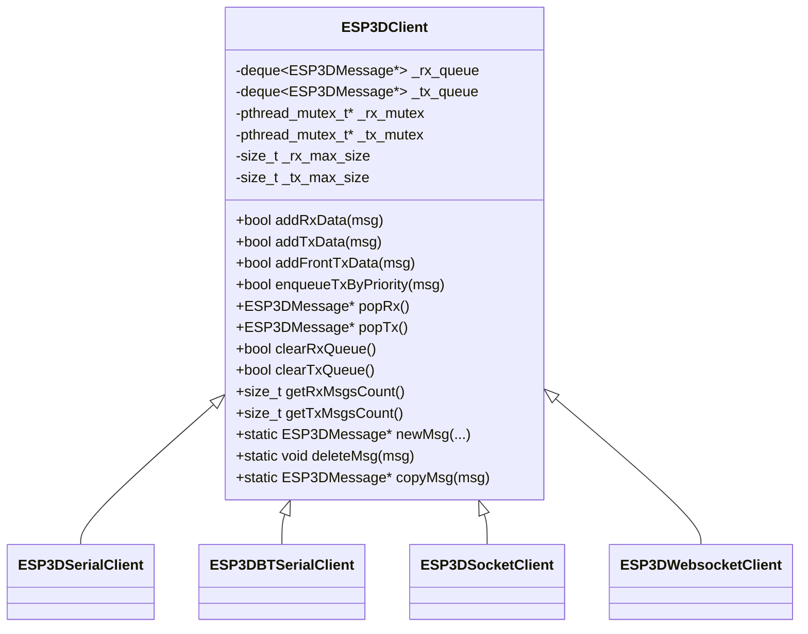

> See [Communication_Transports.md](Communication_Transports.md) for transport implementations.

#### Queue discipline

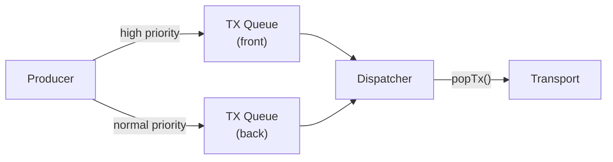

- Max queue sizes are set per-client via `setRxMaxSize()` / `setTxMaxSize()`.
- `purgeRxByOrigin()` / `purgeTxByOrigin()` allow selective eviction when a transport disconnects.

---

### ESP3DCommands — Command Dispatcher

**File:** `main/core/includes/esp3d_commands.h`

`ESP3DCommands` parses and routes `[ESPNNN]` commands received from any transport. It is the unified entry point for all firmware configuration and control via the ESP3D command set.

#### Dispatch flow

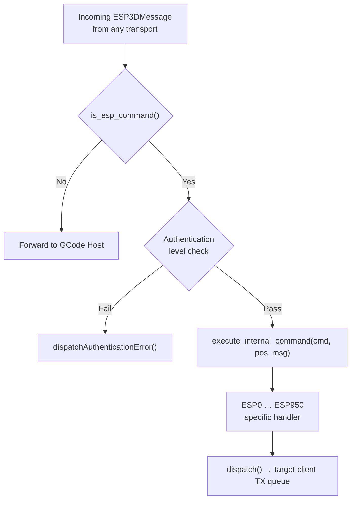

- `is_esp_command()` scans the message buffer for the `[ESP` prefix.
- `get_param()` / `hasTag()` extract named parameters from the command string.
- `dispatch()` is overloaded to accept raw buffers, C strings, or a full `ESP3DMessage*`.
- `dispatchAnswer()` formats JSON or plain-text response messages.
- `_lastESP3DCmdOrigin` swallows the trailing `\n`/`\r` **only on the same transport** that sent the command — preventing a stray newline on Serial from being silently dropped because of a BT command.

#### Command range overview

| Range | Area |
|-------|------|
| ESP0 | Echo / test |
| ESP100–ESP135 | Network (WiFi, BT, socket, WebSocket) |
| ESP140 | Time / NTP |
| ESP160–ESP171 | WebSocket server, camera |
| ESP200–ESP216 | SD card, sensor, display snapshot |
| ESP250–ESP290 | Buzzer, screen brightness, UI |
| ESP400–ESP455 | Settings read/write, update, mDNS |
| ESP500–ESP555 | Authentication / passwords |
| ESP600–ESP610 | Push notifications |
| ESP700–ESP800 | File system (flash & SD), GCode streaming |
| ESP900–ESP950 | Serial config, USB, BT, Lua |

> Individual command implementations live in [esp3d_commands.md](esp3d_commands.md).

#### Global instance

```cpp
extern ESP3DCommands esp3dCommands;
```

---

### esp3d_hal / Esp3dTimout — Hardware Abstraction

**File:** `main/core/includes/esp3d_hal.h`

The `esp3d_hal` namespace wraps FreeRTOS timing primitives so the rest of the firmware does not directly call ESP-IDF tick APIs.

| Function / Class | Description |
|-----------------|-------------|
| `esp3d_hal::millis()` | Milliseconds since boot (`int64_t`) |
| `esp3d_hal::micros()` | Microseconds since boot (`int64_t`) |
| `esp3d_hal::seconds()` | Seconds since boot (`int64_t`) |
| `esp3d_hal::getEfuseMac()` | Unique 64-bit chip MAC address |
| `esp3d_hal::wait(ms)` | Blocking delay — minimum `ESP3D_MINIMAL_WAIT` (10 ms = 1 FreeRTOS tick at 100 Hz). `wait(0)` = pure `taskYIELD()`. |
| `Esp3dTimout` | RAII timeout object |

#### `Esp3dTimout`

```cpp
class Esp3dTimout final {
public:
    Esp3dTimout(int64_t timeout);   // timeout in milliseconds
    bool isTimeout();               // true if elapsed > timeout
    void reset();                   // restart the timer
};
```

**Typical usage:**

```cpp
Esp3dTimout t(5000); // 5-second timeout
while (!t.isTimeout()) {
    if (done()) { break; }
    esp3d_hal::wait(ESP3D_MINIMAL_WAIT);
}
```

#### Wait constants

| Constant | Value | Meaning |
|----------|-------|---------|
| `ESP3D_MINIMAL_WAIT` | 10 ms | Shortest real sleep (1 FreeRTOS tick) |
| `ESP3D_ONLY_YIELD` | 0 ms | Pure yield — no delay, no IDLE feed |

---

### LVGL Utilities — Snapshot & Timer Control

**Files:** `main/core/esp3d_lvgl.cpp`, `main/core/includes/esp3d_lvgl.h`

These utilities bridge the LVGL display engine with the rest of the firmware for two specific needs: **pausing all LVGL timers** before a screenshot, and **capturing a full-screen snapshot** to an SD file.

> ⚠️ All LVGL operations run on **Core 1** under the LVGL task. These utilities must never be called from a high-frequency ISR or a non-LVGL task without proper synchronisation.

#### Timer management

| Function | Description |
|----------|-------------|
| `lv_timer_pause_all()` | Iterates all active LVGL timers and pauses each; saves their handles (up to `MAX_TRACKED_TIMERS = 32`). Idempotent — safe to call when already paused. |
| `lv_timer_resume_all()` | Resumes only timers paused by the previous call; validates each handle with `lv_timer_is_valid()` before resuming. |
| `lv_timer_is_valid(timer)` | Scans the LVGL timer list to verify a handle is still alive. |

#### Snapshot feature (`ESP3D_SNAPSHOT_FEATURE`)

A mutex-protected state machine captures every LVGL flush callback pixel into a binary file on SD:

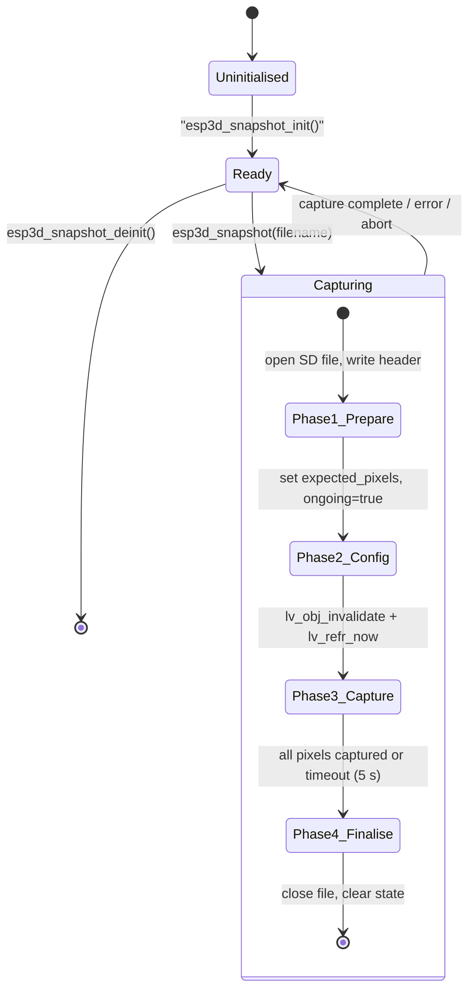

**File format (`raw_header_t`):**

```c
typedef struct {
    char     signature[4];  // "E3D\0"
    uint32_t width;         // horizontal resolution
    uint32_t height;        // vertical resolution
    uint32_t format;        // 0 = RGB565, 1 = RGB888
    uint32_t reserved;
} __attribute__((packed)) raw_header_t;
```

Pixel data follows the header as raw packed pixels (2 bytes/pixel for RGB565, 4 bytes/pixel for RGB888). The converter tools in `tools/images_converter/` can turn this into PNG.

> **Known LVGL quirk:** with the ILI9341 driver at `LV_COLOR_DEPTH == 16`, `sizeof(lv_color_t)` reports 3 bytes (wrong). The snapshot code forces `bytes_per_pixel = 2` for RGB565. Re-check on any LVGL upgrade.

| API | Description |
|-----|-------------|
| `esp3d_snapshot_init()` | One-time mutex creation |
| `esp3d_snapshot(filename)` | Trigger capture; blocks until done or timeout |
| `esp3d_snapshot_is_active()` | Poll from other tasks |
| `esp3d_snapshot_abort()` | Cancel an in-progress capture |
| `esp3d_snapshot_deinit()` | Free mutex |
| `esp3d_snapshot_estimate_size()` | Compute expected file size before capture |

---

### System Message History

**Files:** `main/core/esp3d_system_message_history.cpp`, `main/core/includes/esp3d_system_message_history.h`

A thread-safe ring buffer (max 20 entries) of pendant-local diagnostic messages — distinct from CNC firmware messages. Used by the UI to surface boot warnings, resource-load failures, and theme-customisation errors.

#### Message types

```cpp
enum class ESP3DSystemMessageType : uint8_t {
    info    = 0,
    warning = 1,
    error   = 2
};

struct ESP3DSystemMessage {
    ESP3DSystemMessageType type;
    std::string content;
};
```

#### API

| Function | Description |
|----------|-------------|
| `esp3d_system_message_add(type, content)` | Append to ring buffer; notifies UI via `ESP3DValues` |
| `esp3d_system_message_clear()` | Empty buffer; clears UI value |
| `esp3d_system_message_get_history()` | Returns a **snapshot copy** under lock — never iterate the live deque directly |
| `esp3d_system_message_hook_log_errors()` | Register an `esp3d_log` hook: every `esp3d_log_e()` call anywhere in firmware is automatically forwarded here as an `error` message |

#### Integration with ESP3DValues

Every `add` / `clear` operation calls:

```cpp
esp3dXValues.set_value(ESP3DValuesIndex::local_message_history, content);
```

This triggers any UI subscriber (e.g. the firmware status screen) without polling. The mutex protecting the ring buffer is **never held** during the `set_value()` call — the Values system has its own lock, and nested locking would deadlock.


> See [esp3d_log.md](esp3d_log.md) for the hook registration API. See [values.md](values.md) for the observable system.

---

### esp3d_string — String Utilities

**File:** `main/core/esp3d_string.cpp`

A collection of helper functions used throughout the firmware for string formatting and manipulation. All functions that return pointers use **`thread_local` static buffers** — returned pointers remain valid until the same function is called again **from the same thread**. Never store these pointers across tasks or across a second call.

#### Functions

| Function | Description |
|----------|-------------|
| `set_precision(str, precision)` | Format a float string to `N` decimal places |
| `str_replace(str, old, new)` | Replace all occurrences of a substring |
| `str_trim(str)` | Strip leading and trailing whitespace |
| `str_toUpperCase(str*)` | In-place uppercase (`std::string`) |
| `str_toLowerCase(str*)` | In-place lowercase (`std::string`) |
| `formatBytes(bytes)` | Human-readable size string (`B`, `KB`, `MB`, `GB`) |
| `urlDecode(text)` | Percent-decode a URL string |
| `urlEncode(text)` | Percent-encode a URL string |
| `endsWith(str, endpart)` | Suffix check |
| `startsWith(str, startPart)` | Prefix check |
| `getContentType(filename)` | Map file extension to MIME type |
| `find(str, sub, start)` | Forward substring search |
| `rfind(str, sub, start)` | Reverse substring search |
| `getPathFromString(str)` | Extract directory path (strips filename) |
| `getFilenameFromString(str)` | Extract filename (handles trailing `/`) |
| `getTimeString(time, isGMT)` | Format `time_t` as RFC 1123 (GMT) or ISO 8601 (local) |
| `generateUUID(seed)` | Generate a pseudo-random 36-char UUID |
| `expandString(s, formatspace)` | Expand `%ESP_IP%`, `%ESP_NAME%`, `%ESP_DATETIME%` macros |
| `char_toUpperCase(char*)` | In-place uppercase (C string) |

#### Thread-safety model

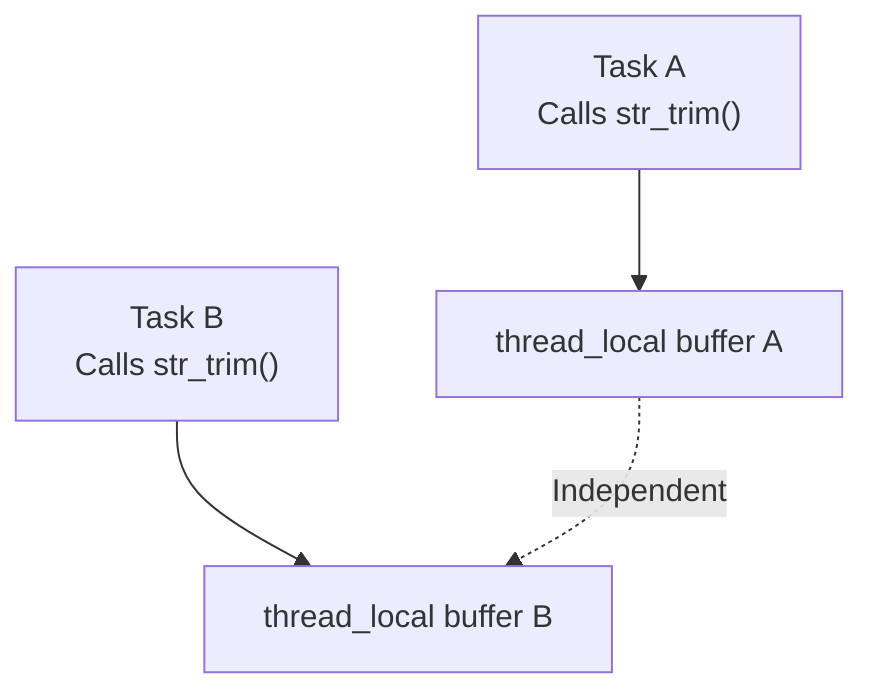

Each FreeRTOS task has its own copy of every `thread_local` buffer. Two tasks can call the same helper concurrently without races. Within one task, a second call **overwrites** the previous result.

> ⚠️ `std::string` operations in these utilities can throw `std::bad_alloc` on heap exhaustion. All functions catch this and return a safe fallback (usually the original input), in compliance with the project's [Memory Constraints](https://github.com/luc-github/Pibot-cnc-pendant-firmware/blob/main/docs/guides/esp32_memory_constraints.md).

---

## Component Dependency Graph

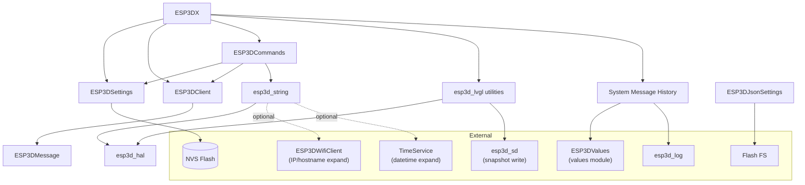

---

## Initialization Sequence

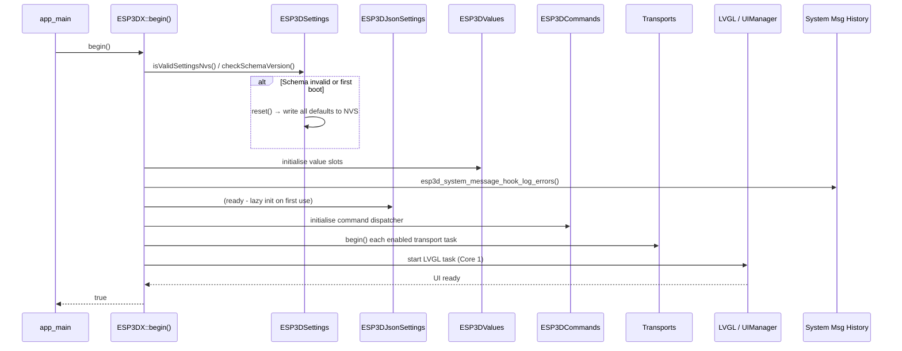

---

## Message Bus Data Flow

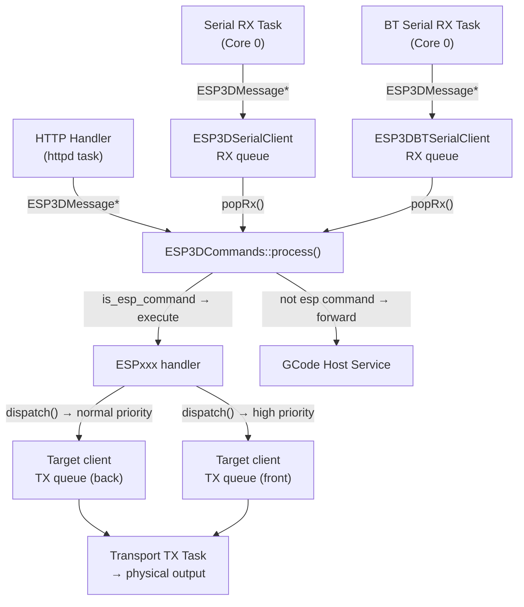

---

## Settings System Flow

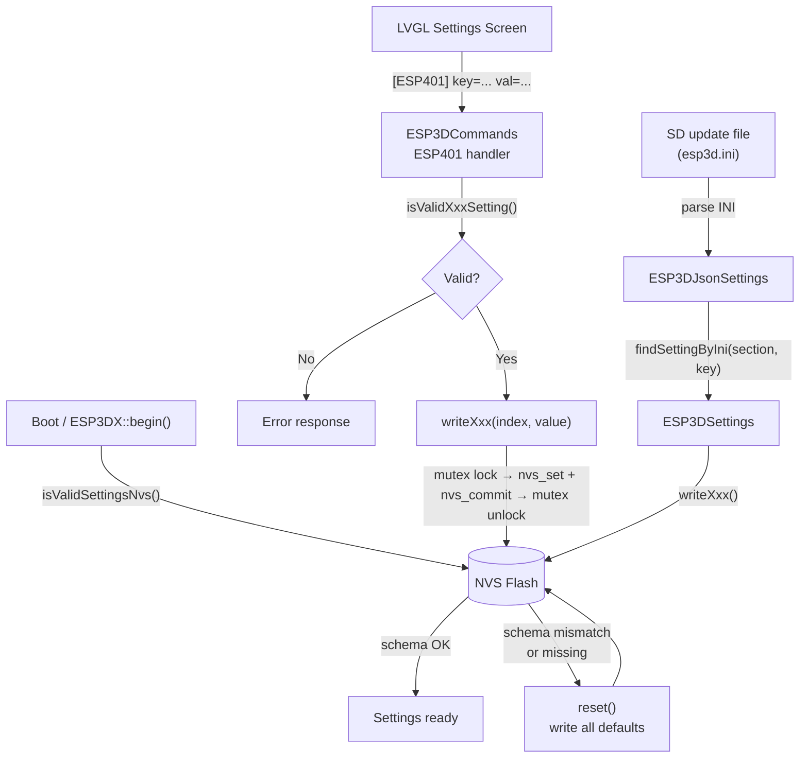

---

## Snapshot Capture Flow

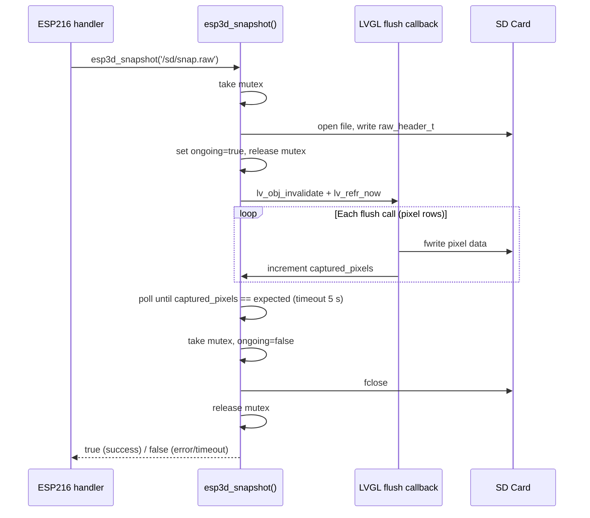

---

## Memory & Thread-Safety Constraints

| Concern | Implementation |
|---------|----------------|
| NVS write atomicity | `pthread_mutex_t` in `ESP3DSettings` — non-recursive, held only during `set + commit` or `reset()` |
| Message queue access | Per-client `pthread_mutex_t*` for both RX and TX queues |
| System message history | `pthread_mutex_t` — never held while calling `esp3dXValues.set_value()` |
| JSON settings parse state | `pthread_mutex_t` for full duration of `readString` / `writeString` |
| Snapshot state | `SemaphoreHandle_t` FreeRTOS mutex — 1-second timeout on acquire |
| String utilities | `thread_local` static buffers — one copy per FreeRTOS task, no sharing |
| `std::string` in hot paths | Avoided or wrapped in `try/catch(std::bad_alloc)` with safe fallback |
| LVGL operations | Must run on **Core 1** LVGL task only; never call from Core 0 or ISR |
| Dynamic allocation | Heap checks required — worst case ~10 KB available in BT mode |

> See [esp32_memory_constraints.md](https://github.com/luc-github/Pibot-cnc-pendant-firmware/blob/main/docs/guides/esp32_memory_constraints.md) for the full heap fragmentation playbook.

---

## Key Types Reference

| Type | Header | Purpose |
|------|--------|---------|
| `ESP3DX` | `esp3d_x.h` | Firmware lifecycle root |
| `ESP3DSettings` | `esp3d_settings.h` | NVS settings access |
| `ESP3DSettingIndex` | `esp3d_settings.h` | Typed setting identifiers |
| `ESP3DSettingDescription` | `esp3d_settings.h` | Per-setting metadata |
| `ESP3DJsonSettings` | `esp3d_json_settings.h` | INI/JSON config parser |
| `ESP3DClient` | `esp3d_client.h` | Message queue base class |
| `ESP3DMessage` | `esp3d_client.h` | Message carrier |
| `ESP3DMessageType` | `esp3d_client.h` | `head/core/tail/unique` |
| `ESP3DMessagePriority` | (client types) | `normal/high` |
| `ESP3DCommands` | `esp3d_commands.h` | `[ESP...]` command router |
| `Esp3dTimout` | `esp3d_hal.h` | RAII timeout utility |
| `raw_header_t` | `esp3d_lvgl.h` | Snapshot file header |
| `ESP3DSystemMessage` | `esp3d_system_message_history.h` | Diagnostic message record |
| `ESP3DSystemMessageType` | `esp3d_system_message_history.h` | `info/warning/error` |
| `ESP3DParseError` | `esp3d_json_settings.h` | JSON parse error codes |

---

## Related Documentation

| Document | Relationship |
|----------|-------------|
| [entry_point.md](entry_point.md) | Calls `ESP3DX::begin()` — firmware startup |
| [esp3d_commands.md](esp3d_commands.md) | Implements `ESP0`–`ESP950` command handlers |
| [esp3d_log.md](esp3d_log.md) | Logging infrastructure; `esp3d_core` registers an error hook |
| [values.md](values.md) | `ESP3DValues` observable system — receives system message notifications |
| [esp3d_activity_manager.md](esp3d_activity_manager.md) | Activity tracking, uses `ESP3DClient` message flow |
| [translations.md](translations.md) | Translation service, called by UI using `esp3d_string` helpers |
| [Communication_Transports.md](Communication_Transports.md) | All transports subclass `ESP3DClient` |
| [ui_core.md](ui_core.md) | LVGL UI uses snapshot and timer utilities from this module |
| [esp32_memory_constraints.md](https://github.com/luc-github/Pibot-cnc-pendant-firmware/blob/main/docs/guides/esp32_memory_constraints.md) | Heap / fragmentation constraints that govern allocation rules here |
| [esp3d_log_guide.md](https://github.com/luc-github/Pibot-cnc-pendant-firmware/blob/main/docs/guides/esp3d_log_guide.md) | `esp3d_log` macro levels, backends, hook registration |
