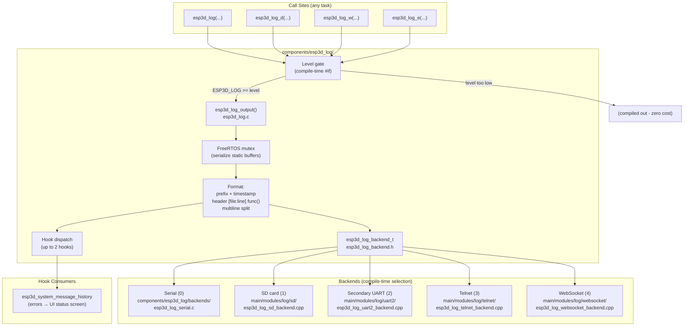
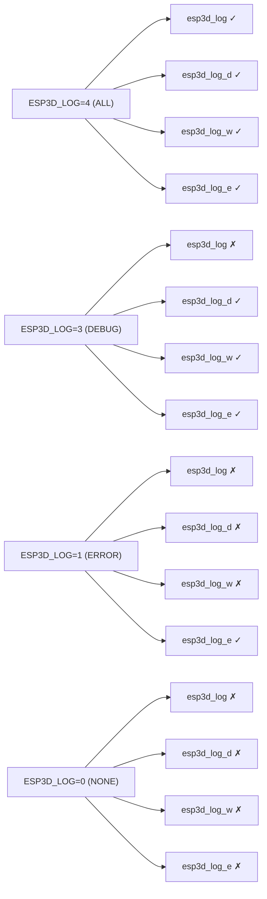
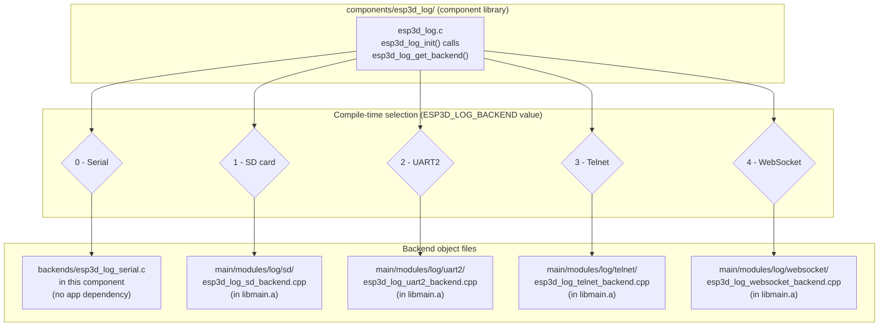
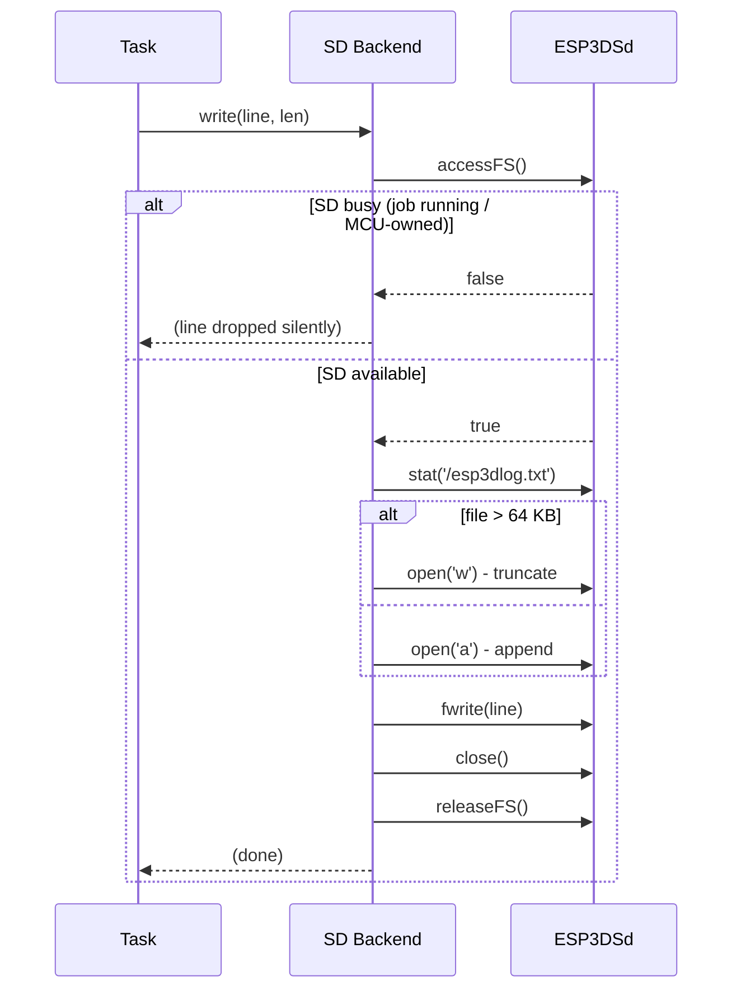
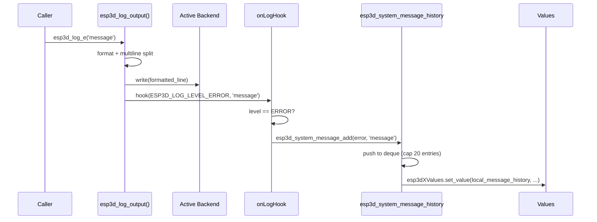
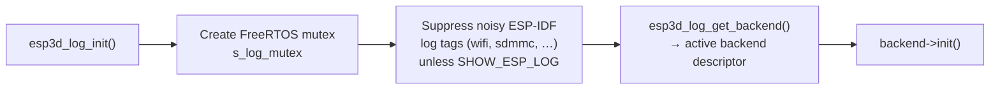
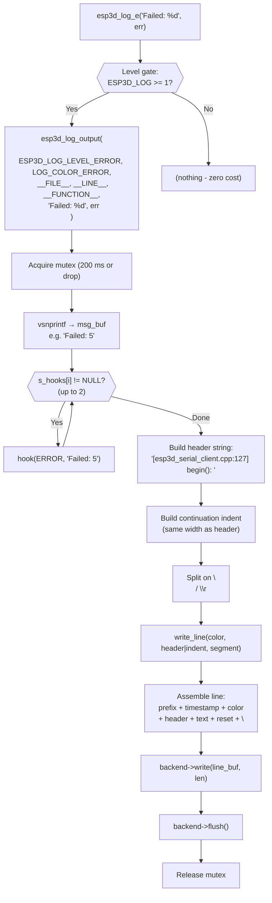

# esp3d_log — Logging Module

`esp3d_log` (`components/esp3d_log/`) is the firmware's logging subsystem. It provides four severity-gated macros (`esp3d_log`, `esp3d_log_d`, `esp3d_log_w`, `esp3d_log_e`), a compile-time pluggable output backend (serial, SD card, secondary UART, Telnet, or WebSocket), and an optional runtime hook mechanism that lets other modules observe log calls without `esp3d_log` knowing anything about them.

---

## Architecture Overview



---

## Module File Layout

```
components/esp3d_log/
├── esp3d_log.h                         # Public API: macros, levels, hook interface
├── esp3d_log.c                         # Core: esp3d_log_output(), mutex, hook dispatch
├── esp3d_log_backend.h                 # Backend interface (esp3d_log_backend_t)
├── CMakeLists.txt                      # Backend selection; -u linker flag for backends 1–4
└── backends/
    └── esp3d_log_serial.c              # Serial backend (built inside this component)

main/modules/log/                       # App-dependent backends (added by main/CMakeLists.txt)
├── sd/
│   └── esp3d_log_sd_backend.cpp        # Backend 1: SD card (best-effort, capped at 64 KB)
├── uart2/
│   └── esp3d_log_uart2_backend.cpp     # Backend 2: secondary UART (board-config gated)
├── telnet/
│   └── esp3d_log_telnet_backend.cpp    # Backend 3: reuses esp3dSocketServer
└── websocket/
    └── esp3d_log_websocket_backend.cpp # Backend 4: reuses esp3dWsServerDataService
```

---

## Log Macros

Four macros are the complete public API for logging:

```c
esp3d_log(format, ...)     // verbose  — level ALL     (4)
esp3d_log_d(format, ...)   // debug    — level DEBUG   (3)
esp3d_log_w(format, ...)   // warning  — level WARNING (2)
esp3d_log_e(format, ...)   // error    — level ERROR   (1)
```

All share the same `printf` signature, are declared in `esp3d_log.h`, and route through `esp3d_log_output()`. Legacy aliases `esp3d_log_error()` and `esp3d_log_warning()` exist as thin wrappers around `esp3d_log_e` and `esp3d_log_w` respectively.

> **`%llu` / `%llx` are not supported** by the nanolib printf ESP-IDF links by default. Use the `U64_STR(x)` helper macro to format a `uint64_t` as a string:
> ```c
> esp3d_log("Free heap: %s bytes", U64_STR(esp_get_free_heap_size()));
> ```

### Level Gating (Compile-Time)

Each macro is compiled only when the build's `ESP3D_LOG` constant meets or exceeds its required level; otherwise it expands to nothing — the format string is not retained, and there is zero runtime cost.

| `ESP3D_LOG` value | Active macros |
|---|---|
| `0` (`NONE`) | none — all four compile to nothing |
| `1` (`ERROR`) | `esp3d_log_e` only |
| `2` (`WARNING`) | `esp3d_log_e`, `esp3d_log_w` |
| `3` (`DEBUG`) | `esp3d_log_e`, `esp3d_log_w`, `esp3d_log_d` |
| `4` (`ALL`) | all four, including `esp3d_log` (verbose) |



### Project Convention (see also `CLAUDE.md`)

- **`esp3d_log(...)`** — always left in the codebase for long-term trace, but dormant unless `ESP3D_LOG=4`. Do not remove these calls.
- **`esp3d_log_d(...)`** — debug-only, temporary. When investigating a specific area, rename the relevant `esp3d_log(` calls to `esp3d_log_d(` (or add new `_d` calls) so they appear at level 3. Rename back to `esp3d_log(` once done.
- **`esp3d_log_w` / `esp3d_log_e`** — real warnings/failures, always compiled in both shipped profiles.

### Braces Rule (Critical)

Because the macros can compile to nothing, using them without braces in a conditional creates a dangling `if` when logging is stripped:

```c
// WRONG — becomes "if (cond) ;" in production
if (cond)
    esp3d_log("value=%d", x);

// CORRECT
if (cond) {
    esp3d_log("value=%d", x);
}
```

See the "Control Flow Syntax Rules" section of `CLAUDE.md` for full details.

---

## Configuration Options

All options are C preprocessor defines. They are set via `add_compile_options()` in `cmake/dev_tools.cmake` (see [Build Configuration](#build-configuration)) and have `#ifndef`-guarded defaults in `esp3d_log.h`.

| Define | Default | Description |
|---|---|---|
| `ESP3D_LOG` | *(must be set)* | Active log level: 0–4. |
| `ESP3D_LOG_BACKEND` | `0` (serial) | Output destination. See [Backends](#backends). |
| `ESP3D_LOG_PREFIX` | `";"` | String prepended to every output line. The default `";"` makes lines look like G-code comments — if the same UART is shared with the CNC controller, the target firmware ignores them. Set to `""` to disable. |
| `ESP3D_LOG_TIMESTAMP` | `0` | When `1`, prepends `[+SSSSs.MMM]` (seconds.milliseconds since boot) before each line. |
| `ESP3D_LOG_BUFFER_SIZE` | `512` | Max bytes in one formatted log line (static buffer). Increase if messages are truncated; watch DRAM budget — see [`esp32_memory_constraints.md`](https://github.com/luc-github/Pibot-cnc-pendant-firmware/blob/main/docs/guides/esp32_memory_constraints.md). |
| `DISABLE_COLOR_LOG` | *(unset = colors on)* | When `1`, replaces ANSI color escapes with plain `[LOG]`/`[ERR]`/`[WNG]`/`[DBG]` tags for terminals that do not handle ANSI color. |

---

## Build Configuration

`cmake/dev_tools.cmake` controls the active profile via the `PROD_BUILD` CMake option:

```bash
python tools/build_scripts/build_mgr.py <variant>        # PROD_BUILD=ON (default)
python tools/build_scripts/build_mgr.py <variant> --dev  # PROD_BUILD=OFF
```

| Setting | `PROD_BUILD=ON` (default) | `PROD_BUILD=OFF` (`--dev`) |
|---|---|---|
| `ESP3D_LOG` | **0** (disabled) | **3** (debug + warning + error) |
| `DISABLE_COLOR_LOG` | 1 | 1 |
| `ESP3D_LOG_TIMESTAMP` | *(header default: 0)* | **1** |
| `ESP3D_LOG_BACKEND` | *(header default: 0/serial)* | 0 (serial) |
| `ESP3D_LOG_BUFFER_SIZE` | *(header default: 512)* | 512 |

> **Production builds** (`PROD_BUILD=ON`) set `ESP3D_LOG=0` — all four macros compile to nothing, zero runtime overhead. To enable verbose `esp3d_log()` output during development, change `set(ESP3D_LOG_LEVEL 3)` to `set(ESP3D_LOG_LEVEL 4)` in the `else()` branch of `cmake/dev_tools.cmake` (affects `--dev` builds only).

---

## Output Format

Each call to `esp3d_log_output()` assembles the line in order:

```
<PREFIX><TIMESTAMP><COLOR>[filename:line] function(): <message><COLOR_RESET>\n
```

**Example** (with `ESP3D_LOG_PREFIX=";"`, `ESP3D_LOG_TIMESTAMP=1`, `DISABLE_COLOR_LOG=1`):

```
;[+0042.318] [esp3d_serial_client.cpp:127] begin(): Serial transport initialized
```

### Color Tags

| Level | ANSI color | Plain tag (`DISABLE_COLOR_LOG=1`) |
|---|---|---|
| ALL (verbose) | Cyan `\e[0;36m` | `[LOG]` |
| ERROR | Red `\e[0;31m` | `[ERR]` |
| WARNING | Bold yellow `\e[1;33m` | `[WNG]` |
| DEBUG | Bold magenta `\e[1;95m` | `[DBG]` |

### Multiline Messages

If the format string contains `\n` or `\r`, `esp3d_log_output()` splits on those characters. The first sub-line gets the full `[file:line] func():` header; subsequent sub-lines are indented to the same width to align visually:

```
;[+0042.319] [esp3d_socket_client.cpp:88] connect(): Resolving host: 192.168.1.100
;                                                      port: 8080
;                                                      timeout: 5000 ms
```

### Thread Safety

`esp3d_log_output()` uses a FreeRTOS mutex (`s_log_mutex`) created by `esp3d_log_init()`. All static formatting buffers (`msg_buf`, `header_buf`, `indent_buf`, `line_buf`) are protected under this mutex, so concurrent log calls from multiple tasks (e.g., the LVGL task on Core 1 and `esp3d_serial_rx_task` on Core 0) are serialized safely. If the mutex cannot be acquired within 200 ms, the line is **dropped silently** rather than blocking.

Calls issued before `esp3d_log_init()` (early boot, before the scheduler) run uncontended — the mutex check is skipped when `s_log_mutex` is still `NULL`.

---

## Backends

Only one backend is active per build, selected by `ESP3D_LOG_BACKEND` at compile time. Every backend implements the same four-function interface defined in `esp3d_log_backend.h`:

```c
typedef struct {
    void (*init)(void);                       // called once from esp3d_log_init()
    void (*write)(const char *data, int len); // called per formatted line
    void (*flush)(void);                      // called after each write()
    void (*deinit)(void);                     // release resources
} esp3d_log_backend_t;

// Provided by exactly one backend source file (linked at compile time):
const esp3d_log_backend_t *esp3d_log_get_backend(void);
```

### Backend Selection Overview



### Why Backends 1–4 Live in `main/`

The `esp3d_log` component must stay dependency-free so it can be included in any build. Backends 1–4 depend on app-level services (`ESP3DSd`, network services, etc.) that the component must know nothing about. They therefore live in `main/modules/log/` and are conditionally added to the build by `main/CMakeLists.txt` — never more than one at a time, since each provides its own `esp3d_log_get_backend()` and two would collide at link time.

### The `-u esp3d_log_get_backend` Linker Flag

`components/esp3d_log/CMakeLists.txt` adds the following whenever `ESP3D_LOG_BACKEND != 0`:

```cmake
target_link_libraries(${COMPONENT_LIB} INTERFACE "-u esp3d_log_get_backend")
```

**This flag is mandatory.** Without it, backends 1–4 fail to link with an "undefined reference to `esp3d_log_get_backend`" error even though the backend `.cpp` compiles cleanly. Root cause: ESP-IDF links `libmain.a` exactly once and *before* this component's library. By the time `esp3d_log.c.obj`'s reference is seen, the linker has already moved past `libmain.a` and will not revisit it. The `-u` flag forces the symbol to be treated as "wanted" from the very start of the link, pulling the object out of `libmain.a` regardless of scan order — the same idiom used by ESP-IDF's own components (e.g. `components/esp_timer/CMakeLists.txt`).

> **Always use a fresh build directory when changing `ESP3D_LOG_BACKEND`.** An existing `build/` directory may silently keep the old backend with no error or warning.

---

### Backend Details

#### Backend 0 — Serial (Default)

**File:** `components/esp3d_log/backends/esp3d_log_serial.c`  
**Status:** Implemented. Always available, no app-level dependency.

- Writes via `esp_log_write(ESP_LOG_ERROR, "[ESP3D-X]", ...)` so output survives ESP-IDF's own log-level filtering.
- `init()` suppresses all other ESP-IDF log tags (`wifi`, `sdmmc`, `vfs_fat_sdmmc`, etc.) via `esp_log_level_set("*", ESP_LOG_NONE)` to keep the console clean — unless `SHOW_ESP_LOG` is defined.
- `flush()` calls `fflush(stdout)`.

#### Backend 1 — SD Card

**File:** `main/modules/log/sd/esp3d_log_sd_backend.cpp`  
**Status:** Implemented. Requires `SD_CARD_SERVICE=ON` (enforced by `cmake/sanity_check.cmake`).  
**Dependency:** `ESP3DSd` (`main/modules/filesystem/esp3d_sd.h`)

This backend is **best-effort by design** — the SD card is a shared, arbitrated resource (see [`shared_sd_mechanism_V2.0.md`](https://github.com/luc-github/Pibot-cnc-pendant-firmware/blob/main/docs/architecture/shared_sd_mechanism_V2.0.md)):

- Every `write()` performs the full acquire / open / write / close / release cycle. The SD is never held open across calls.
- If `sd.accessFS()` returns false (SD busy with a streaming job or MCU-owned), the log line is **silently dropped** — no queue, no retry, no blocking.
- The file `/esp3dlog.txt` is capped at 64 KB: once exceeded, the next write opens in `"w"` mode (truncate and restart) instead of `"a"` (append).
- `flush()` is a no-op — each `write()` already closes its file handle.



#### Backend 2 — Secondary UART

**File:** `main/modules/log/uart2/esp3d_log_uart2_backend.cpp`  
**Status:** Implemented. **No board in this repo currently defines the required pins.**

This backend requires the target board's `board_config.h` to define a UART **genuinely separate** from the primary CNC serial link (`UART_PORT_IDX`):

```c
#define ESP3D_LOG_UART_PORT_IDX  UART_NUM_1   // not UART_PORT_IDX
#define ESP3D_LOG_UART_TX_PIN    GPIO_NUM_xx
#define ESP3D_LOG_UART_RX_PIN    GPIO_NUM_xx
// optional — defaults to 115200 if omitted:
#define ESP3D_LOG_UART_BAUD_RATE_BPS 115200
```

If any of the first three defines are absent, a `#error` fires at compile time — there is no fallback to another port's pins.

- `init()` installs the UART driver with a 512-byte TX ring buffer (ISR-drained, so `write()` copies in and returns immediately) and a 256-byte RX buffer (required by the driver, never read from — this is a log-only, one-way channel).
- `write()` calls `uart_write_bytes()`. Safe to call from any task, including LVGL.
- `flush()` is a no-op — blocking on `uart_wait_tx_done()` here would stall the calling task.

#### Backend 3 — Telnet

**File:** `main/modules/log/telnet/esp3d_log_telnet_backend.cpp`  
**Status:** Implemented. Requires `SOCKET_SERVER_SERVICE=ON` (enforced by `cmake/sanity_check.cmake`).  
**Dependency:** `ESP3DSocketServer` (`main/modules/socket_server/esp3d_socket_server.h`)

Reuses the project's existing telnet/raw-TCP console server rather than standing up a second one:

- `write()` creates one `ESP3DMessage` (`ESP3DClient::newMsg(..., ESP3DClientType::socket_server, ...)`) and hands it to `esp3dSocketServer.process()` — the same path any other socket-bound text takes. `process()` only enqueues (mutex-protected) and returns immediately, safe from any task including LVGL.
- Does nothing until a telnet client is actually connected (`isConnected()` check) — no network dependency at early boot.
- **Reentrancy guard** (`s_in_write`): `process()` itself calls `esp3d_log_e()` on a full queue. Without the guard that re-enters `write()` through `esp3d_log_output()` and recurses indefinitely on a persistently full queue.

> `SOCKET_SERVER_SERVICE` and `SOCKET_CLIENT_SERVICE` (CNC-over-WiFi) are mutually exclusive — the Telnet backend cannot be used with CNC-over-WiFi-TCP variants.

#### Backend 4 — WebSocket

**File:** `main/modules/log/websocket/esp3d_log_websocket_backend.cpp`  
**Status:** Implemented. Requires `WIFI_SERVICE=ON`, `WEB_SERVICES=ON`, and `WS_SERVER_SERVICE=ON` together (enforced by `cmake/sanity_check.cmake`).  
**Dependency:** `ESP3DWsDataService` (`main/modules/websocket_server/esp3d_ws_data_service.h`)

Reuses the existing WS data server the same way the Telnet backend reuses `esp3dSocketServer`:

- `write()` creates one `ESP3DMessage` (`ESP3DClient::newMsg(..., ESP3DClientType::websocket_server, ...)`) and hands it to `esp3dWsServerDataService.process()`, which ends in `httpd_ws_send_frame_async()` — the ESP-IDF `httpd` API explicitly designed to be called safely from any task.
- Does nothing until a WS client is attached (`isConnected()` check).
- **Reentrancy guard** (`s_in_write`): stricter need than Telnet's — `process()` calls `esp3d_log()` unconditionally on every single invocation (not just on error). Without the guard the very first call would immediately re-enter `write()` and recurse without end.

> No PiBot variant ships this combination by default — all WiFi variants use `SOCKET_CLIENT_SERVICE`, which is mutually exclusive with `WS_SERVER_SERVICE`. Testing this backend requires a temporary custom variant with `WS_SERVER_SERVICE=ON` (and `WEBUI_SERVER=ON` to work around an unrelated compile gap in `esp3d_http_service.cpp`).

---

## Runtime Hooks

Since 2026-07, `esp3d_log_output()` dispatches every log call to registered hooks **in addition to** the normal backend write. `esp3d_log` remains completely agnostic of what a hook does with the message.

```c
// esp3d_log.h
typedef void (*esp3d_log_hook_t)(int level, const char *message);

#define ESP3D_LOG_HOOKS_MAX 2   // fixed-size slots — no dynamic allocation

bool esp3d_log_register_hook(esp3d_log_hook_t hook);   // false if full or NULL
void esp3d_log_unregister_hook(esp3d_log_hook_t hook); // no-op if not found
```

- **`level`** — one of `ESP3D_LOG_LEVEL_ERROR / WARNING / DEBUG / ALL`.
- **`message`** — plain formatted message (no file/line/timestamp decoration), valid only for the duration of the call. Copy it if needed.
- **Level filtering is the hook's responsibility** — `esp3d_log` passes every call regardless.
- When `ESP3D_LOG == 0` (production), `register_hook` and `unregister_hook` compile as no-op stubs — no `#if ESP3D_LOG` guard is needed around registration calls.
- A third `register_hook()` call (beyond `ESP3D_LOG_HOOKS_MAX = 2`) returns `false`.



### Reference Consumer: `esp3d_system_message_history`

`main/core/esp3d_system_message_history.cpp` registers a hook that captures error-level messages into a small volatile history (RAM only, max 20 entries, cleared on reboot) displayed on the firmware status screen's **Local** message list:

```c
// main/core/esp3d_system_message_history.cpp
static void onLogHook(int level, const char *message) {
    if (level == ESP3D_LOG_LEVEL_ERROR) {
        esp3d_system_message_add(ESP3DSystemMessageType::error, message);
    }
}

void esp3d_system_message_hook_log_errors() {
    esp3d_log_register_hook(onLogHook);
}
```

Registered once from `UIManager::initialize()` in `main/display/esp3d_ui.cpp` — only once a screen exists to display errors. Every existing `esp3d_log_e(...)` call in the firmware then automatically surfaces on that screen with no per-call-site changes needed.

### When to Use a Hook vs. a Direct Call

| Situation | Recommended approach |
|---|---|
| Want an existing `esp3d_log_e(...)` to also feed a consumer | **Register a hook** — no call-site change needed |
| The event is not naturally an error (e.g. a UI warning) | **Call the consumer directly** — `esp3d_system_message_add(warning, ...)` bypasses the hook entirely |

---

## Initialization Sequence

`esp3d_log_init()` is called once from `ESP3DX::begin()` in `main/main.cpp`:



---

## Data Flow



---

## Integration Points

| Module | Relationship |
|---|---|
| `main/main.cpp` → `ESP3DX::begin()` | Calls `esp3d_log_init()` at startup |
| `main/display/esp3d_ui.cpp` → `UIManager::initialize()` | Calls `esp3d_system_message_hook_log_errors()` to register the UI error hook |
| `main/core/esp3d_system_message_history.cpp` | Implements `onLogHook`; forwards errors to `esp3dXValues` (`local_message_history`) and the firmware status screen |
| `main/modules/socket_server/` | Telnet backend (3) depends on `esp3dSocketServer` |
| `main/modules/websocket_server/` | WebSocket backend (4) depends on `esp3dWsServerDataService` |
| `main/modules/filesystem/esp3d_sd.h` | SD backend (1) depends on the shared SD accessor — see [`shared_sd_mechanism_V2.0.md`](https://github.com/luc-github/Pibot-cnc-pendant-firmware/blob/main/docs/architecture/shared_sd_mechanism_V2.0.md) |
| `cmake/dev_tools.cmake` | Sets `ESP3D_LOG`, `ESP3D_LOG_BACKEND`, `ESP3D_LOG_TIMESTAMP`, `DISABLE_COLOR_LOG`, `ESP3D_LOG_BUFFER_SIZE` |
| `cmake/sanity_check.cmake` | Fatal errors if SD/Telnet/WebSocket backends are selected without their required services |

---

## Usage Examples

**Routine trace — kept long-term, dormant unless `ESP3D_LOG=4`:**
```c
esp3d_log("Connection state: %d -> %d", old_state, new_state);
```

**Focused debug session** — temporarily promote to `_d`, revert when done:
```c
esp3d_log_d("Parsed value=%d from '%s'", value, raw);
```

**Recoverable / degraded condition:**
```c
esp3d_log_w("MTU negotiation failed (status %d), using default: %d", status, mtu);
```

**Failure the user may need to know about** — also surfaces on the firmware status screen via the hook:
```c
esp3d_log_e("Failed to connect to %s:%d", host, port);
```

**`uint64_t` formatting (`%llu` unsupported by nanolib printf):**
```c
esp3d_log("Free heap: %s bytes", U64_STR(esp_get_free_heap_size()));
```

**Multi-line message — auto-split and indented to align:**
```c
esp3d_log("Connecting:\n  host=%s\n  port=%d\n  timeout=%dms", host, port, timeout_ms);
```
