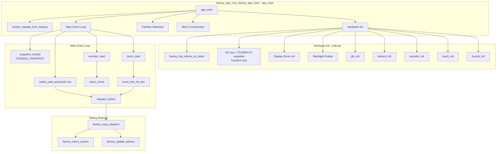
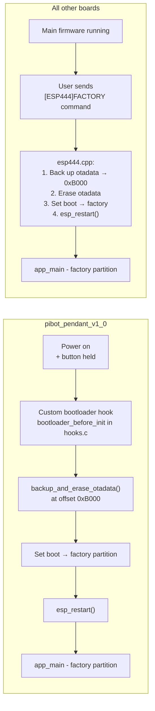
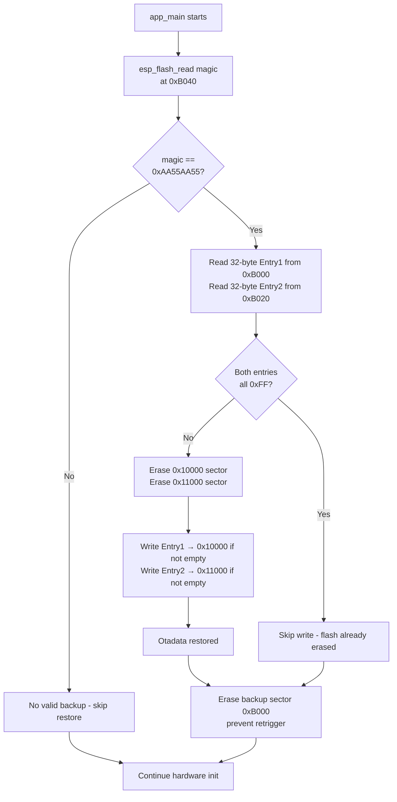
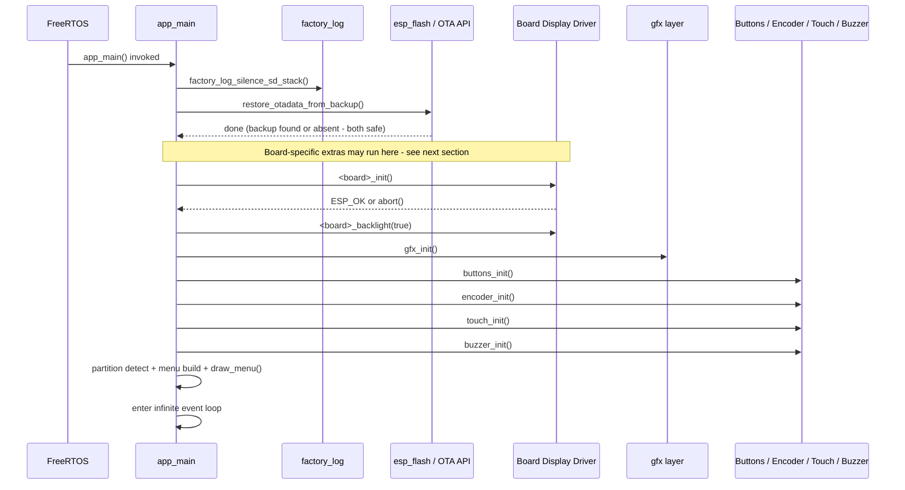
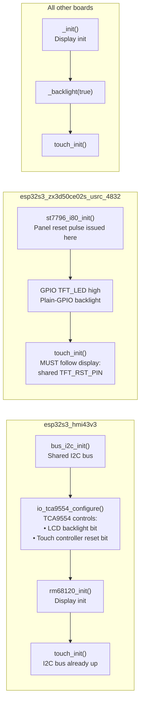
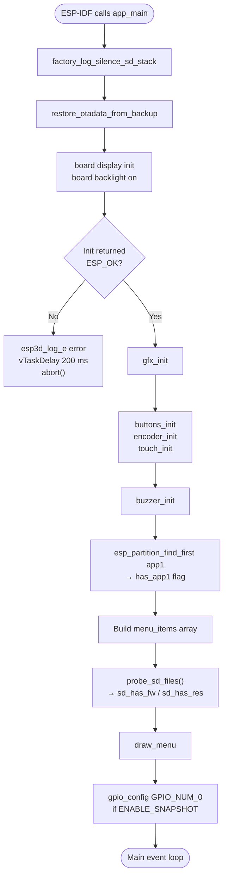
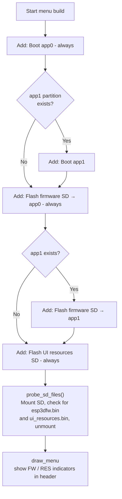
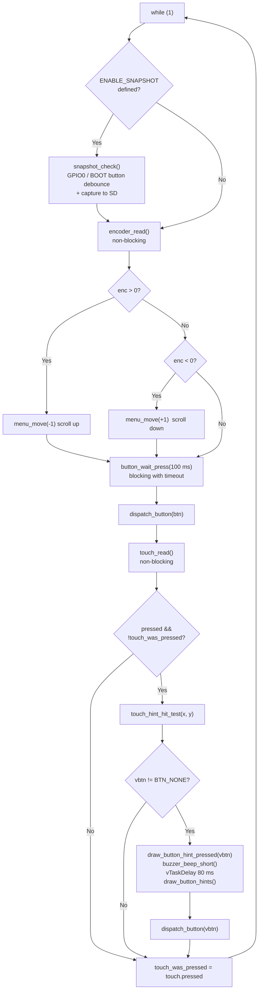
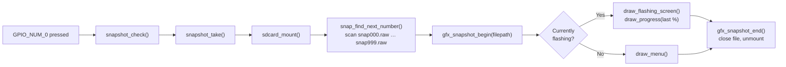
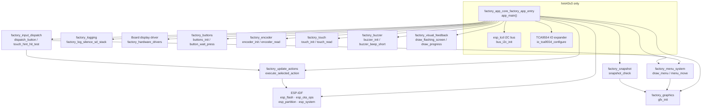

# Factory App Core — Entry Point (`factory_app_core_factory_app_entry`)

## Introduction

This module is the **ESP-IDF application entry point** for the factory recovery firmware. It implements the single exported symbol required by ESP-IDF — `app_main` — across all five actively-supported board variants of the `factory_app_core` group. Its responsibility is to:

1. Restore OTA partition bookkeeping from a flash backup (before any other work).
2. Bring up display and input hardware in the correct board-specific order.
3. Detect available flash partitions and SD card payload files.
4. Build and render the recovery menu.
5. Run an infinite event loop that accepts input from physical buttons, a rotary encoder, and the touchscreen.

The module exists as five near-identical per-board source files that compile into independent binaries. Differences are confined to the LCD driver call, screen geometry constants, and — on two boards — extra bus/expander init steps imposed by hardware sharing constraints.

| Board source file | Display driver | Factory entry method |
|---|---|---|
| `boards/esp32s3_8048s070c/Factory/main/main.c` | EK9716 (RGB parallel, 800 × 480) | Software `[ESP444]FACTORY` command |
| `boards/esp32s3_bzm_tft35_gt911/Factory/main/main.c` | ST7796 (SPI, 320 × 480) | Software `[ESP444]FACTORY` command |
| `boards/esp32s3_hmi43v3/Factory/main/main.c` | RM68120 (i80 parallel) | Software `[ESP444]FACTORY` command |
| `boards/esp32s3_zx3d50ce02s_usrc_4832/Factory/main/main.c` | ST7796 (i80 parallel) | Software `[ESP444]FACTORY` command |
| `boards/pibot_pendant_v1_0/Factory/main/main.c` | ILI9341 (SPI, 240 × 320) | Custom bootloader hook (button held at power-on) **or** software command |

---

## Module in Context

`factory_app_core_factory_app_entry` is a leaf of the `factory_core` sub-tree. All higher-level context is in [factory_core.md](factory_core.md) and [factory_app.md](factory_app.md). The sibling sub-modules that `app_main` delegates to at runtime are:

| Sibling module documentation | Responsibility |
|---|---|
| [factory_menu_system.md](factory_menu_system.md) | Menu data model, navigation, rendering |
| [factory_update_actions.md](factory_update_actions.md) | Firmware/resources flash, OTA partition selection |
| [factory_visual_feedback.md](factory_visual_feedback.md) | Progress bar, flash screen, result display |
| [factory_snapshot.md](factory_snapshot.md) | Debug screen-capture to SD card |
| [factory_input_dispatch.md](factory_input_dispatch.md) | Unified button/touch/encoder dispatch |
| [factory_hardware_drivers.md](factory_app.md) | Board LCD, touch, buttons, encoder, buzzer drivers |
| [factory_graphics.md](factory_graphics.md) | Low-level pixel drawing (`gfx_*`) |
| [factory_sdcard.md](factory_sdcard.md) | SD mount / unmount / file presence probe |
| [factory_logging.md](factory_logging.md) | Log silencing utilities |

---

## Architecture Overview



---

## Factory Partition Entry Paths

How the device reaches `app_main` in the factory partition differs between the pibot board and all others:



> **Key invariant:** In both paths, the caller backs up the current `otadata` to flash offset `0xB000` *before* switching the boot pointer to factory. `restore_otadata_from_backup()` inside `app_main` is symmetric to both paths.

---

## OTA Data Restore

The first action of `app_main` — before display, before any user interaction — is `restore_otadata_from_backup()`. This restores the ESP-IDF OTA slot selector so that power-cycling from inside recovery returns to the correct previously-active application partition, not to the factory partition.

### Flash Layout (Backup Region)

```
0x00000  Bootloader
         ...
0x0B000  ◄── OTADATA_BACKUP_OFFSET (4 KB sector, below partition table)
         [0x00 – 0x1F]  OTA Entry 1     (32 bytes)
         [0x20 – 0x3F]  OTA Entry 2     (32 bytes)
         [0x40 – 0x43]  BACKUP_MAGIC    = 0xAA55AA55
         ...
0x0C000  Partition table
0x0D000  NVS
         ...
0x10000  ◄── OTADATA_OFFSET (active otadata — two 4 KB sectors)
0x11000
```

> **⚠ `CONFIG_SPI_FLASH_DANGEROUS_WRITE_ALLOWED=y` required.** Offset `0xB000` is below the first normal partition. ESP-IDF aborts writes there by default. The factory app is an intentionally privileged recovery tool.

### Restore Decision Flowchart



### OTA Constants (identical across all five boards)

| Constant | Value | Purpose |
|---|---|---|
| `OTADATA_OFFSET` | `0x10000` | Active otadata flash address |
| `OTADATA_SECTOR_SIZE` | `0x1000` | 4 KB sector size |
| `OTADATA_ENTRY_SIZE` | `32` | Bytes per OTA slot descriptor |
| `OTADATA_BACKUP_OFFSET` | `0xB000` | Backup sector address |
| `BACKUP_MAGIC_OFFSET` | `0x40` | Offset of magic word within backup sector |
| `BACKUP_MAGIC` | `0xAA55AA55` | Sentinel confirming a valid backup exists |

> These constants **must match exactly** the values used in the main firmware's `esp444.cpp` (all boards except pibot) or `hooks.c` (pibot).

---

## Hardware Initialization Sequence

`app_main` initializes hardware in strict order. Deviating from this order causes invisible failures (blank display, unresponsive touch).

### Shared Sequence (All Boards)



### Board-Specific Ordering Constraints

Two boards impose additional ordering constraints due to hardware sharing:



**hmi43v3 rationale:** The TCA9554 IO expander controls both the LCD backlight enable bit and the touch controller's hardware reset line. The expander must be configured before display init (or the display is invisible) and before `touch_init()` (or the touch IC stays in reset).

**zx3d50ce02s_usrc_4832 rationale:** The display panel and the FT6336U touch controller share a single physical `TFT_RST_PIN`. The `st7796_i80_init()` routine issues a reset pulse that simultaneously releases the touch IC from reset. Calling `touch_init()` before display init would conflict with this reset sequence.

---

## Startup Flow



---

## Partition Detection and Menu Construction

After hardware init, `app_main` detects the flash layout and builds the menu accordingly:



`probe_sd_files()` mounts the SD card, tests file existence, then immediately unmounts. The results (`sd_has_fw`, `sd_has_res`) drive the "FW" and "RES" visual indicators in the menu header line. SD file naming conventions are documented in [factory_sdcard.md](factory_sdcard.md).

---

## Main Event Loop

After initialization, `app_main` enters an infinite polling loop. No additional RTOS tasks are created; the entire factory app runs within the single `app_main` task.



### Input Sources Unified by `dispatch_button`

All three input sources resolve to `dispatch_button(button_id_t)`:

| Input source | Condition | Maps to |
|---|---|---|
| Physical `BTN_1` | press | `menu_move(-1)` — scroll up |
| Physical `BTN_2` | press | `menu_move(+1)` — scroll down |
| Physical `BTN_3` | press | `execute_selected_action()` — confirm |
| Encoder CW step | `encoder_read() > 0` | `menu_move(-1)` |
| Encoder CCW step | `encoder_read() < 0` | `menu_move(+1)` |
| Touch BTN_1 zone | tap | `menu_move(-1)` |
| Touch BTN_2 zone | tap | `menu_move(+1)` |
| Touch BTN_3 zone | tap | `execute_selected_action()` |

On ESP32-S3 boards without physical hardware, `BUTTON_n_PIN` and `ENCODER_n_PIN` are `GPIO_NUM_NC`. The corresponding init and read calls silently no-op; touch is the only operational input.

For dispatch implementation details see [factory_input_dispatch.md](factory_input_dispatch.md).

### Touch Debounce

A rising-edge detector prevents repeat-triggering while a finger is held:

```c
touch_point_t touch = touch_read();
if (touch.pressed && !touch_was_pressed) {
    /* rising edge only — handle once per press */
    button_id_t vbtn = touch_hint_hit_test(touch.x, touch.y);
    if (vbtn != BTN_NONE) {
        draw_button_hint_pressed(vbtn);
        buzzer_beep_short();
        vTaskDelay(pdMS_TO_TICKS(80));
        draw_button_hints();
        dispatch_button(vbtn);
    }
}
touch_was_pressed = touch.pressed;
```

The 80 ms pause between `draw_button_hint_pressed` and `dispatch_button` provides visible press feedback before executing the action.

### Touch Hit-Test Strategy

The three virtual button zones cover the bottom of the screen. The hit-test uses different column-boundary strategies depending on canvas width:

| Canvas width | Strategy |
|---|---|
| ≤ 320 px (portrait) | Simple thirds: `x < W/3` → BTN_1, `x < 2W/3` → BTN_2, else BTN_3 |
| ≥ 480 px (landscape / large) | Midpoint boundaries between the actual rendered circle-center X coordinates — prevents zone mismapping on wide screens where a simple third-split does not align with the rendered icons |

---

## Optional Snapshot Subsystem

When `ENABLE_SNAPSHOT` is defined, `app_main` configures `GPIO_NUM_0` (BOOT button) as an additional input. Pressing it at any point captures the full screen to a numbered `.raw` file on the SD card. This is a QA/debug feature; production builds leave `ENABLE_SNAPSHOT` undefined.



For full detail see [factory_snapshot.md](factory_snapshot.md).

---

## SD File Naming Convention

| Path | Meaning |
|---|---|
| `/sdcard/esp3dfw.bin` | Firmware image to flash |
| `/sdcard/esp3dfw.ok` | Renamed from `.bin` after successful flash |
| `/sdcard/esp3dfw.bad` | Renamed from `.bin` after failed flash |
| `/sdcard/ui_resources.bin` | UI resources partition image |
| `/sdcard/ui_resources.ok` | Renamed after successful flash |
| `/sdcard/ui_resources.bad` | Renamed after failed flash |
| `/sdcard/snap000.raw` … | Debug screen snapshots (`ENABLE_SNAPSHOT` builds only) |

---

## Porting to a New Board

When adding a new board:

1. **Copy** the closest existing `main.c` (match on display bus type: SPI, i80, or RGB).
2. **Replace** the display include and init call (`<board>_init()`, `<board>_backlight()`).
3. **Check reset sharing:** if display and touch share a reset pin, `touch_init()` **must** follow display init (see `zx3d50ce02s_usrc_4832`).
4. **Check IO expander:** if any expander gates backlight or touch reset, add bus + expander init before display init (see `hmi43v3`).
5. **Keep `OTADATA_BACKUP_OFFSET` in sync** with the value in the main firmware's `esp444.cpp` (or `hooks.c` for bootloader-based boards). Recalculate if the new board's bootloader extends past `0xB000`.
6. **Ensure** the factory `sdkconfig` sets `CONFIG_SPI_FLASH_DANGEROUS_WRITE_ALLOWED=y`.
7. **Scale layout constants** (`MENU_START_Y`, `MENU_ITEM_H`, `FONT_WIDTH`, `BTN_CIRCLE_R`, touch column boundaries) for the target resolution. In-source comments in the existing files document the scaling ratios used.

---

## Component Dependency Graph


