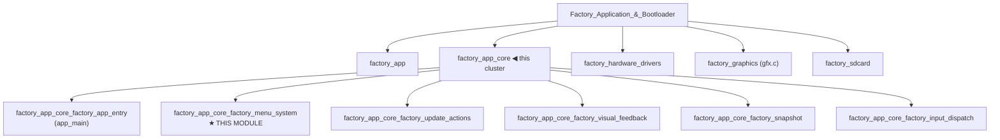
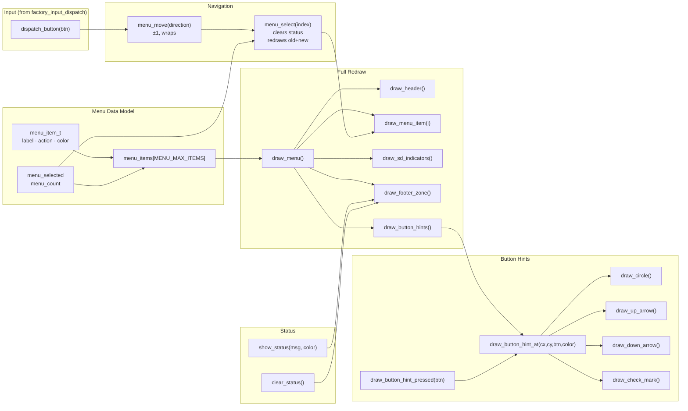
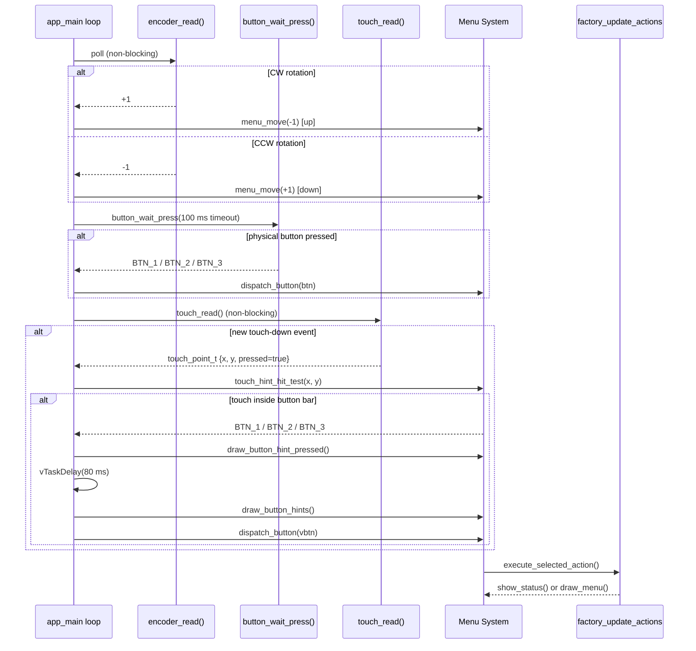
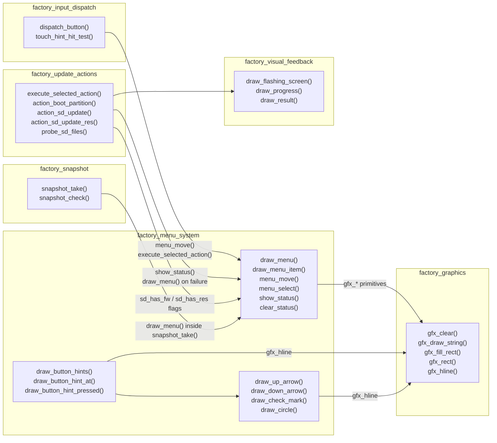
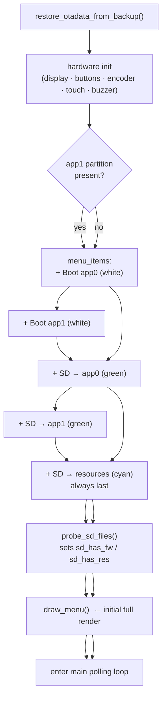
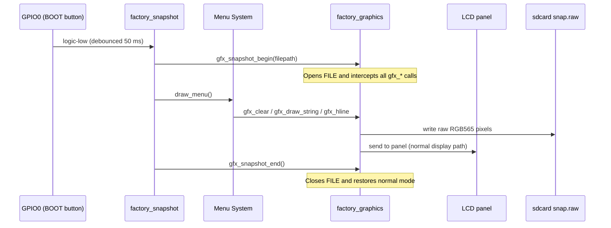

# Factory App Core — Factory Menu System

## Introduction

The **Factory Menu System** is the interactive UI engine at the heart of the recovery
partition. It renders a scrollable, touch-navigable menu on the bare-metal display
(no LVGL, no RTOS UI layer), accepts input from physical buttons, a rotary encoder,
and virtual touch-screen buttons, and provides visual feedback while an action is
being executed.

The module runs inside the factory application partition and is entered either by
the custom bootloader hook (PiBot pendant) or by the main firmware's `[ESP444]FACTORY`
software trigger (all other boards). It is fully self-contained: no FreeRTOS task
synchronization, no event loop — just a polled `while(1)` that drives display,
input, and actions from a single thread.

---

## Module Position in the Factory Application



> **See also:**
> - [`factory_app_core_factory_app_entry.md`](factory_app_core_factory_app_entry.md) — hardware init sequence before the menu starts
> - [`factory_app_core_factory_update_actions.md`](factory_update_actions_dispatch.md) — OTA flash and partition switch logic called from the menu
> - [`factory_app_core_factory_visual_feedback.md`](factory_graphics.md) — progress bar and result overlays shown during flashing
> - [`factory_app_core_factory_input_dispatch.md`](factory_menu_system.md) — `dispatch_button()` and `touch_hint_hit_test()` unified input routing
> - [`Factory_Application_&_Bootloader_factory_graphics.md`](factory_graphics.md) — `gfx_*` primitive layer used by all drawing functions

---

## Boards That Implement This Module

The menu system logic is **identical across all boards**; only the layout constants
change to match each panel's resolution and font size.

| Board | Logical canvas | Font (W×H) | Circle R | Touch columns |
|---|---|---|---|---|
| `pibot_pendant_v1_0` | 240×320 portrait | 8×16 | 20 px | screen ÷ 3 |
| `esp32s3_bzm_tft35_gt911` | 320×480 portrait | 11×21 | 27 px | screen ÷ 3 |
| `esp32s3_8048s070c` | 800×480 → 272×480¹ | 12×24 | 30 px | midpoint² |
| `esp32s3_hmi43v3` | 800×480 → 272×480¹ | 12×24 | 30 px | midpoint² |
| `esp32s3_zx3d50ce02s_usrc_4832` | 480×320 landscape | 8×16 | 22 px | midpoint² |

¹ Physical glass is 480×272 landscape; pendant enclosure mounts it rotated 90°, so
  the logical LVGL/gfx canvas is 272×480 portrait — same topology as the bzm board.

² On wide landscape canvases, the three button-hint circles are clustered around the
  horizontal center. Dividing `SCREEN_WIDTH / 3` would put BTN_1 and BTN_3 in the
  wrong (middle) column. These boards use the midpoint between adjacent circle centers
  as the column boundary instead.

---

## Architecture Overview



---

## Screen Anatomy

Every board renders the same logical screen structure. Pixel values below use the
PiBot pendant (240×320) as the reference; other boards scale proportionally.

```
┌──────────────────────────────────────┐  y=0
│  ╔══════════════════════════════════╗│  double-border outline
│  ║  Recovery v1.x.y (cyan)         ║│  y≈10–13  draw_header()
│  ╚══════════════════════════════════╝│
│  ─────────────────────────── (gray) │  y≈30–40  separator
│  Active: app0 (yellow)              │  y≈40–53  OTA label
│  SD: FW RES (green/cyan)            │  y≈61–81  SD indicators
│  ─────────────────────────── (gray) │  y≈78–104 separator
│                                     │
│ ┌ menu item 0 (highlight box) ──── ┐│  MENU_START_Y
│ │  Boot app0 ◀ selected (bright)  ││  MENU_ITEM_H per row
│ └────────────────────────────────── ┘│
│   SD -> app0 (green)                │  draw_menu_item()
│   SD -> app1 (green)                │
│   SD -> resources (cyan)            │
│                                     │
│  ─────────────────────────── (gray) │  STATUS_Y - 5
│  Power off to cancel (dark gray)    │  STATUS_Y  draw_footer_zone()
│  ─────────────────────────── (gray) │  BTN_HINT_BASE_Y - 1
│                                     │
│   ╭───╮      ╭───╮      ╭───╮      │  draw_button_hints()
│   │ ↑ │(blu) │ ↓ │(blu) │ ✓ │(grn) │  BTN_HINT_CY
│   ╰───╯      ╰───╯      ╰───╯      │
└──────────────────────────────────────┘  y=SCREEN_HEIGHT
```

---

## Data Structures

### `menu_item_t`

Defined identically in every board's `main.c`:

```c
typedef struct {
    const char *label;    /* Display string (e.g. "Boot app0", "SD -> app0") */
    menu_action_t action; /* Which action execute_selected_action() will run  */
    uint16_t color;       /* RGB565 text color when the item is NOT selected  */
} menu_item_t;
```

### `menu_action_t` (enum)

```c
typedef enum {
    MENU_ACTION_BOOT_APP0,        /* esp_ota_set_boot_partition("app0") + restart  */
    MENU_ACTION_BOOT_APP1,        /* same for "app1" (only on 8 MB boards)          */
    MENU_ACTION_SD_UPDATE_APP0,   /* OTA flash esp3dfw.bin → app0                  */
    MENU_ACTION_SD_UPDATE_APP1,   /* OTA flash esp3dfw.bin → app1                  */
    MENU_ACTION_SD_UPDATE_RES,    /* Raw-write ui_resources.bin → ui_resources part */
} menu_action_t;
```

### Global Menu State (file-static)

| Variable | Type | Purpose |
|---|---|---|
| `menu_items[]` | `menu_item_t[MENU_MAX_ITEMS]` | Populated at startup by `app_main` |
| `menu_count` | `int` | Number of valid entries (2–5 depending on partitions / SD) |
| `menu_selected` | `int` | Index of the currently highlighted item |
| `last_status_msg[]` | `char[40]` | Persisted status string for `draw_footer_zone` |
| `last_status_color` | `uint16_t` | RGB565 color paired with `last_status_msg` |

---

## Layout Constants (Board-Specific)

Each board's `main.c` defines its own block of layout constants. These are the
only differences between board implementations.

| Constant | Purpose | pibot (240 px) | bzm (320 px) | hmi/070c (272 px) | zx3d (480 px) |
|---|---|---|---|---|---|
| `MENU_START_Y` | Y of first menu item | 83 | 111 | 94 | 94 |
| `MENU_ITEM_H` | Row height (px) | 30 | 40 | 34 | 34 |
| `MENU_PAD_X` | Left/right padding | 15 | 20 | 20 | 20 |
| `FONT_WIDTH` | px per character | 8 | 11 | 12 | 8 |
| `FONT_HEIGHT` | px per line | 16 | 21 | 24 | 16 |
| `BTN_CIRCLE_R` | Circle icon radius | 20 | 27 | 30 | 22 |
| `BTN_HINT_H` | Total hint-bar height | 49 | 63 | 69 | 53 |
| `BTN_HINT_CX1/2/3` | Icon X centers | ±75 from center | ±100 | ±100 | ±100 |

> `STATUS_Y = SCREEN_HEIGHT - <margin> - BTN_HINT_H`  
> `BTN_HINT_H = 2 * BTN_CIRCLE_R + 9` (separator + padding + diameter + padding + border)

### Color Palette (identical on all boards)

| Constant | RGB565 value | Usage |
|---|---|---|
| `MENU_HIGHLIGHT` | `RGB(0, 80, 160)` dark blue | Selected item background box |
| `MENU_HIGHLIGHT_TXT` | `RGB(80, 160, 255)` bright blue | Selected item label text |
| `BTN_NAV_COLOR` | `RGB(100, 160, 255)` blue | Up / Down button hint circles |
| `BTN_OK_COLOR` | `RGB(100, 220, 100)` green | OK / Select button hint circle |
| `BTN_PRESSED_COLOR` | `RGB(180, 80, 220)` violet | Touch press visual feedback |

---

## Function Reference

### Navigation

#### `menu_select(int index)`

Sets `menu_selected` to `index`, clears any pending status message, and performs a
**partial redraw** — only the previously-selected and newly-selected rows are
repainted. This avoids a full-screen refresh on every keypress.

```
menu_select(index)
  ├── clear_status()        if a status message is pending
  ├── draw_menu_item(old)   repaint the deselected row
  └── draw_menu_item(new)   repaint the newly selected row
```

#### `menu_move(int direction)`

Moves the selection by `+1` (down) or `-1` (up) with wrap-around at list boundaries.

```c
target = menu_selected + direction;
if (target < 0)             target = menu_count - 1;   /* wrap to bottom */
if (target >= menu_count)   target = 0;                /* wrap to top    */
menu_select(target);
```

---

### Rendering

#### `draw_menu()`

Full-screen repaint. Called on startup, after a failed flash operation, and inside
the snapshot system when capturing a raw screenshot.

```
draw_menu()
  ├── draw_header()              clear + title + top separator
  ├── gfx_draw_string(…)        "Active: <ota_label>" in yellow
  ├── draw_sd_indicators()      "SD: FW RES" availability badges
  ├── gfx_hline(…)              section separator
  ├── draw_menu_item(0..N-1)    all visible items
  ├── gfx_hline(…)              footer separator
  ├── draw_footer_zone()        status message or "Power off to cancel"
  └── draw_button_hints()       virtual button icon bar
```

#### `draw_header()`

1. `gfx_clear(COLOR_BLACK)` — full screen wipe
2. Two `gfx_rect()` calls — decorative white double-border outline
3. `gfx_draw_string()` — "Recovery `VERSION_BOOTLOADER`" centered in cyan
4. `gfx_hline()` — gray horizontal separator below title

#### `draw_menu_item(int index)`

Repaints a single row. The selected item gets a double-border highlight box
(`MENU_HIGHLIGHT`) and bright text (`MENU_HIGHLIGHT_TXT`); unselected items
use the item's own `.color` field.

```
draw_menu_item(index)
  ├── gfx_fill_rect(…)     clear the row background
  ├── if selected:
  │   ├── gfx_rect(…)      outer highlight border (MENU_HIGHLIGHT)
  │   └── gfx_rect(…)      inner highlight border, 1 px inset
  └── gfx_draw_string(…)   label text (MENU_HIGHLIGHT_TXT or item.color)
```

#### `draw_sd_indicators()`

Reads the file-static `sd_has_fw` and `sd_has_res` flags (set by `probe_sd_files()`
in [`factory_app_core_factory_update_actions.md`](factory_update_actions_dispatch.md))
and renders "FW" (green) and/or "RES" (cyan) tags right-aligned within the header zone.

#### `draw_footer_zone()`

Renders either:
- The current `last_status_msg` in `last_status_color` when a status is set, or
- The default dimmed "Power off to cancel" hint when no status is active.

This function is called both by `show_status()` / `clear_status()` for immediate
updates **and** by `draw_menu()` during full redraws, so the status line is always
consistent.

---

### Status Management

#### `show_status(const char *msg, uint16_t color)`

Stores `msg` and `color` into the file-static buffers, then immediately calls
`draw_footer_zone()`. Used by update actions to report progress or errors without
triggering a full screen redraw.

#### `clear_status()`

Zeroes `last_status_msg[0]` and repaints the footer zone. Called automatically by
`menu_select()` whenever the user moves the cursor after an error message has appeared.

---

### Button Hint Drawing

The button hint bar is the bottom strip of the screen. It always shows three circle
icons: **↑** (BTN_1, blue), **↓** (BTN_2, blue), **✓** (BTN_3, green).

#### `draw_button_hints()`

Draws the separator line at `BTN_HINT_BASE_Y`, then calls `draw_button_hint_at()`
for each of the three fixed positions (`BTN_HINT_CX1`, `BTN_HINT_CX2`, `BTN_HINT_CX3`).

#### `draw_button_hint_at(int cx, int cy, button_id_t btn, uint16_t color)`

Renders one complete icon:
1. Two concentric circles at radius R and R-1 — double-stroke outline
2. Dispatches to `draw_up_arrow`, `draw_down_arrow`, or `draw_check_mark`

All icon primitives use `gfx_hline()` calls with pixel-exact coordinates scaled
to the board's `BTN_CIRCLE_R`. Coordinate tables are hand-tuned per board variant
(different scaling factors relative to the pibot r=20 reference).

#### `draw_button_hint_pressed(button_id_t btn)`

Recolors a single hint to `BTN_PRESSED_COLOR` (violet) immediately on touch-down.
The caller restores normal colors with `draw_button_hints()` after a short delay:

```
touch press detected
  ├── draw_button_hint_pressed(vbtn)   violet flash (instant)
  ├── buzzer_beep_short()              audible click
  ├── vTaskDelay(80 ms)               hold feedback visible
  ├── draw_button_hints()             restore blue/green colors
  └── dispatch_button(vbtn)           execute the action
```

---

### Icon Primitives

All three icon functions accept `(cx, cy)` as the **center** of the enclosing circle.

#### `draw_up_arrow(int cx, int cy, uint16_t color)`

Pixel-drawn upward arrow: a 7-row arrowhead (widening from tip) above a 10-row
stem. Coordinates are scaled relative to the r=20 pibot reference by ×4/3 (bzm)
or ×1.5 (hmi / 070c).

#### `draw_down_arrow(int cx, int cy, uint16_t color)`

Mirror of the up arrow: 10-row stem above + 7-row arrowhead narrowing to a tip.

#### `draw_check_mark(int cx, int cy, uint16_t color)`

A two-arm check mark (✓): a short left arm going down-right to a vertex, plus a
long right arm going up-right. Rendered with 3–4 px thick horizontal scanlines
plus a junction row at the vertex for visual continuity.

#### `draw_circle(int cx, int cy, int r, uint16_t color)`

Standard midpoint circle algorithm — draws single-pixel scanlines exploiting
8-way octant symmetry. Called twice per button hint (radius R and R-1) to produce
a two-pixel-wide outline.

---

## Touch Hit-Testing

`touch_hint_hit_test(int x, int y)` (defined in
[`factory_app_core_factory_input_dispatch.md`](factory_menu_system.md))
translates a raw touch coordinate into a `button_id_t`. It returns `BTN_NONE` for
any touch above `BTN_HINT_BASE_Y`.

Two column-boundary strategies are used depending on canvas geometry:

### Screen-thirds strategy (portrait boards: pibot, bzm)

```c
int col_w = SCREEN_WIDTH / 3;
if (x < col_w)       return BTN_1;
if (x < 2 * col_w)   return BTN_2;
return BTN_3;
```

Works correctly when icons are evenly spaced across the full screen width.

### Midpoint strategy (wide landscape boards: hmi, 070c, zx3d)

```c
int b12 = (BTN_HINT_CX1 + BTN_HINT_CX2) / 2;
int b23 = (BTN_HINT_CX2 + BTN_HINT_CX3) / 2;
if (x < b12)   return BTN_1;
if (x < b23)   return BTN_2;
return BTN_3;
```

Required because on 480–800 px wide canvases, the three icons are clustered near
the horizontal center (±100 px). A screen-thirds split would map BTN_1 and BTN_3
to the narrow middle band.

---

## Data Flow: Main Event Loop



---

## Component Interaction Diagram



---

## Startup Sequence: Menu Construction

`app_main()` (see [`factory_app_core_factory_app_entry.md`](factory_app_core_factory_app_entry.md))
initializes hardware and then builds the menu dynamically based on available partitions:



Menu item colors communicate the risk level of each action at a glance:

| Color | Meaning |
|---|---|
| **White** | Boot partition — safe, no flash write |
| **Green** | Flash firmware from SD — replaces app partition |
| **Cyan** | Flash resources from SD — replaces `ui_resources` partition |

---

## Snapshot Integration

When `ENABLE_SNAPSHOT` is compiled in, `snapshot_take()` (see
[`factory_app_core_factory_snapshot.md`](factory_sdcard.md))
triggers a full-screen redraw through `draw_menu()` or the flashing-screen pair.
Because all drawing uses the same `gfx_*` primitives, the snapshot file captures
exactly what is on screen, including the current selection highlight and status message.



The `snap2png.py` tool in each board's `Factory/tools/raw2png/` converts `.raw`
files to viewable PNGs.

---

## Error Handling and Recovery

| Scenario | Menu System Response |
|---|---|
| Update action calls `show_status("…", COLOR_RED)` | Footer repaints in red; next cursor move auto-clears via `clear_status()` |
| Flash action fails | `draw_menu()` full redraw + `show_status("FAILED! …", COLOR_RED)` |
| Display init fails in `app_main` | `abort()` — menu never starts |
| SD absent at startup | `probe_sd_files()` leaves `sd_has_fw/res = false`; SD row shows nothing |
| SD removed after startup | Update action reports `"No SD card!"` via `show_status()` |
| Target partition not found | Update action reports `"Partition not found!"` via `show_status()` |

The footer status line is the sole feedback channel between the update actions and
the menu. Every failure path eventually calls `draw_menu()` to restore a clean,
interactive state ready for the next user action.

---

## Key Design Decisions

1. **No LVGL / no RTOS tasks** — The factory app is a privileged recovery tool
   that must work even when the main firmware is corrupt. It uses the bare `gfx_*`
   layer directly and runs everything in a single FreeRTOS task.

2. **Partial redraws on navigation** — `menu_select()` repaints only the two affected
   rows. Full `draw_menu()` is reserved for initialization, post-action recovery,
   and snapshot capture, keeping the UI responsive on slow SPI panels.

3. **Unified input path** — `dispatch_button()` accepts both physical button IDs and
   virtual button IDs resolved by `touch_hint_hit_test()`. The response is identical
   regardless of input source (physical key, encoder, or touch).

4. **Board portability by constants, not `#ifdef`s** — The entire menu logic is
   duplicated per board with only the layout constant block differing. This makes
   board-specific layout issues trivially localizable and avoids complex conditional
   compilation inside drawing functions.

5. **Touch hit zones larger than drawn circles** — `touch_hint_hit_test()` covers
   the full height of the hint bar and a generous horizontal band around each icon,
   making them easy to tap on small touchscreens without precise targeting.

6. **Status persistence across partial redraws** — `last_status_msg[]` and
   `last_status_color` are file-static. `draw_footer_zone()` always reads from them,
   so the status line survives `draw_menu_item()` partial redraws and is correctly
   reproduced inside `snapshot_take()`.
