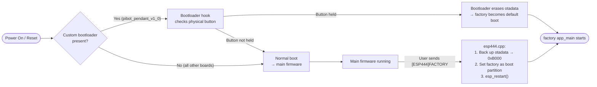
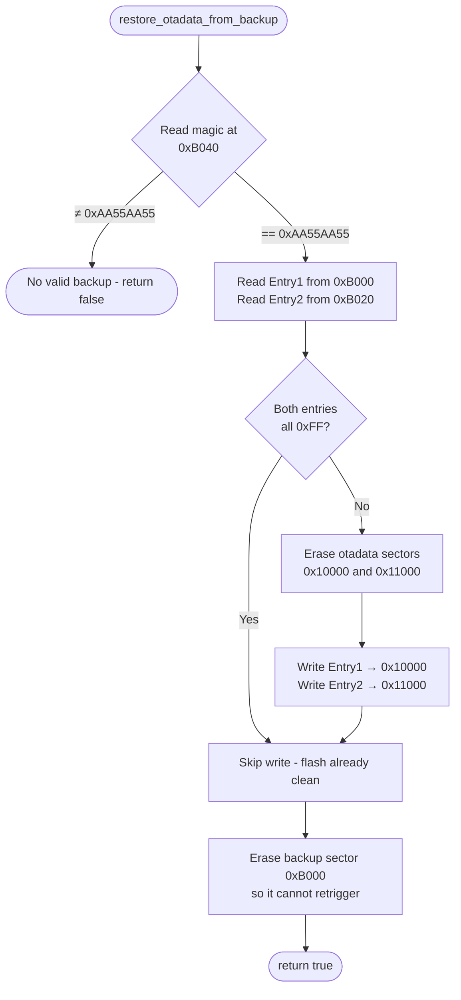
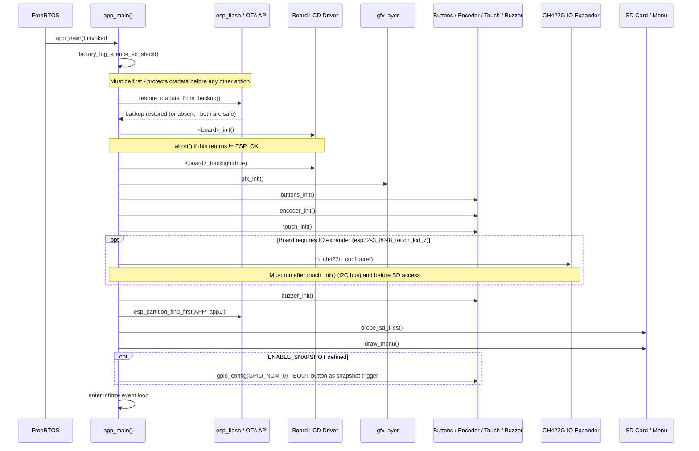
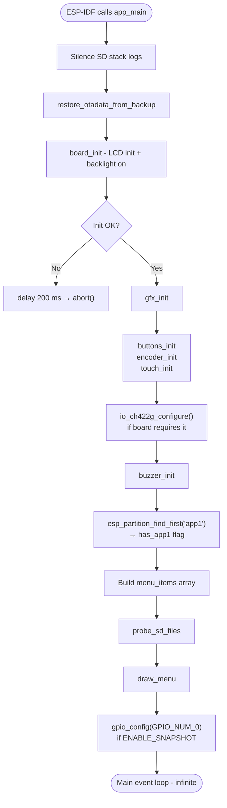
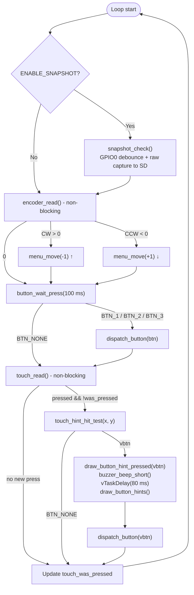
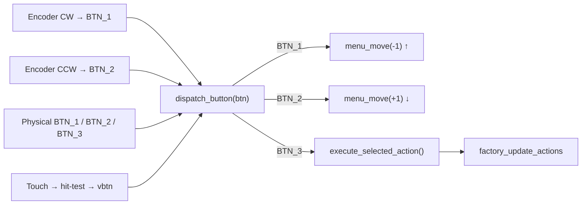
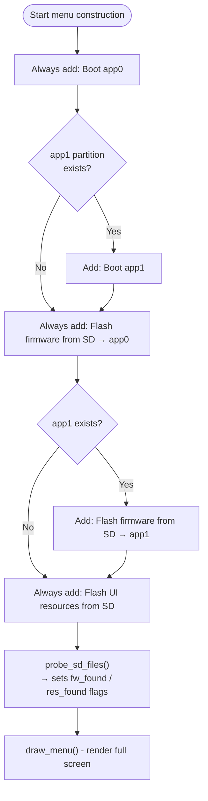
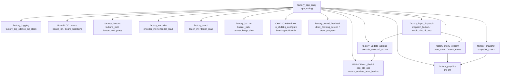

# Factory App Entry (`factory_app_entry`)

The `factory_app_entry` module is the **application entry point** for the factory recovery firmware. It implements `app_main()` — the function ESP-IDF calls immediately after the RTOS scheduler starts — for every supported board variant. Its sole job is to wire together all factory subsystems and run the interactive recovery menu loop.

This module is a leaf of the `factory_core` hierarchy. It depends on every other factory sub-module but contains no reusable logic of its own; all menu, flash, visual, and input logic lives in the sibling modules documented in [factory_app.md](factory_app.md).

---

## Module Hierarchy

```
Factory_Application_&_Bootloader
└── factory_app
    └── factory_core
        ├── factory_app_entry          ← THIS MODULE (app_main per board)
        ├── factory_menu_system
        ├── factory_update_actions
        ├── factory_visual_feedback
        ├── factory_snapshot
        └── factory_input_dispatch
```

---

## Supported Board Variants

Each board has its own `boards/<board>/Factory/main/main.c` that compiles into an independent binary. The entry-point logic is structurally identical across all boards; differences are limited to the LCD driver, screen geometry, and optional IO expander initialization.

| Board | Display Driver | Logical Resolution | Special Hardware |
|---|---|---|---|
| `esp32_2432s028r` | ILI9341 (SPI) | 240 × 320 portrait | — |
| `esp32_3248s035c` | ST7796 (SPI) | 320 × 480 portrait | — |
| `esp32_3248s035r` | ST7796 (SPI) | 320 × 480 portrait | — |
| `esp32s3_4827s043c` | ILI9485 (SPI) | 272 × 480 (glass rotated) | — |
| `esp32s3_8048s043c` | ST7262 (RGB) | 480 × 272 (glass rotated) | — |
| `esp32s3_8048s050c` | ST7262 (RGB) | 480 × 272 (glass rotated) | — |
| `esp32s3_8048s070c` | ST7262 (RGB) | 480 × 272 (glass rotated) | — |
| `esp32s3_8048_touch_lcd_7` | ST7262 (RGB) | 800 × 480 | **CH422G IO expander** (SD_CS via EXIO3) |
| `esp32s3_bzm_tft35_gt911` | ST7796 (SPI) | 320 × 480 portrait | — |
| `esp32s3_hmi43v3` | RM68120 (I80) | varies | I80 parallel bus |
| `esp32s3_zx3d50ce02s_usrc_4832` | ST7796 (I80) | varies | I80 parallel bus |
| `pibot_pendant_v1_0` | ILI9341 (SPI) | 240 × 320 portrait | Physical buttons + encoder + potentiometer |

---

## How the Factory App is Entered

The factory recovery app runs from the ESP-IDF **factory partition** — a dedicated flash region separate from `app0`/`app1`. There are two entry mechanisms:



> **Key invariant:** The main firmware always backs up the current `otadata` to flash offset `0xB000` *before* switching the boot partition to factory. This ensures that power-cycling from inside recovery returns to the correct OTA slot, not just `app0`.

---

## OTA Data Backup / Restore

One of the first acts of `app_main()` — before display, before any user interaction — is `restore_otadata_from_backup()`. This function directly reads and writes raw flash using the `esp_flash_*` APIs.

### Flash Layout

```
0x0000  ┌──────────────────────────────┐
        │ Bootloader                   │
        │     ...                      │
0xB000  ├──────────────────────────────┤  ← OTADATA_BACKUP_OFFSET (4 KB sector)
        │ [0x00 – 0x1F] OTA Entry 1   │  (32 bytes)
        │ [0x20 – 0x3F] OTA Entry 2   │  (32 bytes)
        │ [0x40 – 0x43] BACKUP_MAGIC  │  = 0xAA55AA55
        │     ...                      │
0xC000  ├──────────────────────────────┤  Partition table
0xD000  ├──────────────────────────────┤  NVS
        │     ...                      │
0x10000 ├──────────────────────────────┤  ← OTADATA_OFFSET
        │ OTA data sector 0 (4 KB)     │  slot 0 descriptor
0x11000 ├──────────────────────────────┤
        │ OTA data sector 1 (4 KB)     │  slot 1 descriptor
        │     ...                      │
```

### Restore Decision Logic



> **⚠ PORTING NOTE:** `OTADATA_BACKUP_OFFSET` (`0xB000`) must be 4 KB-aligned, situated after the bootloader and before the partition table. This value **must exactly match** the constant used in the main firmware's `esp444.cpp`. The factory `sdkconfig` must include `CONFIG_SPI_FLASH_DANGEROUS_WRITE_ALLOWED=y` because this sector lies below the first user partition.

### OTA Constants Reference

All boards share the same values. These must remain in sync with `esp444.cpp`:

| Constant | Value | Description |
|---|---|---|
| `OTADATA_OFFSET` | `0x10000` | Flash address of the live OTA data partition |
| `OTADATA_SECTOR_SIZE` | `0x1000` | Size of one OTA data sector (4 KB) |
| `OTADATA_ENTRY_SIZE` | `32` | Size of one OTA slot descriptor (bytes) |
| `OTADATA_BACKUP_OFFSET` | `0xB000` | Flash address of the backup sector |
| `BACKUP_MAGIC_OFFSET` | `0x40` | Offset within backup sector where the magic word lives |
| `BACKUP_MAGIC` | `0xAA55AA55` | Magic word confirming a valid backup exists |

---

## Initialization Sequence

`app_main()` performs a strict, ordered initialization. The sequence is structurally identical across all boards; board-specific driver calls appear at the display init step.



---

## Startup Flow Summary



---

## Main Event Loop

After initialization, `app_main()` enters an infinite polling loop. No additional RTOS tasks are created; the entire factory app runs within the single `app_main` task.



### Input Sources and Timing

| Source | Poll method | Max latency |
|---|---|---|
| BOOT button (snapshot only) | GPIO direct read + software debounce | ~50 ms |
| Rotary encoder | `encoder_read()` non-blocking | < 1 ms |
| Physical buttons | `button_wait_press(100 ms)` blocking | 100 ms |
| Touchscreen (virtual buttons) | `touch_read()` non-blocking + hit-test | < 1 ms |

> Boards without physical buttons or encoder still call `buttons_init()` / `encoder_init()` with all pins configured as `GPIO_NUM_NC`, making those calls safe no-ops. This keeps `app_main()` structurally identical across board families.

---

## Button Dispatch

All input sources funnel through a single `dispatch_button()` call that maps a logical button ID to a menu action:



See [factory_app.md](factory_app.md) → `factory_input_dispatch` and `factory_update_actions` for the downstream action logic.

---

## Menu Construction

The menu item list is built dynamically in `app_main()` based on detected hardware (dual-slot vs. single-slot OTA) and SD card probe results:



SD file presence indicators (`FW` / `RES`) appear in the menu header. They are re-evaluated each time the SD card is remounted (e.g. after a failed flash attempt).

---

## Board-Specific Differences

### LCD Driver Initialization

Each board calls a different driver pair at startup:

| Board group | `_init()` call | Bus type |
|---|---|---|
| `esp32_2432s028r`, `pibot_pendant_v1_0` | `ili9341_init()` | SPI |
| `esp32_3248s035c/r`, `esp32s3_bzm_tft35_gt911` | `st7796_init()` | SPI |
| `esp32s3_4827s043c` | `ili9485_init()` | SPI |
| `esp32s3_8048s043c/050c/070c`, `esp32s3_8048_touch_lcd_7` | `st7262_init()` | RGB parallel |
| `esp32s3_hmi43v3` | RM68120 init | I80 parallel |
| `esp32s3_zx3d50ce02s_usrc_4832` | ST7796 I80 init | I80 parallel |

If `<board>_init()` returns anything other than `ESP_OK`, `app_main()` logs the error, waits 200 ms for the UART buffer to flush, then calls `abort()`. There is no recovery path from a display failure inside the factory app.

### CH422G IO Expander (`esp32s3_8048_touch_lcd_7` only)

This board routes SD_CS through a CH422G I2C IO expander (EXIO3). The factory `app_main()` must call `io_ch422g_configure()` **after** `touch_init()` (which brings up the shared I2C bus) and **before** the first SD access via `probe_sd_files()`. The `CH422G_INITIAL_OUTPUT` bitmask (`0x2E & ~(1<<3)`) must exactly match `board_init.c` in the main firmware to avoid bus conflicts.

### Touch Hit-Test Strategy

The three virtual button circles (BTN_1 = ↑, BTN_2 = ↓, BTN_3 = ✓) are drawn at the bottom of the screen. The hit-test divides the touch area into zones:

| Screen width | Strategy |
|---|---|
| ≤ 320 px (portrait) | Simple thirds: `x < W/3` → BTN_1, `x < 2W/3` → BTN_2, else BTN_3 |
| ≥ 480 px (landscape / large) | Midpoint boundaries between actual button-center X coordinates — avoids zone mismapping on wide screens where a simple third-split would not align with the rendered circles |

### Layout Scaling Constants

Rendering constants are scaled per-board to maintain consistent proportions across screen sizes:

| Board / Logical Resolution | Font size | `BTN_CIRCLE_R` | `MENU_START_Y` | `MENU_ITEM_H` |
|---|---|---|---|---|
| 240 × 320 (ILI9341) | 8 × 16 | 20 | default | default |
| 320 × 480 (ST7796 SPI) | 11 × 21 (×4/3) | 27 | 111 | 40 |
| 272 × 480 (ILI9485) | 8 × 16 | 22 | 94 | 34 |
| 480 × 272 / 800 × 480 (ST7262) | 12 × 24 | 30 | board-specific | board-specific |

---

## SD File Path Constants

| Constant | Path | State |
|---|---|---|
| `FW_FILENAME` | `/sdcard/esp3dfw.bin` | Input: firmware binary to flash |
| `FW_OK_FILENAME` | `/sdcard/esp3dfw.ok` | Renamed after successful flash |
| `FW_BAD_FILENAME` | `/sdcard/esp3dfw.bad` | Renamed after failed flash |
| `RES_FILENAME` | `/sdcard/ui_resources.bin` | Input: UI resources binary |
| `RES_OK_FILENAME` | `/sdcard/ui_resources.ok` | Renamed after successful flash |
| `RES_BAD_FILENAME` | `/sdcard/ui_resources.bad` | Renamed after failed flash |

---

## Component Dependency Graph



---

## Related Documentation

| Document | Relationship |
|---|---|
| [factory_app.md](factory_app.md) | Parent module — describes the full factory app scope and all sibling sub-modules |
| [docs/Factory/](Factory/) | Supplementary factory app design notes and bootloader integration |
| [docs/architecture/screens_architecture.md](https://github.com/luc-github/Pibot-cnc-pendant-firmware/blob/main/docs/architecture/screens_architecture.md) | Contrasts with the main firmware LVGL screen model; factory uses bare-metal GFX with no LVGL |
| [docs/features/feature_resource_matrix.md](https://github.com/luc-github/Pibot-cnc-pendant-firmware/blob/main/docs/features/feature_resource_matrix.md) | Partition layout and OTA slot strategy that the backup/restore mechanism depends on |
| [docs/hardware/pibot-cnc-pendant-hardware-documentation.md](https://github.com/luc-github/Pibot-cnc-pendant-firmware/blob/main/docs/hardware/pibot-cnc-pendant-hardware-documentation.md) | Physical button and encoder wiring for `pibot_pendant_v1_0` |
