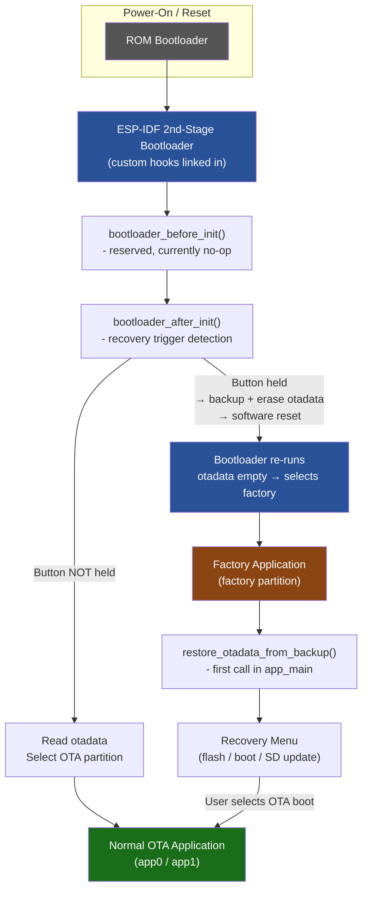
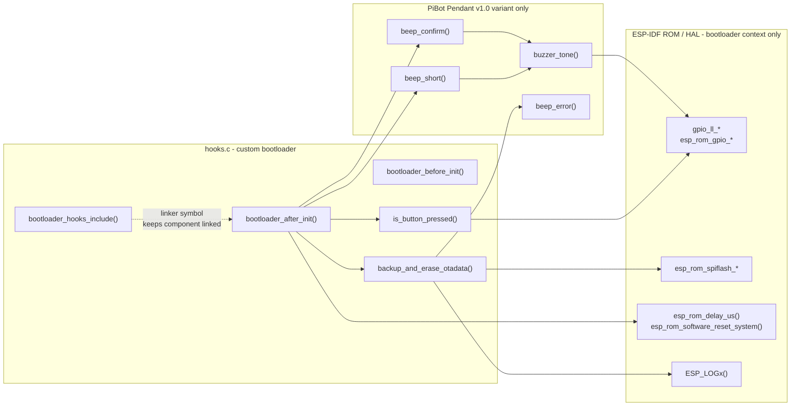
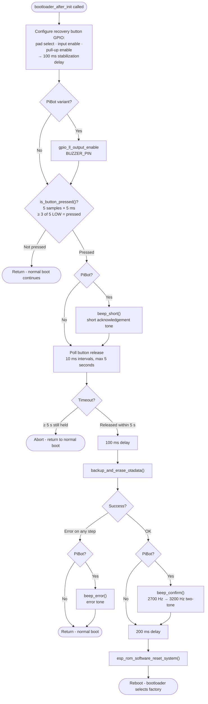
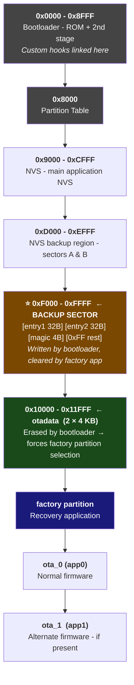
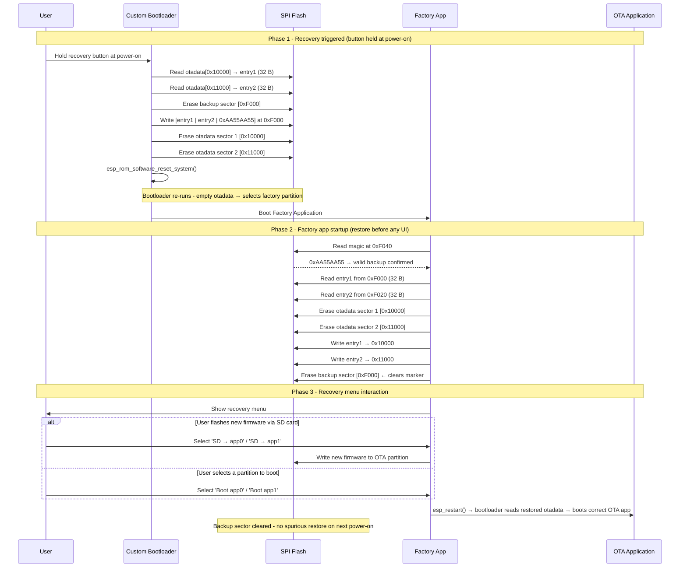

# Factory Bootloader Module

## Introduction

The `factory_bootloader` module implements custom ESP-IDF 2nd-stage bootloader hooks that enable **hardware-triggered factory recovery mode** on all supported board variants. When a designated recovery button is held during power-on, the bootloader transparently backs up the OTA partition selection metadata (`otadata`), erases it to force the next boot into the factory application, and issues a software reset — all before the user application ever executes.

The [factory application](factory_app.md) then restores the backed-up `otadata` during its own startup, ensuring that a power-off from within the recovery menu returns the device to the correct OTA firmware on the next regular boot.

This module is the entry point of the factory recovery system. It works in concert with:
- **[factory_app](factory_app.md)** — the recovery user interface (flashing, partition selection, SD update)
- **[factory_tools](factory_tools.md)** — flash scripts that deploy the complete factory firmware bundle
- **[build_system](tools_build_scripts.md)** — per-board variant build pipelines

---

## System Boot Architecture



> **Key insight:** The bootloader and the factory app cooperate via a single shared flash sector (the backup sector). The bootloader writes to it; the factory app reads and clears it. No IPC or shared RAM is involved — only flash.

---

## Module Structure

Each board delivers the bootloader hooks in two parallel locations within its `Factory/` tree:

```
boards/<BOARD>/Factory/
├── bootloader_components/
│   └── custom_bootloader/
│       └── hooks.c          ← ESP-IDF bootloader component integration point
└── custom_bootloader/
    └── hooks.c              ← Source-directory copy (used by some build configurations)
```

Both files are functionally identical for a given board. The `bootloader_components/` path is the canonical integration path: ESP-IDF automatically detects and links any component placed there when building the bootloader.

### Boards with this module

| Board | Module tag | Recovery button | Buzzer feedback |
|---|---|---|---|
| `ESP32_S3_WROOM_CAM` | `factory_bootloader` (this module) | GPIO0 (BOOT button) | No |
| `pibot_pendant_v1_0` | `pibot_pendant_v1_0_bootloader` | BTN3 | Yes |

> All other boards in the project (esp32_3248s035c, esp32s3_8048s043c, etc.) share the same recovery mechanism but implement it only in the [factory_app](factory_app.md); they do not ship a custom bootloader component. The bootloader module is board-specific and compiled separately from the main firmware.

---

## Component Architecture



> **Bootloader context constraints:** The custom hooks run inside the ESP-IDF 2nd-stage bootloader. No FreeRTOS, no heap allocator, no peripheral drivers — only ROM functions and HAL register-level GPIO / SPI-flash APIs are available.

---

## Recovery Trigger Flow



### Button debounce algorithm

`is_button_pressed()` takes five GPIO samples 5 ms apart and returns `true` only if at least three of them read LOW. This 25 ms window filters electrical noise on the input line without requiring hardware debounce circuitry.

```c
static bool is_button_pressed(int pin) {
    int pressed_count = 0;
    for (int i = 0; i < 5; i++) {
        if (gpio_ll_get_level(&GPIO, pin) == 0) { pressed_count++; }
        esp_rom_delay_us(5000);
    }
    return pressed_count >= 3;  // majority vote
}
```

---

## Flash Memory Layout and Backup Strategy



### Backup sector layout (at `0xF000`)

| Offset | Size | Content |
|--------|------|---------|
| `0x000` | 32 B | `otadata` entry 1 — copy of sector 1 |
| `0x020` | 32 B | `otadata` entry 2 — copy of sector 2 |
| `0x040` | 4 B  | Magic word `0xAA55AA55` — valid backup marker |
| `0x044` | rest | `0xFF` — erased, unused |

The magic word is the sentinel checked by the factory app on startup. If absent or wrong, no restore is attempted and the factory app runs normally (e.g., user launched it via a partition boot command rather than through the recovery trigger).

---

## OTA Data Backup and Restore Cycle



---

## Function Reference

### `bootloader_hooks_include()`

```c
void bootloader_hooks_include(void);
```

Empty function whose sole purpose is to prevent the linker from discarding the custom bootloader component. ESP-IDF's bootloader link step silently drops object files with no referenced symbols. This function is declared `extern` in the ESP-IDF bootloader hook header; referencing it by name pulls the entire translation unit into the link.

---

### `bootloader_before_init()`

```c
void bootloader_before_init(void);
```

Called by ESP-IDF's 2nd-stage bootloader **before** any hardware peripheral initialization. Currently a no-op, reserved for future use such as early clock configuration or power-rail sequencing.

---

### `bootloader_after_init()`

```c
void bootloader_after_init(void);
```

Called by the bootloader **after** all standard hardware initialization is complete. This is the primary recovery trigger entry point. Steps:

1. Configures the recovery button GPIO as input with internal pull-up.
2. Optionally enables the buzzer GPIO output (PiBot variant only).
3. Waits 100 ms for the pull-up voltage to stabilize.
4. Samples the button with `is_button_pressed()`.
5. If not pressed → returns immediately (normal boot path continues).
6. If pressed → waits for release (max 5 s), then calls `backup_and_erase_otadata()` and issues `esp_rom_software_reset_system()`.

---

### `is_button_pressed(pin)`

```c
static bool is_button_pressed(int pin);           // ESP32-S3-WROOM-CAM variant
static bool is_button_pressed(gpio_num_t pin);    // PiBot Pendant v1.0 variant
```

Returns `true` if the given GPIO pin reads LOW in at least 3 of 5 samples taken 5 ms apart. Active-LOW button logic; the GPIO must be configured as input with pull-up before calling.

---

### `backup_and_erase_otadata()`

```c
static void backup_and_erase_otadata(void);
```

Core flash manipulation routine using ROM SPI-flash APIs (available in bootloader context). Operations performed in order:

| Step | ROM API | Flash address |
|------|---------|---------------|
| Read `otadata` entry 1 | `esp_rom_spiflash_read` | `0x10000` (32 B) |
| Read `otadata` entry 2 | `esp_rom_spiflash_read` | `0x11000` (32 B) |
| Erase backup sector | `esp_rom_spiflash_erase_sector` | sector `0xF` → `0xF000` |
| Write backup + magic | `esp_rom_spiflash_write` | `0xF000` (4096 B) |
| Erase `otadata` sector 1 | `esp_rom_spiflash_erase_sector` | sector `0x10` → `0x10000` |
| Erase `otadata` sector 2 | `esp_rom_spiflash_erase_sector` | sector `0x11` → `0x11000` |

Each step is independently checked. On any failure the function logs the error and (on PiBot) emits `beep_error()`, then returns early — leaving `otadata` intact and allowing a clean normal boot.

---

### PiBot Pendant v1.0 — buzzer helpers

These functions exist only in the `pibot_pendant_v1_0_bootloader` variant. They use direct GPIO bit-banging — no hardware timer, no PWM peripheral — which is compatible with the bootloader execution environment.

#### `buzzer_tone(frequency, duration_ms)`

```c
static void buzzer_tone(uint32_t frequency, uint32_t duration_ms);
```

Generates a square wave on `BUZZER_PIN` by toggling the GPIO at the requested frequency for the requested duration. Half-period = `1 000 000 / (2 × frequency)` µs. Timing via `esp_rom_delay_us()`.

#### `beep_short()`

Single short tone played when the recovery button press is first confirmed. Gives the user immediate audible acknowledgement that the gesture was recognized.

#### `beep_confirm()`

Two-tone rising sequence — 2700 Hz then 3200 Hz with a 100 ms gap — played after `otadata` has been successfully backed up and erased. Signals that the reset-to-factory sequence is committed.

#### `beep_error()`

Error tone played on any flash read/write failure inside `backup_and_erase_otadata()`. Signals that the recovery sequence could not complete and the system will fall back to a normal boot.

---

## Board Variant Comparison

| Property | `ESP32_S3_WROOM_CAM` | `pibot_pendant_v1_0` |
|---|---|---|
| Module tag | `factory_bootloader` | `pibot_pendant_v1_0_bootloader` |
| Recovery button | GPIO0 (BOOT, active LOW) | BTN3 (GPIO, active LOW) |
| Buzzer | None | Yes — GPIO bit-bang |
| Beep on button press | — | `beep_short()` |
| Beep on successful backup | — | `beep_confirm()` |
| Beep on flash error | — | `beep_error()` |
| Display during recovery | None (headless board) | ILI9341 (via factory app) |
| Partition CSV | `partitions_16mb.csv` | Board-specific CSV |

---

## Configuration Constants

Defined in each board's `hooks.c`. **Must** stay synchronized with the board's partition table CSV.

| Constant | Value | Description |
|---|---|---|
| `FLASH_SECTOR_SIZE` | `0x1000` | Flash erase unit — 4096 B |
| `BOOT_BUTTON_PIN` | `0` (WROOM-CAM) | GPIO pin for recovery trigger |
| `OTADATA_OFFSET` | `0x10000` | `otadata` partition start address |
| `OTADATA_SECTOR_1` | `0x10` | Flash sector index — `otadata` entry 1 |
| `OTADATA_SECTOR_2` | `0x11` | Flash sector index — `otadata` entry 2 |
| `OTADATA_BACKUP_OFFSET` | `0xF000` | Backup sector start address |
| `OTADATA_BACKUP_SECTOR` | `0xF` | Flash sector index — backup |
| `OTADATA_ENTRY_SIZE` | `32` | Size of one `otadata` entry in bytes |
| `BACKUP_MAGIC_OFFSET` | `0x40` | Offset of magic word within backup sector |
| `BACKUP_MAGIC` | `0xAA55AA55` | Valid-backup sentinel value |
| `RELEASE_TIMEOUT_US` | `5 000 000` | Max wait for button release (5 s) |
| `POLL_INTERVAL_US` | `10 000` | Button polling period (10 ms) |

---

## Integration — Adding a New Board

To add factory bootloader recovery to a new board:

1. **Create the component directory:**
   ```
   boards/<NEW_BOARD>/Factory/bootloader_components/custom_bootloader/
   ```

2. **Copy `hooks.c`** from the closest existing variant and update:
   - The recovery button GPIO constant to match the board hardware.
   - `OTADATA_OFFSET` and `OTADATA_BACKUP_OFFSET` to match the new board's partition CSV.
   - Add `buzzer_tone()` / `beep_*()` helpers if the board has a buzzer.

3. **Add `CMakeLists.txt`** in `custom_bootloader/`:
   ```cmake
   idf_component_register(SRCS "hooks.c" INCLUDE_DIRS ".")
   ```

4. **Verify the partition CSV** — the backup sector address must not overlap any application-defined partition.

5. **Update the factory app** (`main.c`) to use the same `OTADATA_BACKUP_OFFSET` and `BACKUP_MAGIC` values so `restore_otadata_from_backup()` can locate the backup written by the bootloader.

6. **Deploy** using the board's factory tools scripts — see [factory_tools](factory_tools.md) for the `flash_all.py` and `flash_factory.py` helpers.

---

## Safety Properties

| Property | How it is guaranteed |
|---|---|
| No data loss on button held too long | Release timeout (5 s): if not released, `backup_and_erase_otadata()` is never called |
| No data loss on flash error | Each flash operation is independently checked; function returns early before `otadata` is erased |
| Idempotent factory boot | Backup sector is cleared by the factory app after a successful restore; re-entering factory without a button press finds no valid magic and skips the restore |
| No FreeRTOS / heap dependency | Only ROM SPI-flash and ROM delay functions are used — valid in bootloader context |
| Partition alignment | Constants in `hooks.c` must mirror the CSV; mismatches are caught during board bring-up |

---

## Related Documentation

- [factory_app.md](factory_app.md) — recovery menu, `restore_otadata_from_backup()`, SD flashing workflow
- [factory_tools.md](factory_tools.md) — `flash_all.py` and `flash_factory.py` deployment scripts
- [build_system.md](tools_build_scripts.md) — per-board build variant pipeline
- [pibot_pendant_v1_0_bootloader.md](pibot_pendant_v1_0_bootloader.md) — PiBot Pendant v1.0 bootloader variant with buzzer support


## Documents de conception (depot)

- [factory_app_technical_doc.md](https://github.com/luc-github/Pibot-cnc-pendant-firmware/blob/main/docs/Factory/factory_app_technical_doc.md)


## Documents de conception (depot)

- [bootloader_technical_doc](https://github.com/luc-github/Pibot-cnc-pendant-firmware/blob/main/docs/Factory/bootloader_technical_doc.md)
