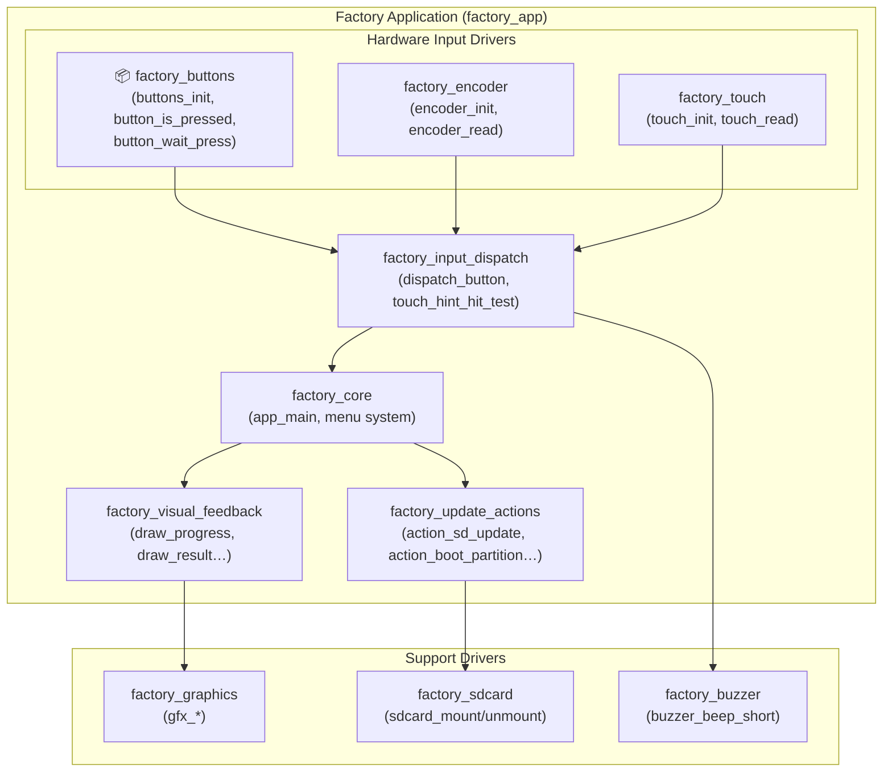
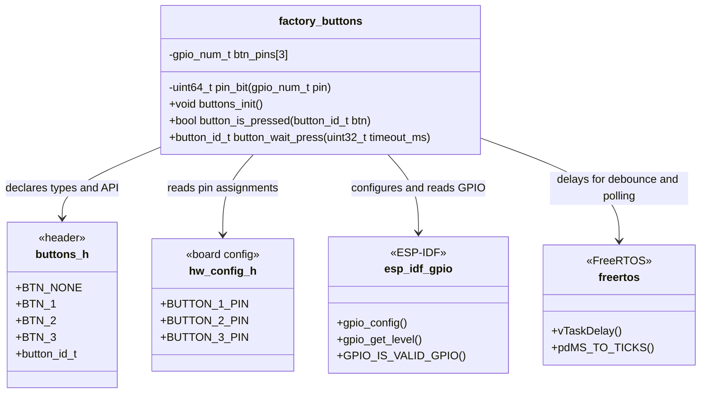
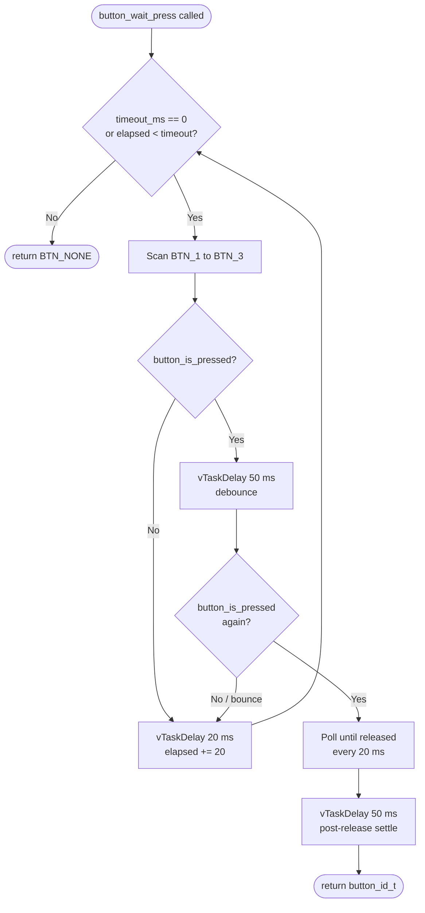
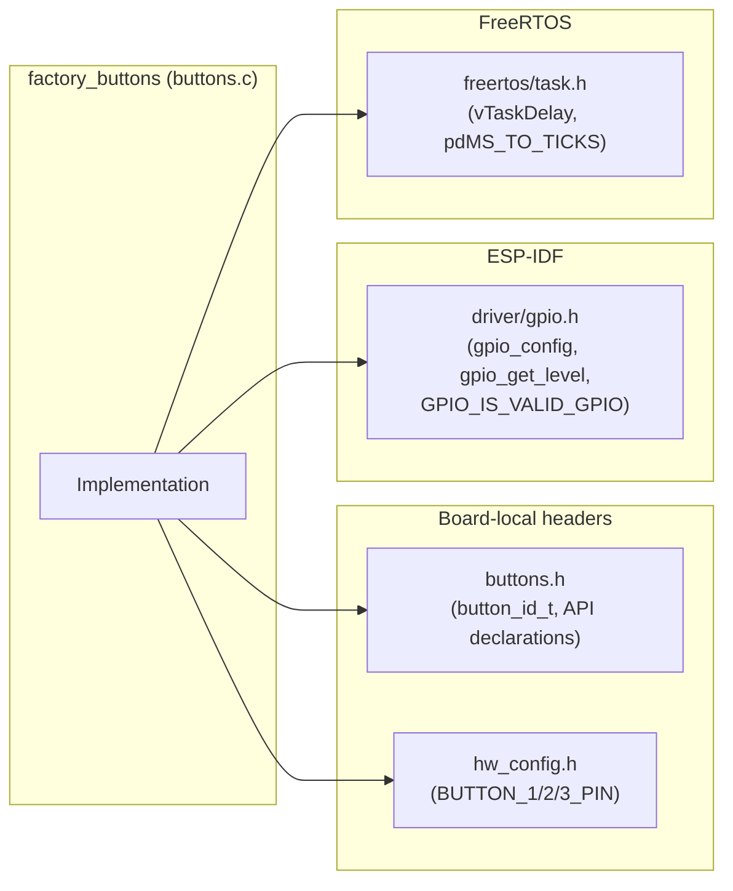

# Factory Buttons Module

## Overview

The `factory_buttons` module is a lightweight, portable GPIO button driver used exclusively within the [Factory Application](factory_app.md). It provides a minimal polling-based API to initialize, query, and wait for up to three physical push-buttons on supported ESP32 boards during factory testing and firmware flashing operations.

The implementation is **identical across all supported boards**. Board-specific pin assignments are isolated in each board's `hw_config.h`, keeping the driver logic fully generic. Boards that have no physical buttons (where pins are defined as `GPIO_NUM_NC`) are handled safely: initialization silently no-ops and all queries return `false`/`BTN_NONE`.

---

## Architecture & Position in the Factory Application

The `factory_buttons` module is one of several hardware input drivers that feed input events into the factory application's core logic. Together with the [Factory Encoder](factory_encoder.md) and [Factory Touch](factory_touch.md) drivers, it provides the physical navigation input layer consumed by the Factory Input Dispatch subsystem.



---

## Module Components

The module exposes a four-function API. One function (`pin_bit`) is a `static` internal helper not visible outside the translation unit; the remaining three form the public interface declared in `buttons.h`.



---

## API Reference

### `static uint64_t pin_bit(gpio_num_t pin)` *(internal)*

Safely converts a GPIO number into a 64-bit bitmask compatible with `gpio_config_t.pin_bit_mask`. Returns `0ULL` for any pin that fails `GPIO_IS_VALID_GPIO()` (including `GPIO_NUM_NC = -1`). This prevents the compiler from flagging a negative left-shift on boards that define unused button pins as `GPIO_NUM_NC`.

```c
static uint64_t pin_bit(gpio_num_t pin)
{
    return GPIO_IS_VALID_GPIO(pin) ? (1ULL << pin) : 0ULL;
}
```

---

### `void buttons_init(void)`

Configures the GPIO pins for `BTN_1`, `BTN_2`, and `BTN_3` as inputs with internal pull-ups. Uses `pin_bit()` to build the combined mask; **silently returns without calling `gpio_config()`** if the computed mask is zero (all pins are `GPIO_NUM_NC`), making the function safe on boards with no physical buttons.

| GPIO Parameter       | Value                   | Rationale                           |
|----------------------|-------------------------|-------------------------------------|
| `mode`               | `GPIO_MODE_INPUT`       | Read-only                           |
| `pull_up_en`         | `GPIO_PULLUP_ENABLE`    | Active-LOW wiring; idle state HIGH  |
| `pull_down_en`       | `GPIO_PULLDOWN_DISABLE` | Not needed with pull-up             |
| `intr_type`          | `GPIO_INTR_DISABLE`     | Pure polling, no ISR                |

**Called by:** `app_main` in [factory_core](factory_app.md) during hardware initialization.

---

### `bool button_is_pressed(button_id_t btn)`

Instantaneous, non-blocking GPIO level read. Returns `true` if the specified button is currently held down.

| Condition                          | Return value |
|------------------------------------|--------------|
| `btn` out of `[BTN_1, BTN_3]`     | `false`      |
| Pin is not a valid GPIO            | `false`      |
| `gpio_get_level(pin) == 0`        | `true`       |
| `gpio_get_level(pin) == 1`        | `false`      |

Active-LOW convention: the button pulls the GPIO line to GND when pressed; pull-up resistor holds it HIGH when released.

**Called by:** `button_wait_press()` (internally) and directly by the input dispatch layer where immediate state polling is needed (e.g., `dispatch_button`).

---

### `button_id_t button_wait_press(uint32_t timeout_ms)`

Blocking poll that scans all buttons in order (`BTN_1` → `BTN_3`) at a 20 ms interval. When a button is detected as pressed, a 50 ms debounce delay is applied and the level re-checked. Returns the button identifier after the button is fully released plus a 50 ms post-release settling delay. Returns `BTN_NONE` on timeout.

| Parameter      | Value | Notes                                       |
|----------------|-------|---------------------------------------------|
| Poll interval  | 20 ms | Determines worst-case response latency      |
| Debounce delay | 50 ms | Applied both on press detection and on post-release settle |
| Timeout = 0    | —     | Infinite wait; loop runs until a button is pressed |

**Called by:** `app_main` (initial boot gate check) and `dispatch_button` (menu navigation) in [factory_core](factory_app.md).

---

## Button Press Detection Flow



---

## Board Support Matrix

The driver implementation is identical on all boards. Only the pin assignments in each board's `hw_config.h` differ. Boards with no physical buttons set unused pin constants to `GPIO_NUM_NC`, causing `buttons_init()` to skip GPIO configuration entirely.

| Board | Button file path | Notes |
|---|---|---|
| `esp32_3248s035c` | `boards/esp32_3248s035c/Factory/main/buttons.c` | Up to 3 physical buttons |
| `esp32_3248s035r` | `boards/esp32_3248s035r/Factory/main/buttons.c` | Up to 3 physical buttons |
| `esp32s3_4827s043c` | `boards/esp32s3_4827s043c/Factory/main/buttons.c` | Up to 3 physical buttons |
| `esp32s3_8048_touch_lcd_7` | `boards/esp32s3_8048_touch_lcd_7/Factory/main/buttons.c` | Up to 3 physical buttons |
| `esp32s3_8048s043c` | `boards/esp32s3_8048s043c/Factory/main/buttons.c` | Up to 3 physical buttons |
| `esp32s3_8048s050c` | `boards/esp32s3_8048s050c/Factory/main/buttons.c` | Up to 3 physical buttons |

> **Note:** The boards `esp32s3_8048s070c`, `esp32s3_bzm_tft35_gt911`, `esp32s3_hmi43v3`, `esp32s3_zx3d50ce02s_usrc_4832`, and `pibot_pendant_v1_0` also ship a `buttons.c` but are categorized under `factory_hardware_drivers` / `factory_app_core` in the module tree. Their implementations follow the same identical pattern.

---

## Dependencies



| Dependency | Type | Purpose |
|---|---|---|
| `buttons.h` | Local header | Declares `button_id_t` enum (`BTN_NONE`, `BTN_1`–`BTN_3`) and function prototypes |
| `hw_config.h` | Board-specific header | Provides `BUTTON_1_PIN`, `BUTTON_2_PIN`, `BUTTON_3_PIN` GPIO number constants |
| `driver/gpio.h` (ESP-IDF) | System | `gpio_config_t`, `gpio_config()`, `gpio_get_level()`, `GPIO_IS_VALID_GPIO()` |
| `freertos/FreeRTOS.h` + `freertos/task.h` | System | `vTaskDelay()`, `pdMS_TO_TICKS()` for debounce and polling delays |

---

## Design Notes

**No interrupts.**
The driver uses pure polling (`GPIO_INTR_DISABLE`). This is intentional for the factory application context, where simplicity and predictability outweigh the efficiency gains of interrupt-driven input. The factory app does not operate under real-time UI constraints.

**Active-LOW convention.**
All buttons are wired to pull the GPIO low when pressed. Internal pull-up resistors are enabled so the idle state is HIGH without requiring external components.

**`GPIO_NUM_NC` guard.**
The `pin_bit()` helper centralizes the invalid-pin check. This design allows `buttons_init()` to assemble a combined bitmask for all three button pins and skip `gpio_config()` entirely if the board has no physical buttons, rather than requiring per-pin conditionals scattered through the init code.

**Blocking wait with release detection.**
`button_wait_press()` waits for the button to be fully released before returning. This prevents the same press from being consumed twice (once inside `button_wait_press()`, once by a subsequent `button_is_pressed()` poll in the caller), and eliminates the need for callers to implement release tracking.

**Factory-only scope.**
This module is factory-application-only. The production firmware uses a separate input system. See the BSP [physical inputs layer](Hardware_Peripheral_Drivers.md) (`phy_buttons_config_t`) and the main firmware's [control event](Hardware_Peripheral_Drivers.md) pipeline for runtime button handling in the main application.

---

## Related Modules

| Module | Relationship |
|---|---|
| [Factory Application (factory_app)](factory_app.md) | Parent module; owns initialization order and calls `buttons_init()` and `button_wait_press()` |
| [Factory Encoder](factory_encoder.md) | Sibling input driver; provides rotary encoder navigation as an alternative to push-buttons |
| [Factory Touch](factory_touch.md) | Sibling input driver; provides touchscreen navigation on boards with a capacitive panel |
| [Factory Buzzer](factory_buzzer.md) | Sibling; provides audio feedback triggered by the input dispatch layer on button events |
| [Factory Graphics](factory_graphics.md) | Sibling; renders button hint overlays (`draw_button_hint_at`, `draw_button_hints`) that correspond to the physical buttons handled here |
| [Hardware Abstraction Layer](Hardware_Peripheral_Drivers.md) | Provides the equivalent runtime button driver (`phy_buttons_config_t`) used in the production firmware — not used by the factory app |
