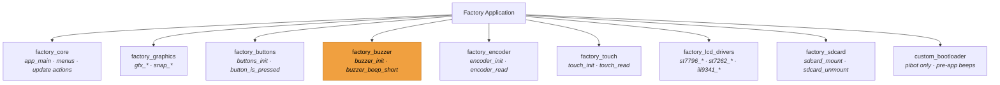
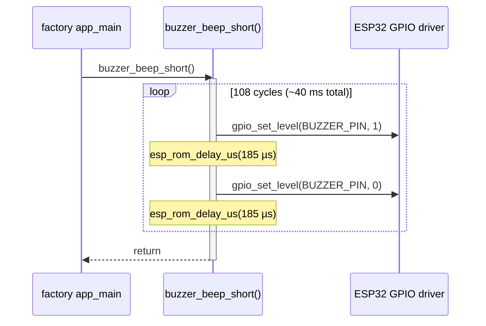
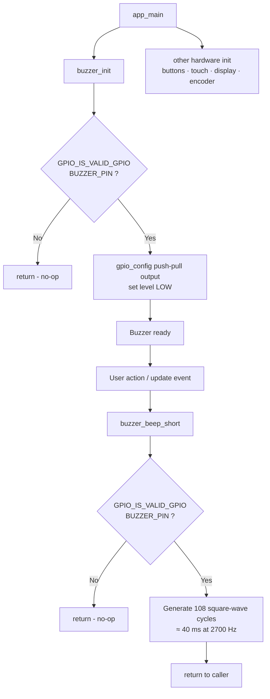
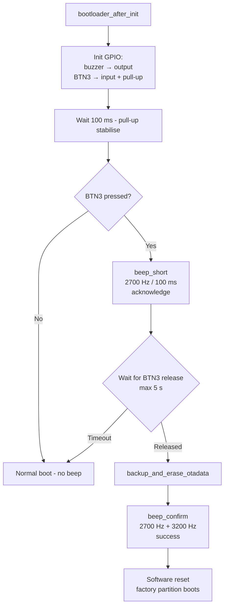
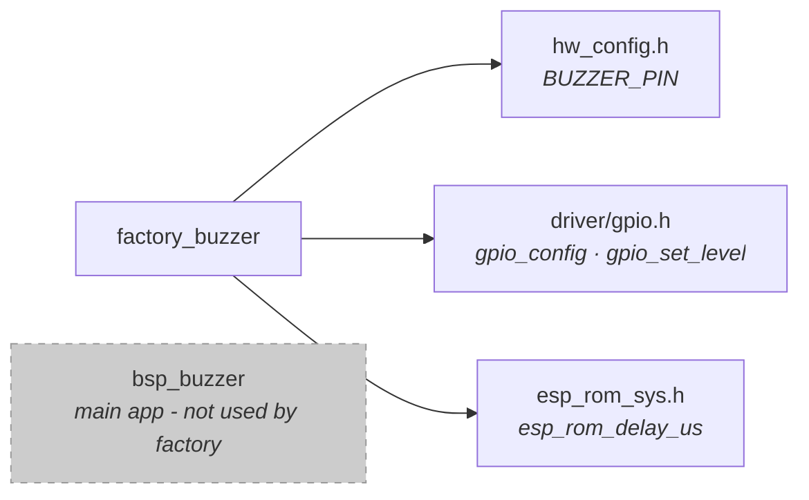

# factory_buzzer

The `factory_buzzer` module is a minimal, synchronous buzzer driver used exclusively within the **Factory Application**. It provides simple audio feedback — a single short beep — during factory test, firmware flashing, and OTA operations, using a bit-banged square-wave technique that requires no LEDC/PWM peripheral and no FreeRTOS infrastructure.

> **Scope:** This module covers the factory-app-level buzzer only. For the main pendant firmware's full-featured buzzer (LEDC PWM + FreeRTOS task + tone sequences), see [bsp_buzzer](bsp_buzzer.md).

---

## Architecture Overview

`factory_buzzer` is one of several per-board hardware drivers that form the factory application's thin hardware abstraction layer. It sits alongside `factory_buttons`, `factory_encoder`, `factory_touch`, and `factory_lcd_drivers` as a direct child of `factory_app`.



---

## Design Philosophy

The factory buzzer is intentionally minimal. The factory application runs before the main firmware is active and must operate in a stripped-down environment — no RTOS scheduler dependence, no heap pressure, no LEDC timer setup. The bit-bang approach satisfies all these constraints with zero peripheral configuration overhead.

The table below contrasts it with the full `bsp_buzzer` used by the main pendant firmware:

| Aspect | `factory_buzzer` | [`bsp_buzzer`](bsp_buzzer.md) (main app) |
|---|---|---|
| Signal generation | Bit-bang GPIO toggle | LEDC hardware PWM |
| Execution model | Synchronous / blocking | FreeRTOS task + queue |
| Interface | Plain C functions | C++ `Buzzer` class |
| Tone control | Fixed — 2700 Hz / 40 ms | `buzzer_tone_t[]` sequences |
| Frequency range | Single fixed value | Arbitrary per-tone `freq_hz` |
| ESP-IDF dependencies | `driver/gpio.h`, `esp_rom_sys.h` | LEDC, FreeRTOS, semaphore |
| Dynamic allocation | None | `malloc` for tone array |
| Context | Factory `app_main` task | Any FreeRTOS task |

---

## Board Support

The module is instantiated once per supported board. Each board's `hw_config.h` defines `BUZZER_PIN` as the GPIO number allocated to the buzzer transducer.

Boards without a physical buzzer set `BUZZER_PIN = GPIO_NUM_NC`. All ESP32-S3 series boards and the newer ESP32 variants include a `GPIO_IS_VALID_GPIO()` guard that silently no-ops on such boards. The `pibot_pendant_v1_0` is an older variant that predates the guard pattern — its `BUZZER_PIN` is always a real GPIO, so no guard is needed.

| Board | Physical buzzer | `GPIO_IS_VALID_GPIO` guard |
|---|:---:|:---:|
| `esp32_3248s035c` | ✓ | ✓ |
| `esp32_3248s035r` | ✓ | ✓ |
| `esp32s3_4827s043c` | ✓ | ✓ |
| `esp32s3_8048_touch_lcd_7` | ✓ | ✓ |
| `esp32s3_8048s043c` | ✓ | ✓ |
| `esp32s3_8048s050c` | ✓ | ✓ |
| `esp32s3_8048s070c` | ✓ | ✓ |
| `esp32s3_bzm_tft35_gt911` | ✓ | ✓ |
| `esp32s3_hmi43v3` | ✓ | ✓ |
| `esp32s3_zx3d50ce02s_usrc_4832` | ✓ | ✓ |
| `pibot_pendant_v1_0` | ✓ | ✗ (pin always valid) |

---

## File Structure

Each board ships its own copy of `buzzer.c` under `boards/<board>/Factory/main/`. The implementations are functionally identical across all guarded boards; the pibot variant simply omits the guards.

```
boards/
├── esp32_3248s035c/Factory/main/buzzer.c
├── esp32_3248s035r/Factory/main/buzzer.c
├── esp32s3_4827s043c/Factory/main/buzzer.c
├── esp32s3_8048_touch_lcd_7/Factory/main/buzzer.c
├── esp32s3_8048s043c/Factory/main/buzzer.c
├── esp32s3_8048s050c/Factory/main/buzzer.c
├── esp32s3_8048s070c/Factory/main/buzzer.c
├── esp32s3_bzm_tft35_gt911/Factory/main/buzzer.c
├── esp32s3_hmi43v3/Factory/main/buzzer.c
├── esp32s3_zx3d50ce02s_usrc_4832/Factory/main/buzzer.c
└── pibot_pendant_v1_0/
    ├── Factory/main/buzzer.c                       ← factory app (no guard)
    └── Factory/custom_bootloader/hooks.c           ← bootloader-stage beeps
```

---

## API Reference

### `void buzzer_init(void)`

Configures `BUZZER_PIN` as a push-pull output and drives it low (silent).

- If `BUZZER_PIN == GPIO_NUM_NC`, returns immediately without touching any register.
- Must be called once from `app_main` before any call to `buzzer_beep_short`.
- Uses `gpio_config()` via a `gpio_config_t` struct; the internal `pin_bit()` helper constructs the bitmask safely.

### `void buzzer_beep_short(void)`

Emits a single short beep using a bit-banged square wave.

| Parameter | Value | Derivation |
|---|---|---|
| Frequency | 2700 Hz | `BEEP_FREQ_HZ` |
| Duration | 40 ms | `BEEP_DURATION_MS` |
| Half-period | ≈ 185 µs | `1 000 000 / (2 × 2700)` |
| Cycle count | 108 | `(2700 × 40) / 1000` |

- If `BUZZER_PIN == GPIO_NUM_NC`, returns immediately.
- **Blocking**: occupies the calling task for ≈ 40 ms. In the factory application this is acceptable — the call is made from `app_main` before any LVGL scheduler starts and no real-time constraint applies at that point.

### `static uint64_t pin_bit(gpio_num_t pin)` *(internal)*

Returns the 64-bit GPIO bitmask required by `gpio_config_t.pin_bit_mask`. Returns `0` for invalid (negative) pins, preventing undefined behaviour from a negative shift count inside `gpio_config()`.

```c
static uint64_t pin_bit(gpio_num_t pin)
{
    return GPIO_IS_VALID_GPIO(pin) ? (1ULL << pin) : 0ULL;
}
```

> This helper does not appear in the `pibot_pendant_v1_0` variant because that board unconditionally shifts a known-valid GPIO number.

---

## Signal Timing

### Square-wave waveform (one period)

```
          ← 185 µs →← 185 µs →
GPIO  ____|  HIGH   |   LOW   | HIGH ...
                                        × 108 cycles ≈ 40 ms total
```

### Call sequence



---

## Initialization and Usage Flow



---

## Custom Bootloader Variant (`pibot_pendant_v1_0` only)

The `pibot_pendant_v1_0` board ships a custom ESP-IDF bootloader component (`Factory/custom_bootloader/hooks.c`) that contains its own independent buzzer primitives. These execute at the bootloader stage — before the IDF application framework initialises — and therefore cannot share code or peripherals with the factory app layer.

The implementation uses `gpio_ll_set_level()` (direct register access) rather than `gpio_set_level()` to avoid any driver framework dependency.

### Bootloader-stage buzzer functions

| Function | Frequency | Duration | Purpose |
|---|---|---|---|
| `buzzer_tone(freq_hz, duration_ms)` | Configurable | Configurable | Generic bit-bang primitive |
| `beep_short()` | 2700 Hz | 100 ms | Acknowledges BTN3 press in recovery |
| `beep_confirm()` | 2700 Hz + 3200 Hz | 150 ms + 150 ms | Confirms OTA reset success |

### Recovery boot flow with buzzer feedback



> The bootloader variant is deliberately self-contained. It shares the same `BUZZER_PIN` definition via `hw_config.h` but is compiled as a separate ESP-IDF bootloader component and linked into the bootloader image, not into the factory application binary.

---

## Component Dependencies



`factory_buzzer` is a leaf driver with no inter-module runtime dependencies. The only runtime relationship is that `factory_core` calls `buzzer_beep_short()` at action-confirmation points within `app_main`.

---

## Relationship to Other Modules

| Module | Relationship |
|---|---|
| [bsp_buzzer](bsp_buzzer.md) | Main application buzzer — LEDC + FreeRTOS; entirely separate subsystem, not used in factory context |
| [factory_app](factory_app.md) | Parent; `app_main` calls `buzzer_init()` at startup and `buzzer_beep_short()` to confirm actions |
| [factory_buttons](factory_buttons.md) | Sibling input driver; both are initialised together in `app_main` |
| [factory_hardware_drivers](factory_app.md) | Sibling group containing the equivalent buzzer, buttons, encoder, and touch for the ESP32-S3 board family |
| [custom_bootloader](factory_app.md) | `pibot_pendant_v1_0` only — provides an independent register-level buzzer for pre-application recovery signalling |
