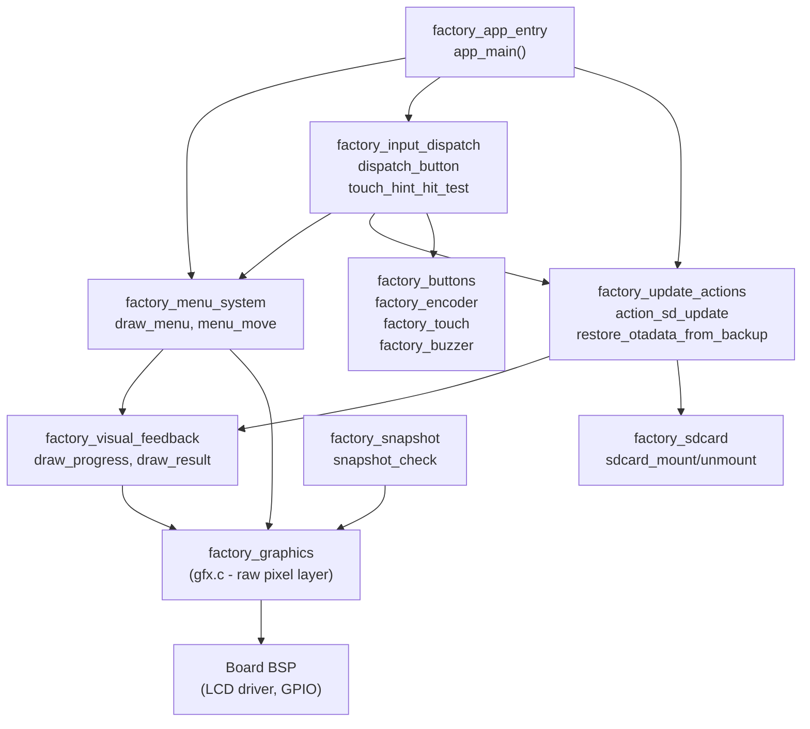
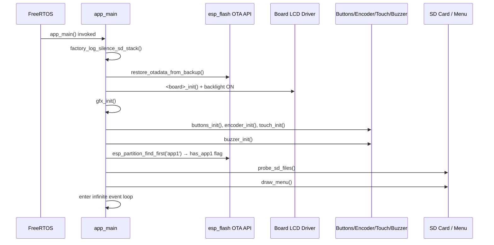
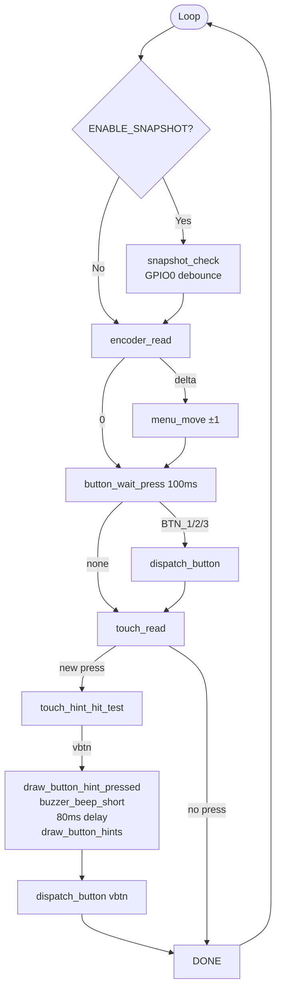
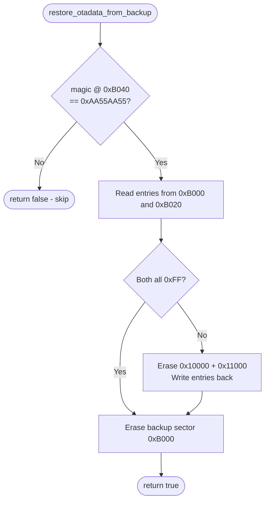

# `factory_core` Module Overview

## Purpose

`factory_core` is the application logic layer of the factory recovery firmware. It runs as a standalone ESP-IDF app from the dedicated `factory` flash partition — entirely separate from the main firmware and independent of LVGL. Its responsibilities are:

- Present an interactive recovery menu on the display immediately after power-on in recovery mode.
- Flash new firmware (`esp3dfw.bin`) or UI resources (`ui_resources.bin`) from an SD card to OTA partitions.
- Switch the active boot partition (`app0` / `app1`) and restart.
- Restore the ESP32 OTA data sector from a backup written by the main firmware before it handed over to recovery.

The module is deliberately minimal: no heap-based UI framework, no background tasks, single `app_main` FreeRTOS task, static buffers throughout.

---

## Architecture

### Position in the Codebase

```
Factory_Application_&_Bootloader
└── factory_app  (ESP32 boards)  /  factory_app_core  (ESP32-S3 boards)
    └── factory_core  ◄── this module
        ├── factory_app_entry
        ├── factory_menu_system
        ├── factory_update_actions
        │   ├── factory_update_actions_otadata
        │   ├── factory_update_actions_sd_flash
        │   └── factory_update_actions_dispatch
        ├── factory_visual_feedback
        ├── factory_snapshot
        └── factory_input_dispatch
```

Support modules consumed by `factory_core` but outside it:

```
factory_graphics  ·  factory_buttons  ·  factory_touch
factory_encoder   ·  factory_buzzer   ·  factory_sdcard
factory_lcd_drivers  ·  factory_logging
```

### Module Interaction



### Startup Sequence



### Main Event Loop



### OTA Data Backup / Restore Flow



---

## Sub-modules

| Sub-module | Path | Responsibility |
|---|---|---|
| `factory_app_entry` | `boards/*/Factory/main/main.c::app_main` | Hardware init, OTA restore, menu bootstrap, infinite event loop |
| `factory_menu_system` | `main.c::draw_menu, menu_move, menu_select, …` | Render scrollable recovery menu; handle navigation; show status |
| `factory_update_actions` | `main.c::action_sd_update, action_sd_update_res, boot_partition, …` | Flash firmware/resources from SD; switch boot partition; OTA data restore |
| `factory_visual_feedback` | `main.c::draw_flashing_screen, draw_progress, draw_result, …` | Progress bar, flashing warning screen, success/failure banner, SD indicators |
| `factory_snapshot` | `main.c::snapshot_check, snapshot_take, snap_find_next_number` | Dev tool: GPIO0 triggered full-screen raw RGB565 capture to SD (compile-time opt-in) |
| `factory_input_dispatch` | `main.c::dispatch_button, touch_hint_hit_test` | Normalize encoder / physical button / touchscreen into `button_id_t`; route to menu or update actions |

---

## Supported Board Variants

The module is duplicated per board. All boards share identical logic; differences are limited to LCD driver, screen dimensions, and IO expander initialization.

| Board | Display | Bus | Special |
|---|---|---|---|
| `esp32_2432s028r` | ILI9341 | SPI | — |
| `esp32_3248s035c/r` | ST7796 | SPI | — |
| `esp32s3_4827s043c` | ILI9485 | SPI | — |
| `esp32s3_8048s043c/050c/070c` | ST7262 | RGB | — |
| `esp32s3_8048_touch_lcd_7` | ST7262 | RGB | CH422G IO expander for SD_CS |
| `esp32s3_bzm_tft35_gt911` | ST7796 | SPI | — |
| `esp32s3_hmi43v3` | RM68120 | I80 | — |
| `esp32s3_zx3d50ce02s_usrc_4832` | ST7796 | I80 | — |
| `pibot_pendant_v1_0` | ILI9341 | SPI | Physical buttons + encoder + potentiometer |

---

## Key Constants (all boards, must match `esp444.cpp`)

| Constant | Value | Description |
|---|---|---|
| `OTADATA_OFFSET` | `0x10000` | Live OTA data partition address |
| `OTADATA_BACKUP_OFFSET` | `0xB000` | Pre-partition-table backup sector |
| `BACKUP_MAGIC` | `0xAA55AA55` | Validates a real backup exists |
| `FW_FILENAME` | `/sdcard/esp3dfw.bin` | Firmware binary input |
| `RES_FILENAME` | `/sdcard/ui_resources.bin` | UI resources binary input |

> `CONFIG_SPI_FLASH_DANGEROUS_WRITE_ALLOWED=y` is required in the factory `sdkconfig` because the backup sector at `0xB000` lies below the first partition table entry.

---

## References

| Document | Topic |
|---|---|
| `docs/Factory/factory_app_technical_doc.md` | Factory app design, bootloader integration |
| `docs/features/feature_resource_matrix.md` | Partition layout and OTA slot strategy |
| `docs/architecture/display_drivers.md` | SPI / I80 / RGB driver architecture, orientation/rotation |
| `docs/guides/esp32_memory_constraints.md` | Heap constraints informing the static-buffer approach |
| `docs/hardware/pibot-cnc-pendant-hardware-documentation.md` | Physical button and encoder wiring for `pibot_pendant_v1_0` |