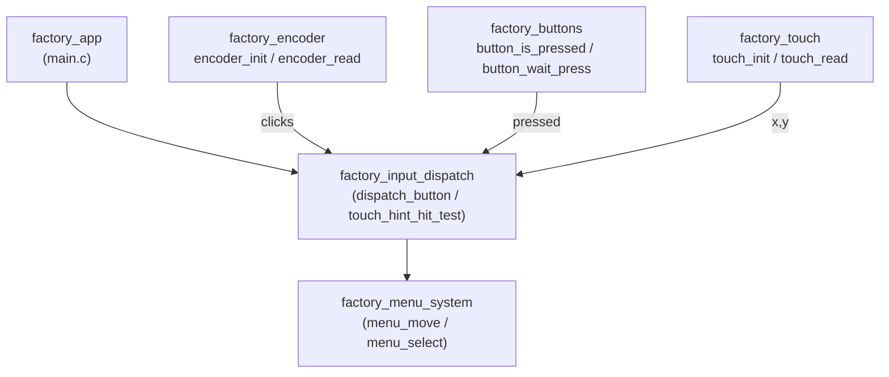
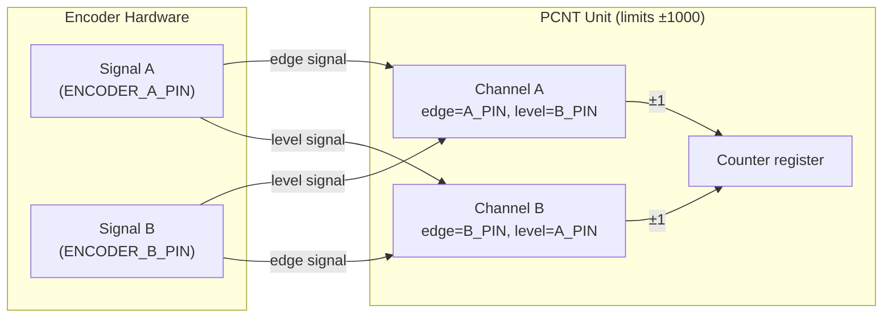
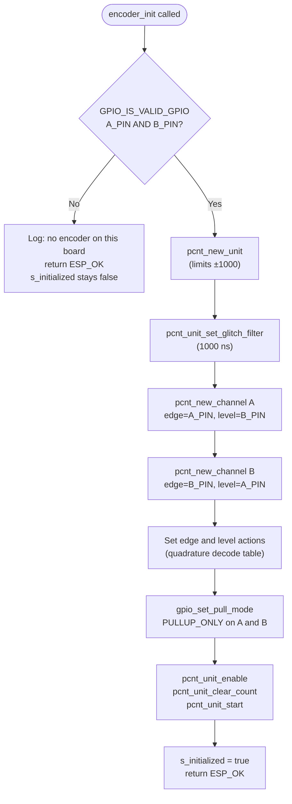
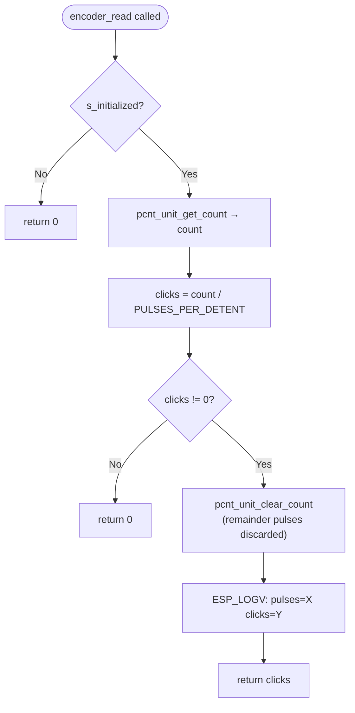
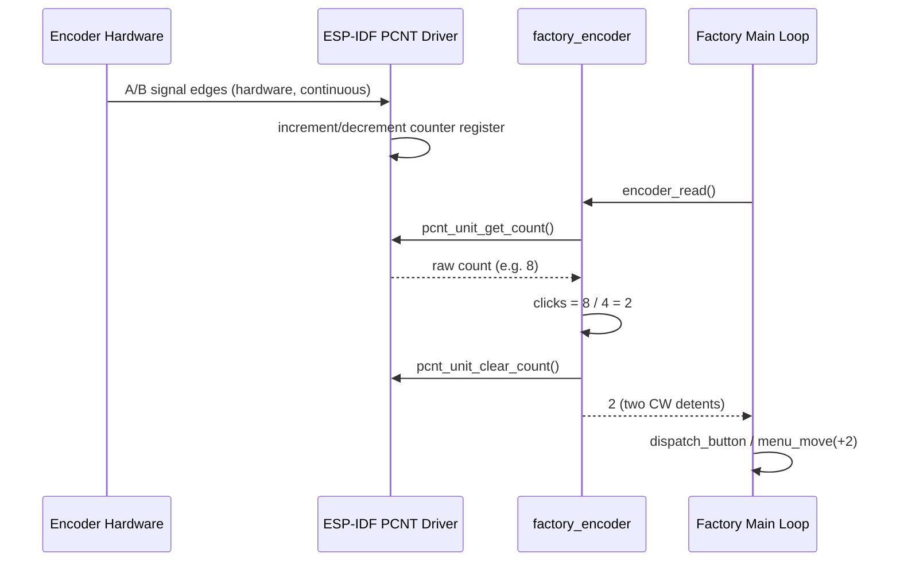
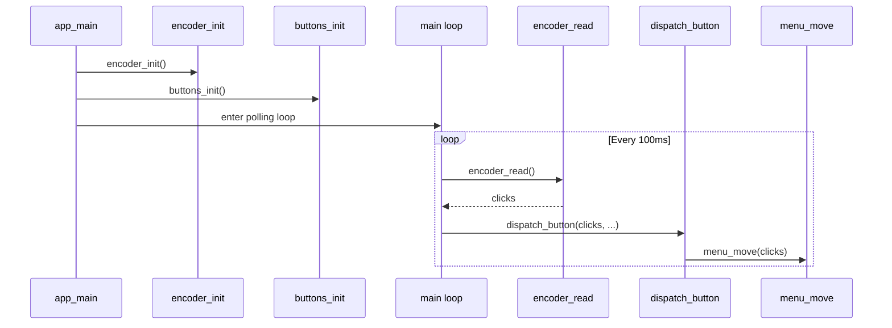

# factory_encoder

## Overview

`factory_encoder` is the rotary encoder driver used exclusively within the factory application. It provides a minimal, interrupt-free implementation of quadrature decoding via the ESP-IDF **PCNT** (Pulse Counter) peripheral.

The driver exposes exactly two functions — `encoder_init()` and `encoder_read()` — and is polled directly from the factory app's main loop. There are no ISRs, no FreeRTOS queues, and no callbacks; the design is deliberately kept as simple as possible for the factory context, where a ~100 ms polling interval is entirely sufficient.

The same implementation is shared verbatim across every supported board. A compile-time guard (`GPIO_IS_VALID_GPIO`) allows the same binary to run on boards that have no physical encoder: `encoder_init()` returns `ESP_OK` immediately and `encoder_read()` always returns 0.

---

## Position in the System

`factory_encoder` lives inside the [Factory Application & Bootloader](factory_app.md) layer. It is a hardware input driver peer to [factory_buttons](factory_buttons.md) and [factory_touch](factory_touch.md). All three are consumed by `factory_input_dispatch` in `main.c` to produce unified navigation events for the menu system.



At the hardware level, the factory encoder driver is a simplified counterpart to the production [bsp_physical_inputs](bsp_physical_inputs.md) `phy_encoder` driver. The production driver adds callback support (`encoder_pcnt_on_reach`) and cumulative step tracking (`phy_encoder_get_total_steps`); the factory driver omits these features to keep the factory binary small and straightforward.

---

## Supported Boards

The `factory_encoder` module is instantiated for the following boards (one `encoder.c` per board directory). All files carry an identical implementation; only the pin constants in `hw_config.h` differ.

| Board | Source file |
|---|---|
| esp32_3248s035c | `boards/esp32_3248s035c/Factory/main/encoder.c` |
| esp32_3248s035r | `boards/esp32_3248s035r/Factory/main/encoder.c` |
| esp32s3_4827s043c | `boards/esp32s3_4827s043c/Factory/main/encoder.c` |
| esp32s3_8048_touch_lcd_7 | `boards/esp32s3_8048_touch_lcd_7/Factory/main/encoder.c` |
| esp32s3_8048s043c | `boards/esp32s3_8048s043c/Factory/main/encoder.c` |
| esp32s3_8048s050c | `boards/esp32s3_8048s050c/Factory/main/encoder.c` |

Board-specific pin assignments are injected via `hw_config.h` (`ENCODER_A_PIN`, `ENCODER_B_PIN`). Boards without a physical encoder define those constants as `GPIO_NUM_NC`.

---

## Architecture

### Static State

```c
static pcnt_unit_handle_t s_pcnt_unit = NULL;  // PCNT unit handle
static bool s_initialized = false;              // guard for encoder_read()
```

All state is file-static and module-local. There is no shared data structure and no synchronisation overhead — appropriate for a single-threaded factory application.

### PCNT Configuration

The driver configures one PCNT unit with two channels to perform standard quadrature decoding:



**Channel A edge actions:**
- Positive edge on A → DECREASE (CW motion)
- Negative edge on A → INCREASE

**Channel A level actions:**
- B high → KEEP current action
- B low  → INVERSE current action

**Channel B edge actions:**
- Positive edge on B → INCREASE
- Negative edge on B → DECREASE

**Channel B level actions:**
- A high → KEEP current action
- A low  → INVERSE current action

This produces the standard quadrature decode table: four counter transitions per full mechanical cycle, one per edge on either signal. Combined with `PULSES_PER_DETENT = 4`, the resulting integer division yields exactly one click per mechanical detent for a standard 4-pulse-per-cycle encoder.

### Glitch Filter

A 1000 ns hardware glitch filter is applied on the PCNT unit:

```c
pcnt_glitch_filter_config_t filt = { .max_glitch_ns = 1000 };
pcnt_unit_set_glitch_filter(s_pcnt_unit, &filt);
```

This value is intentionally identical to the setting used by the production `phy_encoder` driver to ensure consistent debounce behaviour across the firmware lifecycle.

---

## API

### `encoder_init()`

```c
esp_err_t encoder_init(void);
```

**Responsibility**: Configure the PCNT unit, apply the glitch filter, configure quadrature decode actions on both channels, enable internal pull-ups, and start the counter.

**Flow**:



**Notes**:
- All ESP-IDF calls use `ESP_ERROR_CHECK` — any hardware failure aborts with a panic. This is appropriate for a factory test environment where a misconfigured board must be immediately visible.
- Internal pull-ups are enabled because none of the supported boards provide external pull-up resistors on encoder signal lines.
- The `s_initialized` flag prevents `encoder_read()` from calling `pcnt_unit_get_count()` on a NULL handle on boards without an encoder.

**Return value**: `esp_err_t` — always `ESP_OK` in normal operation (hardware errors panic via `ESP_ERROR_CHECK`).

---

### `encoder_read()`

```c
int encoder_read(void);
```

**Responsibility**: Return the number of detent clicks accumulated since the last call, then reset the counter.

**Flow**:



**Return value**: Integer number of detent clicks since the last non-zero read.
- Positive → clockwise rotation
- Negative → counter-clockwise rotation
- 0 → no movement detected, or encoder not present on this board

**Remainder handling**: After dividing the raw pulse count by `PULSES_PER_DETENT`, any remainder pulses are discarded when the counter is cleared. This prevents accumulation drift over time. At 100 ms polling, the probability of a missed remainder producing a visible navigation error is negligible — a partial mechanical detent never completes between polls at normal hand-rotation speeds.

---

## Data Flow



---

## Integration with the Factory Application

`encoder_init()` is called once during `app_main()` startup, alongside `buttons_init()`, `buzzer_init()`, and `touch_init()`. From that point, the factory app's main loop polls `encoder_read()` at each iteration (~100 ms) and passes the result to `dispatch_button()` in `factory_input_dispatch`.



The encoder provides the primary navigation input on boards that include a physical rotary control. On boards without one (e.g. touch-only panels), `encoder_read()` silently returns 0 and all navigation is handled through touch and buttons exclusively.

---

## Key Constants and Tunables

| Constant | Value | Defined in | Purpose |
|---|---|---|---|
| `PULSES_PER_DETENT` | `4` | `encoder.c` | Raw PCNT pulses per mechanical detent. Increase if rotation feels too sensitive; decrease if too sluggish. |
| `high_limit` | `1000` | `encoder_init()` | Upper PCNT counter bound — prevents hardware wrap-around between polls. |
| `low_limit` | `-1000` | `encoder_init()` | Lower PCNT counter bound. |
| `max_glitch_ns` | `1000` | `encoder_init()` | Hardware debounce window in nanoseconds. Matches the production firmware setting. |
| `ENCODER_A_PIN` | board-specific | `hw_config.h` | GPIO number for encoder signal A. Set to `GPIO_NUM_NC` if no encoder on the board. |
| `ENCODER_B_PIN` | board-specific | `hw_config.h` | GPIO number for encoder signal B. Set to `GPIO_NUM_NC` if no encoder on the board. |

---

## Relationship to the Production Encoder Driver

The factory encoder driver and the production BSP encoder driver (`phy_encoder`) are parallel but independent implementations backed by the same ESP-IDF PCNT peripheral:

| Feature | `factory_encoder` | `bsp_physical_inputs` / `phy_encoder` |
|---|---|---|
| Peripheral | PCNT | PCNT |
| Quadrature decode (2-channel) | ✅ | ✅ |
| Glitch filter (1000 ns) | ✅ | ✅ |
| Board-absent guard (`GPIO_NUM_NC`) | ✅ | ✅ |
| ISR / reach callback | ❌ | ✅ `encoder_pcnt_on_reach` |
| Cumulative step tracking | ❌ | ✅ `phy_encoder_get_total_steps` |
| Config struct (`phy_encoder_config_t`) | ❌ (pin constants only) | ✅ |
| Deinitialization | ❌ | ✅ `phy_encoder_deinit` |

The factory driver deliberately omits features it does not need. The factory application is short-lived (runs once for hardware validation and flashing), so deinitialization and interrupt-driven accumulation add complexity without any benefit.

---

## Logging

This module follows the factory logging convention provided by [factory_logging](factory_logging.md) (`factory_log.h`):

| Macro | Level | Trigger |
|---|---|---|
| `FACTORY_LOGD` | Debug | `encoder_init()`: board-absent skip message, and successful init summary with pin numbers and pulse rate. |
| `ESP_LOGV` | Verbose | `encoder_read()`: per-read trace showing raw pulse count and computed click value. |

Verbose output (`ESP_LOGV`) is suppressed in normal builds. To observe raw pulse data when debugging encoder sensitivity on a new board, build with `CONFIG_LOG_DEFAULT_LEVEL_VERBOSE` or temporarily promote the log call to `ESP_LOGD`.

---

## Related Modules

| Module | Relationship |
|---|---|
| [factory_app](factory_app.md) | Parent application; owns `app_main()` and the polling main loop that calls both API functions. |
| [factory_buttons](factory_buttons.md) | Sibling input driver; physical push-buttons fed into the same `dispatch_button()` path. |
| [factory_touch](factory_touch.md) | Sibling input driver; capacitive/resistive touch panel also merged in `dispatch_button()`. |
| [factory_logging](factory_logging.md) | Provides the `FACTORY_LOGD` macro and the SD-stack silence helper used across all factory drivers. |
| [bsp_physical_inputs](bsp_physical_inputs.md) | Production-firmware counterpart (`phy_encoder`); full-featured encoder driver with callbacks and deinitialization. |
