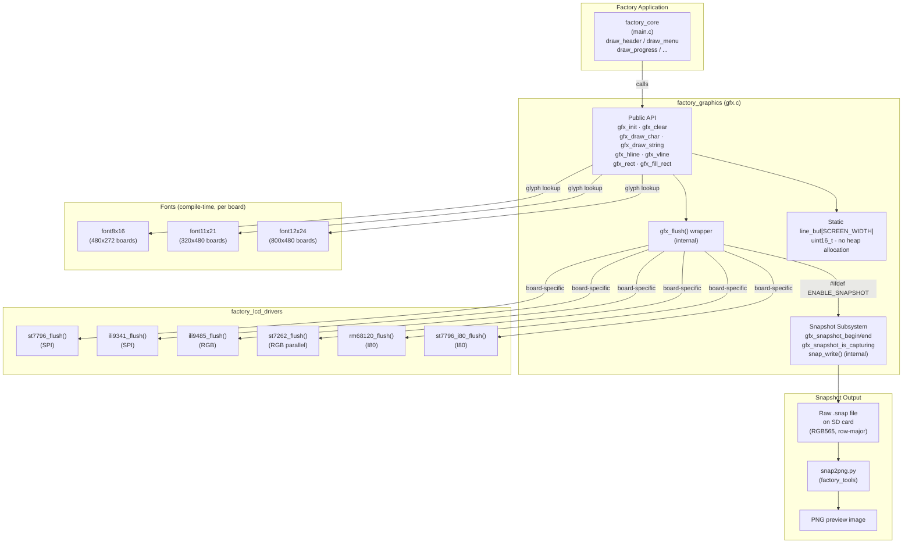
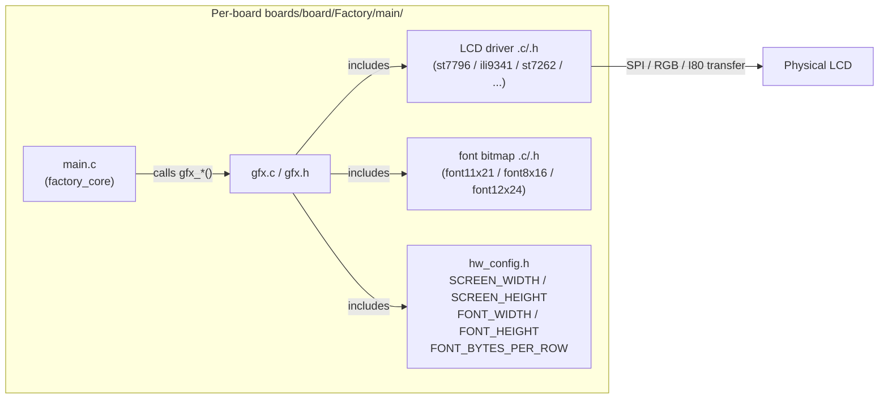
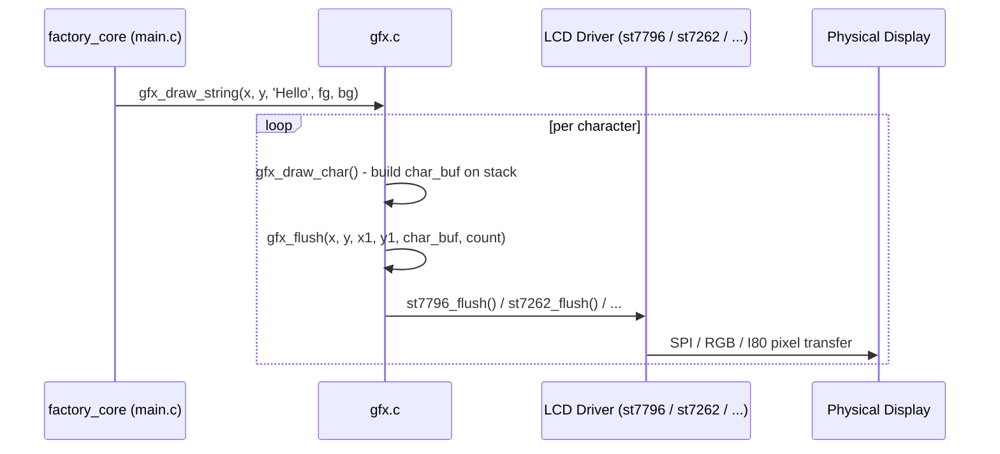
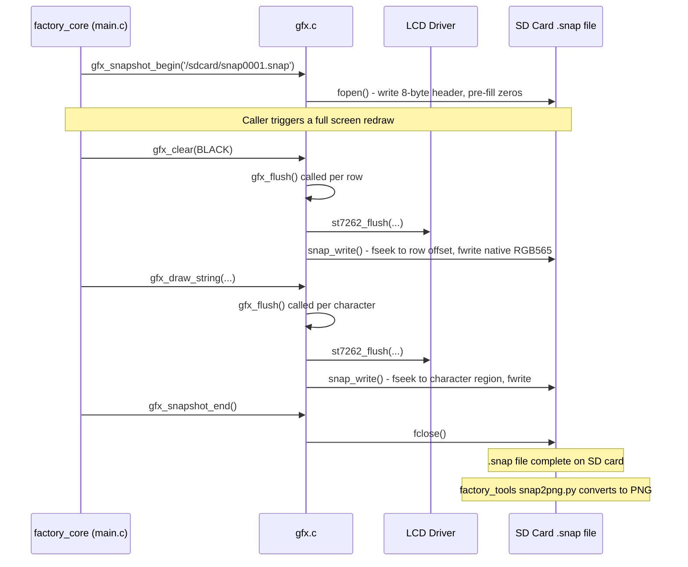
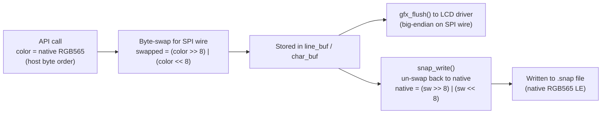
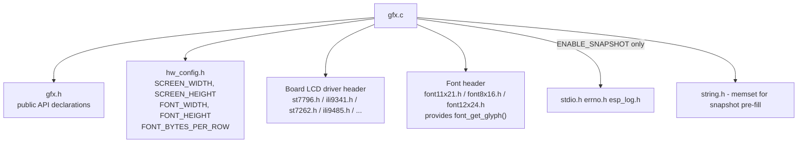

# Factory Graphics Module

The `factory_graphics` module is a minimal, self-contained 2D graphics library used exclusively by the **Factory Application**. It provides raw pixel-level drawing primitives that write directly to the LCD controller — fully bypassing LVGL and the main firmware's UI stack — making it suitable for pre-boot factory testing, firmware flashing UIs, and snapshot capture during production verification.

Each supported board has its own copy of `gfx.c` that adapts the unified public API to the board-specific LCD driver and font size. The API contract is identical across all variants.

> **Related modules:**
> - [factory_app.md](factory_app.md) — parent Factory Application entry and orchestration
> - [factory_lcd_drivers.md](factory_lcd_drivers.md) — board-specific LCD driver flush functions that `gfx.c` wraps
> - [factory_core.md](factory_core.md) — UI layer that calls the `draw_*` helpers which delegate to this module
> - [factory_tools.md](factory_app.md) — `snap2png.py` tool that converts raw snapshot files to PNG images

---

## Architecture Overview



---

## Board Variant Matrix

Each board has its own `gfx.c` under `boards/<board>/Factory/main/`. The implementation is identical in structure; only the included LCD driver header and font header differ.

| Board | LCD Driver (flush fn) | Bus | Font | Screen Size |
|---|---|---|---|---|
| `esp32_3248s035c` | `st7796_flush()` | SPI | `font11x21` | 320 x 480 |
| `esp32_3248s035r` | `st7796_flush()` | SPI | `font11x21` | 320 x 480 |
| `esp32s3_4827s043c` | `ili9485_flush()` | RGB | `font8x16` | 480 x 272 |
| `esp32s3_8048_touch_lcd_7` | `st7262_flush()` | RGB parallel | `font12x24` | 800 x 480 |
| `esp32s3_8048s043c` | `st7262_flush()` | RGB parallel | `font12x24` | 800 x 480 |
| `esp32s3_8048s050c` | `st7262_flush()` | RGB parallel | `font12x24` | 800 x 480 |
| `esp32s3_8048s070c` | `st7262_flush()` | RGB parallel | `font12x24` | 800 x 480 |
| `esp32s3_bzm_tft35_gt911` | `st7796_flush()` | SPI | `font11x21` | 320 x 480 |
| `esp32s3_hmi43v3` | `rm68120_flush()` | I80 | board-specific | board-specific |
| `esp32s3_zx3d50ce02s_usrc_4832` | `st7796_i80_flush()` | I80 | board-specific | board-specific |
| `pibot_pendant_v1_0` | `ili9341_flush()` | SPI | board-specific | 240 x 320 |

> **Note:** `SCREEN_WIDTH` and `SCREEN_HEIGHT` are defined in the board-local `hw_config.h`. `gfx.c` never hard-codes display dimensions — all size references go through these macros.

---

## Component Relationships



---

## Public API Reference

All functions below are declared in `gfx.h` and have identical signatures across every board variant.

### Initialization

#### `void gfx_init(void)`

Initializes the graphics subsystem. Currently a no-op placeholder — snapshot capture is opened on-demand via `gfx_snapshot_begin()`. Must be called once before any other `gfx_*` function.

---

### Primitive Drawing

All colors are 16-bit **RGB565** in host (native) byte order. The module internally handles byte-swapping for SPI displays before sending to the hardware.

#### `void gfx_clear(uint16_t color)`

Fills the entire screen with a solid color. Uses the static `line_buf` and flushes one row at a time to avoid large stack allocations.

| Parameter | Description |
|---|---|
| `color` | RGB565 fill color (host byte order) |

---

#### `void gfx_draw_char(int x, int y, char c, uint16_t fg, uint16_t bg)`

Renders a single ASCII character (0x20-0x7E) at pixel position `(x, y)`. Non-printable characters are replaced with `?`. The glyph is rendered into a temporary stack buffer (`FONT_WIDTH x FONT_HEIGHT` pixels) then flushed in a single LCD write call.

| Parameter | Description |
|---|---|
| `x`, `y` | Top-left corner of the character cell, in pixels |
| `c` | ASCII character to render |
| `fg` | Foreground (ink) color, RGB565 |
| `bg` | Background color, RGB565 |

**Clipping:** Characters that would extend past the right or bottom edge are clipped to the screen boundary. If `x < 0` or `y < 0` the character is skipped entirely.

---

#### `void gfx_draw_string(int x, int y, const char *str, uint16_t fg, uint16_t bg)`

Renders a null-terminated string by calling `gfx_draw_char()` for each character, advancing `x` by `FONT_WIDTH` per character. Stops at the right screen edge without wrapping.

| Parameter | Description |
|---|---|
| `x`, `y` | Baseline position of the first character, in pixels |
| `str` | Null-terminated ASCII string |
| `fg`, `bg` | Foreground and background colors, RGB565 |

---

#### `void gfx_hline(int x, int y, int w, uint16_t color)`

Draws a horizontal line of width `w` starting at `(x, y)`. Fills `line_buf` with the color and issues a single LCD flush. Clipped to screen bounds.

| Parameter | Description |
|---|---|
| `x`, `y` | Start position |
| `w` | Width in pixels |
| `color` | RGB565 line color |

---

#### `void gfx_vline(int x, int y, int h, uint16_t color)`

Draws a vertical line of height `h` starting at `(x, y)`. Issues one single-pixel flush per row. Clipped to screen bounds.

| Parameter | Description |
|---|---|
| `x`, `y` | Start position |
| `h` | Height in pixels |
| `color` | RGB565 line color |

---

#### `void gfx_rect(int x, int y, int w, int h, uint16_t color)`

Draws a hollow rectangle outline. Composed internally from four `gfx_hline()` and `gfx_vline()` calls: top edge, bottom edge, left edge, right edge.

| Parameter | Description |
|---|---|
| `x`, `y` | Top-left corner |
| `w`, `h` | Width and height in pixels |
| `color` | RGB565 outline color |

---

#### `void gfx_fill_rect(int x, int y, int w, int h, uint16_t color)`

Draws a solid filled rectangle. Fills `line_buf` with the color once, then flushes row-by-row. Clipped to screen bounds.

| Parameter | Description |
|---|---|
| `x`, `y` | Top-left corner |
| `w`, `h` | Width and height in pixels |
| `color` | RGB565 fill color |

---

### Snapshot API

The snapshot subsystem is compiled in only when `ENABLE_SNAPSHOT` is defined at build time. When the macro is absent, `gfx_snapshot_begin()` and `gfx_snapshot_end()` return `false` and `gfx_snapshot_is_capturing()` returns `false` — all other drawing functions behave normally.

#### `bool gfx_snapshot_begin(const char *filepath)`

Opens a raw binary file at `filepath` (must be a path on a mounted filesystem, typically the SD card) and begins intercepting all `gfx_flush()` calls to mirror pixel data into the file simultaneously with display output.

The file is immediately pre-allocated and zeroed on open so that any region not explicitly redrawn stays black rather than containing garbage data.

| Parameter | Description |
|---|---|
| `filepath` | Full path to the output file, e.g. `/sdcard/snap0001.snap` |

**Returns:** `true` on success; `false` if a capture is already in progress or if the file cannot be created (error logged via `ESP_LOGE`).

**File format written:**
```
Offset  0 : uint32_t  width   (little-endian)
Offset  4 : uint32_t  height  (little-endian)
Offset  8 : uint16_t  pixels[height][width]   native RGB565, row-major
```
Total file size: `8 + SCREEN_WIDTH x SCREEN_HEIGHT x 2` bytes.

> **Caller responsibility:** After calling `gfx_snapshot_begin()`, the caller must trigger a complete screen redraw before calling `gfx_snapshot_end()`. Only draw operations performed in that window are captured.

---

#### `bool gfx_snapshot_end(void)`

Closes the snapshot file and stops pixel interception.

**Returns:** `true` on success; `false` if no capture was in progress.

---

#### `bool gfx_snapshot_is_capturing(void)`

Returns `true` if a snapshot file is currently open and pixel data is being captured.

---

## Data Flow

### Normal Drawing Path



### Snapshot Capture Path



### Color Encoding Flow



> **Why two byte-swaps?** SPI LCD controllers expect big-endian RGB565 on the wire. The rendering buffers hold pre-swapped data ready for the LCD driver. The snapshot writer receives these same pre-swapped buffers and reverses the swap before storing to disk, producing native little-endian RGB565 that `snap2png.py` can read directly without any additional transformation.

---

## Internal Design Notes

### Static Line Buffer

A single `static uint16_t line_buf[SCREEN_WIDTH]` is shared across `gfx_clear()`, `gfx_hline()`, and `gfx_fill_rect()`. This eliminates all heap allocation from the hot rendering paths and guarantees predictable memory usage in the constrained factory app environment.

The character draw path uses a local **stack** buffer of `FONT_WIDTH x FONT_HEIGHT` pixels (288 bytes maximum for font12x24). All buffers stay within the safe allocation limits for the ESP32 factory environment.

### No LVGL Dependency

`gfx.c` has zero dependency on LVGL. This is intentional: the factory app starts before the main application, does not initialize the LVGL scheduler or task, and needs simple, deterministic pixel output with minimal initialization overhead. For the main firmware's UI system, see [display_core.md](ui_core.md).

### Clipping

Every drawing primitive validates and clips coordinates before calling `gfx_flush()`. Coordinates that fall entirely outside `[0, SCREEN_WIDTH) x [0, SCREEN_HEIGHT)` produce no output without crashing.

### Snapshot Byte Offset Calculation

```c
long offset = SNAP_HEADER_SIZE + (long)(row * SCREEN_WIDTH + x0) * 2;
fseek(s_snap_file, offset, SEEK_SET);
```

`fseek()` is called once per updated row within the drawn region. This random-access write model allows individual draw calls (characters, rectangles) to update only their own region of the file without needing a full framebuffer in RAM.

### Snapshot Pre-allocation

`gfx_snapshot_begin()` writes the full `SCREEN_WIDTH x SCREEN_HEIGHT x 2` pixel area as zeros using 512-byte chunk writes. This guarantees a complete, valid image even if the caller does not redraw every pixel, and avoids undefined data in unused screen regions.

---

## File Locations

```
boards/
├── esp32_3248s035c/Factory/main/gfx.c           ST7796 / font11x21
├── esp32_3248s035r/Factory/main/gfx.c           ST7796 / font11x21
├── esp32s3_4827s043c/Factory/main/gfx.c         ILI9485 / font8x16
├── esp32s3_8048_touch_lcd_7/Factory/main/gfx.c  ST7262  / font12x24
├── esp32s3_8048s043c/Factory/main/gfx.c         ST7262  / font12x24
├── esp32s3_8048s050c/Factory/main/gfx.c         ST7262  / font12x24
├── esp32s3_8048s070c/Factory/main/gfx.c         ST7262  / font12x24
├── esp32s3_bzm_tft35_gt911/Factory/main/gfx.c   ST7796  / font11x21
├── esp32s3_hmi43v3/Factory/main/gfx.c           RM68120 / board-specific font
├── esp32s3_zx3d50ce02s_usrc_4832/Factory/main/gfx.c  ST7796 I80 / board-specific font
└── pibot_pendant_v1_0/Factory/main/gfx.c        ILI9341 / board-specific font
```

---

## Dependencies Summary



| Header / Library | Role |
|---|---|
| `gfx.h` | Public API declarations (included by `main.c` and other callers) |
| `hw_config.h` | Screen and font dimension macros (board-specific values) |
| `st7796.h` / `ili9341.h` / `st7262.h` / `ili9485.h` | LCD driver flush function declaration |
| `font11x21.h` / `font8x16.h` / `font12x24.h` | Glyph bitmap tables and `font*_get_glyph()` lookup |
| `<string.h>` | `memset()` for snapshot file pre-fill |
| `<stdio.h>`, `<errno.h>` | Snapshot file I/O (`fopen`, `fwrite`, `fseek`, `fclose`) |
| `esp_log.h` | `ESP_LOGI` / `ESP_LOGE` / `ESP_LOGW` snapshot status messages |
