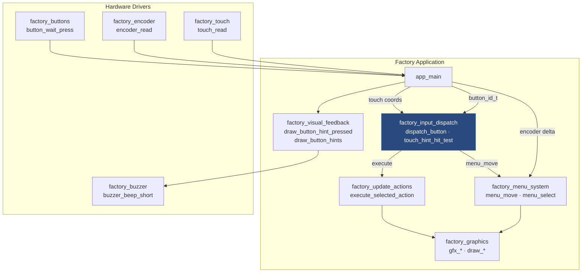
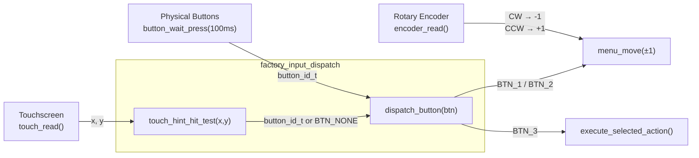
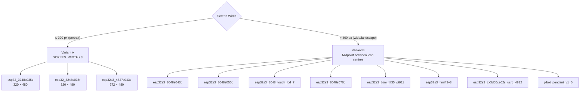
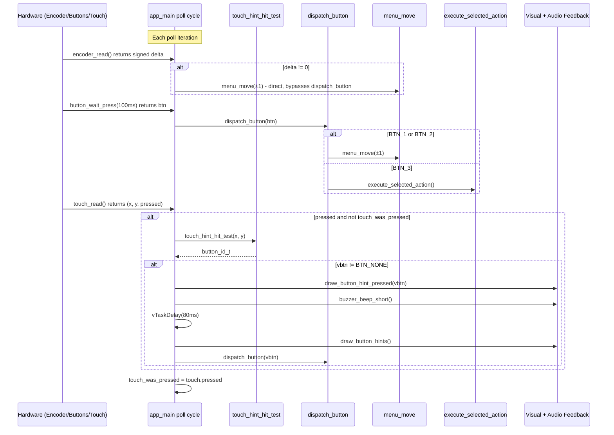
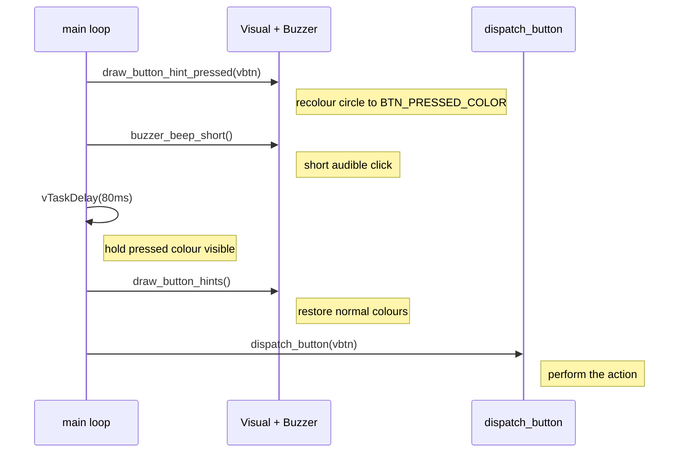

# factory_input_dispatch

## Introduction

The `factory_input_dispatch` module is the **unified input gateway** for the factory recovery application. It provides a thin abstraction layer that normalises all physical and virtual input events — hardware buttons, rotary encoder, and touchscreen taps — into a single `button_id_t`-based action stream consumed by the menu system.

Two functions constitute the entire module:

| Function | Role |
|---|---|
| `dispatch_button(button_id_t)` | Maps a logical button ID to a menu operation |
| `touch_hint_hit_test(int x, int y)` | Maps raw touch coordinates to a logical button ID |

The module is stateless; it holds no data of its own and is implemented directly inside each board's `Factory/main/main.c`. It exists across all 11 supported boards in the factory application.

---

## Position in the Factory Application

The factory recovery application is a standalone ESP-IDF app that lives in the `factory` partition. It has no dependency on LVGL, FreeRTOS tasks, or the main firmware stack. All UI is drawn directly via the `gfx` module using raw pixel operations.



For the broader factory application context — including OTA update actions, SD file probing, and the menu draw pipeline — see [factory_app_entry.md](factory_app_entry.md).

---

## Architecture

### Input Multiplexing

The factory main loop polls three input sources on every iteration. They converge at `dispatch_button()`:



> **Why does the encoder bypass `dispatch_button()`?**
> The encoder returns a signed delta (positive = CW, negative = CCW) that already encodes direction. Converting it through a `button_id_t` would require a two-step translation with no benefit. `menu_move()` is called directly, reaching the same call site `dispatch_button()` would reach.

---

## Functions

### `dispatch_button`

```c
static void dispatch_button(button_id_t btn);
```

Maps a logical button identifier to a menu operation. This is the only call site that reaches `menu_move()` and `execute_selected_action()` from the physical and virtual button paths.

**Parameters**

| Parameter | Type | Description |
|---|---|---|
| `btn` | `button_id_t` | Logical button identifier. Values: `BTN_1`, `BTN_2`, `BTN_3`, `BTN_NONE` |

**Dispatch Table**

| `btn` value | Operation | Effect |
|---|---|---|
| `BTN_1` | `menu_move(-1)` | Move selection up (wraps to last item) |
| `BTN_2` | `menu_move(+1)` | Move selection down (wraps to first item) |
| `BTN_3` | `execute_selected_action()` | Confirm current selection |
| `BTN_NONE` | *(no-op)* | Silently ignored |

**Implementation (identical across all boards)**

```c
static void dispatch_button(button_id_t btn)
{
    switch (btn) {
        case BTN_1:
            menu_move(-1);  /* Up */
            break;
        case BTN_2:
            menu_move(+1);  /* Down */
            break;
        case BTN_3:
            execute_selected_action();
            break;
        default:
            break;
    }
}
```

**Call sites**

1. **Physical button path** — called once per main loop iteration with a 100 ms timeout:
   ```c
   dispatch_button(button_wait_press(100));
   ```
2. **Touch path** — called after hit-testing and visual/audio feedback:
   ```c
   button_id_t vbtn = touch_hint_hit_test(touch.x, touch.y);
   if (vbtn != BTN_NONE) {
       draw_button_hint_pressed(vbtn);
       buzzer_beep_short();
       vTaskDelay(pdMS_TO_TICKS(80));
       draw_button_hints();
       dispatch_button(vbtn);
   }
   ```

---

### `touch_hint_hit_test`

```c
static button_id_t touch_hint_hit_test(int x, int y);
```

Converts a raw touchscreen coordinate pair into a logical `button_id_t` by testing whether the tap lands within one of the three virtual button zones at the bottom of the screen.

**Parameters**

| Parameter | Type | Description |
|---|---|---|
| `x` | `int` | Horizontal touch coordinate in logical canvas pixels |
| `y` | `int` | Vertical touch coordinate in logical canvas pixels |

**Return Values**

| Return value | Condition |
|---|---|
| `BTN_NONE` | `y < BTN_HINT_BASE_Y` — tap is above the button hint bar |
| `BTN_1` | Tap lands in the left-button zone |
| `BTN_2` | Tap lands in the centre-button zone |
| `BTN_3` | Tap lands in the right-button zone |

Hit zones intentionally span the **full height of the hint bar** rather than just the drawn circle, to give reliable touch targets on small displays.

---

## Hit-Test Algorithm: Two Variants

The `touch_hint_hit_test` function has two distinct boundary-calculation strategies, selected at compile time by each board's screen geometry. Both share the same `BTN_HINT_BASE_Y` Y-axis gate.

### Variant A — Equal-Thirds Split (portrait / narrow screens)

Used on boards where the display canvas is **≤ 320 px wide** (portrait orientation).

```c
static button_id_t touch_hint_hit_test(int x, int y)
{
    if (y < BTN_HINT_BASE_Y) {
        return BTN_NONE;
    }

    int col_w = SCREEN_WIDTH / 3;
    if (x < col_w)          { return BTN_1; }
    else if (x < 2 * col_w) { return BTN_2; }
    else                    { return BTN_3; }
}
```

On a 320 px wide canvas, the three icon centres (`BTN_HINT_CX1/2/3`) land at x = 60, 160, 260 px. The equal-thirds columns (0–106, 107–213, 214–320) closely bracket each icon — the simple divide is accurate enough.

### Variant B — Midpoint-Between-Centres Split (wide / landscape screens)

Used on boards where the display canvas is **> 400 px wide** (landscape glass or wide rotated panel).

```c
static button_id_t touch_hint_hit_test(int x, int y)
{
    if (y < BTN_HINT_BASE_Y) {
        return BTN_NONE;
    }

    /* Column boundaries are the midpoints between the actual button centres.
     * On wide landscape canvases the icons cluster around screen centre
     * (BTN_HINT_CX1/2/3), so splitting the full screen width into thirds
     * maps BTN_1 and BTN_3 into the wrong (middle) column. */
    int boundary_1_2 = (BTN_HINT_CX1 + BTN_HINT_CX2) / 2;
    int boundary_2_3 = (BTN_HINT_CX2 + BTN_HINT_CX3) / 2;
    if (x < boundary_1_2)       { return BTN_1; }
    else if (x < boundary_2_3)  { return BTN_2; }
    else                        { return BTN_3; }
}
```

On an 800 px wide canvas the icon centres fall at x = 300, 400, 500 px — all in the middle 25 % of the screen. A naive 1/3 split (boundaries at 267 and 533 px) would collapse BTN_1 and BTN_3 into the middle column. Midpoint boundaries (350 and 450 px) keep each zone centred on its icon.

### Why the Fixed ±100 px Offset Drives the Algorithm Choice

All boards define icon centres with the same formula:

```c
#define BTN_HINT_CX1  (SCREEN_WIDTH / 2 - 100)
#define BTN_HINT_CX2  (SCREEN_WIDTH / 2)
#define BTN_HINT_CX3  (SCREEN_WIDTH / 2 + 100)
```

The 200 px total spread is fixed regardless of screen width. On a 272 px portrait canvas (Variant A boards) the icons span most of the width; on an 800 px landscape canvas (Variant B boards) they occupy only the central 25 %, making the 1/3 split geometrically wrong.

### Variant Selection by Board



---

## Button Hint Bar Geometry

The three virtual button zones share a common layout. The constants are board-scaled (circle radius and font size differ) but the topological relationships are identical across all boards.

```
┌─────────────────────────────────────────────┐  ← y = 0 (screen top)
│                                             │
│               Menu items                   │
│                                             │
├─────────────────────────────────────────────┤  ← STATUS_Y - 7 (separator)
│              Status message                 │
├─────────────────────────────────────────────┤  ← BTN_HINT_BASE_Y (separator)
│                                             │
│   [↑ BTN_1]       [↓ BTN_2]       [✓ BTN_3]│
│                                             │
└─────────────────────────────────────────────┘  ← y = SCREEN_HEIGHT
      CX1               CX2              CX3
 (WIDTH/2 - 100)    (WIDTH/2)     (WIDTH/2 + 100)
```

| Constant | Formula | Description |
|---|---|---|
| `BTN_HINT_BASE_Y` | `SCREEN_HEIGHT - BTN_HINT_H` | Y coordinate of the separator line |
| `BTN_HINT_H` | `2 * BTN_CIRCLE_R + 9` | Total height of the hint bar |
| `BTN_HINT_CY` | `BTN_HINT_BASE_Y + 5 + BTN_CIRCLE_R` | Vertical centre of all three icon circles |
| `BTN_HINT_CX1` | `SCREEN_WIDTH / 2 - 100` | Centre X of BTN_1 (up arrow) |
| `BTN_HINT_CX2` | `SCREEN_WIDTH / 2` | Centre X of BTN_2 (down arrow) |
| `BTN_HINT_CX3` | `SCREEN_WIDTH / 2 + 100` | Centre X of BTN_3 (check mark) |

**Board-specific circle radius (`BTN_CIRCLE_R`)**

| Board group | `BTN_CIRCLE_R` | `FONT_WIDTH` × `FONT_HEIGHT` |
|---|---|---|
| esp32_3248s035c / esp32_3248s035r | 27 px | 11 × 21 |
| esp32s3_4827s043c | 22 px | 8 × 16 |
| esp32s3_8048* / pibot_pendant_v1_0 | 30 px | 12 × 24 |

---

## Data Flow

### Complete Input Pipeline



### Touch Press Feedback Sequence

When a touch event produces a valid `button_id_t`, the main loop inserts visual and audio feedback before dispatching. This ensures the user sees and hears confirmation even when the subsequent action (e.g., flashing firmware) takes several seconds.



---

## Board Capability Matrix

Not all boards populate all input peripherals. The input dispatch code is identical everywhere; unpopulated peripherals are assigned `GPIO_NUM_NC` in `hw_config.h` and become silent no-ops at the driver level.

| Board | Physical Buttons | Encoder | Buzzer | Touch | Hit-test Variant |
|---|---|---|---|---|---|
| `esp32_3248s035c` | — | — | — | ✓ XPT2046 | A |
| `esp32_3248s035r` | — | — | — | ✓ XPT2046 | A |
| `esp32s3_4827s043c` | — | — | — | ✓ | A |
| `esp32s3_8048s043c` | — | — | — | ✓ | B |
| `esp32s3_8048s050c` | — | — | — | ✓ | B |
| `esp32s3_8048_touch_lcd_7` | — | — | — | ✓ | B |
| `esp32s3_8048s070c` | — | — | — | ✓ | B |
| `esp32s3_bzm_tft35_gt911` | — | — | — | ✓ GT911 | B |
| `esp32s3_hmi43v3` | — | — | — | ✓ | B |
| `esp32s3_zx3d50ce02s_usrc_4832` | — | — | — | ✓ | B |
| `pibot_pendant_v1_0` | ✓ GPIO | ✓ GPIO | ✓ GPIO | ✓ | B |

`pibot_pendant_v1_0` is the only board that ships with all input peripherals populated. On all other boards, the virtual touch buttons are the sole navigation method.

---

## Touch Debouncing

The main loop maintains a single `bool touch_was_pressed` state variable. `dispatch_button()` is triggered only on the **rising edge** of the touch signal — the transition from not-pressed to pressed — preventing repeated dispatch during a held or lingering touch.

```c
bool touch_was_pressed = false;

while (1) {
    /* ... encoder and button polling ... */

    touch_point_t touch = touch_read();
    if (touch.pressed && !touch_was_pressed) {
        button_id_t vbtn = touch_hint_hit_test(touch.x, touch.y);
        if (vbtn != BTN_NONE) {
            /* feedback + dispatch */
        }
    }
    touch_was_pressed = touch.pressed;  /* update edge-detect state */
}
```

---

## Integration with Sibling Modules

`factory_input_dispatch` is a pure **bridge**. It introduces no business logic beyond the dispatch table and hit-test geometry. All work is delegated to the modules below.

| Called function | Module | Purpose |
|---|---|---|
| `menu_move(direction)` | [factory_menu_system.md](factory_menu_system.md) | Advance or retreat the selection cursor and redraw |
| `execute_selected_action()` | [factory_update_actions_dispatch.md](factory_update_actions_dispatch.md) | Run the action for the currently selected menu item |
| `draw_button_hint_pressed(btn)` | [factory_visual_feedback.md](factory_visual_feedback.md) | Recolour a virtual button circle to indicate a press |
| `draw_button_hints()` | [factory_visual_feedback.md](factory_visual_feedback.md) | Redraw all three virtual button circles at normal colours |
| `buzzer_beep_short()` | [factory_snapshot.md](factory_snapshot.md) | Emit a short confirmation tone |
| `button_wait_press(ms)` | [physical_inputs.md](physical_inputs.md) | Block briefly and return `button_id_t` from physical GPIO buttons |
| `encoder_read()` | [physical_inputs.md](physical_inputs.md) | Non-blocking read of rotary encoder position delta |
| `touch_read()` | [bsp_touch_controllers.md](bsp_touch_controllers.md) | Non-blocking read of the current touch point |

---

## Design Constraints

- **Single-threaded**: The entire factory application runs in `app_main` on a single FreeRTOS task. There are no ISRs or background tasks dispatching input; everything is polled in the main loop.
- **100 ms button poll window**: `button_wait_press(100)` blocks for up to 100 ms per iteration. This debounces physical buttons without making encoder and touch polling sluggish.
- **Rising-edge touch detection**: `dispatch_button()` is called only on press onset, not while held, via the `touch_was_pressed` edge-detect variable.
- **No LVGL dependency**: The factory app draws directly via `gfx_*` primitives. There are no LVGL event callbacks, task synchronisation requirements, or timer constraints.
- **Stateless module**: Neither `dispatch_button` nor `touch_hint_hit_test` holds static variables. All menu state is owned by `factory_menu_system`.
- **Feedback before action**: Visual and audio feedback are emitted and the 80 ms delay elapses before `dispatch_button()` is called. This ensures the user receives confirmation even if the subsequent action blocks for an extended period.
