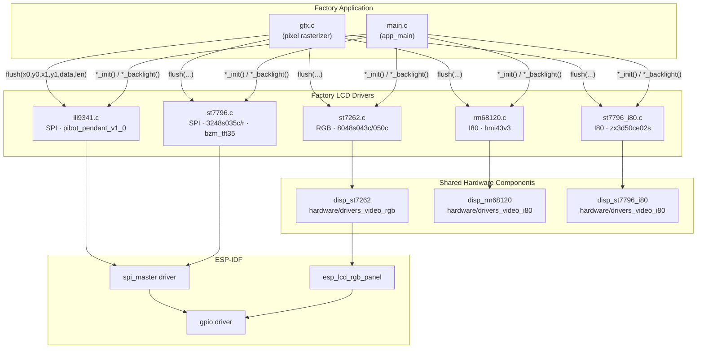
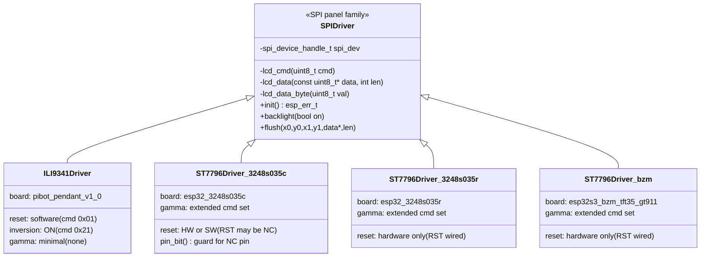
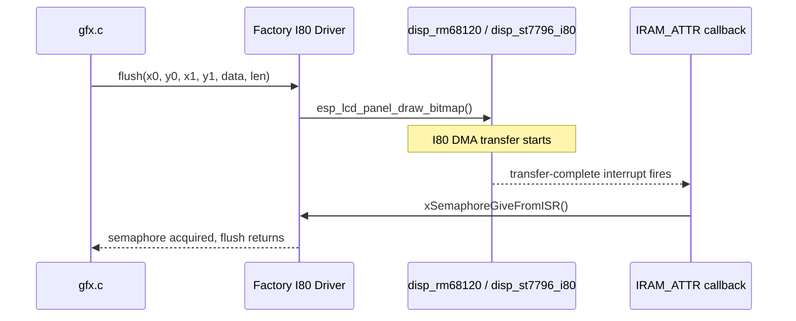
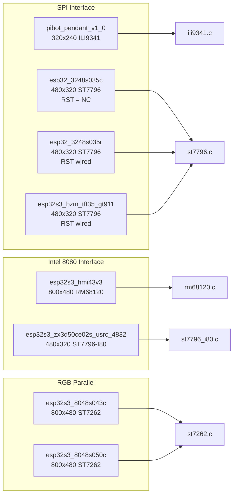
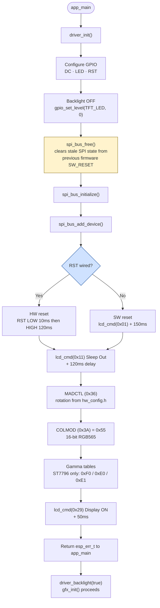
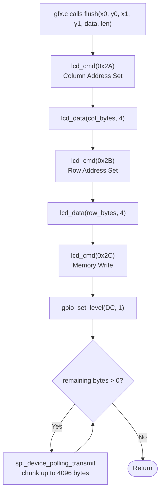
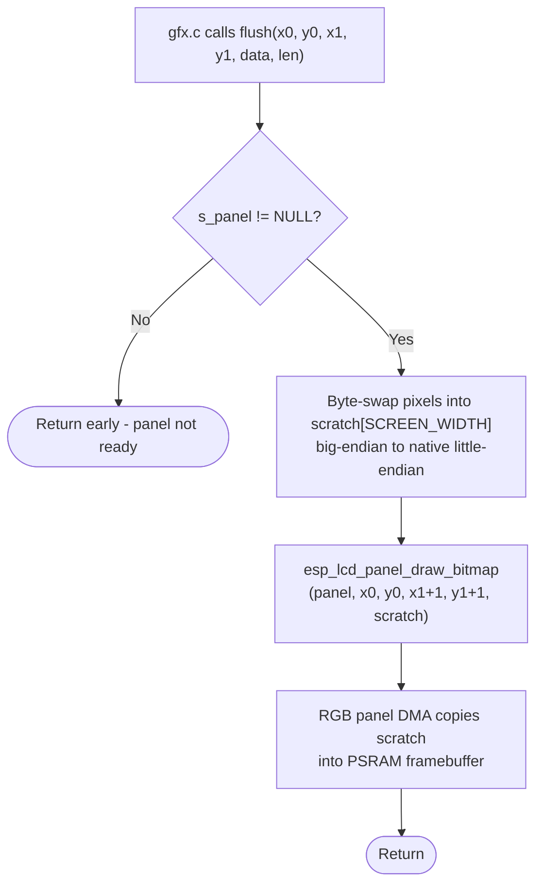
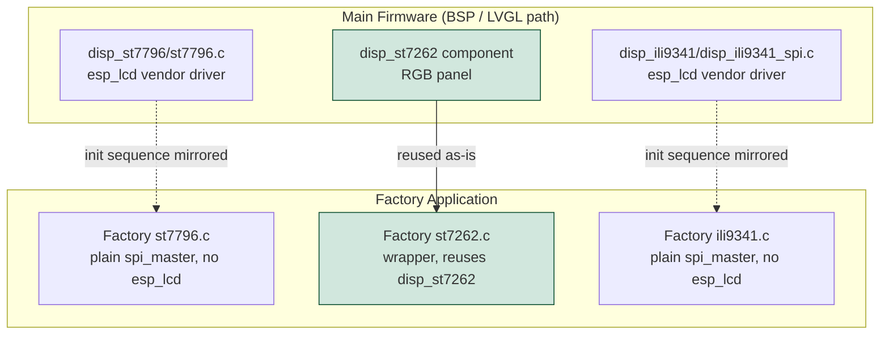

# Factory LCD Drivers

## Overview

The `factory_lcd_drivers` module provides board-specific display drivers used exclusively by the **Factory Application** — the minimal ESP-IDF app flashed at manufacturing time. Each driver is a thin, self-contained C file that initialises a panel controller, drives the backlight, and blits rectangular pixel regions coming from the Factory App's [`factory_graphics`](factory_graphics.md) rasterizer (`gfx.c`).

These drivers are **intentionally isolated** from the main firmware stack: they carry no LVGL dependency, no `esp3d_log` calls, and no `esp_lcd` vendor-driver layer where a raw SPI master suffices. This keeps the factory binary small and fully bootable from a fresh, uninitialised flash.

Three distinct hardware interface families are covered across all supported boards:

| Interface | Controller | Boards |
|---|---|---|
| SPI | ILI9341 | `pibot_pendant_v1_0` |
| SPI | ST7796 | `esp32_3248s035c` · `esp32_3248s035r` · `esp32s3_bzm_tft35_gt911` |
| Intel 8080 (I80) | RM68120 | `esp32s3_hmi43v3` |
| Intel 8080 (I80) | ST7796 I80 | `esp32s3_zx3d50ce02s_usrc_4832` |
| RGB Parallel | ST7262 | `esp32s3_8048s043c` · `esp32s3_8048s050c` |

> **Scope note:** The `factory_lcd_drivers` node in the module tree explicitly lists the ST7796-SPI and ST7262 files. The RM68120, ST7796-I80, and ILI9341 drivers are siblings inside [`factory_hardware_drivers`](factory_app.md) but serve the identical architectural role and are documented together here for a complete picture.

---

## Architecture



---

## Driver Families

### 1 · SPI Family (ILI9341 / ST7796)

All SPI-connected panels share the same low-level pattern: a static `spi_device_handle_t`, a DC (data/command) GPIO, and three primitives built on `spi_device_polling_transmit`.



#### Internal primitives

| Function | DC pin state | Purpose |
|---|---|---|
| `lcd_cmd(cmd)` | LOW (0) | Send a one-byte command register address |
| `lcd_data(data, len)` | HIGH (1) | Send a multi-byte data payload |
| `lcd_data_byte(val)` | HIGH (1) | Convenience wrapper — calls `lcd_data(&val, 1)` |

These three helpers are `static` within each driver file and are never exposed outside it.

#### `pin_bit()` guard — esp32_3248s035c only

The `esp32_3248s035c` panel variant has no RST line (`TFT_RST = GPIO_NUM_NC`). Using a compile-time constant `GPIO_NUM_NC` (which is `-1`) directly in a shift expression `1ULL << PIN` triggers `-Wshift-count-negative` even inside a runtime `GPIO_IS_VALID_GPIO()` guard. The `pin_bit()` helper resolves this:

```c
static uint64_t pin_bit(gpio_num_t pin) {
    return GPIO_IS_VALID_GPIO(pin) ? (1ULL << pin) : 0ULL;
}
```

When RST is `GPIO_NUM_NC` the driver falls back to a software reset command (`0x01`) followed by a 150 ms delay, rather than toggling the pin. The `esp32_3248s035r` and `esp32s3_bzm_tft35_gt911` variants have RST wired and do not need this guard.

#### ILI9341 vs ST7796 init differences

| Step | ILI9341 | ST7796 |
|---|---|---|
| Reset | SW reset (0x01) + 150 ms | HW RST pin (10 ms low / 120 ms high) |
| Display inversion | ON (cmd 0x21) | Not needed |
| Gamma control | None | Extended cmd 0xF0 + tables 0xE0 / 0xE1 |
| Pixel format | RGB565 (0x55) | RGB565 (0x55) |
| MADCTL rotation | 4-entry lookup table | Same 4-entry lookup table |

---

### 2 · Intel 8080 (I80) Family (RM68120 / ST7796-I80)

Boards `esp32s3_hmi43v3` and `esp32s3_zx3d50ce02s_usrc_4832` use I80 parallel-bus controllers. The factory driver for these boards does **not** reimplement the panel protocol; instead it delegates to the shared BSP components from `hardware/drivers_video_i80` (see [`bsp_display_drivers_i80`](bsp_display_drivers_i80.md)) and contributes only one file: an ISR-safe flush-completion callback.



Both I80 callbacks follow an identical ISR-safe pattern:

```c
static void IRAM_ATTR rm68120_flush_ready_cb(void) {
    BaseType_t xHigherPriorityTaskWoken = pdFALSE;
    xSemaphoreGiveFromISR(s_flush_done_sem, &xHigherPriorityTaskWoken);
    portYIELD_FROM_ISR(xHigherPriorityTaskWoken);
}
```

> **`IRAM_ATTR` is mandatory** — these callbacks execute in an interrupt context. Placing them in flash (the default) would cause an instruction-cache fault if a cache miss occurs during the ISR.

---

### 3 · RGB Parallel Family (ST7262)

Boards `esp32s3_8048s043c` and `esp32s3_8048s050c` use a 16-bit RGB parallel interface driven by `esp_lcd_rgb_panel`. The factory driver is a **thin wrapper** over the shared `disp_st7262` component from `hardware/drivers_video_rgb` (see [`bsp_display_drivers_rgb`](bsp_display_drivers_rgb.md)) — the identical component used by the main firmware for these boards.

Key differences from the SPI family:

| Property | SPI / I80 | RGB Parallel |
|---|---|---|
| Framebuffer | None (pixel data streamed per command) | Persistent in PSRAM |
| Transfer mechanism | Command + data sequence per region | `esp_lcd_panel_draw_bitmap()` copies into PSRAM |
| DC pin | Required | Not applicable |
| Byte order expected by panel | Big-endian (SPI convention) | Native little-endian |
| Panel dependency | Standalone (no shared component) | Reuses `disp_st7262` component |

#### Byte-swap requirement

`gfx.c` always produces big-endian RGB565 pixels — the convention shared by all SPI panels. The ST7262 RGB wiring expects native little-endian order. The driver corrects this inside `st7262_flush()` using a **static scratch buffer**:

```c
/* Swap into scratch — NOT in place.
 * gfx_hline()/gfx_fill_rect() fill their line buffer once and call
 * flush() once per row with the SAME buffer pointer. Swapping in place
 * would flip the bytes back and forth on every call, producing
 * alternating wrong-colour rows. */
static uint16_t scratch[SCREEN_WIDTH];
for (size_t i = 0; i < count; i++) {
    uint16_t v = data[i];
    scratch[i] = (uint16_t)((v >> 8) | (v << 8));
}
esp_lcd_panel_draw_bitmap(s_panel, x0, y0, x1 + 1, y1 + 1, scratch);
```

> `len` passed to `flush()` is a **pixel count**, not a byte count. This is consistent across every board's `gfx.c` implementation.

#### Orientation

Both `esp32s3_8048s043c` and `esp32s3_8048s050c` are mounted in native landscape orientation. `DISP_ST7262_ORIENTATION_LANDSCAPE` is a pure passthrough — no `swap_xy` or `mirror` transformation is applied and the physical and logical resolutions are identical. This contrasts with `esp32s3_4827s043c` (documented in the main firmware BSP) which is rotated 90° and has differing physical/logical dimensions. See [`display_drivers.md`](https://github.com/luc-github/Pibot-cnc-pendant-firmware/blob/main/docs/architecture/display_drivers.md) for the full orientation and rotation math.

---

## Board-to-Driver Mapping



---

## Initialization Flow

All SPI and RGB drivers share the same lifecycle, driven by `app_main`:



> **SPI bus pre-free:** After an ESP-IDF software reset, the SPI2 peripheral may retain its previous configuration. Calling `spi_bus_free()` before `spi_bus_initialize()` is a defensive no-op when the bus was never initialised in this boot, and a necessary cleanup when it was.

---

## Flush Flow (Pixel Transfer)

### SPI flush (ILI9341 / ST7796)



The 4096-byte chunk limit is imposed by the ESP-IDF SPI DMA size constraints. A full 480×320 RGB565 frame is 307 200 bytes, requiring at least 75 chunks.

### RGB parallel flush (ST7262)



---

## Rotation Support

All SPI and I80 controllers support four orientations through the MADCTL register (`0x36`). The factory drivers use the same MADCTL bit values as the main firmware:

| `SCREEN_ROTATION` | MADCTL value | Description |
|---|---|---|
| `0` | `0x28` | Landscape (default) |
| `1` | `0x48` | Portrait |
| `2` | `0xE8` | Landscape inverted |
| `3` | `0x88` | Portrait inverted |

`SCREEN_ROTATION` is defined per board in `hw_config.h`. The `& 0x03` mask applied at lookup time prevents out-of-bounds access for any unexpected value.

---

## Relationship to Main Firmware Drivers

The factory drivers deliberately mirror — but are decoupled from — the main firmware display stack:



- **SPI panels (ILI9341, ST7796):** The factory reimplements the init sequence directly over the raw `spi_master` driver. No `esp_lcd` vendor abstraction or `esp3d_log` is pulled in. The init sequence and MADCTL/gamma values are matched to the main firmware driver to produce identical visual output from both apps.

- **RGB parallel (ST7262):** The factory **reuses** `hardware/drivers_video_rgb/disp_st7262` unchanged. This component has no LVGL dependency, making direct reuse safe.

- **I80 panels (RM68120, ST7796-I80):** The factory reuses the shared I80 components from `hardware/drivers_video_i80` and contributes only the flush-ready ISR callback.

---

## Integration with gfx.c

The factory drivers are consumed exclusively through the three-function interface expected by [`gfx.c`](factory_graphics.md):

```c
/* Called once at startup by app_main */
esp_err_t <controller>_init(void);

/* Called after gfx_init() succeeds — turns on the backlight */
void <controller>_backlight(bool on);

/* Called by gfx_flush() — one call per scan line or filled rectangle */
void <controller>_flush(uint16_t x0, uint16_t y0,
                        uint16_t x1, uint16_t y1,
                        const uint16_t *data, size_t len);
```

`gfx.c` is the **only** caller of `flush()`. It always passes `len` as a pixel count (not bytes), consistent across every board. The `data` pointer may refer to a buffer that is reused on the next call — drivers must not modify it in place. (The ST7262 static scratch buffer exists for exactly this reason.)

---

## Design Constraints

| Constraint | Rationale |
|---|---|
| No LVGL dependency | Factory app has no LVGL stack; drivers must be self-contained |
| No `esp3d_log` | Keeps factory binary independent of the main firmware logging subsystem |
| No dynamic allocation | All driver state is `static`; no heap is used in the driver layer |
| 4096-byte SPI chunks | ESP-IDF SPI DMA per-transfer size limit; chunking is mandatory for full-frame blits |
| `IRAM_ATTR` on I80 callbacks | Called from ISR context; flash placement causes instruction-cache faults |
| Static scratch buffer in ST7262 flush | Prevents byte-swap from corrupting shared `gfx.c` line buffers across repeated calls |
| `spi_bus_free()` before init | Clears SPI peripheral register state left by the previous firmware after SW_RESET |
| `& 0x03` on rotation index | Guards against out-of-bounds access for unexpected `SCREEN_ROTATION` values |

---

## Related Documentation

- [`factory_app.md`](factory_app.md) — Factory application entry point and overall structure
- [`factory_core.md`](factory_core.md) — Factory app core logic (menu, update actions, visual feedback)
- [`factory_graphics.md`](factory_graphics.md) — `gfx.c` pixel rasterizer that calls into these drivers
- [`factory_touch.md`](factory_touch.md) — Touch controller companion drivers
- [`factory_hardware_drivers.md`](factory_app.md) — Complete factory hardware driver set including ILI9341, RM68120, ST7796-I80, buttons, buzzer, and encoder
- [`display_drivers.md`](https://github.com/luc-github/Pibot-cnc-pendant-firmware/blob/main/docs/architecture/display_drivers.md) — Main firmware display architecture: SPI vs RGB parallel, physical/logical resolution, orientation and rotation math
- [`bsp_display_drivers_spi.md`](bsp_display_drivers_spi.md) — Main firmware SPI panel drivers (ILI9341, ST7796)
- [`bsp_display_drivers_rgb.md`](bsp_display_drivers_rgb.md) — Main firmware RGB parallel drivers (ST7262, EK9716, ILI9485)
- [`bsp_display_drivers_i80.md`](bsp_display_drivers_i80.md) — Main firmware I80 panel drivers (RM68120, ST7796-I80)
