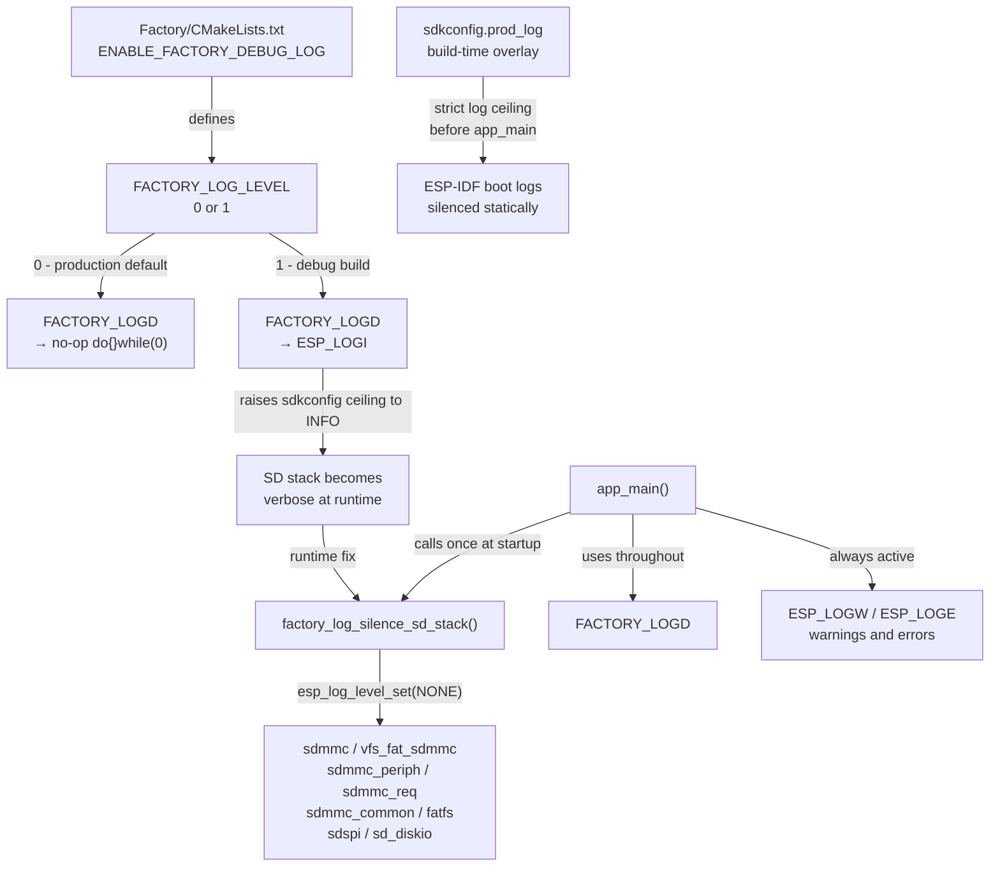
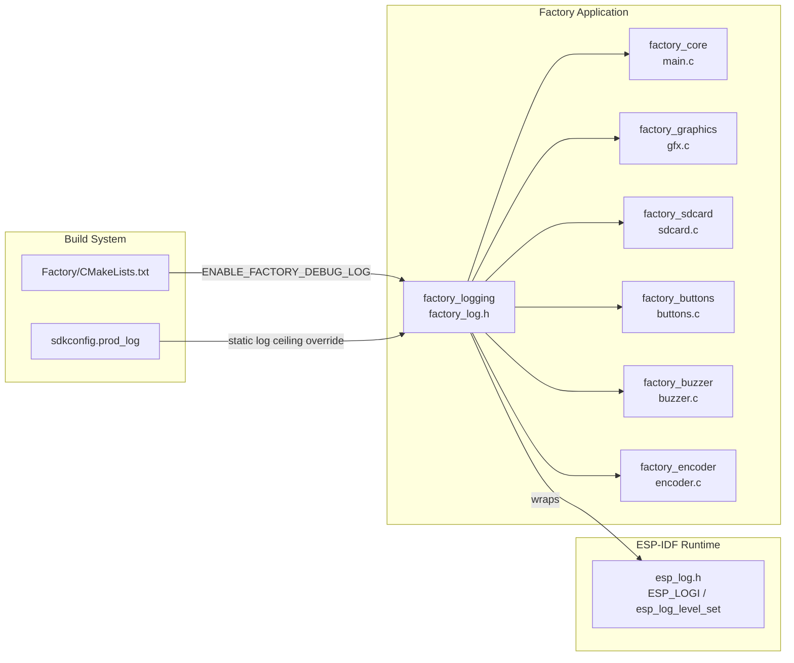
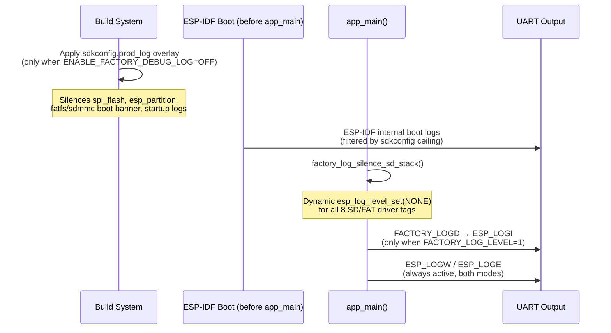
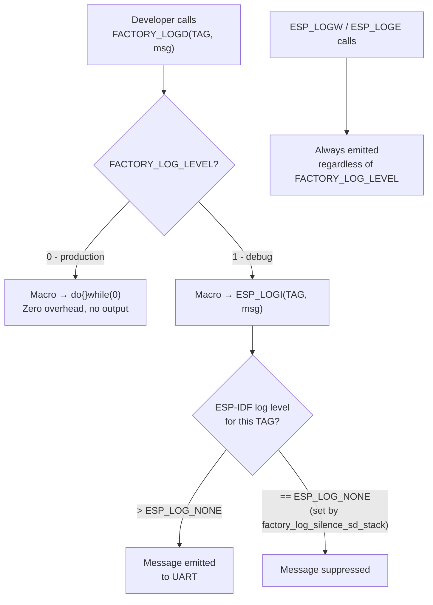
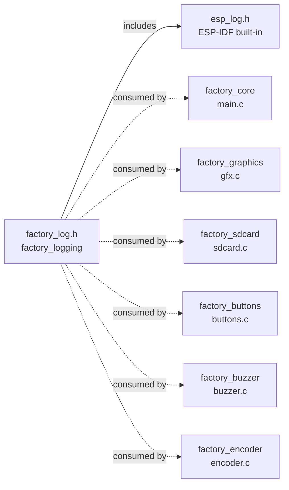

# Factory Logging Module

The `factory_logging` module provides a minimal, self-contained debug log gate for the Factory application. It defines a compile-time–gated logging macro (`FACTORY_LOGD`) and a runtime helper (`factory_log_silence_sd_stack`) that suppresses verbose SD/FAT driver output. Together, these two primitives keep UART output clean in production while still allowing targeted debug output during development — without any dependency on the main firmware's `esp3d_log` infrastructure.

---

## Architecture Overview



The module is intentionally a **single-header design**: each board copies `factory_log.h` into its own `Factory/main/` directory. There is no shared component dependency — the factory app is a standalone ESP-IDF project fully isolated from the main firmware component tree.

---

## Module Context

The `factory_logging` module is a sub-module of the [Factory Application & Bootloader](factory_app.md). It is consumed exclusively inside the factory app and has **no dependency on the main firmware's `esp3d_log` system** (documented in `docs/guides/esp3d_log_guide.md`).



---

## File Layout

The header is replicated per board under each board's `Factory/main/` directory. All copies are **identical** — the file is not shared via a CMake component in order to keep every factory project self-contained and independently buildable.

| Board | Path |
|---|---|
| esp32\_3248s035c | `boards/esp32_3248s035c/Factory/main/factory_log.h` |
| esp32\_3248s035r | `boards/esp32_3248s035r/Factory/main/factory_log.h` |
| esp32s3\_4827s043c | `boards/esp32s3_4827s043c/Factory/main/factory_log.h` |
| esp32s3\_8048\_touch\_lcd\_7 | `boards/esp32s3_8048_touch_lcd_7/Factory/main/factory_log.h` |
| esp32s3\_8048s043c | `boards/esp32s3_8048s043c/Factory/main/factory_log.h` |
| esp32s3\_8048s050c | `boards/esp32s3_8048s050c/Factory/main/factory_log.h` |
| esp32s3\_8048s070c | `boards/esp32s3_8048s070c/Factory/main/factory_log.h` |
| esp32s3\_bzm\_tft35\_gt911 | `boards/esp32s3_bzm_tft35_gt911/Factory/main/factory_log.h` |
| esp32s3\_hmi43v3 | `boards/esp32s3_hmi43v3/Factory/main/factory_log.h` |
| esp32s3\_zx3d50ce02s\_usrc\_4832 | `boards/esp32s3_zx3d50ce02s_usrc_4832/Factory/main/factory_log.h` |
| pibot\_pendant\_v1\_0 | `boards/pibot_pendant_v1_0/Factory/main/factory_log.h` |

---

## API Reference

### Compile-Time Constant: `FACTORY_LOG_LEVEL`

```c
#ifndef FACTORY_LOG_LEVEL
#define FACTORY_LOG_LEVEL 0
#endif
```

| Attribute | Value |
|---|---|
| **Default** | `0` — production mode; all `FACTORY_LOGD` calls become no-ops |
| **Set by** | `ENABLE_FACTORY_DEBUG_LOG` option in `Factory/CMakeLists.txt` |
| **Scope** | Independent of the global `CONFIG_LOG_DEFAULT_LEVEL` in sdkconfig |

> ⚠️ This constant gates **only** `FACTORY_LOGD` calls. `ESP_LOGW` and `ESP_LOGE` are always active regardless of this value.

---

### Macro: `FACTORY_LOGD`

```c
// When FACTORY_LOG_LEVEL = 1 (debug build):
#define FACTORY_LOGD(tag, fmt, ...) ESP_LOGI(tag, fmt, ##__VA_ARGS__)

// When FACTORY_LOG_LEVEL = 0 (production build):
#define FACTORY_LOGD(tag, fmt, ...) do {} while (0)
```

**Parameters**

| Parameter | Type | Description |
|---|---|---|
| `tag` | `const char *` | ESP-IDF log tag string (e.g. `"factory_sdcard"`) |
| `fmt` | `const char *` | `printf`-style format string |
| `...` | variadic | Format arguments |

**Behavior**

| Mode | Expansion | Runtime Cost |
|---|---|---|
| Production (`FACTORY_LOG_LEVEL=0`) | `do {} while (0)` — null statement | Zero — eliminated by the compiler |
| Debug (`FACTORY_LOG_LEVEL=1`) | `ESP_LOGI(tag, fmt, ...)` | Normal ESP-IDF log path |

**Usage example**

```c
#include "factory_log.h"

static const char *TAG = "factory_sdcard";

esp_err_t sdcard_mount(void) {
    FACTORY_LOGD(TAG, "Mounting SD card...");
    // ... mount logic ...
    FACTORY_LOGD(TAG, "SD card mounted at /sdcard");
    return ESP_OK;
}
```

---

### Function: `factory_log_silence_sd_stack`

```c
static inline void factory_log_silence_sd_stack(void);
```

Suppresses verbose runtime output from the ESP-IDF SD/FAT driver subsystem by setting each relevant driver tag to `ESP_LOG_NONE` via `esp_log_level_set()`.

**Silenced tags**

| Tag | Driver Component |
|---|---|
| `sdmmc` | SD/MMC core driver |
| `vfs_fat_sdmmc` | VFS layer over FAT on SD |
| `sdmmc_periph` | SD peripheral HAL |
| `sdmmc_req` | SD request queue |
| `sdmmc_common` | SD common utilities |
| `fatfs` | FatFS file system |
| `sdspi` | SD over SPI driver |
| `sd_diskio` | SD disk I/O layer |

**Call site**: Called once at the start of `app_main()`, before the first call to `sdcard_mount()`.

```c
void app_main(void) {
    factory_log_silence_sd_stack();  // suppress SD stack chatter first
    // ...
    sdcard_mount();
}
```

> **Why this is needed in debug builds**: When `FACTORY_LOG_LEVEL=1`, the build uses the base `sdkconfig` which raises the global log ceiling to `INFO`. This causes the SD/FAT driver stack to emit its own internal progress messages — unrelated to factory logic — making the UART output difficult to read. `factory_log_silence_sd_stack()` re-mutes those specific tags at runtime after initialization.

---

## Two-Layer Silencing Strategy

The module uses two complementary mechanisms to control log output, each targeting a different phase of boot:



| Layer | Mechanism | Phase | Controls |
|---|---|---|---|
| **Static** | `sdkconfig.prod_log` build overlay | Before `app_main()` | ESP-IDF boot banner, `spi_flash`, `esp_partition`, early FAT/SD startup logs |
| **Dynamic** | `factory_log_silence_sd_stack()` | Inside `app_main()` | SD/FAT driver runtime chatter across all 8 driver tags |

---

## Build Configuration

### Enabling Debug Logging

Each board's `Factory/CMakeLists.txt` exposes an option that controls logging. When enabled, it:
1. Defines `FACTORY_LOG_LEVEL=1` so `FACTORY_LOGD` expands to `ESP_LOGI`
2. Selects the base `sdkconfig` (INFO ceiling) instead of the `sdkconfig.prod_log` overlay

```cmake
option(ENABLE_FACTORY_DEBUG_LOG "Enable factory debug logging" OFF)

if(ENABLE_FACTORY_DEBUG_LOG)
    add_compile_definitions(FACTORY_LOG_LEVEL=1)
    # Build uses base sdkconfig (INFO-level ceiling)
else()
    # Build applies sdkconfig.prod_log overlay (strict / silent)
endif()
```

To build with debug logging enabled:

```bash
idf.py -DENABLE_FACTORY_DEBUG_LOG=ON build
```

### Log Level Matrix

| Build Mode | `FACTORY_LOG_LEVEL` | `FACTORY_LOGD` output | sdkconfig used | SD stack at runtime |
|---|---|---|---|---|
| **Production** | `0` | None (no-op) | `sdkconfig.prod_log` (strict ceiling) | Silenced at build level |
| **Debug** | `1` | `ESP_LOGI(...)` | base `sdkconfig` (INFO ceiling) | Silenced at runtime via `factory_log_silence_sd_stack()` |

---

## Data Flow



---

## Relationship to Main Firmware Logging

The factory app's logging system is **entirely separate** from the main firmware's `esp3d_log` infrastructure. They share only the underlying ESP-IDF `esp_log.h` layer.

| Aspect | Factory App (`factory_log.h`) | Main Firmware (`esp3d_log`) |
|---|---|---|
| Primary macro | `FACTORY_LOGD` | `esp3d_log` / `esp3d_log_d` |
| Backend | `ESP_LOGI` — direct ESP-IDF call | Pluggable: serial, SD, telnet, WebSocket, UART2 |
| Runtime hooks | None | `esp3d_log_register_hook` |
| Verbosity control | Compile-time (`FACTORY_LOG_LEVEL`) | Two-tier: `esp3d_log` (always) / `esp3d_log_d` (debug only) |
| Scope | Factory standalone app only | Full main firmware stack |
| Shares code with main firmware | No | Yes — `components/esp3d_log/` |

For main firmware logging details, see `docs/guides/esp3d_log_guide.md`.

---

## Dependencies



**External dependencies**: `esp_log.h` from ESP-IDF only.  
**Internal dependencies**: None — no link-time dependency on any main firmware component.

---

## Design Notes

- **Header-only**: The entire module is a single `#pragma once` header with no `.c` file and no CMake component registration. Inclusion cost is zero.
- **Zero-cost in production**: `FACTORY_LOGD` expands to `do {} while (0)`. All optimizing compilers eliminate this completely — no instructions, no string literals emitted into the production binary.
- **No string tables in production**: Because `FACTORY_LOGD` is a no-op when `FACTORY_LOG_LEVEL=0`, `tag` and `fmt` string literals are never emitted into the production flash image.
- **Warnings and errors always active**: `ESP_LOGW` and `ESP_LOGE` are used directly — they bypass `FACTORY_LOGD` and are never gated. Critical problems remain visible in both production and debug builds.
- **Per-board copy is intentional**: The header is duplicated rather than placed in a shared component. Each board's `Factory/` directory is an independent ESP-IDF project; a shared component would require a common registry or `EXTRA_COMPONENT_DIRS` wiring that contradicts the factory app's isolation model.
- **`static inline` function**: `factory_log_silence_sd_stack()` is declared `static inline` to avoid duplicate-symbol link errors when the header is included in multiple translation units within the same factory build.

---

## Related Documentation

- [Factory Application & Bootloader](factory_app.md) — Parent module; contains the factory app entry point (`app_main`) and all factory sub-modules
- [Factory SD Card](factory_sdcard.md) — The SD card module whose verbose driver output `factory_log_silence_sd_stack()` suppresses
- `docs/guides/esp3d_log_guide.md` — Main firmware logging system (`esp3d_log` macros, backends, hook API); distinct from this module
- `docs/Factory/` — Factory app and custom bootloader overview documentation
