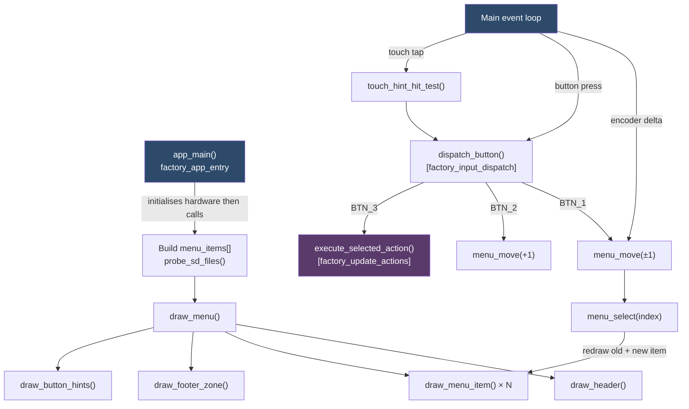
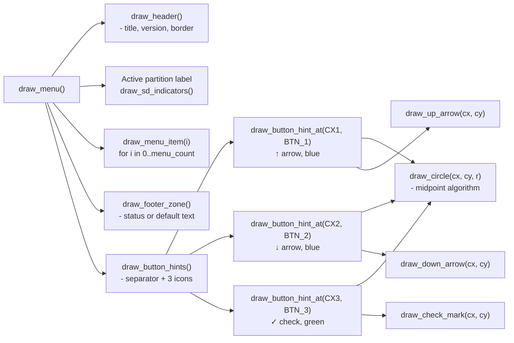
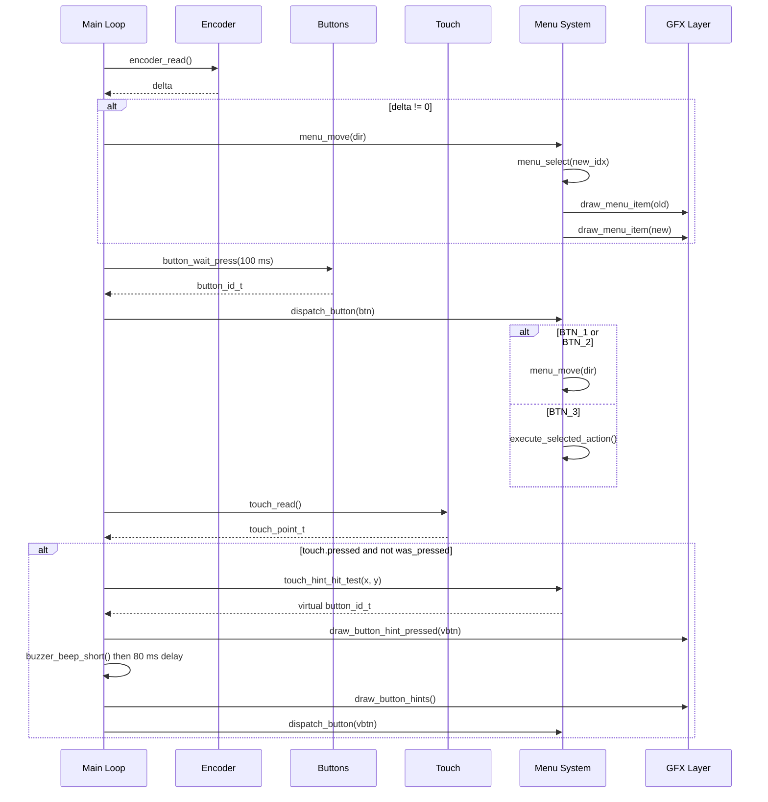
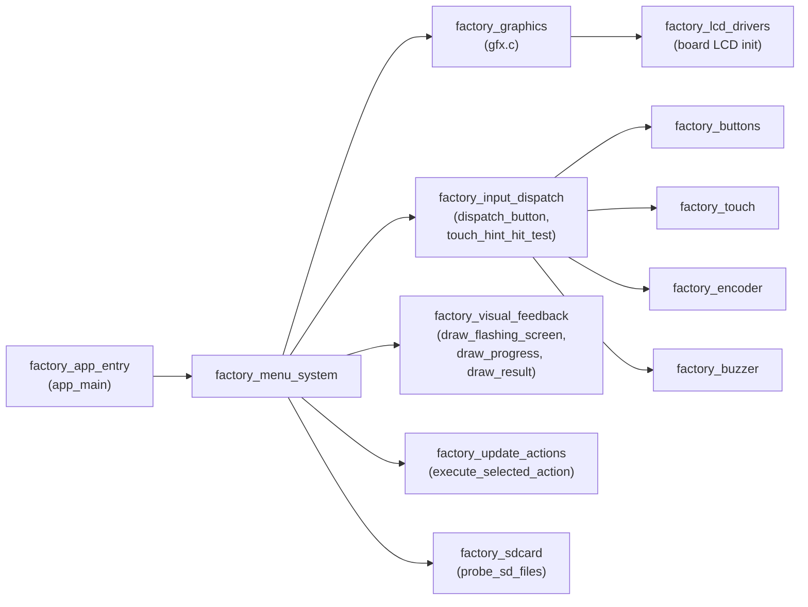
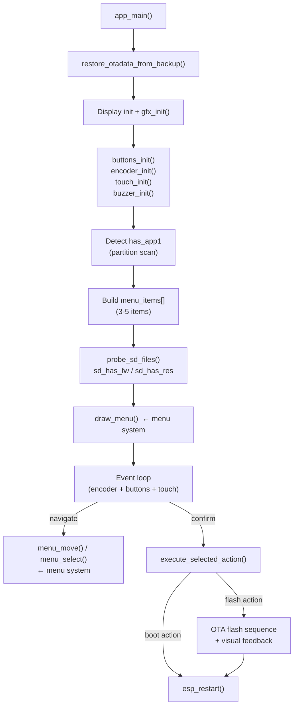

# Factory Menu System

The `factory_menu_system` module implements the interactive recovery menu displayed by the factory application when a board enters recovery mode. It is a **lightweight, LVGL-free UI** built directly on top of the `gfx` primitive drawing layer — intentionally minimal so it runs in the constrained memory environment of the factory partition, which has no LVGL, no FreeRTOS scheduler overhead from the main firmware, and must boot reliably even when the main firmware is corrupt.

The module is responsible for rendering a scrollable list of recovery actions, accepting navigation input from physical buttons, rotary encoder, or touchscreen, and routing the confirmed selection to the update-action layer.

> **Context**: This module lives inside the `factory_core` / `factory_app_core` sub-tree of the [Factory Application & Bootloader](factory_app_entry.md). Input events are unified in [factory_input_dispatch](factory_input_dispatch.md), visual progress feedback during flashing is handled by [factory_visual_feedback](factory_visual_feedback.md), and the actions triggered by menu selections are implemented in [factory_update_actions](factory_update_actions.md).

---

## Architecture Overview



---

## Component Reference

### Data Structure — `menu_item_t`

```c
typedef struct {
    const char    *label;   /* Display text (e.g. "Boot app0", "SD -> app0") */
    menu_action_t  action;  /* Enum: which operation to perform on confirm    */
    uint16_t       color;   /* RGB565 foreground color when NOT selected      */
} menu_item_t;
```

The five possible `menu_action_t` values, and which items they produce at runtime:

| `menu_action_t`              | Label (example)       | Default color | Condition          |
|------------------------------|-----------------------|---------------|--------------------|
| `MENU_ACTION_BOOT_APP0`      | `"Boot app0"`         | WHITE         | always             |
| `MENU_ACTION_BOOT_APP1`      | `"Boot app1"`         | WHITE         | `has_app1 == true` |
| `MENU_ACTION_SD_UPDATE_APP0` | `"SD -> app0"`        | GREEN         | always             |
| `MENU_ACTION_SD_UPDATE_APP1` | `"SD -> app1"`        | GREEN         | `has_app1 == true` |
| `MENU_ACTION_SD_UPDATE_RES`  | `"SD -> resources"`   | CYAN          | always             |

Maximum 8 items (`MENU_MAX_ITEMS`). Items are built once at startup in `app_main` based on partition detection and remain static for the entire session.

---

### Menu State

```c
static menu_item_t menu_items[MENU_MAX_ITEMS]; /* item array           */
static int menu_count    = 0;                  /* populated item count  */
static int menu_selected = 0;                  /* 0-based cursor index  */
```

All three are module-level statics — no heap allocation. This is intentional: the factory app targets worst-case fragmented heap (see [esp32_memory_constraints](https://github.com/luc-github/Pibot-cnc-pendant-firmware/blob/main/docs/guides/esp32_memory_constraints.md)).

---

### Navigation Functions

#### `menu_move(int direction)`

Moves the cursor by `direction` steps (typically ±1) with **wrap-around**:

```
new_index = (menu_selected + direction + menu_count) % menu_count
```

Then delegates to `menu_select()`.

**Called from**: encoder delta events (`enc > 0` → `menu_move(-1)` for CW=up, `enc < 0` → `menu_move(+1)` for CCW=down) and `dispatch_button(BTN_1 / BTN_2)`.

#### `menu_select(int index)`

Sets `menu_selected = index`, then:

1. Calls `clear_status()` if a status message is currently shown (avoids stale messages confusing the user after navigation).
2. Redraws the **old** item (removes highlight).
3. Redraws the **new** item (with highlight).

This partial-redraw strategy avoids a full-screen repaint on every key press, which is important since `gfx_flush()` is a synchronous SPI / I80 / RGB transfer.

---

### Rendering Functions



#### `draw_header()`

Clears the screen to black, draws a double-pixel white border around the full canvas, then centers the title `"Recovery <VERSION>"` in cyan, followed by a gray horizontal separator line.

#### `draw_menu_item(int index)`

Renders a single list row at `y = MENU_START_Y + index * MENU_ITEM_H`. For the selected item, a **double-border highlight box** (`MENU_HIGHLIGHT` = dark blue) is drawn first, then the label is rendered in `MENU_HIGHLIGHT_TXT` (bright blue). Unselected items use `menu_items[index].color`.

#### `draw_footer_zone()`

Renders the status/footer band above the button hint bar. Shows `last_status_msg` if set (in `last_status_color`), or the dim grey fallback text `"Power off to cancel"`.

#### `show_status(const char *msg, uint16_t color)` / `clear_status()`

Update `last_status_msg` and `last_status_color`, then call `draw_footer_zone()` directly. `clear_status()` zeroes the message buffer and redraws the footer with the default text.

---

### Button Hint Bar

The bottom strip of the display shows three touchable circular icons that act as virtual buttons for boards without physical controls.

```
┌──────────────────────────────────────────────────┐
│  ── gray separator line ──────────────────────── │
│                                                  │
│      ○         ○         ○                       │
│      ↑         ↓         ✓                       │
│   (blue)    (blue)    (green)                    │
│   BTN_1    BTN_2     BTN_3                       │
└──────────────────────────────────────────────────┘
```

**Geometry constants** (board-specific, see [Per-Board Layout Adaptation](#per-board-layout-adaptation)):

| Constant           | Role                                             |
|--------------------|--------------------------------------------------|
| `BTN_CIRCLE_R`     | Circle radius in px                              |
| `BTN_HINT_H`       | Total height of hint bar (2·R + 9 px padding)   |
| `BTN_HINT_BASE_Y`  | Y coordinate where the hint bar begins           |
| `BTN_HINT_CY`      | Y center of all three circles                    |
| `BTN_HINT_CX1/2/3` | X centers of the three circles                  |

#### `draw_button_hint_at(cx, cy, btn, color)`

Draws two concentric circle outlines (radius `R` and `R-1`, for a 2-px thick ring) using Bresenham's midpoint algorithm, then overlays the appropriate icon — `draw_up_arrow()`, `draw_down_arrow()`, or `draw_check_mark()` — using horizontal scanline calls into the `gfx` layer.

#### `draw_button_hint_pressed(btn)`

Redraws a single button icon in `BTN_PRESSED_COLOR` (violet) to give immediate visual press feedback. The caller restores normal colors by calling `draw_button_hints()` shortly after.

---

### Touch Hit-Testing — `touch_hint_hit_test(x, y)`

Returns `BTN_NONE` if `y < BTN_HINT_BASE_Y` (tap is in the menu area, not the button bar).

For taps in the button bar, the function determines which of the three virtual buttons was hit. **Two strategies are used** depending on the display form-factor:

**Portrait displays** (narrow canvases, e.g. 240×320, 320×480):

The three icons are evenly distributed across the full width, so the screen is split into equal thirds:

```
x < SCREEN_WIDTH / 3             → BTN_1
SCREEN_WIDTH/3 ≤ x < 2W/3       → BTN_2
x ≥ 2W/3                          → BTN_3
```

**Wide / landscape-rotated displays** (e.g. 800×480 glass rotated to 480×800 logical canvas):

The icons cluster around the horizontal center (`BTN_HINT_CX1/2/3` all lie near `SCREEN_WIDTH/2`), so splitting by thirds would map the outer buttons into the middle column. Instead, column boundaries use midpoints between adjacent icon centers:

```
boundary_1_2 = (BTN_HINT_CX1 + BTN_HINT_CX2) / 2
boundary_2_3 = (BTN_HINT_CX2 + BTN_HINT_CX3) / 2

x < boundary_1_2                  → BTN_1
boundary_1_2 ≤ x < boundary_2_3  → BTN_2
x ≥ boundary_2_3                  → BTN_3
```

This gives generous, non-overlapping hit targets without mismapping icons on wide canvases.

---

## Data and Control Flow



---

## Per-Board Layout Adaptation

All layout constants are `#define` literals local to each board's `Factory/main/main.c`. They are sized to fit the logical canvas of the specific display. The table below shows the reference scaling for each board group:

| Board(s)                                                                                                         | Logical Canvas | `FONT_W×H` | `MENU_ITEM_H` | `BTN_CIRCLE_R` | Hit-test strategy |
|------------------------------------------------------------------------------------------------------------------|----------------|------------|---------------|----------------|-------------------|
| `esp32_2432s028r`                                                                                                | 240×320        | 8×16       | 30            | 20             | thirds            |
| `esp32_3248s035c`, `esp32_3248s035r`, `bzm_tft35_gt911`                                                         | 320×480        | 11×21      | 40            | 27             | thirds            |
| `esp32s3_4827s043c`                                                                                              | 272×480 ¹      | 8×16       | 34            | 22             | thirds            |
| `esp32s3_8048s043c`, `esp32s3_8048s050c`, `esp32s3_8048s070c`, `esp32s3_8048_touch_lcd_7`, `hmi43v3`, `zx3d50ce02s_usrc_4832`, `pibot_pendant_v1_0` | 480×800 ²      | 12×24      | 34            | 30             | midpoint          |

> ¹ Physical glass is 480×272 landscape; the pendant enclosure mounts it rotated 90° so the logical canvas is 272×480 portrait.  
> ² Exact width varies by panel (480 or 800) but font and circle sizing is shared across this group.

The `MENU_START_Y` (top of first item), `STATUS_Y` (footer band top), and separator line Y coordinates follow the same scaling rationale so all zones remain proportionally identical regardless of display size.

For display driver details and orientation/rotation semantics, see [display_drivers](https://github.com/luc-github/Pibot-cnc-pendant-firmware/blob/main/docs/architecture/display_drivers.md).

---

## Screen Layout (Schematic)

```
┌──────────────────────────────────────┐  ← double-pixel white border
│  Recovery v1.x.x                     │  ← draw_header() — title in CYAN
│ ────────────────────────────────── │  ← gray separator
│  Active: app0                        │  ← active OTA label in YELLOW
│  SD: FW RES                          │  ← draw_sd_indicators() in GREEN/CYAN
│ ────────────────────────────────── │  ← gray separator
│  ▌Boot app0                ▌         │  ← selected — highlight box + bright text
│   Boot app1                          │  ← unselected — COLOR_WHITE
│   SD -> app0                         │  ← COLOR_GREEN
│   SD -> app1                         │  ← COLOR_GREEN (if has_app1)
│   SD -> resources                    │  ← COLOR_CYAN
│                                      │
│ ────────────────────────────────── │  ← gray separator
│  Power off to cancel                 │  ← draw_footer_zone() — dim gray default
│ ────────────────────────────────── │  ← BTN_HINT_BASE_Y separator
│      ○         ○         ○           │
│      ↑         ↓         ✓           │
└──────────────────────────────────────┘
```

---

## Color Palette

| Token                | Approximate RGB             | Usage                                |
|----------------------|-----------------------------|--------------------------------------|
| `MENU_HIGHLIGHT`     | `GFX_RGB565(0,80,160)`      | Selected item background box         |
| `MENU_HIGHLIGHT_TXT` | `GFX_RGB565(80,160,255)`    | Selected item text                   |
| `BTN_NAV_COLOR`      | `GFX_RGB565(100,160,255)`   | Up/Down button circles (blue)        |
| `BTN_OK_COLOR`       | `GFX_RGB565(100,220,100)`   | OK button circle (green)             |
| `BTN_PRESSED_COLOR`  | `GFX_RGB565(180,80,220)`    | Any button during press (violet)     |
| `COLOR_CYAN`         | system                      | Title, "SD:" has-resources marker    |
| `COLOR_GREEN`        | system                      | SD firmware update items, success    |
| `COLOR_RED`          | system                      | Error status messages                |
| `COLOR_YELLOW`       | system                      | Active partition info label          |
| `COLOR_DARKGRAY`     | system                      | SD prefix label, default footer text |

---

## Dependencies



| Dependency                                          | What is used from it                                                           |
|-----------------------------------------------------|--------------------------------------------------------------------------------|
| [factory_graphics](factory_graphics.md)             | All pixel output: `gfx_clear`, `gfx_rect`, `gfx_fill_rect`, `gfx_hline`, `gfx_draw_string` |
| [factory_input_dispatch](factory_input_dispatch.md) | `dispatch_button()`, unified routing from physical BTN / encoder / touch       |
| [factory_visual_feedback](factory_visual_feedback.md)| `draw_flashing_screen()`, `draw_progress()`, `draw_result()` during OTA flash |
| [factory_update_actions](factory_update_actions.md) | `execute_selected_action()`, `probe_sd_files()`, `boot_partition()`            |
| [factory_sdcard](factory_sdcard.md)                 | `sdcard_mount()` / `sdcard_unmount()` called by `probe_sd_files()`             |
| [factory_buttons](factory_buttons.md)               | `button_wait_press()` — physical button polling                                |
| [factory_touch](factory_touch.md)                   | `touch_read()` — raw touch point polling                                       |
| [factory_encoder](factory_encoder.md)               | `encoder_read()` — rotary encoder delta                                        |
| [factory_buzzer](factory_buzzer.md)                 | `buzzer_beep_short()` — tactile feedback on virtual button tap                 |

---

## Integration in the Factory Application

The factory menu system is initialised and driven directly from `app_main()` in [factory_app_entry](factory_app_entry.md):



`probe_sd_files()` is called once at startup to populate `sd_has_fw` / `sd_has_res`, which are then shown in `draw_sd_indicators()`. After a failed flash it is called again so the SD indicators update before the menu is redrawn.

---

## Board-Specific Notes

### `esp32_2432s028r`

Simplest variant. No physical buttons and no rotary encoder (all `GPIO_NUM_NC`). All navigation is touch-only. Touch hit-test uses the portrait thirds strategy on a 240×320 canvas.

### `esp32_3248s035r`

Identical layout to `esp32_3248s035c` (same ST7796 SPI panel, 320×480). Adds `touch_calibrate()` for the resistive XPT2046 touch controller before entering the event loop.

### `esp32s3_8048_touch_lcd_7`

Large 7" landscape display mounted in portrait orientation. Uniquely initialises the **CH422G IO expander** at startup to bring up the `SD_CS` pin before any SD card access. Uses the midpoint-based touch hit-test.

---

## Porting Notes

When adding a new board variant:

1. **Copy** the nearest existing board's `Factory/main/main.c` as a starting point.
2. **Recalculate layout constants** (`MENU_START_Y`, `MENU_ITEM_H`, `FONT_WIDTH`, `FONT_HEIGHT`, `BTN_CIRCLE_R`, `BTN_HINT_H`, `STATUS_Y`) based on the target logical canvas size. Portrait boards share the 240×320 or 320×480 reference values; wide landscape-rotated boards share the `r=30` group.
3. **Verify hit-test strategy**: use the midpoint algorithm if `BTN_HINT_CX1` is not near `SCREEN_WIDTH/3` — i.e. for wide canvases where icons cluster around center.
4. **Recalculate `OTADATA_BACKUP_OFFSET`** if the partition table layout differs. This value must match `esp444.cpp` in the main firmware exactly (see the comments in every board's `main.c`).
5. **Set `CONFIG_SPI_FLASH_DANGEROUS_WRITE_ALLOWED=y`** in the factory `sdkconfig`. This is required for direct raw flash writes below the first partition.

For display driver setup and orientation mapping, see [display_drivers](https://github.com/luc-github/Pibot-cnc-pendant-firmware/blob/main/docs/architecture/display_drivers.md).  
For the full factory application entry and boot sequence, see [factory_app_entry](factory_app_entry.md).
