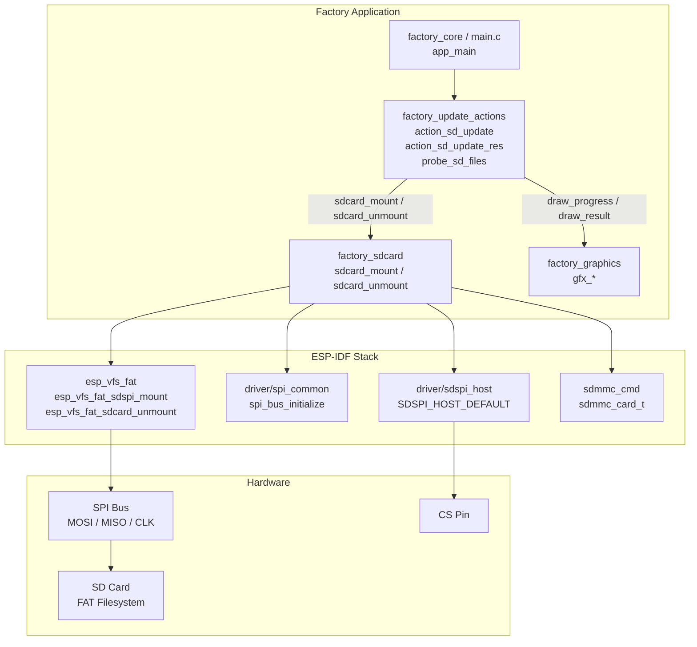
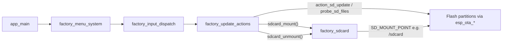
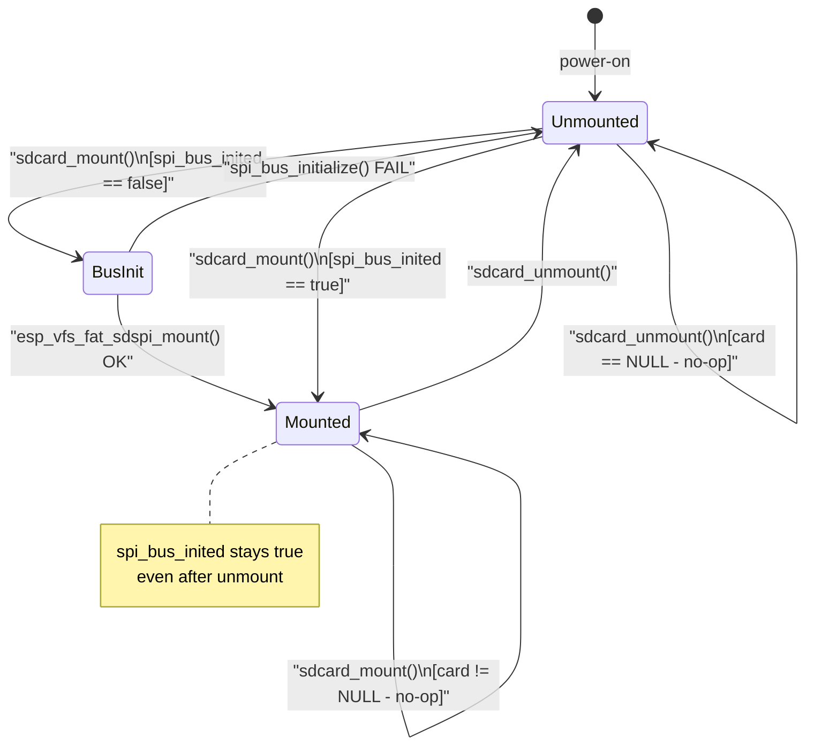
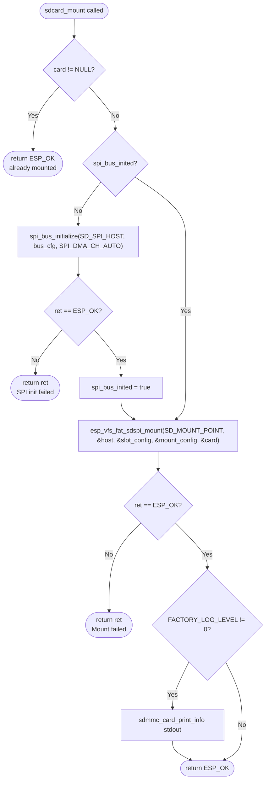
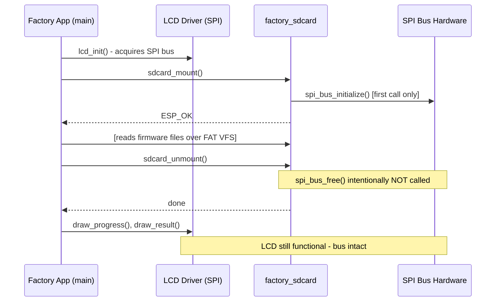
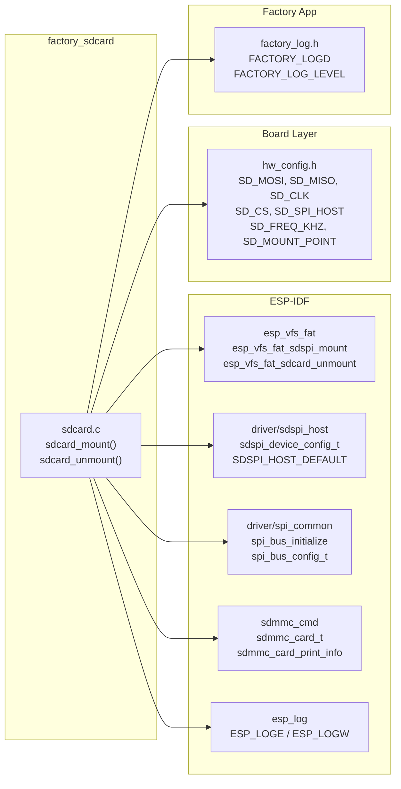

# Factory SD Card Module (`factory_sdcard`)

The `factory_sdcard` module provides SD card mount and unmount operations for the Factory Application. It is the sole storage access layer used during factory-mode firmware updates — the factory app mounts the card, reads binary files from it (firmware, UI resources), flashes them to the appropriate partitions, then unmounts when done.

Every supported board provides its own `sdcard.c`, but all implementations are **functionally identical**: SPI-based access via ESP-IDF's `esp_vfs_fat`, with board-specific pin numbers injected through `hw_config.h`.

---

## Table of Contents

1. [Architecture Overview](#architecture-overview)
2. [Module Position in the Factory App](#module-position-in-the-factory-app)
3. [Supported Boards](#supported-boards)
4. [Public API](#public-api)
5. [Internal State](#internal-state)
6. [Mount Process Flow](#mount-process-flow)
7. [SPI Bus Sharing Design](#spi-bus-sharing-design)
8. [Configuration Reference (`hw_config.h`)](#configuration-reference-hw_configh)
9. [Logging](#logging)
10. [Dependencies](#dependencies)
11. [Related Modules](#related-modules)

---

## Architecture Overview



---

## Module Position in the Factory App

The factory application runs as a standalone ESP-IDF app (separate from the main pendant firmware). `factory_sdcard` sits at the bottom of the storage call stack — it has no knowledge of what files are read; that responsibility belongs to [`factory_update_actions`](factory_app.md).



`factory_sdcard` is called by `factory_update_actions` for three operations:

| Caller function | `factory_sdcard` call |
|---|---|
| `probe_sd_files` | `sdcard_mount()` → scan files → `sdcard_unmount()` |
| `action_sd_update` | `sdcard_mount()` → stream firmware binary → `sdcard_unmount()` |
| `action_sd_update_res` | `sdcard_mount()` → stream resources binary → `sdcard_unmount()` |

---

## Supported Boards

All boards listed below use the identical `sdcard_mount` / `sdcard_unmount` implementation. Pin assignments differ and are controlled entirely through each board's `hw_config.h`.

| Board | File path |
|---|---|
| `esp32_2432s028r` | `boards/esp32_2432s028r/Factory/main/sdcard.c` |
| `esp32_3248s035c` | `boards/esp32_3248s035c/Factory/main/sdcard.c` |
| `esp32_3248s035r` | `boards/esp32_3248s035r/Factory/main/sdcard.c` |
| `esp32s3_4827s043c` | `boards/esp32s3_4827s043c/Factory/main/sdcard.c` |
| `esp32s3_8048_touch_lcd_7` | `boards/esp32s3_8048_touch_lcd_7/Factory/main/sdcard.c` |
| `esp32s3_8048s043c` | `boards/esp32s3_8048s043c/Factory/main/sdcard.c` |
| `esp32s3_8048s050c` | `boards/esp32s3_8048s050c/Factory/main/sdcard.c` |
| `esp32s3_8048s070c` | `boards/esp32s3_8048s070c/Factory/main/sdcard.c` |
| `esp32s3_bzm_tft35_gt911` | `boards/esp32s3_bzm_tft35_gt911/Factory/main/sdcard.c` |
| `esp32s3_hmi43v3` | `boards/esp32s3_hmi43v3/Factory/main/sdcard.c` |
| `esp32s3_zx3d50ce02s_usrc_4832` | `boards/esp32s3_zx3d50ce02s_usrc_4832/Factory/main/sdcard.c` |
| `pibot_pendant_v1_0` | `boards/pibot_pendant_v1_0/Factory/main/sdcard.c` |

---

## Public API

### `sdcard_mount()`

```c
esp_err_t sdcard_mount(void);
```

Mounts the SD card over the FAT VFS at `SD_MOUNT_POINT`.

**Behavior:**
- **Idempotent**: returns `ESP_OK` immediately if the card is already mounted (`card != NULL`).
- Initializes the SPI bus on the first call only (guarded by `spi_bus_inited`).
- Mounts using `esp_vfs_fat_sdspi_mount()` with `format_if_mount_failed = false` — the card is **never reformatted** by the factory app.
- Enables disk status checking (`disk_status_check_enable = true`).
- Allows up to 4 simultaneously open files.
- Prints card info to stdout when `FACTORY_LOG_LEVEL` is non-zero.

**Returns:**

| Value | Meaning |
|---|---|
| `ESP_OK` | Card successfully mounted (or was already mounted) |
| `ESP_ERR_*` (from `spi_bus_initialize`) | SPI bus initialization failed |
| `ESP_ERR_*` (from `esp_vfs_fat_sdspi_mount`) | Mount failed (card absent, format error, etc.) |

Callers may call `sdcard_mount()` multiple times safely — duplicate calls are no-ops.

---

### `sdcard_unmount()`

```c
void sdcard_unmount(void);
```

Unmounts the SD card from the VFS. The SPI bus peripheral is intentionally **left initialized** after unmount (see [SPI Bus Sharing Design](#spi-bus-sharing-design)).

**Behavior:**
- No-op if `card == NULL` (not currently mounted).
- Calls `esp_vfs_fat_sdcard_unmount(SD_MOUNT_POINT, card)`.
- Resets `card` to `NULL`.
- Does **not** call `spi_bus_free()`.

---

## Internal State

The module uses two file-scope static variables, making the implementation non-reentrant (acceptable — the factory app is single-tasked):

```c
static sdmmc_card_t *card = NULL;    // NULL = not mounted
static bool spi_bus_inited = false;  // true once spi_bus_initialize() succeeds
```



---

## Mount Process Flow



---

## SPI Bus Sharing Design

Many boards share the same SPI bus between the TFT display driver and the SD card. The factory app initialises the display before ever accessing the SD card.

**Key constraint**: calling `spi_bus_free()` after unmounting the SD card would destroy the shared SPI bus, causing the display driver to malfunction for any subsequent redraws (progress bars, result screens, etc.).

**Solution**: `sdcard_unmount()` never calls `spi_bus_free()`. The `spi_bus_inited` flag ensures the bus is only initialized once per power cycle. The bus stays alive for the entire lifetime of the factory app.



> **Note**: This design is specific to the factory app context. The main pendant firmware manages SD card sharing through a different arbitration mechanism — see [`shared_sd_mechanism_V2.0.md`](https://github.com/luc-github/Pibot-cnc-pendant-firmware/blob/main/docs/architecture/shared_sd_mechanism_V2.0.md).

---

## Configuration Reference (`hw_config.h`)

Every board provides a `hw_config.h` defining the constants consumed by `sdcard.c`. All of the following symbols must be present:

| Symbol | Type | Description |
|---|---|---|
| `SD_MOSI` | `int` / `gpio_num_t` | SPI MOSI GPIO number |
| `SD_MISO` | `int` / `gpio_num_t` | SPI MISO GPIO number |
| `SD_CLK` | `int` / `gpio_num_t` | SPI clock GPIO number |
| `SD_CS` | `int` / `gpio_num_t` | SD card chip-select GPIO number |
| `SD_SPI_HOST` | `spi_host_device_t` | SPI peripheral (e.g., `SPI2_HOST`, `SPI3_HOST`) |
| `SD_FREQ_KHZ` | `int` | Maximum SPI clock frequency in kHz (e.g., `4000`) |
| `SD_MOUNT_POINT` | `const char *` | VFS mount path string (e.g., `"/sdcard"`) |

These are the **only** board-specific differences — the `sdcard.c` body is completely board-agnostic.

---

## Logging

| Macro / call | Active when | Purpose |
|---|---|---|
| `FACTORY_LOGD(TAG, ...)` | `FACTORY_LOG_LEVEL != 0` | Debug messages: mount attempt, success, unmount confirmation. Silenced in production builds by `factory_log_silence_sd_stack`. |
| `ESP_LOGE(TAG, ...)` | Always | Hard error: SPI bus init failure — always visible regardless of `FACTORY_LOG_LEVEL`. |
| `ESP_LOGW(TAG, ...)` | Always | Warning: mount failure (card absent, filesystem error, etc.). |
| `sdmmc_card_print_info(stdout, card)` | `#if FACTORY_LOG_LEVEL` | Prints card capacity, speed class and CID on successful mount. |

See [`factory_logging`](factory_app.md) for how `FACTORY_LOGD` and `factory_log_silence_sd_stack` are defined and how they suppress the verbose ESP-IDF SD stack output during normal factory operation.

---

## Dependencies



**ESP-IDF APIs used:**

| API | Header | Purpose |
|---|---|---|
| `spi_bus_initialize()` | `driver/spi_common.h` | Initialize SPI bus peripheral (once per power cycle) |
| `SDSPI_DEVICE_CONFIG_DEFAULT()` | `driver/sdspi_host.h` | Initialize SD SPI slot config to safe defaults |
| `SDSPI_HOST_DEFAULT()` | `driver/sdspi_host.h` | Initialize SDSPI host config to safe defaults |
| `esp_vfs_fat_sdspi_mount()` | `esp_vfs_fat.h` | Mount FAT filesystem over SPI into the VFS |
| `esp_vfs_fat_sdcard_unmount()` | `esp_vfs_fat.h` | Gracefully unmount FAT filesystem from VFS |
| `sdmmc_card_print_info()` | `sdmmc_cmd.h` | Print card info to stdout (debug builds only) |

---

## Related Modules

| Module | Relationship |
|---|---|
| [`factory_update_actions`](factory_app.md) | **Primary caller** — wraps every SD-based flash operation with `sdcard_mount()` / `sdcard_unmount()` |
| [`factory_logging`](factory_app.md) | Provides `FACTORY_LOGD` macro and `factory_log_silence_sd_stack` used inside `sdcard.c` |
| [`factory_lcd_drivers`](factory_app.md) | Shares the SPI bus on many boards — the reason `spi_bus_free()` is never called on unmount |
| [`factory_core`](factory_app.md) | Top-level factory app entry; drives the overall mount → flash → unmount lifecycle |
| [`bsp_bus_drivers`](Hardware_Peripheral_Drivers.md) | Main firmware SPI/I2C bus abstraction — **not used** by the factory app; factory manages SPI directly |
| [`filesystem` (main firmware)](Core_Platform_and_Infrastructure.md) | Main firmware SD abstraction (`esp3d_sd.h`, `esp_sd_spi.cpp`) — different code path and lifecycle; see [`shared_sd_mechanism_V2.0.md`](https://github.com/luc-github/Pibot-cnc-pendant-firmware/blob/main/docs/architecture/shared_sd_mechanism_V2.0.md) for coexistence details |
