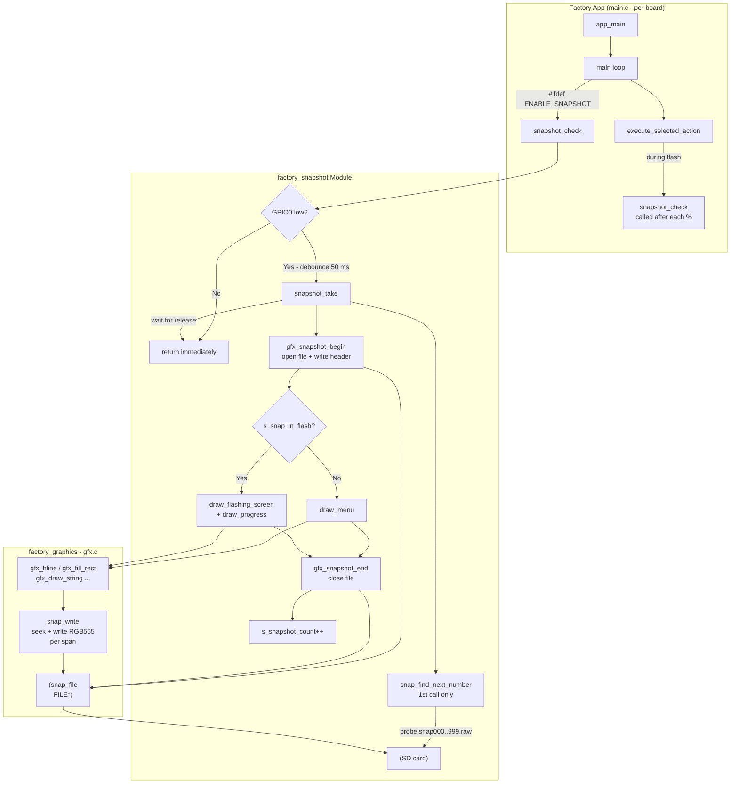
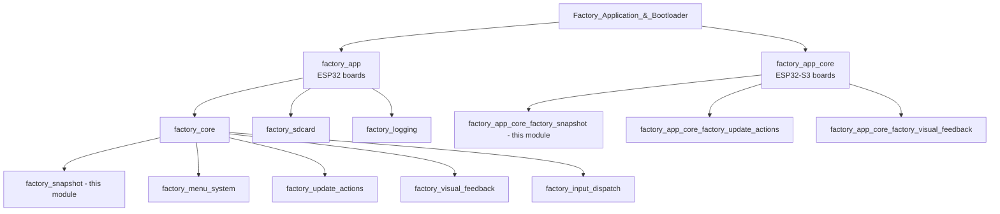
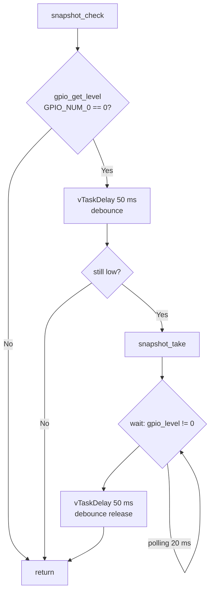
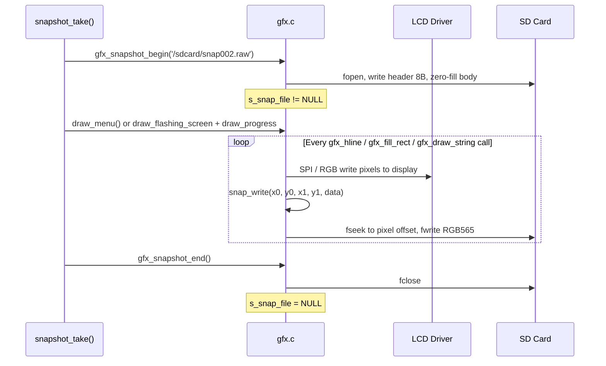
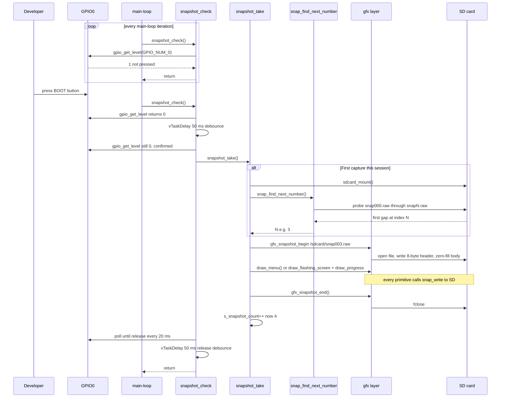
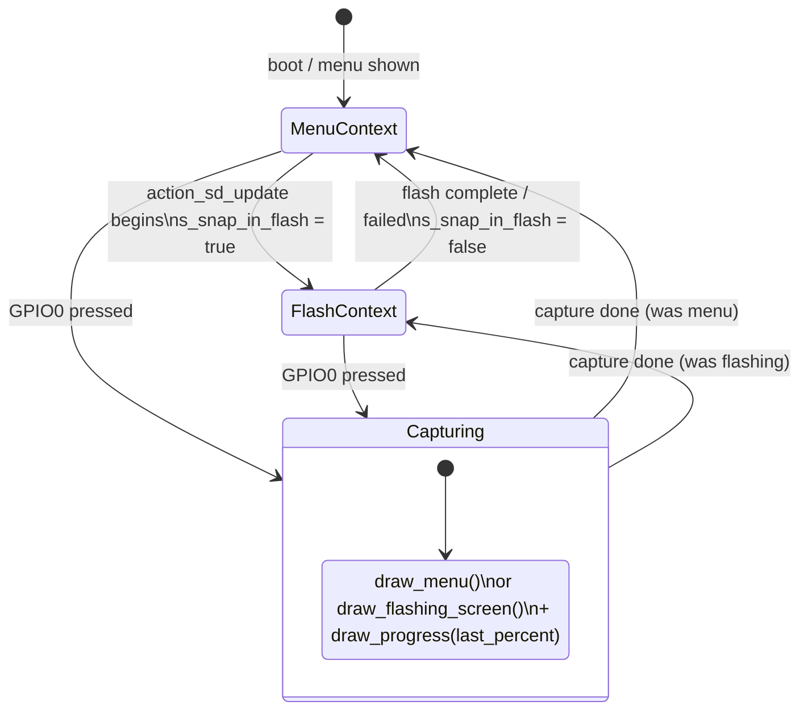

# factory_snapshot

## Introduction

The `factory_snapshot` module provides a **developer debug tool** embedded inside the factory recovery app. When the compile-time flag `ENABLE_SNAPSHOT` is set, pressing the **BOOT button (GPIO0)** at any point during the recovery session captures a full-resolution screenshot of the current display and saves it as a raw RGB565 file on the SD card.

The mechanism is transparent to the rest of the factory app: it hooks into the existing GFX layer rather than reading the frame-buffer directly. When a capture is triggered, the module performs a **full screen redraw** — all `gfx_*` drawing calls simultaneously paint the display and write pixels into the open snapshot file. This guarantees a pixel-perfect, gap-free image without requiring a second frame-buffer or DMA readback capability.

The module is exclusively a factory / development tool. It does not exist in the main firmware and is compiled out of production factory binaries by leaving `ENABLE_SNAPSHOT` undefined.

---

## Architecture Overview



The module sits entirely within the factory app's main task (no separate FreeRTOS task). `snapshot_check` is a **non-blocking poll** in the main loop: if GPIO0 is not asserted it returns in a handful of instructions. Only an actual button press serializes through the full capture path.

---

## Module Placement in the Factory App Tree

The `factory_snapshot` module is a leaf sub-module of `factory_core` (ESP32 boards) and `factory_app_core` (ESP32-S3 boards). Both groups are children of the top-level [Factory Application & Bootloader](factory_app_entry.md) module.



> The module is logically identical in both trees; the only difference is which board's `main.c` contains the implementation.

---

## Core Components

All three functions are defined `static` inside the board-specific `main.c` and are **only compiled when `ENABLE_SNAPSHOT` is defined**.

### Static State Variables

| Variable | Type | Initial value | Purpose |
|---|---|---|---|
| `s_snapshot_count` | `int` | `0` | Running file counter; `0` triggers lazy init via `snap_find_next_number` |
| `s_snap_in_flash` | `bool` | `false` | Set `true` by flash actions while a firmware write is in progress |
| `s_flash_last_percent` | `int` | `0` | Last progress percentage passed to `draw_progress()` |

---

### `snap_find_next_number()`

```c
static int snap_find_next_number(void)
```

Scans `snap000.raw` through `snap999.raw` on the SD card and returns the first number whose file does **not** exist. Called exactly **once**, on the first `snapshot_take()` invocation during a session (`s_snapshot_count == 0`), so that repeated snapshots within the same recovery session are numbered consecutively without re-scanning the card on every press.

| Behaviour | Detail |
|---|---|
| Max files | 999 (`snap000.raw` … `snap998.raw`; stops at 999) |
| SD state | SD must already be mounted by the caller |
| Cost | Sequential `fopen/fclose` per slot until a gap is found |

---

### `snapshot_take()`

```c
static void snapshot_take(void)
```

Orchestrates a single full-screen capture. The sequence is:

1. Mount the SD card (`sdcard_mount`). Abort silently on failure.
2. On first call, determine the starting file number via `snap_find_next_number()`.
3. Build the path `"/sdcard/snap%03d.raw"` and call `gfx_snapshot_begin(path)`.
   - The GFX layer opens the file, writes an 8-byte header (`width` + `height` as little-endian `uint32_t`), and pre-fills the rest of the file with zeros.
4. **Context-aware redraw** using the `s_snap_in_flash` flag:
   - `false` → call `draw_menu()` (and re-apply any active status message).
   - `true`  → call `draw_flashing_screen()` + `draw_progress(s_flash_last_percent)`.

   During the redraw every `gfx_*` primitive also calls `snap_write()` inside the GFX layer, which byte-seeks to the correct pixel offset and writes the RGB565 data.
5. Call `gfx_snapshot_end()` to close the file.
6. Increment `s_snapshot_count`.

---

### `snapshot_check()`

```c
static void snapshot_check(void)
```

Lightweight, non-blocking GPIO poll. Called from:
- The **main loop** once per iteration.
- Inside `action_sd_update()` and `action_sd_update_res()` after each 1 % progress update.



The double-check after the first 50 ms delay prevents spurious captures from electrical noise. The release-wait ensures a single physical press does not trigger multiple captures.

---

## GFX Integration — Dual-Write Rendering

The snapshot system does **not** read back the frame-buffer. Instead it exploits the factory GFX layer's per-span write path (`snap_write`) to intercept every pixel as it is sent to the display. See [factory_graphics](factory_graphics.md) for full GFX layer documentation.



### `snap_write()` Detail

`snap_write` is called with a rectangular span `(x0, y0, x1, y1)` and a pointer to byte-swapped RGB565 data (the same buffer sent to the SPI controller). It:

1. Iterates over each row in the span.
2. Seeks to `SNAP_HEADER_SIZE + (row * SCREEN_WIDTH + x0) * 2` — a random-access write.
3. Un-swaps each pixel (`native = (sw >> 8) | (sw << 8)`) before writing, producing **little-endian native RGB565** in the file.

The random-access seek approach means partial or out-of-order drawing (e.g., overlaid text drawn after the background) produces a correct composite image in the file, matching exactly what is visible on screen at the moment of capture.

---

## Raw File Format

```
Offset   Size     Type          Description
-------  -------  ------------  -------------------------------------------
0x0000       4    uint32_t LE   Screen width  in pixels  (e.g. 320)
0x0004       4    uint32_t LE   Screen height in pixels  (e.g. 480)
0x0008   W*H*2    uint16_t[]    RGB565 pixels, row-major, left-to-right,
                                top-to-bottom, native little-endian
```

Total file size = `8 + width × height × 2` bytes.

Files are named `snap000.raw`, `snap001.raw`, … `snap999.raw` in the SD root directory (`/sdcard/`).

### Example — 320 × 240 Display

| Field | Bytes | Value (hex) |
|---|---|---|
| width  | 4 | `40 01 00 00` (320 LE) |
| height | 4 | `F0 00 00 00` (240 LE) |
| pixel[0,0] | 2 | RGB565, e.g. `00 F8` = pure red |
| … | … | … |
| pixel[319,239] | 2 | last pixel |
| **Total** | **153 608 B** | `8 + 320×240×2` |

---

## Converting Snapshots to PNG

Each board's `Factory/tools/raw2png/snap2png.py` converts one or more `.raw` files to PNG:

```bash
# Convert one file (output: snap000.png in same directory)
python snap2png.py snap000.raw

# Convert multiple files at once
python snap2png.py snap000.raw snap001.raw

# Specify a custom output path
python snap2png.py snap000.raw -o my_capture.png
```

The script reads the 8-byte header, decodes RGB565 → RGB888 per pixel, and saves the result via Pillow:

```python
pixel = struct.unpack_from('<H', pixel_data, offset)[0]
r = ((pixel >> 11) & 0x1F) << 3
g = ((pixel >>  5) & 0x3F) << 2
b = ( pixel        & 0x1F) << 3
```

---

## Build-Time Configuration

The entire module — including GPIO configuration — is wrapped in `#ifdef ENABLE_SNAPSHOT`. When the flag is **not** set, the factory binary is unchanged: no GPIO is configured, no SD access occurs, and the main loop runs without the snapshot poll.

```cmake
# Enable in the board's Factory/CMakeLists.txt:
target_compile_definitions(${COMPONENT_TARGET} PRIVATE ENABLE_SNAPSHOT)
```

**GPIO0 configuration** (only applied when `ENABLE_SNAPSHOT` is active, inside `app_main`):

```c
gpio_config_t snap_btn_cfg = {
    .pin_bit_mask  = (1ULL << GPIO_NUM_0),
    .mode          = GPIO_MODE_INPUT,
    .pull_up_en    = GPIO_PULLUP_ENABLE,
    .pull_down_en  = GPIO_PULLDOWN_DISABLE,
    .intr_type     = GPIO_INTR_DISABLE,
};
gpio_config(&snap_btn_cfg);
```

GPIO0 is the standard ESP32 / ESP32-S3 BOOT button, available on all supported boards. The button is active-low: pressed = level 0.

---

## Data Flow — Complete Snapshot Session



---

## Interaction with Flash Operations

During `action_sd_update()` and `action_sd_update_res()`, `snapshot_check()` is called after each 1 % progress update. To ensure the snapshot captures the correct on-screen state (the progress bar rather than the menu), two static flags coordinate the render context:



`s_flash_last_percent` is updated every time `draw_progress()` is called during a flash operation, so a snapshot captured mid-flash shows the correct progress percentage at that instant.

---

## Board Support Matrix

| Board | Snapshot supported | Display driver | Physical BOOT btn |
|---|:---:|---|:---:|
| `esp32_3248s035c` | ✓ | ST7796 SPI | ✓ GPIO0 |
| `esp32_3248s035r` | ✓ | ST7796 SPI | ✓ GPIO0 |
| `esp32s3_4827s043c` | ✓ | ILI9485 RGB | ✓ GPIO0 |
| `esp32s3_8048_touch_lcd_7` | ✓ | ST7262 RGB | ✓ GPIO0 |
| `esp32s3_8048s043c` | ✓ | ST7262 RGB | ✓ GPIO0 |
| `esp32s3_8048s050c` | ✓ | ST7262 RGB | ✓ GPIO0 |
| `esp32s3_8048s070c` | ✓ | ST7262 RGB | ✓ GPIO0 |
| `esp32s3_bzm_tft35_gt911` | ✓ | ST7796 SPI | ✓ GPIO0 |
| `esp32s3_hmi43v3` | ✓ | RM68120 i80 | ✓ GPIO0 |
| `esp32s3_zx3d50ce02s_usrc_4832` | ✓ | ST7796 i80 | ✓ GPIO0 |
| `pibot_pendant_v1_0` | ✓ | ILI9341 SPI | ✓ GPIO0 |
| `esp32_2432s028r` | ✗ (no ENABLE_SNAPSHOT) | ILI9341 SPI | ✓ GPIO0 |
| `ESP32_S3_WROOM_CAM` | ✗ | — | — |
| `fysetc_wifi_pro` | ✗ | — | — |

> All boards with snapshot support expose GPIO0 as the ESP standard BOOT button with an on-board pull-up resistor.

---

## BSP Snapshot State (`esp3d_snapshot.h`)

The `pibot_pendant_v1_0` BSP additionally defines `snapshot_state_t` in
`boards/pibot_pendant_v1_0/components/bsp/esp3d_snapshot.h`. This struct belongs to the **main firmware** (not the factory app) and is used by the LVGL display pipeline on that board:

```c
typedef struct {
    FILE*               file;
    volatile bool       error;
    uint32_t            expected_pixels;
    volatile uint32_t   captured_pixels;   // updated atomically
    SemaphoreHandle_t   mutex;
    volatile bool       initialized;
    volatile bool       ongoing;
} snapshot_state_t;
```

This struct is **not used** by the factory snapshot module. The factory module uses the simpler, single-threaded approach in `gfx.c` (`s_snap_file`).

---

## Dependencies

| Dependency | Role |
|---|---|
| [factory_graphics](factory_graphics.md) | `gfx_snapshot_begin`, `gfx_snapshot_end`, `snap_write` — the dual-write GFX layer |
| [factory_sdcard](factory_sdcard.md) | `sdcard_mount` — SD access for file creation |
| [factory_visual_feedback](factory_visual_feedback.md) | `draw_flashing_screen`, `draw_progress` — redrawn during flash captures |
| [factory_menu_system](factory_menu_system.md) | `draw_menu` — redrawn during menu captures |
| [factory_logging](factory_logging.md) | `FACTORY_LOGD` — diagnostic output |
| ESP-IDF `driver/gpio` | `gpio_config`, `gpio_get_level` — BOOT button input |
| ESP-IDF `freertos/task` | `vTaskDelay` — debounce timing |

---

## Key Constraints

- **Single-task only.** `snapshot_check` is always called from the factory app's main task. There is no ISR, no DMA callback, and no FreeRTOS synchronization needed.
- **SD card sharing.** The SD card is used by both the flash update actions and the snapshot module. Both call `sdcard_mount()` independently; the factory app never holds the SD open between operations.
- **No LVGL dependency.** The factory app does not use LVGL. The GFX layer is a purpose-built, framebuffer-free drawing library that writes directly to the LCD via the board's SPI / i80 / RGB driver.
- **Stack usage.** `snapshot_take` uses a 40-byte path buffer on the stack and no dynamic allocation. `snap_find_next_number` uses a 40-byte filename buffer. Both are well within the factory app's 4 KB task stack.
- **Maximum 1000 snapshots** per SD card population (`snap000.raw` … `snap999.raw`). When `snap_find_next_number` reaches 999 it stops scanning and returns 999, which will overwrite `snap999.raw` on subsequent captures.


## Documents de conception (depot)

- [Snapshot system](https://github.com/luc-github/Pibot-cnc-pendant-firmware/blob/main/docs/Factory/Snapshot%20system.md)
