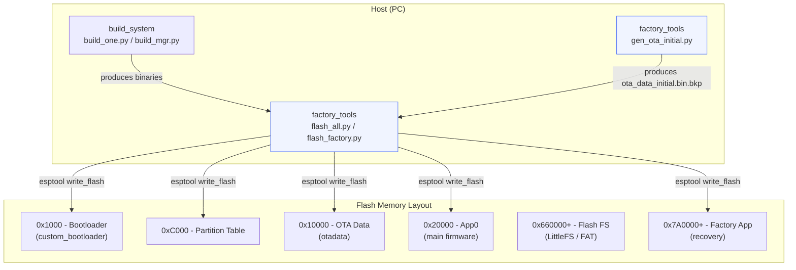
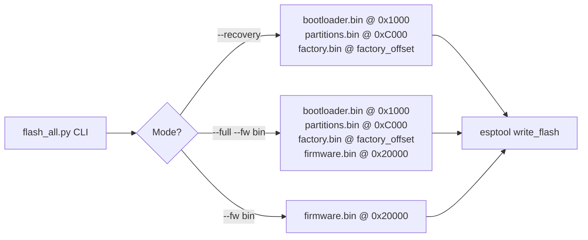
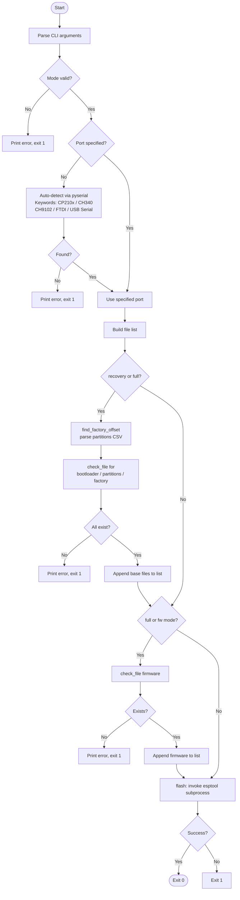
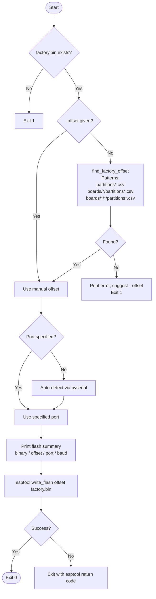
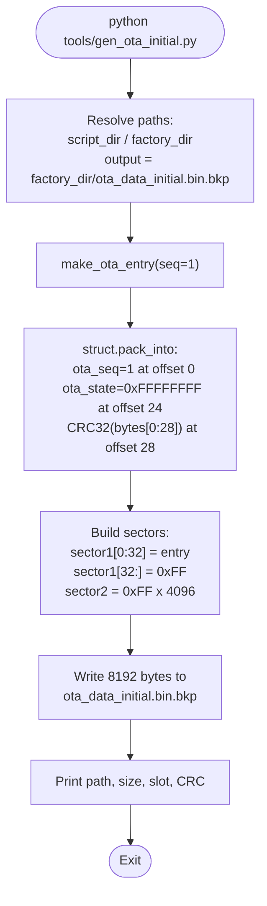
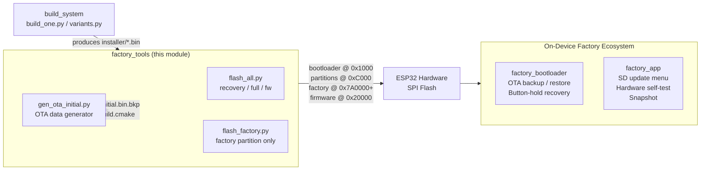

# Factory Tools

The **factory_tools** module is a collection of Python host-side scripts that sit inside each board's `Factory/tools/` directory. These scripts are the final step in the manufacturing and development workflow: they take the binary artefacts produced by the build system and push them onto the physical hardware over USB-serial using **esptool**.

The module contains two canonical scripts that every board shares, plus one board-specific generator:

| Script | Purpose |
|---|---|
| `flash_all.py` | Multi-mode flash utility — recovery, full, or firmware-only |
| `flash_factory.py` | Targeted flash of the factory (recovery) partition only |
| `gen_ota_initial.py` | Generates a valid `ota_data_initial.bin.bkp` (ESP32-S3-WROOM-CAM only) |

---

## Module Ecosystem

The factory_tools scripts operate within a three-layer factory ecosystem. Understanding this context is essential before using the tools.



- **[factory_bootloader](factory_bootloader.md)** — The custom bootloader binary (`bootloader.bin`) that `flash_all.py --recovery` flashes at `0x1000`. It contains OTA-data backup/restore logic and the button-hold-to-recover mechanism.
- **factory_app** — The factory application binary (`factory.bin`) flashed to the factory partition. It provides the on-device menu for SD-card updates, partition selection, and hardware self-test.
- **build_system** — Produces all `.bin` artefacts that land in each board's `Factory/installer/` directory before `flash_all.py` is invoked.

---

## Board Coverage

Every supported board has its own copy of the tools directory. The scripts are functionally identical across boards; board-specific differences (flash chip, partition layout) are handled automatically via the partition-table CSV parser and the `--chip` flag passed to esptool.

| Board directory | flash_all | flash_factory | gen_ota_initial |
|---|:---:|:---:|:---:|
| `boards/ESP32_S3_WROOM_CAM/Factory/tools/` | — | — | ✓ |
| `boards/esp32_2432s028r/Factory/tools/` | ✓ | ✓ | — |
| `boards/esp32_3248s035c/Factory/tools/` | ✓ | ✓ | — |
| `boards/esp32_3248s035r/Factory/tools/` | ✓ | ✓ | — |
| `boards/esp32s3_4827s043c/Factory/tools/` | ✓ | ✓ | — |
| `boards/esp32s3_8048_touch_lcd_7/Factory/tools/` | ✓ | ✓ | — |
| `boards/esp32s3_8048s043c/Factory/tools/` | ✓ | ✓ | — |
| `boards/esp32s3_8048s050c/Factory/tools/` | ✓ | ✓ | — |
| `boards/esp32s3_8048s070c/Factory/tools/` | ✓ | ✓ | — |
| `boards/esp32s3_bzm_tft35_gt911/Factory/tools/` | ✓ | ✓ | — |
| `boards/esp32s3_hmi43v3/Factory/tools/` | ✓ | ✓ | — |
| `boards/esp32s3_zx3d50ce02s_usrc_4832/Factory/tools/` | ✓ | ✓ | — |
| `boards/pibot_pendant_v1_0/Factory/tools/` | ✓ | ✓ | — |

> **Note:** `ESP32_S3_WROOM_CAM` only ships `gen_ota_initial.py`; its flash operations are handled through the global `tools/flash_scripts/flash_mgr.py`.

---

## Flash Address Layout

All scripts must agree with the partition table. The fixed addresses are defined as constants at the top of each `flash_all.py`:

| Symbol | Address | Binary |
|---|---|---|
| `BOOTLOADER_OFFSET` | `0x1000` | `bootloader.bin` |
| `PARTITIONS_OFFSET` | `0xC000` | `partitions.bin` |
| OTA data | `0x10000` | `ota_data_initial.bin` |
| `APP0_OFFSET` | `0x20000` | main firmware |
| Factory offset | auto-detected | `factory.bin` — parsed from CSV, default `0x7A0000` |


---

## `flash_all.py` — Multi-Mode Flashing Utility

### Overview

`flash_all.py` is the primary production and development flash tool. It supports three mutually exclusive modes selected via a required command-line argument.

### Modes

| Mode | What is flashed | Typical use |
|---|---|---|
| `--recovery` | bootloader + partitions + factory | First-time board setup; restore recovery infrastructure |
| `--full --fw <bin>` | bootloader + partitions + factory + firmware | Complete factory programming of a new unit |
| `--fw <bin>` | firmware only at app0 | Development: fast iteration without touching recovery |



### Command-Line Reference

```
flash_all.py --recovery [--port PORT] [--baud RATE]
flash_all.py --full --fw FIRMWARE.bin [--port PORT] [--baud RATE]
flash_all.py --fw FIRMWARE.bin [--port PORT] [--baud RATE]
```

| Argument | Default | Description |
|---|---|---|
| `--recovery` | — | Flash bootloader + partitions + factory |
| `--full` | — | Flash everything (requires `--fw`) |
| `--fw FILE` / `--firmware FILE` | — | Flash firmware only to app0 |
| `--fw-file FILE` | — | Alternate firmware path for use with `--full` |
| `--port`, `-p` | auto-detect | Serial port (e.g., `/dev/ttyUSB0`, `COM3`) |
| `--baud` | `460800` | Baud rate for esptool |

### Execution Flow



### Port Auto-Detection

The script uses `serial.tools.list_ports` (pyserial) and matches USB-serial adapter descriptions against known ESP32 chip identifier strings:

```
CP210x  •  CH340  •  CH9102  •  FTDI  •  USB Serial  •  USB-SERIAL
```

If no keyword match is found, the first available COM port is used as a fallback. If no ports exist at all, the script exits and instructs the user to pass `--port` explicitly.

### Factory Offset Auto-Detection

`find_factory_offset()` searches for `partitions*.csv` files using these glob patterns:

```
partitions*.csv
boards/*/partitions*.csv
```

It reads each CSV line by line, looking for a row whose third column (subtype) equals `factory` (case-insensitive), then returns the fourth column (offset string). If no match is found in any CSV, the hard-coded default `0x7A0000` is returned — the standard factory offset for an 8 MB flash layout.

### Installer Directory Layout

The scripts expect this directory structure relative to the board's `Factory/` directory:

```
boards/<board>/Factory/
├── installer/
│   ├── bootloader.bin       ← Custom bootloader binary
│   ├── partitions.bin       ← Compiled partition table
│   └── factory.bin          ← Factory recovery app binary
└── tools/
    ├── flash_all.py
    └── flash_factory.py
```

---

## `flash_factory.py` — Factory Partition Flash Tool

### Overview

`flash_factory.py` is a focused, single-purpose tool for flashing only the factory (recovery) partition. It is useful when:

- The factory app needs to be updated without disturbing the bootloader or main firmware slot.
- During manufacturing QA, a defective recovery image must be replaced in isolation.

### Command-Line Reference

```
flash_factory.py [--port PORT] [--bin FILE] [--baud RATE] [--offset HEX]
```

| Argument | Default | Description |
|---|---|---|
| `--port`, `-p` | auto-detect | Serial port |
| `--bin`, `-b` | `installer/factory.bin` | Path to factory binary |
| `--baud` | `460800` | Baud rate |
| `--offset`, `-o` | auto-detect | Manual factory partition offset; overrides CSV lookup |

### Execution Flow



> `flash_factory.py` uses a wider CSV search pattern than `flash_all.py` — it adds a third depth level (`boards/*/*/partitions*.csv`) to accommodate boards that keep their partition table nested under a sub-directory.

---

## `gen_ota_initial.py` — OTA Data Generator

> **Board-specific:** This script is only present for `boards/ESP32_S3_WROOM_CAM/`. All other boards rely on the [factory_bootloader](factory_bootloader.md) to manage OTA data at boot time (backup, erase, and restore).

### Purpose

ESP-IDF's OTA system uses a special `otadata` partition (8 KB = two 4 KB sectors at `0x10000`) to track which application slot (`ota_0` / `ota_1`) should boot. A freshly erased partition is all `0xFF`, which ESP-IDF interprets as "no valid OTA entry — fall back to factory". To direct the device to boot `ota_0` (the main firmware slot) after initial programming, a valid entry must be pre-written.

`gen_ota_initial.py` generates `ota_data_initial.bin.bkp` containing exactly one valid OTA entry pointing to `ota_0`. The `postbuild.cmake` script copies this file into the installer package as `ota_data_initial_16MB.bin`, which is flashed at `0x10000`.

### OTA Entry Binary Format (`esp_ota_select_entry_t`, 32 bytes)

| Bytes | Field | Value | Meaning |
|---|---|---|---|
| 0–3 | `ota_seq` | `1` (uint32 LE) | Odd sequence → slot 0 = `ota_0` |
| 4–23 | `seq_label[20]` | `0xFF × 20` | Unused |
| 24–27 | `ota_state` | `0xFFFFFFFF` | `OTA_IMG_VALID` |
| 28–31 | `crc32` | computed | CRC32 (Ethernet poly `0xEDB88320`) over bytes 0–27 |

> **Layout note:** ESP-IDF 5.x places `ota_state` at offset 24, overlapping the field labelled `unused[4]` in older SDK documentation. The script comments reflect this discrepancy explicitly.

### OTA Slot Selection Rule

| `ota_seq` value | Selected slot |
|---|---|
| `1` (odd) | `ota_0` — app0 at `0x20000` |
| `2` (even) | `ota_1` |
| `0xFFFFFFFF` (erased) | Fall through to factory partition |

### Output File Structure

```
ota_data_initial.bin.bkp  (8192 bytes total)
├── Sector 1  (4096 bytes)
│   ├── Bytes  0–31    valid esp_ota_select_entry_t  (seq=1 → ota_0)
│   └── Bytes 32–4095  0xFF padding
└── Sector 2  (4096 bytes)
    └── Bytes 0–4095   0xFF  (no second entry required)
```

### Generation Flow



### CRC32 Implementation

The script implements the standard Ethernet CRC32 (polynomial `0xEDB88320`) inline, with no external dependencies beyond the Python standard library:

```python
def crc32(data: bytes) -> int:
    crc = 0xFFFFFFFF
    for byte in data:
        crc ^= byte
        for _ in range(8):
            if crc & 1:
                crc = (crc >> 1) ^ 0xEDB88320
            else:
                crc >>= 1
    return crc ^ 0xFFFFFFFF
```

### Usage

```bash
cd boards/ESP32_S3_WROOM_CAM/Factory
python tools/gen_ota_initial.py
# Generated: .../ota_data_initial.bin.bkp  (8192 bytes)
# Entry: seq=1 -> ota_0 (app0)
# CRC32: 0xXXXXXXXX
```

> This file must exist **before** running `idf.py build`. The `postbuild.cmake` hook fails if the file is absent.

---

## Dependencies

| Package | Role |
|---|---|
| `esptool` | Invoked as `python -m esptool` via `subprocess`. Must be installed in the active Python environment. |
| `pyserial` | `serial.tools.list_ports` for COM port auto-detection. |
| `argparse` | Standard library — CLI argument parsing. |
| `struct` | Standard library — binary packing (`gen_ota_initial.py` only). |
| `glob`, `csv`, `os`, `sys`, `subprocess` | Standard library — file discovery, process invocation. |

### Installation

```bash
pip install esptool pyserial
```

---

## Typical Workflows

### 1. First-Time Board Programming (Production)

```bash
cd boards/esp32s3_8048s043c/Factory
# Binaries must be in installer/ first (see build_system docs)
python tools/flash_all.py --full --fw ../../build/firmware.bin
```

### 2. Recovery Infrastructure Only

Use when the main firmware slot will be programmed separately (e.g., via OTA in the field):

```bash
python tools/flash_all.py --recovery
```

### 3. Development Firmware Iteration

Only update the application slot; leave the recovery infrastructure untouched:

```bash
python tools/flash_all.py --fw build/firmware.bin --port /dev/ttyUSB0
```

### 4. Re-Flash Factory App Only

```bash
python tools/flash_factory.py --bin installer/factory.bin --port COM5
```

### 5. Manual Offset Override

When working with a non-standard partition layout:

```bash
python tools/flash_factory.py --offset 0x780000 --port /dev/ttyUSB0
```

### 6. Generate OTA Data (ESP32-S3-WROOM-CAM Only)

```bash
cd boards/ESP32_S3_WROOM_CAM/Factory
python tools/gen_ota_initial.py   # must run before idf.py build
```

---

## Error Handling Reference

| Condition | Script behaviour |
|---|---|
| Binary file not found | Prints `Error: <name> not found at <path>` and exits 1 |
| No serial port detected | Prints detection error, directs user to `--port`; exits 1 |
| Factory offset not in any CSV | `flash_factory.py` exits 1 with `--offset` hint; `flash_all.py` falls back to default `0x7A0000` |
| `--full` without `--fw` | Argument parser catches this immediately and exits 2 |
| `esptool` not installed | `FileNotFoundError` caught; prints `pip install esptool` hint; exits 1 |
| esptool write failure | `CalledProcessError` caught; exits with esptool's return code |

---

## Relationship to Other Factory Modules



| Related module | Documentation |
|---|---|
| Custom bootloader (OTA backup, button-hold recovery) | [factory_bootloader.md](factory_bootloader.md) |
| Factory application (on-device menu, GFX, SD update) | factory_app.md |


## Documents de conception (depot)

- [factory_app_technical_doc.md](https://github.com/luc-github/Pibot-cnc-pendant-firmware/blob/main/docs/Factory/factory_app_technical_doc.md)
