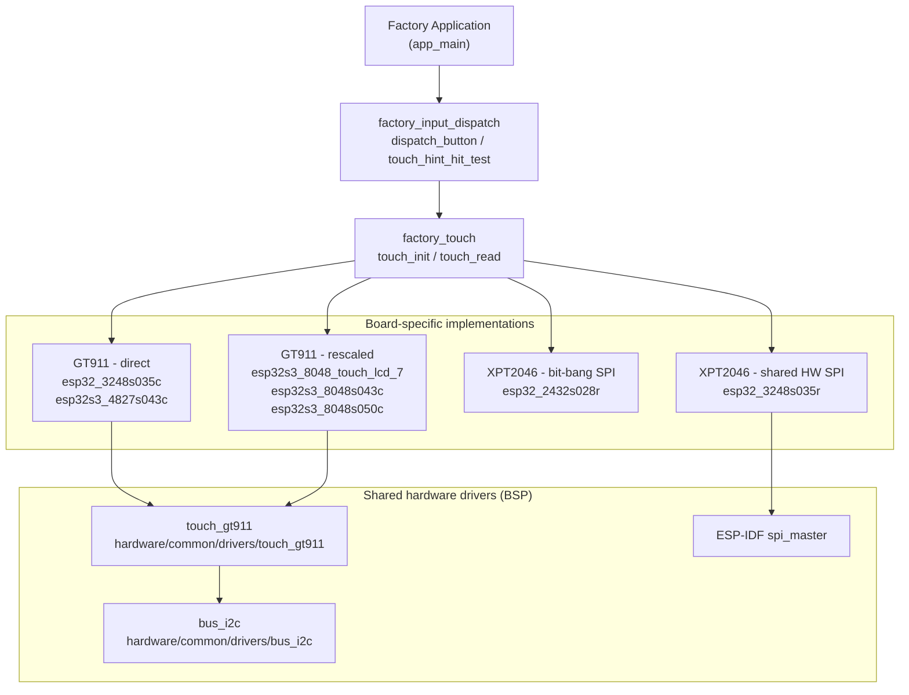
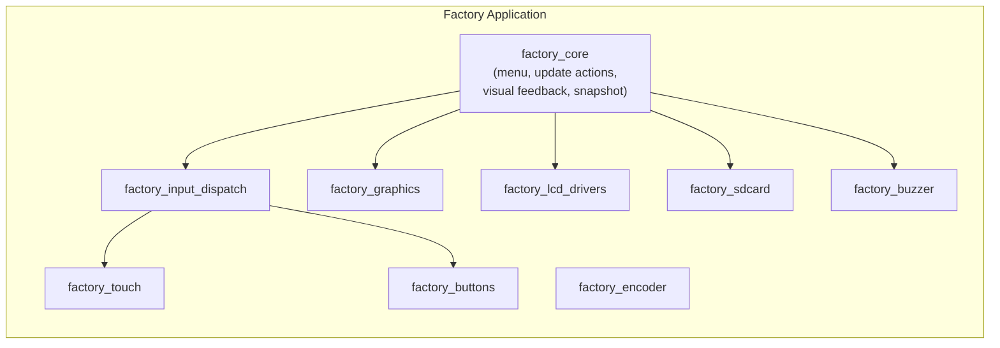
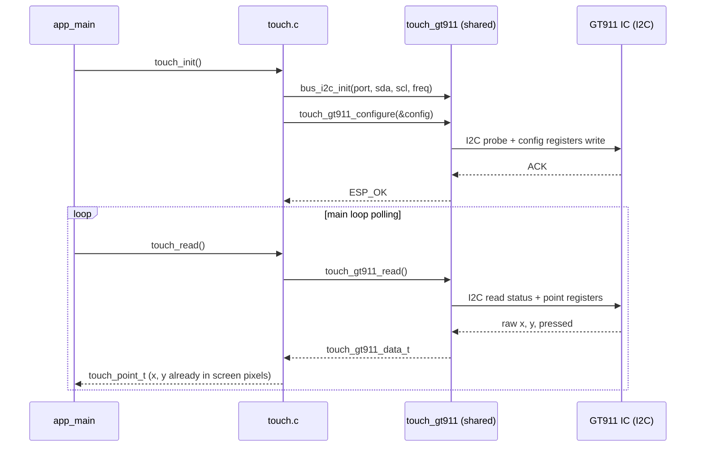
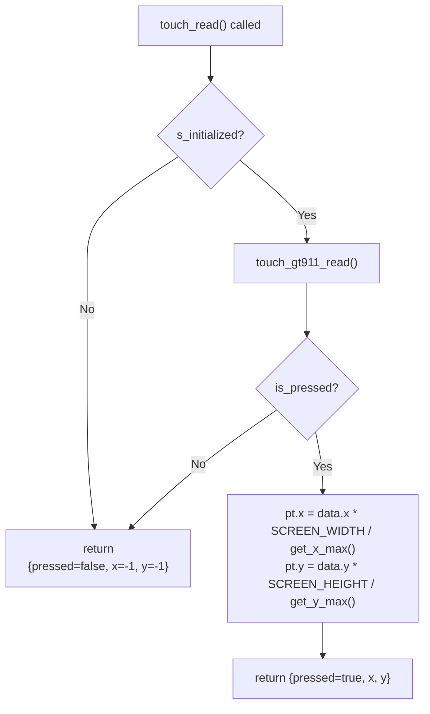
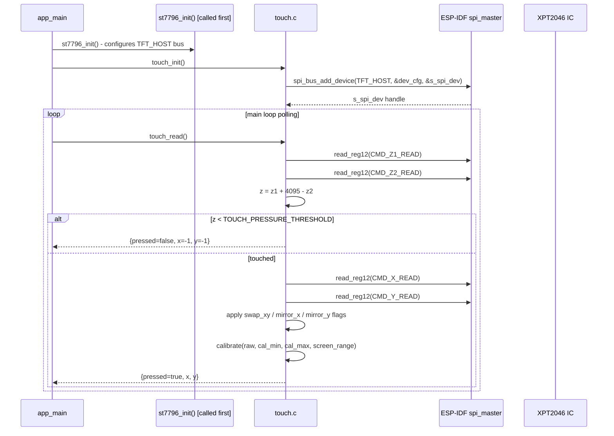
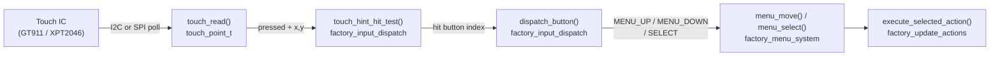

# Factory Touch Module

The `factory_touch` module provides **minimal, polling-based touch input** for the Factory Application. It exposes a single unified API (`touch_init` / `touch_read`) that returns calibrated screen-pixel coordinates, hiding all hardware differences behind a board-specific `.c` implementation. There are no FreeRTOS tasks, no interrupts, and no LVGL dependency — the factory app polls touch directly from its main loop via [`factory_input_dispatch`](factory_input_dispatch.md).

This is deliberately separate from the main pendant firmware's BSP touch stack (see [`bsp_touch_controllers`](bsp_touch_controllers.md)): the factory app is a standalone ESP-IDF application flashed to its own OTA partition and must boot even if the main firmware partition is corrupt or absent.

---

## Architecture Overview



---

## Module Position in the Factory Application

`factory_touch` is one of several hardware-driver sub-modules assembled by [`factory_app`](factory_app.md). It is consumed exclusively by [`factory_input_dispatch`](factory_input_dispatch.md), which maps touch coordinates to on-screen button hit regions and dispatches menu events to [`factory_core`](factory_core.md).



---

## Public API

Every board variant exposes an identical C interface via its `touch.h` / `touch.c` pair.

### `touch_point_t`

```c
typedef struct {
    bool    pressed;   // true when a touch is actively detected
    int16_t x;         // screen X coordinate in pixels, or -1 if not pressed
    int16_t y;         // screen Y coordinate in pixels, or -1 if not pressed
} touch_point_t;
```

All coordinates are already mapped to final screen-pixel space (origin top-left, increasing right and down). No further scaling is required by callers.

### `touch_init(void)`

Initialises the hardware for the touch controller on the current board. Must be called once during `app_main`, typically after the LCD driver is initialised (mandatory on boards where touch shares the display SPI bus).

- On failure (e.g. I2C bus error, SPI device registration error) the function returns silently and sets an internal `s_initialized = false` flag. Subsequent `touch_read()` calls return `{ .pressed = false, .x = -1, .y = -1 }`.
- On GT911 boards the function also initialises the I2C bus via `bus_i2c_init()`.

### `touch_read(void) → touch_point_t`

Polls the touch controller and returns the current touch state.

| Return field | Not pressed | Pressed |
|---|---|---|
| `pressed` | `false` | `true` |
| `x` | `-1` | pixel column [0, SCREEN_WIDTH − 1] |
| `y` | `-1` | pixel row [0, SCREEN_HEIGHT − 1] |

The function is **non-blocking** and **safe to call from the main loop at any rate**. It performs a synchronous hardware transaction on every call (no caching).

---

## Board-to-Implementation Matrix

| Board | Controller | Bus | Coordinate Strategy |
|---|---|---|---|
| `esp32_2432s028r` | XPT2046 | Bit-banged SPI (dedicated) | Calibration handled inside `touch.c` |
| `esp32_3248s035c` | GT911 | I2C | Driver-internal (auto-detected x/y max, no rescale needed) |
| `esp32_3248s035r` | XPT2046 | Shared hardware SPI (with ST7796) | Linear calibration via `TOUCH_CALIBRATION_X/Y_MIN/MAX` + pressure threshold |
| `esp32s3_4827s043c` | GT911 | I2C | Driver-internal (auto-detected x/y max, no rescale needed) |
| `esp32s3_8048_touch_lcd_7` | GT911 | I2C | Rescaled: `raw * SCREEN_W / touch_gt911_get_x_max()` |
| `esp32s3_8048s043c` | GT911 | I2C | Rescaled: `raw * SCREEN_W / touch_gt911_get_x_max()` |
| `esp32s3_8048s050c` | GT911 | I2C | Rescaled: `raw * SCREEN_H / touch_gt911_get_y_max()` |

> **Additional boards** (`esp32s3_8048s070c`, `esp32s3_bzm_tft35_gt911`, `esp32s3_hmi43v3`, `esp32s3_zx3d50ce02s_usrc_4832`, `pibot_pendant_v1_0`) follow the same pattern and are grouped under [`factory_hardware_drivers`](factory_app.md) in the module tree.

---

## Implementation Variants

### Variant A — GT911 / I2C, Direct Pass-Through

**Boards:** `esp32_3248s035c`, `esp32s3_4827s043c`



The GT911 driver applies `swap_xy`, `invert_x`, and `invert_y` flags internally (sourced from `hw_config.h`). Reported coordinates match the panel's native resolution, so no post-processing is needed.

The `touch_gt911_config_t` used at init time:

```c
static const touch_gt911_config_t config = {
    .i2c_addr      = TOUCH_I2C_ADDR_LIST,
    .i2c_port      = TOUCH_I2C_PORT_IDX,
    .i2c_clk_speed = TOUCH_I2C_FREQ_HZ,
    .rst_pin       = TOUCH_RST_PIN,
    .int_pin       = TOUCH_IRQ_PIN,
    .swap_xy       = TOUCH_SWAP_XY_FLAG,
    .invert_x      = TOUCH_MIRROR_X_FLAG,
    .invert_y      = TOUCH_MIRROR_Y_FLAG,
    .x_max         = 0,  // auto-detected from device registers
    .y_max         = 0,  // auto-detected from device registers
};
```

---

### Variant B — GT911 / I2C, Rescaled Coordinates

**Boards:** `esp32s3_8048_touch_lcd_7`, `esp32s3_8048s043c`, `esp32s3_8048s050c`

Identical initialisation to Variant A. The difference is in `touch_read()`:

```c
// GT911 config registers report ~468x253 for an 800x480 physical panel.
// Rescale to actual SCREEN_WIDTH / SCREEN_HEIGHT at read time.
pt.x = (int)data.x * SCREEN_WIDTH  / touch_gt911_get_x_max();
pt.y = (int)data.y * SCREEN_HEIGHT / touch_gt911_get_y_max();
```



> **Why rescaling is needed:** The GT911 stores its own maximum resolution in on-chip config registers. On these panels the programmed value (~468 / ~253) does not match the physical RGB panel resolution (800 × 480). `touch_gt911_get_x_max()` / `get_y_max()` read back what the IC actually reports, so the rescale is always accurate regardless of the config value.

---

### Variant C — XPT2046 / Shared Hardware SPI

**Board:** `esp32_3248s035r`

The XPT2046 is added as a second SPI device on the same `TFT_HOST` bus used by the ST7796 LCD. `touch_init()` must therefore be called **after** `st7796_init()` has already configured the bus.



#### XPT2046 Raw Read Protocol (`read_reg12`)

Each SPI transaction is a 3-byte full-duplex exchange. The 12-bit ADC result occupies the upper bits of the 16-bit response:

```
TX: [ CMD ][ 0x00 ][ 0x00 ]
RX: [ --- ][ MSB  ][ LSB  ]
result = (MSB << 8 | LSB) >> 3   // 12-bit ADC value [0..4095]
```

XPT2046 command bytes used:

| Constant | Value | Measures |
|---|---|---|
| `CMD_X_READ` | `0xD0` | X position |
| `CMD_Y_READ` | `0x90` | Y position |
| `CMD_Z1_READ` | `0xB0` | Pressure Z1 |
| `CMD_Z2_READ` | `0xC0` | Pressure Z2 |

#### Pressure Detection

```c
int16_t z = z1 + 4095 - z2;
if (z < TOUCH_PRESSURE_THRESHOLD) { return; }  // TOUCH_PRESSURE_THRESHOLD = 300
```

This is not the XPT2046 datasheet's impedance formula but is reliable in practice for discriminating a real press from panel noise.

#### Linear Calibration (`calibrate`)

```c
static int16_t calibrate(int16_t raw, int16_t cal_min, int16_t cal_max, int16_t range)
{
    int32_t clamped = (raw > cal_min) ? (raw - cal_min) : 0;
    return (int16_t)(clamped * range / (cal_max - cal_min));
}
```

`TOUCH_CALIBRATION_X_MIN`, `TOUCH_CALIBRATION_X_MAX`, `TOUCH_CALIBRATION_Y_MIN`, `TOUCH_CALIBRATION_Y_MAX` are defined in each board's `hw_config.h`.

#### Axis Transform Order

Applied after raw reads, before calibration:

```
1. TOUCH_SWAP_XY_FLAG  → swap raw_x ↔ raw_y
2. TOUCH_MIRROR_X_FLAG → raw_x = 4095 - raw_x
3. TOUCH_MIRROR_Y_FLAG → raw_y = 4095 - raw_y
4. calibrate() to pixel coordinates
```

---

### Variant D — XPT2046 / Bit-Banged SPI

**Board:** `esp32_2432s028r`

Uses a dedicated GPIO bit-banged SPI bus (independent from the display bus). Pin assignments and calibration constants are in `hw_config.h`. The structure is equivalent to Variant C without the `spi_bus_add_device` step. See the shared driver reference at [`bsp_touch_controllers`](bsp_touch_controllers.md) → `touch_xpt2046`.

---

## Data Flow: Touch to Factory Menu



`touch_hint_hit_test()` compares the `(x, y)` coordinate against the on-screen button hint rectangles rendered by [`factory_graphics`](factory_graphics.md) (`draw_button_hint_at`). When a hit is found, `dispatch_button()` fires the same code path as a physical button press from [`factory_buttons`](factory_buttons.md).

---

## Initialization Guard Pattern

All implementations use the same guard idiom to make `touch_read()` safe before `touch_init()` succeeds:

```c
static bool s_initialized = false;

void touch_init(void) {
    // ... hardware setup ...
    if (error) { return; }   // s_initialized stays false
    s_initialized = true;
}

touch_point_t touch_read(void) {
    touch_point_t pt = { .pressed = false, .x = -1, .y = -1 };
    if (!s_initialized) {
        return pt;
    }
    // ... hardware poll ...
}
```

This means the factory menu continues to operate via physical buttons even if the touch controller fails to initialise.

---

## Dependencies

| Dependency | Type | Used by variants |
|---|---|---|
| `touch_gt911` (`hardware/common/drivers/touch_gt911`) | Shared BSP driver | A, B |
| `bus_i2c` (`hardware/common/drivers/bus_i2c`) | Shared BSP driver | A, B |
| `ESP-IDF spi_master` | ESP-IDF component | C, D |
| `hw_config.h` | Board-local header (pin/cal constants) | All |
| `factory_log.h` | Factory logging macro | All |

For the full shared driver API, see [`bsp_touch_controllers`](bsp_touch_controllers.md) and [`bsp_bus_drivers`](bsp_bus_drivers.md).

---

## File Layout

```
boards/
├── esp32_2432s028r/Factory/main/
│   └── touch.h                     # touch_point_t; XPT2046 bit-banged SPI
├── esp32_3248s035c/Factory/main/
│   ├── touch.h                     # touch_point_t; GT911 I2C
│   └── touch.c                     # Variant A — GT911 direct pass-through
├── esp32_3248s035r/Factory/main/
│   ├── touch.h                     # touch_point_t; XPT2046 shared HW SPI
│   └── touch.c                     # Variant C — XPT2046 shared SPI + calibration
├── esp32s3_4827s043c/Factory/main/
│   ├── touch.h                     # touch_point_t; GT911 I2C
│   └── touch.c                     # Variant A — GT911 direct pass-through
├── esp32s3_8048_touch_lcd_7/Factory/main/
│   ├── touch.h                     # touch_point_t; GT911 I2C
│   └── touch.c                     # Variant B — GT911 rescaled
├── esp32s3_8048s043c/Factory/main/
│   ├── touch.h                     # touch_point_t; GT911 I2C
│   └── touch.c                     # Variant B — GT911 rescaled
└── esp32s3_8048s050c/Factory/main/
    ├── touch.h                     # touch_point_t; GT911 I2C
    └── touch.c                     # Variant B — GT911 rescaled
```

---

## Related Modules

| Module | Relationship |
|---|---|
| [`factory_app`](factory_app.md) | Parent — assembles all factory hardware sub-modules |
| [`factory_input_dispatch`](factory_input_dispatch.md) | Consumer — calls `touch_read()` and maps coordinates to menu events |
| [`factory_buttons`](factory_buttons.md) | Sibling input source — physical GPIO buttons, same dispatch path |
| [`factory_encoder`](factory_encoder.md) | Sibling input source — rotary encoder for menu navigation |
| [`factory_lcd_drivers`](factory_lcd_drivers.md) | Must be initialised first on shared-SPI boards (`esp32_3248s035r`) |
| [`factory_graphics`](factory_graphics.md) | Renders button hint zones whose coordinates `touch_hint_hit_test()` checks |
| [`bsp_touch_controllers`](bsp_touch_controllers.md) | Provides the shared `touch_gt911` and `touch_xpt2046` hardware drivers |
| [`bsp_bus_drivers`](bsp_bus_drivers.md) | Provides `bus_i2c_init()` used by GT911 variants |
