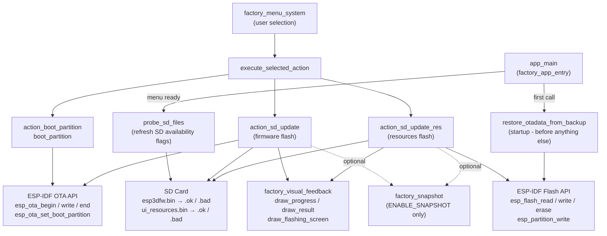
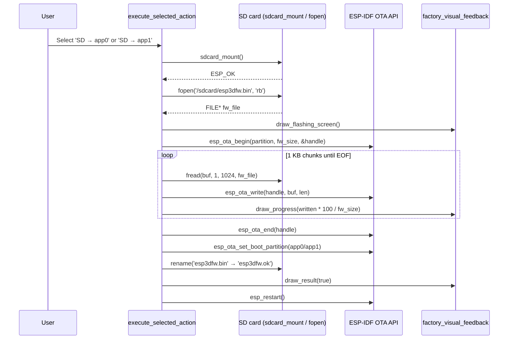
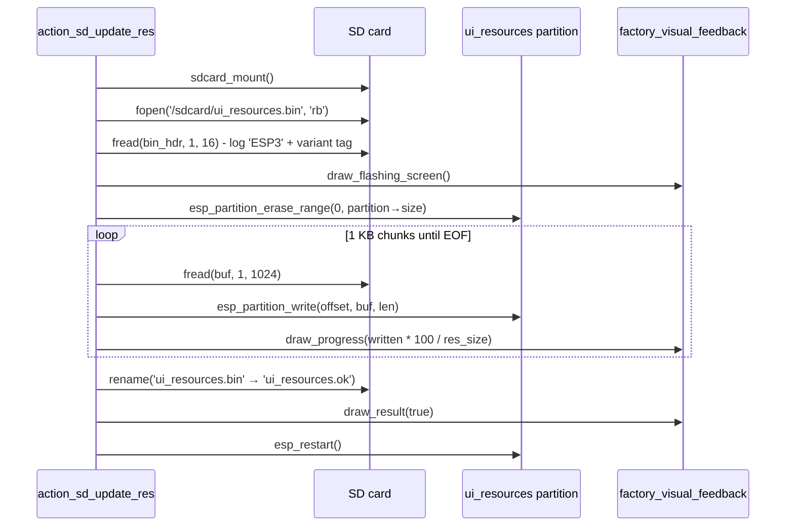
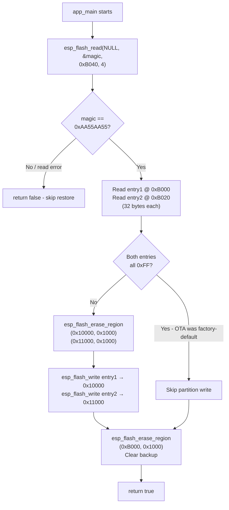

# Factory Update Actions

## Overview

The `factory_update_actions` module implements the **recovery and update operations** executed by the factory partition application. It is the operational core of the recovery menu: it flashes new firmware or UI resources from an SD card, switches between OTA application partitions, and restores the OTA data sector so that a power-cycle from inside the recovery environment always resumes the correct application slot.

This module runs on every supported board variant. The logic is **identical across all boards**; only display driver includes and layout scaling constants (`FONT_WIDTH`, `BTN_CIRCLE_R`, `SCREEN_WIDTH`) differ between implementations. Each board hosts its own copy inside `boards/<board>/Factory/main/main.c`.

### Position in the Factory Application

The factory application is a standalone ESP-IDF application stored in a dedicated `factory` flash partition, entirely separate from the main firmware and independent of LVGL. The module hierarchy inside the factory app is:

```
Factory_Application_&_Bootloader
└── factory_app / factory_app_core
    ├── factory_app_entry        – app_main, hardware init
    ├── factory_menu_system      – menu rendering, navigation
    ├── factory_update_actions   ← THIS MODULE
    ├── factory_visual_feedback  – draw_progress, draw_result, draw_flashing_screen
    ├── factory_snapshot         – GPIO0 screen-capture helper (optional)
    └── factory_input_dispatch   – dispatch_button, touch_hint_hit_test
```

---

## Architecture



---

## Sub-modules

The module is divided into three functional areas, each documented in full detail separately.

### 1. [OTA Data Backup & Restore](factory_update_actions_otadata.md)

Implements **`restore_otadata_from_backup`**. Called once at startup — before display, SD, or menu initialization — it reads a backup copy of the ESP32 OTA data sector from a reserved pre-partition-table flash address (`0xB000`), validates it with a 32-bit magic number (`0xAA55AA55`), and writes it back to the real OTA data location (`0x10000`/`0x11000`). This ensures that power-cycling from within the recovery environment resumes the correct main application slot without user intervention.

Key highlights:
- The backup is **written by the main firmware** (in `esp444.cpp`) before it switches the boot partition to `factory`.
- Requires `CONFIG_SPI_FLASH_DANGEROUS_WRITE_ALLOWED=y` because `0xB000` is below the first partition table entry.
- After a successful restore, the backup sector is immediately erased to prevent repeated restores on subsequent boots.
- Returns `false` (no-op) when no valid backup is present — normal cold boots skip silently.

### 2. [SD Card Flash Operations](factory_update_actions_sd_flash.md)

Implements **`probe_sd_files`**, **`action_sd_update`**, and **`action_sd_update_res`**.

- **`probe_sd_files`** — Mounts the SD card and checks for `esp3dfw.bin` and `ui_resources.bin`. Sets `sd_has_fw` and `sd_has_res` boolean flags that the menu uses to show/hide SD-availability indicators. Called on startup and after returning from any failed update.

- **`action_sd_update(target_label)`** — Full OTA firmware flash: opens `esp3dfw.bin`, validates the file size against the target partition, calls `esp_ota_begin` → loops `esp_ota_write` in 1 KB chunks (updating `draw_progress` each iteration) → calls `esp_ota_end`, sets the boot partition, renames the file to `esp3dfw.ok`, and restarts. On any failure, aborts via `esp_ota_abort` and renames to `esp3dfw.bad`.

- **`action_sd_update_res`** — Resources partition flash: opens `ui_resources.bin`, reads its 16-byte build header (`"ESP3"` + 12-char variant string) for variant mismatch logging, erases the entire `ui_resources` data partition, then writes in 1 KB chunks via `esp_partition_write`. On success renames to `ui_resources.ok` and restarts; on failure renames to `ui_resources.bad`.

### 3. [Boot Partition & Action Dispatch](factory_update_actions_dispatch.md)

Implements **`boot_partition`**, **`action_boot_partition`**, and **`execute_selected_action`**.

- **`boot_partition(label)`** — Low-level helper: locates a partition by label with `esp_partition_find_first`, calls `esp_ota_set_boot_partition`, then `esp_restart`.

- **`action_boot_partition(label)`** — UI wrapper: shows a status line (e.g. "Booting app0…"), calls `boot_partition`, and shows an error via `show_status` if the partition was not found.

- **`execute_selected_action`** — The central dispatch switch: reads the selected menu item's `menu_action_t` value and routes to the correct action function.

---

## `menu_action_t` Enum

```c
typedef enum {
    MENU_ACTION_BOOT_APP0,         // Switch boot partition → app0, restart
    MENU_ACTION_BOOT_APP1,         // Switch boot partition → app1, restart
    MENU_ACTION_SD_UPDATE_APP0,    // Flash esp3dfw.bin → app0, restart
    MENU_ACTION_SD_UPDATE_APP1,    // Flash esp3dfw.bin → app1, restart
    MENU_ACTION_SD_UPDATE_RES,     // Flash ui_resources.bin → ui_resources partition, restart
} menu_action_t;
```

`MENU_ACTION_BOOT_APP1` and `MENU_ACTION_SD_UPDATE_APP1` are only shown when the `app1` partition is detected at runtime by `esp_partition_find_first`.

---

## Key Constants

| Constant | Value | Purpose |
|---|---|---|
| `OTADATA_OFFSET` | `0x10000` | Real OTA data sector address |
| `OTADATA_SECTOR_SIZE` | `0x1000` (4 KB) | Flash erase unit |
| `OTADATA_ENTRY_SIZE` | `32` bytes | Size of one OTA data entry |
| `OTADATA_BACKUP_OFFSET` | `0xB000` | Pre-partition-table backup address |
| `BACKUP_MAGIC_OFFSET` | `0x40` | Offset within backup sector for the magic word |
| `BACKUP_MAGIC` | `0xAA55AA55` | Validates that a real backup exists |
| `FW_FILENAME` | `/sdcard/esp3dfw.bin` | Firmware binary on SD |
| `FW_OK_FILENAME` | `/sdcard/esp3dfw.ok` | Rename target on success |
| `FW_BAD_FILENAME` | `/sdcard/esp3dfw.bad` | Rename target on failure |
| `RES_FILENAME` | `/sdcard/ui_resources.bin` | Resources binary on SD |
| `RES_OK_FILENAME` | `/sdcard/ui_resources.ok` | Rename target on success |
| `RES_BAD_FILENAME` | `/sdcard/ui_resources.bad` | Rename target on failure |

> ⚠️ `OTADATA_BACKUP_OFFSET` must exactly match the value used in the main firmware (`esp444.cpp`). A mismatch silently prevents restore from working.

### Required sdkconfig Entry

```
CONFIG_SPI_FLASH_DANGEROUS_WRITE_ALLOWED=y
```

The factory app intentionally writes to flash addresses below the partition table (`0xB000`). This flag is mandatory for the OTA data restore to function.

---

## Update Flow Diagrams

### Firmware Flash (`action_sd_update`)



### Resources Flash (`action_sd_update_res`)



### OTA Data Restore (`restore_otadata_from_backup`)



---

## Board Variants

All supported boards share identical update logic. Differences are limited to the display driver include and one IO expander initialization call for SD card chip-select:

| Board | LCD Driver | SD CS | Notes |
|---|---|---|---|
| `esp32_2432s028r` | ILI9341 | GPIO | Core functions present; `app1`-slot items hidden (single-slot) |
| `esp32_3248s035c` | ST7796 | GPIO | Full module |
| `esp32_3248s035r` | ST7796 | GPIO | Full module |
| `esp32s3_4827s043c` | ILI9485 | GPIO | Full module |
| `esp32s3_8048_touch_lcd_7` | ST7262 (RGB) | CH422G EXIO3 | CH422G I²C IO expander init required before any SD access |
| `esp32s3_8048s043c` | ST7262 (RGB) | GPIO | Full module |
| `esp32s3_8048s050c` | ST7262 (RGB) | GPIO | Full module |
| `esp32s3_bzm_tft35_gt911` | ST7796 | GPIO | Full module |
| `esp32s3_hmi43v3` | RM68120 (i80) | GPIO | Full module |
| `esp32s3_zx3d50ce02s_usrc_4832` | ST7796 i80 | GPIO | Full module |
| `pibot_pendant_v1_0` | ILI9341 | GPIO | Full module + custom bootloader hook |

---

## Related Documentation

| Document | Relationship |
|---|---|
| [factory_update_actions_otadata.md](factory_update_actions_otadata.md) | Sub-module: OTA data backup and restore |
| [factory_update_actions_sd_flash.md](factory_update_actions_sd_flash.md) | Sub-module: SD card firmware and resources flash operations |
| [factory_update_actions_dispatch.md](factory_update_actions_dispatch.md) | Sub-module: boot partition management and action dispatch |
