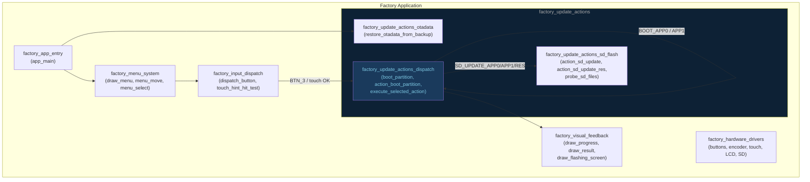
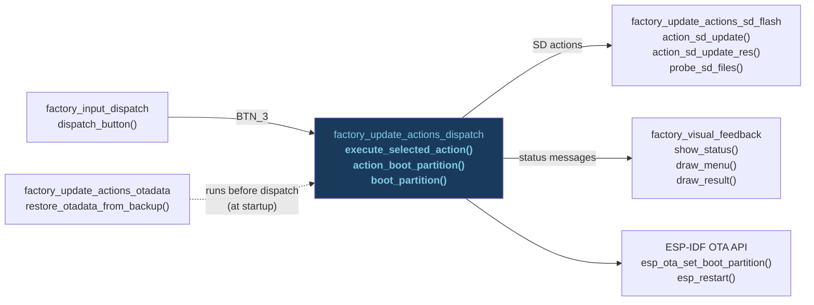
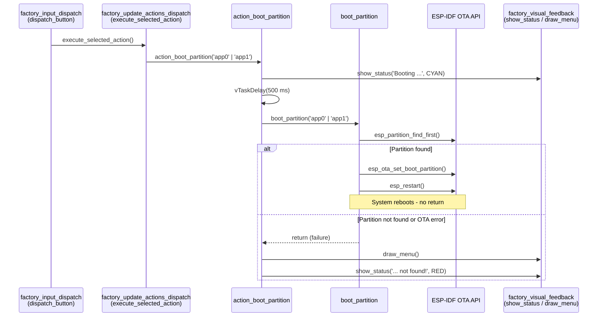
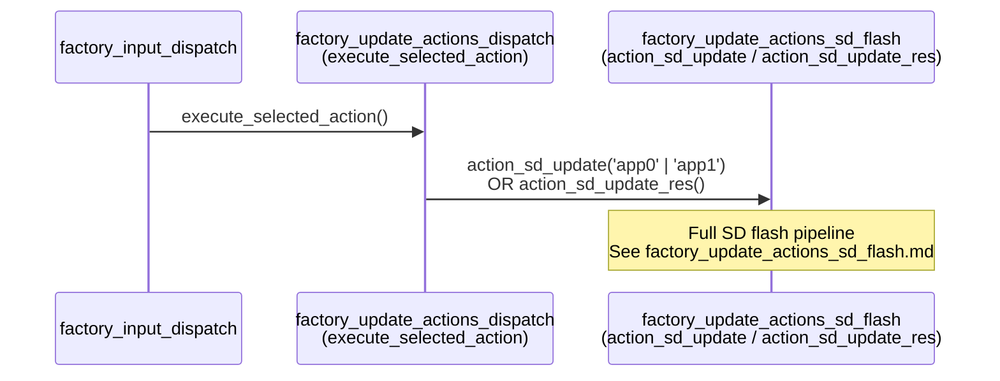
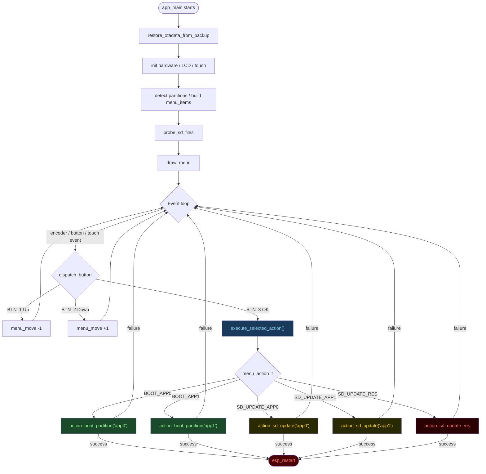

# Factory Update Actions Dispatch

## Introduction

The `factory_update_actions_dispatch` module is the **central action router** inside
the factory recovery application. It sits at the junction between the menu/input
system and the concrete update operations, translating a user's menu selection into
a concrete action — either switching the active OTA boot partition or delegating
to the SD-card flash pipeline.

It owns three focused responsibilities:

| Responsibility | Functions |
|---|---|
| Low-level OTA partition switch | `boot_partition()` |
| UI-aware boot action with user feedback | `action_boot_partition()` |
| Menu-action dispatch switch | `execute_selected_action()` |

The module is present identically across every board variant:
`esp32_2432s028r`, `esp32_3248s035c/r`, `esp32s3_4827s043c`,
`esp32s3_8048_touch_lcd_7`, `esp32s3_8048s043c/050c/070c`,
`esp32s3_bzm_tft35_gt911`, `esp32s3_hmi43v3`, `esp32s3_zx3d50ce02s_usrc_4832`,
and `pibot_pendant_v1_0`.

---

## Architecture Overview

### Position in the Factory Application



### Relationship to Sibling Modules



---

## Components

### `boot_partition(label)` — Low-Level OTA Partition Switch

**Signature:** `static void boot_partition(const char *label)`

The primitive that sets the next boot target and immediately reboots. It is a
**one-way door**: on success it calls `esp_restart()` and never returns. On
failure (partition not found, OTA API error) it logs the error and returns to
the caller so the UI can display a failure message.

```c
static void boot_partition(const char *label)
{
    const esp_partition_t *part = esp_partition_find_first(
        ESP_PARTITION_TYPE_APP, ESP_PARTITION_SUBTYPE_ANY, label);

    if (!part) {
        ESP_LOGE(TAG, "Partition '%s' not found", label);
        return;
    }

    esp_err_t err = esp_ota_set_boot_partition(part);
    if (err != ESP_OK) {
        ESP_LOGE(TAG, "Failed to set boot partition: %s", esp_err_to_name(err));
        return;
    }

    FACTORY_LOGD(TAG, "Boot partition set to '%s', rebooting...", label);
    esp_restart();
}
```

**Precondition:** The otadata sector must have been restored by
`restore_otadata_from_backup()` (see [factory_update_actions_otadata.md](factory_update_actions_otadata.md))
before this function is called. Without a valid otadata, `esp_ota_set_boot_partition()`
may silently mark the wrong slot or corrupt the boot chain.

**Partition labels used:**

| Label | Slot | Availability |
|---|---|---|
| `"app0"` | Primary OTA slot | Always present |
| `"app1"` | Secondary OTA slot | 8 MB boards only |

---

### `action_boot_partition(label)` — UI-Aware Boot Wrapper

**Signature:** `static void action_boot_partition(const char *label)`

Wraps `boot_partition()` with user-visible feedback: displays a cyan status
message, waits 500 ms so the user can read it, then delegates to
`boot_partition()`. If the call returns (failure path), the menu is redrawn
and a red error message is shown.

```
show_status("Booting <label>...", CYAN)
       │
  vTaskDelay(500 ms)
       │
  boot_partition(label)
       │
  success ──→ [esp_restart — never returns]
  failure ──→ draw_menu() → show_status("<label> not found!", RED)
```

This is the only boot action exposed to `execute_selected_action()`; the bare
`boot_partition()` primitive is never called directly from the dispatch layer.

---

### `execute_selected_action()` — Central Dispatch Switch

**Signature:** `static void execute_selected_action(void)`

Reads `menu_items[menu_selected].action` (a `menu_action_t` enum value built
at startup by `app_main`) and routes to the correct handler.

```c
static void execute_selected_action(void)
{
    switch (menu_items[menu_selected].action) {
        case MENU_ACTION_BOOT_APP0:      action_boot_partition("app0"); break;
        case MENU_ACTION_BOOT_APP1:      action_boot_partition("app1"); break;
        case MENU_ACTION_SD_UPDATE_APP0: action_sd_update("app0");      break;
        case MENU_ACTION_SD_UPDATE_APP1: action_sd_update("app1");      break;
        case MENU_ACTION_SD_UPDATE_RES:  action_sd_update_res();        break;
    }
}
```

`action_sd_update()` and `action_sd_update_res()` are defined in
[factory_update_actions_sd_flash.md](factory_update_actions_sd_flash.md).

#### `menu_action_t` Enum

Defined identically in every board's `main.c`:

| Value | Meaning | Handled by |
|---|---|---|
| `MENU_ACTION_BOOT_APP0` | Reboot into `app0` | `action_boot_partition("app0")` |
| `MENU_ACTION_BOOT_APP1` | Reboot into `app1` | `action_boot_partition("app1")` |
| `MENU_ACTION_SD_UPDATE_APP0` | Flash `esp3dfw.bin` → `app0` | `action_sd_update("app0")` |
| `MENU_ACTION_SD_UPDATE_APP1` | Flash `esp3dfw.bin` → `app1` | `action_sd_update("app1")` |
| `MENU_ACTION_SD_UPDATE_RES` | Flash `ui_resources.bin` → `ui_resources` partition | `action_sd_update_res()` |

Items for `app1` and the corresponding SD update are only added to `menu_items[]`
when an `app1` partition is detected at startup via `esp_partition_find_first()`.
On 4 MB boards the switch never reaches those two cases.

---

## Data Flow

### Boot Action Flow



### SD Update Action Flow



---

## Process Flow — Full Recovery Menu Lifecycle



---

## Board Variants

The dispatch logic and the `menu_action_t` enum are **identical** on every
supported board. Differences are board-specific and localised elsewhere:

| Aspect | What differs | Owned by |
|---|---|---|
| LCD driver | `st7796_init()` / `st7262_init()` / `ili9341_init()` | [factory_hardware_drivers](factory_app.md) |
| Touch hit-test column math | Wide-canvas boards use icon-centre midpoints instead of screen-thirds | [factory_input_dispatch](factory_input_dispatch.md) |
| Recovery trigger | Bootloader hook (pibot) vs software `[ESP444]FACTORY` command (all others) | [custom_bootloader](factory_app.md) |
| `app1` availability | Menu items conditionally added at startup based on partition probe | `factory_app_entry` (`app_main`) |

All boards apply the same `OTADATA_BACKUP_OFFSET = 0xB000` and
`BACKUP_MAGIC = 0xAA55AA55`. These values **must** match the main firmware's
`esp444.cpp` exactly.

---

## Dependencies

### Internal (same Factory Application)

| Module | Role |
|---|---|
| [factory_update_actions_otadata](factory_update_actions_otadata.md) | Restores otadata before any boot action runs |
| [factory_update_actions_sd_flash](factory_update_actions_sd_flash.md) | Implements `action_sd_update()` and `action_sd_update_res()` — the full SD flash pipeline |
| [factory_input_dispatch](factory_input_dispatch.md) | Calls `execute_selected_action()` when BTN_3 / touch-OK fires |
| [factory_menu_system](factory_menu_system.md) | Provides `menu_items[]`, `menu_selected`, `draw_menu()`, `show_status()`, `clear_status()` |
| [factory_visual_feedback](factory_visual_feedback.md) | `draw_flashing_screen()`, `draw_progress()`, `draw_result()` used by SD flash actions |

### External (ESP-IDF)

| API | Purpose |
|---|---|
| `esp_partition_find_first()` | Locate an OTA partition by label |
| `esp_ota_set_boot_partition()` | Write the next-boot target into otadata |
| `esp_restart()` | Trigger an immediate system reboot |
| `esp_ota_get_boot_partition()` | Query the currently active OTA slot (used by `get_active_ota_label()` for the menu header) |

---

## Key Design Decisions

**`boot_partition()` is a one-way door by design.**
On success it reboots immediately. The UI-aware wrapper `action_boot_partition()`
handles the failure path so that `boot_partition()` stays minimal and free of UI
concerns. Any caller that needs fallback behaviour must check whether `boot_partition()`
returned.

**`execute_selected_action()` owns no state.**
It only reads `menu_items[menu_selected].action` and dispatches. All SD-flash
state (file handles, OTA handles, byte counters, progress) lives inside
`factory_update_actions_sd_flash`. All menu cursor state lives inside
`factory_menu_system`. This keeps the dispatch layer thin and easy to verify.

**`app1` items are omitted at runtime, not at compile time.**
The `has_app1` flag is set by probing the partition table at startup. A single
firmware binary works correctly on both 4 MB (app0-only) and 8 MB (app0 + app1)
flash variants without needing separate builds or `#ifdef` guards in the dispatch
switch.

**Otadata must be restored before this module runs.**
`restore_otadata_from_backup()` is called as the very first statement in
`app_main`, before hardware init. If this step is skipped, `esp_ota_set_boot_partition()`
would write into a stale or erased otadata sector, leaving the device unable to
boot correctly after recovery completes.

**`CONFIG_SPI_FLASH_DANGEROUS_WRITE_ALLOWED=y` is required in the factory sdkconfig.**
The otadata backup at `0xB000` lies below the first partition. ESP-IDF aborts
flash writes to that range by default (`CONFIG_SPI_FLASH_DANGEROUS_WRITE_ABORTS`).
Dangerous writes are enabled intentionally — the factory application is a
privileged recovery tool with direct flash access, not a normal user-space app.

---

## Related Documentation

- [factory_update_actions.md](factory_update_actions.md) — parent module: all update action sub-modules together
- [factory_update_actions_otadata.md](factory_update_actions_otadata.md) — otadata backup/restore mechanism
- [factory_update_actions_sd_flash.md](factory_update_actions_sd_flash.md) — SD card OTA flash pipeline
- [factory_input_dispatch.md](factory_input_dispatch.md) — button/encoder/touch event routing that calls `execute_selected_action()`
- [factory_menu_system.md](factory_menu_system.md) — menu rendering, navigation, and the `menu_items[]` array
- [factory_visual_feedback.md](factory_visual_feedback.md) — progress bar, result display, and flashing-screen overlay
- [factory_app_entry.md](factory_app_entry.md) — `app_main`: hardware init, partition detection, and menu construction
