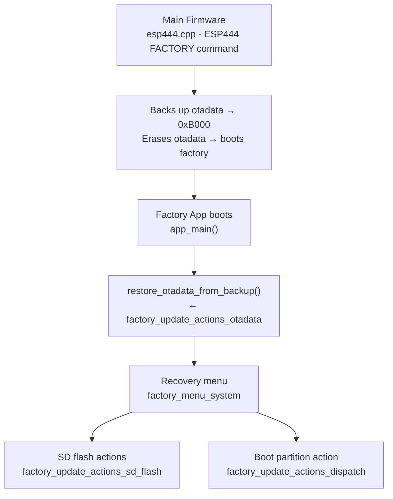
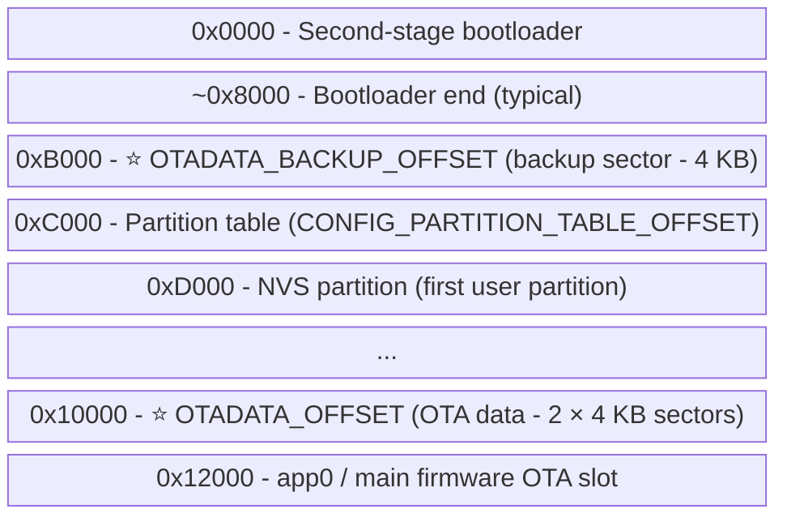
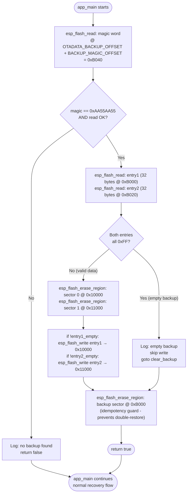
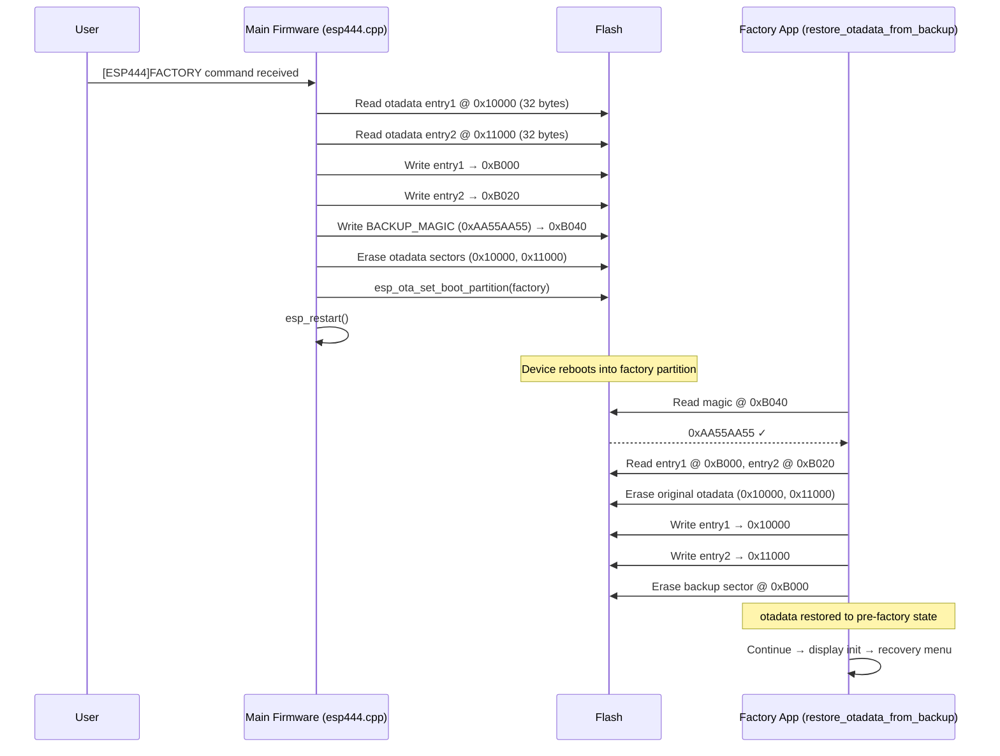
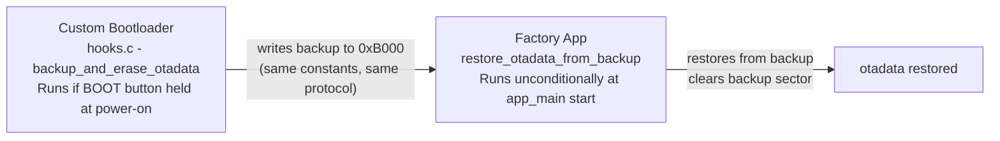

# factory_update_actions_otadata

## Overview

The `factory_update_actions_otadata` module implements the **OTA data partition backup-restore mechanism** used by the factory recovery application. Its single entry point, `restore_otadata_from_backup()`, runs as the **very first operation** inside `app_main()` — before display initialisation, before any hardware driver, before any other recovery logic — to guarantee that the ESP32's boot partition selection is safely restored even if the user cuts power immediately after entering the recovery environment.

This module is the receiving side of a two-part protocol whose sending side lives in the main firmware's `esp444.cpp` command handler. The two sides must use **identical flash addresses and the same magic value**; any mismatch silently skips the restore and leaves the device stranded on the factory partition.

> **Related documentation**
> - Parent module: [factory_update_actions.md](factory_update_actions.md) — SD flash and partition-boot actions that depend on a valid otadata before they run
> - Sibling module: [factory_update_actions_sd_flash.md](factory_update_actions_sd_flash.md) — SD firmware/resource flash operations
> - Sibling module: [factory_update_actions_dispatch.md](factory_update_actions_dispatch.md) — menu action dispatch
> - Bootloader counterpart: [custom_bootloader.md](factory_app.md) — pibot pendant's bootloader hook that performs an equivalent backup at an even earlier stage
> - Factory app entry: [factory_app_entry.md](factory_app_entry.md) — full `app_main()` lifecycle and initialisation order
> - Factory menu: [factory_menu_system.md](factory_menu_system.md) — recovery menu that runs after this restore
> - Project factory documentation: `docs/Factory/`

---

## Architecture Position



The restore runs **synchronously and unconditionally** at startup. If no backup is found (magic mismatch or all-0xFF entries), the function returns `false` and the recovery application continues normally. If a backup is found, the original OTA boot target is reinstated before any user interaction occurs.

---

## Flash Layout

Understanding this module requires understanding the flash address space it operates on:



| Constant | Value | Purpose |
|---|---|---|
| `OTADATA_OFFSET` | `0x10000` | Standard ESP-IDF OTA data partition (two 4 KB sectors) |
| `OTADATA_SECTOR_SIZE` | `0x1000` | One flash sector = 4 KB |
| `OTADATA_ENTRY_SIZE` | `32` | Size of one OTA state entry (bytes) |
| `OTADATA_BACKUP_OFFSET` | `0xB000` | Backup sector — between bootloader end and partition table |
| `BACKUP_MAGIC_OFFSET` | `0x40` | Offset of the magic word within the backup sector |
| `BACKUP_MAGIC` | `0xAA55AA55` | Sentinel confirming a valid backup is present |

### Placement Constraints

The backup sector at `0xB000` satisfies all four hard requirements:

1. **After bootloader end** — the second-stage bootloader fits within `0x0000–0x8000` on all supported boards.
2. **Before the partition table** — `CONFIG_PARTITION_TABLE_OFFSET = 0xC000` on all factory sdkconfigs.
3. **No overlap with any partition** — the first partition (NVS) starts at `0xD000`.
4. **4 KB-aligned** — `0xB000 % 0x1000 == 0` ✓

> ⚠️ **When porting to a new board:** recalculate `OTADATA_BACKUP_OFFSET` for the target flash layout. Update **both** `boards/<board>/Factory/main/main.c` and the main firmware `esp444.cpp` with the same value. The two copies must be identical.

---

## Required Build Configuration

The backup sector `0xB000` is **below the first registered partition**. ESP-IDF's flash driver aborts writes to such addresses by default (`CONFIG_SPI_FLASH_DANGEROUS_WRITE_ABORTS`). The factory sdkconfig must explicitly permit this:

```
CONFIG_SPI_FLASH_DANGEROUS_WRITE_ALLOWED=y
```

This is intentional: the factory application is a **privileged recovery tool** that manages flash directly outside the normal partition-table constraints. No production main-firmware application should copy this pattern.

---

## Core Function

### `restore_otadata_from_backup()`

**Signature** (identical across all boards):
```c
static bool restore_otadata_from_backup(void);
```

**Returns:** `true` if a valid backup was found and restored; `false` if no backup was present or entries were empty.

**Called from:** `app_main()` — the very first statement, before display, hardware drivers, or any other initialisation.

### Step-by-Step Data Flow



### Implementation Notes

| Property | Detail |
|---|---|
| **Idempotency guard** | The backup sector is **always erased** after a restore attempt, whether or not data was written. This prevents a second restore if the factory app is entered again without a new backup being written first. |
| **Partial restore** | Each OTA entry is written individually only if it contains non-0xFF data. Boards with only one OTA slot (only `app0`, no `app1`) will have `entry2` empty — it is skipped without error. |
| **No heap allocation** | All buffers (`entry1[32]`, `entry2[32]`) are stack-allocated, consistent with the project's memory-constraint rules for ESP32 embedded targets. |
| **Raw flash API** | `esp_flash_read` / `esp_flash_write` / `esp_flash_erase_region` use `NULL` as the chip handle (default chip) and operate on absolute addresses. This deliberately bypasses the partition API because `0xB000` lies outside all registered partitions. |
| **No error propagation on write** | Erase and write return values after the magic check are not checked. At that point no display is initialised, so errors cannot be shown. A write failure here is extremely unlikely on healthy flash and would be detected implicitly (the device would not boot the expected partition). |

---

## Backup Protocol — Two-Firmware Sequence



**Design rationale:** restoring otadata early means that if the user cuts power at any point during the factory session (before any SD flash operation or explicit boot-partition selection), the device will reboot into the previously active OTA partition. Without this restore, the device would loop into the factory app indefinitely after any power loss.

---

## Relationship to the Custom Bootloader

On the **pibot_pendant_v1_0** board, an additional layer exists. The custom bootloader performs an equivalent backup when the physical BOOT button is held at power-on, even before any application has a chance to run:



- The custom bootloader path handles the case where the **main firmware is unbootable** (e.g., after a failed OTA flash): the backup is written at bootloader stage, before any app runs.
- The factory app restore is still called and finds the backup the bootloader wrote — the protocol is identical either way.
- On all other boards (no physical button / no custom bootloader), the only entry path is the `[ESP444]FACTORY` software command, and the main firmware writes the backup.

See [custom_bootloader.md](factory_app.md) for full details on the bootloader hooks.

---

## Integration with `app_main()`

The call order in `app_main()` is fixed by design. `restore_otadata_from_backup()` must remain the **first call**:

```c
void app_main(void)
{
    factory_log_silence_sd_stack();           /* silence noisy SD stack logs */

    /* ① Restore otadata — MUST be first, before any hardware init */
    restore_otadata_from_backup();

    /* ② Display driver + GFX layer */
    st7796_init();          /* board-specific: ili9341_init / ili9485_init / st7262_init / ... */
    st7796_backlight(true);
    gfx_init();

    /* ③ Input devices */
    buttons_init();
    encoder_init();
    touch_init();
    buzzer_init();

    /* ④ Probe SD and build recovery menu */
    probe_sd_files();
    draw_menu();

    /* ⑤ Main input loop */
    while (1) { /* ... encoder / button / touch polling ... */ }
}
```

If the restore were deferred until after display or SD card initialisation, a power cut during those phases would leave otadata in an erased state (booting to factory on every subsequent power-on).

---

## Board Coverage

The same `restore_otadata_from_backup()` implementation (source-identical across boards) is compiled into the factory partition of every supported board. The flash layout constants are currently shared across all boards:

| Board | Chip | Factory Display | Custom Bootloader |
|---|---|---|---|
| `esp32_2432s028r` | ESP32 | ILI9341 (SPI) | No |
| `esp32_3248s035c` | ESP32 | ST7796 (SPI) | No |
| `esp32_3248s035r` | ESP32 | ST7796 (SPI) | No |
| `esp32s3_4827s043c` | ESP32-S3 | ILI9485 (RGB) | No |
| `esp32s3_8048_touch_lcd_7` | ESP32-S3 | ST7262 (RGB) | No |
| `esp32s3_8048s043c` | ESP32-S3 | ST7262 (RGB) | No |
| `esp32s3_8048s050c` | ESP32-S3 | ST7262 (RGB) | No |
| `esp32s3_8048s070c` | ESP32-S3 | RGB panel | No |
| `esp32s3_bzm_tft35_gt911` | ESP32-S3 | ST7796 (SPI) | No |
| `esp32s3_hmi43v3` | ESP32-S3 | RM68120 (i80) | No |
| `esp32s3_zx3d50ce02s_usrc_4832` | ESP32-S3 | ST7796 (i80) | No |
| `pibot_pendant_v1_0` | ESP32-S3 | ILI9341 (SPI) | **Yes** |

---

## Error Handling Summary

| Condition | Behaviour |
|---|---|
| `esp_flash_read` fails for magic | Log warning, return `false`, continue app normally |
| Magic word mismatch (no backup) | Log debug message, return `false`, continue app normally |
| Both entries all-0xFF (empty backup) | Log warning, skip write phase, still erase backup sector, `goto clear_backup` |
| One entry all-0xFF, one valid | Write only the non-empty entry; skip the other |
| `esp_flash_erase_region` / `esp_flash_write` fail | Return values not checked (display not yet available to show errors) |

---

## Porting Checklist

When adding a new board or changing the flash layout:

- [ ] Recalculate `OTADATA_BACKUP_OFFSET` — verify all four placement constraints (after bootloader, before partition table, no partition overlap, 4 KB aligned).
- [ ] Update `boards/<board>/Factory/main/main.c` with the new offset.
- [ ] Update `main/core/commands/esp444.cpp` in the main firmware with the **same** offset.
- [ ] Confirm `CONFIG_SPI_FLASH_DANGEROUS_WRITE_ALLOWED=y` in the board's factory `sdkconfig`.
- [ ] If the board has a custom bootloader, update `boards/<board>/Factory/custom_bootloader/hooks.c` with the same offset.
- [ ] Test the full round-trip: main firmware → `[ESP444]FACTORY` → power cycle mid-session → device reboots to the originally active OTA partition (not the factory partition).
