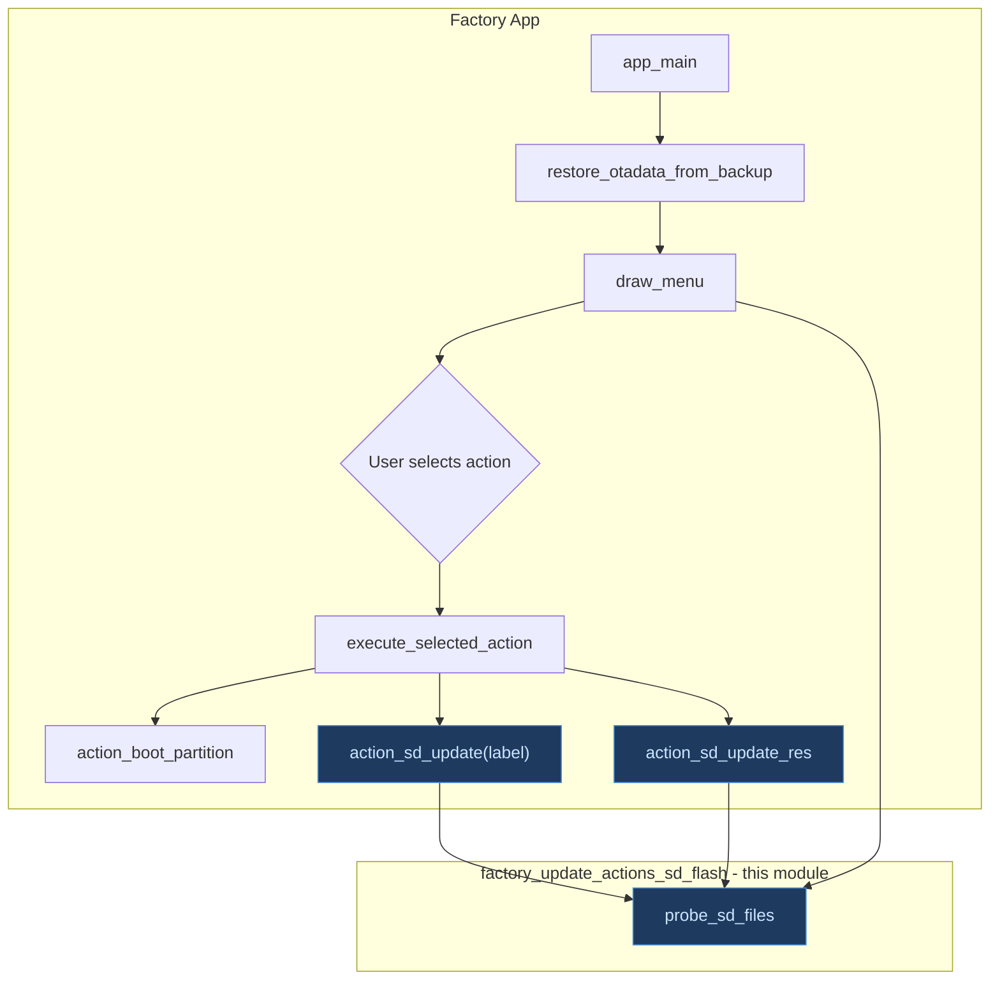
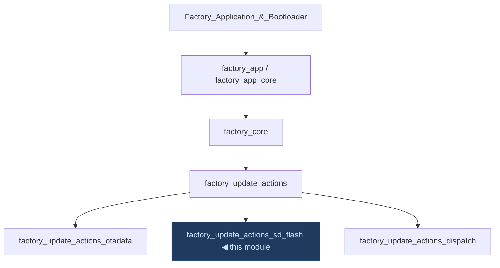
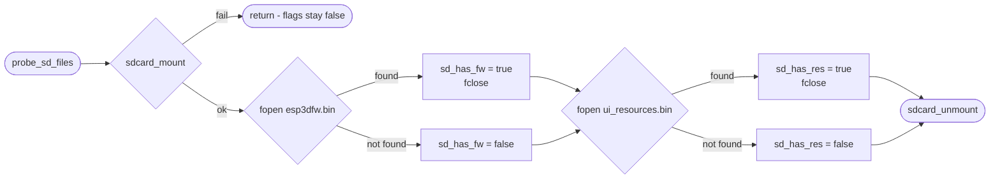
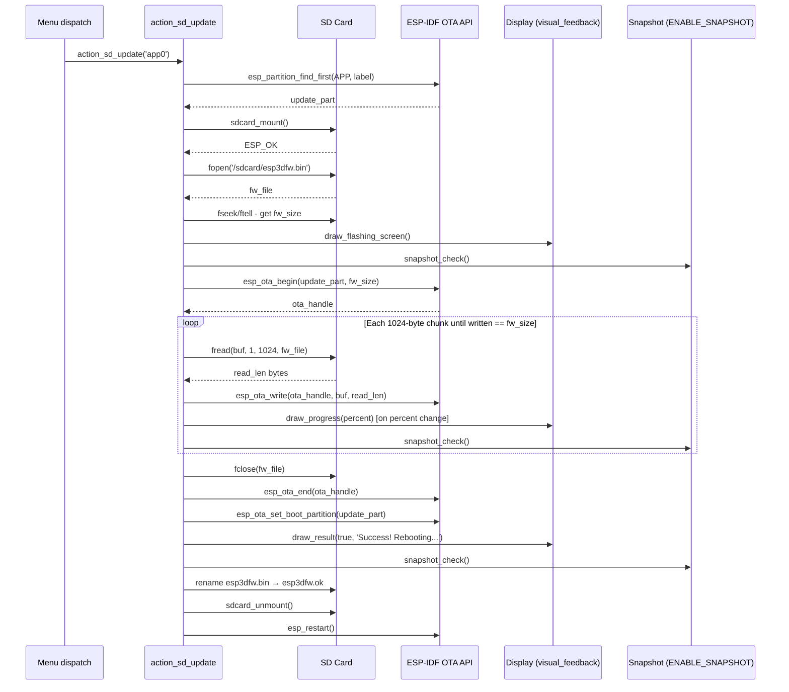
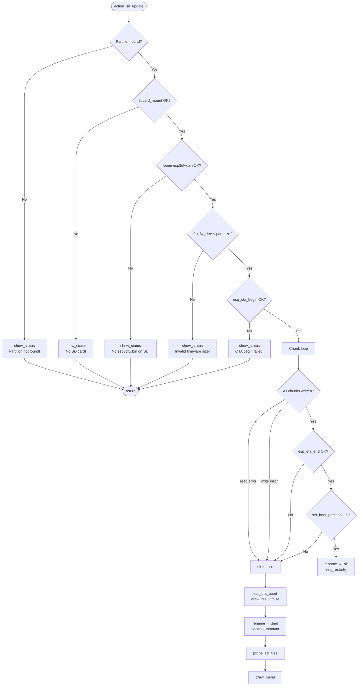
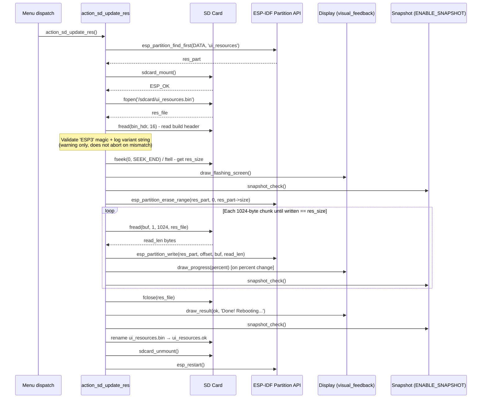
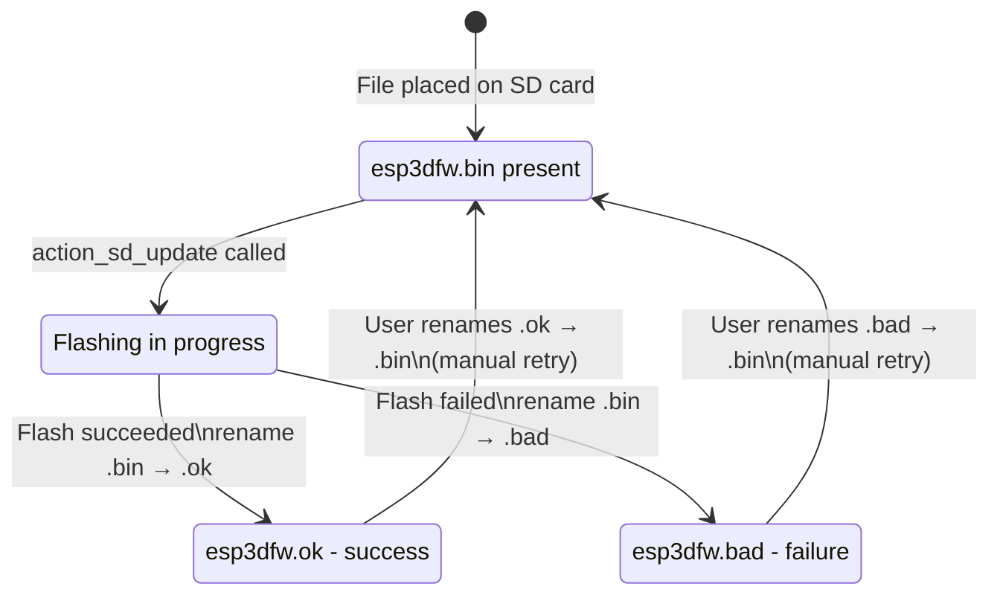
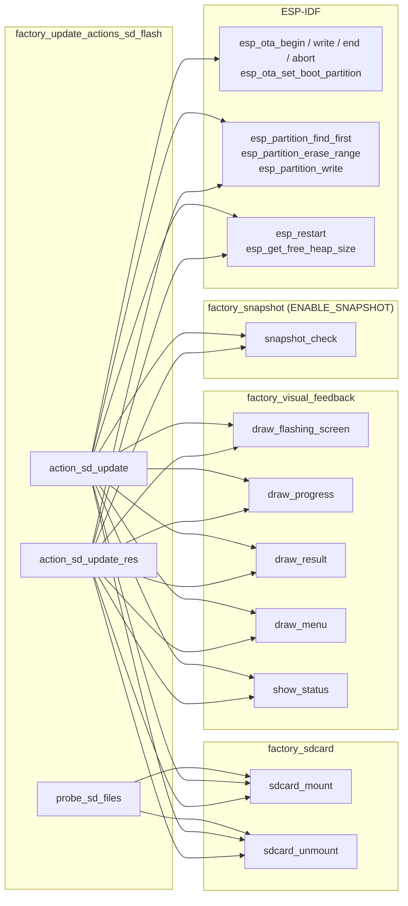

# Factory — SD Flash Update Actions

## Introduction

`factory_update_actions_sd_flash` is the sub-module of the factory recovery
application responsible for **flashing firmware and UI resources from an SD
card into internal flash**. It provides three functions that form the core of
the SD-based update path:

| Function | Purpose |
|---|---|
| `probe_sd_files` | Non-destructive SD scan — detects which update files are present |
| `action_sd_update` | Flashes `esp3dfw.bin` from SD into a named OTA app partition |
| `action_sd_update_res` | Flashes `ui_resources.bin` from SD into the `ui_resources` data partition |

These functions are cross-board: the same logic is replicated inside each
board's `Factory/main/main.c`, with only the display driver include and a
few board-specific layout constants differing between variants.

---

## Context in the Factory Application

The factory recovery application is a standalone ESP-IDF app stored in a
dedicated `factory` partition. It is entered either from the custom bootloader
(boards with a physical recovery button) or via the main firmware's
`[ESP444]FACTORY` software trigger. See [factory_app_entry.md](factory_app_entry.md)
for the full factory application entry-point and
[factory_update_actions_otadata.md](factory_update_actions_otadata.md) for the
OTA-data restore step that runs before the menu is shown.



### Module Position in the Factory Hierarchy



Sibling modules:

- [`factory_update_actions_otadata.md`](factory_update_actions_otadata.md) —
  restores the OTA-data backup on startup so a power-off from recovery returns
  to the correct application partition.
- [`factory_update_actions.md`](factory_update_actions.md) — parent module
  overview covering all three update-action sub-modules together.

---

## Component Overview

### `probe_sd_files`

Mounts the SD card, tries to open each expected update file, and sets the
global `sd_has_fw` / `sd_has_res` flags. These flags are read by
`draw_sd_indicators()` (part of [factory_visual_feedback](factory_menu_system.md)
) to show or hide the "FW" and "RES" labels in the menu header.



**Call sites:**
- `app_main` — called once during initialisation, before the first
  `draw_menu`.
- `action_sd_update` (failure path) — called after a failed flash attempt so
  the re-drawn menu reflects the current SD state (the `.bad` rename will have
  removed the original `.bin`).
- `action_sd_update_res` (failure path) — same reason.

---

### `action_sd_update`

Flashes a firmware binary from the SD card into a named OTA application
partition using the ESP-IDF OTA API. The target partition label is passed by
the caller (`"app0"` or `"app1"`), making the same function service both menu
entries.

#### Firmware Flash — Happy Path



#### Firmware Flash — Failure Paths



---

### `action_sd_update_res`

Flashes a UI resources binary from the SD card into the `ui_resources` DATA
partition. This path uses the raw partition API (`esp_partition_erase_range` +
`esp_partition_write`) because `ui_resources` is a DATA partition, not an OTA
app partition, and has no OTA integrity metadata.

#### Resources Flash — Happy Path



---

## SD File Protocol

The module defines a deterministic rename protocol that serves as a persistent
outcome marker surviving any subsequent reboot:



The identical state machine applies to `ui_resources.bin / .ok / .bad`.

### Defined Filenames

```c
#define FW_FILENAME      "/sdcard/esp3dfw.bin"
#define FW_OK_FILENAME   "/sdcard/esp3dfw.ok"
#define FW_BAD_FILENAME  "/sdcard/esp3dfw.bad"

#define RES_FILENAME     "/sdcard/ui_resources.bin"
#define RES_OK_FILENAME  "/sdcard/ui_resources.ok"
#define RES_BAD_FILENAME "/sdcard/ui_resources.bad"
```

### Protocol Rationale

| Property | Benefit |
|---|---|
| **Re-entry safety** | After a reboot back into the factory app, the `.bin` file is absent so no automatic re-flash occurs |
| **Post-mortem visibility** | A technician can check the SD card to determine the last flash outcome without UART logs |
| **Manual retry** | Renaming `.bad` → `.bin` on a host machine queues a retry without re-copying the original binary |

---

## Build Header Validation (Resources Only)

`action_sd_update_res` reads the first 16 bytes of `ui_resources.bin` before
any erase:

```
Offset  Size  Content
0       4     Magic bytes: 'E' 'S' 'P' '3'
4       12    Variant string (null-padded, e.g. "fluidnc_ser")
```

The variant string (written by `generate_resources.py` since the header was
introduced) encodes the firmware type and transport combination. A mismatch
between the binary variant and the target board's configuration is logged as a
warning but does **not** abort the flash — this preserves compatibility with
older binaries that pre-date the header.

> See [`ui_resources/development.md`](https://github.com/luc-github/Pibot-cnc-pendant-firmware/blob/main/docs/ui_resources/development.md) for the
> full binary format specification and the `generate_resources.py` pipeline.

---

## Key Design Decisions

### Fixed 1024-byte Stack Buffer — No Heap Allocation

```c
uint8_t buf[1024];
```

Both flash functions use a fixed stack-allocated 1024-byte chunk buffer. This
is intentional:

- The factory recovery app runs without LVGL, WiFi, or BT stacks — heap is
  larger than in production firmware but still constrained and potentially
  fragmented after SD mount.
- A `malloc` failure mid-flash would leave the partition in a half-written
  state with no graceful recovery path.
- 1024 bytes is within the project-wide safe stack buffer limit (see
  [esp32_memory_constraints.md](https://github.com/luc-github/Pibot-cnc-pendant-firmware/blob/main/docs/guides/esp32_memory_constraints.md)).

### OTA API vs Raw Partition Write

| Target partition | API used | Reason |
|---|---|---|
| `app0` / `app1` | `esp_ota_begin` / `esp_ota_write` / `esp_ota_end` | App partitions need OTA integrity metadata for ESP-IDF rollback tracking |
| `ui_resources` | `esp_partition_erase_range` + `esp_partition_write` | DATA partition — no OTA metadata, raw write is correct and simpler |

### Snapshot Integration

When compiled with `ENABLE_SNAPSHOT`, both flash functions call
`snapshot_check()` at three points:

1. Immediately after `draw_flashing_screen()` — captures initial screen state.
2. Inside the chunk loop, once per percentage-point change (`s_flash_last_percent`
   caches the last value so a full-redraw after a snap is consistent with the
   actual progress at snapshot time).
3. After `draw_result()` — captures the final success or failure screen.

The `s_snap_in_flash` flag tells the snapshot subsystem which screen layout to
redraw during a capture (`draw_flashing_screen` + `draw_progress` vs
`draw_menu`).

> See [factory_snapshot.md](factory_snapshot.md) for the full snapshot
> mechanism.

---

## Dependencies



---

## Board-Specific Notes

The three functions are **identical in logic** across all boards. Board
differences are confined to:

- The display driver `#include` (`st7796.h`, `st7262.h`, `ili9341.h`, etc.)
- Layout constants (`MENU_START_Y`, `FONT_WIDTH`, `BTN_CIRCLE_R`, etc.) that
  control only the visual feedback helpers, not the flash logic.

One board-specific pre-condition exists outside this module: on
**`esp32s3_8048_touch_lcd_7`**, the CH422G IO expander must be initialised and
its SD_CS line (`EXIO3`) asserted **before** any call to `sdcard_mount()`. This
is handled in `app_main` via `io_ch422g_configure()` which runs after
`touch_init()` brings up the shared I2C bus. The functions in this module call
`sdcard_mount()` directly and rely on that initialisation having already
occurred.

### Supported Boards

| Board | Firmware Flash | Resources Flash |
|---|---|---|
| `esp32_3248s035c` | ✓ | ✓ |
| `esp32_3248s035r` | ✓ | ✓ |
| `esp32s3_4827s043c` | ✓ | ✓ |
| `esp32s3_8048_touch_lcd_7` | ✓ | ✓ |
| `esp32s3_8048s043c` | ✓ | ✓ |
| `esp32s3_8048s050c` | ✓ | ✓ |
| `esp32s3_8048s070c` | ✓ | ✓ |
| `esp32s3_bzm_tft35_gt911` | ✓ | ✓ |
| `esp32s3_hmi43v3` | ✓ | ✓ |
| `esp32s3_zx3d50ce02s_usrc_4832` | ✓ | ✓ |
| `pibot_pendant_v1_0` | ✓ | ✓ |

---

## Flash Safety Constraints

### Dangerous Write Permission

The factory `sdkconfig` must set `CONFIG_SPI_FLASH_DANGEROUS_WRITE_ALLOWED=y`.
`action_sd_update_res` calls `esp_partition_erase_range` which may target flash
addresses that ESP-IDF's default `CONFIG_SPI_FLASH_DANGEROUS_WRITE_ABORTS`
policy would reject. This is intentional — the factory app is a privileged
recovery tool with explicit flash management authority.

### `OTADATA_BACKUP_OFFSET` and Partition Boundaries

The OTA-data backup sector (written by the main firmware's `esp444.cpp`) sits
in the region below the partition table. The firmware flash path must not
overlap this region. `OTADATA_BACKUP_OFFSET` (0xB000) and `OTADATA_OFFSET`
(0x10000) are defined to be well below the first application partition and are
kept in sync between this factory app and the main firmware. When porting to a
new board, verify both values remain valid for the target flash layout.

### Logging During Flash

Factory logging uses the `FACTORY_LOGD` macro from `factory_log.h`. The SD
stack (FatFS/SDMMC) is silenced via `factory_log_silence_sd_stack()` called in
`app_main` to reduce UART noise during the flash progress display. Debug heap
values are logged at flash entry and after SD mount via `esp_get_free_heap_size()`
for diagnostic purposes.

> See [esp3d_log_guide.md](https://github.com/luc-github/Pibot-cnc-pendant-firmware/blob/main/docs/guides/esp3d_log_guide.md) for the general
> logging convention. `FACTORY_LOGD` is a bare-C adaptation of the same
> pattern used in the main firmware.

---

## Related Documentation

| Document | Topic |
|---|---|
| [factory_app_entry.md](factory_app_entry.md) | Factory app entry point (`app_main`) — hardware init and menu bootstrap |
| [factory_update_actions.md](factory_update_actions.md) | Parent module — all update actions together |
| [factory_update_actions_otadata.md](factory_update_actions_otadata.md) | OTA-data backup restore before the menu |
| [factory_menu_system.md](factory_menu_system.md) | Menu draw, navigation, SD indicators |
| [factory_sdcard.md](factory_sdcard.md) | SD card mount / unmount implementation |
| [factory_snapshot.md](factory_snapshot.md) | Screen snapshot capture to SD (debug feature) |
| [ui_resources/development.md](https://github.com/luc-github/Pibot-cnc-pendant-firmware/blob/main/docs/ui_resources/development.md) | `ui_resources` binary format and build pipeline |
| [guides/tools.md](https://github.com/luc-github/Pibot-cnc-pendant-firmware/blob/main/docs/guides/tools.md) | Host-side flash helpers (`flash_factory.py`, `flash_all.py`) |
| [guides/esp32_memory_constraints.md](https://github.com/luc-github/Pibot-cnc-pendant-firmware/blob/main/docs/guides/esp32_memory_constraints.md) | Heap and fragmentation constraints |
