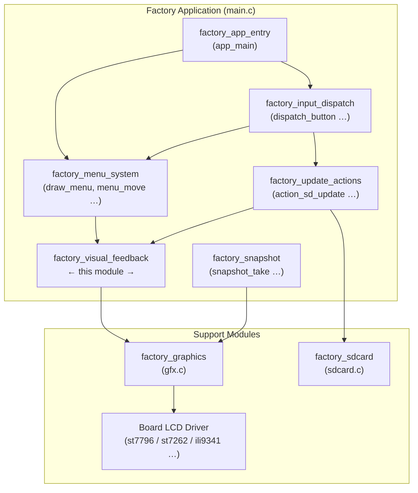
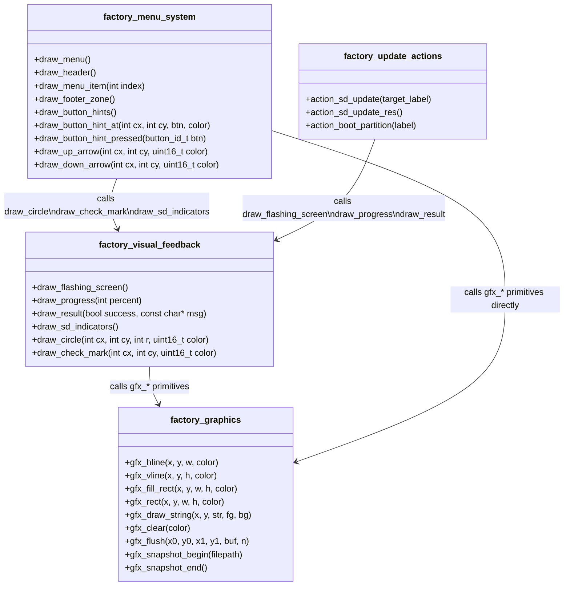
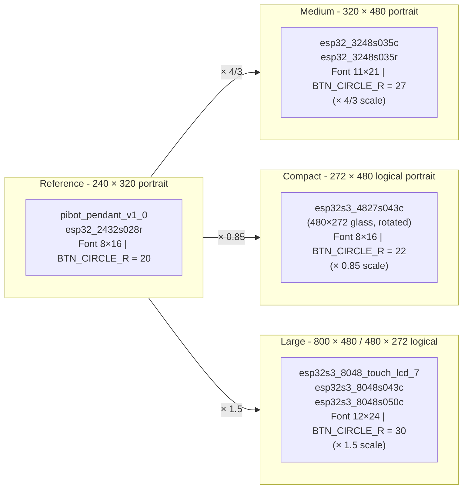
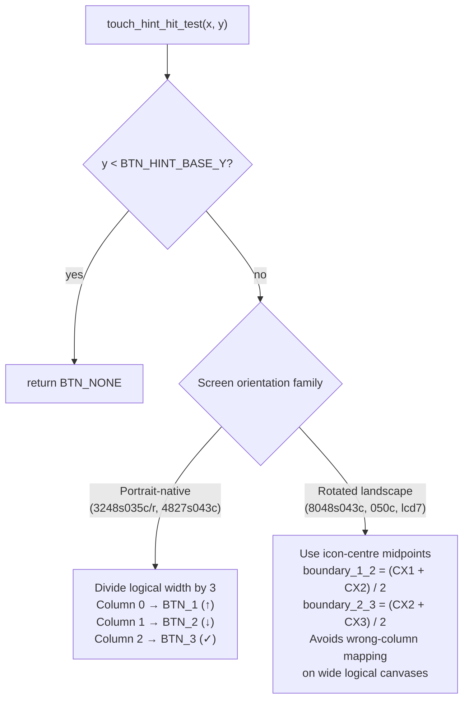
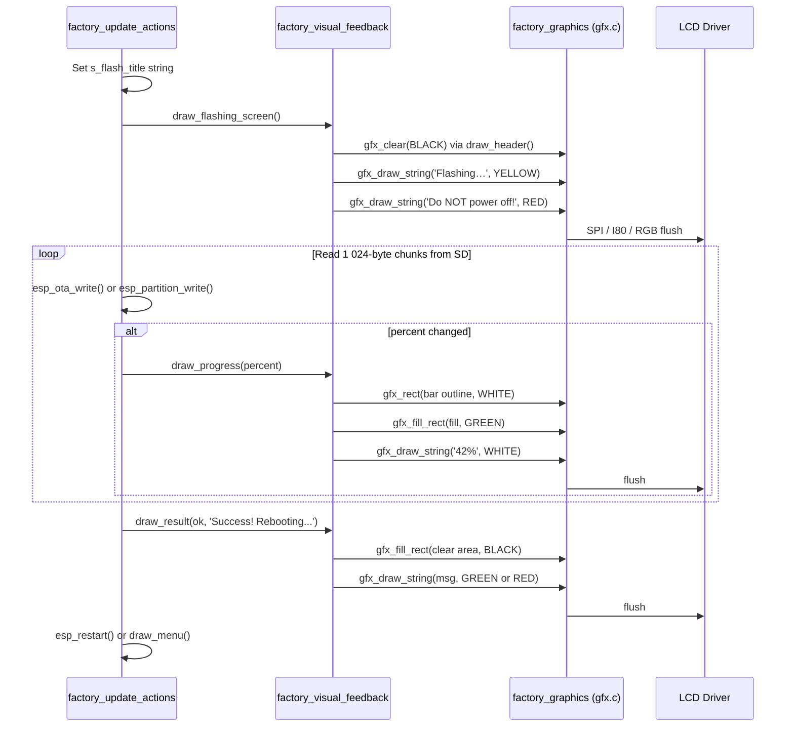
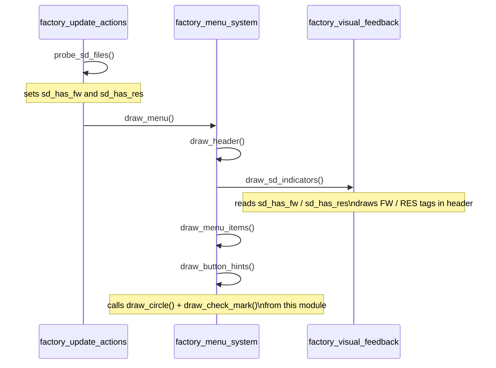
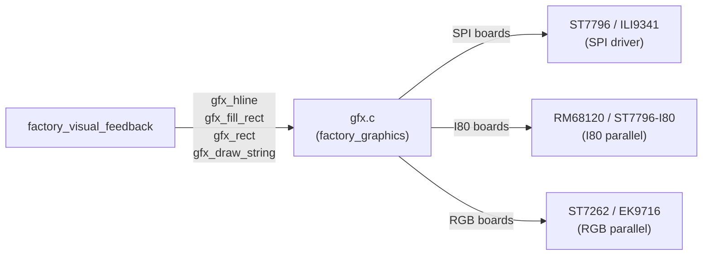
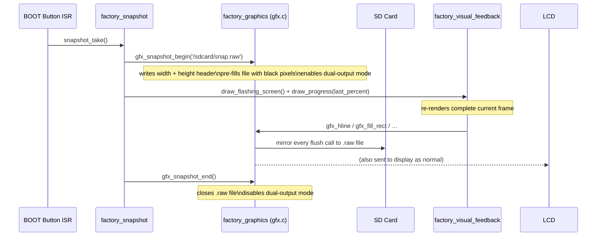
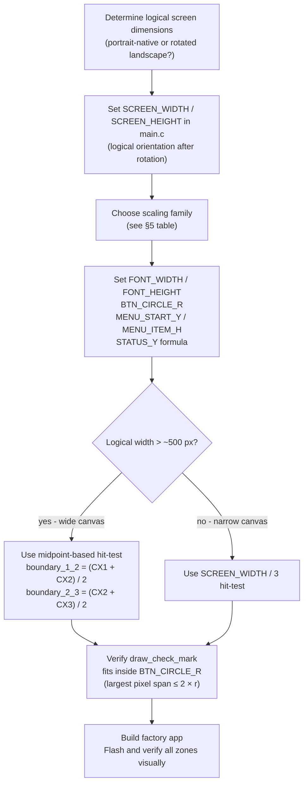

# Factory Visual Feedback Module

The **factory_visual_feedback** module is the display rendering layer for the factory
recovery application. It owns every pixel that communicates operation state to the
operator: the "Flashing…" warning screen, the real-time progress bar, the
success/failure result banner, the SD card file indicators in the menu header, and the
circle/checkmark primitives used by the button hint bar.

It is intentionally thin — it contains no state of its own. All decisions about *when*
to draw are made by sibling modules ([factory_menu_system](factory_menu_system.md),
[factory_update_actions](factory_update_actions.md)); this module only decides *how* to
paint.

---

## Table of Contents

1. [Module Position in the Factory App](#1-module-position-in-the-factory-app)
2. [Component Architecture](#2-component-architecture)
3. [Screen Zone Layout](#3-screen-zone-layout)
4. [Function Reference](#4-function-reference)
5. [Board-Specific Scaling](#5-board-specific-scaling)
6. [Flashing Operation Data Flow](#6-flashing-operation-data-flow)
7. [Graphics Layer Dependency](#7-graphics-layer-dependency)
8. [Snapshot Integration](#8-snapshot-integration)
9. [Porting Checklist](#9-porting-checklist)

---

## 1. Module Position in the Factory App

The factory recovery application (`boards/<board>/Factory/main/main.c`) is compiled as a
standalone ESP-IDF app that occupies the `factory` OTA partition. It is entered when
the main firmware executes `[ESP444]FACTORY` or (on the PiBot Pendant) when the BOOT
button is held during power-on via the custom bootloader.

`factory_visual_feedback` is one of six logical modules that live inside `main.c`:



`factory_visual_feedback` sits between the business logic (update actions, menu system)
and the raw pixel-pushing layer (factory_graphics / `gfx.c`). It has no upward
dependencies on FreeRTOS tasks or OTA APIs.

---

## 2. Component Architecture



> **Key design principle:** `draw_circle` and `draw_check_mark` live in
> `factory_visual_feedback` even though they are consumed by `factory_menu_system`'s
> `draw_button_hint_at`. This reflects ownership — the confirm-mark icon is conceptually
> a "result" symbol. The navigation arrows (`draw_up_arrow`, `draw_down_arrow`) belong
> to menu navigation and therefore live in `factory_menu_system`.

---

## 3. Screen Zone Layout

The recovery UI uses a consistent zone map across all boards. Absolute pixel coordinates
vary per board (see [Board-Specific Scaling](#5-board-specific-scaling)), but the zone
hierarchy is always:

```
┌──────────────────────────────────────────────┐
│  ┌────────────────────────────────────────┐  │  ← double-border  (gfx_rect × 2)
│  │  Recovery VERSION            (CYAN)    │  │  y = 13
│  │  ─────────────────────────────────────  │  │  y = 40  (separator)
│  │  Active OTA partition label (YELLOW)   │  │  y = 53
│  │  SD: FW RES  ← draw_sd_indicators()   │  │  y = 81
│  │  ─────────────────────────────────────  │  │  y = 104 (separator)
│  │                                         │  │
│  │  ▶ Menu item 0              (WHITE)     │  │  MENU_START_Y
│  │    Menu item 1              (GRAY)      │  │  + MENU_ITEM_H
│  │    Menu item 2              (GRAY)      │  │  + MENU_ITEM_H × 2
│  │                                         │  │
│  │  ─────────────────────────────────────  │  │  STATUS_Y − 7
│  │  Status text                (YELLOW)   │  │  STATUS_Y
│  │  ─────────────────────────────────────  │  │  BTN_HINT_BASE_Y
│  │  ↑     ↓     ✓                          │  │  BTN_HINT_CY
│  └────────────────────────────────────────┘  │
└──────────────────────────────────────────────┘
```

### Flashing-screen zone overlay

When `draw_flashing_screen()` is called the header is preserved but everything below is
replaced:

```
┌──────────────────────────────────────────────┐
│  Recovery VERSION              (CYAN)         │  ← draw_header() preserved
│  ───────────────────────────────────────────  │
│                                               │
│      Flashing firmware...     (YELLOW)        │  ← SCREEN_HEIGHT/2 − 13
│      Do NOT power off!        (RED)           │  ← SCREEN_HEIGHT/2 + 7
│                                               │
│  ┌─────────────────────────────────────────┐  │  ← draw_progress()
│  │  ███████████░░░░░░░░░░░░░░░░░░░░░░░░░  │  │    y = SCREEN_HEIGHT/2 + 27
│  └─────────────────────────────────────────┘  │    height = 27 px
│                   42%                         │
│                                               │
│      Success! Rebooting...    (GREEN)         │  ← draw_result()
│      — OR —                                   │    y = SCREEN_HEIGHT/2 + 93
│      FAILED! Power cycle.     (RED)           │
└──────────────────────────────────────────────┘
```

### Colour coding convention

| Colour  | Semantic use |
|---------|-------------|
| CYAN    | Title / version label |
| YELLOW  | Active partition label, operation title |
| GREEN   | `"FW"` SD indicator, progress bar fill, success result |
| CYAN    | `"RES"` SD indicator |
| WHITE   | Menu items (non-selected), progress bar outline |
| GRAY    | Menu items (de-selected) |
| BLUE    | Navigation button hints (↑ ↓) |
| GREEN   | Confirm button hint (✓) |
| VIOLET  | Pressed button visual feedback |
| RED     | `"Do NOT power off!"` warning, failure result |

---

## 4. Function Reference

### `draw_circle`

```c
static void draw_circle(int cx, int cy, int r, uint16_t color);
```

Draws a 1-pixel-wide circle outline centred at `(cx, cy)` with radius `r` using the
**Bresenham midpoint algorithm**. Each iteration emits eight symmetric `gfx_hline()`
calls of width 1, producing an octant-mirrored circle with no floating-point arithmetic
and no per-pixel LCD flush overhead beyond what `gfx_hline`'s line-buffer batching
already provides.

Used by `draw_button_hint_at()` (in `factory_menu_system`) to draw a **double circle**
outline (`BTN_CIRCLE_R` and `BTN_CIRCLE_R − 1`), giving a 2-pixel-thick ring around
each virtual button icon.

| Parameter | Description |
|-----------|-------------|
| `cx`, `cy` | Centre of the circle in logical screen coordinates |
| `r` | Radius in pixels |
| `color` | RGB565 foreground colour |

---

### `draw_check_mark`

```c
static void draw_check_mark(int cx, int cy, uint16_t color);
```

Draws a ✓ checkmark centred at `(cx, cy)` using a series of `gfx_hline()` calls. The
mark has a 4-pixel stroke width rendered in two arms:

- **Left arm** — short, descends from upper-left to the vertex
- **Right arm** — long, ascends from the vertex to upper-right
- **Junction row** — closes the vertex cleanly between the two arms

Used exclusively by `draw_button_hint_at()` for the BTN_3 (OK / confirm) icon. Pixel
coordinates are scaled proportionally to `BTN_CIRCLE_R` across board variants.

---

### `draw_flashing_screen`

```c
static void draw_flashing_screen(void);
```

Draws the **full-screen warning layout** shown whenever the factory app writes to flash:

1. Calls `draw_header()` (owned by `factory_menu_system`) — clears the canvas, paints
   title row and separators.
2. Renders the operation title string (`s_flash_title`, set by the caller) in
   **YELLOW** at `SCREEN_HEIGHT/2 − 13`.
3. Renders `"Do NOT power off!"` in **RED** at `SCREEN_HEIGHT/2 + 7`.

The caller sets the title before calling:

```c
s_flash_title = "Flashing firmware...";
draw_flashing_screen();
```

> ⚠️ Clears the entire screen. Must only be called at the start of a destructive flash
> operation.

---

### `draw_progress`

```c
static void draw_progress(int percent);
```

Draws or updates a green progress bar with a white outline and a percentage label. The
bar outline is **always redrawn in full** — this ensures snapshot captures reproduce a
complete, consistent frame regardless of when they fire.

| Element | Position |
|---------|----------|
| Bar outline (WHITE) | `y = SCREEN_HEIGHT/2 + 27`, `h = 27 px`, `w = SCREEN_WIDTH − 53` |
| Green fill | 3 px inset inside outline; width proportional to `percent` |
| Percentage label (WHITE) | `y = bar_y + bar_h + 11`, centred; text area cleared before redraw |

Called inside the SD read-write loop on each percent change:

```c
int percent = (int)((written * 100) / total_size);
if (percent != last_percent) {
    draw_progress(percent);
    last_percent = percent;
}
```

> **Performance note:** At most 100 calls per flash operation. Each call performs 2–3
> filled-rectangle operations through `gfx.c`'s line-buffer batching — acceptable for
> the factory app, which runs without LVGL or any concurrent UI task.

---

### `draw_result`

```c
static void draw_result(bool success, const char *success_msg);
```

Draws the final outcome of a flash operation at `y = SCREEN_HEIGHT/2 + 93`, clearing
that zone first.

| `success` | Rendered text | Colour |
|-----------|---------------|--------|
| `true` | `success_msg` (e.g. `"Success! Rebooting..."`) | GREEN |
| `false` | `"FAILED! Power cycle."` (hardcoded) | RED |

Called once per flash attempt after the OTA or partition write loop completes.

---

### `draw_sd_indicators`

```c
static void draw_sd_indicators(void);
```

Draws SD card file availability indicators in the header zone. The state variables
`sd_has_fw` and `sd_has_res` are set by `probe_sd_files()` in
[factory_update_actions](factory_update_actions.md); this function only reads them.

Layout (right-aligned in the header):

```
SD:                      FW     RES
(DARK GRAY label)    (GREEN)  (CYAN)
```

- `"FW"` shown in GREEN when `/sdcard/esp3dfw.bin` exists.
- `"RES"` shown in CYAN when `/sdcard/ui_resources.bin` exists.
- Tags are omitted individually when the corresponding file is absent.

Called from `draw_menu()` (in `factory_menu_system`) each time the menu redraws.

---

## 5. Board-Specific Scaling

All six board implementations share the same drawing logic but adapt pixel coordinates
via compile-time constants. There are three scaling families relative to a 240×320
portrait reference:



| Constant | 240×320 ref | 320×480 (3248s035) | 272×480 (4827s043) | 800×480 (8048-family) |
|----------|:-----------:|:------------------:|:------------------:|:---------------------:|
| `FONT_WIDTH` | 8 | 11 | 8 | 12 |
| `FONT_HEIGHT` | 16 | 21 | 16 | 24 |
| `BTN_CIRCLE_R` | 20 | 27 | 22 | 30 |
| `MENU_START_Y` | 83 | 111 | 94 | 94 |
| `MENU_ITEM_H` | 30 | 40 | 34 | 34 |

### Touch hit-test strategy

The `touch_hint_hit_test()` function maps a tap coordinate to one of three button zones.
Portrait-native and landscape-rotated boards use different strategies:



> **Why the difference?** On 8048-family boards the logical canvas can be 800 px wide,
> but the three button icons are clustered within ±100 px of screen centre. Dividing the
> full width into thirds would place BTN_1 and BTN_3 in the wrong column. Using the
> midpoint between actual icon centres gives correct hit zones regardless of canvas width.

---

## 6. Flashing Operation Data Flow



### SD indicator refresh flow



---

## 7. Graphics Layer Dependency

All drawing in this module ultimately calls through `gfx.c`. The graphics layer
provides five primitives used here:

| Primitive | Used by |
|-----------|---------|
| `gfx_hline(x, y, w, color)` | `draw_circle`, `draw_check_mark`, inner rendering of rect/string helpers |
| `gfx_fill_rect(x, y, w, h, color)` | `draw_progress` (bar fill + text erase), `draw_result` (area clear) |
| `gfx_rect(x, y, w, h, color)` | `draw_progress` (bar outline) |
| `gfx_draw_string(x, y, str, fg, bg)` | `draw_flashing_screen`, `draw_progress`, `draw_result`, `draw_sd_indicators` |
| `gfx_clear(color)` | via `draw_header()` in `factory_menu_system` |



> The factory app does **not** use LVGL. All rendering is direct pixel calls through
> `gfx.c`. This avoids the LVGL heap and task dependencies, keeping the recovery app
> lightweight (< 100 KB code) and deterministic. See
> [`display_drivers_spi.md`](display_drivers_spi.md),
> [`display_drivers_i80.md`](display_drivers_i80.md), and
> [`display_drivers_rgb.md`](display_drivers_rgb.md) for driver-level details.

### RGB565 colour format

`gfx.c` accepts all colours as 16-bit RGB565 (`uint16_t`). `gfx_hline()` performs
byte-swapping internally before writing to the SPI/I80 line buffer, so callers always
pass native RGB565 values. Use the `GFX_RGB565(r, g, b)` macro defined in `gfx.h`:

```c
#define GFX_RGB565(r, g, b) \
    (uint16_t)(((r & 0xF8) << 8) | ((g & 0xFC) << 3) | (b >> 3))
```

---

## 8. Snapshot Integration

When `ENABLE_SNAPSHOT` is defined, the factory_snapshot module (triggered by the BOOT
button) can capture a `.raw` pixel dump to the SD card at any point. Because
`gfx_snapshot_begin()` hooks into the same `gfx_flush()` path that all `gfx.c` drawing
calls use, a snapshot taken mid-flash captures an accurate copy of the current display
state with zero additional rendering code.



### Snapshot-safe rendering requirement

`draw_progress` is designed to **always redraw the bar outline** (not just the fill) so
that a full-redraw triggered by `snapshot_take()` reproduces the complete progress bar
without orphaned fill rectangles:

```c
/* Always draw outline — required for consistent snapshot full-redraw */
gfx_rect(bar_x, bar_y, bar_w, bar_h, COLOR_WHITE);
/* Then draw proportional fill */
gfx_fill_rect(bar_x + 3, bar_y + 3, fill_w, bar_h - 6, COLOR_GREEN);
```

---

## 9. Porting Checklist

When adding a new board to the factory application:



**Critical offsets to verify per board:**

| Check | What to look for |
|-------|-----------------|
| `draw_progress` bar | Fully visible; not clipped by `STATUS_Y` or button bar |
| `draw_result` text | Visible at `SCREEN_HEIGHT/2 + 93`; not overlapping button bar |
| `draw_sd_indicators` right edge | Right-aligned tags do not overrun screen width |
| `draw_check_mark` vertex | Junction row aligns to the visual centre of BTN_CIRCLE_R |
| `draw_circle` double-ring | Rings at `BTN_CIRCLE_R` and `BTN_CIRCLE_R − 1` both fully on-screen |
