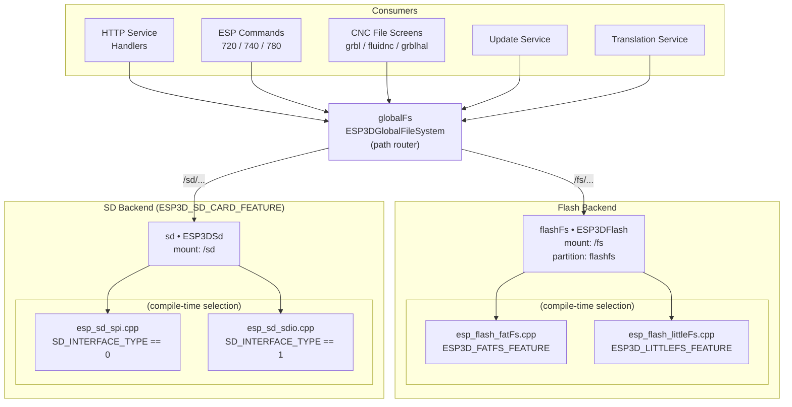
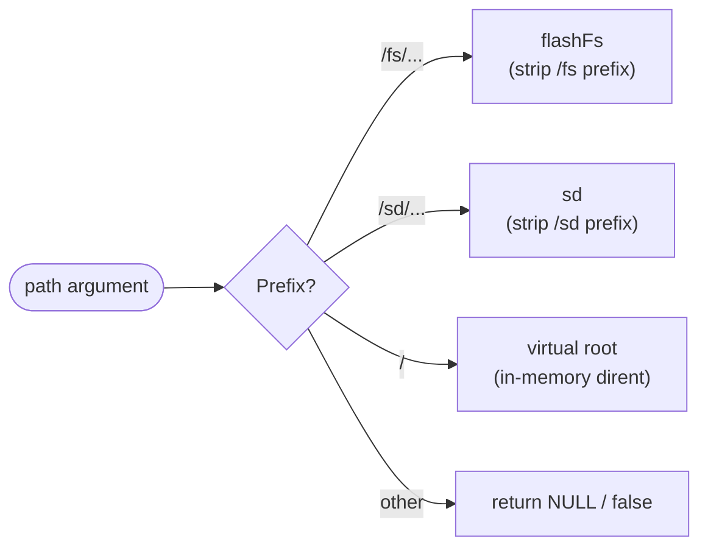
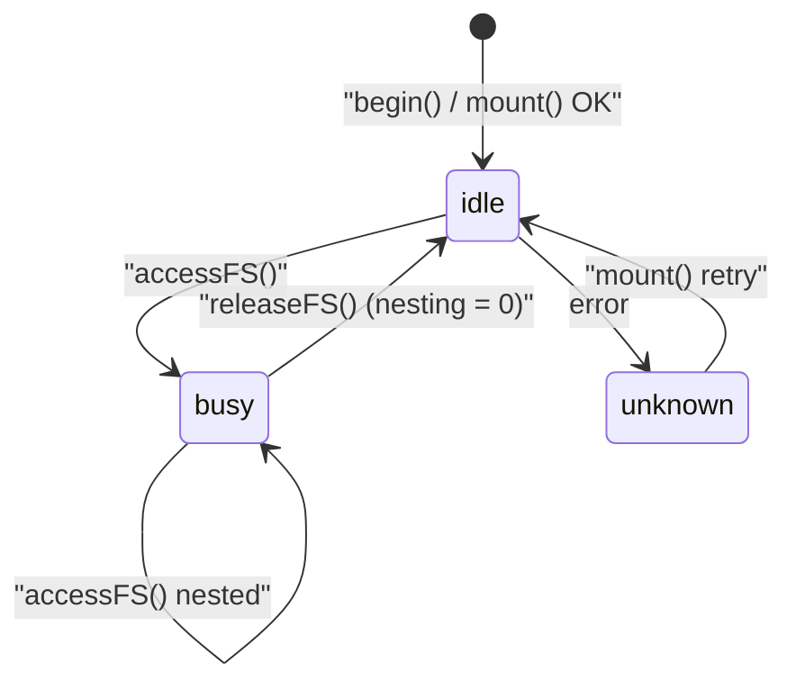
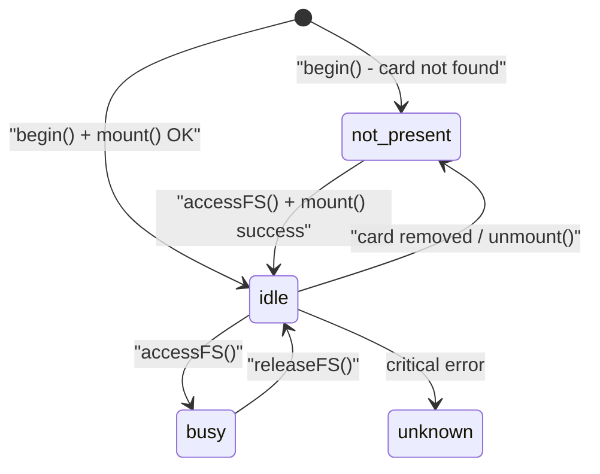
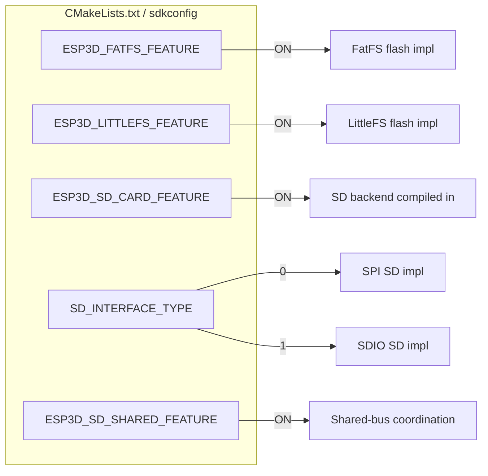
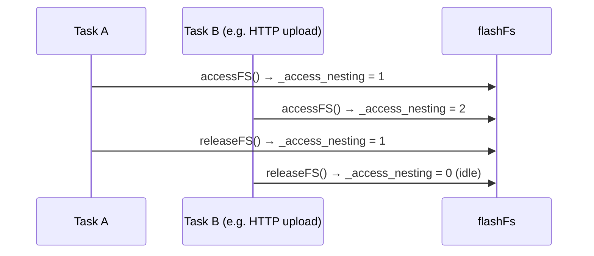
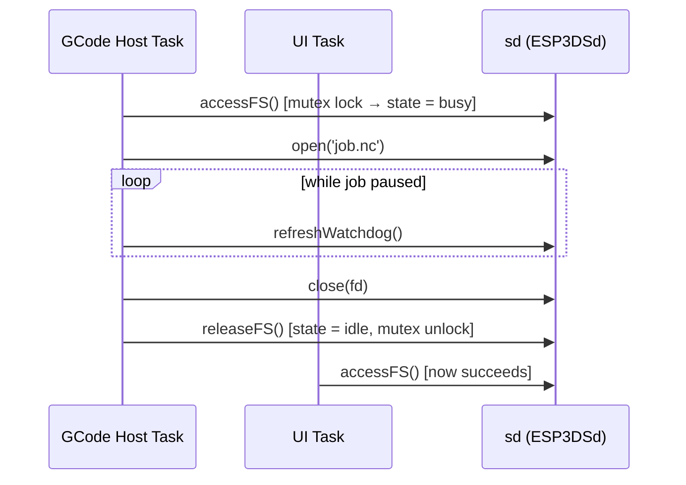
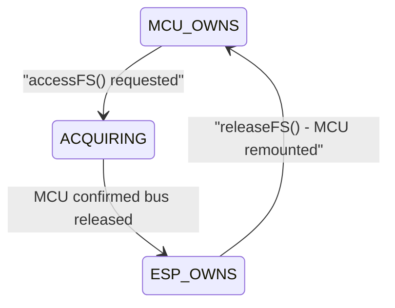
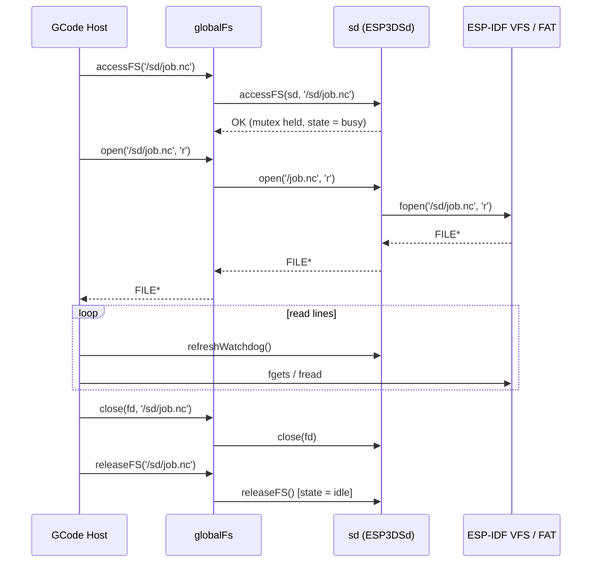
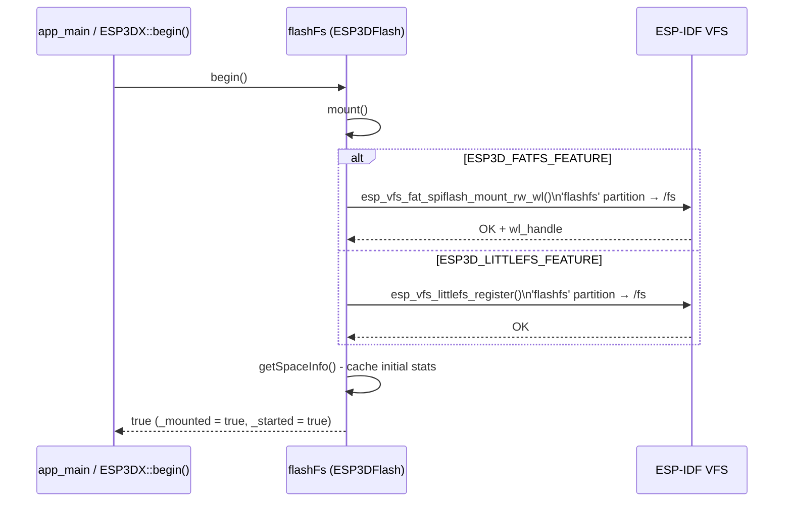

# Filesystem Module

The filesystem module provides a unified, path-based storage abstraction for the ESP3D pendant firmware. It layers three tiers — a global path router, per-medium backend drivers, and platform-specific implementations — so every consumer (HTTP handlers, ESP commands, CNC UI screens, update service) works through a single, consistent POSIX-like API regardless of whether data lives on internal flash or an SD card.

---

## Table of Contents

1. [Architecture Overview](#architecture-overview)
2. [Tier 1 — Global Router (`ESP3DGlobalFileSystem`)](#tier-1--global-router-esp3dglobalfilesystem)
3. [Tier 2 — Backend Drivers](#tier-2--backend-drivers)
   - [Flash Driver (`ESP3DFlash`)](#flash-driver-esp3dflash)
   - [SD Card Driver (`ESP3DSd`)](#sd-card-driver-esp3dsd)
4. [Tier 3 — Platform Implementations](#tier-3--platform-implementations)
   - [Flash: FatFS](#flash-fatfs-esp_flash_fatfscpp)
   - [Flash: LittleFS](#flash-littlefs-esp_flash_littlefscpp)
   - [SD: SPI](#sd-spi-esp_sd_spicpp)
   - [SD: SDIO](#sd-sdio-esp_sd_sdiocpp)
5. [Path Conventions](#path-conventions)
6. [Feature Flags & Build Selection](#feature-flags--build-selection)
7. [SD Card Configuration](#sd-card-configuration)
8. [Access Control & Concurrency](#access-control--concurrency)
9. [Shared SD (Optional)](#shared-sd-optional)
10. [Data Flow Diagrams](#data-flow-diagrams)
11. [Global Instances](#global-instances)
12. [API Reference](#api-reference)
13. [Consumers](#consumers)
14. [Related Documentation](#related-documentation)

---

## Architecture Overview



The module follows a strict separation of concerns:

| Tier | Class | File | Responsibility |
|------|-------|------|----------------|
| 1 | `ESP3DGlobalFileSystem` | `esp3d_globalfs.h/.cpp` | Inspect path prefix, route to correct backend |
| 2a | `ESP3DFlash` | `esp3d_flash.h` | Flash lifecycle, state, POSIX API |
| 2b | `ESP3DSd` | `esp3d_sd.h` | SD lifecycle, state, watchdog, POSIX API |
| 3a | *(FatFS impl)* | `flash/esp_flash_fatFs.cpp` | Mount/unmount/ops via `esp_vfs_fat` + wear leveling |
| 3a | *(LittleFS impl)* | `flash/esp_flash_littleFs.cpp` | Mount/unmount/ops via `esp_littlefs` |
| 3b | *(SPI impl)* | `sd/esp_sd_spi.cpp` | SD via `sdspi` + `esp_vfs_fat` |
| 3b | *(SDIO impl)* | `sd/esp_sd_sdio.cpp` | SD via `sdmmc` + `esp_vfs_fat` |

---

## Tier 1 — Global Router (`ESP3DGlobalFileSystem`)

**File:** `main/modules/filesystem/esp3d_globalfs.h` / `esp3d_globalfs.cpp`  
**Global instance:** `globalFs`

`ESP3DGlobalFileSystem` is a thin path-routing layer. It exposes the same POSIX-like API as the backend drivers but resolves each call to the correct backend by inspecting the path prefix.

### Path Resolution



`getFSType(const char *path)` implements this logic by comparing the path against `rootDirsHeaders[]`:

```c
const char *rootDirsHeaders[] = { "/fs/", "/sd/" };   // ESP3D_FLASH_FS_HEADER, ESP3D_SD_FS_HEADER
```

When routing to a backend, the prefix is stripped — i.e. `/fs/config.ini` becomes `/config.ini` before being forwarded to `flashFs`.

### Virtual Root (`/`)

The virtual root presents all mounted sub-filesystems as directory entries without touching real storage. The router holds a single static `DIR _rootDir` and `dirent _rootEntry` pair; it is not concurrency-safe for multiple simultaneous root `opendir` callers, which is acceptable because the firmware never lists the root from more than one task at a time.

```
/ (virtual root)
├── fs/    →  flashFs  (always present)
└── sd/    →  sd       (only when ESP3D_SD_CARD_FEATURE)
```

DIR entries are identified internally with unique marker constants so `closedir` / `readdir` / `rewinddir` know which backend to dispatch to:

| Constant | Value | Backend |
|---|---|---|
| `GLOBAL_ROOT_DIR_ID` | 8888 | virtual root |
| `GLOBAL_FLASH_DIR_ID` | 1111 | `flashFs` |
| `GLOBAL_SD_DIR_ID` | 2222 | `sd` |

---

## Tier 2 — Backend Drivers

Both backend drivers share an identical public API surface; the difference lies in their lifecycle mechanics.

### Flash Driver (`ESP3DFlash`)

**File:** `main/modules/filesystem/esp3d_flash.h`  
**Global instance:** `flashFs`  
**Mount point:** `/fs`  
**Partition label:** `flashfs`

#### State Machine



| State | Meaning |
|---|---|
| `idle` | Mounted, no active accessor |
| `busy` | One or more callers inside `accessFS()` / `releaseFS()` block |
| `unknown` | Initialization failed |

`_access_nesting` is a `uint16_t` counter that permits nested `accessFS()` calls from the same subsystem. `releaseFS()` decrements it; the filesystem transitions back to `idle` only when the counter reaches zero.

#### Key Methods

| Method | Description |
|---|---|
| `begin()` | Mounts and caches space info; idempotent |
| `mount()` | Calls the compile-time-selected VFS backend |
| `unmount()` | Calls `onBeforeUnmount()` then unregisters VFS |
| `format()` | Unmounts, formats partition, remounts |
| `accessFS()` | Increments `_access_nesting`; blocks concurrent unmount |
| `releaseFS()` | Decrements `_access_nesting` |
| `getSpaceInfo()` | Returns total/used/free bytes; caches result unless `refreshStats=true` |

---

### SD Card Driver (`ESP3DSd`)

**File:** `main/modules/filesystem/esp3d_sd.h`  
**Global instance:** `sd`  
**Mount point:** `/sd`  
**Format:** FAT (via `esp_vfs_fat`)

#### State Machine



| State | Meaning |
|---|---|
| `idle` | Mounted, no active accessor |
| `not_present` | Card absent or unmounted |
| `busy` | Active accessor holds the bus |
| `unknown` | Unrecoverable error |

#### Watchdog

`ESP3DSd` maintains an acquire timestamp (`_acquireTimestamp`). Any operation that holds a file open for an extended period — such as GCode streaming while a job is paused — calls `refreshWatchdog()` to re-arm the timer. If the watchdog expires without being refreshed the driver can force-release the SD to allow other subsystems access. This design is specifically accounted for in the [GCode host streaming flow](gcode_host.md).

#### Mutex

All state transitions — `accessFS()`, `releaseFS()`, watchdog resets, and shared-SD handoffs — are serialized by `pthread_mutex_t _state_mutex`. This makes `ESP3DSd` safe to call from different FreeRTOS tasks running on different cores.

#### Key Methods (beyond shared API)

| Method | Description |
|---|---|
| `configure(config)` | Injects the board-specific `esp3d_sd_config_t` |
| `begin()` | Initializes SPI bus or SDIO host; does **not** mount |
| `getSPISpeedDivider()` | Returns the current SPI speed divider |
| `setSPISpeedDivider()` | Adjusts SPI clock divisor at runtime |
| `refreshWatchdog()` | Re-arms the access watchdog |

---

## Tier 3 — Platform Implementations

Tier 3 files implement the `ESP3DFlash` or `ESP3DSd` methods for a specific hardware interface. Only one implementation per medium is compiled into the firmware, controlled by preprocessor guards.

### Flash: FatFS (`esp_flash_fatFs.cpp`)

**Guard:** `#if ESP3D_FATFS_FEATURE`

Uses ESP-IDF's wear-levelling + FAT stack:

```
esp_vfs_fat_spiflash_mount_rw_wl()  →  wl_handle_t  →  standard VFS calls
```

- Partition label: `"flashfs"` on the `flashfs` partition
- Max path length: `CONFIG_FATFS_MAX_LFN`
- Space info: via `f_getfree("0:", ...)`
- Format: `esp_vfs_fat_spiflash_format_rw_wl()` followed by remount

### Flash: LittleFS (`esp_flash_littleFs.cpp`)

**Guard:** `#if ESP3D_LITTLEFS_FEATURE`

Uses ESP-IDF's LittleFS port:

```
esp_vfs_littlefs_register()  →  standard VFS calls
```

- Same partition label `"flashfs"`, same mount point `/fs`
- `grow_on_mount = true` — expands to available partition space at first boot
- Max path length: `CONFIG_LITTLEFS_OBJ_NAME_LEN`
- Space info: via `esp_littlefs_info()`

Both flash implementations share a local `flash_vfs_path()` helper that normalises incoming paths, preventing double-prefix bugs when a caller passes a full VFS path like `/fs/config.ini` rather than a relative path.

### SD: SPI (`esp_sd_spi.cpp`)

**Guard:** `#if SD_INTERFACE_TYPE == 0`

```
spi_bus_initialize()  →  esp_vfs_fat_sdspi_mount()  →  standard VFS calls
```

- SPI host selected from `_config->spi.host` (SPI2 / SPI3)
- Speed: `_config->freq / 1000 / speed_divider` kHz — divider loaded at runtime from NVS via `ESP3DSettings`
- `disk_status_check_enable = true` — helps detect cards removed without unmounting
- `_resetWatchdog()` called on every `open()` and `readdir()`

### SD: SDIO (`esp_sd_sdio.cpp`)

**Guard:** `#if SD_INTERFACE_TYPE == 1`

```
sdmmc_host (SDMMC_HOST_DEFAULT)  →  esp_vfs_fat_sdmmc_mount()  →  standard VFS calls
```

- On chips with GPIO matrix (e.g. ESP32-S3): CLK/CMD/D0–D3 are freely assignable via `_config->sdio.*`
- 1-bit or 4-bit bus width via `_config->sdio.bit_width`
- `SDMMC_SLOT_FLAG_INTERNAL_PULLUP` enabled by default

---

## Path Conventions

| Path | Resolved to | Notes |
|---|---|---|
| `/` | Virtual root | Lists `fs/` and optionally `sd/` |
| `/fs` | `flashFs.mount_point()` | Flash root directory |
| `/fs/config.ini` | Flash file | Prefix stripped before backend call |
| `/sd` | `sd.mount_point()` | SD card root directory |
| `/sd/job.nc` | SD file | Prefix stripped before backend call |

**Prefix stripping detail:** `&path[strlen(ESP3D_FLASH_FS_HEADER) - 1]` — the `- 1` retains the leading `/` so the backend receives an absolute POSIX path like `/config.ini` rather than a bare `config.ini`.

---

## Feature Flags & Build Selection



> ⚠️ `ESP3D_FATFS_FEATURE` and `ESP3D_LITTLEFS_FEATURE` are mutually exclusive — only one may be active per build. The build system enforces this via `cmake/sanity_check.cmake`.

---

## SD Card Configuration

`esp3d_sd_config_t` (defined in `esp3d_sd_config.h`) is a union-based structure that covers both interfaces in a single memory layout, saving RAM on the memory-constrained ESP32:

```c
typedef struct {
    uint8_t    interface_type;   // 0 = SPI, 1 = SDIO
    gpio_num_t detect_pin;       // GPIO_NUM_NC if unused
    uint8_t    detect_value;     // 0 = active-low, 1 = active-high
    uint32_t   freq;             // Hz  (e.g. 20 000 000 for SPI)
    union {
        struct {
            gpio_num_t mosi, miso, clk, cs;
            uint8_t    host;           // SPI2_HOST / SPI3_HOST
            uint8_t    speed_divider;  // runtime-adjustable via ESP3DSettings
            int        max_transfer_sz;
            uint32_t   allocation_size;
        } spi;
        struct {
            gpio_num_t cmd, clk, d0, d1, d2, d3;
            uint8_t    bit_width;      // 1 or 4
        } sdio;
    };
} esp3d_sd_config_t;
```

The BSP layer for each supported board (`boards/<board>/components/bsp/board_init.c`) populates this structure and calls `sd.configure(&config)` during `board_init()`. See [bsp_board_initialization.md](bsp_board_initialization.md) for board-specific pin assignments.

---

## Access Control & Concurrency

The two backends use different synchronisation strategies appropriate to their hardware characteristics.

### Flash Access (Nesting Counter)



Flash uses a `uint16_t _access_nesting` counter rather than a mutex. The assumption is that flash VFS operations are individually atomic at the POSIX layer and that callers coordinate at a higher level.

### SD Access (Mutex + Watchdog)



`pthread_mutex_t _state_mutex` ensures that all state transitions, watchdog resets, and shared-SD handoffs are atomic even across FreeRTOS tasks on different cores.

---

## Shared SD (Optional)

Some boards share the SD bus between the ESP32 and an external MCU (e.g. a CNC controller board). When `ESP3D_SD_SHARED_FEATURE` is enabled, `ESP3DSd` adds a three-state ownership machine on top of the standard access model:



| Shared State | Description |
|---|---|
| `MCU_OWNS` | External MCU has bus ownership; ESP32 must wait |
| `ACQUIRING` | Handoff in progress; waiting for MCU acknowledgement |
| `ESP_OWNS` | ESP32 has exclusive SD access |

The BSP registers three callbacks via `setMCUBusyCallback()`, `setMCUReleaseCallback()`, and `setMCURemountCallback()` so the driver can poll the MCU and coordinate the handoff before accessing the bus.

For the full protocol specification see the `shared_sd_mechanism` document referenced in [docs/architecture/shared_sd_mechanism_V2.0.md](https://github.com/luc-github/Pibot-cnc-pendant-firmware/blob/main/docs/architecture/shared_sd_mechanism_V2.0.md).

---

## Data Flow Diagrams

### File Read (e.g. streaming a GCode job from SD)



### Flash Mount Sequence



---

## Global Instances

| Symbol | Type | Header | Description |
|---|---|---|---|
| `flashFs` | `ESP3DFlash` | `esp3d_flash.h` | Internal flash filesystem, always present |
| `sd` | `ESP3DSd` | `esp3d_sd.h` | SD card filesystem, compiled in when `ESP3D_SD_CARD_FEATURE` |
| `globalFs` | `ESP3DGlobalFileSystem` | `esp3d_globalfs.h` | Path-routing façade — preferred entry point for all callers |

All three are statically allocated file-scope objects — no heap allocation at runtime.

---

## API Reference

All three objects (`globalFs`, `flashFs`, `sd`) expose the same core POSIX-like interface. Callers should always prefer `globalFs` so path routing is transparent.

### Lifecycle

| Method | Flash | SD | Notes |
|---|---|---|---|
| `begin()` | ✅ | ✅ | Initialize and mount |
| `mount()` | ✅ | ✅ | (Re)mount the filesystem |
| `unmount()` | ✅ | ✅ | Flush and detach VFS |
| `isMounted()` | ✅ | ✅ | Returns `_mounted` flag |
| `format()` | ✅ | ❌ | Low-level format then remount (flash only) |
| `configure(cfg)` | ❌ | ✅ | SD only — inject board pin config before `begin()` |

### Access Control

| Method | Description |
|---|---|
| `accessFS(path)` | Claim exclusive-or-nested access; must always be paired with `releaseFS` |
| `releaseFS(path)` | Release claim; transitions state to `idle` when nesting hits zero |
| `getState()` | Returns `ESP3DFsState` or `ESP3DSdState` |
| `refreshWatchdog()` | SD only — extend hold during long-lived file operations |

### Storage Info

| Method | Description |
|---|---|
| `getSpaceInfo(total, used, free, refresh)` | Bytes available/used/free; cached unless `refresh = true` |
| `getFileSystemName()` | Human-readable name: `"LittleFS"`, `"FatFS"`, `"SDFat native"` |
| `maxPathLength()` | Maximum filename/path length for this FS |
| `mount_point()` | Returns `"/fs"` or `"/sd"` |
| `getFSType(path)` | Returns `ESP3DFileSystemType` enum value |

### File & Directory Operations

| Method | Description |
|---|---|
| `open(path, mode)` | `fopen` equivalent → `FILE*` |
| `close(fd)` / `close(fd, path)` | `fclose` equivalent (globalFs requires `path` to route the call) |
| `exists(path)` | `stat` + check → `bool` |
| `remove(path)` | `unlink` → `bool` |
| `rename(oldpath, newpath)` | Move/rename (same filesystem only; cross-FS rename is refused) |
| `mkdir(path)` | Create directory |
| `rmdir(path)` | Remove empty directory |
| `stat(path, &st)` | POSIX `stat` → `int` |
| `opendir(path)` | `opendir` → `DIR*` |
| `closedir(dir)` | `closedir` → `int` |
| `readdir(dir)` | `readdir` → `dirent*` |
| `rewinddir(dir)` | Reset directory stream to beginning |

---

## Consumers

| Consumer module | What it accesses | Path prefix |
|---|---|---|
| [Network_&_Web_Services.md](Network_and_Web_Services.md) — flash file handler | Serve/upload/delete files on flash over HTTP | `/fs/` |
| [Network_&_Web_Services.md](Network_and_Web_Services.md) — SD file handler | Serve/upload/delete GCode and config from SD | `/sd/` |
| [Network_&_Web_Services.md](Network_and_Web_Services.md) — WebDAV handler | PROPFIND directory listings | both |
| [esp3d_commands.md](esp3d_commands.md) — ESP720 | Flash file listing and operations | `/fs/` |
| [esp3d_commands.md](esp3d_commands.md) — ESP740 | SD file listing and operations | `/sd/` |
| [esp3d_commands.md](esp3d_commands.md) — ESP780 | Global filesystem listing | `/` |
| [Storage_&_Configuration.md](Storage_and_Configuration.md) — Update Service | Read firmware images and UI resources from SD | `/sd/` |
| [translations.md](translations.md) — Translation Service | Load `.lng` language pack blobs | `/fs/` or `/sd/` |
| [gcode_host.md](gcode_host.md) — GCode Host | Stream `.nc` job files | `/sd/` |
| [grbl_module.md](grbl_module.md), [fluidnc_module.md](fluidnc_module.md), [grblhal_module.md](grblhal_module.md) — File Screens | Browse, launch, delete, rename jobs | `/sd/` |
| [cnc_shared.md](cnc_shared.md) — Macro Manager | Persist macro definitions | `/fs/` |
| SD log backend | Write log entries to a file on SD | `/sd/` |

---

## Related Documentation

- [Storage_&_Configuration.md](Storage_and_Configuration.md) — Parent module: update service, config file, sensors
- [gcode_host.md](gcode_host.md) — GCode host: how it acquires SD access and streams job files
- [cnc_gcode_host_flow.md](cnc_gcode_host_flow.md) — Watchdog interaction during paused streaming jobs
- [bsp_board_initialization.md](bsp_board_initialization.md) — Per-board SD pin assignments set in `board_init.c`
- [Hardware_Peripheral_Drivers.md](Hardware_Peripheral_Drivers.md) — Low-level SPI / SDIO bus drivers used by the SD backend
- [Core_Platform_&_Infrastructure.md](Core_Platform_and_Infrastructure.md) — `ESP3DSettings` NVS (stores SPI speed divider); `ESP3DX::begin()` (calls `flashFs.begin()`)
- [esp3d_log.md](esp3d_log.md) — SD log backend that writes through this module


## Documents de conception (depot)

- [ESP32_Flash_Conflict_Management](https://github.com/luc-github/Pibot-cnc-pendant-firmware/blob/main/docs/guides/ESP32_Flash_Conflict_Management.md)
