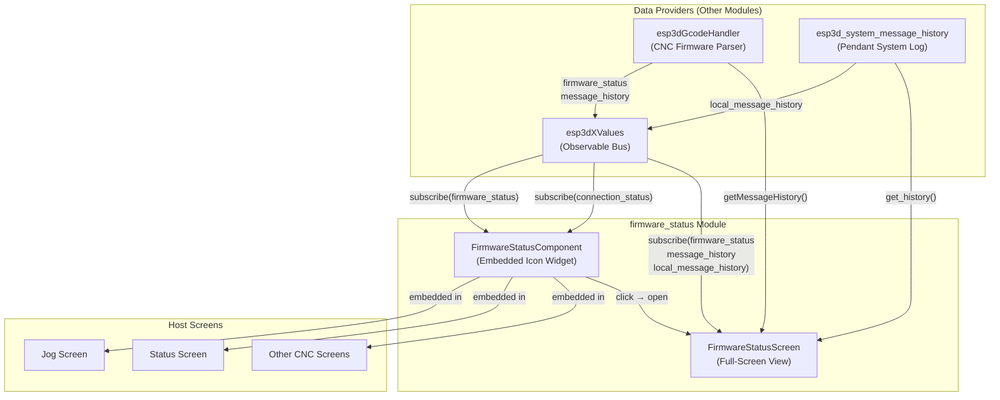
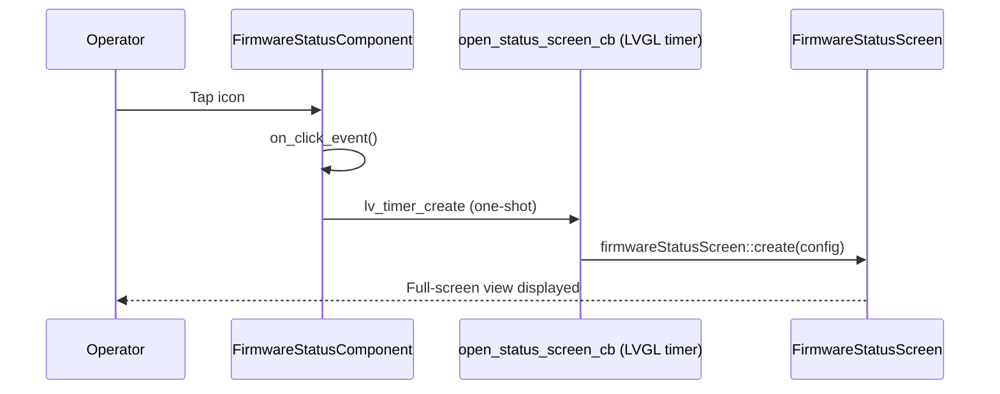
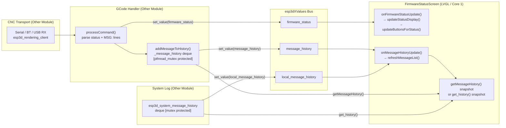
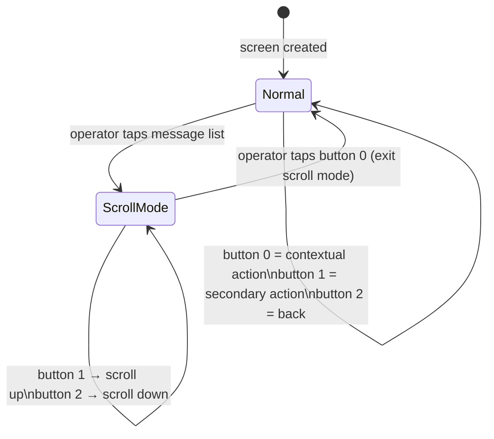
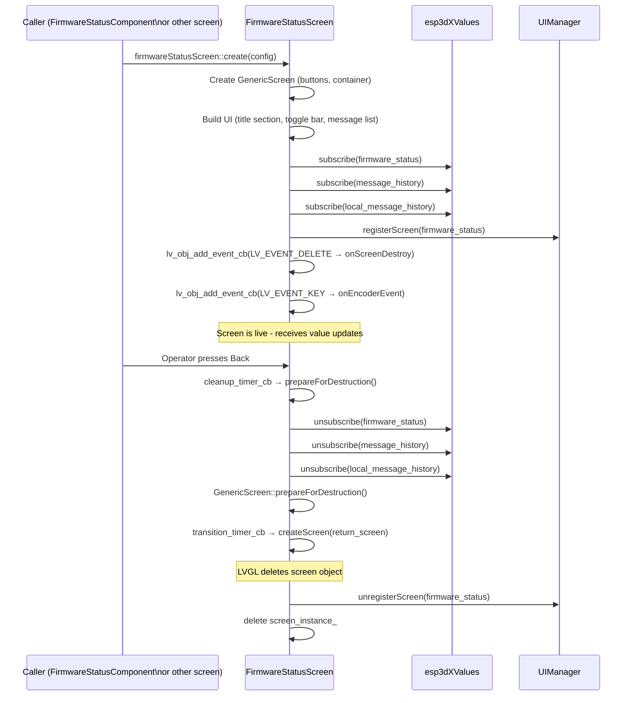
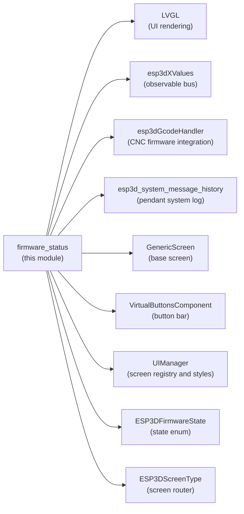

# firmware_status Module

## Introduction

The `firmware_status` module is a CNC-specific UI module that surfaces the live state of the connected CNC firmware to the operator. It is composed of two complementary pieces:

| Piece | Files | Role |
|---|---|---|
| **FirmwareStatusComponent** | `main/display/cnc/components/firmware_status.h` | Compact, always-visible icon embedded inside other screens. Clicking it opens the full-screen view. |
| **FirmwareStatusScreen** | `main/display/cnc/screens/firmware_status_screen.h/.cpp` | Full-screen view with a dynamic header, scrollable message history, and contextual control buttons. |

Both pieces are pure consumers. All CNC state comes through the `esp3dXValues` observable bus (see [values](values.md)) and the underlying data is provided by the target-specific GCode handler service (see [CNC Firmware Integration](CNC_Firmware_Integration.md)).

---

## Architecture Overview



---

## Component 1: FirmwareStatusComponent

### Purpose

`FirmwareStatusComponent` is a reusable LVGL widget that host screens embed to give operators a persistent, at-a-glance view of the CNC firmware state. It is a clickable icon: tapping it transitions to `FirmwareStatusScreen`.

### Configuration

```cpp
// firmware_status.h
struct FirmwareStatusConfig {
    lv_align_t align = LV_ALIGN_TOP_LEFT;
    int32_t x_offset = 0;
    int32_t y_offset = 0;
    ESP3DScreenType return_screen = ESP3DScreenType::main;
    void (*prepare_parent_screen_destruction)(void) = nullptr;
};
```

| Field | Description |
|---|---|
| `align` | LVGL alignment anchor within the parent container |
| `x_offset` / `y_offset` | Position offsets from the anchor point |
| `return_screen` | Screen to return to when the operator closes `FirmwareStatusScreen` |
| `prepare_parent_screen_destruction` | Optional callback invoked before the host screen is destroyed during the navigation transition |

### Visual Structure

```
┌─────────────────────────┐
│  [Status Icon]          │  ← lv_img (icon changes with firmware state)
│  [Press Circle]         │  ← feedback circle on tap
└─────────────────────────┘
```

The icon imagery maps to `ESP3DFirmwareState` values (defined in `main/display/cnc/esp3d_firmware_states.h`):

| State | Icon variable | Meaning |
|---|---|---|
| `Unknown` | `status_s` | Not connected / state unknown |
| `idle` | `idle_s` | Machine idle, ready |
| `run` | `run_s` | Executing a job |
| `alarm` | `alarm_s` | Alarm condition |
| `check` | `check_s` | Check mode (dry run) |
| `door` | `door_s` | Door interlock open |
| `hold` | `hold_s` | Feed hold active |
| `home` | `home_s` | Homing cycle |
| `sleep` | `sleep_s` | Sleep mode |
| `jog` | `jog_s` | Jogging |
| `tool` | `tools_s` | Tool change |
| `error` | `error_s` | Error state |

### Value Subscriptions

| Index | Handler | Effect |
|---|---|---|
| `ESP3DValuesIndex::firmware_status` | `static_on_status_update` | Redraws the icon to match the new firmware state |
| `ESP3DValuesIndex::connection_status` | `static_on_connection_update` | Shows or hides the component based on connection availability |

### Navigation Flow



The timer indirection keeps the LVGL event callback short and non-blocking (LVGL constraint: no heavy work inside event callbacks; no screen destruction from within an event).

### Static Position Helpers

```cpp
static int32_t    get_x_position(bool get_orientation = true);
static int32_t    get_y_position(bool get_orientation = true);
static lv_align_t get_alignment(bool get_orientation = true);
```

These helpers let host screens place the component consistently across all display orientations without duplicating layout arithmetic.

---

## Component 2: FirmwareStatusScreen

### Purpose

`FirmwareStatusScreen` is the full-screen detail view. It provides:
- A **status header** whose background color reflects the urgency of the firmware state.
- A **scrollable message list** that can display either remote CNC firmware messages (`MSG:ERR`, `MSG:INFO`) or the pendant's own local system messages.
- **Contextual action buttons** whose icons and behaviour adapt to the current firmware state.
- **Encoder scrolling** for the message list (hardware encoder or virtual button scroll mode).

### Configuration

```cpp
// firmware_status_screen.h
struct FirmwareStatusScreenConfig {
    ESP3DScreenType return_screen = ESP3DScreenType::main;
};
```

`return_screen` is the screen recreated when the operator presses Back. There is no `prepare_parent_screen_destruction` callback because the parent screen is always recreated via `createScreen()`, not restored from a saved state.

### Screen Layout

```
┌──────────────────────────────────────────────┐
│ [Icon]  [STATUS TEXT]           title_section │  ← color-coded by state
├──────────────────────────────────────────────┤
│     [RemoteName / LocalName  ⟳]              │  ← source_toggle_bar (clickable)
├──────────────────────────────────────────────┤
│                                              │
│  MSG: Latest message (newest first)          │  ← message_list
│  MSG: Older message                          │    (scrollable, flex-column)
│  MSG: Oldest visible                         │
│  ...                                         │
│                                              │
├──────────────────────────────────────────────┤
│  [Action]     [Secondary]       [Back]       │  ← VirtualButtonsComponent
└──────────────────────────────────────────────┘
```

### State → Visual Mapping

| Firmware State | Header Color Token | Primary Button | GCode Sent | Secondary Button | GCode Sent |
|---|---|---|---|---|---|
| `ALARM` | `ESP3D_ACCENT_ALERT_COLOR` | `alarm_off_b` | `$X` (unlock) | `soft_reset_b` | `0x18` (soft reset) |
| `HOLD` | `ESP3D_ACCENT_ACTION_COLOR` | `play_b` | `~` (resume) | `refresh_b` | `?` (status query) |
| `RUN` | `ESP3D_ACCENT_SELECT_COLOR` | `hold_feed_b` | `!` (feed hold) | `refresh_b` | `?` (status query) |
| `JOG` | `ESP3D_ACCENT_SELECT_COLOR` | `stop_jog_b` | `0x85` (jog cancel) | `refresh_b` | `?` (status query) |
| `IDLE` | `ESP3D_ACCENT_ACTIVE_COLOR` | `soft_reset_b` | `0x18` (soft reset) | `refresh_b` | `?` (status query) |
| `ERROR` | `ESP3D_ACCENT_ALERT_COLOR` | `soft_reset_b` | `0x18` (soft reset) | `refresh_b` | `?` (status query) |
| Others | `ESP3D_ACCENT_SELECT_COLOR` | `soft_reset_b` | `0x18` (soft reset) | `refresh_b` | `?` (status query) |

The Back button (button 2) always navigates to `return_screen`. None of the contextual buttons close the screen — the operator can issue multiple commands without leaving the view.

### Value Subscriptions

| Index | Source | Handler | Effect |
|---|---|---|---|
| `ESP3DValuesIndex::firmware_status` | `esp3dGcodeHandler` | `onFirmwareStatusUpdate` | Updates header color, icon, title text, and button set |
| `ESP3DValuesIndex::message_history` | `esp3dGcodeHandler` | `onMessageHistoryUpdate` | Rebuilds message list when Remote source is active |
| `ESP3DValuesIndex::local_message_history` | `esp3d_system_message_history` | `onMessageHistoryUpdate` | Rebuilds message list when Local source is active |

---

## Data Flow



### Sticky-Scroll Anti-Churn

`refreshMessageList()` only rebuilds the LVGL child list when the view is already scrolled to the top (newest messages). If the operator has scrolled down to review older messages, incoming update notifications are silently skipped until the operator scrolls back to the top. This prevents a rapid stream of incoming firmware messages from fighting the operator's scroll position.

---

## Message Source Toggle

The source toggle bar lets the operator switch the message list between two sources at runtime without leaving the screen:

```
Remote  (default) → esp3dGcodeHandler.getMessageHistory()
                    Shows CNC firmware MSG:ERR and MSG:INFO lines
                    Error lines: ESP3D_INDICATOR_ERROR_COLOR
                    Info lines:  ESP3D_INDICATOR_INFO_COLOR

Local             → esp3d_system_message_get_history()
                    Shows pendant system messages (e.g. resource/theme warnings)
                    Error:   ESP3D_INDICATOR_ERROR_COLOR
                    Warning: ESP3D_INDICATOR_WARNING_COLOR
                    Info:    ESP3D_INDICATOR_INFO_COLOR
```

`onMessageHistoryUpdate()` compares the incoming notification index against the currently visible source and only redraws when they match, avoiding unnecessary LVGL work for the hidden source.

---

## Encoder / Scroll Interaction

### Hardware Encoder (`ESP3D_HARDWARE_ENCODER_FEATURE` defined)

The screen registers `onEncoderEvent()` on `LV_EVENT_KEY`. On each encoder step:
1. Checks scroll limits (`lv_obj_get_scroll_top` / `lv_obj_get_scroll_bottom`).
2. Plays a directional beep (`ESP3D_MOVEMENT_FORWARD_BEEP` / `ESP3D_MOVEMENT_BACKWARD_BEEP`).
3. Scrolls by `ENCODER_SCROLL_STEP` (15 px) via `lv_obj_scroll_by(..., LV_ANIM_ON)`.

### Virtual Buttons (no hardware encoder)



In scroll mode, buttons 1 and 2 emit synthetic encoder steps (`emitEncoderStep(±1)`) which are processed by `onEncoderEvent()`, keeping the scroll logic in one place and eliminating code duplication.

---

## Screen Lifecycle



Key lifecycle rules (consistent with the project-wide screen transition pattern):

- **No direct screen destruction inside event callbacks.** All transitions go through one-shot LVGL timers (`cleanup_timer_cb` → `prepareForDestruction` → `transition_timer_cb`).
- `prepareForDestruction()` is idempotent (guarded by `is_prepared_for_destruction_`). `LV_EVENT_DELETE` safely calls it a second time if the timer path already ran.
- After unsubscribing, all static UI pointers (`title_label_`, `message_list_`, etc.) are set to `nullptr` so stale subscription callbacks cannot access freed LVGL objects.

---

## Dependencies



| Dependency | Module Doc | Role |
|---|---|---|
| LVGL | — | All UI object creation, layout, events, and rendering |
| `esp3dXValues` | [values](values.md) | Observable bus; the module subscribes to three indices |
| `esp3dGcodeHandler` | [CNC Firmware Integration](CNC_Firmware_Integration.md) | Remote message history provider and GCode command sink |
| `esp3d_system_message_history` | [esp3d_core](esp3d_core.md) | Local (pendant) message history provider |
| `GenericScreen` | [UI Framework & Screens](UI_Framework_and_Screens.md) | Base screen providing container, rotation support, and button bar |
| `VirtualButtonsComponent` | [UI Framework & Screens](UI_Framework_and_Screens.md) | Three-button bar with runtime icon and color updates |
| `UIManager` | [UI Framework & Screens](UI_Framework_and_Screens.md) | Style application, screen registry, orientation angle |
| `ESP3DFirmwareState` | — (`esp3d_firmware_states.h`) | Canonical state enum shared with `FirmwareStatusComponent`'s icon mapper |
| `ESP3DScreenType` | — | Typed screen identifiers for the router |

---

## Threading and Safety Notes

| Concern | Mitigation |
|---|---|
| `_message_history` deque written from CNC RX task (Core 0) | `pthread_mutex_t` in the provider; callers always snapshot via `getMessageHistory()` — the live deque is never iterated directly |
| `esp3d_system_message_history` deque written from logging hooks | Mutex in the provider; callers use `esp3d_system_message_get_history()` which returns a snapshot copy |
| Value subscription callbacks invoked on Core 1 (LVGL task) | All LVGL object updates remain inside subscription callbacks — no cross-core LVGL calls |
| Screen deletion inside LVGL event callbacks | Prohibited; all destruction paths use one-shot LVGL timers to defer work out of the event context |
| Rapid firmware message stream vs. operator scroll position | Sticky-scroll check in `refreshMessageList()` — rebuilds child list only when the view is pinned to the top |

---

## Key Functions Reference

### FirmwareStatusComponent

| Function | Description |
|---|---|
| `FirmwareStatusComponent(parent, host_screen, config, angle)` | Creates the icon widget and subscribes to value updates |
| `~FirmwareStatusComponent()` | Unsubscribes from values and destroys LVGL objects |
| `updateOrientation(angle)` | Repositions the icon for a new display rotation |
| `updatePosition(align, x, y)` | Moves the icon within its parent |
| `updateConfig(config)` | Updates the return screen and destruction callback |
| `prepareForDestruction()` | Unsubscribes values before the host screen is destroyed |
| `get_x_position(orientation)` | Static: returns orientation-aware X offset |
| `get_y_position(orientation)` | Static: returns orientation-aware Y offset |
| `get_alignment(orientation)` | Static: returns orientation-aware LVGL alignment |

### FirmwareStatusScreen (namespace `firmwareStatusScreen`)

| Function | Description |
|---|---|
| `create(config)` | Builds and registers the full screen |
| `onFirmwareStatusUpdate(idx, value, action)` | Subscription callback: updates header color, icon, and button set |
| `onMessageHistoryUpdate(idx, value, action)` | Subscription callback: conditionally rebuilds message list for the active source |
| `onSourceTogglePressed(e)` | Toggles the message list source between Remote (firmware) and Local (pendant) |
| `onEncoderEvent(e)` | Handles hardware encoder steps to scroll the message list |
| `on_action_press/release(idx, ...)` | Button 0: sends the context-appropriate GCode command |
| `on_secondary_press/release(idx, ...)` | Button 1: sends secondary command (soft reset for ALARM, status query otherwise) |
| `on_back_press/release(idx, ...)` | Button 2: initiates timer-based transition back to `return_screen` |
| `cleanup_timer_cb(timer)` | Runs `prepareForDestruction()` then arms the transition timer |
| `transition_timer_cb(timer)` | Calls `createScreen(next_screen_target_)` to recreate the parent screen |
| `onScreenDestroy(e)` | `LV_EVENT_DELETE` handler: unregisters from UIManager and deletes the instance |

---

## Related Documentation

- [UI Framework & Screens](UI_Framework_and_Screens.md) — `GenericScreen` base class, screen lifecycle patterns, transition macros
- [CNC Firmware Integration](CNC_Firmware_Integration.md) — GCode handler service, message history provider, realtime command constants
- [values](values.md) — `ESP3DValues` observable bus, subscription model, value indices
- [esp3d_core](esp3d_core.md) — System message history (`ESP3DSystemMessage`, `ESP3DSystemMessageType`)
- [theme_palette](https://github.com/luc-github/Pibot-cnc-pendant-firmware/blob/main/docs/ui_resources/theme_palette.md) — Semantic color tokens referenced in state-to-color mapping
- [development](https://github.com/luc-github/Pibot-cnc-pendant-firmware/blob/main/docs/ui_resources/development.md) — Icon and font management (icon variables such as `idle_s`, `alarm_s`)
