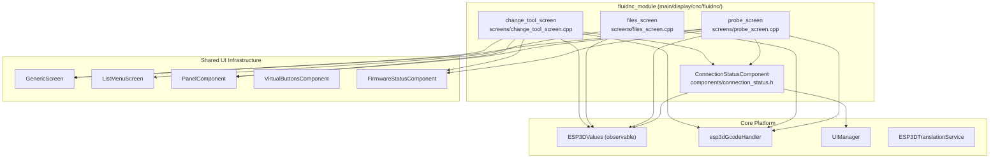
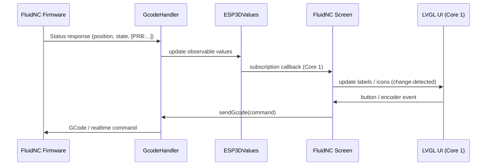
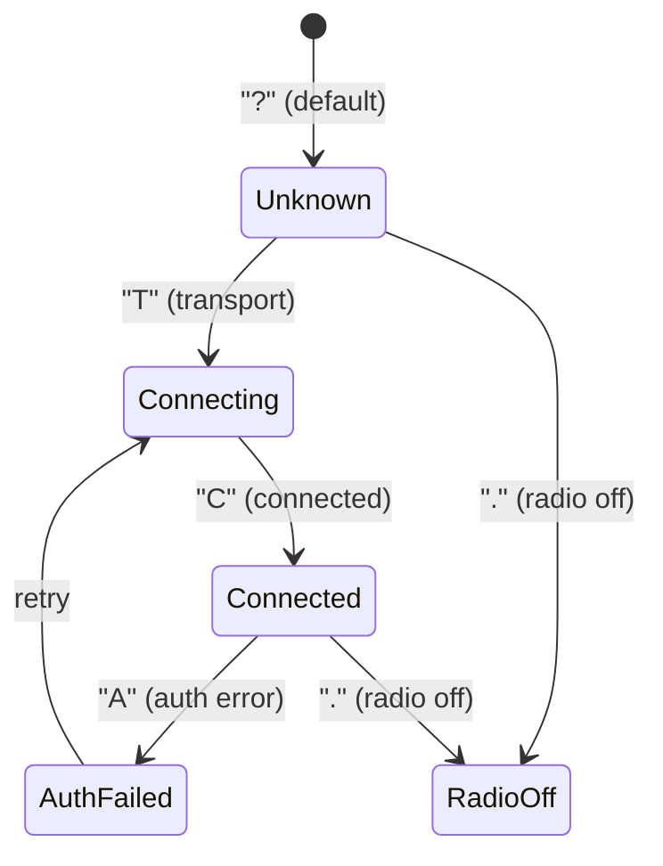
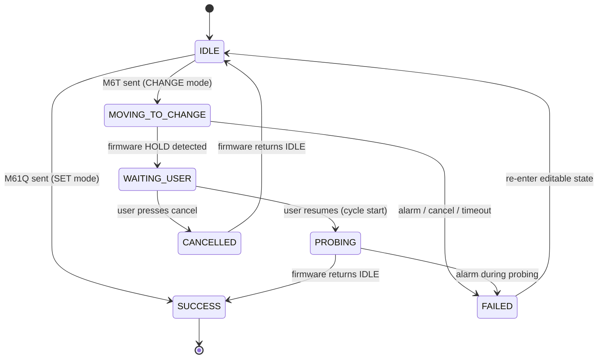
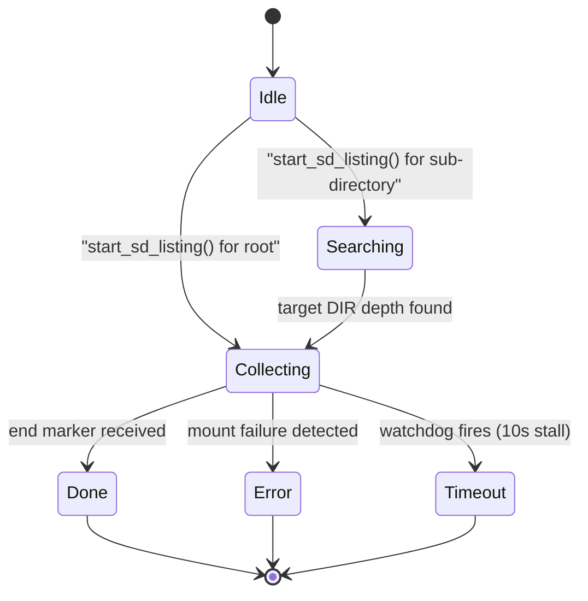
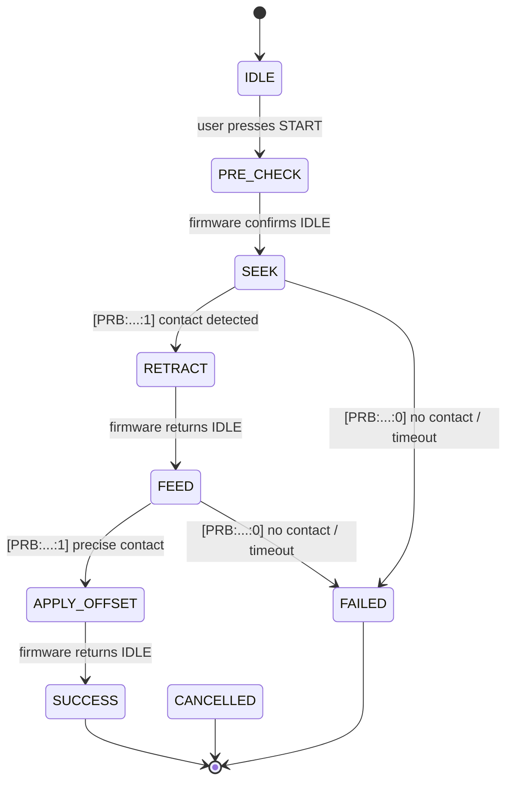
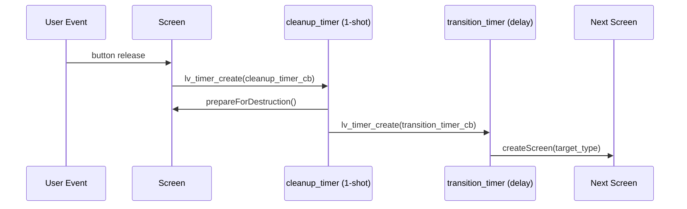

# FluidNC Module

## Overview

The `fluidnc_module` provides the **FluidNC-specific UI layer** for the Pibot CNC pendant firmware. It sits at the bottom of the `UI_Framework_&_Screens` hierarchy and implements three operational screens plus one shared component that are specific to the FluidNC firmware communication protocol.

FluidNC uses distinct GCode extensions and status formats (`$SD/List`, `M6T<n>`, `M61Q<n>`, `[PRB:...]`, `$SD/Run=`, `$SD/Delete=`, `$SD/Rename=`) that differ from grbl and grblHAL. This module encapsulates all of that protocol-specific logic and keeps the shared CNC screens clean.

### Position in the Architecture

```
UI_Framework_&_Screens
└── cnc_shared                    (shared CNC screens: jog, status, macros, settings)
    └── fluidnc_module            ← THIS MODULE
        ├── components/
        │   └── connection_status (clickable connection state indicator)
        └── screens/
            ├── change_tool       (M6T / M61Q tool change workflow)
            ├── files             (SD card browser: $SD/List)
            └── probe             (G38.2 touch-probe sequence)
```

Sibling modules for other firmware targets follow the same pattern:
- `grbl_module` — grbl-specific screens
- `grblhal_module` — grblHAL-specific screens

---

## Architecture Overview



---

## Component Relationships and Data Flow



---

## Sub-Modules

### 1. Connection Status Component

**File:** `main/display/cnc/fluidnc/components/connection_status.h`  
**Documentation:** [fluidnc_module_connection_status.md](fluidnc_module_connection_status.md)

A lightweight, reusable overlay component that renders the current connection state as a clickable icon. It maps five connection state characters (`?`, `A`, `T`, `C`, `.`) to distinct visual states and opens the shared `connection_status_screen` on click.

Placed at a corner of every FluidNC screen (`change_tool`, `probe`) and exposes a static position-helper API (`get_alignment()`, `get_x_position()`, `get_y_position()`) so screens can place it correctly regardless of display orientation.



---

### 2. Change Tool Screen

**File:** `main/display/cnc/fluidnc/screens/change_tool_screen.cpp`  
**Documentation:** [fluidnc_module_change_tool.md](fluidnc_module_change_tool.md)

Implements the full FluidNC tool change workflow, supporting two modes:

| Mode | GCode | Behavior |
|------|-------|----------|
| **SET** (M61Q) | `M61Q<n>` | Set current tool number without movement. Fast, always allowed. |
| **CHANGE** (M6T) | `M6T<n>` | Full ATC manual sequence: move to tool change position → HOLD pause → user installs tool → resume → ETS probe. |

Internal state machine:



After an M61Q (SET) success, the screen optionally navigates to the [`probe_screen`](fluidnc_module_probe.md) to touch-probe the new tool length.

**Key implementation features:**
- Position display (MPos + WPos for X/Y/Z) with 250 ms throttling to protect LVGL from 10 Hz flooding
- 60-second safety timeout with graceful `M61Q` revert on expiry
- Encoder-navigable tool selector (mode toggle + target tool number) via `PanelComponent`

---

### 3. Files Screen

**File:** `main/display/cnc/fluidnc/screens/files_screen.cpp`  
**Documentation:** [fluidnc_module_files.md](fluidnc_module_files.md)

An SD card file browser built on `ListMenuScreen` that uses FluidNC's `$SD/List` streaming protocol. Files arrive asynchronously as `[DIR:name]` / `[FILE:name|SIZE:bytes]` lines published through `ESP3DValuesIndex::firmware_file_entry`.



**Four file action modes** (controlled by hardware switch or touch footer toggle):

| Mode | Action on file selection |
|------|--------------------------|
| Process | Launch `$SD/Run=<path>` → navigate to status screen |
| Macro | Toggle file as macro via `macroManager` |
| Rename | Open text input → `$SD/Rename=<old>><new>` |
| Delete | Confirm dialog → `$SD/Delete=<path>` |

**Memory safety:** collection halts when free heap falls below 30 KB. A 10-second watchdog timer fires if no new entries arrive.

---

### 4. Probe Screen

**File:** `main/display/cnc/fluidnc/screens/probe_screen.cpp`  
**Documentation:** [fluidnc_module_probe.md](fluidnc_module_probe.md)

Implements a 4-step touch-probe sequence using standard G-code (G38.2, G1, G10 L20 P0). Supports all FluidNC axes (X/Y/Z/A/B/C) with per-axis parameter sets (Offset, MaxTravel, Retract, FeedRate).



| Step | GCode sent | Purpose |
|------|-----------|---------|
| PRE_CHECK | `?` (realtime) | Verify machine is IDLE |
| SEEK | `G91 G38.2 <axis><travel> F<rate>` | Fast probe pass |
| RETRACT | `G91 G1 <axis><retract> F200` | Back away from surface |
| FEED | `G91 G38.2 <axis><travel> F<rate/2>` | Slow precise probe |
| APPLY_OFFSET | `G10 L20 P0 <axis><offset>` | Set work coordinate zero |

**Timeout safety:** calculated dynamically as `(|max_travel| / feed_rate) × 60 × 1.5 + 5s`, clamped between 10s and 120s.

The screen returns a `ProbeResult` (`SUCCESS` / `FAILED` / `CANCELLED` / `NONE`) via a static inter-screen API, allowing `change_tool_screen` to chain probe after tool set.

---

## Key Shared Patterns

### Value Subscriptions

All FluidNC screens subscribe to `ESP3DValues` observables and react to changes in the LVGL task (Core 1). The subscribe/unsubscribe lifecycle is tied to screen creation and `prepareForDestruction()`.

| Value Index | Used by |
|-------------|---------|
| `server_status` | ConnectionStatusComponent (all screens) |
| `firmware_status` | change_tool, probe, files |
| `parser_state` | change_tool (extracts current tool `T<n>`) |
| `firmware_file_entry` | files (SD listing stream) |
| `probe_status` | probe (`[PRB:x,y,z:ok]`) |
| `position_wx/wy/wz` | change_tool, probe |
| `position_mx/my/mz` | change_tool, probe |
| `axis_count` | probe |
| `axis_names` | probe (grblHAL UVW support) |
| `pin_states` | probe (limit switch indicators) |

### Screen Transition Pattern

All screens follow the same safe two-timer transition pattern to avoid destroying LVGL objects inside event callbacks:



The macros `ESP3D_TRANSITION_START`, `ESP3D_CLEANUP_TIMER_BODY`, and `ESP3D_TRANSITION_TIMER_BODY` encode this pattern consistently.

### Position Display Throttling

All screens displaying machine/work position implement a 250 ms per-group throttle plus a flush timer to catch skipped values:

```
Subscription rate:  ~10 Hz per axis (6 axes = 60 callbacks/s)
Throttle gate:      250 ms per WPos group / 250 ms per MPos group
position_flush_timer: ~300 ms period, fires if any pending flag is set
```

This is critical for LVGL responsiveness — unthrottled updates would trigger 60 redraws per second.

---

## Dependencies

| Dependency | Role |
|------------|------|
| `UI_Framework_&_Screens` → `cnc_shared` | GenericScreen, ListMenuScreen, FirmwareStatusComponent, PanelComponent, VirtualButtonsComponent |
| `Core_Platform_&_Infrastructure` | ESP3DValues, ESP3DSettings, ESP3DTranslationService |
| `CNC_Firmware_Integration` | esp3dGcodeHandler, ESP3DGCodeHandlerService (FluidNC target) |
| LVGL (ESP-IDF component) | UI rendering, timers, events |

---

## Related Documentation

- [fluidnc_module_connection_status.md](fluidnc_module_connection_status.md) — ConnectionStatusComponent detail
- [fluidnc_module_change_tool.md](fluidnc_module_change_tool.md) — Tool change screen detail
- [fluidnc_module_files.md](fluidnc_module_files.md) — Files screen detail
- [fluidnc_module_probe.md](fluidnc_module_probe.md) — Probe screen detail


## Documents de conception (depot)

- [fluidnc](https://github.com/luc-github/Pibot-cnc-pendant-firmware/blob/main/docs/ux_flows/fluidnc/)


## Documents de conception (depot)

- [pibot_fluidnc_connection_comparison](https://github.com/luc-github/Pibot-cnc-pendant-firmware/blob/main/docs/pibot_fluidnc_connection_comparison.md)
