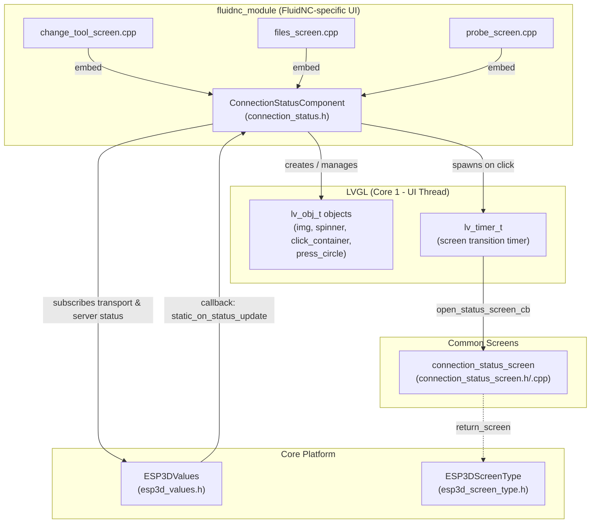
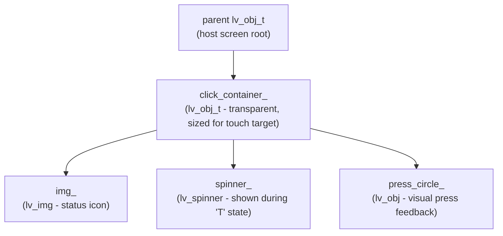
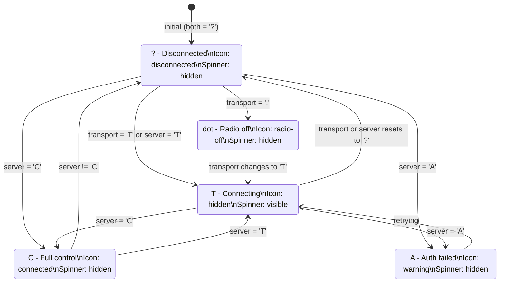
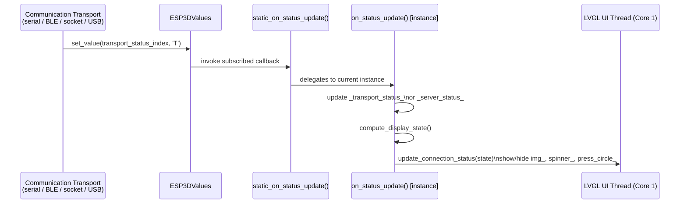
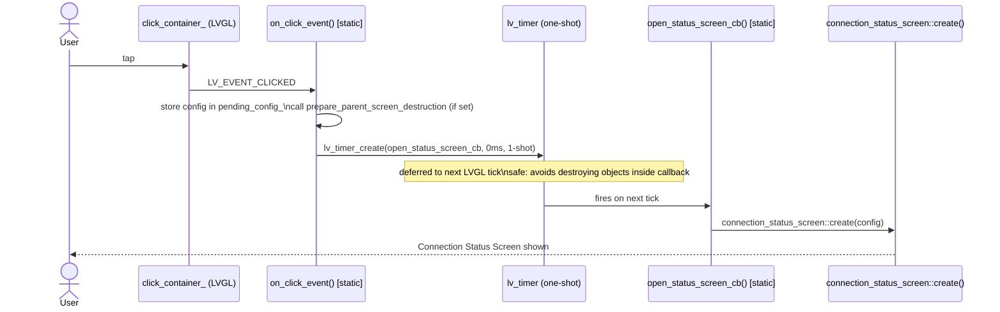
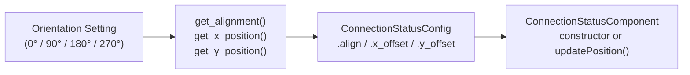
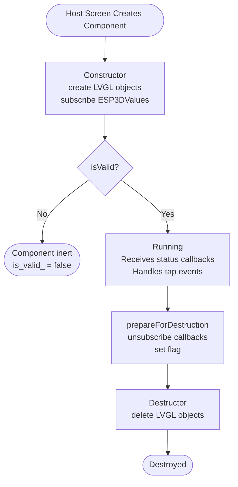

# FluidNC Module — Connection Status Component

## Introduction

The `fluidnc_module_connection_status` module defines a compact, **clickable LVGL UI widget** that continuously reflects the live connection state between the pendant and the FluidNC CNC controller. It renders an icon (or animated spinner) in a corner of any host screen and navigates to the [`connection_status_screen`](connection_status_screen.md) when the user taps it.

**Source file:** `main/display/cnc/fluidnc/components/connection_status.h`

> **Sibling components:** Structurally identical variants exist for the other supported CNC firmwares:
> - Grbl — `main/display/cnc/grbl/components/connection_status.h`
> - GrblHAL — `main/display/cnc/grblhal/components/connection_status.h`
>
> All three share the same public API and behaviour; only the firmware-specific status parsing differs in their `.cpp` implementations.

---

## Architecture Overview



The component is an **embedded sub-widget** — host screens (change_tool, files, probe) instantiate it directly, passing their own `lv_obj_t*` as the parent. It is not a full screen; it lives on top of whatever screen currently has focus.

---

## Component Types

### `ConnectionStatusConfig`

A plain-data configuration struct passed to the component at construction (and updatable at runtime via `updateConfig()`).

```cpp
struct ConnectionStatusConfig {
    lv_align_t align = LV_ALIGN_TOP_RIGHT;          // LVGL alignment anchor
    int32_t    x_offset = 0;                         // Pixel offset from anchor (X)
    int32_t    y_offset = 0;                         // Pixel offset from anchor (Y)
    ESP3DScreenType return_screen = ESP3DScreenType::main; // Where to go after connection_status_screen closes
    void (*prepare_parent_screen_destruction)(void) = nullptr; // Optional teardown hook
};
```

| Field | Purpose |
|---|---|
| `align` | LVGL alignment constant — defaults to top-right corner |
| `x_offset` / `y_offset` | Fine-tune pixel position relative to the anchor |
| `return_screen` | The screen to restore when the user closes the connection status screen |
| `prepare_parent_screen_destruction` | Callback invoked just before the host screen is destroyed during a navigation transition |

---

### `ConnectionStatusComponent`

The widget class. It owns the LVGL object tree for the indicator and manages the full lifecycle of subscriptions and timers.

#### Public API

| Method | Description |
|---|---|
| `ConnectionStatusComponent(parent, host_screen, config, angle)` | Constructor — builds LVGL objects, subscribes to value callbacks, sets initial visual state |
| `~ConnectionStatusComponent()` | Destructor — unsubscribes callbacks (if not already done), deletes LVGL objects |
| `updateOrientation(angle)` | Repositions the indicator when the screen rotates (0°, 90°, 180°, 270°) |
| `updatePosition(align, x, y)` | Moves the indicator to a new anchor without reconstructing it |
| `updateConfig(config)` | Replaces the full config at runtime |
| `prepareForDestruction()` | Unsubscribes from `ESP3DValues` and marks a flag; safe to call inside an LVGL event callback |
| `isValid()` | Returns `true` if construction succeeded and the component is operational |
| `get_x_position(get_orientation)` | Static helper — returns the correct X offset for the current or a default orientation |
| `get_y_position(get_orientation)` | Static helper — Y offset |
| `get_alignment(get_orientation)` | Static helper — `lv_align_t` for the current orientation |
| `getHostScreen()` | Static — returns which screen type currently owns the component |

---

## LVGL Object Hierarchy



- **`click_container_`** — an invisible, touch-sized container registered with the `LV_EVENT_CLICKED` callback. Sizing it larger than the icon ensures a comfortable touch target on small displays.
- **`img_`** — renders the status icon image from the `ui_resources` partition.
- **`spinner_`** — an animated LVGL spinner, made visible only when the state is **connecting** (`T`).
- **`press_circle_`** — a translucent circle that flashes briefly when the user taps, providing tactile feedback.

---

## Connection State Model

The component tracks **two independent status characters** — one for the transport layer, one for the CNC server — and merges them into a single display state.



### Status Characters Reference

| Char | Semantic | Visual |
|------|----------|--------|
| `?` | Disconnected / no signal | Disconnected icon |
| `.` | Radio off (WiFi/BT disabled) | Radio-off icon |
| `T` | Transport or server connecting | Animated spinner |
| `A` | Authentication failed | Warning icon |
| `C` | Connected — full CNC control | Connected icon |

The private method `compute_display_state()` maps the combination of `_transport_status_` and `_server_status_` to a single `uint8_t` state code, which `update_connection_status()` then uses to select the correct LVGL visual.

---

## Data Flow — Status Update



**Why static callbacks?** `ESP3DValues::subscribe()` accepts a plain function pointer (`callbackFunctionPtr_t`). C++ non-static member function pointers are not compatible with plain function pointers. The static wrapper `static_on_status_update` holds a reference to the current instance via `host_screen_static_`, bridging the two worlds while keeping instance state private.

---

## Click → Screen Transition Flow



> **LVGL safety rule:** Screen objects must never be destroyed *inside* an event callback — doing so risks use-after-free within the same LVGL dispatch cycle. The one-shot timer defers the screen switch to the next tick, which is the established safe pattern throughout this codebase. See [`screen_transitions_flow.md`](https://github.com/luc-github/Pibot-cnc-pendant-firmware/blob/main/docs/architecture/screen_transitions_flow.md) for the full rationale.

---

## Orientation Support

The pendant may be mounted in any of four orientations. The component supports this via:

- **`updateOrientation(angle)`** — called by the host screen when the encoder or settings change the display angle.
- **Static helpers** (`get_x_position`, `get_y_position`, `get_alignment`) — allow host screens to query the correct placement *before* the component is constructed, so the initial `ConnectionStatusConfig` is already orientation-correct.



---

## Lifecycle



`prepareForDestruction()` is intentionally separated from the destructor so host screens can call it safely during LVGL event callbacks before the C++ destructor runs. This two-phase teardown avoids stale callback invocations after the containing screen has begun destruction.

---

## Static Members — Design Rationale

Three members are `static` on the class:

| Static Member | Role |
|---|---|
| `host_screen_static_` | Tracks which `ESP3DScreenType` currently owns the component; used by the static callback to route updates to the correct instance |
| `screen_timer_` | Holds the pending one-shot timer handle; prevents double-creation if the user taps rapidly |
| `pending_config_` | Stores the config captured at click time so `open_status_screen_cb` can read it after the instance may have been torn down |

Only **one** `ConnectionStatusComponent` is active per screen at a time, which is why these can safely be static.

---

## Dependencies

| Dependency | What it provides |
|---|---|
| `esp3d_values.h` ([ESP3DValues module](values.md)) | Observable value bus — `subscribe()` / `unsubscribe()`, delivers transport and server status updates |
| `screens/esp3d_screen_type.h` | `ESP3DScreenType` enum identifying all navigable screens |
| `connection_status_screen.h/.cpp` ([Common Screens](connection_status_screen.md)) | The full-screen overlay opened on tap; accepts `ConnectionStatusScreenConfig` carrying `return_screen` |
| LVGL (`lvgl.h`) | Widget toolkit — `lv_obj_t`, `lv_img`, `lv_spinner`, `lv_timer`, event system |

---

## Integration Example

```cpp
// Inside a FluidNC host screen's create() function:

ConnectionStatusConfig cs_config;
cs_config.align          = ConnectionStatusComponent::get_alignment();
cs_config.x_offset       = ConnectionStatusComponent::get_x_position();
cs_config.y_offset       = ConnectionStatusComponent::get_y_position();
cs_config.return_screen  = ESP3DScreenType::main;
cs_config.prepare_parent_screen_destruction = myScreen::prepareForDestruction;

auto* cs_component = new ConnectionStatusComponent(
    screen_obj,                 // parent lv_obj_t*
    ESP3DScreenType::main,      // host screen identity
    cs_config,
    current_orientation_angle   // int32_t degrees
);

if (!cs_component->isValid()) {
    delete cs_component;
    // handle error
}
```

During screen teardown:

```cpp
// Safe to call from inside an LVGL event callback:
cs_component->prepareForDestruction();
// Destructor runs when the object goes out of scope or is deleted.
```

---

## Related Documentation

| Document | Topic |
|---|---|
| [`connection_status_screen.md`](connection_status_screen.md) | The full-screen overlay this component opens on tap |
| [`screen_transitions_flow.md`](https://github.com/luc-github/Pibot-cnc-pendant-firmware/blob/main/docs/architecture/screen_transitions_flow.md) | Safe screen transition patterns (timer-based destroy) |
| [`screens_architecture.md`](https://github.com/luc-github/Pibot-cnc-pendant-firmware/blob/main/docs/architecture/screens_architecture.md) | Overall screen / component architecture |
| [`values.md`](values.md) | `ESP3DValues` observable system — how status subscriptions work |
| [`connection_management.md`](https://github.com/luc-github/Pibot-cnc-pendant-firmware/blob/main/docs/architecture/connection_management.md) | Transport lifecycle and the `?` / `T` / `C` / `A` / `.` status model |
| [`fluidnc_module_change_tool.md`](fluidnc_module_change_tool.md) | Sibling FluidNC screen that embeds this component |
| [`fluidnc_module_files.md`](fluidnc_module_files.md) | Sibling FluidNC screen that embeds this component |
| [`fluidnc_module_probe.md`](fluidnc_module_probe.md) | Sibling FluidNC screen that embeds this component |
